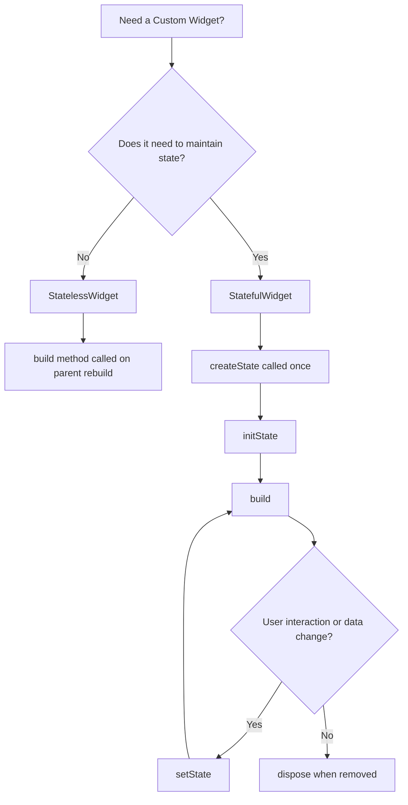
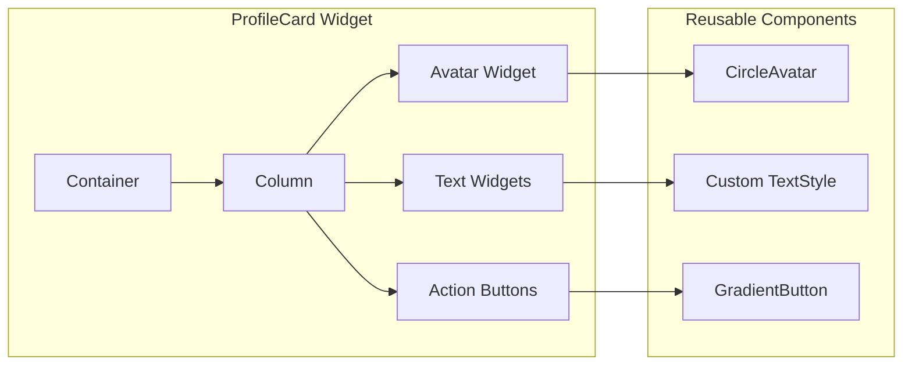
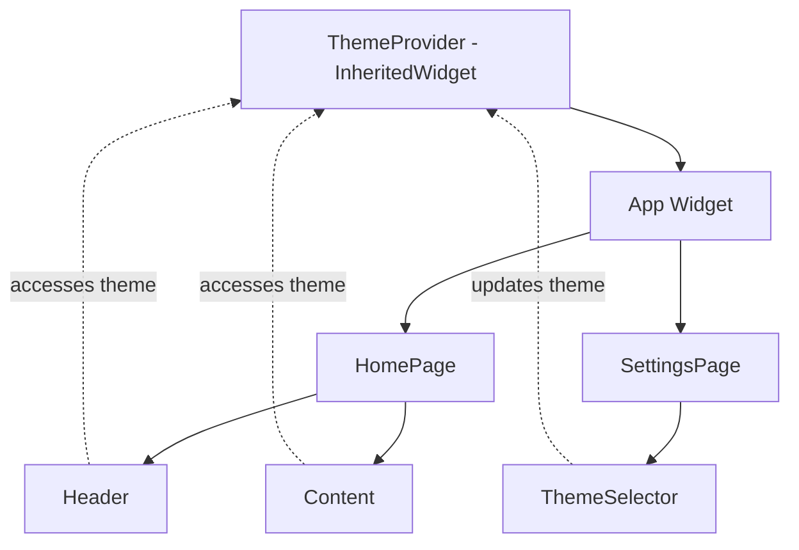

# How to Build Custom Widgets in Flutter

Author: [nawazdhandala](https://github.com/nawazdhandala)

Tags: Flutter, Dart, Mobile Development, Custom Widgets, UI Components, Cross-Platform

Description: Learn how to build reusable custom widgets in Flutter from scratch. Covers stateless and stateful widgets, composition patterns, custom painters, and best practices for creating maintainable UI components.

---

Building custom widgets in Flutter is essential for creating unique, maintainable, and reusable user interfaces. Flutter's widget-based architecture provides incredible flexibility, allowing developers to compose simple widgets into complex UI components that perfectly match their design requirements.

Every Flutter developer eventually reaches a point where built-in widgets no longer satisfy specific project needs. At that point, understanding how to create custom widgets becomes a critical skill. Whether you need a specialized button, a complex data visualization component, or an animated interaction element, custom widgets are the answer.

## Understanding Flutter's Widget Architecture

Flutter widgets fall into two main categories: StatelessWidget and StatefulWidget. Before diving into custom implementations, understanding when to use each type is crucial.

The following diagram illustrates the Flutter widget lifecycle and the decision tree for choosing between widget types:



## Creating Your First StatelessWidget

StatelessWidget is the simplest type of custom widget. Use it when your widget depends only on the configuration passed to it and does not need to track any internal state changes.

Here is a custom gradient button that accepts customizable colors and text:

```dart
import 'package:flutter/material.dart';

/// A customizable button with gradient background.
/// Accepts gradient colors, text, and an onPressed callback.
/// Use this widget when you need consistent gradient buttons
/// throughout your application.
class GradientButton extends StatelessWidget {
  /// The text displayed on the button
  final String text;

  /// Callback function triggered when the button is pressed
  final VoidCallback onPressed;

  /// Starting color of the gradient (left side)
  final Color startColor;

  /// Ending color of the gradient (right side)
  final Color endColor;

  /// Border radius for rounded corners
  final double borderRadius;

  /// Padding inside the button
  final EdgeInsets padding;

  const GradientButton({
    super.key,
    required this.text,
    required this.onPressed,
    this.startColor = Colors.blue,
    this.endColor = Colors.purple,
    this.borderRadius = 8.0,
    this.padding = const EdgeInsets.symmetric(horizontal: 24, vertical: 12),
  });

  @override
  Widget build(BuildContext context) {
    return GestureDetector(
      onTap: onPressed,
      child: Container(
        padding: padding,
        decoration: BoxDecoration(
          gradient: LinearGradient(
            colors: [startColor, endColor],
            begin: Alignment.centerLeft,
            end: Alignment.centerRight,
          ),
          borderRadius: BorderRadius.circular(borderRadius),
          // Add a subtle shadow for depth
          boxShadow: [
            BoxShadow(
              color: startColor.withOpacity(0.3),
              blurRadius: 8,
              offset: const Offset(0, 4),
            ),
          ],
        ),
        child: Text(
          text,
          style: const TextStyle(
            color: Colors.white,
            fontSize: 16,
            fontWeight: FontWeight.w600,
          ),
        ),
      ),
    );
  }
}
```

You can use the gradient button in your application like any other widget:

```dart
/// Example usage of the GradientButton widget.
/// Place this in your widget tree where you need the button.
GradientButton(
  text: 'Get Started',
  startColor: Colors.orange,
  endColor: Colors.red,
  onPressed: () {
    // Handle button press
    Navigator.pushNamed(context, '/onboarding');
  },
)
```

## Building Stateful Custom Widgets

When your widget needs to maintain internal state that changes over time, use StatefulWidget. Common use cases include toggle switches, expandable panels, and form fields with validation.

The following example shows a custom animated toggle switch with a label:

```dart
import 'package:flutter/material.dart';

/// A custom animated toggle switch with label support.
/// Maintains its own on/off state and notifies parent
/// widgets through a callback when the state changes.
class AnimatedToggleSwitch extends StatefulWidget {
  /// Label displayed next to the toggle
  final String label;

  /// Initial state of the toggle
  final bool initialValue;

  /// Callback fired when toggle state changes
  final ValueChanged<bool> onChanged;

  /// Color when toggle is in the "on" position
  final Color activeColor;

  /// Color when toggle is in the "off" position
  final Color inactiveColor;

  const AnimatedToggleSwitch({
    super.key,
    required this.label,
    required this.onChanged,
    this.initialValue = false,
    this.activeColor = Colors.green,
    this.inactiveColor = Colors.grey,
  });

  @override
  State<AnimatedToggleSwitch> createState() => _AnimatedToggleSwitchState();
}

class _AnimatedToggleSwitchState extends State<AnimatedToggleSwitch>
    with SingleTickerProviderStateMixin {

  /// Tracks the current toggle state
  late bool _isOn;

  /// Animation controller for smooth transitions
  late AnimationController _animationController;

  /// Animation for the toggle knob position
  late Animation<double> _toggleAnimation;

  @override
  void initState() {
    super.initState();
    _isOn = widget.initialValue;

    // Initialize animation controller with 200ms duration
    _animationController = AnimationController(
      vsync: this,
      duration: const Duration(milliseconds: 200),
    );

    // Create a curved animation for natural movement
    _toggleAnimation = CurvedAnimation(
      parent: _animationController,
      curve: Curves.easeInOut,
    );

    // Set initial animation position based on initial value
    if (_isOn) {
      _animationController.value = 1.0;
    }
  }

  @override
  void dispose() {
    // Always dispose animation controllers to prevent memory leaks
    _animationController.dispose();
    super.dispose();
  }

  /// Handles toggle tap and triggers animation
  void _handleTap() {
    setState(() {
      _isOn = !_isOn;
    });

    // Animate to new position
    if (_isOn) {
      _animationController.forward();
    } else {
      _animationController.reverse();
    }

    // Notify parent of state change
    widget.onChanged(_isOn);
  }

  @override
  Widget build(BuildContext context) {
    return Row(
      mainAxisSize: MainAxisSize.min,
      children: [
        Text(
          widget.label,
          style: const TextStyle(
            fontSize: 16,
            fontWeight: FontWeight.w500,
          ),
        ),
        const SizedBox(width: 12),
        GestureDetector(
          onTap: _handleTap,
          child: AnimatedBuilder(
            animation: _toggleAnimation,
            builder: (context, child) {
              return Container(
                width: 50,
                height: 28,
                decoration: BoxDecoration(
                  // Interpolate between colors based on animation value
                  color: Color.lerp(
                    widget.inactiveColor,
                    widget.activeColor,
                    _toggleAnimation.value,
                  ),
                  borderRadius: BorderRadius.circular(14),
                ),
                child: Stack(
                  children: [
                    // The toggle knob that slides left/right
                    Positioned(
                      // Calculate knob position based on animation
                      left: 2 + (_toggleAnimation.value * 22),
                      top: 2,
                      child: Container(
                        width: 24,
                        height: 24,
                        decoration: const BoxDecoration(
                          color: Colors.white,
                          shape: BoxShape.circle,
                          boxShadow: [
                            BoxShadow(
                              color: Colors.black12,
                              blurRadius: 4,
                              offset: Offset(0, 2),
                            ),
                          ],
                        ),
                      ),
                    ),
                  ],
                ),
              );
            },
          ),
        ),
      ],
    );
  }
}
```

## Widget Composition Patterns

Flutter encourages composition over inheritance. Instead of creating deeply nested widget hierarchies, compose smaller widgets together to build complex UIs.

The diagram below shows how widget composition works in Flutter:



Here is an example of a ProfileCard widget that composes multiple smaller widgets:

```dart
import 'package:flutter/material.dart';

/// Represents user data for the profile card.
/// Keeps the widget code clean by separating data from UI.
class UserProfile {
  final String name;
  final String title;
  final String avatarUrl;
  final int followers;
  final int following;

  const UserProfile({
    required this.name,
    required this.title,
    required this.avatarUrl,
    required this.followers,
    required this.following,
  });
}

/// A composed profile card widget that displays user information.
/// Demonstrates the composition pattern by combining multiple
/// smaller widgets into a cohesive component.
class ProfileCard extends StatelessWidget {
  final UserProfile profile;
  final VoidCallback onFollow;
  final VoidCallback onMessage;

  const ProfileCard({
    super.key,
    required this.profile,
    required this.onFollow,
    required this.onMessage,
  });

  @override
  Widget build(BuildContext context) {
    return Card(
      elevation: 4,
      shape: RoundedRectangleBorder(
        borderRadius: BorderRadius.circular(16),
      ),
      child: Padding(
        padding: const EdgeInsets.all(20),
        child: Column(
          mainAxisSize: MainAxisSize.min,
          children: [
            // Avatar section - extracted to separate method for clarity
            _buildAvatar(),
            const SizedBox(height: 16),

            // User info section
            _buildUserInfo(),
            const SizedBox(height: 16),

            // Stats row
            _buildStatsRow(),
            const SizedBox(height: 20),

            // Action buttons
            _buildActionButtons(),
          ],
        ),
      ),
    );
  }

  /// Builds the circular avatar with network image
  Widget _buildAvatar() {
    return CircleAvatar(
      radius: 50,
      backgroundImage: NetworkImage(profile.avatarUrl),
      backgroundColor: Colors.grey[200],
    );
  }

  /// Builds the name and title text section
  Widget _buildUserInfo() {
    return Column(
      children: [
        Text(
          profile.name,
          style: const TextStyle(
            fontSize: 22,
            fontWeight: FontWeight.bold,
          ),
        ),
        const SizedBox(height: 4),
        Text(
          profile.title,
          style: TextStyle(
            fontSize: 14,
            color: Colors.grey[600],
          ),
        ),
      ],
    );
  }

  /// Builds the followers/following statistics row
  Widget _buildStatsRow() {
    return Row(
      mainAxisAlignment: MainAxisAlignment.center,
      children: [
        _buildStatItem('Followers', profile.followers),
        Container(
          height: 30,
          width: 1,
          color: Colors.grey[300],
          margin: const EdgeInsets.symmetric(horizontal: 24),
        ),
        _buildStatItem('Following', profile.following),
      ],
    );
  }

  /// Builds a single stat item with label and count
  Widget _buildStatItem(String label, int count) {
    return Column(
      children: [
        Text(
          count.toString(),
          style: const TextStyle(
            fontSize: 20,
            fontWeight: FontWeight.bold,
          ),
        ),
        Text(
          label,
          style: TextStyle(
            fontSize: 12,
            color: Colors.grey[600],
          ),
        ),
      ],
    );
  }

  /// Builds the follow and message action buttons
  Widget _buildActionButtons() {
    return Row(
      children: [
        Expanded(
          child: ElevatedButton(
            onPressed: onFollow,
            style: ElevatedButton.styleFrom(
              backgroundColor: Colors.blue,
              foregroundColor: Colors.white,
              padding: const EdgeInsets.symmetric(vertical: 12),
              shape: RoundedRectangleBorder(
                borderRadius: BorderRadius.circular(8),
              ),
            ),
            child: const Text('Follow'),
          ),
        ),
        const SizedBox(width: 12),
        Expanded(
          child: OutlinedButton(
            onPressed: onMessage,
            style: OutlinedButton.styleFrom(
              padding: const EdgeInsets.symmetric(vertical: 12),
              shape: RoundedRectangleBorder(
                borderRadius: BorderRadius.circular(8),
              ),
            ),
            child: const Text('Message'),
          ),
        ),
      ],
    );
  }
}
```

## Custom Painting with CustomPainter

For graphics that cannot be achieved with standard widgets, Flutter provides CustomPainter. You can draw shapes, paths, gradients, and complex visualizations directly on the canvas.

The following example creates a circular progress indicator with custom styling:

```dart
import 'package:flutter/material.dart';
import 'dart:math' as math;

/// A custom circular progress indicator with percentage display.
/// Uses CustomPainter for precise control over the drawing.
class CircularProgressIndicator extends StatelessWidget {
  /// Progress value between 0.0 and 1.0
  final double progress;

  /// Size of the progress indicator
  final double size;

  /// Width of the progress stroke
  final double strokeWidth;

  /// Color of the progress arc
  final Color progressColor;

  /// Color of the background track
  final Color backgroundColor;

  /// Whether to show percentage text in the center
  final bool showPercentage;

  const CircularProgressIndicator({
    super.key,
    required this.progress,
    this.size = 100,
    this.strokeWidth = 8,
    this.progressColor = Colors.blue,
    this.backgroundColor = Colors.grey,
    this.showPercentage = true,
  });

  @override
  Widget build(BuildContext context) {
    return SizedBox(
      width: size,
      height: size,
      child: Stack(
        alignment: Alignment.center,
        children: [
          // Custom painted progress arc
          CustomPaint(
            size: Size(size, size),
            painter: _CircularProgressPainter(
              progress: progress,
              strokeWidth: strokeWidth,
              progressColor: progressColor,
              backgroundColor: backgroundColor,
            ),
          ),
          // Percentage text overlay
          if (showPercentage)
            Text(
              '${(progress * 100).toInt()}%',
              style: TextStyle(
                fontSize: size * 0.2,
                fontWeight: FontWeight.bold,
                color: progressColor,
              ),
            ),
        ],
      ),
    );
  }
}

/// Custom painter that draws the circular progress arc.
/// Separated from the widget for better organization and
/// potential reuse in other contexts.
class _CircularProgressPainter extends CustomPainter {
  final double progress;
  final double strokeWidth;
  final Color progressColor;
  final Color backgroundColor;

  _CircularProgressPainter({
    required this.progress,
    required this.strokeWidth,
    required this.progressColor,
    required this.backgroundColor,
  });

  @override
  void paint(Canvas canvas, Size size) {
    final center = Offset(size.width / 2, size.height / 2);
    final radius = (size.width - strokeWidth) / 2;

    // Paint configuration for the background track
    final backgroundPaint = Paint()
      ..color = backgroundColor.withOpacity(0.2)
      ..strokeWidth = strokeWidth
      ..style = PaintingStyle.stroke
      ..strokeCap = StrokeCap.round;

    // Paint configuration for the progress arc
    final progressPaint = Paint()
      ..color = progressColor
      ..strokeWidth = strokeWidth
      ..style = PaintingStyle.stroke
      ..strokeCap = StrokeCap.round;

    // Draw the background circle
    canvas.drawCircle(center, radius, backgroundPaint);

    // Calculate the sweep angle based on progress
    // Start from top (-90 degrees) and sweep clockwise
    const startAngle = -math.pi / 2;
    final sweepAngle = 2 * math.pi * progress;

    // Draw the progress arc
    canvas.drawArc(
      Rect.fromCircle(center: center, radius: radius),
      startAngle,
      sweepAngle,
      false,
      progressPaint,
    );
  }

  @override
  bool shouldRepaint(_CircularProgressPainter oldDelegate) {
    // Only repaint when values change
    return oldDelegate.progress != progress ||
        oldDelegate.strokeWidth != strokeWidth ||
        oldDelegate.progressColor != progressColor ||
        oldDelegate.backgroundColor != backgroundColor;
  }
}
```

## Creating Animated Custom Widgets

Animations bring custom widgets to life. Flutter provides powerful animation APIs that integrate seamlessly with custom widgets.

Here is an animated card widget that expands to show additional content:

```dart
import 'package:flutter/material.dart';

/// An expandable card that animates between collapsed and expanded states.
/// Useful for FAQ sections, detail views, or any content that benefits
/// from progressive disclosure.
class ExpandableCard extends StatefulWidget {
  /// Title shown in the collapsed header
  final String title;

  /// Subtitle shown below the title
  final String subtitle;

  /// Content widget revealed when expanded
  final Widget expandedContent;

  /// Icon shown in the header
  final IconData icon;

  const ExpandableCard({
    super.key,
    required this.title,
    required this.subtitle,
    required this.expandedContent,
    this.icon = Icons.info_outline,
  });

  @override
  State<ExpandableCard> createState() => _ExpandableCardState();
}

class _ExpandableCardState extends State<ExpandableCard>
    with SingleTickerProviderStateMixin {

  /// Tracks whether the card is currently expanded
  bool _isExpanded = false;

  /// Controls the expansion animation
  late AnimationController _controller;

  /// Animates the rotation of the expand icon
  late Animation<double> _iconRotation;

  /// Animates the height of the expanded content
  late Animation<double> _expandAnimation;

  @override
  void initState() {
    super.initState();

    _controller = AnimationController(
      vsync: this,
      duration: const Duration(milliseconds: 300),
    );

    // Rotate icon 180 degrees when expanded
    _iconRotation = Tween<double>(
      begin: 0.0,
      end: 0.5, // 0.5 turns = 180 degrees
    ).animate(CurvedAnimation(
      parent: _controller,
      curve: Curves.easeInOut,
    ));

    // Animate content from 0 to full height
    _expandAnimation = CurvedAnimation(
      parent: _controller,
      curve: Curves.easeInOut,
    );
  }

  @override
  void dispose() {
    _controller.dispose();
    super.dispose();
  }

  /// Toggles the expanded state and triggers animation
  void _toggleExpanded() {
    setState(() {
      _isExpanded = !_isExpanded;
    });

    if (_isExpanded) {
      _controller.forward();
    } else {
      _controller.reverse();
    }
  }

  @override
  Widget build(BuildContext context) {
    return Card(
      elevation: 2,
      shape: RoundedRectangleBorder(
        borderRadius: BorderRadius.circular(12),
      ),
      child: Column(
        mainAxisSize: MainAxisSize.min,
        children: [
          // Header section - always visible
          InkWell(
            onTap: _toggleExpanded,
            borderRadius: const BorderRadius.vertical(
              top: Radius.circular(12),
            ),
            child: Padding(
              padding: const EdgeInsets.all(16),
              child: Row(
                children: [
                  // Leading icon
                  Container(
                    padding: const EdgeInsets.all(8),
                    decoration: BoxDecoration(
                      color: Colors.blue.withOpacity(0.1),
                      borderRadius: BorderRadius.circular(8),
                    ),
                    child: Icon(
                      widget.icon,
                      color: Colors.blue,
                    ),
                  ),
                  const SizedBox(width: 16),

                  // Title and subtitle
                  Expanded(
                    child: Column(
                      crossAxisAlignment: CrossAxisAlignment.start,
                      children: [
                        Text(
                          widget.title,
                          style: const TextStyle(
                            fontSize: 16,
                            fontWeight: FontWeight.w600,
                          ),
                        ),
                        const SizedBox(height: 4),
                        Text(
                          widget.subtitle,
                          style: TextStyle(
                            fontSize: 14,
                            color: Colors.grey[600],
                          ),
                        ),
                      ],
                    ),
                  ),

                  // Animated expand/collapse icon
                  RotationTransition(
                    turns: _iconRotation,
                    child: const Icon(Icons.keyboard_arrow_down),
                  ),
                ],
              ),
            ),
          ),

          // Expandable content section
          SizeTransition(
            sizeFactor: _expandAnimation,
            child: Column(
              children: [
                const Divider(height: 1),
                Padding(
                  padding: const EdgeInsets.all(16),
                  child: widget.expandedContent,
                ),
              ],
            ),
          ),
        ],
      ),
    );
  }
}
```

## Building a Form Field Widget with Validation

Custom form fields often need to integrate with Flutter's Form widget for validation. Here is a pattern for creating reusable form components:

```dart
import 'package:flutter/material.dart';

/// A custom text input field with built-in validation display.
/// Integrates with Flutter's Form widget and FormFieldValidator.
/// Provides consistent styling across the application.
class CustomTextField extends StatefulWidget {
  /// Label displayed above the input field
  final String label;

  /// Hint text shown when the field is empty
  final String hint;

  /// Validation function that returns error message or null
  final String? Function(String?)? validator;

  /// Called when the text changes
  final ValueChanged<String>? onChanged;

  /// Initial value for the field
  final String? initialValue;

  /// Whether to obscure text (for passwords)
  final bool obscureText;

  /// Keyboard type for the input
  final TextInputType keyboardType;

  /// Icon displayed at the start of the field
  final IconData? prefixIcon;

  const CustomTextField({
    super.key,
    required this.label,
    required this.hint,
    this.validator,
    this.onChanged,
    this.initialValue,
    this.obscureText = false,
    this.keyboardType = TextInputType.text,
    this.prefixIcon,
  });

  @override
  State<CustomTextField> createState() => _CustomTextFieldState();
}

class _CustomTextFieldState extends State<CustomTextField> {
  late TextEditingController _controller;
  late FocusNode _focusNode;
  String? _errorText;
  bool _isFocused = false;
  bool _showPassword = false;

  @override
  void initState() {
    super.initState();
    _controller = TextEditingController(text: widget.initialValue);
    _focusNode = FocusNode();

    // Listen for focus changes to update styling
    _focusNode.addListener(() {
      setState(() {
        _isFocused = _focusNode.hasFocus;
      });
    });
  }

  @override
  void dispose() {
    _controller.dispose();
    _focusNode.dispose();
    super.dispose();
  }

  /// Validates the current input and updates error state
  void _validate() {
    if (widget.validator != null) {
      setState(() {
        _errorText = widget.validator!(_controller.text);
      });
    }
  }

  /// Handles text changes
  void _onChanged(String value) {
    // Clear error when user starts typing
    if (_errorText != null) {
      setState(() {
        _errorText = null;
      });
    }
    widget.onChanged?.call(value);
  }

  @override
  Widget build(BuildContext context) {
    // Determine border color based on state
    Color borderColor;
    if (_errorText != null) {
      borderColor = Colors.red;
    } else if (_isFocused) {
      borderColor = Colors.blue;
    } else {
      borderColor = Colors.grey[300]!;
    }

    return Column(
      crossAxisAlignment: CrossAxisAlignment.start,
      children: [
        // Label
        Text(
          widget.label,
          style: const TextStyle(
            fontSize: 14,
            fontWeight: FontWeight.w500,
          ),
        ),
        const SizedBox(height: 8),

        // Input container
        AnimatedContainer(
          duration: const Duration(milliseconds: 200),
          decoration: BoxDecoration(
            borderRadius: BorderRadius.circular(8),
            border: Border.all(
              color: borderColor,
              width: _isFocused ? 2 : 1,
            ),
          ),
          child: Row(
            children: [
              // Prefix icon
              if (widget.prefixIcon != null)
                Padding(
                  padding: const EdgeInsets.only(left: 12),
                  child: Icon(
                    widget.prefixIcon,
                    color: _isFocused ? Colors.blue : Colors.grey,
                    size: 20,
                  ),
                ),

              // Text field
              Expanded(
                child: TextField(
                  controller: _controller,
                  focusNode: _focusNode,
                  obscureText: widget.obscureText && !_showPassword,
                  keyboardType: widget.keyboardType,
                  onChanged: _onChanged,
                  onEditingComplete: _validate,
                  decoration: InputDecoration(
                    hintText: widget.hint,
                    hintStyle: TextStyle(color: Colors.grey[400]),
                    border: InputBorder.none,
                    contentPadding: const EdgeInsets.symmetric(
                      horizontal: 12,
                      vertical: 14,
                    ),
                  ),
                ),
              ),

              // Password visibility toggle
              if (widget.obscureText)
                IconButton(
                  icon: Icon(
                    _showPassword ? Icons.visibility_off : Icons.visibility,
                    color: Colors.grey,
                    size: 20,
                  ),
                  onPressed: () {
                    setState(() {
                      _showPassword = !_showPassword;
                    });
                  },
                ),
            ],
          ),
        ),

        // Error message
        if (_errorText != null) ...[
          const SizedBox(height: 6),
          Text(
            _errorText!,
            style: const TextStyle(
              color: Colors.red,
              fontSize: 12,
            ),
          ),
        ],
      ],
    );
  }
}
```

## Implementing InheritedWidget for State Sharing

When multiple widgets need access to the same data, InheritedWidget provides an efficient way to share state down the widget tree without passing it explicitly through every widget.

The diagram below shows how InheritedWidget propagates data through the widget tree:



Here is an implementation of a theme provider using InheritedWidget:

```dart
import 'package:flutter/material.dart';

/// Custom theme data that will be shared across the app.
/// Contains colors and text styles that define the app's appearance.
class AppThemeData {
  final Color primaryColor;
  final Color accentColor;
  final Color backgroundColor;
  final TextStyle headingStyle;
  final TextStyle bodyStyle;
  final bool isDarkMode;

  const AppThemeData({
    required this.primaryColor,
    required this.accentColor,
    required this.backgroundColor,
    required this.headingStyle,
    required this.bodyStyle,
    required this.isDarkMode,
  });

  /// Default light theme
  factory AppThemeData.light() {
    return AppThemeData(
      primaryColor: Colors.blue,
      accentColor: Colors.orange,
      backgroundColor: Colors.white,
      headingStyle: const TextStyle(
        fontSize: 24,
        fontWeight: FontWeight.bold,
        color: Colors.black87,
      ),
      bodyStyle: const TextStyle(
        fontSize: 16,
        color: Colors.black54,
      ),
      isDarkMode: false,
    );
  }

  /// Default dark theme
  factory AppThemeData.dark() {
    return AppThemeData(
      primaryColor: Colors.blueAccent,
      accentColor: Colors.orangeAccent,
      backgroundColor: const Color(0xFF1E1E1E),
      headingStyle: const TextStyle(
        fontSize: 24,
        fontWeight: FontWeight.bold,
        color: Colors.white,
      ),
      bodyStyle: const TextStyle(
        fontSize: 16,
        color: Colors.white70,
      ),
      isDarkMode: true,
    );
  }
}

/// InheritedWidget that provides theme data to descendant widgets.
/// Widgets below this in the tree can access the theme using
/// AppThemeProvider.of(context).
class AppThemeProvider extends InheritedWidget {
  final AppThemeData theme;
  final Function(bool) toggleTheme;

  const AppThemeProvider({
    super.key,
    required this.theme,
    required this.toggleTheme,
    required super.child,
  });

  /// Retrieves the nearest AppThemeProvider from the widget tree.
  /// Returns null if no provider is found.
  static AppThemeProvider? maybeOf(BuildContext context) {
    return context.dependOnInheritedWidgetOfExactType<AppThemeProvider>();
  }

  /// Retrieves the nearest AppThemeProvider from the widget tree.
  /// Throws an exception if no provider is found.
  static AppThemeProvider of(BuildContext context) {
    final provider = maybeOf(context);
    assert(provider != null, 'No AppThemeProvider found in context');
    return provider!;
  }

  @override
  bool updateShouldNotify(AppThemeProvider oldWidget) {
    // Rebuild dependents when theme changes
    return theme != oldWidget.theme;
  }
}

/// Stateful wrapper that manages the theme state and provides it
/// to the widget tree through AppThemeProvider.
class ThemeProviderWidget extends StatefulWidget {
  final Widget child;

  const ThemeProviderWidget({
    super.key,
    required this.child,
  });

  @override
  State<ThemeProviderWidget> createState() => _ThemeProviderWidgetState();
}

class _ThemeProviderWidgetState extends State<ThemeProviderWidget> {
  late AppThemeData _theme;

  @override
  void initState() {
    super.initState();
    _theme = AppThemeData.light();
  }

  /// Toggles between light and dark themes
  void _toggleTheme(bool isDark) {
    setState(() {
      _theme = isDark ? AppThemeData.dark() : AppThemeData.light();
    });
  }

  @override
  Widget build(BuildContext context) {
    return AppThemeProvider(
      theme: _theme,
      toggleTheme: _toggleTheme,
      child: widget.child,
    );
  }
}
```

Using the theme provider in your widgets becomes straightforward:

```dart
/// Example of a widget accessing theme data from the provider.
/// Any widget in the tree below ThemeProviderWidget can access the theme.
class ThemedCard extends StatelessWidget {
  final String title;
  final String description;

  const ThemedCard({
    super.key,
    required this.title,
    required this.description,
  });

  @override
  Widget build(BuildContext context) {
    // Access theme from the provider
    final themeProvider = AppThemeProvider.of(context);
    final theme = themeProvider.theme;

    return Container(
      padding: const EdgeInsets.all(16),
      decoration: BoxDecoration(
        color: theme.backgroundColor,
        borderRadius: BorderRadius.circular(12),
        boxShadow: [
          BoxShadow(
            color: theme.isDarkMode
                ? Colors.black26
                : Colors.grey.withOpacity(0.2),
            blurRadius: 8,
            offset: const Offset(0, 4),
          ),
        ],
      ),
      child: Column(
        crossAxisAlignment: CrossAxisAlignment.start,
        children: [
          Text(title, style: theme.headingStyle),
          const SizedBox(height: 8),
          Text(description, style: theme.bodyStyle),
        ],
      ),
    );
  }
}
```

## Best Practices for Custom Widgets

Following these guidelines will help you create maintainable and performant custom widgets:

**1. Keep widgets small and focused**

Each widget should do one thing well. If a widget becomes too complex, split it into smaller components.

**2. Use const constructors when possible**

Const constructors enable Flutter to optimize widget rebuilds by reusing unchanged widget instances.

```dart
/// Good: Widget can be instantiated as const
class MyWidget extends StatelessWidget {
  final String text;

  const MyWidget({super.key, required this.text});

  @override
  Widget build(BuildContext context) {
    return Text(text);
  }
}

/// Usage with const keyword improves performance
const MyWidget(text: 'Hello')
```

**3. Implement shouldRepaint correctly for CustomPainter**

Only return true from shouldRepaint when the visual output would actually change:

```dart
@override
bool shouldRepaint(MyCustomPainter oldDelegate) {
  // Compare all properties that affect the painted output
  return oldDelegate.color != color ||
         oldDelegate.progress != progress;
}
```

**4. Dispose resources properly**

Always clean up controllers, listeners, and subscriptions in the dispose method:

```dart
@override
void dispose() {
  _animationController.dispose();
  _scrollController.dispose();
  _subscription.cancel();
  super.dispose();
}
```

**5. Document your widgets**

Clear documentation helps other developers understand how to use your widgets:

```dart
/// A button that displays a loading spinner when processing.
///
/// Example usage:
/// ```dart
/// LoadingButton(
///   text: 'Submit',
///   isLoading: _isSubmitting,
///   onPressed: _handleSubmit,
/// )
/// ```
class LoadingButton extends StatelessWidget {
  // ...
}
```

## Performance Optimization Tips

Optimizing widget performance ensures smooth animations and responsive interfaces:

**Use RepaintBoundary for expensive painting operations**

Isolate frequently changing parts of your UI to prevent unnecessary repaints:

```dart
/// Wrap expensive painting operations in RepaintBoundary
/// to create a separate compositing layer
class OptimizedAnimation extends StatelessWidget {
  const OptimizedAnimation({super.key});

  @override
  Widget build(BuildContext context) {
    return Column(
      children: [
        // Static content
        const Text('Header'),

        // Animated content isolated with RepaintBoundary
        RepaintBoundary(
          child: AnimatedWidget(),
        ),

        // More static content
        const Text('Footer'),
      ],
    );
  }
}
```

**Avoid rebuilding the entire tree**

Use selective state management to rebuild only the widgets that need updating:

```dart
/// Using ValueListenableBuilder to rebuild only what changes
class OptimizedCounter extends StatelessWidget {
  final ValueNotifier<int> counter;

  const OptimizedCounter({super.key, required this.counter});

  @override
  Widget build(BuildContext context) {
    return Column(
      children: [
        // Only this widget rebuilds when counter changes
        ValueListenableBuilder<int>(
          valueListenable: counter,
          builder: (context, value, child) {
            return Text('Count: $value');
          },
        ),

        // Button does not need to rebuild
        ElevatedButton(
          onPressed: () => counter.value++,
          child: const Text('Increment'),
        ),
      ],
    );
  }
}
```

## Conclusion

Building custom widgets in Flutter opens up endless possibilities for creating unique and engaging user interfaces. Starting with simple stateless widgets and progressing to complex animated components, the patterns covered in this guide provide a solid foundation for any Flutter project.

Remember that great custom widgets share common characteristics: they are reusable, well-documented, performant, and follow Flutter's composition patterns. By mastering these techniques, you will be able to create widgets that not only meet your current project needs but can be shared across multiple applications.

The key takeaways from this guide include understanding when to use StatelessWidget versus StatefulWidget, leveraging composition patterns for maintainability, utilizing CustomPainter for complex graphics, implementing smooth animations, and sharing state efficiently with InheritedWidget. With these tools in your arsenal, you are well-equipped to build production-quality Flutter applications with custom UI components that stand out.
