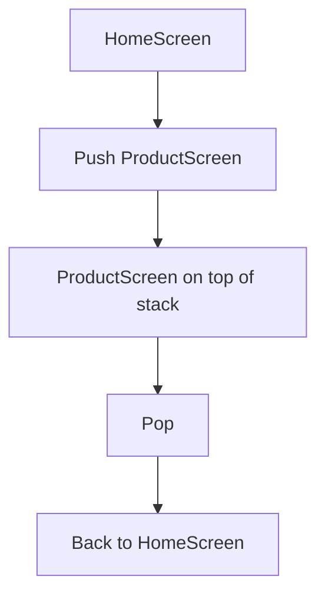

# How to Build Navigation in Flutter

Author: [nawazdhandala](https://www.github.com/nawazdhandala)

Tags: Flutter, Dart, Mobile, Navigation, iOS, Android

Description: Learn how to implement navigation in Flutter applications using Navigator, named routes, and the go_router package for building intuitive multi-screen mobile apps.

---

Navigation is one of the first things you need to figure out when building a Flutter app. Whether you're making a simple two-screen app or a complex multi-tab application, understanding how Flutter handles screen transitions will save you a lot of headaches down the road.

Flutter gives you several options for navigation, from the basic Navigator API to more sophisticated solutions like go_router. This guide walks through all the major approaches so you can pick what works best for your project.

## Understanding the Navigation Stack

Flutter uses a stack-based navigation model. Think of it like a deck of cards - you push new screens onto the stack and pop them off when going back.



The Navigator widget manages this stack for you. Every MaterialApp or CupertinoApp comes with a Navigator by default, so you don't need to set one up manually for basic use cases.

## Basic Navigation with Navigator

### Pushing a New Screen

The simplest way to navigate is using Navigator.push with a MaterialPageRoute. This creates a new route and slides it onto the screen.

```dart
// Navigate to a new screen by pushing it onto the Navigator stack
// MaterialPageRoute provides platform-appropriate transitions
import 'package:flutter/material.dart';

class HomeScreen extends StatelessWidget {
  const HomeScreen({super.key});

  @override
  Widget build(BuildContext context) {
    return Scaffold(
      appBar: AppBar(title: const Text('Home')),
      body: Center(
        child: ElevatedButton(
          onPressed: () {
            // Push a new route onto the Navigator stack
            // The builder returns the widget to display
            Navigator.push(
              context,
              MaterialPageRoute(
                builder: (context) => const DetailScreen(),
              ),
            );
          },
          child: const Text('View Details'),
        ),
      ),
    );
  }
}

class DetailScreen extends StatelessWidget {
  const DetailScreen({super.key});

  @override
  Widget build(BuildContext context) {
    return Scaffold(
      appBar: AppBar(title: const Text('Details')),
      body: const Center(
        child: Text('This is the detail screen'),
      ),
    );
  }
}
```

### Going Back with Pop

When you want to go back to the previous screen, use Navigator.pop. The back button in the AppBar does this automatically, but you might need it programmatically.

```dart
// Pop the current route off the stack to go back
// This works with both the system back button and custom buttons
class DetailScreen extends StatelessWidget {
  const DetailScreen({super.key});

  @override
  Widget build(BuildContext context) {
    return Scaffold(
      appBar: AppBar(title: const Text('Details')),
      body: Center(
        child: ElevatedButton(
          onPressed: () {
            // Remove the current route and go back
            // If there's nothing to pop, this can cause issues
            Navigator.pop(context);
          },
          child: const Text('Go Back'),
        ),
      ),
    );
  }
}
```

### Passing Data Between Screens

Most apps need to pass data when navigating. You can do this through constructor parameters.

```dart
// Pass data to the destination screen via constructor
// This keeps your navigation type-safe
class ProductScreen extends StatelessWidget {
  // Define the data this screen needs
  final String productId;
  final String productName;

  const ProductScreen({
    super.key,
    required this.productId,
    required this.productName,
  });

  @override
  Widget build(BuildContext context) {
    return Scaffold(
      appBar: AppBar(title: Text(productName)),
      body: Center(
        child: Text('Product ID: $productId'),
      ),
    );
  }
}

// Navigate and pass the data
Navigator.push(
  context,
  MaterialPageRoute(
    builder: (context) => ProductScreen(
      productId: '12345',
      productName: 'Widget Pro',
    ),
  ),
);
```

### Returning Data from a Screen

Sometimes you need to get data back from a screen, like when a user picks an item from a list.

```dart
// Use async/await with push to get a result back
// The popped screen can return any type of data
class SelectionScreen extends StatelessWidget {
  const SelectionScreen({super.key});

  @override
  Widget build(BuildContext context) {
    return Scaffold(
      appBar: AppBar(title: const Text('Select an Option')),
      body: ListView(
        children: [
          ListTile(
            title: const Text('Option A'),
            onTap: () {
              // Pop and return data to the previous screen
              Navigator.pop(context, 'Option A');
            },
          ),
          ListTile(
            title: const Text('Option B'),
            onTap: () {
              Navigator.pop(context, 'Option B');
            },
          ),
        ],
      ),
    );
  }
}

// In the calling screen, await the result
Future<void> _openSelectionScreen() async {
  // Push returns a Future that completes when the route is popped
  final result = await Navigator.push<String>(
    context,
    MaterialPageRoute(
      builder: (context) => const SelectionScreen(),
    ),
  );

  // Handle the returned data
  if (result != null) {
    ScaffoldMessenger.of(context).showSnackBar(
      SnackBar(content: Text('You selected: $result')),
    );
  }
}
```

## Named Routes

For larger apps, defining routes by name makes navigation cleaner and more maintainable. You define all your routes in one place and reference them by string names.

### Setting Up Named Routes

```dart
// Define all routes in MaterialApp for centralized navigation
// This makes it easier to see all available screens at a glance
class MyApp extends StatelessWidget {
  const MyApp({super.key});

  @override
  Widget build(BuildContext context) {
    return MaterialApp(
      title: 'Navigation Demo',
      // The initial route when the app starts
      initialRoute: '/',
      // Map of route names to their builders
      routes: {
        '/': (context) => const HomeScreen(),
        '/products': (context) => const ProductListScreen(),
        '/settings': (context) => const SettingsScreen(),
        '/profile': (context) => const ProfileScreen(),
      },
    );
  }
}
```

### Navigating with Named Routes

```dart
// Navigate using the route name instead of building the route manually
// This decouples the navigation call from the screen implementation
class HomeScreen extends StatelessWidget {
  const HomeScreen({super.key});

  @override
  Widget build(BuildContext context) {
    return Scaffold(
      appBar: AppBar(title: const Text('Home')),
      body: Column(
        mainAxisAlignment: MainAxisAlignment.center,
        children: [
          ElevatedButton(
            onPressed: () {
              // pushNamed uses the route name from the routes map
              Navigator.pushNamed(context, '/products');
            },
            child: const Text('View Products'),
          ),
          const SizedBox(height: 16),
          ElevatedButton(
            onPressed: () {
              Navigator.pushNamed(context, '/settings');
            },
            child: const Text('Settings'),
          ),
        ],
      ),
    );
  }
}
```

### Passing Arguments with Named Routes

Named routes can still receive arguments, but you need to handle them differently.

```dart
// Pass arguments through the arguments parameter
// The receiving screen extracts them from ModalRoute.settings
class ProductDetailScreen extends StatelessWidget {
  const ProductDetailScreen({super.key});

  @override
  Widget build(BuildContext context) {
    // Extract arguments from the route settings
    final args = ModalRoute.of(context)!.settings.arguments as Map<String, dynamic>;

    return Scaffold(
      appBar: AppBar(title: Text(args['name'] as String)),
      body: Center(
        child: Text('Price: \$${args['price']}'),
      ),
    );
  }
}

// Navigate with arguments
Navigator.pushNamed(
  context,
  '/product-detail',
  arguments: {
    'id': '12345',
    'name': 'Widget Pro',
    'price': 29.99,
  },
);
```

### Route Generation for Dynamic Routes

When you need more control, like handling dynamic routes or unknown routes, use onGenerateRoute.

```dart
// onGenerateRoute gives you full control over route creation
// Useful for parsing URL parameters or handling dynamic paths
class MyApp extends StatelessWidget {
  const MyApp({super.key});

  @override
  Widget build(BuildContext context) {
    return MaterialApp(
      title: 'Navigation Demo',
      initialRoute: '/',
      onGenerateRoute: (settings) {
        // Parse the route name to handle dynamic segments
        final uri = Uri.parse(settings.name ?? '/');

        // Handle product detail routes like /products/123
        if (uri.pathSegments.length == 2 &&
            uri.pathSegments[0] == 'products') {
          final productId = uri.pathSegments[1];
          return MaterialPageRoute(
            builder: (context) => ProductDetailScreen(id: productId),
            settings: settings,
          );
        }

        // Handle static routes
        switch (settings.name) {
          case '/':
            return MaterialPageRoute(
              builder: (context) => const HomeScreen(),
            );
          case '/products':
            return MaterialPageRoute(
              builder: (context) => const ProductListScreen(),
            );
          default:
            // Return a 404 screen for unknown routes
            return MaterialPageRoute(
              builder: (context) => const NotFoundScreen(),
            );
        }
      },
    );
  }
}
```

## Navigation with go_router

For production apps, especially those with deep linking or web support, go_router provides a more powerful routing solution. It handles URL parsing, route guards, and nested navigation elegantly.

### Installation

Add go_router to your pubspec.yaml:

```yaml
dependencies:
  flutter:
    sdk: flutter
  go_router: ^13.0.0
```

### Basic Setup

```dart
// Set up go_router with a list of routes
// Each GoRoute defines a path and the widget to display
import 'package:flutter/material.dart';
import 'package:go_router/go_router.dart';

// Define the router configuration
final GoRouter router = GoRouter(
  // Initial location when app starts
  initialLocation: '/',
  routes: [
    GoRoute(
      path: '/',
      name: 'home',
      builder: (context, state) => const HomeScreen(),
    ),
    GoRoute(
      path: '/products',
      name: 'products',
      builder: (context, state) => const ProductListScreen(),
    ),
    GoRoute(
      // Path parameters use colon syntax
      path: '/products/:id',
      name: 'product-detail',
      builder: (context, state) {
        // Extract the path parameter
        final productId = state.pathParameters['id']!;
        return ProductDetailScreen(id: productId);
      },
    ),
    GoRoute(
      path: '/settings',
      name: 'settings',
      builder: (context, state) => const SettingsScreen(),
    ),
  ],
);

class MyApp extends StatelessWidget {
  const MyApp({super.key});

  @override
  Widget build(BuildContext context) {
    // Use MaterialApp.router with the go_router configuration
    return MaterialApp.router(
      title: 'Navigation Demo',
      routerConfig: router,
    );
  }
}
```

### Navigating with go_router

go_router provides several navigation methods that feel more natural than the basic Navigator API.

```dart
// go_router navigation methods
// context.go replaces the current stack, context.push adds to it
class HomeScreen extends StatelessWidget {
  const HomeScreen({super.key});

  @override
  Widget build(BuildContext context) {
    return Scaffold(
      appBar: AppBar(title: const Text('Home')),
      body: Column(
        mainAxisAlignment: MainAxisAlignment.center,
        children: [
          ElevatedButton(
            onPressed: () {
              // Navigate to a path - replaces current location
              context.go('/products');
            },
            child: const Text('Go to Products'),
          ),
          const SizedBox(height: 16),
          ElevatedButton(
            onPressed: () {
              // Push onto the stack - allows going back
              context.push('/products');
            },
            child: const Text('Push Products'),
          ),
          const SizedBox(height: 16),
          ElevatedButton(
            onPressed: () {
              // Navigate with path parameters
              context.go('/products/12345');
            },
            child: const Text('View Product 12345'),
          ),
          const SizedBox(height: 16),
          ElevatedButton(
            onPressed: () {
              // Navigate by route name with parameters
              context.goNamed(
                'product-detail',
                pathParameters: {'id': '67890'},
              );
            },
            child: const Text('View Product by Name'),
          ),
        ],
      ),
    );
  }
}
```

### Query Parameters

go_router makes handling query parameters straightforward.

```dart
// Handle query parameters in routes
// Useful for search pages, filters, and pagination
GoRoute(
  path: '/search',
  name: 'search',
  builder: (context, state) {
    // Extract query parameters from the URI
    final query = state.uri.queryParameters['q'] ?? '';
    final category = state.uri.queryParameters['category'];
    final page = int.tryParse(
      state.uri.queryParameters['page'] ?? '1'
    ) ?? 1;

    return SearchScreen(
      query: query,
      category: category,
      page: page,
    );
  },
),

// Navigate with query parameters
context.go('/search?q=flutter&category=widgets&page=2');

// Or using goNamed with queryParameters
context.goNamed(
  'search',
  queryParameters: {
    'q': 'flutter',
    'category': 'widgets',
    'page': '2',
  },
);
```

### Nested Navigation with ShellRoute

For apps with bottom navigation bars or tab layouts, ShellRoute keeps the shell UI persistent while changing the content.

```dart
// ShellRoute wraps child routes with a common shell
// Perfect for bottom navigation, side menus, or tabs
final GoRouter router = GoRouter(
  initialLocation: '/home',
  routes: [
    ShellRoute(
      // The shell builder provides the navigation UI
      builder: (context, state, child) {
        return MainShell(child: child);
      },
      routes: [
        GoRoute(
          path: '/home',
          name: 'home',
          builder: (context, state) => const HomeScreen(),
        ),
        GoRoute(
          path: '/explore',
          name: 'explore',
          builder: (context, state) => const ExploreScreen(),
        ),
        GoRoute(
          path: '/profile',
          name: 'profile',
          builder: (context, state) => const ProfileScreen(),
        ),
      ],
    ),
    // Routes outside the shell don't show the bottom nav
    GoRoute(
      path: '/login',
      name: 'login',
      builder: (context, state) => const LoginScreen(),
    ),
  ],
);

// The shell widget with bottom navigation
class MainShell extends StatelessWidget {
  final Widget child;

  const MainShell({super.key, required this.child});

  @override
  Widget build(BuildContext context) {
    return Scaffold(
      body: child,
      bottomNavigationBar: BottomNavigationBar(
        currentIndex: _calculateSelectedIndex(context),
        onTap: (index) => _onItemTapped(index, context),
        items: const [
          BottomNavigationBarItem(
            icon: Icon(Icons.home),
            label: 'Home',
          ),
          BottomNavigationBarItem(
            icon: Icon(Icons.explore),
            label: 'Explore',
          ),
          BottomNavigationBarItem(
            icon: Icon(Icons.person),
            label: 'Profile',
          ),
        ],
      ),
    );
  }

  int _calculateSelectedIndex(BuildContext context) {
    final location = GoRouterState.of(context).uri.path;
    if (location.startsWith('/home')) return 0;
    if (location.startsWith('/explore')) return 1;
    if (location.startsWith('/profile')) return 2;
    return 0;
  }

  void _onItemTapped(int index, BuildContext context) {
    switch (index) {
      case 0:
        context.go('/home');
        break;
      case 1:
        context.go('/explore');
        break;
      case 2:
        context.go('/profile');
        break;
    }
  }
}
```

### Route Guards and Redirects

Protect routes that require authentication or other conditions.

```dart
// Use redirect to handle authentication and access control
// The redirect function runs before building the route
final GoRouter router = GoRouter(
  initialLocation: '/',
  // Global redirect that runs for every navigation
  redirect: (context, state) {
    final isLoggedIn = AuthService.instance.isLoggedIn;
    final isLoggingIn = state.matchedLocation == '/login';

    // If not logged in and not on login page, redirect to login
    if (!isLoggedIn && !isLoggingIn) {
      // Save the intended destination for after login
      return '/login?redirect=${state.matchedLocation}';
    }

    // If logged in and on login page, redirect to home
    if (isLoggedIn && isLoggingIn) {
      return '/';
    }

    // No redirect needed
    return null;
  },
  routes: [
    GoRoute(
      path: '/',
      builder: (context, state) => const HomeScreen(),
    ),
    GoRoute(
      path: '/login',
      builder: (context, state) {
        // Get the redirect destination after login
        final redirect = state.uri.queryParameters['redirect'] ?? '/';
        return LoginScreen(redirectTo: redirect);
      },
    ),
    GoRoute(
      path: '/admin',
      // Route-specific redirect for admin-only pages
      redirect: (context, state) {
        if (!AuthService.instance.isAdmin) {
          return '/unauthorized';
        }
        return null;
      },
      builder: (context, state) => const AdminScreen(),
    ),
  ],
);
```

## Custom Page Transitions

You can customize how screens animate in and out.

```dart
// Create custom page transitions for different routes
// Useful for modal sheets, fade transitions, or no animation
GoRoute(
  path: '/modal',
  name: 'modal',
  pageBuilder: (context, state) {
    return CustomTransitionPage(
      key: state.pageKey,
      child: const ModalScreen(),
      // Slide up from the bottom like a modal sheet
      transitionsBuilder: (context, animation, secondaryAnimation, child) {
        return SlideTransition(
          position: Tween<Offset>(
            begin: const Offset(0, 1),
            end: Offset.zero,
          ).animate(CurvedAnimation(
            parent: animation,
            curve: Curves.easeOutCubic,
          )),
          child: child,
        );
      },
    );
  },
),

GoRoute(
  path: '/fade-screen',
  name: 'fade',
  pageBuilder: (context, state) {
    return CustomTransitionPage(
      key: state.pageKey,
      child: const FadeScreen(),
      // Simple fade transition
      transitionsBuilder: (context, animation, secondaryAnimation, child) {
        return FadeTransition(
          opacity: animation,
          child: child,
        );
      },
    );
  },
),

GoRoute(
  path: '/instant',
  name: 'instant',
  pageBuilder: (context, state) {
    // No transition at all
    return NoTransitionPage(
      key: state.pageKey,
      child: const InstantScreen(),
    );
  },
),
```

## Navigation Patterns Summary

| Pattern | Use Case | Method |
|---------|----------|--------|
| **Basic Push** | Simple screen transitions | `Navigator.push()` |
| **Named Routes** | Medium apps with static routes | `Navigator.pushNamed()` |
| **go_router** | Production apps, deep linking, web | `context.go()`, `context.push()` |
| **ShellRoute** | Bottom navigation, tabs | go_router ShellRoute |
| **Route Guards** | Authentication, authorization | go_router redirect |

## Common Navigation Mistakes

**Forgetting to handle back navigation**: When using `context.go()`, users can't go back. Use `context.push()` if you want the back button to work.

**Passing large objects through navigation**: Pass IDs instead and fetch data in the destination screen. This works better with deep linking.

**Not handling unknown routes**: Always define an error route for 404 scenarios, especially for web apps.

**Hardcoding route strings everywhere**: Use constants or the route name system to avoid typos and make refactoring easier.

```dart
// Define route constants to avoid string typos
abstract class Routes {
  static const home = '/';
  static const products = '/products';
  static const productDetail = '/products/:id';
  static const settings = '/settings';
  static const login = '/login';
}

// Use the constants
context.go(Routes.products);
```

Flutter's navigation system is flexible enough to handle everything from simple two-screen apps to complex nested navigation with authentication. Start with the basic Navigator for learning, then move to go_router when you need deep linking, web support, or more sophisticated routing logic.

---

*Building mobile apps with Flutter? Make sure your app stays reliable with [OneUptime](https://oneuptime.com) - monitor your backend APIs, track errors, and get alerted when things break before your users notice.*
