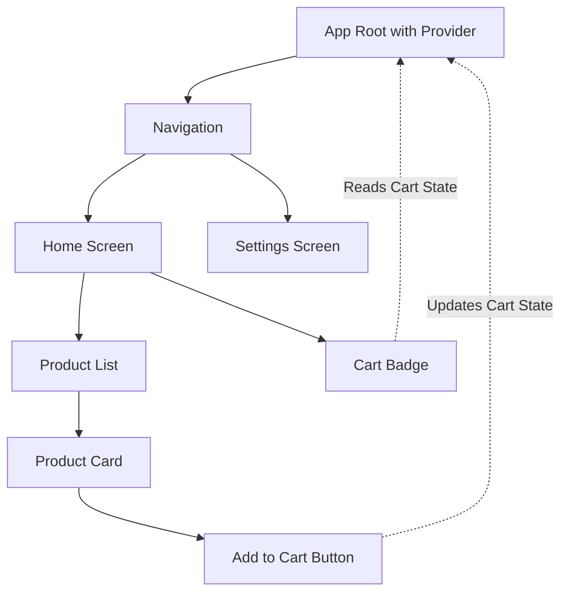
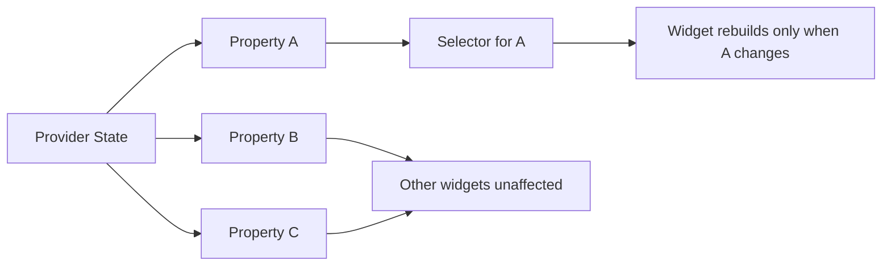
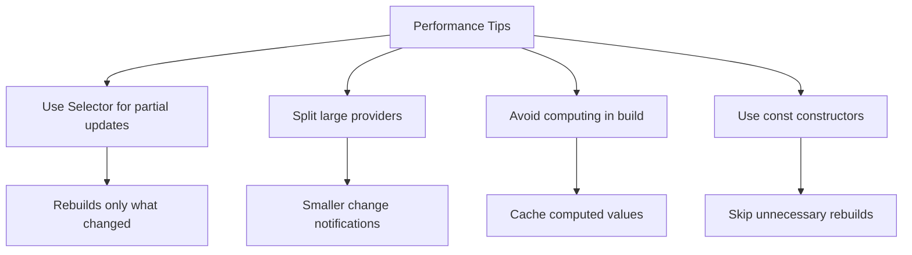

# How to Use Flutter with Provider

Author: [nawazdhandala](https://www.github.com/nawazdhandala)

Tags: Flutter, Provider, State Management, Mobile Development, Dart

Description: A hands-on guide to using Provider for state management in Flutter applications. Learn how to set up providers, manage complex state, handle async operations, and build scalable apps with clean architecture.

---

Provider has become the go-to state management solution for Flutter developers, and for good reason. Recommended by the Flutter team itself, Provider strikes the perfect balance between simplicity and power. You can start using it in minutes, yet it scales gracefully as your app grows from a weekend project to a production-ready application.

Unlike more opinionated frameworks that force you into rigid patterns, Provider gives you the flexibility to structure your code the way that makes sense for your project. Whether you're building a simple todo app or a complex e-commerce platform, Provider adapts to your needs without unnecessary boilerplate.

## Why Provider?

Before diving into code, let's understand what makes Provider special. Flutter's widget tree is built on composition - widgets contain other widgets, forming a hierarchy. When state lives at the top of the tree and needs to reach widgets deep below, passing data through every constructor becomes tedious and error-prone. Provider solves this elegantly.



Provider makes state accessible anywhere in the widget tree without manually threading it through intermediate widgets. Widgets simply ask for the state they need, and Provider handles the rest.

## Setting Up Provider

Getting started with Provider takes just a few steps. First, add it to your project dependencies.

Open your `pubspec.yaml` and add the provider package:

```yaml
# pubspec.yaml
# Provider is the officially recommended state management solution
# Version 6.x includes null safety and improved performance
dependencies:
  flutter:
    sdk: flutter
  provider: ^6.1.0
```

Run `flutter pub get` to install the dependency. Now you're ready to create your first provider.

## Understanding ChangeNotifier

At the heart of Provider lies ChangeNotifier, a simple class that holds your state and notifies listeners when it changes. Think of it as a subject in the observer pattern, but with Flutter's widget lifecycle baked in.

The following example demonstrates a basic counter state class. Notice how `notifyListeners()` tells all listening widgets to rebuild with the new value:

```dart
// counter_provider.dart
// ChangeNotifier is the foundation of Provider state management
// It maintains a list of listeners and notifies them on state changes
import 'package:flutter/foundation.dart';

class CounterProvider extends ChangeNotifier {
  // Private state variable - encapsulation keeps state predictable
  int _count = 0;

  // Public getter exposes state without allowing direct modification
  int get count => _count;

  // Methods that modify state call notifyListeners() to trigger rebuilds
  void increment() {
    _count++;
    // Notify all listening widgets to rebuild with new state
    notifyListeners();
  }

  void decrement() {
    if (_count > 0) {
      _count--;
      notifyListeners();
    }
  }

  void reset() {
    _count = 0;
    notifyListeners();
  }
}
```

## Providing State to the Widget Tree

Once you have a ChangeNotifier, you need to make it available to widgets that need it. ChangeNotifierProvider does exactly that - it creates an instance of your provider and makes it accessible to all descendant widgets.

Place the provider high enough in the tree so all widgets that need the state can access it:

```dart
// main.dart
// ChangeNotifierProvider creates and disposes the provider automatically
// Place it above all widgets that need access to the state
import 'package:flutter/material.dart';
import 'package:provider/provider.dart';
import 'counter_provider.dart';

void main() {
  runApp(const MyApp());
}

class MyApp extends StatelessWidget {
  const MyApp({super.key});

  @override
  Widget build(BuildContext context) {
    // ChangeNotifierProvider creates the CounterProvider instance
    // create callback runs once when the provider is first needed
    return ChangeNotifierProvider(
      create: (context) => CounterProvider(),
      child: MaterialApp(
        title: 'Provider Demo',
        theme: ThemeData(
          colorScheme: ColorScheme.fromSeed(seedColor: Colors.blue),
          useMaterial3: true,
        ),
        home: const CounterScreen(),
      ),
    );
  }
}
```

## Consuming State with Consumer

Now comes the interesting part - reading and reacting to state changes. Provider offers several ways to access state, each suited for different scenarios.

Consumer is the most explicit approach. It wraps the portion of your widget tree that depends on state and rebuilds only that portion when state changes:

```dart
// counter_screen.dart
// Consumer rebuilds only its builder when the provider notifies listeners
// More explicit than context.watch but offers better rebuild control
import 'package:flutter/material.dart';
import 'package:provider/provider.dart';
import 'counter_provider.dart';

class CounterScreen extends StatelessWidget {
  const CounterScreen({super.key});

  @override
  Widget build(BuildContext context) {
    return Scaffold(
      appBar: AppBar(
        title: const Text('Provider Counter'),
        backgroundColor: Theme.of(context).colorScheme.inversePrimary,
      ),
      body: Center(
        child: Column(
          mainAxisAlignment: MainAxisAlignment.center,
          children: [
            const Text('You have pushed the button this many times:'),
            const SizedBox(height: 16),
            // Consumer rebuilds only this Text widget when count changes
            // The surrounding Column and Scaffold do not rebuild
            Consumer<CounterProvider>(
              builder: (context, counter, child) {
                return Text(
                  '${counter.count}',
                  style: Theme.of(context).textTheme.headlineLarge,
                );
              },
            ),
            const SizedBox(height: 32),
            // Buttons to modify state
            Row(
              mainAxisAlignment: MainAxisAlignment.center,
              children: [
                ElevatedButton(
                  // context.read accesses the provider without listening
                  // Use for event handlers that trigger state changes
                  onPressed: () => context.read<CounterProvider>().decrement(),
                  child: const Icon(Icons.remove),
                ),
                const SizedBox(width: 16),
                ElevatedButton(
                  onPressed: () => context.read<CounterProvider>().increment(),
                  child: const Icon(Icons.add),
                ),
                const SizedBox(width: 16),
                TextButton(
                  onPressed: () => context.read<CounterProvider>().reset(),
                  child: const Text('Reset'),
                ),
              ],
            ),
          ],
        ),
      ),
    );
  }
}
```

## context.watch vs context.read

Provider extends BuildContext with two essential methods: `watch` and `read`. Understanding when to use each prevents unnecessary rebuilds and potential bugs.

Use `context.watch<T>()` when you need the widget to rebuild whenever the provider changes. Use `context.read<T>()` when you only need to access the provider once, typically in event handlers.

Here's a practical example showing both in action:

```dart
// settings_screen.dart
// Demonstrates the difference between watch and read
// watch subscribes to changes, read performs one-time access
import 'package:flutter/material.dart';
import 'package:provider/provider.dart';

class ThemeProvider extends ChangeNotifier {
  bool _isDarkMode = false;

  bool get isDarkMode => _isDarkMode;

  void toggleTheme() {
    _isDarkMode = !_isDarkMode;
    notifyListeners();
  }
}

class SettingsScreen extends StatelessWidget {
  const SettingsScreen({super.key});

  @override
  Widget build(BuildContext context) {
    // watch causes this build method to run when isDarkMode changes
    // Appropriate here because the UI depends on the current theme state
    final themeProvider = context.watch<ThemeProvider>();

    return Scaffold(
      appBar: AppBar(title: const Text('Settings')),
      body: ListView(
        children: [
          SwitchListTile(
            title: const Text('Dark Mode'),
            subtitle: Text(themeProvider.isDarkMode ? 'On' : 'Off'),
            value: themeProvider.isDarkMode,
            onChanged: (value) {
              // read is correct here - we just need to call the method
              // Using watch in onChanged would be wasteful
              context.read<ThemeProvider>().toggleTheme();
            },
          ),
        ],
      ),
    );
  }
}
```

## Building a Real-World Example: Task Manager

Let's build something more substantial - a task manager that demonstrates Provider patterns you'll use in production apps.

First, define the data model and provider:

```dart
// task_provider.dart
// A practical task management provider demonstrating real-world patterns
// Includes CRUD operations, filtering, and computed properties
import 'package:flutter/foundation.dart';

// Task model with immutable design for predictable state
class Task {
  final String id;
  final String title;
  final String description;
  final bool isCompleted;
  final DateTime createdAt;
  final Priority priority;

  const Task({
    required this.id,
    required this.title,
    this.description = '',
    this.isCompleted = false,
    required this.createdAt,
    this.priority = Priority.medium,
  });

  // copyWith enables immutable updates
  Task copyWith({
    String? title,
    String? description,
    bool? isCompleted,
    Priority? priority,
  }) {
    return Task(
      id: id,
      title: title ?? this.title,
      description: description ?? this.description,
      isCompleted: isCompleted ?? this.isCompleted,
      createdAt: createdAt,
      priority: priority ?? this.priority,
    );
  }
}

enum Priority { low, medium, high }

enum TaskFilter { all, active, completed }

class TaskProvider extends ChangeNotifier {
  // Private state
  final List<Task> _tasks = [];
  TaskFilter _currentFilter = TaskFilter.all;

  // Getters for state access
  TaskFilter get currentFilter => _currentFilter;

  // Computed property - filtered list based on current filter
  List<Task> get tasks {
    switch (_currentFilter) {
      case TaskFilter.active:
        return _tasks.where((task) => !task.isCompleted).toList();
      case TaskFilter.completed:
        return _tasks.where((task) => task.isCompleted).toList();
      case TaskFilter.all:
        return List.unmodifiable(_tasks);
    }
  }

  // Statistics computed from state
  int get totalCount => _tasks.length;
  int get completedCount => _tasks.where((t) => t.isCompleted).length;
  int get activeCount => _tasks.where((t) => !t.isCompleted).length;

  double get completionRate {
    if (_tasks.isEmpty) return 0;
    return completedCount / totalCount;
  }

  // CRUD Operations
  void addTask(String title, {String description = '', Priority priority = Priority.medium}) {
    final task = Task(
      id: DateTime.now().millisecondsSinceEpoch.toString(),
      title: title,
      description: description,
      createdAt: DateTime.now(),
      priority: priority,
    );
    _tasks.add(task);
    notifyListeners();
  }

  void toggleTask(String id) {
    final index = _tasks.indexWhere((task) => task.id == id);
    if (index != -1) {
      _tasks[index] = _tasks[index].copyWith(
        isCompleted: !_tasks[index].isCompleted,
      );
      notifyListeners();
    }
  }

  void updateTask(String id, {String? title, String? description, Priority? priority}) {
    final index = _tasks.indexWhere((task) => task.id == id);
    if (index != -1) {
      _tasks[index] = _tasks[index].copyWith(
        title: title,
        description: description,
        priority: priority,
      );
      notifyListeners();
    }
  }

  void deleteTask(String id) {
    _tasks.removeWhere((task) => task.id == id);
    notifyListeners();
  }

  void setFilter(TaskFilter filter) {
    _currentFilter = filter;
    notifyListeners();
  }

  void clearCompleted() {
    _tasks.removeWhere((task) => task.isCompleted);
    notifyListeners();
  }
}
```

Now build the UI that consumes the provider:

```dart
// task_screen.dart
// Main screen demonstrating Consumer, Selector, and context extensions
import 'package:flutter/material.dart';
import 'package:provider/provider.dart';
import 'task_provider.dart';

class TaskScreen extends StatelessWidget {
  const TaskScreen({super.key});

  @override
  Widget build(BuildContext context) {
    return Scaffold(
      appBar: AppBar(
        title: const Text('My Tasks'),
        actions: [
          // Selector rebuilds only when completedCount changes
          // More efficient than watching the entire provider
          Selector<TaskProvider, int>(
            selector: (_, provider) => provider.completedCount,
            builder: (context, completedCount, child) {
              return Padding(
                padding: const EdgeInsets.symmetric(horizontal: 16),
                child: Center(
                  child: Text('Done: $completedCount'),
                ),
              );
            },
          ),
        ],
      ),
      body: Column(
        children: [
          // Filter chips row
          const TaskFilterBar(),
          // Progress indicator
          const TaskProgressIndicator(),
          // Task list
          const Expanded(child: TaskList()),
        ],
      ),
      floatingActionButton: FloatingActionButton(
        onPressed: () => _showAddTaskDialog(context),
        child: const Icon(Icons.add),
      ),
    );
  }

  void _showAddTaskDialog(BuildContext context) {
    final controller = TextEditingController();

    showDialog(
      context: context,
      builder: (dialogContext) => AlertDialog(
        title: const Text('Add Task'),
        content: TextField(
          controller: controller,
          autofocus: true,
          decoration: const InputDecoration(
            hintText: 'What needs to be done?',
          ),
        ),
        actions: [
          TextButton(
            onPressed: () => Navigator.pop(dialogContext),
            child: const Text('Cancel'),
          ),
          FilledButton(
            onPressed: () {
              if (controller.text.trim().isNotEmpty) {
                // Use read since we're in an event handler
                context.read<TaskProvider>().addTask(controller.text.trim());
                Navigator.pop(dialogContext);
              }
            },
            child: const Text('Add'),
          ),
        ],
      ),
    );
  }
}

// Separate widget for filter bar to isolate rebuilds
class TaskFilterBar extends StatelessWidget {
  const TaskFilterBar({super.key});

  @override
  Widget build(BuildContext context) {
    return Padding(
      padding: const EdgeInsets.all(8.0),
      // Selector watches only the currentFilter property
      child: Selector<TaskProvider, TaskFilter>(
        selector: (_, provider) => provider.currentFilter,
        builder: (context, currentFilter, child) {
          return SegmentedButton<TaskFilter>(
            segments: const [
              ButtonSegment(
                value: TaskFilter.all,
                label: Text('All'),
              ),
              ButtonSegment(
                value: TaskFilter.active,
                label: Text('Active'),
              ),
              ButtonSegment(
                value: TaskFilter.completed,
                label: Text('Done'),
              ),
            ],
            selected: {currentFilter},
            onSelectionChanged: (selection) {
              context.read<TaskProvider>().setFilter(selection.first);
            },
          );
        },
      ),
    );
  }
}

// Progress indicator showing completion rate
class TaskProgressIndicator extends StatelessWidget {
  const TaskProgressIndicator({super.key});

  @override
  Widget build(BuildContext context) {
    return Selector<TaskProvider, double>(
      selector: (_, provider) => provider.completionRate,
      builder: (context, rate, child) {
        return Padding(
          padding: const EdgeInsets.symmetric(horizontal: 16, vertical: 8),
          child: Column(
            children: [
              LinearProgressIndicator(
                value: rate,
                backgroundColor: Colors.grey[300],
              ),
              const SizedBox(height: 4),
              Text('${(rate * 100).toInt()}% complete'),
            ],
          ),
        );
      },
    );
  }
}

// Task list using Consumer for the full tasks list
class TaskList extends StatelessWidget {
  const TaskList({super.key});

  @override
  Widget build(BuildContext context) {
    return Consumer<TaskProvider>(
      builder: (context, taskProvider, child) {
        final tasks = taskProvider.tasks;

        if (tasks.isEmpty) {
          return const Center(
            child: Text('No tasks yet. Add one!'),
          );
        }

        return ListView.builder(
          itemCount: tasks.length,
          itemBuilder: (context, index) {
            final task = tasks[index];
            return TaskTile(task: task);
          },
        );
      },
    );
  }
}

// Individual task tile
class TaskTile extends StatelessWidget {
  final Task task;

  const TaskTile({super.key, required this.task});

  @override
  Widget build(BuildContext context) {
    return Dismissible(
      key: Key(task.id),
      background: Container(
        color: Colors.red,
        alignment: Alignment.centerRight,
        padding: const EdgeInsets.only(right: 16),
        child: const Icon(Icons.delete, color: Colors.white),
      ),
      direction: DismissDirection.endToStart,
      onDismissed: (_) {
        context.read<TaskProvider>().deleteTask(task.id);
      },
      child: ListTile(
        leading: Checkbox(
          value: task.isCompleted,
          onChanged: (_) {
            context.read<TaskProvider>().toggleTask(task.id);
          },
        ),
        title: Text(
          task.title,
          style: TextStyle(
            decoration: task.isCompleted ? TextDecoration.lineThrough : null,
            color: task.isCompleted ? Colors.grey : null,
          ),
        ),
        subtitle: task.description.isNotEmpty ? Text(task.description) : null,
        trailing: _priorityIcon(task.priority),
      ),
    );
  }

  Widget _priorityIcon(Priority priority) {
    final color = switch (priority) {
      Priority.high => Colors.red,
      Priority.medium => Colors.orange,
      Priority.low => Colors.green,
    };
    return Icon(Icons.flag, color: color, size: 20);
  }
}
```

## Using Multiple Providers

Real applications need multiple providers for different concerns. MultiProvider keeps your code organized by wrapping all providers at the app root.

Here's how to set up multiple providers cleanly:

```dart
// main.dart with multiple providers
// MultiProvider keeps the widget tree clean when using several providers
// Providers are created in order, so put dependencies first
import 'package:flutter/material.dart';
import 'package:provider/provider.dart';

void main() {
  runApp(const MyApp());
}

class MyApp extends StatelessWidget {
  const MyApp({super.key});

  @override
  Widget build(BuildContext context) {
    return MultiProvider(
      // Providers are instantiated in list order
      // Place providers that others depend on first
      providers: [
        // Authentication state
        ChangeNotifierProvider(create: (_) => AuthProvider()),

        // User preferences and settings
        ChangeNotifierProvider(create: (_) => SettingsProvider()),

        // Theme configuration
        ChangeNotifierProvider(create: (_) => ThemeProvider()),

        // Task management
        ChangeNotifierProvider(create: (_) => TaskProvider()),

        // Shopping cart for e-commerce features
        ChangeNotifierProvider(create: (_) => CartProvider()),
      ],
      child: Consumer<ThemeProvider>(
        // Theme affects the entire app, so consume it here
        builder: (context, themeProvider, child) {
          return MaterialApp(
            title: 'Multi-Provider App',
            theme: themeProvider.lightTheme,
            darkTheme: themeProvider.darkTheme,
            themeMode: themeProvider.themeMode,
            home: const HomeScreen(),
          );
        },
      ),
    );
  }
}
```

## Dependent Providers with ProxyProvider

Sometimes one provider needs data from another. ProxyProvider creates providers that depend on values from other providers.

The following example shows a UserDataProvider that needs the current user from AuthProvider:

```dart
// dependent_providers.dart
// ProxyProvider creates providers that depend on other providers
// Updates automatically when the dependency changes
import 'package:flutter/foundation.dart';
import 'package:provider/provider.dart';

class User {
  final String id;
  final String name;
  final String email;

  const User({required this.id, required this.name, required this.email});
}

class AuthProvider extends ChangeNotifier {
  User? _user;

  User? get user => _user;
  bool get isAuthenticated => _user != null;

  Future<void> login(String email, String password) async {
    // Simulate API call
    await Future.delayed(const Duration(seconds: 1));
    _user = User(id: '1', name: 'John Doe', email: email);
    notifyListeners();
  }

  void logout() {
    _user = null;
    notifyListeners();
  }
}

// Provider that depends on the authenticated user
class UserDataProvider extends ChangeNotifier {
  String? _userId;
  List<String> _userPosts = [];
  bool _isLoading = false;

  List<String> get userPosts => _userPosts;
  bool get isLoading => _isLoading;

  // Called when the user changes
  void updateUser(String? userId) {
    if (_userId != userId) {
      _userId = userId;
      if (userId != null) {
        _fetchUserData();
      } else {
        _userPosts = [];
        notifyListeners();
      }
    }
  }

  Future<void> _fetchUserData() async {
    _isLoading = true;
    notifyListeners();

    // Simulate fetching user-specific data
    await Future.delayed(const Duration(seconds: 1));
    _userPosts = ['Post 1', 'Post 2', 'Post 3'];

    _isLoading = false;
    notifyListeners();
  }
}

// Setting up dependent providers in main.dart
class AppWithDependentProviders extends StatelessWidget {
  const AppWithDependentProviders({super.key});

  @override
  Widget build(BuildContext context) {
    return MultiProvider(
      providers: [
        // Base provider - no dependencies
        ChangeNotifierProvider(create: (_) => AuthProvider()),

        // Dependent provider using ChangeNotifierProxyProvider
        // Updates when AuthProvider changes
        ChangeNotifierProxyProvider<AuthProvider, UserDataProvider>(
          create: (_) => UserDataProvider(),
          update: (_, auth, userDataProvider) {
            // Pass the user ID to the dependent provider
            userDataProvider!.updateUser(auth.user?.id);
            return userDataProvider;
          },
        ),
      ],
      child: const MaterialApp(
        home: HomeScreen(),
      ),
    );
  }
}
```

## Handling Async Operations

Provider works seamlessly with async operations. Handle loading states, errors, and data within your provider to keep the UI responsive.

Here's a pattern for managing async data fetching:

```dart
// async_provider.dart
// Pattern for handling async operations with loading and error states
// Keeps async logic out of widgets for better testability
import 'package:flutter/foundation.dart';

// Generic async state class for reusability
class AsyncState<T> {
  final T? data;
  final bool isLoading;
  final String? error;

  const AsyncState({
    this.data,
    this.isLoading = false,
    this.error,
  });

  AsyncState<T> copyWith({
    T? data,
    bool? isLoading,
    String? error,
  }) {
    return AsyncState(
      data: data ?? this.data,
      isLoading: isLoading ?? this.isLoading,
      error: error,
    );
  }
}

class Product {
  final String id;
  final String name;
  final double price;

  const Product({required this.id, required this.name, required this.price});
}

class ProductProvider extends ChangeNotifier {
  AsyncState<List<Product>> _state = const AsyncState(data: []);

  AsyncState<List<Product>> get state => _state;
  List<Product> get products => _state.data ?? [];
  bool get isLoading => _state.isLoading;
  String? get error => _state.error;

  Future<void> fetchProducts() async {
    // Set loading state
    _state = _state.copyWith(isLoading: true, error: null);
    notifyListeners();

    try {
      // Simulate API call
      await Future.delayed(const Duration(seconds: 2));

      // Simulate successful response
      final products = [
        const Product(id: '1', name: 'Widget Pro', price: 29.99),
        const Product(id: '2', name: 'Gadget Plus', price: 49.99),
        const Product(id: '3', name: 'Device Max', price: 99.99),
      ];

      _state = AsyncState(data: products, isLoading: false);
      notifyListeners();
    } catch (e) {
      _state = _state.copyWith(
        isLoading: false,
        error: 'Failed to fetch products: ${e.toString()}',
      );
      notifyListeners();
    }
  }

  Future<void> refresh() async {
    // Don't show loading indicator for refresh
    try {
      await Future.delayed(const Duration(seconds: 1));
      // Re-fetch products
      await fetchProducts();
    } catch (e) {
      _state = _state.copyWith(error: 'Refresh failed');
      notifyListeners();
    }
  }
}
```

Build the UI to handle all async states:

```dart
// product_screen.dart
// UI that responds to loading, error, and data states
import 'package:flutter/material.dart';
import 'package:provider/provider.dart';
import 'async_provider.dart';

class ProductScreen extends StatefulWidget {
  const ProductScreen({super.key});

  @override
  State<ProductScreen> createState() => _ProductScreenState();
}

class _ProductScreenState extends State<ProductScreen> {
  @override
  void initState() {
    super.initState();
    // Fetch products when screen loads
    // Using addPostFrameCallback ensures context is ready
    WidgetsBinding.instance.addPostFrameCallback((_) {
      context.read<ProductProvider>().fetchProducts();
    });
  }

  @override
  Widget build(BuildContext context) {
    return Scaffold(
      appBar: AppBar(title: const Text('Products')),
      body: Consumer<ProductProvider>(
        builder: (context, provider, child) {
          // Handle loading state
          if (provider.isLoading && provider.products.isEmpty) {
            return const Center(
              child: CircularProgressIndicator(),
            );
          }

          // Handle error state
          if (provider.error != null && provider.products.isEmpty) {
            return Center(
              child: Column(
                mainAxisAlignment: MainAxisAlignment.center,
                children: [
                  Icon(Icons.error_outline, size: 48, color: Colors.red[300]),
                  const SizedBox(height: 16),
                  Text(provider.error!),
                  const SizedBox(height: 16),
                  ElevatedButton(
                    onPressed: () => provider.fetchProducts(),
                    child: const Text('Retry'),
                  ),
                ],
              ),
            );
          }

          // Handle data state with pull-to-refresh
          return RefreshIndicator(
            onRefresh: () => provider.refresh(),
            child: ListView.builder(
              itemCount: provider.products.length,
              itemBuilder: (context, index) {
                final product = provider.products[index];
                return ListTile(
                  title: Text(product.name),
                  trailing: Text('\$${product.price.toStringAsFixed(2)}'),
                );
              },
            ),
          );
        },
      ),
    );
  }
}
```

## Selector for Granular Rebuilds

Selector lets you watch specific parts of a provider's state. When you only need one property, Selector prevents unnecessary rebuilds when other properties change.



Here's Selector in action:

```dart
// selector_example.dart
// Selector watches specific properties to minimize rebuilds
// Significantly improves performance in complex UIs
import 'package:flutter/material.dart';
import 'package:provider/provider.dart';

class DashboardProvider extends ChangeNotifier {
  int _totalUsers = 0;
  int _activeUsers = 0;
  double _revenue = 0;
  DateTime _lastUpdated = DateTime.now();

  int get totalUsers => _totalUsers;
  int get activeUsers => _activeUsers;
  double get revenue => _revenue;
  DateTime get lastUpdated => _lastUpdated;

  void updateUsers(int total, int active) {
    _totalUsers = total;
    _activeUsers = active;
    _lastUpdated = DateTime.now();
    notifyListeners();
  }

  void updateRevenue(double amount) {
    _revenue = amount;
    _lastUpdated = DateTime.now();
    notifyListeners();
  }
}

// Dashboard with optimized rebuilds using Selector
class DashboardScreen extends StatelessWidget {
  const DashboardScreen({super.key});

  @override
  Widget build(BuildContext context) {
    return Scaffold(
      appBar: AppBar(title: const Text('Dashboard')),
      body: Padding(
        padding: const EdgeInsets.all(16),
        child: Column(
          children: [
            // Each card uses Selector to watch only what it needs
            Row(
              children: [
                Expanded(
                  // Only rebuilds when totalUsers changes
                  child: Selector<DashboardProvider, int>(
                    selector: (_, provider) => provider.totalUsers,
                    builder: (context, totalUsers, child) {
                      return _StatCard(
                        title: 'Total Users',
                        value: totalUsers.toString(),
                        icon: Icons.people,
                      );
                    },
                  ),
                ),
                const SizedBox(width: 16),
                Expanded(
                  // Only rebuilds when activeUsers changes
                  child: Selector<DashboardProvider, int>(
                    selector: (_, provider) => provider.activeUsers,
                    builder: (context, activeUsers, child) {
                      return _StatCard(
                        title: 'Active Now',
                        value: activeUsers.toString(),
                        icon: Icons.person,
                      );
                    },
                  ),
                ),
              ],
            ),
            const SizedBox(height: 16),
            // Watch revenue separately
            Selector<DashboardProvider, double>(
              selector: (_, provider) => provider.revenue,
              builder: (context, revenue, child) {
                return _StatCard(
                  title: 'Revenue',
                  value: '\$${revenue.toStringAsFixed(2)}',
                  icon: Icons.attach_money,
                );
              },
            ),
          ],
        ),
      ),
    );
  }
}

class _StatCard extends StatelessWidget {
  final String title;
  final String value;
  final IconData icon;

  const _StatCard({
    required this.title,
    required this.value,
    required this.icon,
  });

  @override
  Widget build(BuildContext context) {
    return Card(
      child: Padding(
        padding: const EdgeInsets.all(16),
        child: Column(
          children: [
            Icon(icon, size: 32),
            const SizedBox(height: 8),
            Text(title, style: Theme.of(context).textTheme.bodySmall),
            Text(value, style: Theme.of(context).textTheme.headlineSmall),
          ],
        ),
      ),
    );
  }
}
```

## Testing Provider Code

One of Provider's strengths is testability. Your ChangeNotifier classes are plain Dart objects that can be tested without Flutter.

Write unit tests for your providers:

```dart
// test/task_provider_test.dart
// Provider classes are easily testable without Flutter
// Test business logic in isolation for fast, reliable tests
import 'package:flutter_test/flutter_test.dart';
import 'package:your_app/task_provider.dart';

void main() {
  group('TaskProvider', () {
    late TaskProvider provider;

    setUp(() {
      provider = TaskProvider();
    });

    test('starts with empty task list', () {
      expect(provider.tasks, isEmpty);
      expect(provider.totalCount, 0);
    });

    test('addTask adds a new task', () {
      provider.addTask('Test Task');

      expect(provider.tasks.length, 1);
      expect(provider.tasks.first.title, 'Test Task');
      expect(provider.tasks.first.isCompleted, false);
    });

    test('toggleTask changes completion status', () {
      provider.addTask('Test Task');
      final taskId = provider.tasks.first.id;

      provider.toggleTask(taskId);

      expect(provider.tasks.first.isCompleted, true);
    });

    test('deleteTask removes the task', () {
      provider.addTask('Task 1');
      provider.addTask('Task 2');
      final firstTaskId = provider.tasks.first.id;

      provider.deleteTask(firstTaskId);

      expect(provider.tasks.length, 1);
      expect(provider.tasks.first.title, 'Task 2');
    });

    test('setFilter changes displayed tasks', () {
      provider.addTask('Active Task');
      provider.addTask('Completed Task');
      provider.toggleTask(provider.tasks.last.id);

      provider.setFilter(TaskFilter.active);
      expect(provider.tasks.length, 1);
      expect(provider.tasks.first.title, 'Active Task');

      provider.setFilter(TaskFilter.completed);
      expect(provider.tasks.length, 1);
      expect(provider.tasks.first.title, 'Completed Task');
    });

    test('completionRate calculates correctly', () {
      provider.addTask('Task 1');
      provider.addTask('Task 2');
      provider.addTask('Task 3');
      provider.addTask('Task 4');

      // Complete 2 of 4 tasks
      provider.toggleTask(provider.tasks[0].id);
      provider.toggleTask(provider.tasks[1].id);

      expect(provider.completionRate, 0.5);
    });

    test('clearCompleted removes only completed tasks', () {
      provider.addTask('Keep Me');
      provider.addTask('Delete Me');
      provider.toggleTask(provider.tasks.last.id);

      provider.clearCompleted();

      expect(provider.tasks.length, 1);
      expect(provider.tasks.first.title, 'Keep Me');
    });
  });
}
```

For widget tests, use ChangeNotifierProvider.value to inject mock providers:

```dart
// test/task_screen_test.dart
// Widget tests using Provider with mock data
import 'package:flutter/material.dart';
import 'package:flutter_test/flutter_test.dart';
import 'package:provider/provider.dart';
import 'package:your_app/task_provider.dart';
import 'package:your_app/task_screen.dart';

void main() {
  testWidgets('displays empty state when no tasks', (tester) async {
    await tester.pumpWidget(
      ChangeNotifierProvider(
        create: (_) => TaskProvider(),
        child: const MaterialApp(
          home: TaskScreen(),
        ),
      ),
    );

    expect(find.text('No tasks yet. Add one!'), findsOneWidget);
  });

  testWidgets('displays tasks from provider', (tester) async {
    final provider = TaskProvider();
    provider.addTask('Test Task 1');
    provider.addTask('Test Task 2');

    await tester.pumpWidget(
      ChangeNotifierProvider.value(
        value: provider,
        child: const MaterialApp(
          home: TaskScreen(),
        ),
      ),
    );

    expect(find.text('Test Task 1'), findsOneWidget);
    expect(find.text('Test Task 2'), findsOneWidget);
  });

  testWidgets('toggles task on checkbox tap', (tester) async {
    final provider = TaskProvider();
    provider.addTask('Toggle Me');

    await tester.pumpWidget(
      ChangeNotifierProvider.value(
        value: provider,
        child: const MaterialApp(
          home: TaskScreen(),
        ),
      ),
    );

    // Find and tap the checkbox
    await tester.tap(find.byType(Checkbox));
    await tester.pump();

    expect(provider.tasks.first.isCompleted, true);
  });
}
```

## Performance Best Practices

Provider is efficient by default, but a few practices ensure optimal performance as your app scales.



Follow these guidelines:

```dart
// performance_tips.dart
// Best practices for Provider performance
import 'package:flutter/material.dart';
import 'package:provider/provider.dart';

// TIP 1: Split large providers into focused, smaller ones
// Bad: One provider with everything
class BadMonolithProvider extends ChangeNotifier {
  // User data, settings, cart, notifications all in one
  // Any change rebuilds all listeners
}

// Good: Separate concerns into focused providers
class UserProvider extends ChangeNotifier { /* user state */ }
class CartProvider extends ChangeNotifier { /* cart state */ }
class NotificationProvider extends ChangeNotifier { /* notification state */ }

// TIP 2: Cache expensive computations
class OptimizedProvider extends ChangeNotifier {
  List<Product> _products = [];

  // Cached computation
  List<Product>? _sortedProductsCache;

  List<Product> get sortedProducts {
    // Only compute when cache is invalid
    _sortedProductsCache ??= List.from(_products)
      ..sort((a, b) => a.name.compareTo(b.name));
    return _sortedProductsCache!;
  }

  void addProduct(Product product) {
    _products.add(product);
    _sortedProductsCache = null;  // Invalidate cache
    notifyListeners();
  }
}

class Product {
  final String name;
  const Product(this.name);
}

// TIP 3: Use const constructors for static widgets
class OptimizedScreen extends StatelessWidget {
  const OptimizedScreen({super.key});

  @override
  Widget build(BuildContext context) {
    return Column(
      children: [
        // Const widget never rebuilds
        const Header(),
        // Only this part rebuilds with provider changes
        Consumer<CartProvider>(
          builder: (context, cart, child) {
            return Text('Items: ${cart.itemCount}');
          },
        ),
        // Static footer never rebuilds
        const Footer(),
      ],
    );
  }
}

class Header extends StatelessWidget {
  const Header({super.key});

  @override
  Widget build(BuildContext context) => const Text('My App');
}

class Footer extends StatelessWidget {
  const Footer({super.key});

  @override
  Widget build(BuildContext context) => const Text('Version 1.0');
}

// TIP 4: Use Selector for fine-grained control
class CartBadge extends StatelessWidget {
  const CartBadge({super.key});

  @override
  Widget build(BuildContext context) {
    // Only rebuilds when itemCount changes, not when items are modified
    return Selector<CartProvider, int>(
      selector: (_, cart) => cart.itemCount,
      builder: (context, count, child) {
        return Badge(
          label: Text('$count'),
          child: child,
        );
      },
      // Static child passed through without rebuilding
      child: const Icon(Icons.shopping_cart),
    );
  }
}

// Placeholder for CartProvider
class CartProvider extends ChangeNotifier {
  int get itemCount => 0;
}
```

## Common Pitfalls and Solutions

Every Provider user encounters these issues eventually. Here's how to avoid them.

**Pitfall 1: Using context.read in build methods**

```dart
// Wrong - read doesn't trigger rebuilds
@override
Widget build(BuildContext context) {
  final count = context.read<CounterProvider>().count;  // Won't update!
  return Text('$count');
}

// Correct - watch triggers rebuilds
@override
Widget build(BuildContext context) {
  final count = context.watch<CounterProvider>().count;  // Updates properly
  return Text('$count');
}
```

**Pitfall 2: Modifying state during build**

```dart
// Wrong - causes infinite loops
@override
Widget build(BuildContext context) {
  context.read<CounterProvider>().increment();  // Never do this!
  return Container();
}

// Correct - modify state in response to events
@override
Widget build(BuildContext context) {
  return ElevatedButton(
    onPressed: () => context.read<CounterProvider>().increment(),
    child: const Text('Increment'),
  );
}
```

**Pitfall 3: Forgetting notifyListeners**

```dart
// Wrong - UI won't update
void addItem(String item) {
  _items.add(item);
  // Missing notifyListeners()!
}

// Correct
void addItem(String item) {
  _items.add(item);
  notifyListeners();  // Always notify after state changes
}
```

## Summary

Provider simplifies state management in Flutter by handling the complexity of passing data through the widget tree. You've learned to create providers with ChangeNotifier, share them with ChangeNotifierProvider, and consume them with Consumer, Selector, and context extensions.

Key takeaways:

- Use `context.watch` in build methods to subscribe to changes
- Use `context.read` in event handlers for one-time access
- Use Selector to watch specific properties and minimize rebuilds
- Split large providers into focused, smaller ones
- Test your providers as plain Dart classes

Provider scales from simple apps to complex production systems. Start with the basics, and add patterns like ProxyProvider and Selector as your app grows.

---

*Building Flutter apps that connect to backend services? Monitor your API endpoints and ensure reliability with [OneUptime](https://oneuptime.com). Get alerts before your users notice problems.*

**Related Reading:**
- [How to Handle State Management in Flutter](https://oneuptime.com/blog/post/2026-02-02-flutter-state-management/view)
