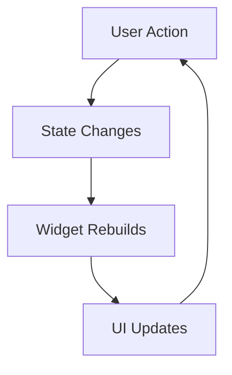
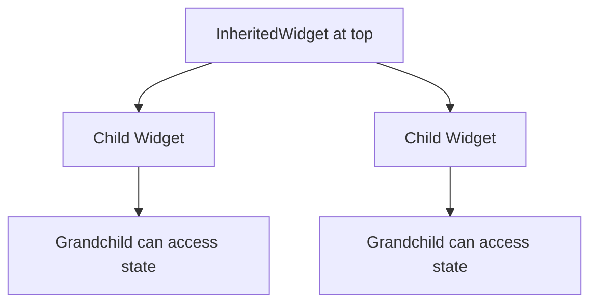
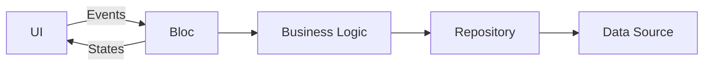
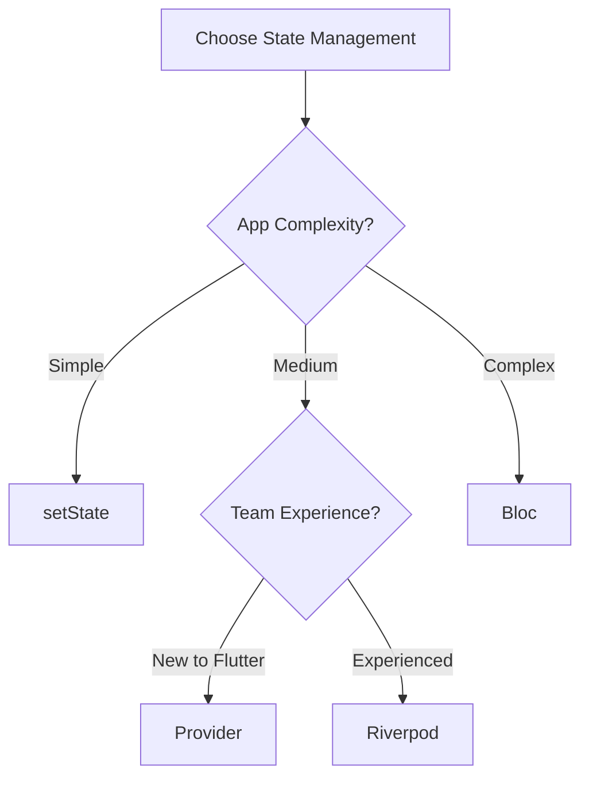

# How to Handle State Management in Flutter

Author: [nawazdhandala](https://www.github.com/nawazdhandala)

Tags: Flutter, State Management, Mobile, Dart

Description: Learn how to handle state management in Flutter applications, from basic setState to advanced solutions like Provider, Riverpod, and Bloc. This guide covers practical patterns, best practices, and when to use each approach.

---

State management is one of the most discussed topics in Flutter development. As your app grows beyond a few screens, you need a strategy for keeping your UI in sync with your data. The right choice depends on your app's complexity, team experience, and specific requirements.

Flutter offers multiple approaches to state management, ranging from the built-in setState for simple cases to sophisticated solutions like Bloc for enterprise applications. This guide walks through each major approach with practical examples so you can make an informed decision for your project.

## Understanding State in Flutter

Before diving into solutions, let's clarify what "state" means in Flutter. State is any data that can change over time and affects what your UI displays.



Flutter distinguishes between two types of state:

**Ephemeral State**: Local to a single widget, like the current page in a PageView or whether a checkbox is checked. Use setState for this.

**App State**: Shared across multiple widgets or needs to persist, like user authentication status, shopping cart contents, or app settings. This is where state management solutions come in.

## setState: The Foundation

Every Flutter developer starts with setState. It's built into StatefulWidget and works well for simple, localized state changes.

### Basic Counter Example

The classic counter demonstrates setState in action. When the button is pressed, setState triggers a rebuild with the new count value.

```dart
// setState triggers a rebuild of the widget when state changes
// Best for simple, single-widget state like toggles or counters
import 'package:flutter/material.dart';

class CounterScreen extends StatefulWidget {
  const CounterScreen({super.key});

  @override
  State<CounterScreen> createState() => _CounterScreenState();
}

class _CounterScreenState extends State<CounterScreen> {
  // State variable that affects the UI
  int _count = 0;

  void _increment() {
    // setState notifies Flutter that state has changed
    // Flutter then calls build() to update the UI
    setState(() {
      _count++;
    });
  }

  @override
  Widget build(BuildContext context) {
    return Scaffold(
      appBar: AppBar(title: const Text('Counter')),
      body: Center(
        child: Text(
          'Count: $_count',
          style: Theme.of(context).textTheme.headlineMedium,
        ),
      ),
      floatingActionButton: FloatingActionButton(
        onPressed: _increment,
        child: const Icon(Icons.add),
      ),
    );
  }
}
```

### Form State with setState

Forms are a common use case for setState. Here's a login form that manages its own validation state.

```dart
// Managing form state with setState
// Good for self-contained forms that don't need external state
class LoginForm extends StatefulWidget {
  const LoginForm({super.key});

  @override
  State<LoginForm> createState() => _LoginFormState();
}

class _LoginFormState extends State<LoginForm> {
  final _formKey = GlobalKey<FormState>();
  final _emailController = TextEditingController();
  final _passwordController = TextEditingController();

  bool _isLoading = false;
  String? _errorMessage;

  @override
  void dispose() {
    // Always dispose controllers to prevent memory leaks
    _emailController.dispose();
    _passwordController.dispose();
    super.dispose();
  }

  Future<void> _submit() async {
    // Validate the form first
    if (!_formKey.currentState!.validate()) return;

    setState(() {
      _isLoading = true;
      _errorMessage = null;
    });

    try {
      // Simulate API call
      await Future.delayed(const Duration(seconds: 2));
      // Handle success - navigate away or show message
    } catch (e) {
      setState(() {
        _errorMessage = 'Login failed. Please try again.';
      });
    } finally {
      setState(() {
        _isLoading = false;
      });
    }
  }

  @override
  Widget build(BuildContext context) {
    return Form(
      key: _formKey,
      child: Column(
        children: [
          if (_errorMessage != null)
            Text(
              _errorMessage!,
              style: const TextStyle(color: Colors.red),
            ),
          TextFormField(
            controller: _emailController,
            decoration: const InputDecoration(labelText: 'Email'),
            validator: (value) {
              if (value == null || !value.contains('@')) {
                return 'Enter a valid email';
              }
              return null;
            },
          ),
          const SizedBox(height: 16),
          TextFormField(
            controller: _passwordController,
            decoration: const InputDecoration(labelText: 'Password'),
            obscureText: true,
            validator: (value) {
              if (value == null || value.length < 6) {
                return 'Password must be at least 6 characters';
              }
              return null;
            },
          ),
          const SizedBox(height: 24),
          ElevatedButton(
            onPressed: _isLoading ? null : _submit,
            child: _isLoading
                ? const CircularProgressIndicator()
                : const Text('Login'),
          ),
        ],
      ),
    );
  }
}
```

### When setState Falls Short

setState works well for isolated widgets but becomes problematic when:

- Multiple widgets need the same data
- State needs to survive widget disposal
- You need to share state across the widget tree
- Business logic gets mixed with UI code

## InheritedWidget and InheritedModel

Flutter's built-in mechanism for sharing state down the widget tree is InheritedWidget. While you rarely use it directly, understanding it helps you grasp how Provider and other solutions work under the hood.



### Custom InheritedWidget

This example shows how InheritedWidget makes data available to descendants without passing it through every constructor.

```dart
// InheritedWidget provides data to all descendants
// Foundation for Provider and other state management solutions
class UserData extends InheritedWidget {
  final String userName;
  final String userEmail;
  final VoidCallback onLogout;

  const UserData({
    super.key,
    required this.userName,
    required this.userEmail,
    required this.onLogout,
    required super.child,
  });

  // Static method for easy access from descendants
  static UserData? of(BuildContext context) {
    return context.dependOnInheritedWidgetOfExactType<UserData>();
  }

  // Determines if widgets should rebuild when data changes
  @override
  bool updateShouldNotify(UserData oldWidget) {
    return userName != oldWidget.userName ||
           userEmail != oldWidget.userEmail;
  }
}

// Using the InheritedWidget from a descendant
class UserProfile extends StatelessWidget {
  const UserProfile({super.key});

  @override
  Widget build(BuildContext context) {
    // Access the inherited data
    final userData = UserData.of(context);

    if (userData == null) {
      return const Text('No user data available');
    }

    return Column(
      children: [
        Text('Name: ${userData.userName}'),
        Text('Email: ${userData.userEmail}'),
        ElevatedButton(
          onPressed: userData.onLogout,
          child: const Text('Logout'),
        ),
      ],
    );
  }
}
```

## Provider: The Recommended Starting Point

Provider is the officially recommended state management solution for most Flutter apps. It builds on InheritedWidget but adds convenience features and better patterns.

### Installation

Add Provider to your pubspec.yaml:

```yaml
dependencies:
  flutter:
    sdk: flutter
  provider: ^6.1.0
```

### Basic Provider Setup

Provider separates your business logic into "providers" that widgets can listen to for changes.

```dart
// ChangeNotifier holds state and notifies listeners when it changes
// Provider makes it available throughout the widget tree
import 'package:flutter/material.dart';
import 'package:provider/provider.dart';

// The state class - extends ChangeNotifier to enable listeners
class CounterProvider extends ChangeNotifier {
  int _count = 0;

  int get count => _count;

  void increment() {
    _count++;
    // Notify all listening widgets to rebuild
    notifyListeners();
  }

  void decrement() {
    _count--;
    notifyListeners();
  }

  void reset() {
    _count = 0;
    notifyListeners();
  }
}

// Provide the state at the top of the tree
class MyApp extends StatelessWidget {
  const MyApp({super.key});

  @override
  Widget build(BuildContext context) {
    return ChangeNotifierProvider(
      // create is called once when the provider is first accessed
      create: (context) => CounterProvider(),
      child: const MaterialApp(
        home: CounterScreen(),
      ),
    );
  }
}

// Consume the state in any descendant widget
class CounterScreen extends StatelessWidget {
  const CounterScreen({super.key});

  @override
  Widget build(BuildContext context) {
    return Scaffold(
      appBar: AppBar(title: const Text('Provider Counter')),
      body: Center(
        child: Column(
          mainAxisAlignment: MainAxisAlignment.center,
          children: [
            // Consumer rebuilds only this part when count changes
            Consumer<CounterProvider>(
              builder: (context, counter, child) {
                return Text(
                  'Count: ${counter.count}',
                  style: Theme.of(context).textTheme.headlineMedium,
                );
              },
            ),
            const SizedBox(height: 20),
            Row(
              mainAxisAlignment: MainAxisAlignment.center,
              children: [
                ElevatedButton(
                  // context.read doesn't listen - use for methods
                  onPressed: () => context.read<CounterProvider>().decrement(),
                  child: const Icon(Icons.remove),
                ),
                const SizedBox(width: 16),
                ElevatedButton(
                  onPressed: () => context.read<CounterProvider>().increment(),
                  child: const Icon(Icons.add),
                ),
              ],
            ),
          ],
        ),
      ),
    );
  }
}
```

### Shopping Cart with Provider

Here's a more realistic example showing a shopping cart implementation with Provider.

```dart
// Shopping cart model with Provider
// Demonstrates a common real-world use case
class Product {
  final String id;
  final String name;
  final double price;
  final String imageUrl;

  const Product({
    required this.id,
    required this.name,
    required this.price,
    required this.imageUrl,
  });
}

class CartItem {
  final Product product;
  int quantity;

  CartItem({required this.product, this.quantity = 1});

  double get total => product.price * quantity;
}

class CartProvider extends ChangeNotifier {
  final Map<String, CartItem> _items = {};

  // Expose items as an unmodifiable list
  List<CartItem> get items => _items.values.toList();

  int get itemCount => _items.length;

  double get totalAmount {
    return _items.values.fold(0, (sum, item) => sum + item.total);
  }

  void addItem(Product product) {
    if (_items.containsKey(product.id)) {
      // Increase quantity if already in cart
      _items[product.id]!.quantity++;
    } else {
      // Add new item to cart
      _items[product.id] = CartItem(product: product);
    }
    notifyListeners();
  }

  void removeItem(String productId) {
    _items.remove(productId);
    notifyListeners();
  }

  void decreaseQuantity(String productId) {
    if (!_items.containsKey(productId)) return;

    if (_items[productId]!.quantity > 1) {
      _items[productId]!.quantity--;
    } else {
      _items.remove(productId);
    }
    notifyListeners();
  }

  void clear() {
    _items.clear();
    notifyListeners();
  }

  bool isInCart(String productId) => _items.containsKey(productId);
}

// Cart screen using the provider
class CartScreen extends StatelessWidget {
  const CartScreen({super.key});

  @override
  Widget build(BuildContext context) {
    return Scaffold(
      appBar: AppBar(
        title: const Text('Shopping Cart'),
        actions: [
          IconButton(
            icon: const Icon(Icons.delete_sweep),
            onPressed: () => context.read<CartProvider>().clear(),
          ),
        ],
      ),
      body: Consumer<CartProvider>(
        builder: (context, cart, child) {
          if (cart.items.isEmpty) {
            return const Center(
              child: Text('Your cart is empty'),
            );
          }

          return Column(
            children: [
              Expanded(
                child: ListView.builder(
                  itemCount: cart.items.length,
                  itemBuilder: (context, index) {
                    final item = cart.items[index];
                    return ListTile(
                      leading: Image.network(
                        item.product.imageUrl,
                        width: 50,
                        height: 50,
                        fit: BoxFit.cover,
                      ),
                      title: Text(item.product.name),
                      subtitle: Text('\$${item.product.price.toStringAsFixed(2)}'),
                      trailing: Row(
                        mainAxisSize: MainAxisSize.min,
                        children: [
                          IconButton(
                            icon: const Icon(Icons.remove),
                            onPressed: () => cart.decreaseQuantity(item.product.id),
                          ),
                          Text('${item.quantity}'),
                          IconButton(
                            icon: const Icon(Icons.add),
                            onPressed: () => cart.addItem(item.product),
                          ),
                        ],
                      ),
                    );
                  },
                ),
              ),
              Container(
                padding: const EdgeInsets.all(16),
                child: Row(
                  mainAxisAlignment: MainAxisAlignment.spaceBetween,
                  children: [
                    Text(
                      'Total: \$${cart.totalAmount.toStringAsFixed(2)}',
                      style: Theme.of(context).textTheme.titleLarge,
                    ),
                    ElevatedButton(
                      onPressed: () {
                        // Handle checkout
                      },
                      child: const Text('Checkout'),
                    ),
                  ],
                ),
              ),
            ],
          );
        },
      ),
    );
  }
}
```

### Multiple Providers

Real apps often need multiple providers. Use MultiProvider to combine them cleanly.

```dart
// MultiProvider combines multiple providers at the root
// Each provider can depend on others if needed
class MyApp extends StatelessWidget {
  const MyApp({super.key});

  @override
  Widget build(BuildContext context) {
    return MultiProvider(
      providers: [
        // Auth provider - other providers might depend on this
        ChangeNotifierProvider(create: (_) => AuthProvider()),

        // Cart provider
        ChangeNotifierProvider(create: (_) => CartProvider()),

        // Theme provider
        ChangeNotifierProvider(create: (_) => ThemeProvider()),

        // Provider that depends on another provider
        ChangeNotifierProxyProvider<AuthProvider, UserDataProvider>(
          create: (_) => UserDataProvider(),
          update: (_, auth, userData) {
            // Update UserDataProvider when AuthProvider changes
            return userData!..updateAuth(auth);
          },
        ),
      ],
      child: Consumer<ThemeProvider>(
        builder: (context, themeProvider, child) {
          return MaterialApp(
            theme: themeProvider.currentTheme,
            home: const HomeScreen(),
          );
        },
      ),
    );
  }
}
```

## Riverpod: Provider Evolved

Riverpod is the spiritual successor to Provider, created by the same author. It fixes several Provider limitations and offers compile-time safety, better testing support, and more flexibility.

### Installation

```yaml
dependencies:
  flutter:
    sdk: flutter
  flutter_riverpod: ^2.4.0
```

### Basic Riverpod Setup

Riverpod providers are declared globally and are type-safe by design.

```dart
// Riverpod providers are global and compile-time safe
// No BuildContext needed to access providers
import 'package:flutter/material.dart';
import 'package:flutter_riverpod/flutter_riverpod.dart';

// Simple state provider for primitive values
final counterProvider = StateProvider<int>((ref) => 0);

// Notifier provider for complex state with methods
class TodoNotifier extends Notifier<List<String>> {
  @override
  List<String> build() {
    // Initial state
    return [];
  }

  void add(String todo) {
    state = [...state, todo];
  }

  void remove(int index) {
    state = [
      for (int i = 0; i < state.length; i++)
        if (i != index) state[i],
    ];
  }

  void toggle(int index) {
    // Immutable update pattern
    state = [
      for (int i = 0; i < state.length; i++)
        if (i == index) '${state[i]} (done)' else state[i],
    ];
  }
}

final todoProvider = NotifierProvider<TodoNotifier, List<String>>(() {
  return TodoNotifier();
});

// Wrap the app with ProviderScope
void main() {
  runApp(
    const ProviderScope(
      child: MyApp(),
    ),
  );
}

class MyApp extends StatelessWidget {
  const MyApp({super.key});

  @override
  Widget build(BuildContext context) {
    return const MaterialApp(
      home: TodoScreen(),
    );
  }
}

// ConsumerWidget replaces StatelessWidget for Riverpod
class TodoScreen extends ConsumerWidget {
  const TodoScreen({super.key});

  @override
  Widget build(BuildContext context, WidgetRef ref) {
    // watch rebuilds widget when provider changes
    final todos = ref.watch(todoProvider);
    final counter = ref.watch(counterProvider);

    return Scaffold(
      appBar: AppBar(
        title: Text('Todos ($counter)'),
      ),
      body: ListView.builder(
        itemCount: todos.length,
        itemBuilder: (context, index) {
          return ListTile(
            title: Text(todos[index]),
            trailing: IconButton(
              icon: const Icon(Icons.delete),
              onPressed: () {
                // read doesn't listen, use for one-time access
                ref.read(todoProvider.notifier).remove(index);
              },
            ),
          );
        },
      ),
      floatingActionButton: FloatingActionButton(
        onPressed: () {
          ref.read(todoProvider.notifier).add('Todo ${todos.length + 1}');
          ref.read(counterProvider.notifier).state++;
        },
        child: const Icon(Icons.add),
      ),
    );
  }
}
```

### Async Data with Riverpod

Riverpod excels at handling async operations like API calls with FutureProvider and StreamProvider.

```dart
// FutureProvider handles async data fetching elegantly
// AsyncValue provides loading, error, and data states
import 'package:flutter_riverpod/flutter_riverpod.dart';

class User {
  final String id;
  final String name;
  final String email;

  User({required this.id, required this.name, required this.email});

  factory User.fromJson(Map<String, dynamic> json) {
    return User(
      id: json['id'],
      name: json['name'],
      email: json['email'],
    );
  }
}

// API service provider
final apiServiceProvider = Provider((ref) => ApiService());

class ApiService {
  Future<User> fetchUser(String userId) async {
    // Simulate API call
    await Future.delayed(const Duration(seconds: 1));
    return User(id: userId, name: 'John Doe', email: 'john@example.com');
  }

  Future<List<User>> fetchUsers() async {
    await Future.delayed(const Duration(seconds: 1));
    return [
      User(id: '1', name: 'John', email: 'john@example.com'),
      User(id: '2', name: 'Jane', email: 'jane@example.com'),
    ];
  }
}

// FutureProvider for fetching data
final usersProvider = FutureProvider<List<User>>((ref) async {
  final apiService = ref.watch(apiServiceProvider);
  return apiService.fetchUsers();
});

// Family modifier for parameterized providers
final userProvider = FutureProvider.family<User, String>((ref, userId) async {
  final apiService = ref.watch(apiServiceProvider);
  return apiService.fetchUser(userId);
});

// Using FutureProvider in a widget
class UsersScreen extends ConsumerWidget {
  const UsersScreen({super.key});

  @override
  Widget build(BuildContext context, WidgetRef ref) {
    // AsyncValue handles loading, error, and data states
    final usersAsync = ref.watch(usersProvider);

    return Scaffold(
      appBar: AppBar(
        title: const Text('Users'),
        actions: [
          // Refresh the data
          IconButton(
            icon: const Icon(Icons.refresh),
            onPressed: () => ref.invalidate(usersProvider),
          ),
        ],
      ),
      body: usersAsync.when(
        // Loading state
        loading: () => const Center(child: CircularProgressIndicator()),
        // Error state
        error: (error, stack) => Center(
          child: Column(
            mainAxisAlignment: MainAxisAlignment.center,
            children: [
              Text('Error: $error'),
              ElevatedButton(
                onPressed: () => ref.invalidate(usersProvider),
                child: const Text('Retry'),
              ),
            ],
          ),
        ),
        // Data state
        data: (users) => ListView.builder(
          itemCount: users.length,
          itemBuilder: (context, index) {
            final user = users[index];
            return ListTile(
              title: Text(user.name),
              subtitle: Text(user.email),
              onTap: () {
                // Navigate to user detail with family provider
                Navigator.push(
                  context,
                  MaterialPageRoute(
                    builder: (_) => UserDetailScreen(userId: user.id),
                  ),
                );
              },
            );
          },
        ),
      ),
    );
  }
}
```

## Bloc: Enterprise-Grade State Management

Bloc (Business Logic Component) enforces a strict separation between UI and business logic through events and states. It's excellent for complex apps where predictability and testability are paramount.



### Installation

```yaml
dependencies:
  flutter:
    sdk: flutter
  flutter_bloc: ^8.1.3
  equatable: ^2.0.5
```

### Counter with Bloc

Even a simple counter demonstrates Bloc's structured approach with events and states.

```dart
// Bloc separates concerns into Events (input) and States (output)
// Great for complex apps requiring strict architecture
import 'package:flutter/material.dart';
import 'package:flutter_bloc/flutter_bloc.dart';
import 'package:equatable/equatable.dart';

// Events - what can happen
abstract class CounterEvent extends Equatable {
  @override
  List<Object> get props => [];
}

class IncrementPressed extends CounterEvent {}

class DecrementPressed extends CounterEvent {}

class ResetPressed extends CounterEvent {}

// States - what the UI should show
class CounterState extends Equatable {
  final int count;
  final bool isLoading;

  const CounterState({
    this.count = 0,
    this.isLoading = false,
  });

  // copyWith for immutable updates
  CounterState copyWith({int? count, bool? isLoading}) {
    return CounterState(
      count: count ?? this.count,
      isLoading: isLoading ?? this.isLoading,
    );
  }

  @override
  List<Object> get props => [count, isLoading];
}

// Bloc - handles events and emits states
class CounterBloc extends Bloc<CounterEvent, CounterState> {
  CounterBloc() : super(const CounterState()) {
    // Register event handlers
    on<IncrementPressed>(_onIncrement);
    on<DecrementPressed>(_onDecrement);
    on<ResetPressed>(_onReset);
  }

  void _onIncrement(IncrementPressed event, Emitter<CounterState> emit) {
    emit(state.copyWith(count: state.count + 1));
  }

  void _onDecrement(DecrementPressed event, Emitter<CounterState> emit) {
    emit(state.copyWith(count: state.count - 1));
  }

  Future<void> _onReset(ResetPressed event, Emitter<CounterState> emit) async {
    // Demonstrate async operation in bloc
    emit(state.copyWith(isLoading: true));
    await Future.delayed(const Duration(milliseconds: 500));
    emit(const CounterState()); // Reset to initial state
  }
}

// UI using the bloc
class CounterScreen extends StatelessWidget {
  const CounterScreen({super.key});

  @override
  Widget build(BuildContext context) {
    return BlocProvider(
      create: (_) => CounterBloc(),
      child: const CounterView(),
    );
  }
}

class CounterView extends StatelessWidget {
  const CounterView({super.key});

  @override
  Widget build(BuildContext context) {
    return Scaffold(
      appBar: AppBar(
        title: const Text('Bloc Counter'),
        actions: [
          IconButton(
            icon: const Icon(Icons.refresh),
            onPressed: () => context.read<CounterBloc>().add(ResetPressed()),
          ),
        ],
      ),
      body: Center(
        child: BlocBuilder<CounterBloc, CounterState>(
          builder: (context, state) {
            if (state.isLoading) {
              return const CircularProgressIndicator();
            }
            return Text(
              'Count: ${state.count}',
              style: Theme.of(context).textTheme.headlineMedium,
            );
          },
        ),
      ),
      floatingActionButton: Column(
        mainAxisAlignment: MainAxisAlignment.end,
        children: [
          FloatingActionButton(
            heroTag: 'increment',
            onPressed: () => context.read<CounterBloc>().add(IncrementPressed()),
            child: const Icon(Icons.add),
          ),
          const SizedBox(height: 8),
          FloatingActionButton(
            heroTag: 'decrement',
            onPressed: () => context.read<CounterBloc>().add(DecrementPressed()),
            child: const Icon(Icons.remove),
          ),
        ],
      ),
    );
  }
}
```

### Authentication Bloc Example

Here's a more complex authentication flow demonstrating Bloc's strength in handling multiple states and side effects.

```dart
// Authentication bloc with multiple states
// Shows real-world complexity handling
import 'package:flutter_bloc/flutter_bloc.dart';
import 'package:equatable/equatable.dart';

// User model
class User {
  final String id;
  final String email;
  final String name;

  const User({required this.id, required this.email, required this.name});
}

// Auth Events
abstract class AuthEvent extends Equatable {
  @override
  List<Object?> get props => [];
}

class AuthCheckRequested extends AuthEvent {}

class LoginRequested extends AuthEvent {
  final String email;
  final String password;

  LoginRequested({required this.email, required this.password});

  @override
  List<Object?> get props => [email, password];
}

class LogoutRequested extends AuthEvent {}

// Auth States
abstract class AuthState extends Equatable {
  @override
  List<Object?> get props => [];
}

class AuthInitial extends AuthState {}

class AuthLoading extends AuthState {}

class Authenticated extends AuthState {
  final User user;

  Authenticated(this.user);

  @override
  List<Object?> get props => [user];
}

class Unauthenticated extends AuthState {}

class AuthError extends AuthState {
  final String message;

  AuthError(this.message);

  @override
  List<Object?> get props => [message];
}

// Auth Repository
class AuthRepository {
  Future<User> login(String email, String password) async {
    await Future.delayed(const Duration(seconds: 2));

    if (email == 'test@example.com' && password == 'password') {
      return const User(id: '1', email: 'test@example.com', name: 'Test User');
    }

    throw Exception('Invalid credentials');
  }

  Future<void> logout() async {
    await Future.delayed(const Duration(milliseconds: 500));
  }

  Future<User?> getCurrentUser() async {
    await Future.delayed(const Duration(seconds: 1));
    return null; // No cached user
  }
}

// Auth Bloc
class AuthBloc extends Bloc<AuthEvent, AuthState> {
  final AuthRepository _authRepository;

  AuthBloc({required AuthRepository authRepository})
      : _authRepository = authRepository,
        super(AuthInitial()) {
    on<AuthCheckRequested>(_onAuthCheckRequested);
    on<LoginRequested>(_onLoginRequested);
    on<LogoutRequested>(_onLogoutRequested);
  }

  Future<void> _onAuthCheckRequested(
    AuthCheckRequested event,
    Emitter<AuthState> emit,
  ) async {
    emit(AuthLoading());
    try {
      final user = await _authRepository.getCurrentUser();
      if (user != null) {
        emit(Authenticated(user));
      } else {
        emit(Unauthenticated());
      }
    } catch (e) {
      emit(Unauthenticated());
    }
  }

  Future<void> _onLoginRequested(
    LoginRequested event,
    Emitter<AuthState> emit,
  ) async {
    emit(AuthLoading());
    try {
      final user = await _authRepository.login(event.email, event.password);
      emit(Authenticated(user));
    } catch (e) {
      emit(AuthError(e.toString()));
    }
  }

  Future<void> _onLogoutRequested(
    LogoutRequested event,
    Emitter<AuthState> emit,
  ) async {
    emit(AuthLoading());
    await _authRepository.logout();
    emit(Unauthenticated());
  }
}

// Using BlocListener for side effects like navigation
class AuthWrapper extends StatelessWidget {
  const AuthWrapper({super.key});

  @override
  Widget build(BuildContext context) {
    return BlocListener<AuthBloc, AuthState>(
      listener: (context, state) {
        // Handle side effects based on state changes
        if (state is AuthError) {
          ScaffoldMessenger.of(context).showSnackBar(
            SnackBar(content: Text(state.message)),
          );
        }
      },
      child: BlocBuilder<AuthBloc, AuthState>(
        builder: (context, state) {
          if (state is AuthLoading || state is AuthInitial) {
            return const Scaffold(
              body: Center(child: CircularProgressIndicator()),
            );
          }

          if (state is Authenticated) {
            return HomeScreen(user: state.user);
          }

          return const LoginScreen();
        },
      ),
    );
  }
}
```

## Comparing State Management Solutions



| Solution | Best For | Learning Curve | Boilerplate | Testability |
|----------|----------|----------------|-------------|-------------|
| **setState** | Simple widgets | Low | None | Medium |
| **Provider** | Most apps | Low | Low | Good |
| **Riverpod** | Medium-large apps | Medium | Low | Excellent |
| **Bloc** | Enterprise apps | High | High | Excellent |

## Best Practices

### 1. Keep State Minimal

Only store what you need to derive the UI. Compute derived values instead of storing them.

```dart
// Good - compute derived values
class CartProvider extends ChangeNotifier {
  final List<CartItem> _items = [];

  // Compute total instead of storing it
  double get total => _items.fold(0, (sum, item) => sum + item.price);
}

// Avoid - redundant stored state
class BadCartProvider extends ChangeNotifier {
  final List<CartItem> _items = [];
  double _total = 0; // Redundant, can get out of sync
}
```

### 2. Immutable State Updates

Always create new objects instead of mutating existing state.

```dart
// Good - immutable update
void addItem(String item) {
  state = [...state, item];
}

// Avoid - mutating state
void addItem(String item) {
  state.add(item); // This won't trigger updates
}
```

### 3. Separation of Concerns

Keep your state management classes focused on business logic, not UI concerns.

```dart
// Good - business logic only
class AuthProvider extends ChangeNotifier {
  User? _user;

  Future<void> login(String email, String password) async {
    _user = await _authService.login(email, password);
    notifyListeners();
  }
}

// Avoid - UI logic in state class
class BadAuthProvider extends ChangeNotifier {
  void login(BuildContext context, String email, String password) {
    // Don't use BuildContext in providers
    Navigator.of(context).pushReplacement(...);
  }
}
```

### 4. Test Your State

State management classes should be easily testable without Flutter.

```dart
// Testing a Provider
void main() {
  test('CartProvider adds items correctly', () {
    final cart = CartProvider();

    cart.addItem(Product(id: '1', name: 'Test', price: 10));

    expect(cart.itemCount, 1);
    expect(cart.totalAmount, 10);
  });

  test('CartProvider increments quantity for duplicate items', () {
    final cart = CartProvider();
    final product = Product(id: '1', name: 'Test', price: 10);

    cart.addItem(product);
    cart.addItem(product);

    expect(cart.itemCount, 1); // Still one item
    expect(cart.items.first.quantity, 2);
    expect(cart.totalAmount, 20);
  });
}
```

## Conclusion

State management in Flutter doesn't have to be overwhelming. Start with the simplest solution that meets your needs:

- **Use setState** for local, ephemeral state within a single widget
- **Use Provider** for most apps that need to share state across widgets
- **Use Riverpod** when you need better testability, compile-time safety, or complex async handling
- **Use Bloc** for large enterprise apps where strict architecture and predictability are requirements

The best state management solution is the one your team understands and can maintain. Don't overcomplicate your app with patterns you don't need yet. You can always migrate to a more sophisticated solution as your app grows.

---

*Building Flutter apps that need to communicate with backend services? Monitor your APIs and get alerted when issues arise with [OneUptime](https://oneuptime.com). Track response times, catch errors, and ensure your mobile app's backend stays reliable.*

**Related Reading:**
- [How to Build Navigation in Flutter](https://oneuptime.com/blog/post/2026-02-02-flutter-navigation/view)
- [How to Set Up Flutter Development Environment on Ubuntu](https://oneuptime.com/blog/post/2026-01-15-setup-flutter-development-ubuntu/view)
