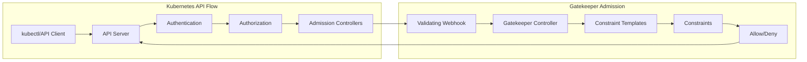
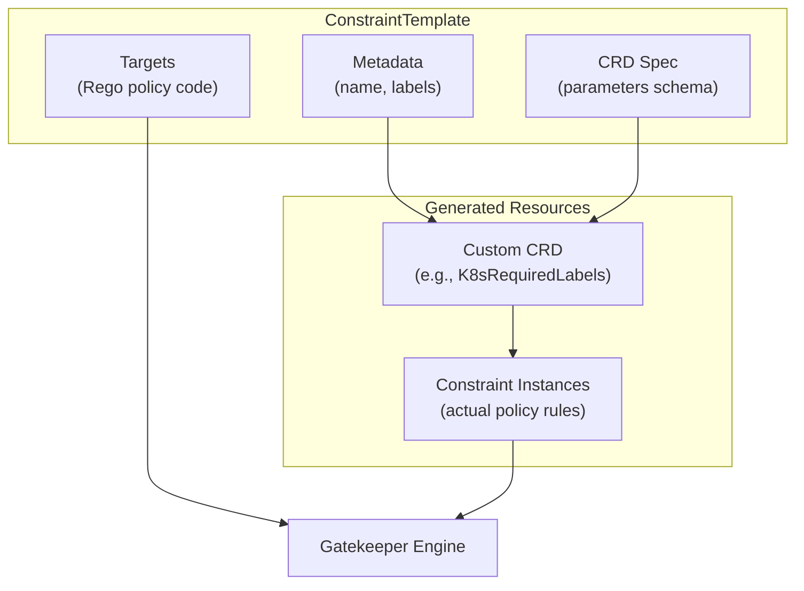
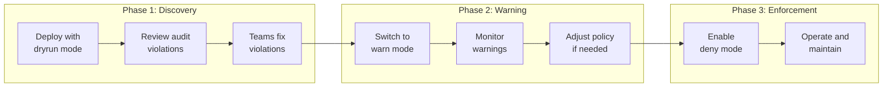

# How to Create Gatekeeper Constraint Templates

Author: [nawazdhandala](https://github.com/nawazdhandala)

Tags: Gatekeeper, Kubernetes, OPA, Policy as Code, Security, Admission Control, Rego, Compliance

Description: A practical guide to creating custom Gatekeeper Constraint Templates for Kubernetes policy enforcement. Learn Rego basics, template structure, testing strategies, and production deployment patterns.

---

> Policy enforcement in Kubernetes shouldn't be an afterthought. Gatekeeper brings Open Policy Agent (OPA) to Kubernetes as a native admission controller, letting you define and enforce policies through custom resources. Building your own Constraint Templates unlocks the full power of policy-as-code for your clusters.

Kubernetes clusters without policy enforcement are security incidents waiting to happen. Teams can accidentally deploy privileged containers, expose services without authentication, or create resources that violate compliance requirements. Gatekeeper solves this by intercepting every API request and evaluating it against your policies.

---

## Understanding Gatekeeper Architecture

Before writing Constraint Templates, understanding how Gatekeeper processes admission requests helps you write better policies.



Gatekeeper operates as a validating admission webhook. Every resource creation, update, or deletion request passes through Gatekeeper before being persisted to etcd. Your Constraint Templates define the policy logic, while Constraints configure how those policies apply to specific resources.

---

## Constraint Template Structure

A Constraint Template consists of three main parts: metadata, the CRD specification, and the Rego policy code.



When you create a Constraint Template, Gatekeeper automatically generates a Custom Resource Definition (CRD) for that policy type. You then create instances of that CRD (called Constraints) to apply the policy to specific resources.

---

## Installing Gatekeeper

Deploy Gatekeeper to your cluster before creating templates.

The following commands install Gatekeeper using the official Helm chart with recommended production settings:

```bash
# Add the Gatekeeper Helm repository
helm repo add gatekeeper https://open-policy-agent.github.io/gatekeeper/charts

# Update local chart cache
helm repo update

# Install Gatekeeper with audit and mutation features enabled
# The replicas ensure high availability for the admission webhook
helm install gatekeeper gatekeeper/gatekeeper \
    --namespace gatekeeper-system \
    --create-namespace \
    --set replicas=3 \
    --set auditInterval=60 \
    --set constraintViolationsLimit=100 \
    --set auditFromCache=true \
    --set mutatingWebhookEnabled=true
```

Verify the installation by checking the running pods:

```bash
# Confirm all Gatekeeper components are running
# You should see gatekeeper-audit and gatekeeper-controller-manager pods
kubectl get pods -n gatekeeper-system

# Check the webhook configuration
kubectl get validatingwebhookconfigurations | grep gatekeeper
```

---

## Your First Constraint Template

Let's build a template that requires specific labels on all Kubernetes resources. Labels are essential for resource organization, cost allocation, and ownership tracking.

The template below defines a policy requiring specified labels with optional value validation:

```yaml
# required-labels-template.yaml
# ConstraintTemplate requiring specific labels on Kubernetes resources
# Supports both label presence checks and regex-based value validation
apiVersion: templates.gatekeeper.sh/v1
kind: ConstraintTemplate
metadata:
  name: k8srequiredlabels
  annotations:
    description: "Requires specified labels on all resources"
spec:
  crd:
    spec:
      names:
        # The kind name for the generated CRD
        # Constraints will use this as their kind
        kind: K8sRequiredLabels
      validation:
        openAPIV3Schema:
          type: object
          properties:
            # Labels is an array of required label configurations
            labels:
              type: array
              items:
                type: object
                properties:
                  # The label key that must be present
                  key:
                    type: string
                  # Optional regex pattern for allowed values
                  allowedRegex:
                    type: string
  targets:
    - target: admission.k8s.gatekeeper.sh
      rego: |
        package k8srequiredlabels

        # Deny rule returns violations when conditions are met
        # Each violation includes a message explaining the issue
        violation[{"msg": msg, "details": {"missing_labels": missing}}] {
            # Get the set of provided labels from the resource
            provided := {label | input.review.object.metadata.labels[label]}

            # Get the set of required label keys from parameters
            required := {label | label := input.parameters.labels[_].key}

            # Calculate which required labels are missing
            missing := required - provided

            # Only trigger violation if labels are actually missing
            count(missing) > 0

            # Construct helpful error message
            msg := sprintf("Resource is missing required labels: %v", [missing])
        }

        # Second violation rule checks label value patterns
        violation[{"msg": msg}] {
            # Iterate through each label requirement
            label_config := input.parameters.labels[_]

            # Only check if allowedRegex is specified
            label_config.allowedRegex != ""

            # Get the actual value from the resource
            value := input.review.object.metadata.labels[label_config.key]

            # Test if value matches the required pattern
            not re_match(label_config.allowedRegex, value)

            # Report which label has an invalid value
            msg := sprintf("Label '%v' has value '%v' which does not match pattern '%v'", [label_config.key, value, label_config.allowedRegex])
        }
```

Apply the template and create a constraint:

```bash
# Create the ConstraintTemplate
# Gatekeeper will generate the K8sRequiredLabels CRD automatically
kubectl apply -f required-labels-template.yaml

# Verify the CRD was created
kubectl get crd | grep k8srequiredlabels
```

Now create a Constraint that uses the template:

```yaml
# require-team-label.yaml
# Constraint requiring 'team' and 'environment' labels on all Deployments
# The team label must match a specific pattern (lowercase letters and hyphens)
apiVersion: constraints.gatekeeper.sh/v1beta1
kind: K8sRequiredLabels
metadata:
  name: require-team-labels
spec:
  # enforcementAction can be: deny, dryrun, or warn
  # Use dryrun when first deploying to see violations without blocking
  enforcementAction: deny
  match:
    # Apply this constraint to Deployment resources
    kinds:
      - apiGroups: ["apps"]
        kinds: ["Deployment"]
    # Exclude system namespaces from policy enforcement
    excludedNamespaces:
      - kube-system
      - gatekeeper-system
  parameters:
    labels:
      - key: "team"
        # Team names must be lowercase with optional hyphens
        allowedRegex: "^[a-z]+(-[a-z]+)*$"
      - key: "environment"
        # Environment must be one of: dev, staging, production
        allowedRegex: "^(dev|staging|production)$"
```

Test the policy by attempting to create a non-compliant deployment:

```bash
# Apply the constraint
kubectl apply -f require-team-label.yaml

# Try creating a deployment without required labels
# Gatekeeper should reject this request
kubectl create deployment nginx --image=nginx

# Expected error:
# Error from server (Forbidden): admission webhook "validation.gatekeeper.sh" denied the request:
# [require-team-labels] Resource is missing required labels: {"environment", "team"}
```

---

## Writing Rego for Gatekeeper

Rego is OPA's policy language. Understanding its key concepts helps you write effective policies.

### Input Structure

Gatekeeper provides the admission request in a standardized format:

```rego
# The input object contains everything about the admission request
# input.review.object - the resource being created/modified
# input.review.oldObject - the previous version (for updates)
# input.review.operation - CREATE, UPDATE, DELETE
# input.parameters - values from the Constraint spec

package example

violation[{"msg": msg}] {
    # Access the resource being admitted
    resource := input.review.object

    # Access constraint parameters
    params := input.parameters

    # Access operation type
    operation := input.review.operation

    # Access namespace (if applicable)
    namespace := input.review.object.metadata.namespace

    # Build your policy logic here
    # Return violations when policy conditions are violated
}
```

### Common Rego Patterns

The following patterns appear frequently in Gatekeeper policies:

```rego
package commonpatterns

# Pattern 1: Check if a field exists
# Uses default to handle missing fields safely
has_field(object, field) {
    object[field]
}

has_field(object, field) {
    object[field] == false
}

# Pattern 2: Safe field access with default value
# Returns default_value if field is missing
get_field(object, field, default_value) = value {
    has_field(object, field)
    value := object[field]
}

get_field(object, field, default_value) = value {
    not has_field(object, field)
    value := default_value
}

# Pattern 3: Iterate over containers in a pod spec
# Works for Deployments, StatefulSets, DaemonSets, Jobs
get_containers(review) = containers {
    # Direct pod
    review.object.kind == "Pod"
    containers := review.object.spec.containers
}

get_containers(review) = containers {
    # Pod template in a workload
    review.object.kind != "Pod"
    containers := review.object.spec.template.spec.containers
}

# Pattern 4: Check annotations with default
get_annotation(object, key, default_value) = value {
    value := object.metadata.annotations[key]
}

get_annotation(object, key, default_value) = value {
    not object.metadata.annotations[key]
    value := default_value
}
```

---

## Container Security Template

Security policies for container configurations prevent many common vulnerabilities. The following template enforces container security best practices:

```yaml
# container-security-template.yaml
# ConstraintTemplate enforcing container security settings
# Checks for privileged mode, root user, and capability restrictions
apiVersion: templates.gatekeeper.sh/v1
kind: ConstraintTemplate
metadata:
  name: k8scontainersecurity
  annotations:
    description: "Enforces security settings for containers"
spec:
  crd:
    spec:
      names:
        kind: K8sContainerSecurity
      validation:
        openAPIV3Schema:
          type: object
          properties:
            # Deny containers running as privileged
            denyPrivileged:
              type: boolean
              default: true
            # Deny containers running as root
            denyRunAsRoot:
              type: boolean
              default: true
            # List of Linux capabilities that must be dropped
            requiredDropCapabilities:
              type: array
              items:
                type: string
            # Maximum allowed user ID (deny root UID 0)
            minRunAsUser:
              type: integer
              default: 1000
  targets:
    - target: admission.k8s.gatekeeper.sh
      rego: |
        package k8scontainersecurity

        # Helper: Extract all containers from any workload type
        # Handles Pods, Deployments, StatefulSets, DaemonSets, Jobs, CronJobs
        get_all_containers[container] {
            container := input.review.object.spec.containers[_]
        }

        get_all_containers[container] {
            container := input.review.object.spec.template.spec.containers[_]
        }

        get_all_containers[container] {
            container := input.review.object.spec.initContainers[_]
        }

        get_all_containers[container] {
            container := input.review.object.spec.template.spec.initContainers[_]
        }

        # Violation: Privileged containers
        # Privileged mode gives container full host access
        violation[{"msg": msg, "details": {"container": container.name}}] {
            input.parameters.denyPrivileged == true
            container := get_all_containers[_]
            container.securityContext.privileged == true
            msg := sprintf("Container '%v' is running in privileged mode which is not allowed", [container.name])
        }

        # Violation: Running as root user
        # Root in container can escape to host in certain scenarios
        violation[{"msg": msg, "details": {"container": container.name}}] {
            input.parameters.denyRunAsRoot == true
            container := get_all_containers[_]

            # Check runAsNonRoot is not set to true
            not container.securityContext.runAsNonRoot == true

            # Check runAsUser is not set or is 0 (root)
            run_as_user := object.get(container.securityContext, "runAsUser", 0)
            run_as_user == 0

            msg := sprintf("Container '%v' is configured to run as root. Set runAsNonRoot: true or runAsUser >= %v", [container.name, input.parameters.minRunAsUser])
        }

        # Violation: Missing required capability drops
        # Certain capabilities should always be dropped for security
        violation[{"msg": msg, "details": {"container": container.name, "missing": missing_caps}}] {
            count(input.parameters.requiredDropCapabilities) > 0
            container := get_all_containers[_]

            # Get the list of dropped capabilities (or empty if not specified)
            dropped := object.get(container.securityContext.capabilities, "drop", [])

            # Find which required capabilities are not in the drop list
            required := {cap | cap := input.parameters.requiredDropCapabilities[_]}
            actual_dropped := {cap | cap := dropped[_]}
            missing_caps := required - actual_dropped

            count(missing_caps) > 0

            msg := sprintf("Container '%v' must drop these capabilities: %v", [container.name, missing_caps])
        }

        # Violation: runAsUser below minimum threshold
        # Prevents using low UIDs that might have special permissions
        violation[{"msg": msg, "details": {"container": container.name}}] {
            input.parameters.minRunAsUser > 0
            container := get_all_containers[_]

            run_as_user := container.securityContext.runAsUser
            run_as_user < input.parameters.minRunAsUser

            msg := sprintf("Container '%v' has runAsUser %v which is below minimum allowed %v", [container.name, run_as_user, input.parameters.minRunAsUser])
        }
```

Create a constraint for production workloads:

```yaml
# production-container-security.yaml
# Strict container security requirements for production namespaces
apiVersion: constraints.gatekeeper.sh/v1beta1
kind: K8sContainerSecurity
metadata:
  name: production-container-security
spec:
  enforcementAction: deny
  match:
    kinds:
      - apiGroups: [""]
        kinds: ["Pod"]
      - apiGroups: ["apps"]
        kinds: ["Deployment", "StatefulSet", "DaemonSet"]
      - apiGroups: ["batch"]
        kinds: ["Job", "CronJob"]
    namespaceSelector:
      matchLabels:
        environment: production
  parameters:
    denyPrivileged: true
    denyRunAsRoot: true
    minRunAsUser: 1000
    requiredDropCapabilities:
      - ALL
```

---

## Resource Limits Template

Preventing resource exhaustion requires enforcing CPU and memory limits on all containers:

```yaml
# resource-limits-template.yaml
# ConstraintTemplate requiring resource limits on containers
# Enforces both presence and maximum values for CPU and memory
apiVersion: templates.gatekeeper.sh/v1
kind: ConstraintTemplate
metadata:
  name: k8sresourcelimits
  annotations:
    description: "Requires resource limits and requests on containers"
spec:
  crd:
    spec:
      names:
        kind: K8sResourceLimits
      validation:
        openAPIV3Schema:
          type: object
          properties:
            # Require CPU limits to be set
            requireCPULimit:
              type: boolean
              default: true
            # Require memory limits to be set
            requireMemoryLimit:
              type: boolean
              default: true
            # Maximum allowed CPU limit (in millicores)
            maxCPULimit:
              type: string
            # Maximum allowed memory limit
            maxMemoryLimit:
              type: string
            # Require requests to be set
            requireRequests:
              type: boolean
              default: true
  targets:
    - target: admission.k8s.gatekeeper.sh
      rego: |
        package k8sresourcelimits

        # Extract containers from various workload types
        get_containers[container] {
            container := input.review.object.spec.containers[_]
        }

        get_containers[container] {
            container := input.review.object.spec.template.spec.containers[_]
        }

        # Violation: Missing CPU limit
        violation[{"msg": msg, "details": {"container": container.name}}] {
            input.parameters.requireCPULimit == true
            container := get_containers[_]

            # Check if limits.cpu is missing or empty
            not container.resources.limits.cpu

            msg := sprintf("Container '%v' does not have a CPU limit configured", [container.name])
        }

        # Violation: Missing memory limit
        violation[{"msg": msg, "details": {"container": container.name}}] {
            input.parameters.requireMemoryLimit == true
            container := get_containers[_]

            # Check if limits.memory is missing or empty
            not container.resources.limits.memory

            msg := sprintf("Container '%v' does not have a memory limit configured", [container.name])
        }

        # Violation: Missing resource requests
        violation[{"msg": msg, "details": {"container": container.name, "missing": missing}}] {
            input.parameters.requireRequests == true
            container := get_containers[_]

            # Check for missing CPU or memory requests
            missing := [x |
                resources := ["cpu", "memory"]
                resource := resources[_]
                not container.resources.requests[resource]
                x := resource
            ]

            count(missing) > 0

            msg := sprintf("Container '%v' is missing resource requests for: %v", [container.name, missing])
        }

        # Violation: CPU limit exceeds maximum
        # Parse CPU values and compare against maximum
        violation[{"msg": msg, "details": {"container": container.name}}] {
            input.parameters.maxCPULimit
            container := get_containers[_]

            cpu_limit := container.resources.limits.cpu
            max_cpu := input.parameters.maxCPULimit

            # Convert to millicores for comparison
            cpu_millicores := parse_cpu(cpu_limit)
            max_millicores := parse_cpu(max_cpu)

            cpu_millicores > max_millicores

            msg := sprintf("Container '%v' CPU limit %v exceeds maximum allowed %v", [container.name, cpu_limit, max_cpu])
        }

        # Violation: Memory limit exceeds maximum
        violation[{"msg": msg, "details": {"container": container.name}}] {
            input.parameters.maxMemoryLimit
            container := get_containers[_]

            mem_limit := container.resources.limits.memory
            max_mem := input.parameters.maxMemoryLimit

            # Convert to bytes for comparison
            mem_bytes := parse_memory(mem_limit)
            max_bytes := parse_memory(max_mem)

            mem_bytes > max_bytes

            msg := sprintf("Container '%v' memory limit %v exceeds maximum allowed %v", [container.name, mem_limit, max_mem])
        }

        # Helper: Parse CPU string to millicores
        # Handles formats: "100m", "0.5", "1", "2000m"
        parse_cpu(cpu) = millicores {
            endswith(cpu, "m")
            millicores := to_number(trim_suffix(cpu, "m"))
        }

        parse_cpu(cpu) = millicores {
            not endswith(cpu, "m")
            millicores := to_number(cpu) * 1000
        }

        # Helper: Parse memory string to bytes
        # Handles formats: "128Mi", "1Gi", "512M", "1G"
        parse_memory(mem) = bytes {
            endswith(mem, "Ki")
            bytes := to_number(trim_suffix(mem, "Ki")) * 1024
        }

        parse_memory(mem) = bytes {
            endswith(mem, "Mi")
            bytes := to_number(trim_suffix(mem, "Mi")) * 1024 * 1024
        }

        parse_memory(mem) = bytes {
            endswith(mem, "Gi")
            bytes := to_number(trim_suffix(mem, "Gi")) * 1024 * 1024 * 1024
        }

        parse_memory(mem) = bytes {
            endswith(mem, "K")
            bytes := to_number(trim_suffix(mem, "K")) * 1000
        }

        parse_memory(mem) = bytes {
            endswith(mem, "M")
            bytes := to_number(trim_suffix(mem, "M")) * 1000 * 1000
        }

        parse_memory(mem) = bytes {
            endswith(mem, "G")
            bytes := to_number(trim_suffix(mem, "G")) * 1000 * 1000 * 1000
        }
```

Apply a constraint with reasonable defaults:

```yaml
# default-resource-limits.yaml
# Require resource limits on all workloads cluster-wide
apiVersion: constraints.gatekeeper.sh/v1beta1
kind: K8sResourceLimits
metadata:
  name: require-resource-limits
spec:
  enforcementAction: deny
  match:
    kinds:
      - apiGroups: [""]
        kinds: ["Pod"]
      - apiGroups: ["apps"]
        kinds: ["Deployment", "StatefulSet", "DaemonSet", "ReplicaSet"]
      - apiGroups: ["batch"]
        kinds: ["Job", "CronJob"]
    excludedNamespaces:
      - kube-system
      - gatekeeper-system
      - cert-manager
  parameters:
    requireCPULimit: true
    requireMemoryLimit: true
    requireRequests: true
    maxCPULimit: "4000m"
    maxMemoryLimit: "8Gi"
```

---

## Network Policy Template

Enforcing network segmentation prevents lateral movement in case of a breach:

```yaml
# network-policy-template.yaml
# ConstraintTemplate requiring NetworkPolicy for namespaces
# Ensures workloads are not exposed without explicit network rules
apiVersion: templates.gatekeeper.sh/v1
kind: ConstraintTemplate
metadata:
  name: k8srequirenetworkpolicy
  annotations:
    description: "Requires NetworkPolicy to exist for workloads"
spec:
  crd:
    spec:
      names:
        kind: K8sRequireNetworkPolicy
      validation:
        openAPIV3Schema:
          type: object
          properties:
            # Require ingress rules to be defined
            requireIngress:
              type: boolean
              default: true
            # Require egress rules to be defined
            requireEgress:
              type: boolean
              default: false
  targets:
    - target: admission.k8s.gatekeeper.sh
      rego: |
        package k8srequirenetworkpolicy

        # Check if any NetworkPolicy in the namespace covers this workload
        # Uses data.inventory to access cluster state

        violation[{"msg": msg}] {
            # Only check workloads that create pods
            kinds := {"Deployment", "StatefulSet", "DaemonSet", "ReplicaSet"}
            kinds[input.review.object.kind]

            namespace := input.review.object.metadata.namespace

            # Get pod labels from the workload template
            pod_labels := input.review.object.spec.template.metadata.labels

            # Check if any NetworkPolicy matches these labels
            not has_matching_network_policy(namespace, pod_labels)

            msg := sprintf("No NetworkPolicy found that matches workload '%v' in namespace '%v'. Create a NetworkPolicy with matching pod selector.", [input.review.object.metadata.name, namespace])
        }

        # Helper: Check if a NetworkPolicy exists that matches the pod labels
        has_matching_network_policy(namespace, pod_labels) {
            # Get all NetworkPolicies in the namespace from Gatekeeper's cache
            policy := data.inventory.namespace[namespace]["networking.k8s.io/v1"]["NetworkPolicy"][_]

            # Check if the policy's podSelector matches our pod labels
            selector_matches(policy.spec.podSelector.matchLabels, pod_labels)
        }

        # Empty selector matches all pods
        has_matching_network_policy(namespace, pod_labels) {
            policy := data.inventory.namespace[namespace]["networking.k8s.io/v1"]["NetworkPolicy"][_]
            count(policy.spec.podSelector) == 0
        }

        # Helper: Check if selector labels match pod labels
        selector_matches(selector, pod_labels) {
            # All selector labels must be present in pod labels
            keys := [key | selector[key]]
            all_match := [match |
                key := keys[_]
                pod_labels[key] == selector[key]
                match := true
            ]
            count(all_match) == count(keys)
        }
```

---

## Testing Constraint Templates

Testing policies before deployment prevents unexpected rejections in production. Use Gatekeeper's built-in testing capabilities.

### Unit Testing with OPA

Create test files alongside your Rego policies:

```rego
# required_labels_test.rego
# Unit tests for the required labels policy
package k8srequiredlabels

# Test: Resource with all required labels should pass
test_allow_with_all_labels {
    input := {
        "review": {
            "object": {
                "metadata": {
                    "labels": {
                        "team": "platform",
                        "environment": "production"
                    }
                }
            }
        },
        "parameters": {
            "labels": [
                {"key": "team", "allowedRegex": ""},
                {"key": "environment", "allowedRegex": ""}
            ]
        }
    }

    # No violations should be returned
    count(violation) == 0 with input as input
}

# Test: Resource missing labels should be denied
test_deny_missing_labels {
    input := {
        "review": {
            "object": {
                "metadata": {
                    "labels": {
                        "team": "platform"
                    }
                }
            }
        },
        "parameters": {
            "labels": [
                {"key": "team", "allowedRegex": ""},
                {"key": "environment", "allowedRegex": ""}
            ]
        }
    }

    # Should return exactly one violation
    count(violation) == 1 with input as input
}

# Test: Invalid label value should be denied
test_deny_invalid_label_value {
    input := {
        "review": {
            "object": {
                "metadata": {
                    "labels": {
                        "team": "INVALID_CAPS",
                        "environment": "production"
                    }
                }
            }
        },
        "parameters": {
            "labels": [
                {"key": "team", "allowedRegex": "^[a-z]+(-[a-z]+)*$"},
                {"key": "environment", "allowedRegex": "^(dev|staging|production)$"}
            ]
        }
    }

    # Should return violation for invalid team value
    count(violation) == 1 with input as input
}
```

Run tests using the OPA CLI:

```bash
# Install OPA CLI for testing
# macOS
brew install opa

# Linux
curl -L -o opa https://openpolicyagent.org/downloads/latest/opa_linux_amd64_static
chmod +x opa && sudo mv opa /usr/local/bin/

# Run tests for your policy
opa test ./policies/ -v

# Run tests with coverage report
opa test ./policies/ --coverage --format=json
```

### Integration Testing with Gatekeeper

Test constraints against real resources in a test namespace:

```bash
# Create a test namespace
kubectl create namespace policy-test

# Apply your constraint with dryrun enforcement
# Dryrun allows requests but records violations
cat <<EOF | kubectl apply -f -
apiVersion: constraints.gatekeeper.sh/v1beta1
kind: K8sRequiredLabels
metadata:
  name: test-required-labels
spec:
  enforcementAction: dryrun
  match:
    kinds:
      - apiGroups: ["apps"]
        kinds: ["Deployment"]
    namespaces:
      - policy-test
  parameters:
    labels:
      - key: "team"
      - key: "environment"
EOF

# Create a test deployment
kubectl create deployment test-nginx --image=nginx -n policy-test

# Check for violations in the constraint status
kubectl get k8srequiredlabels test-required-labels -o yaml | grep -A 20 status:

# Clean up test resources
kubectl delete namespace policy-test
kubectl delete k8srequiredlabels test-required-labels
```

---

## Debugging Constraint Templates

When policies don't behave as expected, use these debugging techniques.

### Check Constraint Status

The constraint status shows current violations:

```bash
# View all constraints and their violation counts
kubectl get constraints

# Get detailed violation information for a specific constraint
kubectl describe k8srequiredlabels require-team-labels

# Export constraint status as YAML for analysis
kubectl get k8srequiredlabels require-team-labels -o yaml
```

### Enable Verbose Logging

Increase Gatekeeper's log verbosity:

```bash
# Patch the Gatekeeper deployment to enable debug logging
kubectl patch deployment gatekeeper-controller-manager \
    -n gatekeeper-system \
    --type='json' \
    -p='[{"op": "add", "path": "/spec/template/spec/containers/0/args/-", "value": "--log-level=DEBUG"}]'

# Stream Gatekeeper logs to see policy evaluation details
kubectl logs -n gatekeeper-system deployment/gatekeeper-controller-manager -f
```

### Test Rego Interactively

Use OPA's REPL for interactive policy development:

```bash
# Start OPA REPL with your policy loaded
opa run --server ./policies/

# In another terminal, test policy evaluation
curl -X POST http://localhost:8181/v1/data/k8srequiredlabels/violation \
    -H "Content-Type: application/json" \
    -d '{
        "input": {
            "review": {
                "object": {
                    "metadata": {
                        "labels": {"team": "platform"}
                    }
                }
            },
            "parameters": {
                "labels": [
                    {"key": "team", "allowedRegex": ""},
                    {"key": "environment", "allowedRegex": ""}
                ]
            }
        }
    }'
```

---

## Best Practices for Production

### Gradual Rollout Strategy

Never deploy new policies with immediate enforcement:



### Namespace Exemptions

Exclude system namespaces from most policies:

```yaml
# common-exclusions.yaml
# Constraint with standard namespace exclusions
apiVersion: constraints.gatekeeper.sh/v1beta1
kind: K8sContainerSecurity
metadata:
  name: container-security-policy
spec:
  enforcementAction: deny
  match:
    kinds:
      - apiGroups: ["apps"]
        kinds: ["Deployment"]
    # Exclude namespaces that need special permissions
    excludedNamespaces:
      - kube-system
      - kube-public
      - kube-node-lease
      - gatekeeper-system
      - cert-manager
      - ingress-nginx
      - monitoring
    # Alternatively, exclude by label
    namespaceSelector:
      matchExpressions:
        - key: policy-enforcement
          operator: NotIn
          values: ["exempt"]
```

### Policy Documentation

Document each template with clear descriptions:

```yaml
# well-documented-template.yaml
apiVersion: templates.gatekeeper.sh/v1
kind: ConstraintTemplate
metadata:
  name: k8sexamplepolicy
  annotations:
    # Describe what the policy does
    description: "Brief description of the policy purpose"
    # Link to detailed documentation
    documentation: "https://internal-wiki/policies/k8s-example"
    # Specify policy owner for questions
    owner: "platform-team@company.com"
    # Version for tracking changes
    version: "1.2.0"
  labels:
    # Categorize policies for easier management
    policy-category: security
    compliance-framework: soc2
spec:
  # ... rest of template
```

### Monitoring and Alerting

Track policy violations and Gatekeeper health:

```yaml
# gatekeeper-servicemonitor.yaml
# Prometheus ServiceMonitor for Gatekeeper metrics
apiVersion: monitoring.coreos.com/v1
kind: ServiceMonitor
metadata:
  name: gatekeeper
  namespace: monitoring
spec:
  selector:
    matchLabels:
      app: gatekeeper
  namespaceSelector:
    matchNames:
      - gatekeeper-system
  endpoints:
    - port: metrics
      interval: 30s
```

Key metrics to monitor:

| Metric | Description | Alert Threshold |
|--------|-------------|-----------------|
| `gatekeeper_violations` | Current constraint violations | Trend increase |
| `gatekeeper_constraint_template_ingestion_duration_seconds` | Template processing time | > 10s |
| `gatekeeper_request_duration_seconds` | Webhook response time | > 1s p99 |
| `gatekeeper_constraint_templates` | Total templates loaded | Unexpected changes |

---

## Managing Template Libraries

Organize templates for maintainability and reuse across clusters.

### Directory Structure

```
policies/
├── constraint-templates/
│   ├── security/
│   │   ├── container-security.yaml
│   │   ├── pod-security.yaml
│   │   └── network-policy.yaml
│   ├── operational/
│   │   ├── resource-limits.yaml
│   │   ├── required-labels.yaml
│   │   └── image-registry.yaml
│   └── compliance/
│       ├── pci-dss.yaml
│       └── hipaa.yaml
├── constraints/
│   ├── production/
│   │   ├── security-constraints.yaml
│   │   └── operational-constraints.yaml
│   └── development/
│       └── warning-constraints.yaml
└── tests/
    ├── security_test.rego
    └── operational_test.rego
```

### GitOps Integration

Deploy policies using GitOps tools like ArgoCD or Flux:

```yaml
# argocd-gatekeeper-app.yaml
# ArgoCD Application for Gatekeeper policies
apiVersion: argoproj.io/v1alpha1
kind: Application
metadata:
  name: gatekeeper-policies
  namespace: argocd
spec:
  project: default
  source:
    repoURL: https://github.com/your-org/policies.git
    targetRevision: main
    path: policies/
    directory:
      recurse: true
  destination:
    server: https://kubernetes.default.svc
    namespace: gatekeeper-system
  syncPolicy:
    automated:
      prune: false
      selfHeal: true
    syncOptions:
      - CreateNamespace=false
```

---

## Conclusion

Gatekeeper Constraint Templates provide a powerful mechanism for enforcing policies across Kubernetes clusters. Key takeaways:

- **Start simple** by building templates for common requirements like labels and resource limits before tackling complex security policies
- **Test thoroughly** using OPA's testing framework before deploying to production
- **Roll out gradually** using dryrun and warn enforcement actions before blocking requests
- **Monitor continuously** to catch policy violations and Gatekeeper performance issues
- **Document everything** so teams understand why policies exist and how to comply

Building a library of well-tested Constraint Templates transforms Kubernetes policy enforcement from a manual process into an automated, auditable system.

---

*Need visibility into your Kubernetes policy enforcement? [OneUptime](https://oneuptime.com) provides comprehensive monitoring for Kubernetes clusters, helping you track Gatekeeper health, policy violations, and admission webhook latency across all your environments.*
