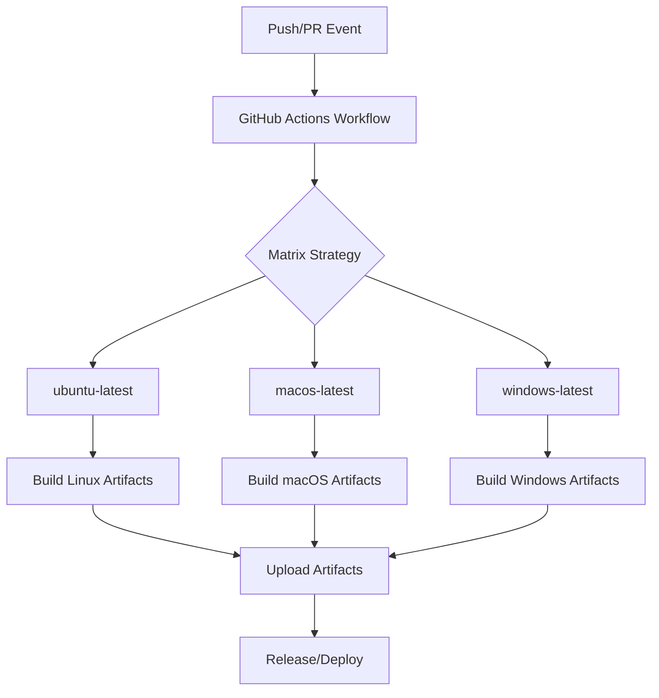
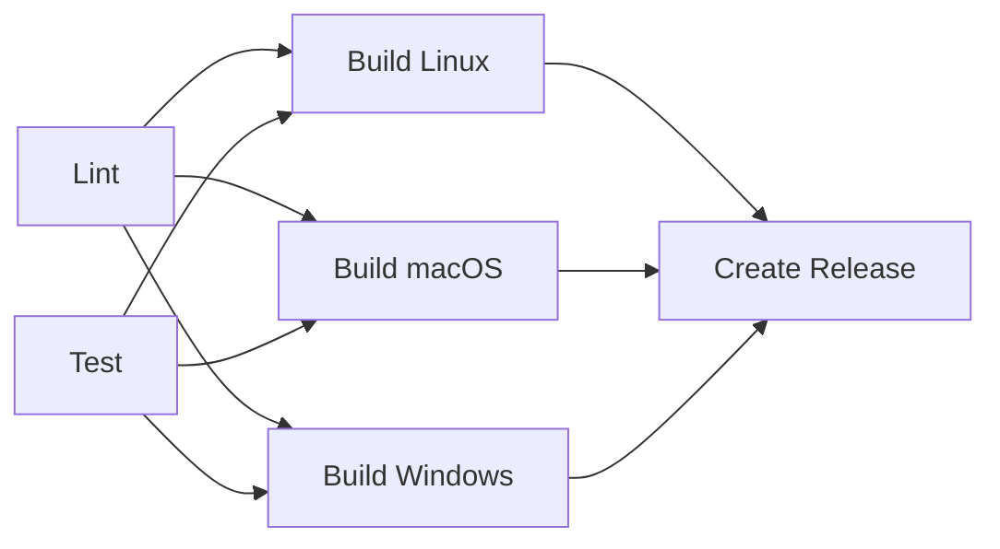
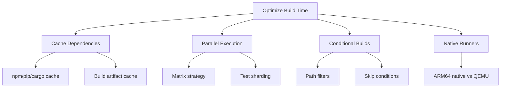

# How to Configure GitHub Actions for Multi-Platform Builds

Author: [nawazdhandala](https://www.github.com/nawazdhandala)

Tags: GitHub Actions, CI/CD, Multi-Platform, Cross-Platform, Build Automation, DevOps

Description: Learn how to set up GitHub Actions workflows for building applications across multiple platforms including Linux, macOS, and Windows. Covers matrix builds, platform-specific configurations, artifact handling, and optimization strategies.

---

Building software that works across different operating systems requires a robust CI/CD pipeline. GitHub Actions provides excellent support for multi-platform builds through matrix strategies, platform-specific runners, and flexible workflow configurations. Whether you're developing a CLI tool, desktop application, or cross-platform library, having automated builds for each target platform catches compatibility issues early and streamlines your release process.

## Multi-Platform Build Architecture

The following diagram illustrates how a typical multi-platform build workflow orchestrates builds across different operating systems.



## Basic Multi-Platform Workflow

A matrix strategy allows you to run the same job across multiple operating systems without duplicating workflow code.

```yaml
# .github/workflows/build.yml
# Defines a workflow that builds on Linux, macOS, and Windows
# The matrix strategy automatically creates parallel jobs for each OS

name: Multi-Platform Build

on:
  push:
    branches: [main]
  pull_request:
    branches: [main]

jobs:
  build:
    # The matrix strategy creates separate jobs for each OS
    strategy:
      matrix:
        os: [ubuntu-latest, macos-latest, windows-latest]

    # Each job runs on its respective platform
    runs-on: ${{ matrix.os }}

    steps:
      - name: Checkout code
        uses: actions/checkout@v4

      - name: Set up Node.js
        uses: actions/setup-node@v4
        with:
          node-version: '20'
          cache: 'npm'

      - name: Install dependencies
        run: npm ci

      - name: Run tests
        run: npm test

      - name: Build application
        run: npm run build
```

## Matrix with Multiple Variables

Complex build requirements often need combinations of operating systems, language versions, and architectures. The matrix strategy handles these combinations elegantly.

```yaml
# .github/workflows/matrix-build.yml
# Creates jobs for every combination of OS, Node version, and architecture
# A 3x2x2 matrix produces 12 parallel build jobs

name: Comprehensive Build Matrix

on:
  push:
    branches: [main]

jobs:
  build:
    strategy:
      # Continue running other matrix jobs even if one fails
      fail-fast: false
      matrix:
        os: [ubuntu-latest, macos-latest, windows-latest]
        node-version: ['18', '20']
        architecture: ['x64', 'arm64']
        # Exclude combinations that don't exist or aren't supported
        exclude:
          # Windows ARM64 runners are not widely available
          - os: windows-latest
            architecture: arm64

    runs-on: ${{ matrix.os }}

    steps:
      - uses: actions/checkout@v4

      - name: Setup Node.js ${{ matrix.node-version }}
        uses: actions/setup-node@v4
        with:
          node-version: ${{ matrix.node-version }}
          architecture: ${{ matrix.architecture }}

      - name: Display build info
        run: |
          echo "OS: ${{ matrix.os }}"
          echo "Node: ${{ matrix.node-version }}"
          echo "Arch: ${{ matrix.architecture }}"

      - name: Install and build
        run: |
          npm ci
          npm run build
```

## Platform-Specific Steps

Some build steps require different commands depending on the operating system. Conditional execution handles these platform differences cleanly.

```yaml
# .github/workflows/platform-specific.yml
# Demonstrates how to run different commands based on the runner OS
# Useful when build tools or shell syntax differs between platforms

name: Platform-Specific Build

on:
  push:
    branches: [main]

jobs:
  build:
    strategy:
      matrix:
        include:
          - os: ubuntu-latest
            artifact_name: myapp-linux
            artifact_ext: ''
          - os: macos-latest
            artifact_name: myapp-macos
            artifact_ext: ''
          - os: windows-latest
            artifact_name: myapp-windows
            artifact_ext: '.exe'

    runs-on: ${{ matrix.os }}

    steps:
      - uses: actions/checkout@v4

      # Install platform-specific dependencies
      - name: Install Linux dependencies
        if: runner.os == 'Linux'
        run: |
          sudo apt-get update
          sudo apt-get install -y libgtk-3-dev libwebkit2gtk-4.0-dev

      - name: Install macOS dependencies
        if: runner.os == 'macOS'
        run: |
          brew install pkg-config

      - name: Install Windows dependencies
        if: runner.os == 'Windows'
        run: |
          choco install visualstudio2022buildtools -y

      - name: Build application
        run: cargo build --release

      # Rename artifact based on platform
      - name: Prepare artifact
        shell: bash
        run: |
          mkdir -p dist
          if [[ "${{ runner.os }}" == "Windows" ]]; then
            cp target/release/myapp.exe dist/${{ matrix.artifact_name }}${{ matrix.artifact_ext }}
          else
            cp target/release/myapp dist/${{ matrix.artifact_name }}${{ matrix.artifact_ext }}
          fi

      - name: Upload artifact
        uses: actions/upload-artifact@v4
        with:
          name: ${{ matrix.artifact_name }}
          path: dist/${{ matrix.artifact_name }}${{ matrix.artifact_ext }}
```

## Build Workflow with Dependencies

When builds depend on shared steps like testing or linting, structuring jobs with dependencies prevents redundant work.



The workflow implementation separates concerns into distinct jobs that run only after prerequisites pass.

```yaml
# .github/workflows/dependent-build.yml
# Separates testing from platform builds
# Build jobs only run after tests pass, saving compute time on failures

name: Build with Dependencies

on:
  push:
    tags:
      - 'v*'

jobs:
  # Run tests once on a single platform before building everywhere
  test:
    runs-on: ubuntu-latest
    steps:
      - uses: actions/checkout@v4
      - uses: actions/setup-node@v4
        with:
          node-version: '20'
      - run: npm ci
      - run: npm test

  # Build for each platform after tests pass
  build:
    needs: test
    strategy:
      matrix:
        include:
          - os: ubuntu-latest
            target: linux-x64
          - os: macos-latest
            target: darwin-x64
          - os: macos-14
            target: darwin-arm64
          - os: windows-latest
            target: win-x64

    runs-on: ${{ matrix.os }}

    steps:
      - uses: actions/checkout@v4

      - uses: actions/setup-node@v4
        with:
          node-version: '20'

      - name: Install dependencies
        run: npm ci

      - name: Build for ${{ matrix.target }}
        run: npm run build -- --target=${{ matrix.target }}

      - name: Upload build artifact
        uses: actions/upload-artifact@v4
        with:
          name: build-${{ matrix.target }}
          path: dist/
          retention-days: 5

  # Create release only after all builds complete
  release:
    needs: build
    runs-on: ubuntu-latest
    permissions:
      contents: write

    steps:
      - name: Download all artifacts
        uses: actions/download-artifact@v4
        with:
          path: artifacts/

      - name: Create Release
        uses: softprops/action-gh-release@v1
        with:
          files: artifacts/**/*
```

## Cross-Compilation Setup

Cross-compilation builds binaries for different architectures without needing native runners for each target. Rust and Go excel at cross-compilation.

```yaml
# .github/workflows/cross-compile.yml
# Uses cross-compilation to build for multiple targets from a single runner
# Faster and cheaper than running on native ARM64 hardware

name: Cross-Compile Rust

on:
  push:
    branches: [main]

jobs:
  build:
    runs-on: ubuntu-latest

    strategy:
      matrix:
        target:
          - x86_64-unknown-linux-gnu
          - x86_64-unknown-linux-musl
          - aarch64-unknown-linux-gnu
          - x86_64-apple-darwin
          - aarch64-apple-darwin
          - x86_64-pc-windows-gnu

    steps:
      - uses: actions/checkout@v4

      - name: Install Rust toolchain
        uses: dtolnay/rust-action@stable
        with:
          targets: ${{ matrix.target }}

      # Install cross-compilation tools for non-native targets
      - name: Install cross-compilation dependencies
        run: |
          sudo apt-get update
          sudo apt-get install -y \
            gcc-aarch64-linux-gnu \
            gcc-mingw-w64-x86-64 \
            musl-tools

      # Configure linkers for each target architecture
      - name: Configure cargo for cross-compilation
        run: |
          mkdir -p .cargo
          cat >> .cargo/config.toml << 'EOF'
          [target.aarch64-unknown-linux-gnu]
          linker = "aarch64-linux-gnu-gcc"

          [target.x86_64-pc-windows-gnu]
          linker = "x86_64-w64-mingw32-gcc"
          EOF

      - name: Build for ${{ matrix.target }}
        run: cargo build --release --target ${{ matrix.target }}

      - name: Upload artifact
        uses: actions/upload-artifact@v4
        with:
          name: binary-${{ matrix.target }}
          path: target/${{ matrix.target }}/release/myapp*
```

## Go Multi-Platform Build

Go's built-in cross-compilation makes multi-platform builds straightforward by setting GOOS and GOARCH environment variables.

```yaml
# .github/workflows/go-multiplatform.yml
# Go natively supports cross-compilation via GOOS and GOARCH
# No additional toolchains or dependencies required

name: Go Multi-Platform Build

on:
  push:
    branches: [main]
    tags: ['v*']

jobs:
  build:
    runs-on: ubuntu-latest

    strategy:
      matrix:
        include:
          - goos: linux
            goarch: amd64
            suffix: ''
          - goos: linux
            goarch: arm64
            suffix: ''
          - goos: darwin
            goarch: amd64
            suffix: ''
          - goos: darwin
            goarch: arm64
            suffix: ''
          - goos: windows
            goarch: amd64
            suffix: '.exe'

    steps:
      - uses: actions/checkout@v4

      - name: Set up Go
        uses: actions/setup-go@v5
        with:
          go-version: '1.22'

      # CGO_ENABLED=0 creates static binaries without C dependencies
      - name: Build binary
        env:
          GOOS: ${{ matrix.goos }}
          GOARCH: ${{ matrix.goarch }}
          CGO_ENABLED: 0
        run: |
          go build -ldflags="-s -w" -o myapp-${{ matrix.goos }}-${{ matrix.goarch }}${{ matrix.suffix }} ./cmd/myapp

      - name: Upload artifact
        uses: actions/upload-artifact@v4
        with:
          name: myapp-${{ matrix.goos }}-${{ matrix.goarch }}
          path: myapp-${{ matrix.goos }}-${{ matrix.goarch }}${{ matrix.suffix }}
```

## Caching for Faster Builds

Each platform may need separate caches. Proper cache configuration dramatically speeds up dependency installation.

```yaml
# .github/workflows/cached-build.yml
# Platform-specific caching reduces build times significantly
# Cache keys include OS to prevent cross-platform cache conflicts

name: Cached Multi-Platform Build

on:
  push:
    branches: [main]

jobs:
  build:
    strategy:
      matrix:
        os: [ubuntu-latest, macos-latest, windows-latest]

    runs-on: ${{ matrix.os }}

    steps:
      - uses: actions/checkout@v4

      - name: Setup Node.js with cache
        uses: actions/setup-node@v4
        with:
          node-version: '20'
          # Automatically caches npm dependencies per OS
          cache: 'npm'

      # Additional caching for build outputs
      - name: Cache build outputs
        uses: actions/cache@v4
        with:
          path: |
            dist/
            .next/cache/
          # Cache key includes OS and dependency hash
          key: ${{ runner.os }}-build-${{ hashFiles('**/package-lock.json') }}
          restore-keys: |
            ${{ runner.os }}-build-

      - name: Install dependencies
        run: npm ci

      - name: Build
        run: npm run build
```

## Parallel Testing Across Platforms

Running tests in parallel across platforms catches OS-specific bugs early. The matrix strategy combined with test sharding maximizes parallelism.

```yaml
# .github/workflows/parallel-tests.yml
# Runs test shards in parallel across all platform combinations
# Reduces total test time by distributing work

name: Parallel Cross-Platform Tests

on:
  pull_request:
    branches: [main]

jobs:
  test:
    strategy:
      fail-fast: false
      matrix:
        os: [ubuntu-latest, macos-latest, windows-latest]
        # Shard tests into 3 parts for parallel execution
        shard: [1, 2, 3]

    runs-on: ${{ matrix.os }}

    steps:
      - uses: actions/checkout@v4

      - uses: actions/setup-node@v4
        with:
          node-version: '20'
          cache: 'npm'

      - run: npm ci

      # Run only one shard of tests per job
      - name: Run tests (shard ${{ matrix.shard }}/3)
        run: npm test -- --shard=${{ matrix.shard }}/3

      - name: Upload coverage
        uses: actions/upload-artifact@v4
        with:
          name: coverage-${{ matrix.os }}-${{ matrix.shard }}
          path: coverage/
```

## Native ARM64 Builds

For performance-critical ARM64 builds, GitHub provides native ARM64 runners that avoid emulation overhead.

```yaml
# .github/workflows/native-arm.yml
# Native ARM64 runners build faster than QEMU emulation
# macos-14 runs on Apple Silicon (M1/M2)

name: Native ARM64 Builds

on:
  push:
    branches: [main]

jobs:
  build:
    strategy:
      matrix:
        include:
          # x64 builds
          - os: ubuntu-latest
            arch: x64
            name: linux-x64
          - os: macos-13
            arch: x64
            name: macos-x64
          - os: windows-latest
            arch: x64
            name: windows-x64
          # ARM64 builds on native runners
          - os: ubuntu-24.04-arm
            arch: arm64
            name: linux-arm64
          - os: macos-14
            arch: arm64
            name: macos-arm64

    runs-on: ${{ matrix.os }}

    steps:
      - uses: actions/checkout@v4

      - name: Verify architecture
        shell: bash
        run: |
          echo "Running on: ${{ matrix.os }}"
          uname -m

      - uses: actions/setup-node@v4
        with:
          node-version: '20'

      - run: npm ci
      - run: npm run build

      - uses: actions/upload-artifact@v4
        with:
          name: ${{ matrix.name }}
          path: dist/
```

## Electron Multi-Platform Build

Desktop applications built with Electron require special handling for code signing and platform-specific packaging.

```yaml
# .github/workflows/electron-build.yml
# Electron apps need platform-specific packaging and signing
# Each OS produces different installer formats (dmg, exe, deb)

name: Electron Multi-Platform Build

on:
  push:
    tags: ['v*']

jobs:
  build:
    strategy:
      matrix:
        include:
          - os: ubuntu-latest
            platform: linux
          - os: macos-latest
            platform: mac
          - os: windows-latest
            platform: win

    runs-on: ${{ matrix.os }}

    steps:
      - uses: actions/checkout@v4

      - uses: actions/setup-node@v4
        with:
          node-version: '20'
          cache: 'npm'

      - run: npm ci

      # macOS requires certificates for code signing
      - name: Import macOS certificates
        if: matrix.platform == 'mac'
        env:
          MACOS_CERTIFICATE: ${{ secrets.MACOS_CERTIFICATE }}
          MACOS_CERTIFICATE_PWD: ${{ secrets.MACOS_CERTIFICATE_PWD }}
          KEYCHAIN_PASSWORD: ${{ secrets.KEYCHAIN_PASSWORD }}
        run: |
          echo $MACOS_CERTIFICATE | base64 --decode > certificate.p12
          security create-keychain -p "$KEYCHAIN_PASSWORD" build.keychain
          security default-keychain -s build.keychain
          security unlock-keychain -p "$KEYCHAIN_PASSWORD" build.keychain
          security import certificate.p12 -k build.keychain -P "$MACOS_CERTIFICATE_PWD" -T /usr/bin/codesign
          security set-key-partition-list -S apple-tool:,apple:,codesign: -s -k "$KEYCHAIN_PASSWORD" build.keychain

      # Windows signing requires different setup
      - name: Setup Windows signing
        if: matrix.platform == 'win'
        run: |
          echo "${{ secrets.WINDOWS_CERTIFICATE }}" | base64 -d > certificate.pfx

      # Build platform-specific packages
      - name: Build Electron app
        env:
          GH_TOKEN: ${{ secrets.GITHUB_TOKEN }}
          CSC_LINK: ${{ matrix.platform == 'win' && 'certificate.pfx' || '' }}
          CSC_KEY_PASSWORD: ${{ secrets.WINDOWS_CERTIFICATE_PWD }}
        run: npm run electron:build -- --${{ matrix.platform }}

      - uses: actions/upload-artifact@v4
        with:
          name: electron-${{ matrix.platform }}
          path: |
            dist/*.dmg
            dist/*.exe
            dist/*.deb
            dist/*.AppImage
```

## Build Status Matrix

Aggregating build results into a status check helps maintain visibility across all platform builds.

```yaml
# .github/workflows/status-check.yml
# Creates a single status check that passes only if all platforms succeed
# Useful for branch protection rules

name: Build Status

on:
  push:
    branches: [main]
  pull_request:
    branches: [main]

jobs:
  build:
    strategy:
      fail-fast: false
      matrix:
        os: [ubuntu-latest, macos-latest, windows-latest]

    runs-on: ${{ matrix.os }}

    steps:
      - uses: actions/checkout@v4
      - uses: actions/setup-node@v4
        with:
          node-version: '20'
      - run: npm ci
      - run: npm test
      - run: npm run build

  # Single check that depends on all matrix jobs
  all-builds-passed:
    needs: build
    runs-on: ubuntu-latest
    # Run even if some builds failed to report status
    if: always()
    steps:
      - name: Check build results
        run: |
          if [[ "${{ needs.build.result }}" != "success" ]]; then
            echo "One or more platform builds failed"
            exit 1
          fi
          echo "All platform builds passed"
```

## Troubleshooting Common Issues

Multi-platform builds introduce unique challenges. Here are solutions to frequent problems.

### Path Separator Differences

Windows uses backslashes while Unix systems use forward slashes. Using bash shell and forward slashes generally works across platforms.

```yaml
# Force bash shell for consistent path handling
- name: Build step
  shell: bash
  run: |
    # Forward slashes work on Windows in bash
    cp src/config.json dist/config.json
```

### Line Ending Issues

Git's autocrlf setting can cause problems when files have strict line ending requirements.

```yaml
# Configure git before checkout
- name: Configure git
  run: git config --global core.autocrlf false

- uses: actions/checkout@v4
```

### Environment Variables

Environment variable syntax differs between shells. Bash syntax works best for cross-platform compatibility.

```yaml
# Use bash for consistent environment variable handling
- name: Set variables
  shell: bash
  run: |
    echo "BUILD_VERSION=1.0.0" >> $GITHUB_ENV

- name: Use variables
  shell: bash
  run: echo "Building version $BUILD_VERSION"
```

## Performance Optimization Tips

Build times directly impact developer productivity. Several strategies help reduce wait times for multi-platform builds.



Implement path filters to skip unnecessary builds when only documentation changes.

```yaml
# Only run builds when source code changes
on:
  push:
    branches: [main]
    paths:
      - 'src/**'
      - 'package.json'
      - 'package-lock.json'
      - '.github/workflows/build.yml'
    paths-ignore:
      - '**.md'
      - 'docs/**'
```

---

Multi-platform builds in GitHub Actions enable consistent software delivery across operating systems and architectures. Matrix strategies eliminate repetitive workflow code while parallel execution keeps build times manageable. Combining native runners for performance-critical builds with cross-compilation for broader coverage provides flexibility to match your project's needs. Proper caching and conditional execution further optimize your CI/CD pipeline, ensuring developers get fast feedback regardless of target platform.
