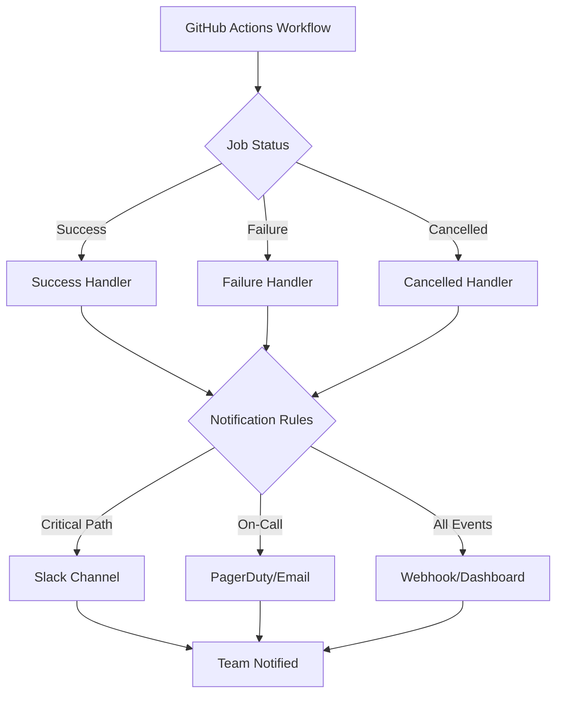
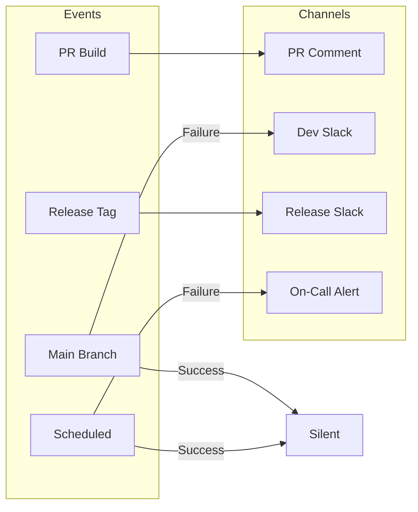

# How to Configure GitHub Actions Notifications

Author: [nawazdhandala](https://www.github.com/nawazdhandala)

Tags: GitHub Actions, CI/CD, Notifications, Slack, DevOps, Automation, Webhooks

Description: A practical guide to configuring GitHub Actions notifications across multiple channels including Slack, email, Microsoft Teams, and custom webhooks. Learn how to set up targeted alerts, filter noise, and build effective CI/CD communication workflows.

---

Your CI pipeline just failed at 2 AM. Nobody noticed until customers started complaining. Sound familiar? Configuring proper notifications in GitHub Actions can prevent these silent failures and keep your team informed without drowning them in noise.

## Notification Flow Overview

Before diving into configuration, here's how notification routing typically works in a GitHub Actions pipeline:



## 1. Built-in GitHub Email Notifications

GitHub sends email notifications by default, but most teams find them too noisy. You can fine-tune these settings at the repository level.

Navigate to your repository settings and configure notification preferences under the "Notifications" section:

```yaml
# .github/settings.yml (using probot/settings app)
repository:
  # Enable/disable specific notification types
  has_issues: true
  has_wiki: false

# Configure branch protection notification settings
branches:
  - name: main
    protection:
      required_status_checks:
        strict: true
        contexts:
          - ci/build
          - ci/test
```

For personal notification preferences, update your GitHub notification settings to receive alerts only for:
- Failed workflow runs you triggered
- Reviews requested on your PRs
- Mentions in workflow run comments

## 2. Slack Integration with slack-github-action

Slack remains the most popular notification channel for development teams. The official GitHub action provides rich message formatting and threading support.

First, create a Slack app and obtain a webhook URL from your Slack workspace settings. Store the URL as a repository secret named `SLACK_WEBHOOK_URL`.

The following workflow sends a notification to Slack whenever the main branch build completes:

```yaml
name: Build and Notify

on:
  push:
    branches: [main]

jobs:
  build:
    runs-on: ubuntu-latest
    steps:
      # Checkout repository code
      - uses: actions/checkout@v4

      # Run your build process
      - name: Build application
        run: npm ci && npm run build

      # Send Slack notification on success
      - name: Notify Slack on Success
        if: success()
        uses: slackapi/slack-github-action@v1.26.0
        with:
          # Channel ID where messages will be posted
          channel-id: 'C0XXXXXXXXX'
          # Formatted message with workflow context
          slack-message: |
            :white_check_mark: *Build Succeeded*
            Repository: ${{ github.repository }}
            Branch: ${{ github.ref_name }}
            Commit: ${{ github.sha }}
            Author: ${{ github.actor }}
            <${{ github.server_url }}/${{ github.repository }}/actions/runs/${{ github.run_id }}|View Run>
        env:
          # Bot token for posting messages
          SLACK_BOT_TOKEN: ${{ secrets.SLACK_BOT_TOKEN }}
```

## 3. Failure-Only Notifications

Nobody wants success spam flooding their channels. Configure notifications to trigger only when something breaks.

The following job demonstrates conditional notification based on workflow outcome:

```yaml
jobs:
  test:
    runs-on: ubuntu-latest
    steps:
      - uses: actions/checkout@v4
      - name: Run tests
        run: npm test

  notify-failure:
    needs: test
    # Only run when the test job fails
    if: failure()
    runs-on: ubuntu-latest
    steps:
      - name: Send failure alert
        uses: slackapi/slack-github-action@v1.26.0
        with:
          channel-id: 'C0XXXXXXXXX'
          # Payload for rich Slack message formatting
          payload: |
            {
              "blocks": [
                {
                  "type": "header",
                  "text": {
                    "type": "plain_text",
                    "text": "CI Build Failed",
                    "emoji": true
                  }
                },
                {
                  "type": "section",
                  "fields": [
                    {
                      "type": "mrkdwn",
                      "text": "*Repository:*\n${{ github.repository }}"
                    },
                    {
                      "type": "mrkdwn",
                      "text": "*Branch:*\n${{ github.ref_name }}"
                    },
                    {
                      "type": "mrkdwn",
                      "text": "*Triggered by:*\n${{ github.actor }}"
                    },
                    {
                      "type": "mrkdwn",
                      "text": "*Commit:*\n`${{ github.sha }}`"
                    }
                  ]
                },
                {
                  "type": "actions",
                  "elements": [
                    {
                      "type": "button",
                      "text": {
                        "type": "plain_text",
                        "text": "View Workflow Run"
                      },
                      "url": "${{ github.server_url }}/${{ github.repository }}/actions/runs/${{ github.run_id }}"
                    }
                  ]
                }
              ]
            }
        env:
          SLACK_BOT_TOKEN: ${{ secrets.SLACK_BOT_TOKEN }}
```

## 4. Microsoft Teams Integration

For organizations using Microsoft Teams, the workflow-webhook approach works well with Teams incoming webhooks.

Create an incoming webhook in your Teams channel and store the URL as a secret:

```yaml
jobs:
  notify-teams:
    runs-on: ubuntu-latest
    steps:
      # Send adaptive card to Microsoft Teams
      - name: Send Teams Notification
        run: |
          # Construct the adaptive card payload
          curl -H "Content-Type: application/json" \
            -d '{
              "@type": "MessageCard",
              "@context": "http://schema.org/extensions",
              "themeColor": "${{ job.status == 'success' && '00FF00' || 'FF0000' }}",
              "summary": "GitHub Actions Notification",
              "sections": [{
                "activityTitle": "Workflow: ${{ github.workflow }}",
                "facts": [
                  {"name": "Repository", "value": "${{ github.repository }}"},
                  {"name": "Branch", "value": "${{ github.ref_name }}"},
                  {"name": "Status", "value": "${{ job.status }}"},
                  {"name": "Actor", "value": "${{ github.actor }}"}
                ],
                "markdown": true
              }],
              "potentialAction": [{
                "@type": "OpenUri",
                "name": "View Run",
                "targets": [{"os": "default", "uri": "${{ github.server_url }}/${{ github.repository }}/actions/runs/${{ github.run_id }}"}]
              }]
            }' \
            ${{ secrets.TEAMS_WEBHOOK_URL }}
```

## 5. Custom Webhook Notifications

For integrating with custom dashboards, incident management tools, or monitoring platforms like OneUptime, generic webhooks provide maximum flexibility.

The following example sends structured JSON to any HTTP endpoint:

```yaml
jobs:
  build:
    runs-on: ubuntu-latest
    # Make status available to subsequent steps
    outputs:
      status: ${{ job.status }}
    steps:
      - uses: actions/checkout@v4
      - name: Build
        run: npm run build

  webhook-notify:
    needs: build
    # Run regardless of build outcome
    if: always()
    runs-on: ubuntu-latest
    steps:
      - name: Send webhook notification
        run: |
          # Build JSON payload with all relevant metadata
          PAYLOAD=$(cat <<EOF
          {
            "event": "workflow_completed",
            "repository": "${{ github.repository }}",
            "workflow": "${{ github.workflow }}",
            "run_id": "${{ github.run_id }}",
            "run_number": "${{ github.run_number }}",
            "status": "${{ needs.build.outputs.status }}",
            "branch": "${{ github.ref_name }}",
            "commit_sha": "${{ github.sha }}",
            "actor": "${{ github.actor }}",
            "timestamp": "$(date -u +%Y-%m-%dT%H:%M:%SZ)",
            "url": "${{ github.server_url }}/${{ github.repository }}/actions/runs/${{ github.run_id }}"
          }
          EOF
          )

          # POST to your monitoring endpoint
          curl -X POST \
            -H "Content-Type: application/json" \
            -H "Authorization: Bearer ${{ secrets.WEBHOOK_TOKEN }}" \
            -d "$PAYLOAD" \
            "${{ secrets.WEBHOOK_URL }}"
```

## 6. Email Notifications with SendGrid

For teams requiring email notifications, integrate with SendGrid or similar email APIs:

```yaml
jobs:
  email-notify:
    runs-on: ubuntu-latest
    steps:
      # Send email via SendGrid API
      - name: Send email notification
        env:
          SENDGRID_API_KEY: ${{ secrets.SENDGRID_API_KEY }}
        run: |
          # Construct email payload with workflow details
          curl -X POST https://api.sendgrid.com/v3/mail/send \
            -H "Authorization: Bearer $SENDGRID_API_KEY" \
            -H "Content-Type: application/json" \
            -d '{
              "personalizations": [{
                "to": [{"email": "devops@yourcompany.com"}],
                "subject": "[${{ job.status }}] ${{ github.repository }} - ${{ github.workflow }}"
              }],
              "from": {"email": "ci@yourcompany.com", "name": "GitHub Actions"},
              "content": [{
                "type": "text/html",
                "value": "<h2>Workflow ${{ job.status }}</h2><p>Repository: ${{ github.repository }}</p><p>Branch: ${{ github.ref_name }}</p><p>Commit: ${{ github.sha }}</p><p><a href=\"${{ github.server_url }}/${{ github.repository }}/actions/runs/${{ github.run_id }}\">View Run</a></p>"
              }]
            }'
```

## 7. Notification Routing Matrix

Different events deserve different notification channels. Here's a pattern for routing notifications based on context:



Implement channel routing using job conditions and matrix strategies:

```yaml
name: Smart Notifications

on:
  push:
    branches: [main]
    tags: ['v*']
  pull_request:
  schedule:
    - cron: '0 6 * * *'

jobs:
  build:
    runs-on: ubuntu-latest
    steps:
      - uses: actions/checkout@v4
      - run: npm test

  notify:
    needs: build
    if: always()
    runs-on: ubuntu-latest
    steps:
      # Notify on PR - add comment to the PR itself
      - name: Comment on PR
        if: github.event_name == 'pull_request'
        uses: actions/github-script@v7
        with:
          script: |
            const status = '${{ needs.build.result }}';
            const emoji = status === 'success' ? ':white_check_mark:' : ':x:';
            github.rest.issues.createComment({
              issue_number: context.issue.number,
              owner: context.repo.owner,
              repo: context.repo.repo,
              body: `${emoji} Build ${status}\n\n[View workflow run](${{ github.server_url }}/${{ github.repository }}/actions/runs/${{ github.run_id }})`
            });

      # Notify on main branch failure - alert dev channel
      - name: Alert dev channel
        if: github.ref == 'refs/heads/main' && needs.build.result == 'failure'
        uses: slackapi/slack-github-action@v1.26.0
        with:
          channel-id: 'dev-alerts'
          slack-message: ':rotating_light: Main branch build failed! ${{ github.server_url }}/${{ github.repository }}/actions/runs/${{ github.run_id }}'
        env:
          SLACK_BOT_TOKEN: ${{ secrets.SLACK_BOT_TOKEN }}

      # Notify on release - announce to release channel
      - name: Announce release
        if: startsWith(github.ref, 'refs/tags/v') && needs.build.result == 'success'
        uses: slackapi/slack-github-action@v1.26.0
        with:
          channel-id: 'releases'
          slack-message: ':rocket: Released ${{ github.ref_name }}!'
        env:
          SLACK_BOT_TOKEN: ${{ secrets.SLACK_BOT_TOKEN }}

      # Notify on scheduled failure - page on-call
      - name: Page on-call
        if: github.event_name == 'schedule' && needs.build.result == 'failure'
        run: |
          # Trigger PagerDuty incident via Events API
          curl -X POST https://events.pagerduty.com/v2/enqueue \
            -H "Content-Type: application/json" \
            -d '{
              "routing_key": "${{ secrets.PAGERDUTY_ROUTING_KEY }}",
              "event_action": "trigger",
              "payload": {
                "summary": "Scheduled build failed: ${{ github.repository }}",
                "severity": "error",
                "source": "github-actions"
              }
            }'
```

## 8. Reducing Notification Noise

Alert fatigue kills productivity. Apply these strategies to keep notifications meaningful:

**Debounce rapid failures** by checking if a notification was recently sent:

```yaml
jobs:
  check-recent-alert:
    runs-on: ubuntu-latest
    outputs:
      should-notify: ${{ steps.check.outputs.notify }}
    steps:
      # Check cache to see if we alerted recently
      - name: Check recent notifications
        id: check
        uses: actions/cache@v4
        with:
          path: .alert-sent
          # Key based on repo and hour - prevents spam within same hour
          key: alert-${{ github.repository }}-${{ github.run_id }}
          restore-keys: |
            alert-${{ github.repository }}-

      - name: Determine if should notify
        id: decide
        run: |
          if [ -f .alert-sent ]; then
            # Check if file is less than 30 minutes old
            if [ $(($(date +%s) - $(stat -c %Y .alert-sent 2>/dev/null || echo 0))) -lt 1800 ]; then
              echo "notify=false" >> $GITHUB_OUTPUT
              exit 0
            fi
          fi
          echo "notify=true" >> $GITHUB_OUTPUT
          touch .alert-sent
```

**Aggregate multiple failures** into a single digest:

```yaml
jobs:
  aggregate-notify:
    runs-on: ubuntu-latest
    steps:
      # Collect all failed jobs and send single notification
      - name: Build failure summary
        run: |
          FAILURES="${{ needs.job1.result == 'failure' && 'job1 ' || '' }}${{ needs.job2.result == 'failure' && 'job2 ' || '' }}${{ needs.job3.result == 'failure' && 'job3' || '' }}"

          if [ -n "$FAILURES" ]; then
            echo "FAILED_JOBS=$FAILURES" >> $GITHUB_ENV
          fi

      - name: Send aggregated alert
        if: env.FAILED_JOBS != ''
        uses: slackapi/slack-github-action@v1.26.0
        with:
          channel-id: 'alerts'
          slack-message: |
            :warning: Multiple job failures detected:
            ${{ env.FAILED_JOBS }}
            ${{ github.server_url }}/${{ github.repository }}/actions/runs/${{ github.run_id }}
        env:
          SLACK_BOT_TOKEN: ${{ secrets.SLACK_BOT_TOKEN }}
```

## 9. Reusable Notification Workflows

Create a reusable workflow that standardizes notifications across all your repositories:

```yaml
# .github/workflows/notify.yml (in a central repo)
name: Reusable Notification

on:
  workflow_call:
    inputs:
      status:
        required: true
        type: string
      environment:
        required: false
        type: string
        default: 'development'
    secrets:
      SLACK_BOT_TOKEN:
        required: true

jobs:
  notify:
    runs-on: ubuntu-latest
    steps:
      # Determine channel based on environment input
      - name: Set notification channel
        id: channel
        run: |
          case "${{ inputs.environment }}" in
            production) echo "channel=prod-alerts" >> $GITHUB_OUTPUT ;;
            staging)    echo "channel=staging-alerts" >> $GITHUB_OUTPUT ;;
            *)          echo "channel=dev-alerts" >> $GITHUB_OUTPUT ;;
          esac

      - name: Send notification
        uses: slackapi/slack-github-action@v1.26.0
        with:
          channel-id: ${{ steps.channel.outputs.channel }}
          slack-message: '[${{ inputs.environment }}] Build ${{ inputs.status }}: ${{ github.repository }}'
        env:
          SLACK_BOT_TOKEN: ${{ secrets.SLACK_BOT_TOKEN }}
```

Call the reusable workflow from any repository:

```yaml
# In your application repository
jobs:
  build:
    runs-on: ubuntu-latest
    steps:
      - run: npm test

  notify:
    needs: build
    if: always()
    uses: your-org/workflows/.github/workflows/notify.yml@main
    with:
      status: ${{ needs.build.result }}
      environment: production
    secrets:
      SLACK_BOT_TOKEN: ${{ secrets.SLACK_BOT_TOKEN }}
```

## 10. Monitoring Notification Health

Notifications that fail silently defeat the purpose. Add observability to your notification pipeline:

```yaml
jobs:
  notify-with-monitoring:
    runs-on: ubuntu-latest
    steps:
      - name: Send notification
        id: notify
        continue-on-error: true
        uses: slackapi/slack-github-action@v1.26.0
        with:
          channel-id: 'alerts'
          slack-message: 'Build completed'
        env:
          SLACK_BOT_TOKEN: ${{ secrets.SLACK_BOT_TOKEN }}

      # Report notification status to monitoring system
      - name: Report notification status
        if: always()
        run: |
          # Send metric to your monitoring platform
          curl -X POST "${{ secrets.METRICS_ENDPOINT }}" \
            -H "Content-Type: application/json" \
            -d '{
              "metric": "github_actions_notification",
              "status": "${{ steps.notify.outcome }}",
              "repository": "${{ github.repository }}",
              "timestamp": "'$(date -u +%Y-%m-%dT%H:%M:%SZ)'"
            }'
```

---

Effective notifications strike a balance between keeping your team informed and avoiding alert fatigue. Start with failure-only notifications on critical paths, then expand coverage based on your team's needs. Remember: the best notification is one that reaches the right person at the right time with actionable information.
