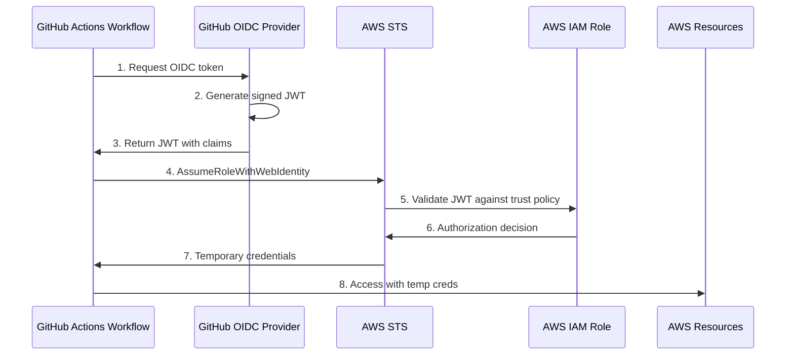
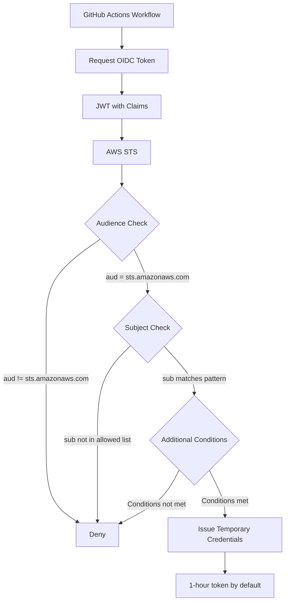

# How to Implement GitHub Actions OIDC for AWS Authentication

Author: [nawazdhandala](https://www.github.com/nawazdhandala)

Tags: GitHub Actions, OIDC, AWS, Security, CI/CD, IAM, DevOps, Authentication

Description: A complete guide to implementing GitHub Actions OIDC authentication with AWS, covering identity provider setup, IAM role configuration, trust policies, workflow integration, and security best practices.

---

Long-lived AWS access keys stored in GitHub Secrets present a significant security risk. If compromised, attackers can access your AWS resources until you manually revoke the credentials. OpenID Connect (OIDC) eliminates the need for storing AWS credentials entirely by allowing GitHub Actions to request short-lived tokens directly from AWS.

## Understanding OIDC Authentication Flow

Before diving into implementation, understanding how OIDC works between GitHub Actions and AWS helps troubleshoot issues and design secure configurations.



The workflow requests an OIDC token from GitHub, which returns a signed JSON Web Token (JWT) containing claims about the workflow context. GitHub signs the token with their private key. AWS STS validates the signature using GitHub's public keys and checks the claims against your IAM role's trust policy. If everything matches, STS returns temporary credentials valid for a limited time.

## Prerequisites

You need the following before setting up OIDC:

- An AWS account with IAM administrative access
- A GitHub repository where you want to configure OIDC
- AWS CLI or Terraform installed for infrastructure setup
- Basic familiarity with IAM roles and policies

## Step 1: Create the OIDC Identity Provider in AWS

AWS needs to trust GitHub as an identity provider. You create an OIDC provider resource that tells AWS how to verify tokens from GitHub.

### Using AWS CLI

The following command creates the GitHub OIDC identity provider in your AWS account.

```bash
# Create the OIDC identity provider
# The thumbprint is GitHub's certificate thumbprint - AWS uses it to validate tokens
aws iam create-open-id-connect-provider \
  --url https://token.actions.githubusercontent.com \
  --client-id-list sts.amazonaws.com \
  --thumbprint-list 6938fd4d98bab03faadb97b34396831e3780aea1

# Verify the provider was created
aws iam list-open-id-connect-providers
```

### Using Terraform

For infrastructure-as-code, Terraform provides a cleaner approach that integrates with your existing AWS configuration.

```hcl
# terraform/github_oidc.tf

# Fetch GitHub's current OIDC configuration
# The TLS certificate may change, so fetching it dynamically is more robust
data "tls_certificate" "github" {
  url = "https://token.actions.githubusercontent.com/.well-known/openid-configuration"
}

# Create the OIDC provider resource
# Only one provider per AWS account is needed for GitHub Actions
resource "aws_iam_openid_connect_provider" "github" {
  url = "https://token.actions.githubusercontent.com"

  # The audience must match what GitHub Actions sends
  client_id_list = ["sts.amazonaws.com"]

  # Use the dynamically fetched thumbprint
  thumbprint_list = [data.tls_certificate.github.certificates[0].sha1_fingerprint]

  tags = {
    Name        = "GitHub Actions OIDC"
    Description = "OIDC provider for GitHub Actions authentication"
  }
}

# Output the provider ARN for use in IAM roles
output "github_oidc_provider_arn" {
  value       = aws_iam_openid_connect_provider.github.arn
  description = "ARN of the GitHub OIDC provider"
}
```

### Using AWS CloudFormation

CloudFormation offers an alternative for teams not using Terraform.

```yaml
# cloudformation/github-oidc-provider.yaml
AWSTemplateFormatVersion: '2010-09-09'
Description: GitHub Actions OIDC Identity Provider

Resources:
  GitHubOIDCProvider:
    Type: AWS::IAM::OIDCProvider
    Properties:
      Url: https://token.actions.githubusercontent.com
      ClientIdList:
        - sts.amazonaws.com
      ThumbprintList:
        - 6938fd4d98bab03faadb97b34396831e3780aea1
      Tags:
        - Key: Name
          Value: GitHub Actions OIDC

Outputs:
  OIDCProviderArn:
    Description: ARN of the GitHub OIDC Provider
    Value: !GetAtt GitHubOIDCProvider.Arn
    Export:
      Name: GitHubOIDCProviderArn
```

## Step 2: Create an IAM Role with Trust Policy

The IAM role defines what GitHub Actions can do in your AWS account. The trust policy controls which repositories and branches can assume the role.

### Understanding Trust Policy Conditions

GitHub OIDC tokens contain several claims you can use in trust policies:

| Claim | Format | Example |
|-------|--------|---------|
| sub | `repo:OWNER/REPO:REF` | `repo:myorg/myrepo:ref:refs/heads/main` |
| repository | `OWNER/REPO` | `myorg/myrepo` |
| repository_owner | `OWNER` | `myorg` |
| job_workflow_ref | `OWNER/REPO/PATH@REF` | `myorg/myrepo/.github/workflows/deploy.yml@refs/heads/main` |
| environment | `ENVIRONMENT_NAME` | `production` |

### Creating the IAM Role with Terraform

The following Terraform configuration creates an IAM role that only allows specific repositories and branches to assume it.

```hcl
# terraform/github_oidc_role.tf

# Define local variables for the repositories and branches allowed to assume this role
locals {
  # List of allowed subjects - customize these for your repositories
  allowed_subjects = [
    "repo:your-org/your-app:ref:refs/heads/main",
    "repo:your-org/your-app:ref:refs/heads/release/*",
    "repo:your-org/your-app:environment:production"
  ]
}

# IAM role that GitHub Actions will assume
resource "aws_iam_role" "github_actions" {
  name        = "github-actions-deploy"
  description = "Role for GitHub Actions OIDC authentication"

  # Trust policy defines who can assume this role
  assume_role_policy = jsonencode({
    Version = "2012-10-17"
    Statement = [
      {
        Effect = "Allow"
        Principal = {
          Federated = aws_iam_openid_connect_provider.github.arn
        }
        Action = "sts:AssumeRoleWithWebIdentity"
        Condition = {
          # Verify the token audience matches AWS STS
          StringEquals = {
            "token.actions.githubusercontent.com:aud" = "sts.amazonaws.com"
          }
          # Restrict to specific repositories and branches
          StringLike = {
            "token.actions.githubusercontent.com:sub" = local.allowed_subjects
          }
        }
      }
    ]
  })

  # Maximum session duration in seconds (1 hour default, up to 12 hours)
  max_session_duration = 3600

  tags = {
    Name        = "GitHub Actions Deploy Role"
    Environment = "production"
  }
}

# Attach permissions to the role
# Start with least privilege and add only what your workflows need
resource "aws_iam_role_policy" "github_actions_ecr" {
  name = "ecr-push-policy"
  role = aws_iam_role.github_actions.id

  policy = jsonencode({
    Version = "2012-10-17"
    Statement = [
      {
        Effect = "Allow"
        Action = [
          "ecr:GetAuthorizationToken"
        ]
        Resource = "*"
      },
      {
        Effect = "Allow"
        Action = [
          "ecr:BatchCheckLayerAvailability",
          "ecr:GetDownloadUrlForLayer",
          "ecr:BatchGetImage",
          "ecr:InitiateLayerUpload",
          "ecr:UploadLayerPart",
          "ecr:CompleteLayerUpload",
          "ecr:PutImage"
        ]
        Resource = "arn:aws:ecr:us-east-1:123456789012:repository/my-app"
      }
    ]
  })
}

# Output the role ARN for use in GitHub Actions
output "github_actions_role_arn" {
  value       = aws_iam_role.github_actions.arn
  description = "ARN of the IAM role for GitHub Actions"
}
```

### Trust Policy Architecture

The following diagram shows how trust policies filter authentication requests:



## Step 3: Configure the GitHub Actions Workflow

With the AWS infrastructure ready, configure your GitHub Actions workflow to use OIDC authentication.

### Basic Workflow Configuration

The permissions block is required for OIDC to work. Without `id-token: write`, the workflow cannot request tokens from GitHub.

```yaml
# .github/workflows/deploy.yml
name: Deploy to AWS

on:
  push:
    branches: [main]
  workflow_dispatch:

# REQUIRED: These permissions enable OIDC token generation
permissions:
  id-token: write   # Needed to request the OIDC JWT
  contents: read    # Needed to checkout the repository

env:
  AWS_REGION: us-east-1
  ECR_REPOSITORY: my-app

jobs:
  deploy:
    runs-on: ubuntu-latest

    steps:
      # Checkout the repository code
      - name: Checkout
        uses: actions/checkout@v4

      # Configure AWS credentials using OIDC
      # No secrets required - authentication happens via OIDC
      - name: Configure AWS credentials
        uses: aws-actions/configure-aws-credentials@v4
        with:
          role-to-assume: arn:aws:iam::123456789012:role/github-actions-deploy
          aws-region: ${{ env.AWS_REGION }}
          # Optional: customize session name for CloudTrail audit
          role-session-name: GitHubActions-${{ github.run_id }}

      # Verify credentials are working
      - name: Verify AWS credentials
        run: |
          aws sts get-caller-identity
          echo "Successfully authenticated with AWS"

      # Login to Amazon ECR
      - name: Login to Amazon ECR
        id: login-ecr
        uses: aws-actions/amazon-ecr-login@v2

      # Build and push Docker image
      - name: Build and push Docker image
        env:
          ECR_REGISTRY: ${{ steps.login-ecr.outputs.registry }}
          IMAGE_TAG: ${{ github.sha }}
        run: |
          docker build -t $ECR_REGISTRY/$ECR_REPOSITORY:$IMAGE_TAG .
          docker push $ECR_REGISTRY/$ECR_REPOSITORY:$IMAGE_TAG
          echo "Pushed image: $ECR_REGISTRY/$ECR_REPOSITORY:$IMAGE_TAG"
```

### Advanced Workflow with Multiple Environments

For production deployments, use GitHub Environments to add approval gates and environment-specific configurations.

```yaml
# .github/workflows/deploy-multi-env.yml
name: Deploy to Multiple Environments

on:
  push:
    branches: [main]
  pull_request:
    branches: [main]

permissions:
  id-token: write
  contents: read

jobs:
  # Build and test runs on all pushes
  build:
    runs-on: ubuntu-latest
    outputs:
      image-tag: ${{ steps.meta.outputs.tags }}

    steps:
      - name: Checkout
        uses: actions/checkout@v4

      - name: Configure AWS credentials (CI)
        uses: aws-actions/configure-aws-credentials@v4
        with:
          # Use a separate role with limited permissions for CI
          role-to-assume: arn:aws:iam::123456789012:role/github-actions-ci
          aws-region: us-east-1

      - name: Login to ECR
        id: login-ecr
        uses: aws-actions/amazon-ecr-login@v2

      - name: Build and push
        id: meta
        env:
          REGISTRY: ${{ steps.login-ecr.outputs.registry }}
          REPOSITORY: my-app
        run: |
          IMAGE_TAG="${REGISTRY}/${REPOSITORY}:${{ github.sha }}"
          docker build -t $IMAGE_TAG .
          docker push $IMAGE_TAG
          echo "tags=${IMAGE_TAG}" >> $GITHUB_OUTPUT

  # Staging deployment - automatic for main branch
  deploy-staging:
    needs: build
    runs-on: ubuntu-latest
    environment: staging
    if: github.ref == 'refs/heads/main'

    steps:
      - name: Checkout
        uses: actions/checkout@v4

      - name: Configure AWS credentials (Staging)
        uses: aws-actions/configure-aws-credentials@v4
        with:
          role-to-assume: arn:aws:iam::123456789012:role/github-actions-staging
          aws-region: us-east-1
          role-session-name: Staging-Deploy-${{ github.run_id }}

      - name: Deploy to ECS Staging
        run: |
          aws ecs update-service \
            --cluster staging-cluster \
            --service my-app \
            --force-new-deployment

  # Production deployment - requires approval
  deploy-production:
    needs: deploy-staging
    runs-on: ubuntu-latest
    environment: production  # Requires manual approval if configured
    if: github.ref == 'refs/heads/main'

    steps:
      - name: Checkout
        uses: actions/checkout@v4

      - name: Configure AWS credentials (Production)
        uses: aws-actions/configure-aws-credentials@v4
        with:
          # Production role has stricter trust policy
          role-to-assume: arn:aws:iam::123456789012:role/github-actions-production
          aws-region: us-east-1
          role-session-name: Production-Deploy-${{ github.run_id }}
          # Extend session for longer deployments
          role-duration-seconds: 7200

      - name: Deploy to ECS Production
        run: |
          aws ecs update-service \
            --cluster production-cluster \
            --service my-app \
            --force-new-deployment
```

## Step 4: Configure Environment-Specific IAM Roles

Separate IAM roles for each environment provide better security isolation and audit trails.

### Production Role with Environment Restriction

The production role only allows authentication from the production GitHub Environment.

```hcl
# terraform/production_role.tf

resource "aws_iam_role" "github_actions_production" {
  name = "github-actions-production"

  assume_role_policy = jsonencode({
    Version = "2012-10-17"
    Statement = [
      {
        Effect = "Allow"
        Principal = {
          Federated = aws_iam_openid_connect_provider.github.arn
        }
        Action = "sts:AssumeRoleWithWebIdentity"
        Condition = {
          StringEquals = {
            "token.actions.githubusercontent.com:aud" = "sts.amazonaws.com"
            # Restrict to production environment only
            "token.actions.githubusercontent.com:sub" = "repo:your-org/your-app:environment:production"
          }
        }
      }
    ]
  })

  # Longer session for production deployments
  max_session_duration = 7200

  tags = {
    Environment = "production"
    ManagedBy   = "terraform"
  }
}

# Production-specific permissions
resource "aws_iam_role_policy_attachment" "production_ecs" {
  role       = aws_iam_role.github_actions_production.name
  policy_arn = "arn:aws:iam::aws:policy/AmazonECS_FullAccess"
}
```

### CI Role with Branch Restrictions

CI jobs need read access and image push capabilities but should not deploy to production.

```hcl
# terraform/ci_role.tf

resource "aws_iam_role" "github_actions_ci" {
  name = "github-actions-ci"

  assume_role_policy = jsonencode({
    Version = "2012-10-17"
    Statement = [
      {
        Effect = "Allow"
        Principal = {
          Federated = aws_iam_openid_connect_provider.github.arn
        }
        Action = "sts:AssumeRoleWithWebIdentity"
        Condition = {
          StringEquals = {
            "token.actions.githubusercontent.com:aud" = "sts.amazonaws.com"
          }
          StringLike = {
            # Allow any branch in the repository
            "token.actions.githubusercontent.com:sub" = "repo:your-org/your-app:*"
          }
        }
      }
    ]
  })

  tags = {
    Environment = "ci"
    ManagedBy   = "terraform"
  }
}

# Read-only plus ECR push for CI
resource "aws_iam_role_policy" "ci_permissions" {
  name = "ci-permissions"
  role = aws_iam_role.github_actions_ci.id

  policy = jsonencode({
    Version = "2012-10-17"
    Statement = [
      {
        Effect = "Allow"
        Action = [
          "ecr:GetAuthorizationToken",
          "ecr:BatchCheckLayerAvailability",
          "ecr:GetDownloadUrlForLayer",
          "ecr:BatchGetImage",
          "ecr:InitiateLayerUpload",
          "ecr:UploadLayerPart",
          "ecr:CompleteLayerUpload",
          "ecr:PutImage"
        ]
        Resource = "*"
      },
      {
        Effect = "Allow"
        Action = [
          "ecs:DescribeServices",
          "ecs:DescribeTasks",
          "ecs:DescribeTaskDefinition"
        ]
        Resource = "*"
      }
    ]
  })
}
```

## Security Best Practices

Following security best practices prevents unauthorized access and limits the blast radius of potential breaches.

### 1. Apply Least Privilege Permissions

Grant only the permissions your workflows actually need. Start restrictive and add permissions as required.

```hcl
# Bad: Overly permissive
resource "aws_iam_role_policy_attachment" "admin" {
  role       = aws_iam_role.github_actions.name
  policy_arn = "arn:aws:iam::aws:policy/AdministratorAccess"
}

# Good: Specific permissions for specific resources
resource "aws_iam_role_policy" "specific_permissions" {
  name = "deploy-permissions"
  role = aws_iam_role.github_actions.id

  policy = jsonencode({
    Version = "2012-10-17"
    Statement = [
      {
        Effect   = "Allow"
        Action   = ["ecs:UpdateService"]
        Resource = "arn:aws:ecs:us-east-1:123456789012:service/production-cluster/my-app"
      }
    ]
  })
}
```

### 2. Use Restrictive Subject Claims

Always restrict the subject claim to specific branches or environments.

```hcl
# Bad: Any workflow in the org can assume this role
"token.actions.githubusercontent.com:sub" = "repo:your-org/*"

# Better: Restrict to specific repository
"token.actions.githubusercontent.com:sub" = "repo:your-org/your-app:*"

# Best: Restrict to specific branch
"token.actions.githubusercontent.com:sub" = "repo:your-org/your-app:ref:refs/heads/main"

# Even better: Restrict to GitHub Environment with approval gates
"token.actions.githubusercontent.com:sub" = "repo:your-org/your-app:environment:production"
```

### 3. Enable CloudTrail Logging

CloudTrail captures all OIDC authentication attempts, providing audit trails and alerting capabilities.

```hcl
# terraform/cloudtrail.tf

resource "aws_cloudwatch_log_group" "oidc_events" {
  name              = "/aws/cloudtrail/github-oidc"
  retention_in_days = 90
}

# CloudWatch metric filter for failed authentication attempts
resource "aws_cloudwatch_log_metric_filter" "oidc_failures" {
  name           = "github-oidc-auth-failures"
  pattern        = "{ $.eventName = AssumeRoleWithWebIdentity && $.errorCode = * }"
  log_group_name = aws_cloudwatch_log_group.oidc_events.name

  metric_transformation {
    name      = "OIDCAuthFailures"
    namespace = "Security/OIDC"
    value     = "1"
  }
}

# Alarm on authentication failures
resource "aws_cloudwatch_metric_alarm" "oidc_failures_alarm" {
  alarm_name          = "github-oidc-auth-failures"
  comparison_operator = "GreaterThanThreshold"
  evaluation_periods  = 1
  metric_name         = "OIDCAuthFailures"
  namespace           = "Security/OIDC"
  period              = 300
  statistic           = "Sum"
  threshold           = 5
  alarm_description   = "Multiple failed OIDC authentication attempts detected"
  alarm_actions       = [aws_sns_topic.security_alerts.arn]
}
```

### 4. Implement Session Duration Limits

Shorter session durations reduce the window for credential misuse.

```yaml
# Set minimum necessary session duration
- name: Configure AWS credentials
  uses: aws-actions/configure-aws-credentials@v4
  with:
    role-to-assume: arn:aws:iam::123456789012:role/github-actions
    aws-region: us-east-1
    # 15 minutes for quick tasks
    role-duration-seconds: 900
```

## Troubleshooting Common Issues

### Error: "Not authorized to perform sts:AssumeRoleWithWebIdentity"

The most common error indicates a mismatch between the token claims and the trust policy.

Debug the actual token claims by adding a step to your workflow:

```yaml
# Add this step before the configure-aws-credentials step
- name: Debug OIDC token claims
  run: |
    # Request a token and decode it
    TOKEN=$(curl -s -H "Authorization: bearer $ACTIONS_ID_TOKEN_REQUEST_TOKEN" \
      "$ACTIONS_ID_TOKEN_REQUEST_URL&audience=sts.amazonaws.com" | jq -r '.value')

    # Decode and display the payload (middle section of JWT)
    echo "Token claims:"
    echo $TOKEN | cut -d'.' -f2 | base64 -d 2>/dev/null | jq .
```

Common causes and fixes:

| Symptom | Cause | Fix |
|---------|-------|-----|
| `sub` claim mismatch | Trust policy pattern does not match actual branch | Check the exact format of `sub` claim in debug output |
| Missing `id-token` permission | Workflow lacks OIDC permissions | Add `permissions: id-token: write` |
| Wrong audience | Provider configured with wrong client ID | Verify `client_id_list` includes `sts.amazonaws.com` |
| Provider not found | OIDC provider not created | Run `aws iam list-open-id-connect-providers` |

### Error: "Token is expired"

OIDC tokens are valid for about 5 minutes. If your workflow takes too long before authenticating, the token expires.

```yaml
# Wrong: Getting credentials late in the workflow
steps:
  - name: Long running setup
    run: sleep 600

  - name: Configure AWS credentials  # Token may be expired
    uses: aws-actions/configure-aws-credentials@v4

# Correct: Get credentials early
steps:
  - name: Configure AWS credentials  # Get credentials first
    uses: aws-actions/configure-aws-credentials@v4
    with:
      role-to-assume: arn:aws:iam::123456789012:role/github-actions
      aws-region: us-east-1

  - name: Long running setup
    run: sleep 600  # Credentials are now cached
```

### Error: "Access Denied" on Specific AWS Actions

The role has correct trust policy but lacks necessary IAM permissions.

```bash
# Check what permissions the role has
aws iam list-role-policies --role-name github-actions-deploy
aws iam list-attached-role-policies --role-name github-actions-deploy

# Simulate the action to see if it would be allowed
aws iam simulate-principal-policy \
  --policy-source-arn arn:aws:iam::123456789012:role/github-actions-deploy \
  --action-names ecs:UpdateService \
  --resource-arns arn:aws:ecs:us-east-1:123456789012:service/my-cluster/my-service
```

## Migrating from Static Credentials

If you have existing workflows using access keys, migrate gradually to OIDC.

### Step 1: Audit Current Usage

Identify all workflows using static credentials.

```bash
# Find all workflows using AWS secrets
grep -r "AWS_ACCESS_KEY_ID\|AWS_SECRET_ACCESS_KEY" .github/workflows/
```

### Step 2: Create OIDC Infrastructure

Deploy the OIDC provider and IAM roles alongside existing credentials.

### Step 3: Update Workflows One at a Time

Test each workflow on a feature branch before merging.

```yaml
# Before migration
- name: Configure AWS credentials
  uses: aws-actions/configure-aws-credentials@v4
  with:
    aws-access-key-id: ${{ secrets.AWS_ACCESS_KEY_ID }}
    aws-secret-access-key: ${{ secrets.AWS_SECRET_ACCESS_KEY }}
    aws-region: us-east-1

# After migration
- name: Configure AWS credentials
  uses: aws-actions/configure-aws-credentials@v4
  with:
    role-to-assume: arn:aws:iam::123456789012:role/github-actions
    aws-region: us-east-1
```

### Step 4: Remove Old Credentials

After verifying OIDC works, delete the static credentials.

```bash
# Delete GitHub secrets
gh secret delete AWS_ACCESS_KEY_ID
gh secret delete AWS_SECRET_ACCESS_KEY

# Deactivate and delete IAM access keys
aws iam update-access-key --user-name github-actions-user \
  --access-key-id AKIA... --status Inactive

# Wait a week to ensure nothing breaks, then delete
aws iam delete-access-key --user-name github-actions-user \
  --access-key-id AKIA...
```

## Summary

OIDC authentication between GitHub Actions and AWS eliminates the security risks of long-lived credentials while providing better auditability and fine-grained access control. Key takeaways:

| Aspect | Static Credentials | OIDC |
|--------|-------------------|------|
| Secret Storage | Required | None |
| Credential Lifetime | Until revoked | Minutes to hours |
| Rotation | Manual | Automatic per request |
| Audit Trail | Limited | Full CloudTrail integration |
| Granular Control | Same key for all | Role per environment/branch |

Implementing OIDC requires upfront infrastructure setup, but the security benefits and reduced operational overhead make it worthwhile for any production CI/CD pipeline.

---

For comprehensive monitoring of your AWS deployments and CI/CD pipelines, [OneUptime](https://oneuptime.com) provides open-source observability with incident management, status pages, and alerting - helping you track deployments and respond to issues faster.
