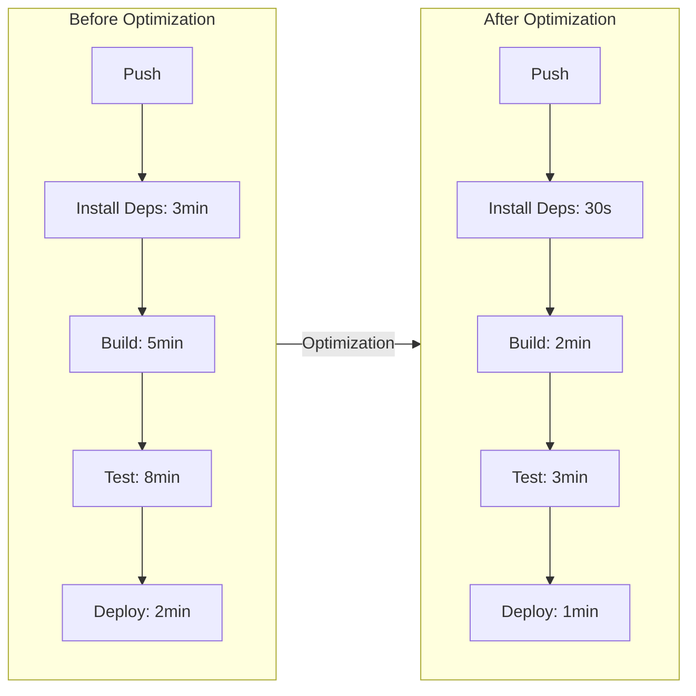
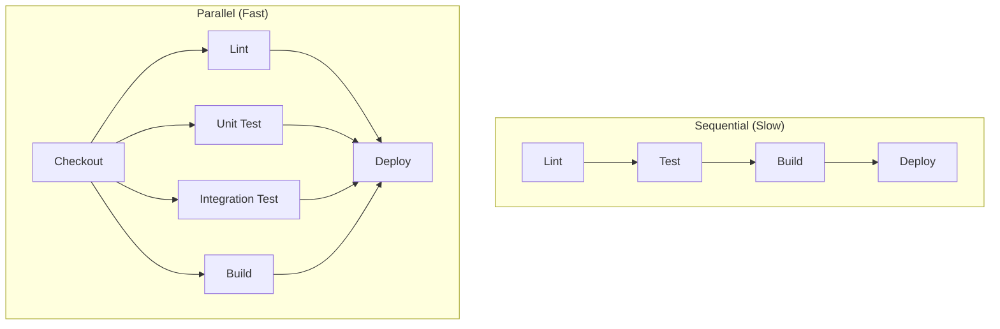
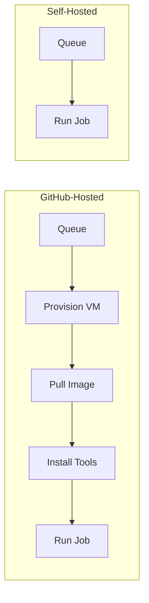
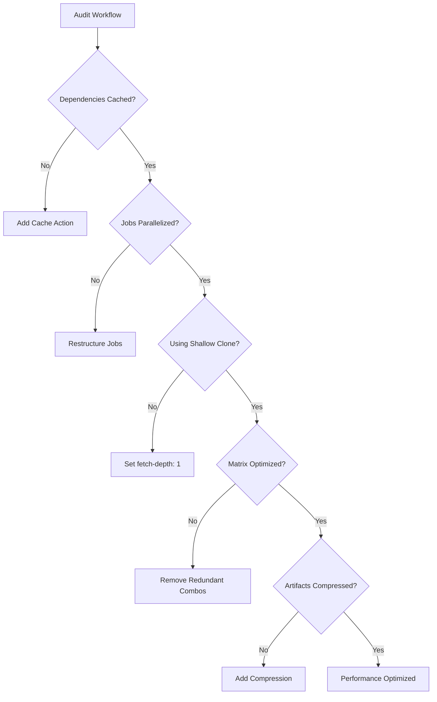

# How to Optimize GitHub Actions Performance

Author: [nawazdhandala](https://www.github.com/nawazdhandala)

Tags: GitHub Actions, CI/CD, DevOps, Performance, Automation, Caching, Optimization

Description: A practical guide to optimizing GitHub Actions workflows for faster builds, reduced costs, and better developer experience. Learn caching strategies, matrix optimization, job parallelization, and advanced techniques to cut your CI/CD time in half.

---

Slow CI pipelines kill developer productivity. Every minute spent waiting for builds is a minute not spent shipping features. GitHub Actions workflows often start fast but gradually slow down as projects grow. The good news: most workflows can be optimized by 50% or more with the right techniques.

## Why GitHub Actions Performance Matters



Every optimization compounds. A 10-developer team running 50 builds per day at 18 minutes each spends 150 hours monthly just waiting. Cut that to 7 minutes and you recover 92 hours of productive time.

## Caching Dependencies

Dependency installation is often the biggest time sink. GitHub Actions provides built-in caching that most teams underutilize.

### Node.js Caching

The following workflow caches npm dependencies using a hash of package-lock.json as the cache key, ensuring the cache invalidates when dependencies change:

```yaml
name: Node.js CI

on: [push, pull_request]

jobs:
  build:
    runs-on: ubuntu-latest

    steps:
      - uses: actions/checkout@v4

      # Cache node_modules based on package-lock.json hash
      # The restore-keys fallback allows partial cache hits
      - name: Cache node modules
        uses: actions/cache@v4
        id: cache-npm
        with:
          path: node_modules
          key: ${{ runner.os }}-node-${{ hashFiles('**/package-lock.json') }}
          restore-keys: |
            ${{ runner.os }}-node-

      # Only install dependencies if cache miss occurred
      # The if condition checks the cache-hit output from previous step
      - name: Install dependencies
        if: steps.cache-npm.outputs.cache-hit != 'true'
        run: npm ci

      - name: Build
        run: npm run build
```

### Python Caching with pip

Python projects benefit from caching both pip packages and the virtual environment:

```yaml
jobs:
  test:
    runs-on: ubuntu-latest

    steps:
      - uses: actions/checkout@v4

      - name: Set up Python
        uses: actions/setup-python@v5
        with:
          python-version: '3.11'

      # Cache pip packages in the user's pip cache directory
      # Combined with virtualenv caching for maximum speed
      - name: Cache pip
        uses: actions/cache@v4
        with:
          path: |
            ~/.cache/pip
            .venv
          key: ${{ runner.os }}-pip-${{ hashFiles('**/requirements*.txt') }}
          restore-keys: |
            ${{ runner.os }}-pip-

      # Create virtualenv only if not restored from cache
      - name: Install dependencies
        run: |
          python -m venv .venv
          source .venv/bin/activate
          pip install -r requirements.txt
```

### Go Caching

Go modules have excellent caching support:

```yaml
jobs:
  build:
    runs-on: ubuntu-latest

    steps:
      - uses: actions/checkout@v4

      - name: Set up Go
        uses: actions/setup-go@v5
        with:
          go-version: '1.22'
          # Enable built-in caching for Go modules and build cache
          cache: true

      - name: Build
        run: go build -v ./...
```

### Docker Layer Caching

Docker builds can be dramatically faster with layer caching:

```yaml
jobs:
  docker:
    runs-on: ubuntu-latest

    steps:
      - uses: actions/checkout@v4

      # Set up Docker Buildx for advanced caching features
      # Buildx supports cache export/import to GitHub Actions cache
      - name: Set up Docker Buildx
        uses: docker/setup-buildx-action@v3

      # Build with inline cache for subsequent builds
      # The cache-from pulls from registry, cache-to pushes new layers
      - name: Build Docker image
        uses: docker/build-push-action@v5
        with:
          context: .
          push: false
          tags: myapp:latest
          cache-from: type=gha
          cache-to: type=gha,mode=max
```

## Matrix Strategy Optimization

Matrix builds run tests across multiple configurations. Poor matrix design wastes runner minutes.

### Smart Matrix Configuration

The following example uses matrix includes and excludes to avoid redundant combinations while ensuring critical paths are tested:

```yaml
jobs:
  test:
    runs-on: ubuntu-latest
    strategy:
      # Don't cancel all jobs if one fails
      fail-fast: false
      matrix:
        node: [18, 20, 22]
        os: [ubuntu-latest, windows-latest]
        # Exclude slow or unnecessary combinations
        exclude:
          - os: windows-latest
            node: 18
        # Include specific important combinations
        include:
          - os: macos-latest
            node: 20

    steps:
      - uses: actions/checkout@v4
      - uses: actions/setup-node@v4
        with:
          node-version: ${{ matrix.node }}
      - run: npm ci
      - run: npm test
```

### Dynamic Matrix Generation

Generate matrix values dynamically based on changed files:

```yaml
jobs:
  # First job determines which packages changed
  changes:
    runs-on: ubuntu-latest
    outputs:
      packages: ${{ steps.filter.outputs.changes }}
    steps:
      - uses: actions/checkout@v4

      # Use paths filter to detect which packages need testing
      # Only outputs package names that have file changes
      - uses: dorny/paths-filter@v3
        id: filter
        with:
          filters: |
            api:
              - 'packages/api/**'
            web:
              - 'packages/web/**'
            shared:
              - 'packages/shared/**'

  # Second job tests only the changed packages
  test:
    needs: changes
    if: ${{ needs.changes.outputs.packages != '[]' }}
    runs-on: ubuntu-latest
    strategy:
      matrix:
        package: ${{ fromJson(needs.changes.outputs.packages) }}
    steps:
      - uses: actions/checkout@v4
      - run: npm ci
      - run: npm test --workspace=${{ matrix.package }}
```

## Job Parallelization

Sequential jobs add up. Parallelize everything that doesn't have dependencies.



### Parallel Job Structure

Structure your workflow to maximize parallelization while respecting actual dependencies:

```yaml
name: CI Pipeline

on: [push, pull_request]

jobs:
  # Shared setup creates artifacts for downstream jobs
  setup:
    runs-on: ubuntu-latest
    steps:
      - uses: actions/checkout@v4
      - uses: actions/setup-node@v4
        with:
          node-version: 20
          cache: 'npm'
      - run: npm ci

      # Upload node_modules as artifact for parallel jobs
      # Faster than each job installing independently
      - uses: actions/upload-artifact@v4
        with:
          name: node-modules
          path: node_modules
          retention-days: 1

  # Lint runs in parallel with tests
  lint:
    needs: setup
    runs-on: ubuntu-latest
    steps:
      - uses: actions/checkout@v4
      - uses: actions/download-artifact@v4
        with:
          name: node-modules
          path: node_modules
      - run: npm run lint

  # Unit tests run in parallel with lint
  unit-test:
    needs: setup
    runs-on: ubuntu-latest
    steps:
      - uses: actions/checkout@v4
      - uses: actions/download-artifact@v4
        with:
          name: node-modules
          path: node_modules
      - run: npm run test:unit

  # Integration tests can run in parallel too
  integration-test:
    needs: setup
    runs-on: ubuntu-latest
    services:
      postgres:
        image: postgres:15
        env:
          POSTGRES_PASSWORD: postgres
        ports:
          - 5432:5432
    steps:
      - uses: actions/checkout@v4
      - uses: actions/download-artifact@v4
        with:
          name: node-modules
          path: node_modules
      - run: npm run test:integration

  # Deploy only after all checks pass
  deploy:
    needs: [lint, unit-test, integration-test]
    runs-on: ubuntu-latest
    if: github.ref == 'refs/heads/main'
    steps:
      - uses: actions/checkout@v4
      - run: ./deploy.sh
```

## Reducing Checkout Time

Large repositories with extensive history can take minutes to checkout.

### Shallow Clone

Use shallow clones when you don't need full git history:

```yaml
steps:
  # Fetch only the latest commit, not entire history
  # Reduces checkout time from minutes to seconds on large repos
  - uses: actions/checkout@v4
    with:
      fetch-depth: 1
```

### Sparse Checkout

For monorepos, checkout only what you need:

```yaml
steps:
  # Sparse checkout fetches only specified directories
  # Essential for large monorepos where jobs need specific packages
  - uses: actions/checkout@v4
    with:
      sparse-checkout: |
        packages/api
        packages/shared
        package.json
        package-lock.json
      sparse-checkout-cone-mode: false
```

## Self-Hosted Runners

GitHub-hosted runners have cold start overhead. Self-hosted runners eliminate this.



### Self-Hosted Runner Configuration

Configure self-hosted runners for maximum efficiency:

```yaml
jobs:
  build:
    # Use self-hosted runner with specific labels
    # The labels identify runner capabilities
    runs-on: [self-hosted, linux, x64, high-memory]

    steps:
      - uses: actions/checkout@v4

      # Tools are pre-installed on self-hosted runners
      # No setup actions needed, saving significant time
      - run: npm ci
      - run: npm test
```

### Pre-warming Runners

Keep runners warm by running a periodic job:

```yaml
name: Keep Runners Warm

# Run every 30 minutes to prevent runner spin-down
on:
  schedule:
    - cron: '*/30 * * * *'

jobs:
  warmup:
    runs-on: [self-hosted, linux]
    steps:
      # Minimal job to keep runner process alive
      - run: echo "Keeping runner warm"
```

## Conditional Workflows

Skip unnecessary work by adding conditions throughout your workflow.

### Path-Based Triggers

Only run workflows when relevant files change:

```yaml
name: API Tests

on:
  push:
    # Only trigger when API code or tests change
    paths:
      - 'api/**'
      - 'tests/api/**'
      - '.github/workflows/api-tests.yml'
    # Ignore documentation changes
    paths-ignore:
      - '**.md'
      - 'docs/**'
```

### Skip CI for Documentation

Configure branch protection to skip CI for docs-only changes:

```yaml
jobs:
  check-skip:
    runs-on: ubuntu-latest
    outputs:
      should-skip: ${{ steps.skip.outputs.should_skip }}
    steps:
      # Detect if only documentation files changed
      # Uses fkirc/skip-duplicate-actions for intelligent skipping
      - id: skip
        uses: fkirc/skip-duplicate-actions@v5
        with:
          paths_ignore: '["**/*.md", "docs/**"]'

  test:
    needs: check-skip
    if: needs.check-skip.outputs.should-skip != 'true'
    runs-on: ubuntu-latest
    steps:
      - uses: actions/checkout@v4
      - run: npm test
```

## Artifact and Output Optimization

Artifacts can slow down workflows. Use them strategically.

### Compress Artifacts

Always compress large artifacts:

```yaml
steps:
  - name: Build
    run: npm run build

  # Compress build output before uploading
  # Reduces upload time and storage costs
  - name: Compress build
    run: tar -czf build.tar.gz dist/

  - name: Upload artifact
    uses: actions/upload-artifact@v4
    with:
      name: build
      path: build.tar.gz
      retention-days: 7
      compression-level: 9
```

### Use Outputs Instead of Artifacts

For small data, use job outputs instead of artifacts:

```yaml
jobs:
  version:
    runs-on: ubuntu-latest
    outputs:
      # Job outputs pass small values between jobs without artifacts
      version: ${{ steps.version.outputs.version }}
    steps:
      - uses: actions/checkout@v4
      - id: version
        run: echo "version=$(cat package.json | jq -r .version)" >> $GITHUB_OUTPUT

  build:
    needs: version
    runs-on: ubuntu-latest
    steps:
      - run: echo "Building version ${{ needs.version.outputs.version }}"
```

## Workflow Optimization Patterns

### Reusable Workflows

Create shared workflows to reduce duplication and enable centralized optimization:

```yaml
# .github/workflows/reusable-node-ci.yml
name: Reusable Node.js CI

on:
  workflow_call:
    inputs:
      node-version:
        required: false
        type: string
        default: '20'
      working-directory:
        required: false
        type: string
        default: '.'

jobs:
  ci:
    runs-on: ubuntu-latest
    defaults:
      run:
        working-directory: ${{ inputs.working-directory }}

    steps:
      - uses: actions/checkout@v4

      - name: Setup Node.js
        uses: actions/setup-node@v4
        with:
          node-version: ${{ inputs.node-version }}
          cache: 'npm'
          cache-dependency-path: ${{ inputs.working-directory }}/package-lock.json

      - run: npm ci
      - run: npm test
```

Calling the reusable workflow:

```yaml
# .github/workflows/ci.yml
name: CI

on: [push, pull_request]

jobs:
  api:
    uses: ./.github/workflows/reusable-node-ci.yml
    with:
      working-directory: packages/api

  web:
    uses: ./.github/workflows/reusable-node-ci.yml
    with:
      working-directory: packages/web
      node-version: '22'
```

### Composite Actions

Bundle multiple steps into reusable composite actions:

```yaml
# .github/actions/setup-node-with-cache/action.yml
name: Setup Node with Cache
description: Sets up Node.js with optimized caching

inputs:
  node-version:
    description: Node.js version
    required: false
    default: '20'

runs:
  using: composite
  steps:
    - name: Setup Node.js
      uses: actions/setup-node@v4
      with:
        node-version: ${{ inputs.node-version }}

    # Aggressive caching strategy combining multiple cache types
    - name: Cache dependencies
      uses: actions/cache@v4
      with:
        path: |
          node_modules
          ~/.npm
        key: ${{ runner.os }}-node-${{ inputs.node-version }}-${{ hashFiles('**/package-lock.json') }}
        restore-keys: |
          ${{ runner.os }}-node-${{ inputs.node-version }}-
          ${{ runner.os }}-node-

    - name: Install dependencies
      shell: bash
      run: npm ci --prefer-offline
```

## Monitoring and Debugging

Track performance to identify bottlenecks.

### Timing Steps

Add timing to understand where time goes:

```yaml
steps:
  - name: Start timing
    id: timing
    run: echo "start=$(date +%s)" >> $GITHUB_OUTPUT

  - name: Run tests
    run: npm test

  # Calculate elapsed time for performance tracking
  # Useful for identifying steps that gradually slow down
  - name: Report timing
    run: |
      END=$(date +%s)
      DURATION=$((END - ${{ steps.timing.outputs.start }}))
      echo "Test duration: ${DURATION}s"
      echo "## Test Duration: ${DURATION}s" >> $GITHUB_STEP_SUMMARY
```

### Workflow Run Analysis

Use the GitHub API to analyze workflow performance trends:

```yaml
name: Analyze CI Performance

on:
  schedule:
    - cron: '0 9 * * 1'  # Weekly on Monday

jobs:
  analyze:
    runs-on: ubuntu-latest
    steps:
      - uses: actions/checkout@v4

      # Query GitHub API for recent workflow runs
      # Calculates average duration to track performance trends
      - name: Get workflow stats
        env:
          GH_TOKEN: ${{ secrets.GITHUB_TOKEN }}
        run: |
          gh api repos/${{ github.repository }}/actions/runs \
            --jq '.workflow_runs[:50] |
                  [.[] | select(.conclusion == "success")] |
                  {
                    avg_duration: (map(.run_started_at as $start |
                      .updated_at as $end |
                      ($end | fromdateiso8601) - ($start | fromdateiso8601)) |
                      add / length / 60),
                    total_runs: length
                  }'
```

## Performance Checklist

Use the checklist below to audit your workflows:



Key optimizations in order of impact:

1. **Cache dependencies** - Often saves 2-5 minutes per job
2. **Parallelize jobs** - Can cut total time by 50% or more
3. **Use shallow clones** - Saves 30s-2min on large repos
4. **Optimize matrix** - Avoid redundant test combinations
5. **Compress artifacts** - Speeds up upload/download
6. **Use self-hosted runners** - Eliminates provisioning overhead

## Common Mistakes to Avoid

### Installing Dependencies in Every Job

Bad approach where each job installs dependencies independently:

```yaml
# WRONG: Each job installs independently
jobs:
  lint:
    steps:
      - run: npm ci  # 2 minutes
      - run: npm run lint
  test:
    steps:
      - run: npm ci  # 2 minutes again
      - run: npm test
```

Better approach using cached artifacts across jobs:

```yaml
# RIGHT: Share cached dependencies
jobs:
  setup:
    steps:
      - run: npm ci
      - uses: actions/cache/save@v4
        with:
          path: node_modules
          key: deps-${{ hashFiles('package-lock.json') }}

  lint:
    needs: setup
    steps:
      - uses: actions/cache/restore@v4
        with:
          path: node_modules
          key: deps-${{ hashFiles('package-lock.json') }}
      - run: npm run lint
```

### Not Using fail-fast Wisely

Consider whether fail-fast helps or hurts your workflow:

```yaml
strategy:
  # Set to false when you want all matrix jobs to complete
  # Useful for getting full test coverage report
  fail-fast: false
  matrix:
    os: [ubuntu-latest, windows-latest, macos-latest]
```

---

GitHub Actions performance optimization is an ongoing process. Start by measuring your current baseline, then apply optimizations systematically. Focus on the biggest bottlenecks first: caching and parallelization typically provide the most dramatic improvements. Monitor your workflows over time and adjust as your codebase evolves.
