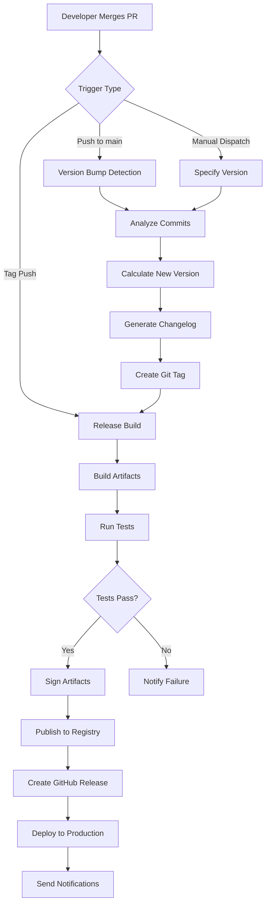
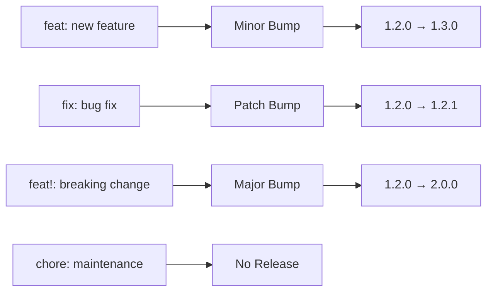
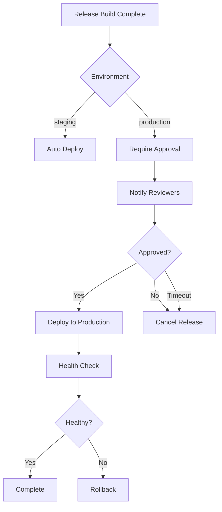

# How to Configure GitHub Actions for Release Automation

Author: [nawazdhandala](https://www.github.com/nawazdhandala)

Tags: GitHub Actions, Release Automation, CI/CD, DevOps, Semantic Versioning, Changelog, npm, Docker

Description: A practical guide to automating software releases with GitHub Actions, covering semantic versioning, changelog generation, multi-platform artifact publishing, and production deployment workflows.

---

Manual releases are error-prone and time-consuming. Every team has experienced the pain of forgetting a version bump, shipping without updated changelogs, or releasing from the wrong branch. GitHub Actions provides a powerful framework to automate the entire release pipeline from version tagging to artifact publishing.

## Release Automation Architecture

Before diving into workflows, let's visualize how automated releases flow through your pipeline.



## 1. Semantic Release with Conventional Commits

Conventional commits enable automatic version detection. Each commit message prefix determines whether the release is a major, minor, or patch bump.



Here's a workflow that uses semantic-release to automate the entire versioning process based on commit history.

```yaml
# .github/workflows/release.yml
name: Semantic Release

# Trigger on pushes to main branch or manual dispatch
on:
  push:
    branches: [main]
  workflow_dispatch:
    inputs:
      # Allow forcing a specific release type when needed
      release_type:
        description: 'Force release type (leave empty for auto)'
        required: false
        type: choice
        options:
          - ''
          - patch
          - minor
          - major

# Ensure only one release runs at a time to prevent version conflicts
concurrency:
  group: release
  cancel-in-progress: false

jobs:
  release:
    runs-on: ubuntu-latest

    # Required permissions for creating releases and pushing tags
    permissions:
      contents: write      # Push tags and create releases
      issues: write        # Comment on related issues
      pull-requests: write # Comment on PRs included in release
      id-token: write      # OIDC token for npm provenance

    steps:
      # Check out the full git history for semantic-release analysis
      - name: Checkout repository
        uses: actions/checkout@v4
        with:
          fetch-depth: 0  # Full history needed for version calculation
          persist-credentials: false

      # Set up Node.js with caching for faster installs
      - name: Setup Node.js
        uses: actions/setup-node@v4
        with:
          node-version: 20
          cache: 'npm'

      # Install dependencies including semantic-release plugins
      - name: Install dependencies
        run: npm ci

      # Run semantic-release to analyze commits and create release
      - name: Run semantic release
        env:
          GITHUB_TOKEN: ${{ secrets.GITHUB_TOKEN }}
          NPM_TOKEN: ${{ secrets.NPM_TOKEN }}
          # Pass manual release type if specified
          FORCE_RELEASE: ${{ github.event.inputs.release_type }}
        run: npx semantic-release
```

## 2. Semantic Release Configuration

Create a configuration file that defines how releases are analyzed, versioned, and published.

```javascript
// release.config.js
module.exports = {
  // Branches that trigger releases
  branches: [
    'main',
    { name: 'beta', prerelease: true },    // Creates 1.0.0-beta.1
    { name: 'alpha', prerelease: true },   // Creates 1.0.0-alpha.1
  ],

  // Plugins run in order during the release process
  plugins: [
    // Analyze commit messages to determine release type
    ['@semantic-release/commit-analyzer', {
      preset: 'conventionalcommits',
      releaseRules: [
        { type: 'feat', release: 'minor' },
        { type: 'fix', release: 'patch' },
        { type: 'perf', release: 'patch' },
        { type: 'revert', release: 'patch' },
        { type: 'docs', scope: 'README', release: 'patch' },
        { breaking: true, release: 'major' },
      ],
    }],

    // Generate changelog content from commits
    ['@semantic-release/release-notes-generator', {
      preset: 'conventionalcommits',
      presetConfig: {
        types: [
          { type: 'feat', section: 'Features' },
          { type: 'fix', section: 'Bug Fixes' },
          { type: 'perf', section: 'Performance' },
          { type: 'revert', section: 'Reverts' },
          { type: 'docs', section: 'Documentation' },
          { type: 'refactor', section: 'Code Refactoring', hidden: true },
        ],
      },
    }],

    // Write changelog to file
    ['@semantic-release/changelog', {
      changelogFile: 'CHANGELOG.md',
    }],

    // Update version in package.json
    ['@semantic-release/npm', {
      npmPublish: true,  // Set false if not publishing to npm
    }],

    // Commit updated files back to the repository
    ['@semantic-release/git', {
      assets: ['CHANGELOG.md', 'package.json', 'package-lock.json'],
      message: 'chore(release): ${nextRelease.version} [skip ci]\n\n${nextRelease.notes}',
    }],

    // Create GitHub release with assets
    ['@semantic-release/github', {
      assets: [
        { path: 'dist/*.tar.gz', label: 'Distribution (tar.gz)' },
        { path: 'dist/*.zip', label: 'Distribution (zip)' },
      ],
    }],
  ],
};
```

## 3. Multi-Artifact Release Pipeline

For projects that produce multiple artifacts like binaries, Docker images, and npm packages, use a matrix strategy to build everything in parallel.

```yaml
# .github/workflows/release-artifacts.yml
name: Release Artifacts

# Trigger when a new version tag is pushed
on:
  push:
    tags:
      - 'v*.*.*'  # Match semantic version tags like v1.2.3

jobs:
  # Build binaries for multiple platforms simultaneously
  build-binaries:
    strategy:
      matrix:
        include:
          - os: ubuntu-latest
            target: x86_64-unknown-linux-gnu
            artifact: myapp-linux-amd64
          - os: ubuntu-latest
            target: aarch64-unknown-linux-gnu
            artifact: myapp-linux-arm64
          - os: macos-latest
            target: x86_64-apple-darwin
            artifact: myapp-darwin-amd64
          - os: macos-latest
            target: aarch64-apple-darwin
            artifact: myapp-darwin-arm64
          - os: windows-latest
            target: x86_64-pc-windows-msvc
            artifact: myapp-windows-amd64.exe

    runs-on: ${{ matrix.os }}

    steps:
      - uses: actions/checkout@v4

      # Build for the target platform
      - name: Build binary
        run: |
          # Your build commands here (Go, Rust, etc.)
          make build TARGET=${{ matrix.target }}

      # Upload artifact for later aggregation
      - name: Upload artifact
        uses: actions/upload-artifact@v4
        with:
          name: ${{ matrix.artifact }}
          path: dist/${{ matrix.artifact }}
          retention-days: 1

  # Build and push Docker images after binaries are ready
  build-docker:
    needs: build-binaries
    runs-on: ubuntu-latest

    steps:
      - uses: actions/checkout@v4

      # Download Linux binaries for Docker image
      - name: Download Linux artifacts
        uses: actions/download-artifact@v4
        with:
          pattern: myapp-linux-*
          path: dist/
          merge-multiple: true

      # Set up multi-platform Docker builds
      - uses: docker/setup-qemu-action@v3
      - uses: docker/setup-buildx-action@v3

      # Authenticate to container registries
      - uses: docker/login-action@v3
        with:
          registry: ghcr.io
          username: ${{ github.actor }}
          password: ${{ secrets.GITHUB_TOKEN }}

      # Extract version from tag for image tagging
      - name: Extract version
        id: version
        run: echo "VERSION=${GITHUB_REF#refs/tags/v}" >> $GITHUB_OUTPUT

      # Build and push multi-arch Docker image
      - uses: docker/build-push-action@v5
        with:
          context: .
          platforms: linux/amd64,linux/arm64
          push: true
          tags: |
            ghcr.io/${{ github.repository }}:${{ steps.version.outputs.VERSION }}
            ghcr.io/${{ github.repository }}:latest
          # Add OCI labels for better registry metadata
          labels: |
            org.opencontainers.image.version=${{ steps.version.outputs.VERSION }}
            org.opencontainers.image.source=${{ github.server_url }}/${{ github.repository }}

  # Create GitHub release with all artifacts
  create-release:
    needs: [build-binaries, build-docker]
    runs-on: ubuntu-latest
    permissions:
      contents: write

    steps:
      # Download all binary artifacts
      - name: Download all artifacts
        uses: actions/download-artifact@v4
        with:
          path: artifacts/
          merge-multiple: true

      # Create checksums for verification
      - name: Generate checksums
        run: |
          cd artifacts
          sha256sum * > checksums.txt

      # Create release with all artifacts attached
      - name: Create GitHub Release
        uses: softprops/action-gh-release@v1
        with:
          generate_release_notes: true
          files: |
            artifacts/*
          body: |
            ## Installation

            ### Docker
            ```bash
            docker pull ghcr.io/${{ github.repository }}:${{ github.ref_name }}
            ```

            ### Binary Downloads
            Download the appropriate binary for your platform from the assets below.

            Verify checksums with:
            ```bash
            sha256sum -c checksums.txt
            ```
```

## 4. Changelog Generation Workflow

For teams that prefer more control over changelog formatting, here's a dedicated workflow using conventional-changelog.

```yaml
# .github/workflows/changelog.yml
name: Generate Changelog

on:
  push:
    branches: [main]
    paths-ignore:
      - 'CHANGELOG.md'  # Prevent infinite loops

jobs:
  changelog:
    runs-on: ubuntu-latest
    permissions:
      contents: write
      pull-requests: write

    steps:
      - uses: actions/checkout@v4
        with:
          fetch-depth: 0
          # Use a PAT to trigger subsequent workflows
          token: ${{ secrets.RELEASE_PAT }}

      # Generate changelog from conventional commits
      - name: Generate changelog
        id: changelog
        uses: TriPSs/conventional-changelog-action@v5
        with:
          github-token: ${{ secrets.RELEASE_PAT }}
          output-file: 'CHANGELOG.md'
          skip-version-file: true
          skip-commit: false
          git-message: 'docs: update changelog for {version}'
          # Custom changelog template
          release-count: 0  # Include all releases

      # Output the generated version for downstream jobs
      - name: Show new version
        if: steps.changelog.outputs.skipped == 'false'
        run: |
          echo "New version: ${{ steps.changelog.outputs.version }}"
          echo "Changelog: ${{ steps.changelog.outputs.clean_changelog }}"
```

## 5. Release Approval Workflow

Production releases often require manual approval. Use GitHub environments to enforce review gates.



Here's a workflow implementing approval gates with automatic rollback on failure.

```yaml
# .github/workflows/release-deploy.yml
name: Release Deployment

on:
  release:
    types: [published]

jobs:
  # Deploy to staging automatically for testing
  deploy-staging:
    runs-on: ubuntu-latest
    environment:
      name: staging
      url: https://staging.example.com

    steps:
      - uses: actions/checkout@v4

      - name: Deploy to staging
        run: |
          # Deploy using your preferred method
          ./scripts/deploy.sh staging ${{ github.event.release.tag_name }}

      # Run smoke tests against staging
      - name: Smoke tests
        run: |
          ./scripts/smoke-test.sh https://staging.example.com

  # Production deployment requires manual approval
  deploy-production:
    needs: deploy-staging
    runs-on: ubuntu-latest
    environment:
      name: production
      url: https://example.com

    steps:
      - uses: actions/checkout@v4

      # Store current version for potential rollback
      - name: Record current version
        id: current
        run: |
          CURRENT=$(curl -s https://example.com/version)
          echo "VERSION=$CURRENT" >> $GITHUB_OUTPUT

      - name: Deploy to production
        id: deploy
        run: |
          ./scripts/deploy.sh production ${{ github.event.release.tag_name }}

      # Verify deployment health
      - name: Health check
        id: health
        run: |
          for i in {1..10}; do
            if curl -sf https://example.com/health; then
              echo "Deployment healthy"
              exit 0
            fi
            sleep 30
          done
          echo "Health check failed"
          exit 1

      # Rollback if health check fails
      - name: Rollback on failure
        if: failure() && steps.deploy.outcome == 'success'
        run: |
          echo "Rolling back to ${{ steps.current.outputs.VERSION }}"
          ./scripts/deploy.sh production ${{ steps.current.outputs.VERSION }}

      # Notify team of deployment result
      - name: Notify success
        if: success()
        run: |
          curl -X POST ${{ secrets.SLACK_WEBHOOK }} \
            -H 'Content-Type: application/json' \
            -d '{"text":"Released ${{ github.event.release.tag_name }} to production"}'

      - name: Notify failure
        if: failure()
        run: |
          curl -X POST ${{ secrets.SLACK_WEBHOOK }} \
            -H 'Content-Type: application/json' \
            -d '{"text":"Release ${{ github.event.release.tag_name }} failed and was rolled back"}'
```

## 6. Release Drafter for PR-Based Releases

Release Drafter automatically generates release notes based on merged PRs, organizing them by labels.

```yaml
# .github/release-drafter.yml
name-template: 'v$RESOLVED_VERSION'
tag-template: 'v$RESOLVED_VERSION'

# Map PR labels to changelog sections
categories:
  - title: 'Breaking Changes'
    labels:
      - 'breaking-change'
      - 'major'
  - title: 'New Features'
    labels:
      - 'feature'
      - 'enhancement'
  - title: 'Bug Fixes'
    labels:
      - 'bug'
      - 'fix'
  - title: 'Performance Improvements'
    labels:
      - 'performance'
  - title: 'Documentation'
    labels:
      - 'documentation'
      - 'docs'
  - title: 'Dependencies'
    labels:
      - 'dependencies'
    collapse-after: 5  # Collapse if more than 5 items

# Exclude certain labels from release notes
exclude-labels:
  - 'skip-changelog'
  - 'chore'

# Auto-label PRs based on files changed
autolabeler:
  - label: 'documentation'
    files:
      - '*.md'
      - 'docs/**'
  - label: 'dependencies'
    files:
      - 'package-lock.json'
      - 'go.sum'
      - 'Cargo.lock'

# Version resolver determines bump type from labels
version-resolver:
  major:
    labels:
      - 'breaking-change'
      - 'major'
  minor:
    labels:
      - 'feature'
      - 'enhancement'
  patch:
    labels:
      - 'bug'
      - 'fix'
      - 'documentation'
  default: patch

# Template for the release body
template: |
  ## What's Changed

  $CHANGES

  ## Contributors

  $CONTRIBUTORS

  **Full Changelog**: https://github.com/$OWNER/$REPOSITORY/compare/$PREVIOUS_TAG...v$RESOLVED_VERSION
```

Pair with a workflow that updates the draft on every PR merge.

```yaml
# .github/workflows/release-drafter.yml
name: Release Drafter

on:
  push:
    branches: [main]
  pull_request:
    types: [opened, reopened, synchronize]

permissions:
  contents: read
  pull-requests: write

jobs:
  update-release-draft:
    runs-on: ubuntu-latest
    steps:
      - uses: release-drafter/release-drafter@v5
        env:
          GITHUB_TOKEN: ${{ secrets.GITHUB_TOKEN }}
```

## 7. Monorepo Release Strategy

For monorepos with multiple packages, use path filters and a release orchestrator.

```yaml
# .github/workflows/monorepo-release.yml
name: Monorepo Release

on:
  push:
    branches: [main]
    paths:
      - 'packages/**'

jobs:
  # Detect which packages have changes
  detect-changes:
    runs-on: ubuntu-latest
    outputs:
      packages: ${{ steps.filter.outputs.changes }}

    steps:
      - uses: actions/checkout@v4

      # Determine changed packages using path filters
      - uses: dorny/paths-filter@v3
        id: filter
        with:
          filters: |
            api:
              - 'packages/api/**'
            web:
              - 'packages/web/**'
            shared:
              - 'packages/shared/**'

  # Release each changed package independently
  release-package:
    needs: detect-changes
    if: needs.detect-changes.outputs.packages != '[]'
    strategy:
      matrix:
        package: ${{ fromJson(needs.detect-changes.outputs.packages) }}
      # Release packages one at a time to prevent conflicts
      max-parallel: 1

    runs-on: ubuntu-latest
    defaults:
      run:
        working-directory: packages/${{ matrix.package }}

    steps:
      - uses: actions/checkout@v4
        with:
          fetch-depth: 0

      - uses: actions/setup-node@v4
        with:
          node-version: 20
          registry-url: 'https://registry.npmjs.org'

      # Install and build the specific package
      - name: Install dependencies
        run: npm ci

      - name: Build package
        run: npm run build

      # Use semantic-release with package-specific config
      - name: Release
        env:
          GITHUB_TOKEN: ${{ secrets.GITHUB_TOKEN }}
          NODE_AUTH_TOKEN: ${{ secrets.NPM_TOKEN }}
        run: npx semantic-release -e semantic-release-monorepo
```

## 8. Hotfix Release Workflow

Hotfixes require a faster path to production while maintaining traceability.

```yaml
# .github/workflows/hotfix.yml
name: Hotfix Release

on:
  workflow_dispatch:
    inputs:
      base_version:
        description: 'Base version to hotfix (e.g., 1.2.0)'
        required: true
      description:
        description: 'Hotfix description'
        required: true

jobs:
  create-hotfix:
    runs-on: ubuntu-latest
    permissions:
      contents: write

    steps:
      - uses: actions/checkout@v4
        with:
          fetch-depth: 0

      # Create hotfix branch from the release tag
      - name: Create hotfix branch
        run: |
          git checkout v${{ inputs.base_version }}
          git checkout -b hotfix/${{ inputs.base_version }}
          git push -u origin hotfix/${{ inputs.base_version }}

      # Calculate the hotfix version number
      - name: Calculate hotfix version
        id: version
        run: |
          # Find existing hotfix versions and increment
          LATEST=$(git tag -l "v${{ inputs.base_version }}.*" | sort -V | tail -1)
          if [ -z "$LATEST" ]; then
            echo "VERSION=${{ inputs.base_version }}.1" >> $GITHUB_OUTPUT
          else
            PATCH=$(echo $LATEST | sed 's/.*\.//')
            echo "VERSION=${{ inputs.base_version }}.$((PATCH + 1))" >> $GITHUB_OUTPUT
          fi

      - name: Output hotfix info
        run: |
          echo "Hotfix branch: hotfix/${{ inputs.base_version }}"
          echo "Next version: v${{ steps.version.outputs.VERSION }}"
          echo "Apply your fix, then push and create a PR to merge back to main"
```

## 9. Release Notifications

Keep your team informed about releases through multiple channels.

```yaml
# .github/workflows/release-notify.yml
name: Release Notifications

on:
  release:
    types: [published]

jobs:
  notify:
    runs-on: ubuntu-latest
    steps:
      # Slack notification with rich formatting
      - name: Notify Slack
        uses: slackapi/slack-github-action@v1
        with:
          payload: |
            {
              "blocks": [
                {
                  "type": "header",
                  "text": {
                    "type": "plain_text",
                    "text": "New Release: ${{ github.event.release.tag_name }}"
                  }
                },
                {
                  "type": "section",
                  "text": {
                    "type": "mrkdwn",
                    "text": "${{ github.event.release.body }}"
                  }
                },
                {
                  "type": "actions",
                  "elements": [
                    {
                      "type": "button",
                      "text": { "type": "plain_text", "text": "View Release" },
                      "url": "${{ github.event.release.html_url }}"
                    }
                  ]
                }
              ]
            }
        env:
          SLACK_WEBHOOK_URL: ${{ secrets.SLACK_WEBHOOK }}
          SLACK_WEBHOOK_TYPE: INCOMING_WEBHOOK

      # Discord notification
      - name: Notify Discord
        run: |
          curl -X POST ${{ secrets.DISCORD_WEBHOOK }} \
            -H "Content-Type: application/json" \
            -d '{
              "embeds": [{
                "title": "Release ${{ github.event.release.tag_name }}",
                "description": "A new version has been released",
                "url": "${{ github.event.release.html_url }}",
                "color": 5763719
              }]
            }'

      # Update status page
      - name: Update OneUptime
        run: |
          curl -X POST "https://oneuptime.com/api/announcement" \
            -H "Authorization: Bearer ${{ secrets.ONEUPTIME_TOKEN }}" \
            -H "Content-Type: application/json" \
            -d '{
              "title": "Version ${{ github.event.release.tag_name }} Released",
              "description": "New version deployed successfully",
              "announcementType": "info"
            }'
```

## 10. Release Validation Checklist

Automated releases are only as good as the validation that guards them. Here's a reusable workflow that runs before any release.

```yaml
# .github/workflows/release-gate.yml
name: Release Gate

on:
  workflow_call:
    outputs:
      can_release:
        description: 'Whether the release can proceed'
        value: ${{ jobs.validate.outputs.can_release }}

jobs:
  validate:
    runs-on: ubuntu-latest
    outputs:
      can_release: ${{ steps.check.outputs.can_release }}

    steps:
      - uses: actions/checkout@v4

      # Verify all tests pass
      - name: Run tests
        run: npm test

      # Check for security vulnerabilities
      - name: Security audit
        run: npm audit --audit-level=high

      # Verify build succeeds
      - name: Build
        run: npm run build

      # Check documentation is current
      - name: Documentation check
        run: |
          npm run docs:check || echo "Documentation outdated"

      # Verify changelog has unreleased changes
      - name: Changelog check
        run: |
          if grep -q "## \[Unreleased\]" CHANGELOG.md; then
            echo "Unreleased changes found"
          else
            echo "No unreleased changes in changelog"
          fi

      # Final gate decision
      - name: Release gate decision
        id: check
        run: |
          # Add your custom validation logic
          echo "can_release=true" >> $GITHUB_OUTPUT
```

---

Automated releases eliminate the friction between writing code and shipping it to users. By combining semantic versioning, changelog generation, multi-platform builds, and approval workflows, you create a release process that scales with your team. Start with a simple semantic-release setup, then add complexity as your needs grow.

For monitoring your release pipelines and deployment health, [OneUptime](https://oneuptime.com/blog/post/2025-11-28-sre-best-practices/view) provides comprehensive observability that integrates seamlessly with GitHub Actions webhooks.
