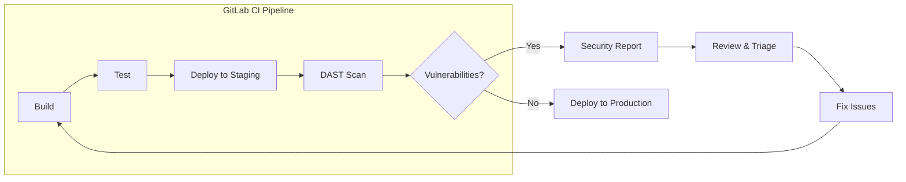
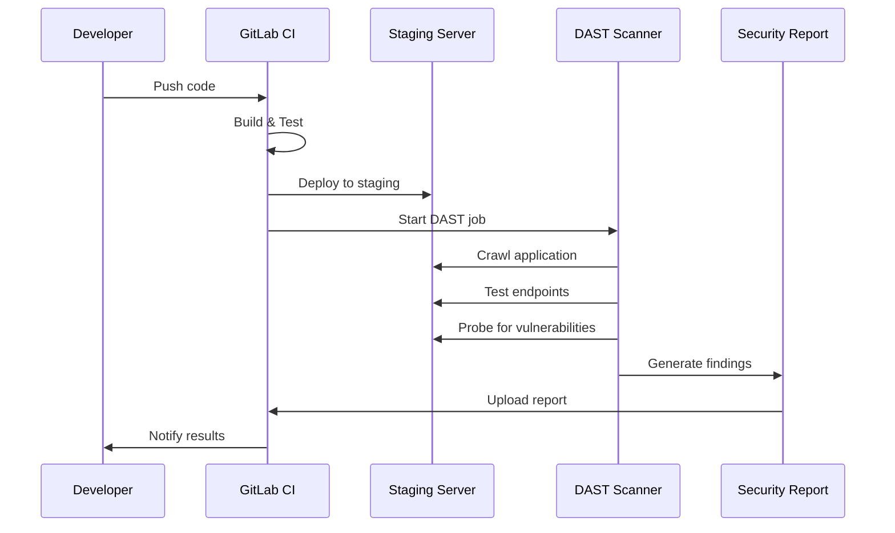
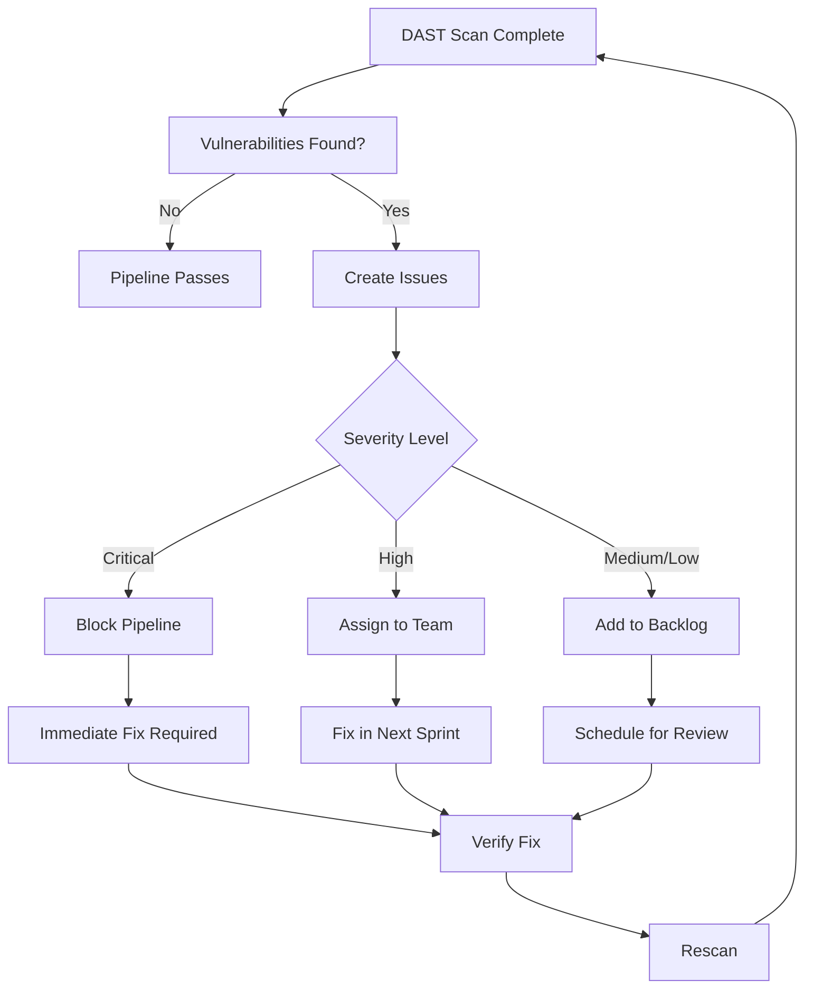
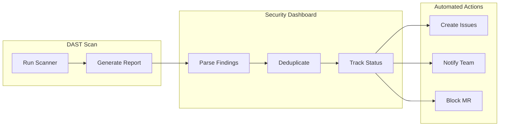

# How to Configure GitLab CI DAST Security Testing

Author: [nawazdhandala](https://www.github.com/nawazdhandala)

Tags: GitLab CI, DAST, Security Testing, DevSecOps, CI/CD, Application Security, Vulnerability Scanning

Description: A comprehensive guide to configuring Dynamic Application Security Testing (DAST) in GitLab CI pipelines. Learn how to set up DAST scans, configure authentication, handle false positives, and integrate security testing into your DevSecOps workflow.

---

Dynamic Application Security Testing (DAST) finds vulnerabilities in running applications by simulating real-world attacks. Unlike static analysis that examines source code, DAST interacts with your application the same way an attacker would - through HTTP requests, form submissions, and API calls.

## What is DAST?

DAST scanners crawl your application, identify entry points, and probe for common vulnerabilities like SQL injection, cross-site scripting (XSS), and authentication bypasses. GitLab includes a built-in DAST analyzer powered by OWASP ZAP that integrates directly into your CI/CD pipeline.



## DAST vs SAST: Understanding the Difference

Security testing works best when you combine multiple approaches. DAST and SAST complement each other by finding different types of vulnerabilities.

| Aspect | DAST | SAST |
|--------|------|------|
| What it scans | Running application | Source code |
| When it runs | After deployment | Before build |
| Finds | Runtime vulnerabilities | Code-level issues |
| Languages | Language agnostic | Language specific |
| False positives | Lower | Higher |
| Coverage | External attack surface | Internal code paths |

## Prerequisites

Before configuring DAST, ensure you have:

- GitLab Ultimate license (DAST is an Ultimate feature)
- A deployed application accessible via URL
- CI/CD pipeline with a staging environment
- Basic familiarity with GitLab CI configuration

## Basic DAST Configuration

The simplest DAST setup requires just a few lines in your `.gitlab-ci.yml` file.

The following configuration includes the GitLab DAST template and defines the target URL for scanning. Replace the URL with your staging environment.

```yaml
# Include the official GitLab DAST template
include:
  - template: DAST.gitlab-ci.yml

# Define variables for DAST configuration
variables:
  # URL of the application to scan
  DAST_WEBSITE: "https://staging.example.com"
  # Browser-based scanning for modern JavaScript apps
  DAST_BROWSER_SCAN: "true"

# Ensure DAST runs only after deployment
stages:
  - build
  - test
  - deploy
  - dast
```

## Configuring DAST Scan Profiles

Different applications require different scanning approaches. GitLab offers several scan profiles to balance thoroughness with speed.

### Full Scan Profile

A full scan provides comprehensive coverage but takes longer to complete. Use for scheduled nightly scans or before major releases.

```yaml
include:
  - template: DAST.gitlab-ci.yml

variables:
  DAST_WEBSITE: "https://staging.example.com"
  # Full scan crawls deeply and tests all parameters
  DAST_FULL_SCAN_ENABLED: "true"
  # Increase spider duration for large applications
  DAST_SPIDER_MINS: "30"
  # Maximum number of URLs to scan
  DAST_MAX_URLS_PER_VULNERABILITY: "50"

# Override the DAST job to run on schedule
dast:
  rules:
    # Run on scheduled pipeline
    - if: $CI_PIPELINE_SOURCE == "schedule"
    # Run on merge requests to main
    - if: $CI_MERGE_REQUEST_TARGET_BRANCH_NAME == "main"
```

### Passive Scan Profile

Passive scanning observes responses without sending attack payloads. Faster and safer for production environments.

```yaml
include:
  - template: DAST.gitlab-ci.yml

variables:
  DAST_WEBSITE: "https://production.example.com"
  # Passive mode only observes, never attacks
  DAST_FULL_SCAN_ENABLED: "false"
  # Limit crawl depth for quick scans
  DAST_SPIDER_MINS: "5"

dast:
  rules:
    # Only run passive scans on production
    - if: $CI_COMMIT_BRANCH == "main"
      variables:
        DAST_WEBSITE: "https://production.example.com"
```

## DAST Scan Architecture

Understanding how DAST integrates with your deployment pipeline helps with troubleshooting and optimization.



## Configuring Authentication

Most applications require authentication. DAST can log in automatically before scanning protected pages.

### Form-Based Authentication

Configure DAST to fill out and submit a login form. The scanner then uses the authenticated session for all subsequent requests.

```yaml
include:
  - template: DAST.gitlab-ci.yml

variables:
  DAST_WEBSITE: "https://staging.example.com"
  DAST_BROWSER_SCAN: "true"
  # Enable authentication
  DAST_AUTH_URL: "https://staging.example.com/login"
  # CSS selector for username field
  DAST_USERNAME_FIELD: "input[name='email']"
  # CSS selector for password field
  DAST_PASSWORD_FIELD: "input[name='password']"
  # CSS selector for submit button
  DAST_SUBMIT_FIELD: "button[type='submit']"
  # Element that indicates successful login
  DAST_AUTH_VERIFICATION_URL: "https://staging.example.com/dashboard"

# Store credentials securely in CI/CD variables
# Never hardcode credentials in gitlab-ci.yml
# Set these in Settings > CI/CD > Variables:
# - DAST_USERNAME
# - DAST_PASSWORD
```

### HTTP Basic Authentication

For applications using HTTP Basic Auth, configure the scanner with credentials directly.

```yaml
include:
  - template: DAST.gitlab-ci.yml

variables:
  DAST_WEBSITE: "https://staging.example.com"
  # Enable Basic Auth
  DAST_AUTH_TYPE: "basic"
  # Username and password from CI/CD variables
  DAST_AUTH_URL: "https://staging.example.com"

# The scanner will use DAST_USERNAME and DAST_PASSWORD
# variables automatically when DAST_AUTH_TYPE is set
```

### Token-Based Authentication

Modern APIs often use bearer tokens. Configure DAST to include authentication headers with every request.

```yaml
include:
  - template: DAST.gitlab-ci.yml

variables:
  DAST_WEBSITE: "https://api.staging.example.com"
  # API scanning mode
  DAST_API_OPENAPI: "https://api.staging.example.com/openapi.json"

# Custom script to obtain and use auth token
dast:
  before_script:
    # Obtain authentication token
    - |
      TOKEN=$(curl -s -X POST https://auth.example.com/token \
        -d "client_id=${API_CLIENT_ID}" \
        -d "client_secret=${API_CLIENT_SECRET}" \
        -d "grant_type=client_credentials" | jq -r '.access_token')
    # Export for DAST to use
    - export DAST_REQUEST_HEADERS="Authorization: Bearer ${TOKEN}"
```

## Scanning API Endpoints

REST APIs and GraphQL endpoints need special handling. DAST can import API specifications to ensure complete coverage.

### OpenAPI Specification Scanning

Point DAST at your OpenAPI spec to scan all documented endpoints systematically.

```yaml
include:
  - template: DAST-API.gitlab-ci.yml

variables:
  # Path to OpenAPI specification
  DAST_API_OPENAPI: "https://staging.example.com/api/v1/openapi.json"
  # Or use a local file in the repository
  # DAST_API_OPENAPI: "./docs/openapi.yaml"

  # Target URL if different from spec server
  DAST_API_TARGET_URL: "https://staging.example.com"

  # Authentication header for API calls
  DAST_API_HTTP_USERNAME: "${API_USER}"
  DAST_API_HTTP_PASSWORD: "${API_PASS}"
```

### GraphQL API Scanning

GraphQL APIs require introspection queries to discover the schema. Enable GraphQL-specific scanning options.

```yaml
include:
  - template: DAST-API.gitlab-ci.yml

variables:
  # GraphQL endpoint URL
  DAST_API_GRAPHQL: "https://staging.example.com/graphql"
  # Schema file if introspection is disabled
  DAST_API_GRAPHQL_SCHEMA: "./schema.graphql"

dast_api:
  variables:
    # Include authentication token
    DAST_API_HTTP_HEADERS: "Authorization: Bearer ${GRAPHQL_TOKEN}"
```

## Handling Scan Results

DAST generates detailed reports with vulnerability findings. Configure how your pipeline responds to different severity levels.

### Severity Thresholds

Control which vulnerabilities block the pipeline and which generate warnings only.

```yaml
include:
  - template: DAST.gitlab-ci.yml

variables:
  DAST_WEBSITE: "https://staging.example.com"
  # Only fail pipeline on critical vulnerabilities
  DAST_FULL_SCAN_ENABLED: "true"

# Configure vulnerability thresholds
dast:
  allow_failure: false
  artifacts:
    reports:
      dast: gl-dast-report.json
    paths:
      - gl-dast-report.json
    expire_in: 1 week
  rules:
    - if: $CI_COMMIT_BRANCH
      exists:
        - .gitlab-ci.yml
```

### Custom Failure Conditions

Use a post-scan job to implement custom logic for handling results.

```yaml
include:
  - template: DAST.gitlab-ci.yml

variables:
  DAST_WEBSITE: "https://staging.example.com"

# Custom job to evaluate DAST results
evaluate_dast:
  stage: dast
  needs:
    - dast
  script:
    # Parse the DAST report
    - |
      CRITICAL=$(jq '[.vulnerabilities[] | select(.severity=="Critical")] | length' gl-dast-report.json)
      HIGH=$(jq '[.vulnerabilities[] | select(.severity=="High")] | length' gl-dast-report.json)

      echo "Critical vulnerabilities: ${CRITICAL}"
      echo "High vulnerabilities: ${HIGH}"

      # Fail if any critical issues found
      if [ "${CRITICAL}" -gt 0 ]; then
        echo "Pipeline blocked: Critical vulnerabilities detected"
        exit 1
      fi

      # Warn but allow high severity issues
      if [ "${HIGH}" -gt 5 ]; then
        echo "Warning: Multiple high severity vulnerabilities"
        exit 1
      fi
  artifacts:
    reports:
      dast: gl-dast-report.json
```

## Vulnerability Management Workflow



## Managing False Positives

Not every finding represents a real vulnerability. GitLab provides ways to dismiss or exclude false positives.

### Vulnerability Dismissal

Review and dismiss false positives directly in the GitLab UI, or use the API for automation.

```yaml
include:
  - template: DAST.gitlab-ci.yml

variables:
  DAST_WEBSITE: "https://staging.example.com"

# Job to auto-dismiss known false positives
dismiss_false_positives:
  stage: dast
  needs:
    - dast
  script:
    # Use GitLab API to dismiss known false positives
    - |
      # Read vulnerability IDs from allowed list
      while read -r vuln_id; do
        curl --request POST \
          --header "PRIVATE-TOKEN: ${GITLAB_API_TOKEN}" \
          --data "state=dismissed" \
          --data "dismissal_reason=false_positive" \
          "${CI_API_V4_URL}/projects/${CI_PROJECT_ID}/vulnerabilities/${vuln_id}/dismiss"
      done < ./security/allowed-vulnerabilities.txt
  rules:
    - if: $CI_COMMIT_BRANCH == "main"
      exists:
        - security/allowed-vulnerabilities.txt
```

### Excluding URLs from Scan

Some URLs should never be scanned, such as logout endpoints or external links.

```yaml
include:
  - template: DAST.gitlab-ci.yml

variables:
  DAST_WEBSITE: "https://staging.example.com"
  # Exclude specific paths from scanning
  DAST_EXCLUDE_URLS: "https://staging.example.com/logout,https://staging.example.com/external/*"
  # Exclude URLs matching regex patterns
  DAST_EXCLUDE_RULES: "10020,10021"  # Information disclosure rules
```

## Complete Pipeline Example

A production-ready pipeline integrating DAST with other security scans and deployment stages.

```yaml
# Complete GitLab CI pipeline with DAST integration
stages:
  - build
  - test
  - security
  - deploy-staging
  - dast
  - deploy-production

# Include security scanning templates
include:
  - template: Security/SAST.gitlab-ci.yml
  - template: Security/Dependency-Scanning.gitlab-ci.yml
  - template: Security/Secret-Detection.gitlab-ci.yml
  - template: DAST.gitlab-ci.yml

variables:
  # Application configuration
  APP_NAME: "myapp"
  STAGING_URL: "https://staging.myapp.com"
  PRODUCTION_URL: "https://myapp.com"

  # DAST configuration
  DAST_WEBSITE: "${STAGING_URL}"
  DAST_BROWSER_SCAN: "true"
  DAST_FULL_SCAN_ENABLED: "true"
  DAST_AUTH_URL: "${STAGING_URL}/login"
  DAST_USERNAME_FIELD: "#email"
  DAST_PASSWORD_FIELD: "#password"
  DAST_SUBMIT_FIELD: "button[type='submit']"
  DAST_AUTH_VERIFICATION_URL: "${STAGING_URL}/dashboard"

# Build the application
build:
  stage: build
  image: node:20
  script:
    - npm ci
    - npm run build
  artifacts:
    paths:
      - dist/
    expire_in: 1 day

# Run unit tests
test:
  stage: test
  image: node:20
  script:
    - npm ci
    - npm test
  coverage: '/Coverage: \d+\.\d+%/'

# Deploy to staging environment
deploy_staging:
  stage: deploy-staging
  image: alpine:latest
  script:
    - apk add --no-cache curl
    # Deploy to staging server
    - |
      curl -X POST "${DEPLOY_WEBHOOK_URL}" \
        -H "Authorization: Bearer ${DEPLOY_TOKEN}" \
        -d "environment=staging" \
        -d "image=${CI_REGISTRY_IMAGE}:${CI_COMMIT_SHA}"
  environment:
    name: staging
    url: ${STAGING_URL}
  rules:
    - if: $CI_COMMIT_BRANCH == "main"

# DAST scan runs automatically from template
# Override to add dependencies and rules
dast:
  needs:
    - deploy_staging
  variables:
    DAST_SPIDER_MINS: "15"
  rules:
    - if: $CI_COMMIT_BRANCH == "main"
  artifacts:
    reports:
      dast: gl-dast-report.json
    paths:
      - gl-dast-report.json
    expire_in: 30 days

# Deploy to production after successful DAST
deploy_production:
  stage: deploy-production
  image: alpine:latest
  script:
    - apk add --no-cache curl
    # Deploy to production server
    - |
      curl -X POST "${DEPLOY_WEBHOOK_URL}" \
        -H "Authorization: Bearer ${DEPLOY_TOKEN}" \
        -d "environment=production" \
        -d "image=${CI_REGISTRY_IMAGE}:${CI_COMMIT_SHA}"
  environment:
    name: production
    url: ${PRODUCTION_URL}
  rules:
    - if: $CI_COMMIT_BRANCH == "main"
      when: manual
  needs:
    - dast
```

## Browser-Based Scanning

Modern web applications with heavy JavaScript require browser-based scanning. DAST can use a real browser to execute JavaScript and interact with dynamic content.

```yaml
include:
  - template: DAST.gitlab-ci.yml

variables:
  DAST_WEBSITE: "https://staging.example.com"
  # Enable browser-based crawler
  DAST_BROWSER_SCAN: "true"
  # Browser scan specific options
  DAST_BROWSER_ACTION_TIMEOUT: "10"
  DAST_BROWSER_PAGE_TIMEOUT: "60"
  # Wait for JavaScript to load
  DAST_BROWSER_STABILITY_TIMEOUT: "5"

dast:
  # Increase resources for browser scanning
  variables:
    KUBERNETES_MEMORY_REQUEST: "2Gi"
    KUBERNETES_MEMORY_LIMIT: "4Gi"
    KUBERNETES_CPU_REQUEST: "1"
```

## Scheduled Security Scans

Run comprehensive DAST scans on a schedule rather than on every commit.

```yaml
include:
  - template: DAST.gitlab-ci.yml

variables:
  DAST_WEBSITE: "https://staging.example.com"

# Full scan for scheduled pipelines
dast:
  variables:
    DAST_FULL_SCAN_ENABLED: "true"
    DAST_SPIDER_MINS: "60"
  rules:
    # Nightly full scan
    - if: $CI_PIPELINE_SOURCE == "schedule"
      variables:
        DAST_FULL_SCAN_ENABLED: "true"
    # Quick scan on merge requests
    - if: $CI_MERGE_REQUEST_IID
      variables:
        DAST_FULL_SCAN_ENABLED: "false"
        DAST_SPIDER_MINS: "5"
```

Create a scheduled pipeline in GitLab:
1. Navigate to CI/CD > Schedules
2. Click "New schedule"
3. Set the cron expression (e.g., `0 2 * * *` for 2 AM daily)
4. Add any schedule-specific variables

## Performance Optimization

DAST scans can be time-consuming. Several strategies help reduce scan duration without sacrificing coverage.

### Parallel Scanning

Split the application into sections and scan them in parallel jobs.

```yaml
include:
  - template: DAST.gitlab-ci.yml

# Scan different application sections in parallel
dast_frontend:
  extends: dast
  variables:
    DAST_WEBSITE: "https://staging.example.com/app"
    DAST_EXCLUDE_URLS: "https://staging.example.com/api/*"

dast_api:
  extends: dast
  variables:
    DAST_WEBSITE: "https://staging.example.com/api"
    DAST_API_OPENAPI: "./openapi.json"

dast_admin:
  extends: dast
  variables:
    DAST_WEBSITE: "https://staging.example.com/admin"
    DAST_AUTH_URL: "https://staging.example.com/admin/login"
```

### Incremental Scanning

Only scan pages that changed since the last scan using URL filtering.

```yaml
include:
  - template: DAST.gitlab-ci.yml

variables:
  DAST_WEBSITE: "https://staging.example.com"

dast:
  before_script:
    # Generate list of changed URLs from git diff
    - |
      git diff --name-only HEAD~1 HEAD | \
        grep -E '\.(html|js|php|py)$' | \
        sed 's|src/|https://staging.example.com/|g' > changed_urls.txt
    # Export as include list
    - export DAST_PATHS_FILE="changed_urls.txt"
```

## Troubleshooting DAST Issues

Common problems and solutions when configuring DAST scans.

### Scanner Cannot Reach Target

Verify network connectivity between the GitLab runner and your staging environment.

```yaml
# Add a connectivity check job before DAST
check_connectivity:
  stage: dast
  image: curlimages/curl:latest
  script:
    # Verify target is reachable
    - curl -s -o /dev/null -w "%{http_code}" ${DAST_WEBSITE}
    # Check specific endpoints
    - curl -s -o /dev/null -w "%{http_code}" ${DAST_AUTH_URL}
  rules:
    - if: $CI_COMMIT_BRANCH

dast:
  needs:
    - check_connectivity
```

### Authentication Failures

Debug authentication issues by checking the login flow.

```yaml
include:
  - template: DAST.gitlab-ci.yml

variables:
  DAST_WEBSITE: "https://staging.example.com"
  # Enable debug logging
  DAST_DEBUG: "true"
  # Increase authentication timeout
  DAST_AUTH_TIMEOUT: "60"

# Check authentication separately
test_auth:
  stage: dast
  image: curlimages/curl:latest
  script:
    # Test login endpoint
    - |
      RESPONSE=$(curl -s -X POST ${DAST_AUTH_URL} \
        -d "email=${DAST_USERNAME}" \
        -d "password=${DAST_PASSWORD}" \
        -c cookies.txt)
      echo "Login response: ${RESPONSE}"
    # Verify session works
    - curl -s -b cookies.txt ${DAST_AUTH_VERIFICATION_URL}
```

### Scan Timeout Issues

Large applications may exceed default timeouts. Adjust limits based on application size.

```yaml
include:
  - template: DAST.gitlab-ci.yml

variables:
  DAST_WEBSITE: "https://staging.example.com"
  # Increase spider duration
  DAST_SPIDER_MINS: "60"
  # Increase overall job timeout
  DAST_TARGET_AVAILABILITY_TIMEOUT: "300"

dast:
  # Increase CI job timeout
  timeout: 3 hours
  variables:
    # Limit scan scope if needed
    DAST_MAX_DEPTH: "10"
    DAST_MAX_URLS_PER_VULNERABILITY: "20"
```

## Security Report Integration

DAST findings integrate with GitLab's security dashboard and can trigger automated workflows.



### Automatic Issue Creation

Configure GitLab to create issues automatically for new vulnerabilities.

```yaml
include:
  - template: DAST.gitlab-ci.yml

variables:
  DAST_WEBSITE: "https://staging.example.com"

# Create issues for critical findings
create_security_issues:
  stage: dast
  needs:
    - dast
  image: alpine:latest
  script:
    - apk add --no-cache jq curl
    # Parse vulnerabilities and create issues
    - |
      jq -c '.vulnerabilities[] | select(.severity=="Critical" or .severity=="High")' gl-dast-report.json | \
      while read -r vuln; do
        TITLE=$(echo "$vuln" | jq -r '.name')
        SEVERITY=$(echo "$vuln" | jq -r '.severity')
        DESCRIPTION=$(echo "$vuln" | jq -r '.description')

        curl --request POST \
          --header "PRIVATE-TOKEN: ${GITLAB_API_TOKEN}" \
          --data-urlencode "title=[Security] ${SEVERITY}: ${TITLE}" \
          --data-urlencode "description=${DESCRIPTION}" \
          --data "labels=security,dast,${SEVERITY}" \
          "${CI_API_V4_URL}/projects/${CI_PROJECT_ID}/issues"
      done
  rules:
    - if: $CI_COMMIT_BRANCH == "main"
```

## Best Practices

Following these recommendations helps maintain effective DAST scanning.

### 1. Use Dedicated Test Credentials

Create service accounts specifically for DAST scanning with appropriate permissions.

```yaml
# Store in CI/CD variables, not in code
# Settings > CI/CD > Variables
# - DAST_USERNAME: dast-scanner@example.com
# - DAST_PASSWORD: (masked variable)
# - Scope: staging environment only
```

### 2. Scan Staging, Not Production

Always scan staging environments to avoid impacting real users or data.

```yaml
variables:
  # Never hardcode production URLs
  DAST_WEBSITE: "${CI_ENVIRONMENT_URL}"

dast:
  environment:
    name: staging
  rules:
    # Prevent accidental production scans
    - if: $CI_ENVIRONMENT_NAME == "production"
      when: never
    - if: $CI_COMMIT_BRANCH == "main"
```

### 3. Review Results Regularly

Schedule weekly reviews of DAST findings to identify trends and prioritize fixes.

### 4. Combine with Other Security Tools

DAST works best as part of a comprehensive security strategy including SAST, dependency scanning, and secret detection.

```yaml
include:
  - template: Security/SAST.gitlab-ci.yml
  - template: Security/Dependency-Scanning.gitlab-ci.yml
  - template: Security/Secret-Detection.gitlab-ci.yml
  - template: Security/Container-Scanning.gitlab-ci.yml
  - template: DAST.gitlab-ci.yml
```

### 5. Keep Scanner Updated

GitLab regularly updates the DAST analyzer with new vulnerability checks. Use the latest template version.

```yaml
include:
  # Use specific version for reproducibility
  - template: DAST.gitlab-ci.yml

# Or pin to specific analyzer version
dast:
  image:
    name: registry.gitlab.com/security-products/dast:4
```

---

DAST scanning provides essential runtime security validation that complements static analysis tools. By integrating DAST into your GitLab CI pipeline, you catch vulnerabilities before they reach production. Start with basic configuration and gradually add authentication, API scanning, and custom rules as your security program matures. Regular scanning combined with prompt remediation keeps your applications secure against evolving threats.
