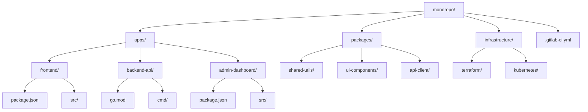
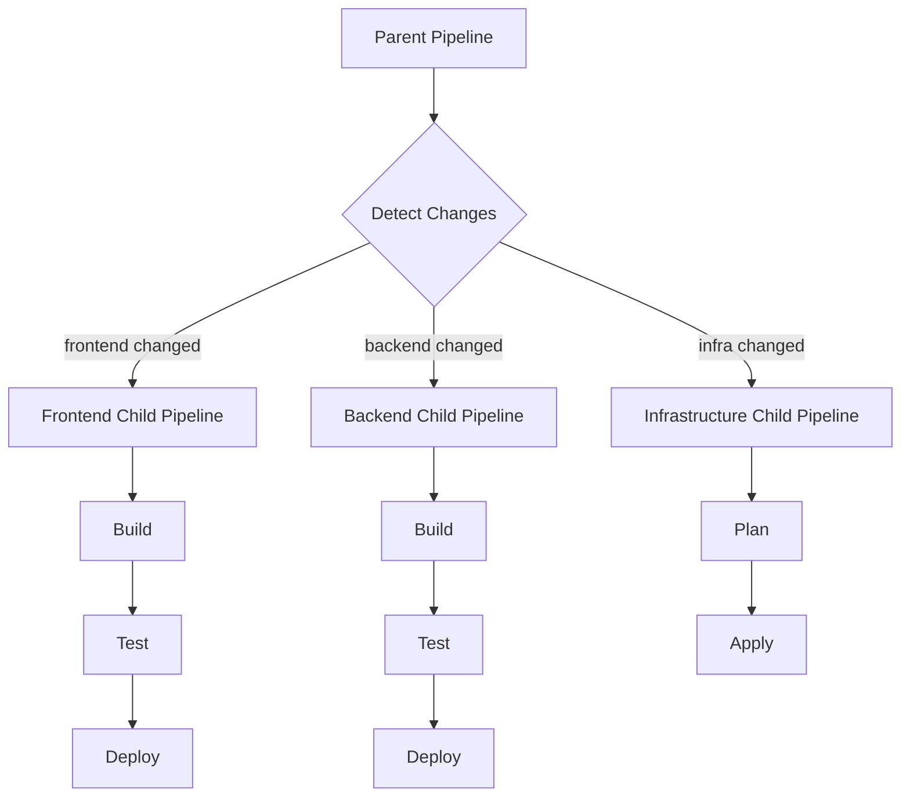
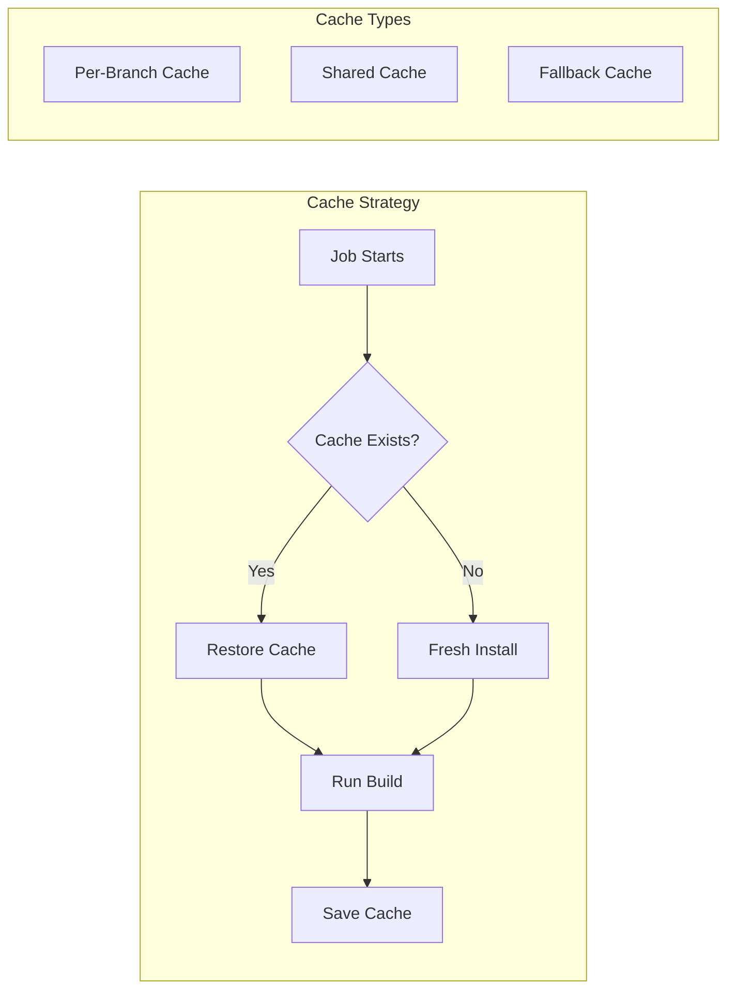
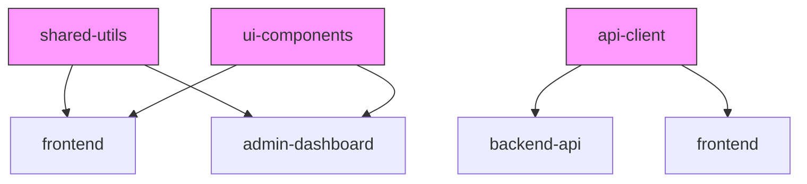
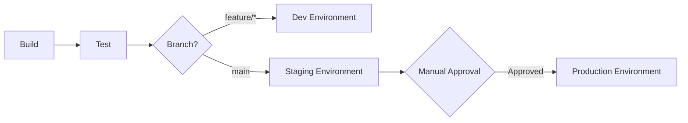

# How to Configure GitLab CI for Monorepos

Author: [nawazdhandala](https://github.com/nawazdhandala)

Tags: GitLab CI, Monorepo, CI/CD, DevOps, Pipeline Optimization

Description: A comprehensive guide to configuring GitLab CI/CD pipelines for monorepo architectures, covering change detection, parallel builds, caching strategies, and optimization techniques for efficient multi-project workflows.

---

## Introduction

Monorepos have become increasingly popular for managing multiple related projects in a single repository. Companies like Google, Facebook, and Microsoft use monorepos to share code, maintain consistency, and simplify dependency management across hundreds or thousands of projects.

However, configuring CI/CD pipelines for monorepos presents unique challenges. Running all tests and builds for every change wastes resources and time. The key lies in detecting which parts of the codebase changed and running only the relevant pipelines.

In this guide, you will learn how to configure GitLab CI/CD for monorepos using advanced features like rules, needs, parent-child pipelines, and dynamic pipeline generation. By the end, your pipelines will be fast, efficient, and maintainable.

## Monorepo Structure Overview

Before diving into configuration, let's establish the monorepo structure we will use throughout this guide.



Here is the directory layout in text form:

```
monorepo/
├── .gitlab-ci.yml
├── apps/
│   ├── frontend/
│   │   ├── package.json
│   │   ├── src/
│   │   └── .gitlab-ci.yml
│   ├── backend-api/
│   │   ├── go.mod
│   │   ├── cmd/
│   │   └── .gitlab-ci.yml
│   └── admin-dashboard/
│       ├── package.json
│       ├── src/
│       └── .gitlab-ci.yml
├── packages/
│   ├── shared-utils/
│   ├── ui-components/
│   └── api-client/
└── infrastructure/
    ├── terraform/
    └── kubernetes/
```

## Basic Change Detection with Rules

GitLab CI provides the `rules:changes` directive to detect file changes and conditionally run jobs. Let's start with a basic configuration.

The following configuration demonstrates simple change detection using path-based rules:

```yaml
# .gitlab-ci.yml - Root configuration file

# Define stages for the pipeline execution order
stages:
  - build
  - test
  - deploy

# Global variables available to all jobs
variables:
  DOCKER_DRIVER: overlay2
  # Enable dependency proxy for faster image pulls
  FF_USE_FASTZIP: "true"

# Frontend build job - only runs when frontend files change
build-frontend:
  stage: build
  image: node:20-alpine
  # Define when this job should run based on file changes
  rules:
    # Run if any file in apps/frontend/ changes
    - changes:
        - apps/frontend/**/*
        - packages/ui-components/**/*
        - packages/shared-utils/**/*
  script:
    - cd apps/frontend
    - npm ci
    - npm run build
  artifacts:
    paths:
      - apps/frontend/dist/
    expire_in: 1 hour

# Backend API build job - only runs when backend files change
build-backend-api:
  stage: build
  image: golang:1.22-alpine
  rules:
    - changes:
        - apps/backend-api/**/*
        - packages/api-client/**/*
  script:
    - cd apps/backend-api
    - go build -o bin/api ./cmd/api
  artifacts:
    paths:
      - apps/backend-api/bin/
    expire_in: 1 hour

# Admin dashboard build job
build-admin-dashboard:
  stage: build
  image: node:20-alpine
  rules:
    - changes:
        - apps/admin-dashboard/**/*
        - packages/ui-components/**/*
        - packages/shared-utils/**/*
  script:
    - cd apps/admin-dashboard
    - npm ci
    - npm run build
  artifacts:
    paths:
      - apps/admin-dashboard/dist/
    expire_in: 1 hour
```

### Understanding Change Detection Behavior

GitLab evaluates `rules:changes` by comparing files between commits:

- For push events: compares with the previous commit
- For merge requests: compares with the target branch
- For scheduled pipelines: all changes are matched (everything runs)

## Advanced Rules with Multiple Conditions

Real-world scenarios require more sophisticated rules. You can combine change detection with branch conditions, variables, and manual triggers.

The following configuration shows how to combine multiple conditions in rules:

```yaml
# Advanced rules configuration with multiple conditions
stages:
  - build
  - test
  - security
  - deploy

# Default rules applied to all jobs unless overridden
.default-rules:
  rules:
    # Always run on merge requests when relevant files change
    - if: '$CI_PIPELINE_SOURCE == "merge_request_event"'
      changes:
        - $PROJECT_PATH/**/*
      when: on_success
    # Run on main branch pushes when files change
    - if: '$CI_COMMIT_BRANCH == "main"'
      changes:
        - $PROJECT_PATH/**/*
      when: on_success
    # Allow manual trigger on any branch
    - if: '$CI_PIPELINE_SOURCE == "web"'
      when: manual
    # Run for tags regardless of changes
    - if: '$CI_COMMIT_TAG'
      when: on_success

# Frontend application configuration
build-frontend:
  stage: build
  image: node:20-alpine
  variables:
    PROJECT_PATH: apps/frontend
  extends: .default-rules
  rules:
    - if: '$CI_PIPELINE_SOURCE == "merge_request_event"'
      changes:
        - apps/frontend/**/*
        - packages/ui-components/**/*
        - packages/shared-utils/**/*
    - if: '$CI_COMMIT_BRANCH == "main"'
      changes:
        - apps/frontend/**/*
        - packages/ui-components/**/*
        - packages/shared-utils/**/*
    - if: '$CI_COMMIT_TAG =~ /^frontend-v/'
  script:
    - cd apps/frontend
    - npm ci --cache .npm --prefer-offline
    - npm run build
  cache:
    key: frontend-$CI_COMMIT_REF_SLUG
    paths:
      - apps/frontend/.npm/
      - apps/frontend/node_modules/

# Security scanning that runs on all projects
security-scan:
  stage: security
  image: registry.gitlab.com/security-products/sast:latest
  rules:
    # Always run on merge requests
    - if: '$CI_PIPELINE_SOURCE == "merge_request_event"'
    # Always run on main branch
    - if: '$CI_COMMIT_BRANCH == "main"'
  script:
    - /analyzer run
  artifacts:
    reports:
      sast: gl-sast-report.json
```

## Parent-Child Pipelines for Complex Monorepos

For larger monorepos, parent-child pipelines provide better organization and resource management. The parent pipeline detects changes and triggers child pipelines for affected projects.



The parent pipeline configuration triggers child pipelines based on detected changes:

```yaml
# .gitlab-ci.yml - Parent pipeline configuration

stages:
  - trigger

# Variables for change detection
variables:
  # Prevent pipeline from running if no matching changes
  GIT_STRATEGY: fetch
  GIT_DEPTH: 10

# Trigger frontend child pipeline when frontend files change
trigger-frontend:
  stage: trigger
  rules:
    - changes:
        - apps/frontend/**/*
        - packages/ui-components/**/*
        - packages/shared-utils/**/*
  # Include the child pipeline configuration
  trigger:
    include: apps/frontend/.gitlab-ci.yml
    strategy: depend
  variables:
    # Pass parent variables to child
    PARENT_PIPELINE_ID: $CI_PIPELINE_ID

# Trigger backend API child pipeline
trigger-backend-api:
  stage: trigger
  rules:
    - changes:
        - apps/backend-api/**/*
        - packages/api-client/**/*
  trigger:
    include: apps/backend-api/.gitlab-ci.yml
    strategy: depend
  variables:
    PARENT_PIPELINE_ID: $CI_PIPELINE_ID

# Trigger admin dashboard child pipeline
trigger-admin-dashboard:
  stage: trigger
  rules:
    - changes:
        - apps/admin-dashboard/**/*
        - packages/ui-components/**/*
        - packages/shared-utils/**/*
  trigger:
    include: apps/admin-dashboard/.gitlab-ci.yml
    strategy: depend
  variables:
    PARENT_PIPELINE_ID: $CI_PIPELINE_ID

# Trigger infrastructure pipeline for Terraform changes
trigger-infrastructure:
  stage: trigger
  rules:
    - changes:
        - infrastructure/terraform/**/*
      # Only on main or infrastructure branches
      if: '$CI_COMMIT_BRANCH == "main" || $CI_COMMIT_BRANCH =~ /^infra\//'
  trigger:
    include: infrastructure/terraform/.gitlab-ci.yml
    strategy: depend
  variables:
    PARENT_PIPELINE_ID: $CI_PIPELINE_ID
```

Here is the child pipeline configuration for the frontend application:

```yaml
# apps/frontend/.gitlab-ci.yml - Child pipeline for frontend

stages:
  - install
  - build
  - test
  - deploy

# Default image for all jobs
default:
  image: node:20-alpine

# Cache configuration to speed up builds
cache:
  key: frontend-$CI_COMMIT_REF_SLUG
  paths:
    - node_modules/
    - .npm/

# Install dependencies
install:
  stage: install
  script:
    - npm ci --cache .npm --prefer-offline
  artifacts:
    paths:
      - node_modules/
    expire_in: 1 hour

# Build the application
build:
  stage: build
  needs: [install]
  script:
    - npm run build
  artifacts:
    paths:
      - dist/
    expire_in: 1 day

# Run unit tests
test-unit:
  stage: test
  needs: [install]
  script:
    - npm run test:unit -- --coverage
  coverage: '/All files[^|]*\|[^|]*\s+([\d\.]+)/'
  artifacts:
    reports:
      junit: junit.xml
      coverage_report:
        coverage_format: cobertura
        path: coverage/cobertura-coverage.xml

# Run end-to-end tests
test-e2e:
  stage: test
  needs: [build]
  image: cypress/browsers:node-20.14.0-chrome-125.0.6422.141-1-ff-127.0.1-edge-125.0.2535.85-1
  script:
    - npm run test:e2e
  artifacts:
    when: always
    paths:
      - cypress/screenshots/
      - cypress/videos/
    expire_in: 1 week

# Deploy to staging environment
deploy-staging:
  stage: deploy
  needs: [test-unit, test-e2e]
  environment:
    name: staging
    url: https://staging.example.com
  script:
    - npm run deploy:staging
  rules:
    - if: '$CI_COMMIT_BRANCH == "main"'

# Deploy to production requires manual approval
deploy-production:
  stage: deploy
  needs: [deploy-staging]
  environment:
    name: production
    url: https://example.com
  script:
    - npm run deploy:production
  rules:
    - if: '$CI_COMMIT_BRANCH == "main"'
      when: manual
```

## Dynamic Pipeline Generation

For ultimate flexibility, you can dynamically generate pipeline configurations based on detected changes. A script analyzes changes and creates appropriate job definitions.

The following pipeline uses a script to generate child pipeline configurations dynamically:

```yaml
# .gitlab-ci.yml - Dynamic pipeline generation

stages:
  - detect
  - trigger

# Detect changes and generate pipeline configuration
detect-changes:
  stage: detect
  image: alpine:latest
  before_script:
    - apk add --no-cache git jq bash
  script:
    # Run the change detection script
    - chmod +x ./scripts/detect-changes.sh
    - ./scripts/detect-changes.sh > generated-pipeline.yml
    # Display generated pipeline for debugging
    - cat generated-pipeline.yml
  artifacts:
    paths:
      - generated-pipeline.yml
    expire_in: 1 hour

# Trigger the dynamically generated pipeline
run-generated-pipeline:
  stage: trigger
  needs: [detect-changes]
  trigger:
    include:
      - artifact: generated-pipeline.yml
        job: detect-changes
    strategy: depend
```

Here is the change detection script that generates the pipeline configuration:

```bash
#!/bin/bash
# scripts/detect-changes.sh
# Generates a GitLab CI pipeline configuration based on detected changes

# Set strict mode for better error handling
set -euo pipefail

# Get changed files compared to the target branch
# For merge requests, compare with target branch
# For pushes, compare with previous commit
if [[ "${CI_PIPELINE_SOURCE:-push}" == "merge_request_event" ]]; then
    BASE_SHA="${CI_MERGE_REQUEST_DIFF_BASE_SHA}"
else
    BASE_SHA="HEAD~1"
fi

# Get list of changed files
CHANGED_FILES=$(git diff --name-only "$BASE_SHA" HEAD 2>/dev/null || echo "")

# Function to check if a path has changes
has_changes() {
    local path="$1"
    echo "$CHANGED_FILES" | grep -q "^$path" && return 0 || return 1
}

# Start building the pipeline YAML
cat << 'HEADER'
# Dynamically generated pipeline configuration
# Generated at: $(date -u +%Y-%m-%dT%H:%M:%SZ)

stages:
  - build
  - test
  - deploy

variables:
  DOCKER_DRIVER: overlay2

HEADER

# Track if any jobs were added
JOBS_ADDED=0

# Check frontend changes
if has_changes "apps/frontend/" || has_changes "packages/ui-components/" || has_changes "packages/shared-utils/"; then
    JOBS_ADDED=1
    cat << 'FRONTEND'
# Frontend jobs
build-frontend:
  stage: build
  image: node:20-alpine
  script:
    - cd apps/frontend
    - npm ci
    - npm run build
  artifacts:
    paths:
      - apps/frontend/dist/
    expire_in: 1 hour

test-frontend:
  stage: test
  image: node:20-alpine
  needs: [build-frontend]
  script:
    - cd apps/frontend
    - npm ci
    - npm run test

FRONTEND
fi

# Check backend API changes
if has_changes "apps/backend-api/" || has_changes "packages/api-client/"; then
    JOBS_ADDED=1
    cat << 'BACKEND'
# Backend API jobs
build-backend-api:
  stage: build
  image: golang:1.22-alpine
  script:
    - cd apps/backend-api
    - go build -o bin/api ./cmd/api
  artifacts:
    paths:
      - apps/backend-api/bin/
    expire_in: 1 hour

test-backend-api:
  stage: test
  image: golang:1.22-alpine
  needs: [build-backend-api]
  script:
    - cd apps/backend-api
    - go test -v ./...

BACKEND
fi

# Check admin dashboard changes
if has_changes "apps/admin-dashboard/" || has_changes "packages/ui-components/" || has_changes "packages/shared-utils/"; then
    JOBS_ADDED=1
    cat << 'ADMIN'
# Admin dashboard jobs
build-admin-dashboard:
  stage: build
  image: node:20-alpine
  script:
    - cd apps/admin-dashboard
    - npm ci
    - npm run build
  artifacts:
    paths:
      - apps/admin-dashboard/dist/
    expire_in: 1 hour

test-admin-dashboard:
  stage: test
  image: node:20-alpine
  needs: [build-admin-dashboard]
  script:
    - cd apps/admin-dashboard
    - npm ci
    - npm run test

ADMIN
fi

# Check infrastructure changes
if has_changes "infrastructure/terraform/"; then
    JOBS_ADDED=1
    cat << 'INFRA'
# Infrastructure jobs
terraform-plan:
  stage: build
  image: hashicorp/terraform:1.7
  script:
    - cd infrastructure/terraform
    - terraform init
    - terraform plan -out=tfplan
  artifacts:
    paths:
      - infrastructure/terraform/tfplan
    expire_in: 1 day

terraform-apply:
  stage: deploy
  image: hashicorp/terraform:1.7
  needs: [terraform-plan]
  script:
    - cd infrastructure/terraform
    - terraform apply -auto-approve tfplan
  when: manual
  environment:
    name: infrastructure

INFRA
fi

# If no jobs were added, create a no-op job
if [[ $JOBS_ADDED -eq 0 ]]; then
    cat << 'NOOP'
# No changes detected that require pipeline execution
no-op:
  stage: build
  image: alpine:latest
  script:
    - echo "No relevant changes detected. Skipping pipeline."

NOOP
fi
```

## Caching Strategies for Monorepos

Effective caching dramatically improves pipeline performance. Each project type requires specific cache configurations.



The following configuration demonstrates comprehensive caching for different project types:

```yaml
# Caching configuration for monorepo projects

# Global cache configuration
cache:
  # Use fallback keys for cache sharing between branches
  key:
    files:
      - package-lock.json
    prefix: $CI_PROJECT_NAME
  paths:
    - node_modules/
  policy: pull-push

# Node.js project cache template
.node-cache:
  cache:
    key:
      files:
        - $PROJECT_PATH/package-lock.json
      prefix: node-$CI_JOB_NAME
    paths:
      - $PROJECT_PATH/node_modules/
      - $PROJECT_PATH/.npm/
    policy: pull-push
    # Fallback to any cache for this project if exact match not found
    fallback_keys:
      - node-$CI_JOB_NAME-$CI_DEFAULT_BRANCH
      - node-$CI_JOB_NAME

# Go project cache template
.go-cache:
  cache:
    key: go-$CI_JOB_NAME-$CI_COMMIT_REF_SLUG
    paths:
      - .go/pkg/mod/
      - .go/cache/
    policy: pull-push
    fallback_keys:
      - go-$CI_JOB_NAME-$CI_DEFAULT_BRANCH
      - go-$CI_JOB_NAME
  variables:
    GOPATH: $CI_PROJECT_DIR/.go
    GOCACHE: $CI_PROJECT_DIR/.go/cache

# Python project cache template
.python-cache:
  cache:
    key:
      files:
        - $PROJECT_PATH/requirements.txt
        - $PROJECT_PATH/poetry.lock
      prefix: python-$CI_JOB_NAME
    paths:
      - $PROJECT_PATH/.venv/
      - $PROJECT_PATH/.pip-cache/
    policy: pull-push
    fallback_keys:
      - python-$CI_JOB_NAME-$CI_DEFAULT_BRANCH
      - python-$CI_JOB_NAME

# Frontend build with optimized caching
build-frontend:
  stage: build
  image: node:20-alpine
  extends: .node-cache
  variables:
    PROJECT_PATH: apps/frontend
    # Use npm cache directory
    npm_config_cache: $CI_PROJECT_DIR/apps/frontend/.npm
  rules:
    - changes:
        - apps/frontend/**/*
        - packages/ui-components/**/*
  before_script:
    # Create cache directory if it doesn't exist
    - mkdir -p $PROJECT_PATH/.npm
  script:
    - cd $PROJECT_PATH
    # Use ci with cache flags for faster installs
    - npm ci --cache .npm --prefer-offline
    - npm run build
  artifacts:
    paths:
      - apps/frontend/dist/
    expire_in: 1 hour

# Backend API build with Go module caching
build-backend-api:
  stage: build
  image: golang:1.22-alpine
  extends: .go-cache
  rules:
    - changes:
        - apps/backend-api/**/*
        - packages/api-client/**/*
  script:
    - cd apps/backend-api
    # Download dependencies first to populate cache
    - go mod download
    - go build -o bin/api ./cmd/api
  artifacts:
    paths:
      - apps/backend-api/bin/
    expire_in: 1 hour
```

## Shared Package Detection

Monorepos often have shared packages that multiple applications depend on. When a shared package changes, all dependent applications should be tested and rebuilt.



The following configuration handles shared package dependencies correctly:

```yaml
# Configuration that properly handles shared package changes

stages:
  - packages
  - apps
  - integration
  - deploy

# Variables defining dependencies
variables:
  # Packages that frontend depends on
  FRONTEND_DEPS: "packages/ui-components/**/*,packages/shared-utils/**/*,packages/api-client/**/*"
  # Packages that admin dashboard depends on
  ADMIN_DEPS: "packages/ui-components/**/*,packages/shared-utils/**/*"
  # Packages that backend depends on
  BACKEND_DEPS: "packages/api-client/**/*"

# Build shared packages first
build-shared-utils:
  stage: packages
  image: node:20-alpine
  rules:
    - changes:
        - packages/shared-utils/**/*
  script:
    - cd packages/shared-utils
    - npm ci
    - npm run build
  artifacts:
    paths:
      - packages/shared-utils/dist/
    expire_in: 2 hours

build-ui-components:
  stage: packages
  image: node:20-alpine
  rules:
    - changes:
        - packages/ui-components/**/*
        - packages/shared-utils/**/*
  needs:
    - job: build-shared-utils
      optional: true
  script:
    - cd packages/ui-components
    - npm ci
    - npm run build
  artifacts:
    paths:
      - packages/ui-components/dist/
    expire_in: 2 hours

build-api-client:
  stage: packages
  image: node:20-alpine
  rules:
    - changes:
        - packages/api-client/**/*
  script:
    - cd packages/api-client
    - npm ci
    - npm run build
  artifacts:
    paths:
      - packages/api-client/dist/
    expire_in: 2 hours

# Build applications that depend on packages
build-frontend:
  stage: apps
  image: node:20-alpine
  rules:
    - changes:
        - apps/frontend/**/*
        - packages/ui-components/**/*
        - packages/shared-utils/**/*
        - packages/api-client/**/*
  needs:
    - job: build-shared-utils
      optional: true
    - job: build-ui-components
      optional: true
    - job: build-api-client
      optional: true
  script:
    - cd apps/frontend
    - npm ci
    - npm run build
  artifacts:
    paths:
      - apps/frontend/dist/
    expire_in: 2 hours

build-admin-dashboard:
  stage: apps
  image: node:20-alpine
  rules:
    - changes:
        - apps/admin-dashboard/**/*
        - packages/ui-components/**/*
        - packages/shared-utils/**/*
  needs:
    - job: build-shared-utils
      optional: true
    - job: build-ui-components
      optional: true
  script:
    - cd apps/admin-dashboard
    - npm ci
    - npm run build
  artifacts:
    paths:
      - apps/admin-dashboard/dist/
    expire_in: 2 hours

build-backend-api:
  stage: apps
  image: golang:1.22-alpine
  rules:
    - changes:
        - apps/backend-api/**/*
        - packages/api-client/**/*
  needs:
    - job: build-api-client
      optional: true
  script:
    - cd apps/backend-api
    - go build -o bin/api ./cmd/api
  artifacts:
    paths:
      - apps/backend-api/bin/
    expire_in: 2 hours

# Integration tests run when multiple components change
integration-tests:
  stage: integration
  image: docker:24
  services:
    - docker:24-dind
  rules:
    # Run integration tests when multiple apps change together
    - changes:
        - apps/frontend/**/*
        - apps/backend-api/**/*
      when: on_success
    # Or when shared packages change
    - changes:
        - packages/api-client/**/*
      when: on_success
  needs:
    - job: build-frontend
      optional: true
    - job: build-backend-api
      optional: true
  script:
    - docker-compose -f docker-compose.test.yml up --abort-on-container-exit
```

## Matrix Builds for Multiple Configurations

When you need to build the same project with different configurations (Node versions, environments, etc.), matrix builds reduce duplication.

The following configuration demonstrates parallel matrix builds:

```yaml
# Matrix build configuration for multiple versions/configurations

stages:
  - build
  - test
  - compatibility

# Define the matrix build for frontend with multiple Node versions
test-frontend-matrix:
  stage: compatibility
  image: node:$NODE_VERSION-alpine
  # Run in parallel for each combination
  parallel:
    matrix:
      - NODE_VERSION: ["18", "20", "22"]
        BUILD_ENV: ["development", "production"]
  rules:
    - changes:
        - apps/frontend/**/*
        - packages/**/*
  script:
    - cd apps/frontend
    - npm ci
    - npm run build -- --mode $BUILD_ENV
    - npm run test
  artifacts:
    name: frontend-node$NODE_VERSION-$BUILD_ENV
    paths:
      - apps/frontend/dist/
    expire_in: 1 day

# Matrix build for backend API across Go versions
test-backend-matrix:
  stage: compatibility
  image: golang:$GO_VERSION-alpine
  parallel:
    matrix:
      - GO_VERSION: ["1.21", "1.22"]
        GOOS: ["linux"]
        GOARCH: ["amd64", "arm64"]
  rules:
    - changes:
        - apps/backend-api/**/*
  script:
    - cd apps/backend-api
    - go build -o bin/api-$GOOS-$GOARCH ./cmd/api
    - go test -v ./...
  artifacts:
    name: backend-go$GO_VERSION-$GOOS-$GOARCH
    paths:
      - apps/backend-api/bin/
    expire_in: 1 day

# Browser compatibility testing matrix
test-e2e-browsers:
  stage: compatibility
  image: $BROWSER_IMAGE
  parallel:
    matrix:
      - BROWSER: ["chrome"]
        BROWSER_IMAGE: ["cypress/browsers:node-20.14.0-chrome-125.0.6422.141-1"]
      - BROWSER: ["firefox"]
        BROWSER_IMAGE: ["cypress/browsers:node-20.14.0-ff-127.0.1"]
      - BROWSER: ["edge"]
        BROWSER_IMAGE: ["cypress/browsers:node-20.14.0-edge-125.0.2535.85-1"]
  rules:
    - changes:
        - apps/frontend/**/*
        - packages/ui-components/**/*
  needs:
    - build-frontend
  script:
    - cd apps/frontend
    - npm ci
    - npm run test:e2e -- --browser $BROWSER
  artifacts:
    when: always
    paths:
      - apps/frontend/cypress/screenshots/
      - apps/frontend/cypress/videos/
    expire_in: 1 week
```

## Pipeline Templates and Includes

Reduce duplication by creating reusable templates that projects can include. GitLab supports local, remote, and template includes.

The following shows a modular template structure:

```yaml
# .gitlab/ci/templates/node-app.yml - Reusable Node.js template

# Template for Node.js application jobs
.node-app-build:
  image: node:20-alpine
  cache:
    key:
      files:
        - $APP_PATH/package-lock.json
      prefix: node-$CI_JOB_NAME
    paths:
      - $APP_PATH/node_modules/
      - $APP_PATH/.npm/
    policy: pull-push
  before_script:
    - cd $APP_PATH
    - npm ci --cache .npm --prefer-offline

.node-app-test:
  extends: .node-app-build
  script:
    - npm run test
  coverage: '/All files[^|]*\|[^|]*\s+([\d\.]+)/'
  artifacts:
    reports:
      junit: $APP_PATH/junit.xml
      coverage_report:
        coverage_format: cobertura
        path: $APP_PATH/coverage/cobertura-coverage.xml

.node-app-lint:
  extends: .node-app-build
  script:
    - npm run lint

.node-app-deploy:
  image: node:20-alpine
  before_script:
    - cd $APP_PATH
  script:
    - npm run deploy:$DEPLOY_ENV
  environment:
    name: $DEPLOY_ENV
```

```yaml
# .gitlab/ci/templates/go-app.yml - Reusable Go template

# Template for Go application jobs
.go-app-build:
  image: golang:1.22-alpine
  variables:
    GOPATH: $CI_PROJECT_DIR/.go
    GOCACHE: $CI_PROJECT_DIR/.go/cache
  cache:
    key: go-$CI_JOB_NAME-$CI_COMMIT_REF_SLUG
    paths:
      - .go/pkg/mod/
      - .go/cache/
    policy: pull-push
  before_script:
    - cd $APP_PATH
    - go mod download

.go-app-test:
  extends: .go-app-build
  script:
    - go test -v -race -coverprofile=coverage.out ./...
    - go tool cover -func=coverage.out
  coverage: '/total:\s+\(statements\)\s+(\d+\.\d+)%/'
  artifacts:
    reports:
      coverage_report:
        coverage_format: cobertura
        path: $APP_PATH/coverage.xml

.go-app-lint:
  extends: .go-app-build
  image: golangci/golangci-lint:latest
  script:
    - golangci-lint run --timeout 5m
```

```yaml
# .gitlab-ci.yml - Main configuration using templates

include:
  # Local templates
  - local: '.gitlab/ci/templates/node-app.yml'
  - local: '.gitlab/ci/templates/go-app.yml'
  # Remote templates from another repository
  - project: 'devops/ci-templates'
    ref: main
    file: '/templates/security-scan.yml'
  # GitLab provided templates
  - template: Security/SAST.gitlab-ci.yml

stages:
  - build
  - test
  - security
  - deploy

# Frontend using Node.js templates
build-frontend:
  extends: .node-app-build
  stage: build
  variables:
    APP_PATH: apps/frontend
  rules:
    - changes:
        - apps/frontend/**/*
        - packages/**/*
  script:
    - npm run build
  artifacts:
    paths:
      - apps/frontend/dist/
    expire_in: 1 hour

test-frontend:
  extends: .node-app-test
  stage: test
  variables:
    APP_PATH: apps/frontend
  rules:
    - changes:
        - apps/frontend/**/*
        - packages/**/*
  needs: [build-frontend]

lint-frontend:
  extends: .node-app-lint
  stage: test
  variables:
    APP_PATH: apps/frontend
  rules:
    - changes:
        - apps/frontend/**/*
        - packages/**/*

# Backend API using Go templates
build-backend-api:
  extends: .go-app-build
  stage: build
  variables:
    APP_PATH: apps/backend-api
  rules:
    - changes:
        - apps/backend-api/**/*
  script:
    - go build -o bin/api ./cmd/api
  artifacts:
    paths:
      - apps/backend-api/bin/
    expire_in: 1 hour

test-backend-api:
  extends: .go-app-test
  stage: test
  variables:
    APP_PATH: apps/backend-api
  rules:
    - changes:
        - apps/backend-api/**/*
  needs: [build-backend-api]

lint-backend-api:
  extends: .go-app-lint
  stage: test
  variables:
    APP_PATH: apps/backend-api
  rules:
    - changes:
        - apps/backend-api/**/*
```

## Environment-Specific Deployments

Configure deployments to different environments with proper gates and approvals.



The following configuration handles multi-environment deployments:

```yaml
# Multi-environment deployment configuration

stages:
  - build
  - test
  - deploy-dev
  - deploy-staging
  - deploy-production

# Environment-specific variables
.env-dev:
  variables:
    DEPLOY_ENV: development
    API_URL: https://api-dev.example.com
  environment:
    name: development
    url: https://dev.example.com

.env-staging:
  variables:
    DEPLOY_ENV: staging
    API_URL: https://api-staging.example.com
  environment:
    name: staging
    url: https://staging.example.com
    on_stop: stop-staging

.env-production:
  variables:
    DEPLOY_ENV: production
    API_URL: https://api.example.com
  environment:
    name: production
    url: https://example.com

# Build job (common for all environments)
build-frontend:
  stage: build
  image: node:20-alpine
  rules:
    - changes:
        - apps/frontend/**/*
        - packages/**/*
  script:
    - cd apps/frontend
    - npm ci
    - npm run build
  artifacts:
    paths:
      - apps/frontend/dist/
    expire_in: 1 day

# Deploy to development on feature branches
deploy-frontend-dev:
  stage: deploy-dev
  image: node:20-alpine
  extends: .env-dev
  rules:
    - if: '$CI_COMMIT_BRANCH =~ /^feature\//'
      changes:
        - apps/frontend/**/*
        - packages/**/*
  needs: [build-frontend]
  script:
    - cd apps/frontend
    - npm run deploy -- --env development

# Deploy to staging on main branch
deploy-frontend-staging:
  stage: deploy-staging
  image: node:20-alpine
  extends: .env-staging
  rules:
    - if: '$CI_COMMIT_BRANCH == "main"'
      changes:
        - apps/frontend/**/*
        - packages/**/*
  needs: [build-frontend]
  script:
    - cd apps/frontend
    - npm run deploy -- --env staging

# Stop staging environment job
stop-staging:
  stage: deploy-staging
  image: node:20-alpine
  variables:
    DEPLOY_ENV: staging
  environment:
    name: staging
    action: stop
  rules:
    - if: '$CI_COMMIT_BRANCH == "main"'
      when: manual
  script:
    - echo "Stopping staging environment"
    - cd apps/frontend
    - npm run teardown -- --env staging

# Deploy to production requires manual approval
deploy-frontend-production:
  stage: deploy-production
  image: node:20-alpine
  extends: .env-production
  rules:
    - if: '$CI_COMMIT_BRANCH == "main"'
      changes:
        - apps/frontend/**/*
        - packages/**/*
      when: manual
  needs: [deploy-frontend-staging]
  # Require approval from specific users
  allow_failure: false
  script:
    - cd apps/frontend
    - npm run deploy -- --env production
  # Add deployment gate
  release:
    tag_name: frontend-$CI_COMMIT_SHORT_SHA
    description: 'Frontend release $CI_COMMIT_SHORT_SHA'
```

## Optimizing Pipeline Performance

Several techniques can significantly improve pipeline execution time in monorepos.

### Parallel Job Execution

The following configuration maximizes parallelism for faster pipelines:

```yaml
# Optimized parallel execution configuration

stages:
  - prepare
  - build
  - test
  - deploy

# Prepare stage runs dependency installation in parallel
prepare-frontend:
  stage: prepare
  image: node:20-alpine
  rules:
    - changes:
        - apps/frontend/**/*
        - packages/**/*
  script:
    - cd apps/frontend
    - npm ci
  artifacts:
    paths:
      - apps/frontend/node_modules/
    expire_in: 1 hour

prepare-backend:
  stage: prepare
  image: golang:1.22-alpine
  rules:
    - changes:
        - apps/backend-api/**/*
  script:
    - cd apps/backend-api
    - go mod download
  cache:
    key: go-modules-$CI_COMMIT_REF_SLUG
    paths:
      - .go/

# Build stage runs builds in parallel
build-frontend:
  stage: build
  image: node:20-alpine
  rules:
    - changes:
        - apps/frontend/**/*
        - packages/**/*
  needs: [prepare-frontend]
  script:
    - cd apps/frontend
    - npm run build
  artifacts:
    paths:
      - apps/frontend/dist/
    expire_in: 1 hour

build-backend:
  stage: build
  image: golang:1.22-alpine
  rules:
    - changes:
        - apps/backend-api/**/*
  needs: [prepare-backend]
  script:
    - cd apps/backend-api
    - go build -o bin/api ./cmd/api
  artifacts:
    paths:
      - apps/backend-api/bin/
    expire_in: 1 hour

# Test stage runs all tests in parallel
test-frontend-unit:
  stage: test
  image: node:20-alpine
  rules:
    - changes:
        - apps/frontend/**/*
        - packages/**/*
  needs: [prepare-frontend]
  script:
    - cd apps/frontend
    - npm run test:unit

test-frontend-lint:
  stage: test
  image: node:20-alpine
  rules:
    - changes:
        - apps/frontend/**/*
        - packages/**/*
  needs: [prepare-frontend]
  script:
    - cd apps/frontend
    - npm run lint

test-frontend-e2e:
  stage: test
  image: cypress/browsers:node-20.14.0-chrome-125.0.6422.141-1
  rules:
    - changes:
        - apps/frontend/**/*
        - packages/**/*
  needs: [build-frontend]
  script:
    - cd apps/frontend
    - npm ci
    - npm run test:e2e

test-backend-unit:
  stage: test
  image: golang:1.22-alpine
  rules:
    - changes:
        - apps/backend-api/**/*
  needs: [prepare-backend]
  script:
    - cd apps/backend-api
    - go test -v ./...

test-backend-lint:
  stage: test
  image: golangci/golangci-lint:latest
  rules:
    - changes:
        - apps/backend-api/**/*
  needs: [prepare-backend]
  script:
    - cd apps/backend-api
    - golangci-lint run

# Deploy only after relevant tests pass
deploy-frontend:
  stage: deploy
  needs:
    - job: test-frontend-unit
      optional: true
    - job: test-frontend-lint
      optional: true
    - job: test-frontend-e2e
      optional: true
    - job: build-frontend
  rules:
    - if: '$CI_COMMIT_BRANCH == "main"'
      changes:
        - apps/frontend/**/*
        - packages/**/*
  script:
    - echo "Deploying frontend..."

deploy-backend:
  stage: deploy
  needs:
    - job: test-backend-unit
      optional: true
    - job: test-backend-lint
      optional: true
    - job: build-backend
  rules:
    - if: '$CI_COMMIT_BRANCH == "main"'
      changes:
        - apps/backend-api/**/*
  script:
    - echo "Deploying backend..."
```

### Interruptible Jobs

Configure jobs to be interrupted when new commits are pushed:

```yaml
# Interruptible job configuration for faster iteration

# Default configuration for all jobs
default:
  interruptible: true
  retry:
    max: 2
    when:
      - runner_system_failure
      - stuck_or_timeout_failure

# Build jobs can be interrupted
build-frontend:
  stage: build
  interruptible: true
  script:
    - cd apps/frontend
    - npm ci
    - npm run build

# Test jobs can be interrupted
test-frontend:
  stage: test
  interruptible: true
  script:
    - cd apps/frontend
    - npm run test

# Deploy jobs should NOT be interrupted
deploy-production:
  stage: deploy
  # Never interrupt production deployments
  interruptible: false
  script:
    - cd apps/frontend
    - npm run deploy:production
```

## Troubleshooting Common Issues

### Pipeline Not Running for Changes

If your pipeline is not detecting changes correctly, check the following.

Verify your rules syntax:

```yaml
# Incorrect - missing paths
rules:
  - changes:
    - apps/frontend/  # Missing wildcard

# Correct - include all files recursively
rules:
  - changes:
    - apps/frontend/**/*
```

Check merge request pipelines vs branch pipelines:

```yaml
# Run for both merge requests and branch pushes
rules:
  - if: '$CI_PIPELINE_SOURCE == "merge_request_event"'
    changes:
      - apps/frontend/**/*
  - if: '$CI_PIPELINE_SOURCE == "push"'
    changes:
      - apps/frontend/**/*
```

### Cache Not Being Restored

Ensure cache keys are consistent:

```yaml
# Problem: cache key changes between jobs
job1:
  cache:
    key: $CI_COMMIT_SHA  # Different for every commit!

# Solution: use stable keys
job1:
  cache:
    key:
      files:
        - package-lock.json
      prefix: frontend
```

### Child Pipeline Not Triggering

Check the parent pipeline rules:

```yaml
# Ensure trigger job runs when changes are detected
trigger-frontend:
  stage: trigger
  rules:
    # Must specify changes correctly
    - changes:
        - apps/frontend/**/*
      # Ensure it runs on success
      when: on_success
  trigger:
    include: apps/frontend/.gitlab-ci.yml
```

## Best Practices Summary

1. **Use change detection** - Only run jobs for affected projects
2. **Leverage parent-child pipelines** - Better organization for large monorepos
3. **Implement effective caching** - Speed up builds with proper cache configuration
4. **Use templates** - Reduce duplication with reusable job definitions
5. **Configure optional needs** - Allow partial pipeline execution
6. **Enable interruptible jobs** - Save resources when new commits arrive
7. **Set appropriate artifact retention** - Balance storage with debugging needs
8. **Use matrix builds** - Test across multiple configurations efficiently
9. **Implement proper environment gates** - Control deployments with manual approvals
10. **Monitor pipeline performance** - Use GitLab analytics to identify bottlenecks

## Conclusion

Configuring GitLab CI for monorepos requires careful planning but provides significant benefits in build efficiency and developer productivity. By implementing change detection, parent-child pipelines, and effective caching strategies, you can create pipelines that scale with your codebase.

Start with basic change detection rules and gradually add complexity as your needs grow. The techniques covered in this guide will help you build maintainable, efficient pipelines that support your monorepo architecture without wasting resources on unchanged projects.

Remember to regularly review your pipeline configuration as your monorepo evolves. New projects may require additional rules, and shared dependencies might need updated detection patterns. With the foundation established in this guide, you will be well-equipped to handle these changes efficiently.
