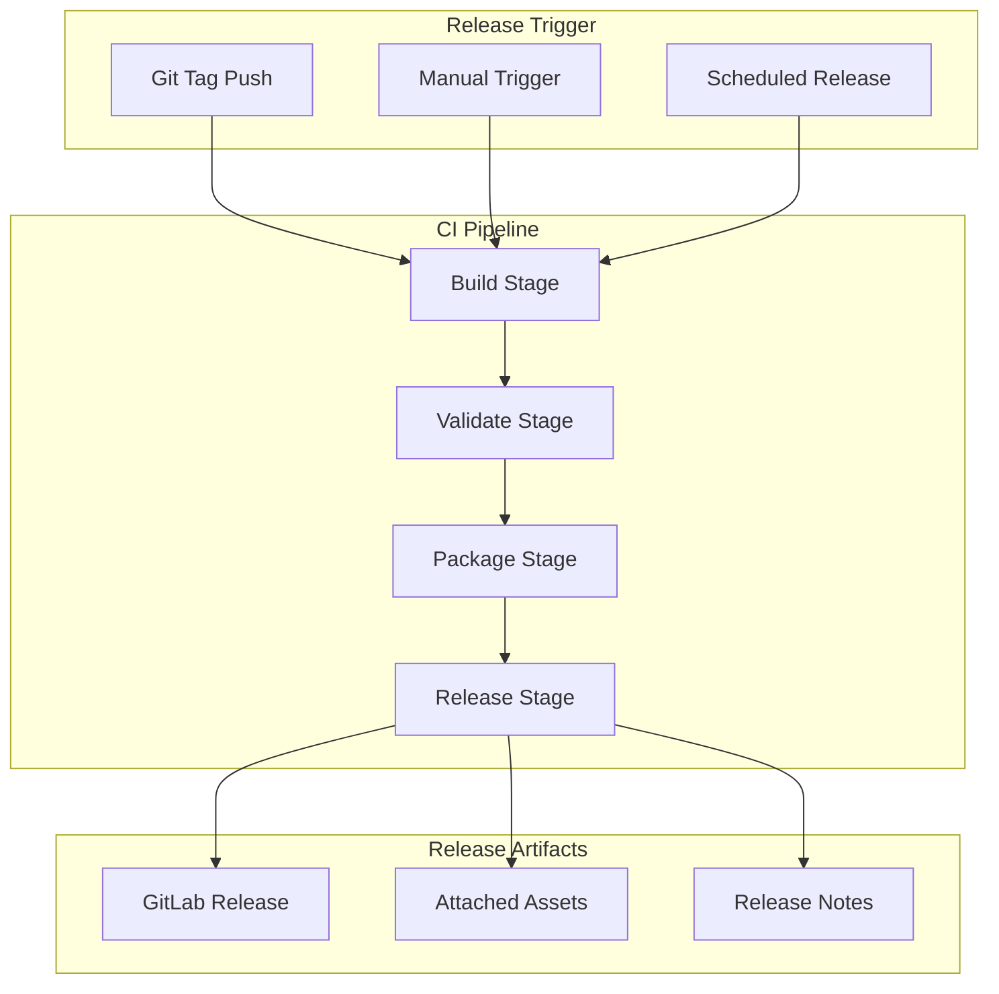
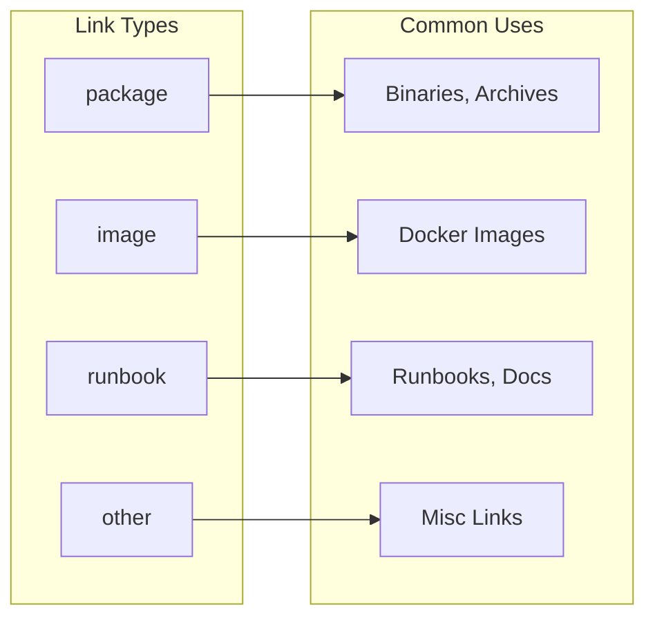
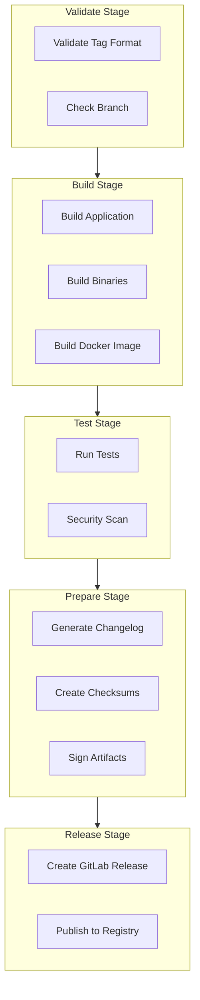

# How to Configure GitLab CI for Release Jobs

Author: [nawazdhandala](https://www.github.com/nawazdhandala)

Tags: GitLab CI, Release Jobs, CI/CD, DevOps, Versioning, Deployment

Description: Learn how to configure release jobs in GitLab CI with proper job settings, environment variables, conditional rules, and advanced configuration patterns for automated software releases.

---

Release jobs in GitLab CI automate the process of creating tagged releases with artifacts, changelogs, and distribution assets. Proper configuration ensures reliable, repeatable releases that your team can trust. Many teams struggle with release job configuration because the documentation is scattered and the options are numerous. Let me walk you through a systematic approach to configuring release jobs that actually work in production.

---

## Release Job Architecture

Before diving into configuration, understanding how release jobs fit into your pipeline helps with design decisions.



---

## Basic Release Job Configuration

Every release job needs the release-cli tool and proper job configuration.

The following configuration creates a minimal release job that triggers on tag pushes. Notice that the `release` keyword handles the heavy lifting while the script section prepares any necessary data.

```yaml
# .gitlab-ci.yml - Basic release job configuration
# The release-cli image includes all tools needed for creating releases
stages:
  - build
  - release

# Build job creates artifacts that the release job will reference
build:
  stage: build
  image: node:20
  script:
    - npm ci
    - npm run build
  artifacts:
    paths:
      - dist/
    expire_in: 1 day

# Release job configuration with all required elements
create-release:
  stage: release
  # Official release-cli image from GitLab
  image: registry.gitlab.com/gitlab-org/release-cli:latest
  # Script section is required even if empty
  script:
    - echo "Preparing release for tag ${CI_COMMIT_TAG}"
  # The release keyword defines what gets created
  release:
    tag_name: ${CI_COMMIT_TAG}
    name: "Release ${CI_COMMIT_TAG}"
    description: "Automated release created from CI pipeline"
  # Only run when a tag is pushed
  rules:
    - if: $CI_COMMIT_TAG
```

---

## Configuring Release Descriptions

Release descriptions support multiple input methods. You can hardcode text, read from a file, or generate content dynamically.

### Static Description

For simple projects where release notes follow a template pattern.

```yaml
# Static description with markdown formatting
create-release:
  stage: release
  image: registry.gitlab.com/gitlab-org/release-cli:latest
  script:
    - echo "Creating release"
  release:
    tag_name: ${CI_COMMIT_TAG}
    name: "Version ${CI_COMMIT_TAG}"
    # Multiline description with markdown
    description: |
      ## Installation

      ```bash
      npm install @myorg/package@${CI_COMMIT_TAG}
      ```

      ## Documentation

      See [docs](https://docs.example.com) for usage instructions.
  rules:
    - if: $CI_COMMIT_TAG
```

### File-Based Description

Reading from a file allows you to generate release notes during the pipeline. The release-cli reads the file content and uses it as the description.

```yaml
# Generate release notes in a previous job and read from file
generate-notes:
  stage: build
  image: node:20
  script:
    # Install changelog generator
    - npm install -g conventional-changelog-cli
    # Generate notes for current version only
    - conventional-changelog -p angular -r 1 -o RELEASE_NOTES.md
    # Verify content was generated
    - cat RELEASE_NOTES.md
  artifacts:
    paths:
      - RELEASE_NOTES.md
  rules:
    - if: $CI_COMMIT_TAG

create-release:
  stage: release
  image: registry.gitlab.com/gitlab-org/release-cli:latest
  script:
    - echo "Creating release from notes file"
  release:
    tag_name: ${CI_COMMIT_TAG}
    name: "Release ${CI_COMMIT_TAG}"
    # File path reference - release-cli reads this file
    description: "./RELEASE_NOTES.md"
  needs:
    - generate-notes
  rules:
    - if: $CI_COMMIT_TAG
```

### Dynamic Description Generation

For maximum flexibility, generate the description content in the script section and write it to a file.

```yaml
# Dynamic release notes from git history
create-release:
  stage: release
  image: registry.gitlab.com/gitlab-org/release-cli:latest
  script:
    # Get the previous tag for comparison
    - |
      PREV_TAG=$(git describe --tags --abbrev=0 HEAD^ 2>/dev/null || echo "")
      echo "Previous tag: ${PREV_TAG:-none}"

    # Generate commit list since previous tag
    - |
      if [ -n "$PREV_TAG" ]; then
        COMMITS=$(git log ${PREV_TAG}..HEAD --pretty=format:"- %s (%h)" --no-merges)
      else
        COMMITS=$(git log --pretty=format:"- %s (%h)" --no-merges -20)
      fi

    # Write structured release notes
    - |
      cat > release_notes.md << EOF
      ## What Changed in ${CI_COMMIT_TAG}

      ${COMMITS}

      ## Contributors

      $(git log ${PREV_TAG:-HEAD~20}..HEAD --format="%aN" | sort -u | sed 's/^/- /')

      ## Full Changelog

      Compare: [${PREV_TAG:-initial}...${CI_COMMIT_TAG}](${CI_PROJECT_URL}/-/compare/${PREV_TAG:-main}...${CI_COMMIT_TAG})
      EOF

    - cat release_notes.md
  release:
    tag_name: ${CI_COMMIT_TAG}
    name: "Release ${CI_COMMIT_TAG}"
    description: "./release_notes.md"
  rules:
    - if: $CI_COMMIT_TAG
```

---

## Asset Configuration

Release assets link downloadable files to your release. GitLab supports several asset types and link configurations.

### Asset Link Types

Each asset link requires a name, URL, and optionally a link type and filepath.



### Configuring Multiple Assets

Link build artifacts and external resources to your release. The `filepath` option creates a clean download URL.

```yaml
# Build job creates multiple artifacts
build-binaries:
  stage: build
  script:
    # Build for multiple platforms
    - GOOS=linux GOARCH=amd64 go build -o dist/app-linux-amd64
    - GOOS=darwin GOARCH=amd64 go build -o dist/app-darwin-amd64
    - GOOS=darwin GOARCH=arm64 go build -o dist/app-darwin-arm64
    - GOOS=windows GOARCH=amd64 go build -o dist/app-windows-amd64.exe

    # Create compressed archives
    - cd dist
    - tar -czvf app-linux-amd64.tar.gz app-linux-amd64
    - tar -czvf app-darwin-amd64.tar.gz app-darwin-amd64
    - tar -czvf app-darwin-arm64.tar.gz app-darwin-arm64
    - zip app-windows-amd64.zip app-windows-amd64.exe

    # Generate checksums for verification
    - sha256sum *.tar.gz *.zip > checksums.txt
  artifacts:
    paths:
      - dist/*.tar.gz
      - dist/*.zip
      - dist/checksums.txt
  rules:
    - if: $CI_COMMIT_TAG

# Release job with comprehensive asset configuration
create-release:
  stage: release
  image: registry.gitlab.com/gitlab-org/release-cli:latest
  script:
    - echo "Creating release with ${CI_COMMIT_TAG} assets"
  release:
    tag_name: ${CI_COMMIT_TAG}
    name: "Release ${CI_COMMIT_TAG}"
    description: "Production release with multi-platform binaries"
    assets:
      links:
        # Linux binary - package type for downloadable artifacts
        - name: "Linux AMD64"
          url: "${CI_PROJECT_URL}/-/jobs/artifacts/${CI_COMMIT_TAG}/raw/dist/app-linux-amd64.tar.gz?job=build-binaries"
          link_type: package
          # filepath creates a clean direct download URL
          filepath: "/binaries/app-linux-amd64.tar.gz"

        # macOS binaries for both Intel and Apple Silicon
        - name: "macOS AMD64 (Intel)"
          url: "${CI_PROJECT_URL}/-/jobs/artifacts/${CI_COMMIT_TAG}/raw/dist/app-darwin-amd64.tar.gz?job=build-binaries"
          link_type: package
          filepath: "/binaries/app-darwin-amd64.tar.gz"

        - name: "macOS ARM64 (Apple Silicon)"
          url: "${CI_PROJECT_URL}/-/jobs/artifacts/${CI_COMMIT_TAG}/raw/dist/app-darwin-arm64.tar.gz?job=build-binaries"
          link_type: package
          filepath: "/binaries/app-darwin-arm64.tar.gz"

        # Windows binary
        - name: "Windows AMD64"
          url: "${CI_PROJECT_URL}/-/jobs/artifacts/${CI_COMMIT_TAG}/raw/dist/app-windows-amd64.zip?job=build-binaries"
          link_type: package
          filepath: "/binaries/app-windows-amd64.zip"

        # Checksums for verification
        - name: "SHA256 Checksums"
          url: "${CI_PROJECT_URL}/-/jobs/artifacts/${CI_COMMIT_TAG}/raw/dist/checksums.txt?job=build-binaries"
          link_type: other
          filepath: "/checksums.txt"

        # Docker image link
        - name: "Docker Image"
          url: "https://hub.docker.com/r/myorg/myapp/tags?name=${CI_COMMIT_TAG}"
          link_type: image

        # Documentation link
        - name: "Documentation"
          url: "https://docs.example.com/releases/${CI_COMMIT_TAG}"
          link_type: runbook
  needs:
    - build-binaries
  rules:
    - if: $CI_COMMIT_TAG
```

---

## Conditional Release Rules

Sophisticated release pipelines need fine-grained control over when releases are created.

### Tag Pattern Matching

Different tag patterns can trigger different release configurations.

```yaml
# Production release - only for semantic version tags
release-production:
  stage: release
  image: registry.gitlab.com/gitlab-org/release-cli:latest
  script:
    - echo "Creating production release"
  release:
    tag_name: ${CI_COMMIT_TAG}
    name: "Production Release ${CI_COMMIT_TAG}"
    description: "Stable production release"
  rules:
    # Match semantic versioning: v1.0.0, v2.1.3, etc.
    - if: $CI_COMMIT_TAG =~ /^v[0-9]+\.[0-9]+\.[0-9]+$/

# Pre-release - for alpha, beta, and release candidates
release-prerelease:
  stage: release
  image: registry.gitlab.com/gitlab-org/release-cli:latest
  script:
    - echo "Creating pre-release"
  release:
    tag_name: ${CI_COMMIT_TAG}
    name: "Pre-release ${CI_COMMIT_TAG}"
    description: |
      **Pre-release version - not recommended for production use**

      Testing and feedback welcome.
  rules:
    # Match pre-release tags: v1.0.0-alpha.1, v2.0.0-beta.2, v3.0.0-rc.1
    - if: $CI_COMMIT_TAG =~ /^v[0-9]+\.[0-9]+\.[0-9]+-(alpha|beta|rc)\.[0-9]+$/
```

### Branch-Based Releases

Create releases from specific branches with appropriate conditions.

```yaml
# Release from main branch only
release-main:
  stage: release
  image: registry.gitlab.com/gitlab-org/release-cli:latest
  script:
    - echo "Releasing from main branch"
  release:
    tag_name: ${CI_COMMIT_TAG}
    name: "Release ${CI_COMMIT_TAG}"
    description: "Official release from main branch"
    # Explicitly reference the commit
    ref: ${CI_COMMIT_SHA}
  rules:
    # Tag must be pushed and commit must be on main
    - if: $CI_COMMIT_TAG && $CI_COMMIT_BRANCH == "main"

# Hotfix releases from release branches
release-hotfix:
  stage: release
  image: registry.gitlab.com/gitlab-org/release-cli:latest
  script:
    - echo "Creating hotfix release"
  release:
    tag_name: ${CI_COMMIT_TAG}
    name: "Hotfix ${CI_COMMIT_TAG}"
    description: |
      Hotfix release from ${CI_COMMIT_BRANCH}

      Contains critical bug fixes only.
  rules:
    # Match release branches: release/1.x, release/2.x
    - if: $CI_COMMIT_TAG && $CI_COMMIT_BRANCH =~ /^release\//
```

---

## Environment Variables for Release Jobs

Proper variable configuration makes release jobs flexible and maintainable.

### Essential Variables

```yaml
# Define variables at multiple levels for flexibility
variables:
  # Global defaults
  RELEASE_REGISTRY: "registry.example.com"
  RELEASE_ORG: "myorg"

create-release:
  stage: release
  image: registry.gitlab.com/gitlab-org/release-cli:latest
  variables:
    # Job-specific overrides
    RELEASE_CLI_DEBUG: "true"  # Enable debug output
  script:
    # Access predefined CI variables
    - echo "Project: ${CI_PROJECT_NAME}"
    - echo "Tag: ${CI_COMMIT_TAG}"
    - echo "Commit: ${CI_COMMIT_SHA}"
    - echo "Pipeline: ${CI_PIPELINE_ID}"

    # Build asset URLs using variables
    - |
      export ASSET_BASE="${CI_PROJECT_URL}/-/jobs/artifacts/${CI_COMMIT_TAG}"
      echo "Asset base URL: ${ASSET_BASE}"
  release:
    tag_name: ${CI_COMMIT_TAG}
    name: "Release ${CI_COMMIT_TAG}"
    description: "Release for ${CI_PROJECT_NAME}"
  rules:
    - if: $CI_COMMIT_TAG
```

### Protected Variables for Signing

Configure signing keys and credentials as protected variables in GitLab UI.

```yaml
# Release with GPG signing
create-signed-release:
  stage: release
  image: registry.gitlab.com/gitlab-org/release-cli:latest
  before_script:
    # Import GPG key from protected variable
    - |
      if [ -n "$GPG_PRIVATE_KEY" ]; then
        echo "$GPG_PRIVATE_KEY" | gpg --batch --import
        echo "GPG key imported"
      fi
  script:
    # Sign release artifacts
    - |
      for file in dist/*.tar.gz; do
        gpg --batch --yes --detach-sign --armor "$file"
        echo "Signed: $file"
      done
  release:
    tag_name: ${CI_COMMIT_TAG}
    name: "Signed Release ${CI_COMMIT_TAG}"
    description: |
      Cryptographically signed release.

      Verify with: `gpg --verify <file>.asc <file>`
  rules:
    - if: $CI_COMMIT_TAG
```

---

## Milestone Integration

Link releases to GitLab milestones for project management integration.

```yaml
# Release linked to milestone
create-release:
  stage: release
  image: registry.gitlab.com/gitlab-org/release-cli:latest
  script:
    - echo "Creating release linked to milestone"
  release:
    tag_name: ${CI_COMMIT_TAG}
    name: "Release ${CI_COMMIT_TAG}"
    description: |
      See the milestone for included issues and merge requests.
    # Link to milestones with matching names
    milestones:
      - ${CI_COMMIT_TAG}
      # Can include multiple milestones
      - "Q1 2026"
  rules:
    - if: $CI_COMMIT_TAG
```

---

## Release Timing Configuration

Control when releases are created and published.

```yaml
# Scheduled release with specific timestamp
create-release:
  stage: release
  image: registry.gitlab.com/gitlab-org/release-cli:latest
  script:
    - echo "Creating scheduled release"
  release:
    tag_name: ${CI_COMMIT_TAG}
    name: "Release ${CI_COMMIT_TAG}"
    description: "Scheduled release"
    # Use commit timestamp as release date
    released_at: ${CI_COMMIT_TIMESTAMP}
  rules:
    - if: $CI_COMMIT_TAG

# Future-dated release (for coordinated launches)
create-future-release:
  stage: release
  image: registry.gitlab.com/gitlab-org/release-cli:latest
  script:
    # Calculate release date (next Monday at noon UTC)
    - |
      RELEASE_DATE=$(date -d "next monday 12:00" --utc +%Y-%m-%dT%H:%M:%SZ)
      echo "RELEASE_DATE=${RELEASE_DATE}" >> release.env
      echo "Release scheduled for: ${RELEASE_DATE}"
  artifacts:
    reports:
      dotenv: release.env
  release:
    tag_name: ${CI_COMMIT_TAG}
    name: "Release ${CI_COMMIT_TAG}"
    description: "Scheduled release"
    released_at: ${RELEASE_DATE}
  rules:
    - if: $CI_COMMIT_TAG =~ /^v.*-scheduled$/
```

---

## Complete Production Configuration

Here is a comprehensive release pipeline configuration suitable for production use.



```yaml
# Complete production release pipeline
# Save as .gitlab-ci.yml in your repository root

stages:
  - validate
  - build
  - test
  - prepare
  - release
  - notify

variables:
  PACKAGE_NAME: myapp
  REGISTRY_URL: registry.example.com

# Reusable configuration for release jobs
.release-base:
  image: registry.gitlab.com/gitlab-org/release-cli:latest
  rules:
    - if: $CI_COMMIT_TAG =~ /^v[0-9]+\.[0-9]+\.[0-9]+/

# Validate tag format before proceeding
validate-tag:
  stage: validate
  image: alpine:latest
  script:
    # Enforce semantic versioning
    - |
      if ! echo "${CI_COMMIT_TAG}" | grep -qE '^v[0-9]+\.[0-9]+\.[0-9]+(-[a-zA-Z0-9.]+)?$'; then
        echo "Error: Tag must follow semantic versioning (v1.2.3 or v1.2.3-rc.1)"
        exit 1
      fi
      echo "Tag format valid: ${CI_COMMIT_TAG}"

    # Extract version components for later use
    - |
      VERSION=${CI_COMMIT_TAG#v}
      MAJOR=$(echo $VERSION | cut -d. -f1)
      MINOR=$(echo $VERSION | cut -d. -f2)
      PATCH=$(echo $VERSION | cut -d. -f3 | cut -d- -f1)
      echo "VERSION=${VERSION}" >> version.env
      echo "MAJOR=${MAJOR}" >> version.env
      echo "MINOR=${MINOR}" >> version.env
      echo "PATCH=${PATCH}" >> version.env
  artifacts:
    reports:
      dotenv: version.env
  rules:
    - if: $CI_COMMIT_TAG

# Build application for distribution
build-app:
  stage: build
  image: node:20
  needs:
    - validate-tag
  script:
    - npm ci
    - npm run build
    - npm run package
  artifacts:
    paths:
      - dist/
      - package/
    expire_in: 1 week
  rules:
    - if: $CI_COMMIT_TAG

# Build platform-specific binaries
build-binaries:
  stage: build
  image: golang:1.22
  needs:
    - validate-tag
  parallel:
    matrix:
      - GOOS: linux
        GOARCH: [amd64, arm64]
      - GOOS: darwin
        GOARCH: [amd64, arm64]
      - GOOS: windows
        GOARCH: amd64
  script:
    # Build binary with embedded version info
    - |
      OUTPUT="${PACKAGE_NAME}-${GOOS}-${GOARCH}"
      if [ "${GOOS}" = "windows" ]; then
        OUTPUT="${OUTPUT}.exe"
      fi

      CGO_ENABLED=0 go build \
        -ldflags "-s -w -X main.Version=${VERSION}" \
        -o "binaries/${OUTPUT}"

      echo "Built: binaries/${OUTPUT}"
  artifacts:
    paths:
      - binaries/
    expire_in: 1 week
  rules:
    - if: $CI_COMMIT_TAG

# Build and push Docker image
build-docker:
  stage: build
  image: docker:24
  services:
    - docker:24-dind
  variables:
    DOCKER_TLS_CERTDIR: "/certs"
  needs:
    - validate-tag
    - build-app
  before_script:
    - docker login -u $CI_REGISTRY_USER -p $CI_REGISTRY_PASSWORD $CI_REGISTRY
  script:
    # Build with metadata labels
    - |
      docker build \
        --label "org.opencontainers.image.version=${VERSION}" \
        --label "org.opencontainers.image.revision=${CI_COMMIT_SHA}" \
        --label "org.opencontainers.image.created=$(date -u +%Y-%m-%dT%H:%M:%SZ)" \
        -t ${CI_REGISTRY_IMAGE}:${CI_COMMIT_TAG} \
        -t ${CI_REGISTRY_IMAGE}:latest \
        .

    - docker push ${CI_REGISTRY_IMAGE}:${CI_COMMIT_TAG}
    - docker push ${CI_REGISTRY_IMAGE}:latest
  rules:
    - if: $CI_COMMIT_TAG

# Run tests against built artifacts
test-release:
  stage: test
  image: node:20
  needs:
    - build-app
  script:
    - npm ci
    - npm run test:release
  rules:
    - if: $CI_COMMIT_TAG

# Security scan on Docker image
security-scan:
  stage: test
  image: docker:24
  services:
    - docker:24-dind
  variables:
    DOCKER_TLS_CERTDIR: "/certs"
  needs:
    - build-docker
  before_script:
    - docker login -u $CI_REGISTRY_USER -p $CI_REGISTRY_PASSWORD $CI_REGISTRY
    - apk add --no-cache curl
    - curl -sfL https://raw.githubusercontent.com/aquasecurity/trivy/main/contrib/install.sh | sh -s -- -b /usr/local/bin
  script:
    - trivy image --exit-code 0 --severity HIGH,CRITICAL ${CI_REGISTRY_IMAGE}:${CI_COMMIT_TAG}
  allow_failure: true
  rules:
    - if: $CI_COMMIT_TAG

# Generate changelog from commits
generate-changelog:
  stage: prepare
  image: node:20
  needs:
    - validate-tag
  script:
    - npm install -g conventional-changelog-cli

    # Generate changelog
    - conventional-changelog -p angular -r 1 -o CHANGELOG_ENTRY.md

    # Get previous tag for comparison link
    - |
      PREV_TAG=$(git describe --tags --abbrev=0 HEAD^ 2>/dev/null || echo "")

      cat > RELEASE_NOTES.md << EOF
      $(cat CHANGELOG_ENTRY.md)

      ## Installation

      ### npm
      \`\`\`bash
      npm install @myorg/${PACKAGE_NAME}@${VERSION}
      \`\`\`

      ### Docker
      \`\`\`bash
      docker pull ${CI_REGISTRY_IMAGE}:${CI_COMMIT_TAG}
      \`\`\`

      ### Binary
      Download the appropriate binary for your platform from the assets below.

      ## Verification

      All release artifacts include SHA256 checksums. Verify your download:
      \`\`\`bash
      sha256sum -c checksums.txt
      \`\`\`

      ## Links

      - [Full Changelog](${CI_PROJECT_URL}/-/compare/${PREV_TAG:-main}...${CI_COMMIT_TAG})
      - [Documentation](https://docs.example.com/releases/${VERSION})
      EOF

    - cat RELEASE_NOTES.md
  artifacts:
    paths:
      - RELEASE_NOTES.md
  rules:
    - if: $CI_COMMIT_TAG

# Create checksums and package binaries
package-binaries:
  stage: prepare
  image: alpine:latest
  needs:
    - build-binaries
  script:
    - apk add --no-cache zip tar

    # Create archives for each binary
    - |
      cd binaries
      for file in ${PACKAGE_NAME}-*; do
        if [[ "$file" == *.exe ]]; then
          zip "${file%.exe}.zip" "$file"
        else
          tar -czvf "${file}.tar.gz" "$file"
        fi
      done

    # Generate checksums
    - sha256sum *.tar.gz *.zip > checksums.txt
    - cat checksums.txt
  artifacts:
    paths:
      - binaries/*.tar.gz
      - binaries/*.zip
      - binaries/checksums.txt
  rules:
    - if: $CI_COMMIT_TAG

# Create the GitLab release
create-release:
  stage: release
  extends: .release-base
  needs:
    - validate-tag
    - test-release
    - generate-changelog
    - package-binaries
    - build-docker
  script:
    - echo "Creating release ${CI_COMMIT_TAG}"
    - echo "Version: ${VERSION}"
  release:
    tag_name: ${CI_COMMIT_TAG}
    name: "Release ${CI_COMMIT_TAG}"
    description: "./RELEASE_NOTES.md"
    assets:
      links:
        - name: "Linux AMD64"
          url: "${CI_PROJECT_URL}/-/jobs/artifacts/${CI_COMMIT_TAG}/raw/binaries/${PACKAGE_NAME}-linux-amd64.tar.gz?job=package-binaries"
          link_type: package
          filepath: "/downloads/${PACKAGE_NAME}-linux-amd64.tar.gz"

        - name: "Linux ARM64"
          url: "${CI_PROJECT_URL}/-/jobs/artifacts/${CI_COMMIT_TAG}/raw/binaries/${PACKAGE_NAME}-linux-arm64.tar.gz?job=package-binaries"
          link_type: package
          filepath: "/downloads/${PACKAGE_NAME}-linux-arm64.tar.gz"

        - name: "macOS AMD64"
          url: "${CI_PROJECT_URL}/-/jobs/artifacts/${CI_COMMIT_TAG}/raw/binaries/${PACKAGE_NAME}-darwin-amd64.tar.gz?job=package-binaries"
          link_type: package
          filepath: "/downloads/${PACKAGE_NAME}-darwin-amd64.tar.gz"

        - name: "macOS ARM64"
          url: "${CI_PROJECT_URL}/-/jobs/artifacts/${CI_COMMIT_TAG}/raw/binaries/${PACKAGE_NAME}-darwin-arm64.tar.gz?job=package-binaries"
          link_type: package
          filepath: "/downloads/${PACKAGE_NAME}-darwin-arm64.tar.gz"

        - name: "Windows AMD64"
          url: "${CI_PROJECT_URL}/-/jobs/artifacts/${CI_COMMIT_TAG}/raw/binaries/${PACKAGE_NAME}-windows-amd64.zip?job=package-binaries"
          link_type: package
          filepath: "/downloads/${PACKAGE_NAME}-windows-amd64.zip"

        - name: "Checksums"
          url: "${CI_PROJECT_URL}/-/jobs/artifacts/${CI_COMMIT_TAG}/raw/binaries/checksums.txt?job=package-binaries"
          link_type: other
          filepath: "/downloads/checksums.txt"

        - name: "Docker Image"
          url: "${CI_REGISTRY_IMAGE}:${CI_COMMIT_TAG}"
          link_type: image

# Notify team of successful release
notify-release:
  stage: notify
  image: alpine:latest
  needs:
    - create-release
  before_script:
    - apk add --no-cache curl
  script:
    # Slack notification
    - |
      if [ -n "$SLACK_WEBHOOK_URL" ]; then
        curl -X POST -H 'Content-type: application/json' \
          --data "{
            \"text\": \"New Release: ${CI_COMMIT_TAG}\",
            \"blocks\": [
              {
                \"type\": \"section\",
                \"text\": {
                  \"type\": \"mrkdwn\",
                  \"text\": \"*${PACKAGE_NAME} ${CI_COMMIT_TAG}* has been released!\"
                }
              },
              {
                \"type\": \"section\",
                \"text\": {
                  \"type\": \"mrkdwn\",
                  \"text\": \"<${CI_PROJECT_URL}/-/releases/${CI_COMMIT_TAG}|View Release>\"
                }
              }
            ]
          }" \
          ${SLACK_WEBHOOK_URL}
      fi
  rules:
    - if: $CI_COMMIT_TAG
  allow_failure: true
```

---

## Troubleshooting Release Jobs

Common issues and their solutions when configuring release jobs.

### Release Not Created

Verify the release-cli image is available and the rules match your tag.

```yaml
# Debug release job configuration
debug-release:
  stage: release
  image: registry.gitlab.com/gitlab-org/release-cli:latest
  variables:
    RELEASE_CLI_DEBUG: "true"
  script:
    - echo "Tag: ${CI_COMMIT_TAG}"
    - echo "Branch: ${CI_COMMIT_BRANCH}"
    - echo "SHA: ${CI_COMMIT_SHA}"
    - release-cli --version

    # Test API connectivity
    - |
      curl --header "PRIVATE-TOKEN: ${CI_JOB_TOKEN}" \
        "${CI_API_V4_URL}/projects/${CI_PROJECT_ID}"
  release:
    tag_name: ${CI_COMMIT_TAG}
    name: "Debug Release"
    description: "Test release"
  rules:
    - if: $CI_COMMIT_TAG
```

### Asset URLs Not Working

Ensure artifact jobs have completed and URLs are correctly formatted.

```yaml
# Verify artifact URLs before release
verify-assets:
  stage: prepare
  image: alpine:latest
  needs:
    - build-binaries
  script:
    - apk add --no-cache curl

    # Test artifact URL
    - |
      ARTIFACT_URL="${CI_PROJECT_URL}/-/jobs/artifacts/${CI_COMMIT_TAG}/raw/binaries/app-linux-amd64.tar.gz?job=build-binaries"
      echo "Testing: ${ARTIFACT_URL}"

      HTTP_CODE=$(curl -s -o /dev/null -w "%{http_code}" \
        --header "PRIVATE-TOKEN: ${CI_JOB_TOKEN}" \
        "${ARTIFACT_URL}")

      if [ "$HTTP_CODE" != "200" ]; then
        echo "Warning: Artifact URL returned HTTP ${HTTP_CODE}"
      fi
  rules:
    - if: $CI_COMMIT_TAG
```

---

## Summary

Configuring GitLab CI release jobs requires attention to several key areas:

- Use the official release-cli image for consistent behavior
- Choose the right description method based on your changelog strategy
- Configure asset links with appropriate types and filepaths
- Apply conditional rules to control when releases are created
- Leverage environment variables for flexibility
- Integrate with milestones for project management visibility

Start with a basic configuration and add complexity as your release process matures. A simple, reliable release pipeline beats a complex one that nobody understands.

---

*Looking to monitor your release pipeline performance and track deployment health? [OneUptime](https://oneuptime.com) provides comprehensive CI/CD monitoring, helping you track release success rates and respond quickly when deployments encounter issues.*
