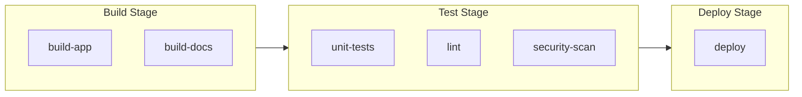
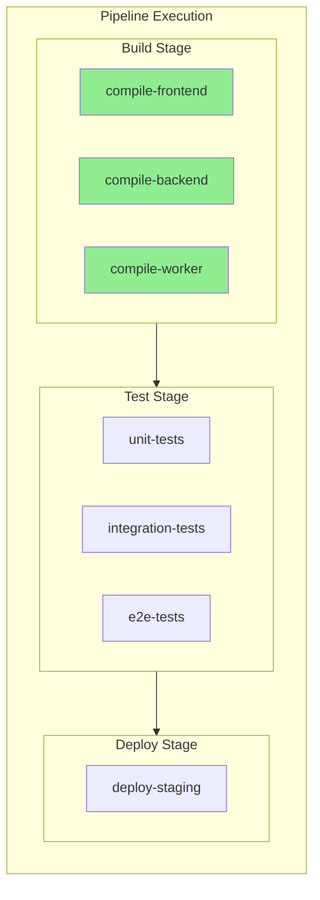
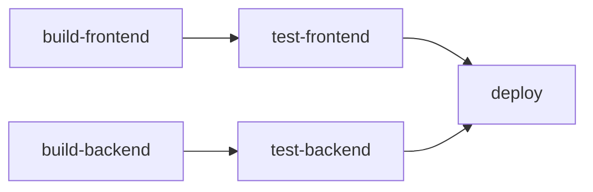
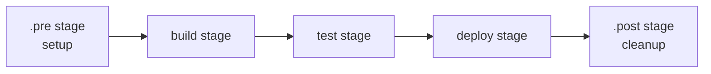
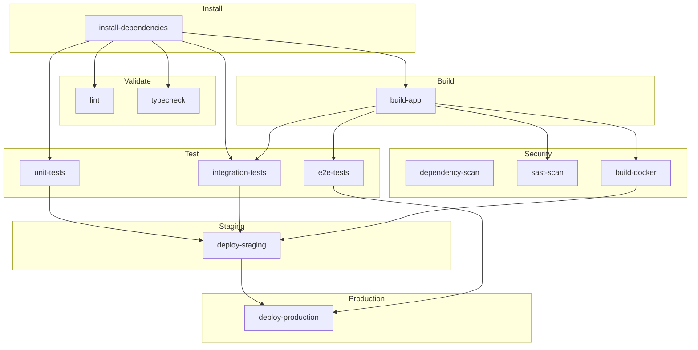

# How to Use Stages in GitLab CI

Author: [nawazdhandala](https://www.github.com/nawazdhandala)

Tags: GitLab CI, CI/CD, Stages, Pipelines, DevOps, Automation

Description: A practical guide to using stages in GitLab CI pipelines. Learn how to organize jobs into stages, control execution order, handle dependencies, and build efficient CI/CD workflows.

---

Stages are the backbone of any GitLab CI pipeline. They define the order in which your jobs execute and allow you to create logical groupings for build, test, and deploy phases. Getting stages right can mean the difference between a 5-minute pipeline and a 30-minute one.

---

## What Are Stages?

Stages in GitLab CI are sequential phases that group related jobs together. Each stage must complete before the next one begins, but jobs within the same stage run in parallel by default.



Think of stages as checkpoints in your delivery pipeline. Code cannot progress to the test stage until all build jobs succeed. Deployment cannot happen until all tests pass.

---

## Defining Stages

Declare your stages at the top of your `.gitlab-ci.yml` file using the `stages` keyword. The order you list them determines the execution order.

Below is a basic pipeline configuration showing how to define stages and assign jobs to them:

```yaml
# .gitlab-ci.yml
# Stages are defined in execution order
stages:
  - build
  - test
  - deploy

# Each job specifies which stage it belongs to
build-app:
  stage: build
  script:
    - echo "Building application..."
    - npm install
    - npm run build

run-tests:
  stage: test
  script:
    - echo "Running tests..."
    - npm test

deploy-app:
  stage: deploy
  script:
    - echo "Deploying to production..."
```

If you omit the `stages` keyword, GitLab uses five default stages in order: `.pre`, `build`, `test`, `deploy`, and `.post`.

---

## How Stage Execution Works

Understanding the execution model is crucial for designing efficient pipelines.



Key behaviors to understand:

1. Jobs in the same stage run in parallel (if runners are available)
2. A stage starts only after all jobs in the previous stage succeed
3. If any job fails, subsequent stages are skipped by default
4. Jobs without a `stage` key default to the `test` stage

---

## Stage Ordering and Custom Stages

You can create any number of custom stages with meaningful names. The names are arbitrary, but the order matters.

Here is an example with custom stages for a more complex deployment workflow:

```yaml
# Custom stages for a comprehensive pipeline
# Stages execute from top to bottom
stages:
  - validate      # Syntax checking, linting
  - build         # Compile code, build artifacts
  - unit-test     # Fast unit tests
  - integration   # Integration and API tests
  - security      # Security scans
  - staging       # Deploy to staging
  - acceptance    # End-to-end tests on staging
  - production    # Deploy to production

validate-syntax:
  stage: validate
  script:
    - yamllint .
    - shellcheck scripts/*.sh

build-application:
  stage: build
  script:
    - make build
  artifacts:
    paths:
      - dist/

run-unit-tests:
  stage: unit-test
  script:
    - make test-unit

run-integration:
  stage: integration
  script:
    - make test-integration

security-scan:
  stage: security
  script:
    - trivy filesystem .

deploy-staging:
  stage: staging
  script:
    - ./deploy.sh staging
  environment:
    name: staging

acceptance-tests:
  stage: acceptance
  script:
    - npm run test:e2e
  needs:
    - deploy-staging

deploy-production:
  stage: production
  script:
    - ./deploy.sh production
  environment:
    name: production
  when: manual
```

---

## Parallel Jobs Within Stages

Running jobs in parallel within a stage significantly reduces pipeline duration. GitLab automatically parallelizes jobs in the same stage when runners are available.

The following example demonstrates three test jobs running simultaneously in the test stage:

```yaml
stages:
  - build
  - test
  - deploy

# All three test jobs run at the same time
# Total test time = longest job, not sum of all jobs
test-unit:
  stage: test
  image: node:20
  script:
    - npm run test:unit
  # Runs in parallel with other test stage jobs

test-integration:
  stage: test
  image: node:20
  services:
    - postgres:15
  variables:
    POSTGRES_DB: testdb
    POSTGRES_USER: runner
    POSTGRES_PASSWORD: secret
  script:
    - npm run test:integration
  # Runs in parallel with other test stage jobs

test-e2e:
  stage: test
  image: cypress/browsers:latest
  script:
    - npm run test:e2e
  # Runs in parallel with other test stage jobs
```



```mermaid
gantt
    title Parallel Test Execution
    dateFormat X
    axisFormat %s

    section Test Stage
    test-unit       :0, 60
    test-integration:0, 90
    test-e2e        :0, 120
```

Without parallelization, these tests would take 270 seconds. Running in parallel, they complete in 120 seconds (the duration of the longest job).

---

## Controlling Job Dependencies with needs

By default, a job waits for all jobs in previous stages to complete. The `needs` keyword lets you create dependencies that bypass stage boundaries, enabling a Directed Acyclic Graph (DAG) execution model.

Using needs creates explicit dependencies and can dramatically speed up pipelines:

```yaml
stages:
  - build
  - test
  - deploy

# Build jobs run in parallel
build-frontend:
  stage: build
  script:
    - npm run build:frontend
  artifacts:
    paths:
      - frontend/dist/

build-backend:
  stage: build
  script:
    - npm run build:backend
  artifacts:
    paths:
      - backend/dist/

# Test frontend only needs frontend build to complete
# Does not wait for backend build
test-frontend:
  stage: test
  needs:
    - build-frontend
  script:
    - npm run test:frontend

# Test backend only needs backend build
test-backend:
  stage: test
  needs:
    - build-backend
  script:
    - npm run test:backend

# Deploy needs both tests to pass
deploy:
  stage: deploy
  needs:
    - test-frontend
    - test-backend
  script:
    - ./deploy.sh
```



With `needs`, the `test-frontend` job starts as soon as `build-frontend` finishes, without waiting for `build-backend`. The pipeline runs faster because independent paths execute concurrently.

---

## Special Stages: .pre and .post

GitLab provides two special stages that always run first and last, regardless of where you define them.

- `.pre` - Always runs before all other stages
- `.post` - Always runs after all other stages

These are useful for setup and cleanup operations:

```yaml
# .pre and .post are built-in special stages
stages:
  - build
  - test
  - deploy

# Runs before anything else
setup-environment:
  stage: .pre
  script:
    - echo "Setting up shared resources..."
    - ./setup-test-database.sh
    - ./warm-caches.sh

build:
  stage: build
  script:
    - npm run build

test:
  stage: test
  script:
    - npm test

deploy:
  stage: deploy
  script:
    - ./deploy.sh

# Runs after everything else, even if pipeline fails
cleanup:
  stage: .post
  script:
    - echo "Cleaning up resources..."
    - ./cleanup-test-database.sh
    - ./send-notifications.sh
  when: always  # Run even if pipeline fails
```



---

## Handling Stage Failures

When a job fails, GitLab skips all subsequent stages by default. You can customize this behavior in several ways.

### Allow Failures

Mark jobs as allowed to fail so they do not block the pipeline:

```yaml
stages:
  - test
  - deploy

# Critical tests must pass
unit-tests:
  stage: test
  script:
    - npm run test:unit

# Experimental tests can fail without blocking
experimental-tests:
  stage: test
  script:
    - npm run test:experimental
  allow_failure: true

# Deploy runs even if experimental-tests fails
# But only if unit-tests passes
deploy:
  stage: deploy
  script:
    - ./deploy.sh
```

### Continue on Failure with when: always

Run certain jobs regardless of previous failures:

```yaml
stages:
  - test
  - report
  - cleanup

run-tests:
  stage: test
  script:
    - npm test

# Generate report even if tests fail
generate-report:
  stage: report
  script:
    - ./generate-test-report.sh
  when: always
  artifacts:
    paths:
      - test-report.html

# Always clean up test resources
cleanup-resources:
  stage: cleanup
  script:
    - ./cleanup.sh
  when: always
```

---

## Conditional Stage Execution

Control which stages and jobs run based on conditions using `rules`.

The following example shows how to run different stages for different scenarios:

```yaml
stages:
  - test
  - build
  - deploy-staging
  - deploy-production

# Always run tests
run-tests:
  stage: test
  script:
    - npm test
  rules:
    - when: always

# Build on main branch and merge requests
build:
  stage: build
  script:
    - npm run build
  artifacts:
    paths:
      - dist/
  rules:
    - if: $CI_COMMIT_BRANCH == "main"
    - if: $CI_MERGE_REQUEST_IID

# Auto-deploy to staging on main
deploy-staging:
  stage: deploy-staging
  script:
    - ./deploy.sh staging
  environment:
    name: staging
    url: https://staging.example.com
  rules:
    - if: $CI_COMMIT_BRANCH == "main"

# Manual production deployment from main
deploy-production:
  stage: deploy-production
  script:
    - ./deploy.sh production
  environment:
    name: production
    url: https://example.com
  rules:
    - if: $CI_COMMIT_BRANCH == "main"
      when: manual
```

### Skip Stages Based on File Changes

Run stages only when relevant files change:

```yaml
stages:
  - test-backend
  - test-frontend
  - deploy

# Only test backend when backend files change
backend-tests:
  stage: test-backend
  script:
    - cd backend && npm test
  rules:
    - changes:
        - backend/**/*
        - package.json

# Only test frontend when frontend files change
frontend-tests:
  stage: test-frontend
  script:
    - cd frontend && npm test
  rules:
    - changes:
        - frontend/**/*
        - package.json
```

---

## Stage Templates and Reusability

Reduce duplication by creating templates that jobs in different stages can extend.

Here is a pattern for sharing configuration across stages:

```yaml
stages:
  - build
  - test
  - deploy

# Hidden template job (starts with a dot)
.node-template:
  image: node:20
  cache:
    key: ${CI_COMMIT_REF_SLUG}
    paths:
      - node_modules/
  before_script:
    - npm ci

# Build stage extends template
build:
  extends: .node-template
  stage: build
  script:
    - npm run build
  artifacts:
    paths:
      - dist/
    expire_in: 1 day

# Test stage extends same template
test:
  extends: .node-template
  stage: test
  script:
    - npm test
  coverage: '/Coverage: (\d+)%/'

# Deploy stage uses different base
deploy:
  stage: deploy
  image: alpine:latest
  script:
    - apk add --no-cache curl
    - ./deploy.sh
```

---

## Complete Multi-Stage Pipeline Example

Here is a production-ready pipeline demonstrating proper stage organization:

```yaml
# Complete multi-stage pipeline for a Node.js application
# Demonstrates stage ordering, parallel jobs, and conditional execution

stages:
  - install
  - validate
  - build
  - test
  - security
  - staging
  - production

variables:
  NODE_ENV: production
  npm_config_cache: "$CI_PROJECT_DIR/.npm"

# Shared configuration for Node.js jobs
.node-base:
  image: node:20-alpine
  cache:
    key:
      files:
        - package-lock.json
    paths:
      - .npm/

# Install dependencies once, share via artifacts
install-dependencies:
  extends: .node-base
  stage: install
  script:
    - npm ci --prefer-offline
  artifacts:
    paths:
      - node_modules/
    expire_in: 1 hour

# Validation stage runs linting and type checking in parallel
lint:
  extends: .node-base
  stage: validate
  needs:
    - install-dependencies
  script:
    - npm run lint

typecheck:
  extends: .node-base
  stage: validate
  needs:
    - install-dependencies
  script:
    - npm run typecheck

# Build stage
build-app:
  extends: .node-base
  stage: build
  needs:
    - install-dependencies
  script:
    - npm run build
  artifacts:
    paths:
      - dist/
    expire_in: 1 week

# Test stage runs all test types in parallel
unit-tests:
  extends: .node-base
  stage: test
  needs:
    - install-dependencies
  script:
    - npm run test:unit -- --coverage
  coverage: '/All files[^|]*\|[^|]*\s+([\d\.]+)/'
  artifacts:
    reports:
      junit: junit.xml
      coverage_report:
        coverage_format: cobertura
        path: coverage/cobertura-coverage.xml

integration-tests:
  extends: .node-base
  stage: test
  needs:
    - install-dependencies
    - build-app
  services:
    - name: postgres:15
      alias: db
    - name: redis:7
      alias: cache
  variables:
    POSTGRES_DB: test
    POSTGRES_USER: runner
    POSTGRES_PASSWORD: testpass
    DATABASE_URL: "postgresql://runner:testpass@db:5432/test"
    REDIS_URL: "redis://cache:6379"
  script:
    - npm run db:migrate
    - npm run test:integration

e2e-tests:
  stage: test
  image: cypress/browsers:node-20.9.0-chrome-118.0.5993.88-1-ff-118.0.2-edge-118.0.2088.46-1
  needs:
    - install-dependencies
    - build-app
  script:
    - npm run test:e2e
  artifacts:
    when: on_failure
    paths:
      - cypress/screenshots/
      - cypress/videos/
    expire_in: 1 day

# Security stage
dependency-scan:
  stage: security
  needs:
    - install-dependencies
  image: node:20-alpine
  script:
    - npm audit --audit-level=high
  allow_failure: true

sast-scan:
  stage: security
  needs:
    - build-app
  image: returntocorp/semgrep
  script:
    - semgrep --config=auto --error .
  allow_failure: true

# Build and push Docker image
build-docker:
  stage: security
  image: docker:24
  services:
    - docker:24-dind
  needs:
    - build-app
  variables:
    DOCKER_TLS_CERTDIR: "/certs"
  before_script:
    - docker login -u $CI_REGISTRY_USER -p $CI_REGISTRY_PASSWORD $CI_REGISTRY
  script:
    - docker build -t $CI_REGISTRY_IMAGE:$CI_COMMIT_SHA .
    - docker push $CI_REGISTRY_IMAGE:$CI_COMMIT_SHA
  rules:
    - if: $CI_COMMIT_BRANCH == "main"

# Staging deployment
deploy-staging:
  stage: staging
  image: alpine:latest
  needs:
    - unit-tests
    - integration-tests
    - build-docker
  before_script:
    - apk add --no-cache curl kubectl
  script:
    - kubectl set image deployment/app app=$CI_REGISTRY_IMAGE:$CI_COMMIT_SHA
  environment:
    name: staging
    url: https://staging.example.com
  rules:
    - if: $CI_COMMIT_BRANCH == "main"

# Production deployment with manual gate
deploy-production:
  stage: production
  image: alpine:latest
  needs:
    - deploy-staging
    - e2e-tests
  before_script:
    - apk add --no-cache curl kubectl
  script:
    - kubectl set image deployment/app app=$CI_REGISTRY_IMAGE:$CI_COMMIT_SHA --namespace=production
  environment:
    name: production
    url: https://example.com
  rules:
    - if: $CI_COMMIT_BRANCH == "main"
      when: manual
```



---

## Best Practices for Stage Design

Follow these guidelines when organizing your pipeline stages:

1. **Keep stages focused** - Each stage should have a clear purpose
2. **Minimize stage count** - More stages mean more sequential waiting
3. **Maximize parallelism** - Put independent jobs in the same stage
4. **Use needs wisely** - Break stage boundaries only when it speeds things up
5. **Fail fast** - Put quick validation checks early in the pipeline
6. **Group related jobs** - Tests that share setup should be in the same stage

### Stage Duration Analysis

| Stage Pattern | Jobs | Duration |
|---------------|------|----------|
| Sequential stages | 6 jobs in 6 stages | 18 min |
| Parallel in stages | 6 jobs in 3 stages | 9 min |
| DAG with needs | 6 jobs, optimized | 6 min |

---

## Troubleshooting Stage Issues

### Job Stuck in Pending

Jobs wait in pending when all previous stages have not completed. Check if an earlier job is still running or failed.

```yaml
# Debug by listing explicit dependencies
my-job:
  stage: deploy
  needs:
    - job: build
      artifacts: true
  script:
    - echo "Waiting for build artifacts..."
```

### Stage Running Out of Order

Verify your `stages` definition order matches your intended execution order:

```yaml
# Wrong: test will run before build
stages:
  - test
  - build

# Correct: build runs first
stages:
  - build
  - test
```

### Jobs Not Running in Parallel

Ensure you have enough runners available. Check runner tags match job requirements:

```yaml
# Both jobs need runners with 'docker' tag
job1:
  stage: test
  tags:
    - docker
  script: ./test1.sh

job2:
  stage: test
  tags:
    - docker
  script: ./test2.sh
```

---

## Summary

- Stages define sequential phases in your pipeline
- Jobs in the same stage run in parallel by default
- The `needs` keyword creates explicit dependencies for faster pipelines
- Use `.pre` and `.post` for setup and cleanup tasks
- Control execution with `rules`, `when`, and `allow_failure`
- Design stages to fail fast and maximize parallelism

Mastering stages is essential for building efficient CI/CD pipelines. Start with a simple three-stage pipeline (build, test, deploy) and expand as your project grows.

---

*Looking to monitor your GitLab CI pipelines and deployments? [OneUptime](https://oneuptime.com) provides comprehensive monitoring, alerting, and incident management to help you track pipeline health and respond quickly when deployments fail.*
