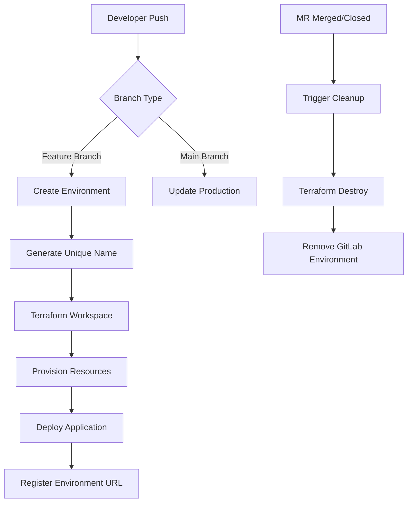
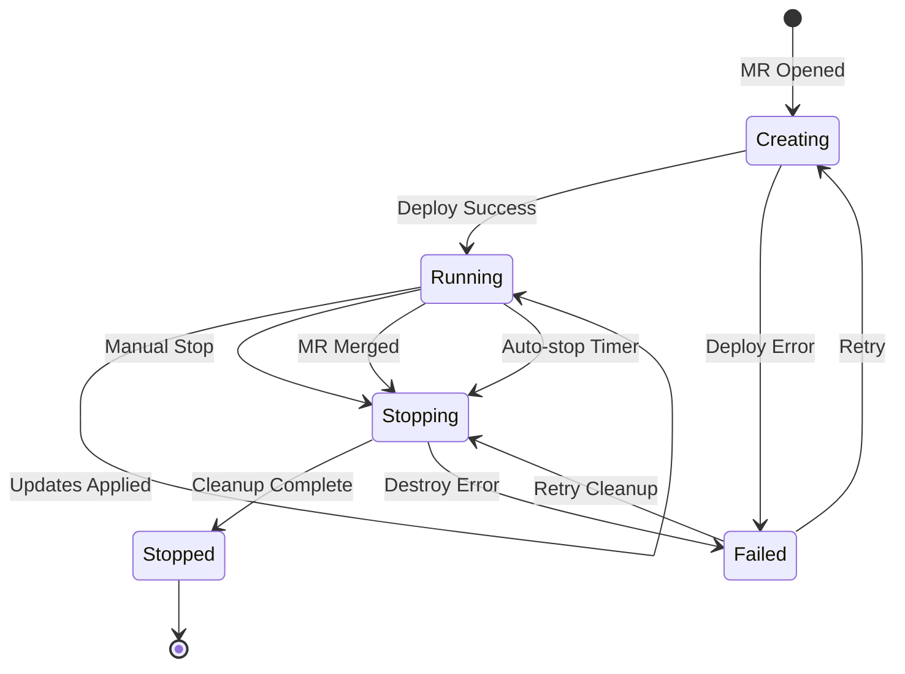
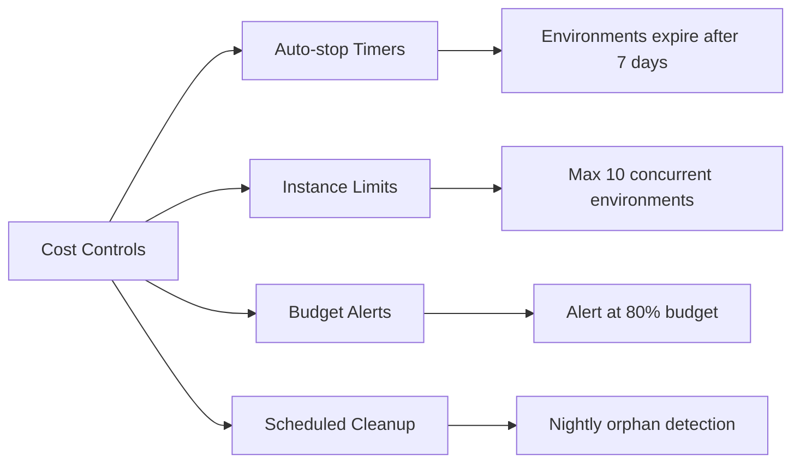

# How to Configure GitLab CI Dynamic Environments with Terraform

Author: [nawazdhandala](https://www.github.com/nawazdhandala)

Tags: GitLab CI, Terraform, Dynamic Environments, Review Apps, Infrastructure as Code, DevOps, Ephemeral Infrastructure

Description: Learn how to configure GitLab CI dynamic environments with Terraform for automatic feature branch infrastructure, review apps, and ephemeral test environments that spin up and tear down automatically.

---

Feature branches need their own infrastructure. When a developer opens a merge request, they should get a complete, isolated environment to test their changes. Manual environment provisioning creates bottlenecks and slows down development. Dynamic environments solve this by automatically creating infrastructure when branches are pushed and destroying it when branches are merged or deleted.

GitLab CI combined with Terraform makes dynamic environments practical. Each merge request triggers Terraform to provision dedicated infrastructure, and GitLab tracks these environments in its UI. When the merge request closes, a cleanup job destroys everything automatically. No orphaned resources, no manual intervention, no wasted cloud spend.

## Dynamic Environment Architecture

The system works by mapping GitLab CI environment features to Terraform workspaces and state files.



## Basic Dynamic Environment Pipeline

The following pipeline creates environments for feature branches and destroys them when branches are deleted.

```yaml
# .gitlab-ci.yml - Core dynamic environment pipeline
# Defines stages for the complete environment lifecycle including provisioning and cleanup

image:
  name: hashicorp/terraform:1.7
  entrypoint: [""]

stages:
  - validate
  - plan
  - deploy
  - cleanup

variables:
  # Base directory containing Terraform configurations
  TF_ROOT: ${CI_PROJECT_DIR}/terraform
  # Generate a unique environment name from the branch slug
  # The CI_ENVIRONMENT_SLUG is automatically sanitized by GitLab
  ENVIRONMENT_NAME: review-${CI_COMMIT_REF_SLUG}

# Cache Terraform providers to speed up subsequent runs
cache:
  key: terraform-${CI_COMMIT_REF_SLUG}
  paths:
    - ${TF_ROOT}/.terraform

# Initialize Terraform before each job
# Creates or selects a workspace matching the environment name
before_script:
  - cd ${TF_ROOT}
  - terraform init
  - terraform workspace select ${ENVIRONMENT_NAME} || terraform workspace new ${ENVIRONMENT_NAME}

validate:
  stage: validate
  script:
    - terraform validate
    - terraform fmt -check
  rules:
    - if: $CI_MERGE_REQUEST_IID

plan:
  stage: plan
  script:
    - terraform plan -var="environment=${ENVIRONMENT_NAME}" -out=tfplan
  artifacts:
    paths:
      - ${TF_ROOT}/tfplan
    expire_in: 1 day
  rules:
    - if: $CI_MERGE_REQUEST_IID

deploy:
  stage: deploy
  script:
    - terraform apply -auto-approve tfplan
    # Extract the environment URL from Terraform outputs
    - echo "DYNAMIC_ENVIRONMENT_URL=$(terraform output -raw environment_url)" >> deploy.env
  artifacts:
    reports:
      dotenv: deploy.env
  environment:
    name: review/${CI_COMMIT_REF_SLUG}
    url: $DYNAMIC_ENVIRONMENT_URL
    on_stop: cleanup
    auto_stop_in: 1 week
  rules:
    - if: $CI_MERGE_REQUEST_IID

cleanup:
  stage: cleanup
  variables:
    GIT_STRATEGY: none
  before_script:
    - cd ${TF_ROOT}
    - terraform init
    - terraform workspace select ${ENVIRONMENT_NAME}
  script:
    - terraform destroy -auto-approve -var="environment=${ENVIRONMENT_NAME}"
    - terraform workspace select default
    - terraform workspace delete ${ENVIRONMENT_NAME}
  environment:
    name: review/${CI_COMMIT_REF_SLUG}
    action: stop
  rules:
    - if: $CI_MERGE_REQUEST_IID
      when: manual
      allow_failure: true
```

## Terraform Configuration for Dynamic Resources

Your Terraform code needs to accept the environment name and create unique resources.

The configuration below provisions a complete environment with networking, compute, and a load balancer. Each resource uses the environment variable to ensure unique naming.

```hcl
# terraform/main.tf
# Dynamic environment infrastructure that creates isolated resources per branch

variable "environment" {
  description = "Environment name derived from GitLab branch slug"
  type        = string
}

variable "base_domain" {
  description = "Base domain for environment URLs"
  type        = string
  default     = "dev.example.com"
}

# Local values for consistent naming and tagging across resources
locals {
  # Sanitize environment name for DNS compatibility
  env_slug = replace(lower(var.environment), "/[^a-z0-9-]/", "-")

  common_tags = {
    Environment = var.environment
    ManagedBy   = "terraform"
    Project     = "review-apps"
    AutoDestroy = "true"
  }
}

# VPC for isolated networking per environment
resource "aws_vpc" "review" {
  cidr_block           = "10.0.0.0/16"
  enable_dns_hostnames = true
  enable_dns_support   = true

  tags = merge(local.common_tags, {
    Name = "vpc-${local.env_slug}"
  })
}

# Public subnet for load balancer and NAT gateway
resource "aws_subnet" "public" {
  vpc_id                  = aws_vpc.review.id
  cidr_block              = "10.0.1.0/24"
  availability_zone       = "us-east-1a"
  map_public_ip_on_launch = true

  tags = merge(local.common_tags, {
    Name = "subnet-public-${local.env_slug}"
  })
}

# Private subnet for application servers
resource "aws_subnet" "private" {
  vpc_id            = aws_vpc.review.id
  cidr_block        = "10.0.2.0/24"
  availability_zone = "us-east-1a"

  tags = merge(local.common_tags, {
    Name = "subnet-private-${local.env_slug}"
  })
}

# Internet gateway for public subnet access
resource "aws_internet_gateway" "review" {
  vpc_id = aws_vpc.review.id

  tags = merge(local.common_tags, {
    Name = "igw-${local.env_slug}"
  })
}

# Security group allowing HTTP/HTTPS traffic
resource "aws_security_group" "web" {
  name        = "sg-web-${local.env_slug}"
  description = "Web traffic for ${var.environment}"
  vpc_id      = aws_vpc.review.id

  ingress {
    from_port   = 80
    to_port     = 80
    protocol    = "tcp"
    cidr_blocks = ["0.0.0.0/0"]
  }

  ingress {
    from_port   = 443
    to_port     = 443
    protocol    = "tcp"
    cidr_blocks = ["0.0.0.0/0"]
  }

  egress {
    from_port   = 0
    to_port     = 0
    protocol    = "-1"
    cidr_blocks = ["0.0.0.0/0"]
  }

  tags = local.common_tags
}

# Application load balancer for the review environment
resource "aws_lb" "review" {
  name               = "alb-${local.env_slug}"
  internal           = false
  load_balancer_type = "application"
  security_groups    = [aws_security_group.web.id]
  subnets            = [aws_subnet.public.id]

  tags = local.common_tags
}

# DNS record pointing to the load balancer
resource "aws_route53_record" "review" {
  zone_id = data.aws_route53_zone.main.zone_id
  name    = "${local.env_slug}.${var.base_domain}"
  type    = "A"

  alias {
    name                   = aws_lb.review.dns_name
    zone_id                = aws_lb.review.zone_id
    evaluate_target_health = true
  }
}

# Output the environment URL for GitLab to display
output "environment_url" {
  description = "URL for accessing the review environment"
  value       = "https://${local.env_slug}.${var.base_domain}"
}
```

## State Management for Dynamic Environments

Each environment needs its own Terraform state. GitLab-managed state combined with workspace naming handles isolation automatically.

The backend configuration below stores state in GitLab with environment-specific addressing.

```hcl
# terraform/backend.tf
# Configure GitLab-managed Terraform state with per-environment isolation

terraform {
  backend "http" {
    # These values are populated by CI/CD variables
    # address, lock_address, and unlock_address are set via TF_HTTP_* environment variables
  }
}
```

Update your pipeline to configure the state backend dynamically.

```yaml
# Enhanced before_script with GitLab-managed state configuration
# Each environment gets its own isolated state file

variables:
  TF_ROOT: ${CI_PROJECT_DIR}/terraform
  ENVIRONMENT_NAME: review-${CI_COMMIT_REF_SLUG}
  # GitLab state configuration
  TF_STATE_NAME: ${ENVIRONMENT_NAME}
  TF_ADDRESS: ${CI_API_V4_URL}/projects/${CI_PROJECT_ID}/terraform/state/${TF_STATE_NAME}

before_script:
  - cd ${TF_ROOT}
  # Configure HTTP backend for GitLab-managed state
  - |
    export TF_HTTP_ADDRESS="${TF_ADDRESS}"
    export TF_HTTP_LOCK_ADDRESS="${TF_ADDRESS}/lock"
    export TF_HTTP_UNLOCK_ADDRESS="${TF_ADDRESS}/lock"
    export TF_HTTP_USERNAME="gitlab-ci-token"
    export TF_HTTP_PASSWORD="${CI_JOB_TOKEN}"
    export TF_HTTP_LOCK_METHOD="POST"
    export TF_HTTP_UNLOCK_METHOD="DELETE"
  - terraform init -reconfigure
```

## Environment Lifecycle Management

Dynamic environments follow a predictable lifecycle. Understanding each phase helps with debugging and optimization.



## Automatic Cleanup with Stop Actions

GitLab environments support automatic cleanup through the `on_stop` mechanism. When a merge request is merged or closed, GitLab can trigger the cleanup job automatically.

The following configuration ensures environments are destroyed when branches are deleted.

```yaml
# Cleanup job triggered automatically when environment stops
# Runs when MR is merged, closed, or auto-stop timer expires

stop_review:
  stage: cleanup
  variables:
    # Prevent Git checkout since branch may be deleted
    GIT_STRATEGY: none
  script:
    # Fetch Terraform configuration from main branch
    - git clone --depth 1 --branch main ${CI_PROJECT_URL}.git terraform-cleanup
    - cd terraform-cleanup/terraform
    # Initialize with the environment-specific state
    - |
      export TF_HTTP_ADDRESS="${TF_ADDRESS}"
      export TF_HTTP_LOCK_ADDRESS="${TF_ADDRESS}/lock"
      export TF_HTTP_UNLOCK_ADDRESS="${TF_ADDRESS}/lock"
      export TF_HTTP_USERNAME="gitlab-ci-token"
      export TF_HTTP_PASSWORD="${CI_JOB_TOKEN}"
      export TF_HTTP_LOCK_METHOD="POST"
      export TF_HTTP_UNLOCK_METHOD="DELETE"
    - terraform init
    # Destroy all resources in the environment
    - terraform destroy -auto-approve -var="environment=${ENVIRONMENT_NAME}"
  environment:
    name: review/${CI_COMMIT_REF_SLUG}
    action: stop
  rules:
    - if: $CI_MERGE_REQUEST_IID
      when: manual
      allow_failure: true
```

## Database and Persistent Storage

Review environments often need databases. Creating ephemeral databases for each environment ensures data isolation.

The Terraform module below provisions a dedicated RDS instance for each environment.

```hcl
# terraform/modules/review-database/main.tf
# Ephemeral database instance for review environments

variable "environment" {
  type = string
}

variable "vpc_id" {
  type = string
}

variable "subnet_ids" {
  type = list(string)
}

# Generate a random password for each environment database
resource "random_password" "db" {
  length  = 24
  special = false
}

# Store the password in AWS Secrets Manager
resource "aws_secretsmanager_secret" "db_password" {
  name = "review/${var.environment}/db-password"

  # Allow immediate deletion since these are ephemeral
  recovery_window_in_days = 0
}

resource "aws_secretsmanager_secret_version" "db_password" {
  secret_id     = aws_secretsmanager_secret.db_password.id
  secret_string = random_password.db.result
}

# Database subnet group for RDS placement
resource "aws_db_subnet_group" "review" {
  name       = "review-${var.environment}"
  subnet_ids = var.subnet_ids
}

# Small RDS instance suitable for review environments
resource "aws_db_instance" "review" {
  identifier     = "review-${var.environment}"
  engine         = "postgres"
  engine_version = "15"
  instance_class = "db.t3.micro"

  allocated_storage = 20
  storage_type      = "gp2"

  db_name  = "app"
  username = "review_admin"
  password = random_password.db.result

  db_subnet_group_name   = aws_db_subnet_group.review.name
  vpc_security_group_ids = [aws_security_group.db.id]

  # Skip final snapshot for ephemeral databases
  skip_final_snapshot = true

  # Allow deletion without explicit protection removal
  deletion_protection = false

  tags = {
    Environment = var.environment
    AutoDestroy = "true"
  }
}

# Security group for database access
resource "aws_security_group" "db" {
  name        = "review-db-${var.environment}"
  description = "Database access for ${var.environment}"
  vpc_id      = var.vpc_id

  ingress {
    from_port   = 5432
    to_port     = 5432
    protocol    = "tcp"
    cidr_blocks = ["10.0.0.0/16"]
  }
}

output "database_endpoint" {
  value = aws_db_instance.review.endpoint
}

output "database_secret_arn" {
  value = aws_secretsmanager_secret.db_password.arn
}
```

## Container Deployment to Dynamic Environments

Most review apps deploy containers. Integrating ECS or Kubernetes with your Terraform setup enables full application deployment.

The following job builds and deploys containers to the newly provisioned infrastructure.

```yaml
# Build and deploy application containers to the review environment
# Runs after Terraform provisions the infrastructure

build:
  stage: build
  image: docker:24
  services:
    - docker:24-dind
  variables:
    DOCKER_TLS_CERTDIR: "/certs"
  script:
    # Build with environment-specific tag
    - docker build -t ${CI_REGISTRY_IMAGE}:${CI_COMMIT_SHA} .
    - docker tag ${CI_REGISTRY_IMAGE}:${CI_COMMIT_SHA} ${CI_REGISTRY_IMAGE}:${CI_ENVIRONMENT_SLUG}
    # Push to GitLab Container Registry
    - docker login -u ${CI_REGISTRY_USER} -p ${CI_REGISTRY_PASSWORD} ${CI_REGISTRY}
    - docker push ${CI_REGISTRY_IMAGE}:${CI_COMMIT_SHA}
    - docker push ${CI_REGISTRY_IMAGE}:${CI_ENVIRONMENT_SLUG}
  rules:
    - if: $CI_MERGE_REQUEST_IID

deploy_app:
  stage: deploy
  needs:
    - job: build
    - job: terraform_apply
      artifacts: true
  image: amazon/aws-cli:2.15
  script:
    # Update ECS service with new container image
    - |
      aws ecs update-service \
        --cluster review-${CI_COMMIT_REF_SLUG} \
        --service app \
        --force-new-deployment \
        --desired-count 1
    # Wait for deployment to stabilize
    - |
      aws ecs wait services-stable \
        --cluster review-${CI_COMMIT_REF_SLUG} \
        --services app
  environment:
    name: review/${CI_COMMIT_REF_SLUG}
    url: $DYNAMIC_ENVIRONMENT_URL
    on_stop: stop_review
  rules:
    - if: $CI_MERGE_REQUEST_IID
```

## Cost Control Strategies

Dynamic environments can accumulate costs quickly. Implementing safeguards prevents runaway spending.



Add these controls to your pipeline configuration.

```yaml
# Cost control settings for dynamic environments
# Limits concurrent environments and enforces auto-expiration

variables:
  # Maximum number of concurrent review environments
  MAX_ENVIRONMENTS: "10"
  # Auto-stop environments after 7 days of inactivity
  AUTO_STOP_DURATION: "1 week"

# Pre-flight check to enforce environment limits
check_limits:
  stage: .pre
  image: curlimages/curl:8.5.0
  script:
    # Count active review environments
    - |
      ACTIVE_ENVS=$(curl -s --header "PRIVATE-TOKEN: ${GITLAB_API_TOKEN}" \
        "${CI_API_V4_URL}/projects/${CI_PROJECT_ID}/environments?states=available" \
        | jq '[.[] | select(.name | startswith("review/"))] | length')
    # Block deployment if limit reached
    - |
      if [ "$ACTIVE_ENVS" -ge "$MAX_ENVIRONMENTS" ]; then
        echo "Maximum environment limit reached ($ACTIVE_ENVS/$MAX_ENVIRONMENTS)"
        echo "Please close existing merge requests or wait for auto-cleanup"
        exit 1
      fi
  rules:
    - if: $CI_MERGE_REQUEST_IID
```

## Orphan Resource Cleanup

Sometimes environments fail to clean up properly. A scheduled job catches orphaned resources.

```yaml
# Scheduled job to clean up orphaned review environments
# Runs nightly to catch any resources that escaped normal cleanup

cleanup_orphans:
  stage: cleanup
  image:
    name: hashicorp/terraform:1.7
    entrypoint: [""]
  script:
    # List all Terraform states
    - |
      STATES=$(curl -s --header "PRIVATE-TOKEN: ${GITLAB_API_TOKEN}" \
        "${CI_API_V4_URL}/projects/${CI_PROJECT_ID}/terraform/state" \
        | jq -r '.[].name')
    # Check each state against active branches
    - |
      for state in $STATES; do
        if [[ "$state" == review-* ]]; then
          BRANCH_SLUG="${state#review-}"
          # Check if branch still exists
          BRANCH_EXISTS=$(curl -s --header "PRIVATE-TOKEN: ${GITLAB_API_TOKEN}" \
            "${CI_API_V4_URL}/projects/${CI_PROJECT_ID}/repository/branches?search=${BRANCH_SLUG}" \
            | jq 'length')

          if [ "$BRANCH_EXISTS" -eq 0 ]; then
            echo "Orphaned state found: $state"
            # Destroy resources
            cd ${TF_ROOT}
            export TF_HTTP_ADDRESS="${CI_API_V4_URL}/projects/${CI_PROJECT_ID}/terraform/state/${state}"
            terraform init -reconfigure
            terraform destroy -auto-approve -var="environment=${state}" || true
            # Delete state
            curl --request DELETE --header "PRIVATE-TOKEN: ${GITLAB_API_TOKEN}" \
              "${CI_API_V4_URL}/projects/${CI_PROJECT_ID}/terraform/state/${state}"
          fi
        fi
      done
  rules:
    - if: $CI_PIPELINE_SOURCE == "schedule"
```

## Environment Variables and Secrets

Review environments need access to secrets without exposing production credentials.

The configuration below creates isolated secrets for each environment.

```hcl
# terraform/modules/review-secrets/main.tf
# Generate and store environment-specific secrets

variable "environment" {
  type = string
}

# Generate unique API keys for the review environment
resource "random_password" "api_key" {
  length  = 32
  special = false
}

resource "random_password" "jwt_secret" {
  length  = 64
  special = false
}

# Store secrets in AWS Secrets Manager with environment prefix
resource "aws_secretsmanager_secret" "app_secrets" {
  name = "review/${var.environment}/app"

  recovery_window_in_days = 0
}

resource "aws_secretsmanager_secret_version" "app_secrets" {
  secret_id = aws_secretsmanager_secret.app_secrets.id
  secret_string = jsonencode({
    API_KEY    = random_password.api_key.result
    JWT_SECRET = random_password.jwt_secret.result
    ENV_NAME   = var.environment
  })
}

output "secrets_arn" {
  value = aws_secretsmanager_secret.app_secrets.arn
}
```

## Kubernetes Dynamic Namespaces

For Kubernetes-based deployments, create isolated namespaces instead of separate clusters.

```hcl
# terraform/modules/k8s-review-namespace/main.tf
# Create an isolated Kubernetes namespace for review environments

variable "environment" {
  type = string
}

variable "resource_quota_cpu" {
  type    = string
  default = "2"
}

variable "resource_quota_memory" {
  type    = string
  default = "4Gi"
}

# Namespace with environment-specific naming
resource "kubernetes_namespace" "review" {
  metadata {
    name = "review-${var.environment}"

    labels = {
      environment = var.environment
      managed-by  = "terraform"
      auto-cleanup = "true"
    }
  }
}

# Resource quota to limit namespace consumption
resource "kubernetes_resource_quota" "review" {
  metadata {
    name      = "review-quota"
    namespace = kubernetes_namespace.review.metadata[0].name
  }

  spec {
    hard = {
      "requests.cpu"    = var.resource_quota_cpu
      "requests.memory" = var.resource_quota_memory
      "limits.cpu"      = var.resource_quota_cpu
      "limits.memory"   = var.resource_quota_memory
      "pods"            = "20"
    }
  }
}

# Network policy to isolate namespace traffic
resource "kubernetes_network_policy" "review" {
  metadata {
    name      = "default-deny-all"
    namespace = kubernetes_namespace.review.metadata[0].name
  }

  spec {
    pod_selector {}
    policy_types = ["Ingress", "Egress"]

    # Allow ingress from same namespace
    ingress {
      from {
        namespace_selector {
          match_labels = {
            "kubernetes.io/metadata.name" = kubernetes_namespace.review.metadata[0].name
          }
        }
      }
    }

    # Allow ingress from ingress controller
    ingress {
      from {
        namespace_selector {
          match_labels = {
            "kubernetes.io/metadata.name" = "ingress-nginx"
          }
        }
      }
    }

    # Allow egress to DNS and external
    egress {
      to {
        namespace_selector {}
      }
      ports {
        port     = 53
        protocol = "UDP"
      }
    }

    egress {
      to {
        ip_block {
          cidr = "0.0.0.0/0"
          except = [
            "10.0.0.0/8",
            "172.16.0.0/12",
            "192.168.0.0/16"
          ]
        }
      }
    }
  }
}

output "namespace" {
  value = kubernetes_namespace.review.metadata[0].name
}
```

## Complete Pipeline Example

Here is a full pipeline combining all the components for production-ready dynamic environments.

```yaml
# .gitlab-ci.yml
# Complete dynamic environment pipeline with Terraform

image:
  name: hashicorp/terraform:1.7
  entrypoint: [""]

stages:
  - check
  - validate
  - build
  - plan
  - deploy
  - cleanup

variables:
  TF_ROOT: ${CI_PROJECT_DIR}/terraform
  ENVIRONMENT_NAME: review-${CI_COMMIT_REF_SLUG}
  TF_STATE_NAME: ${ENVIRONMENT_NAME}
  TF_ADDRESS: ${CI_API_V4_URL}/projects/${CI_PROJECT_ID}/terraform/state/${TF_STATE_NAME}
  MAX_ENVIRONMENTS: "10"

# Reusable configuration for Terraform jobs
.terraform_init: &terraform_init
  before_script:
    - cd ${TF_ROOT}
    - |
      export TF_HTTP_ADDRESS="${TF_ADDRESS}"
      export TF_HTTP_LOCK_ADDRESS="${TF_ADDRESS}/lock"
      export TF_HTTP_UNLOCK_ADDRESS="${TF_ADDRESS}/lock"
      export TF_HTTP_USERNAME="gitlab-ci-token"
      export TF_HTTP_PASSWORD="${CI_JOB_TOKEN}"
      export TF_HTTP_LOCK_METHOD="POST"
      export TF_HTTP_UNLOCK_METHOD="DELETE"
    - terraform init -reconfigure

# Check environment limits before proceeding
check_limits:
  stage: check
  image: curlimages/curl:8.5.0
  script:
    - |
      ACTIVE_ENVS=$(curl -s --header "PRIVATE-TOKEN: ${GITLAB_API_TOKEN}" \
        "${CI_API_V4_URL}/projects/${CI_PROJECT_ID}/environments?states=available" \
        | jq '[.[] | select(.name | startswith("review/"))] | length')
    - |
      if [ "$ACTIVE_ENVS" -ge "$MAX_ENVIRONMENTS" ]; then
        echo "Environment limit reached: $ACTIVE_ENVS/$MAX_ENVIRONMENTS"
        exit 1
      fi
      echo "Environment count OK: $ACTIVE_ENVS/$MAX_ENVIRONMENTS"
  rules:
    - if: $CI_MERGE_REQUEST_IID

# Validate Terraform configuration
validate:
  stage: validate
  <<: *terraform_init
  script:
    - terraform validate
    - terraform fmt -check
  rules:
    - if: $CI_MERGE_REQUEST_IID

# Build application container
build:
  stage: build
  image: docker:24
  services:
    - docker:24-dind
  variables:
    DOCKER_TLS_CERTDIR: "/certs"
  script:
    - docker build -t ${CI_REGISTRY_IMAGE}:${CI_COMMIT_SHA} .
    - docker login -u ${CI_REGISTRY_USER} -p ${CI_REGISTRY_PASSWORD} ${CI_REGISTRY}
    - docker push ${CI_REGISTRY_IMAGE}:${CI_COMMIT_SHA}
  rules:
    - if: $CI_MERGE_REQUEST_IID

# Plan infrastructure changes
plan:
  stage: plan
  <<: *terraform_init
  script:
    - |
      terraform plan \
        -var="environment=${ENVIRONMENT_NAME}" \
        -var="container_image=${CI_REGISTRY_IMAGE}:${CI_COMMIT_SHA}" \
        -out=tfplan
  artifacts:
    paths:
      - ${TF_ROOT}/tfplan
    expire_in: 1 day
  rules:
    - if: $CI_MERGE_REQUEST_IID

# Deploy infrastructure and application
deploy:
  stage: deploy
  <<: *terraform_init
  script:
    - terraform apply -auto-approve tfplan
    - echo "DYNAMIC_ENVIRONMENT_URL=$(terraform output -raw environment_url)" >> ${CI_PROJECT_DIR}/deploy.env
  artifacts:
    reports:
      dotenv: deploy.env
  environment:
    name: review/${CI_COMMIT_REF_SLUG}
    url: $DYNAMIC_ENVIRONMENT_URL
    on_stop: stop_review
    auto_stop_in: 1 week
  rules:
    - if: $CI_MERGE_REQUEST_IID

# Cleanup job triggered when environment stops
stop_review:
  stage: cleanup
  variables:
    GIT_STRATEGY: none
  script:
    - git clone --depth 1 --branch main ${CI_PROJECT_URL}.git cleanup-repo
    - cd cleanup-repo/terraform
    - |
      export TF_HTTP_ADDRESS="${TF_ADDRESS}"
      export TF_HTTP_LOCK_ADDRESS="${TF_ADDRESS}/lock"
      export TF_HTTP_UNLOCK_ADDRESS="${TF_ADDRESS}/lock"
      export TF_HTTP_USERNAME="gitlab-ci-token"
      export TF_HTTP_PASSWORD="${CI_JOB_TOKEN}"
      export TF_HTTP_LOCK_METHOD="POST"
      export TF_HTTP_UNLOCK_METHOD="DELETE"
    - terraform init
    - terraform destroy -auto-approve -var="environment=${ENVIRONMENT_NAME}" -var="container_image=placeholder"
    # Delete the Terraform state
    - |
      curl --request DELETE --header "PRIVATE-TOKEN: ${GITLAB_API_TOKEN}" \
        "${TF_ADDRESS}"
  environment:
    name: review/${CI_COMMIT_REF_SLUG}
    action: stop
  rules:
    - if: $CI_MERGE_REQUEST_IID
      when: manual
      allow_failure: true

# Scheduled orphan cleanup
cleanup_orphans:
  stage: cleanup
  script:
    - |
      STATES=$(curl -s --header "PRIVATE-TOKEN: ${GITLAB_API_TOKEN}" \
        "${CI_API_V4_URL}/projects/${CI_PROJECT_ID}/terraform/state" \
        | jq -r '.[].name // empty')
    - |
      for state in $STATES; do
        if [[ "$state" == review-* ]]; then
          BRANCH_SLUG="${state#review-}"
          BRANCH_CHECK=$(curl -s -o /dev/null -w "%{http_code}" --header "PRIVATE-TOKEN: ${GITLAB_API_TOKEN}" \
            "${CI_API_V4_URL}/projects/${CI_PROJECT_ID}/repository/branches/${BRANCH_SLUG}")

          if [ "$BRANCH_CHECK" = "404" ]; then
            echo "Cleaning orphan: $state"
            export TF_HTTP_ADDRESS="${CI_API_V4_URL}/projects/${CI_PROJECT_ID}/terraform/state/${state}"
            cd ${TF_ROOT}
            terraform init -reconfigure
            terraform destroy -auto-approve -var="environment=${state}" -var="container_image=placeholder" || true
            curl --request DELETE --header "PRIVATE-TOKEN: ${GITLAB_API_TOKEN}" \
              "${CI_API_V4_URL}/projects/${CI_PROJECT_ID}/terraform/state/${state}"
          fi
        fi
      done
  rules:
    - if: $CI_PIPELINE_SOURCE == "schedule"
```

## Troubleshooting Common Issues

Problems with dynamic environments often stem from state management or cleanup failures.

**State Lock Issues**: When a pipeline fails mid-execution, Terraform state may remain locked.

```bash
# Manually unlock state (use with caution)
curl --request DELETE \
  --header "PRIVATE-TOKEN: ${GITLAB_API_TOKEN}" \
  "${CI_API_V4_URL}/projects/${CI_PROJECT_ID}/terraform/state/${STATE_NAME}/lock"
```

**Orphaned Resources**: Check for resources that exist in the cloud but not in Terraform state.

```bash
# List all resources with review tags
aws ec2 describe-instances \
  --filters "Name=tag:AutoDestroy,Values=true" \
  --query 'Reservations[].Instances[].[InstanceId,Tags[?Key==`Environment`].Value|[0]]' \
  --output table
```

**Environment URL Not Updating**: GitLab caches environment URLs. Force an update by modifying the environment name or using the API.

```bash
# Update environment URL via API
curl --request PUT \
  --header "PRIVATE-TOKEN: ${GITLAB_API_TOKEN}" \
  --data "external_url=${NEW_URL}" \
  "${CI_API_V4_URL}/projects/${CI_PROJECT_ID}/environments/${ENVIRONMENT_ID}"
```

## Summary

Dynamic environments with GitLab CI and Terraform enable fast, isolated testing for every feature branch. The key components include workspace isolation for state management, automatic cleanup through GitLab environment actions, and cost controls to prevent resource sprawl.

Start with a simple pipeline that creates and destroys environments, then add complexity as needed. Implement orphan cleanup early to avoid accumulating unused resources. Monitor costs closely during initial rollout, and adjust auto-stop timers based on actual usage patterns.

Review environments dramatically improve development velocity when implemented correctly. Developers get immediate feedback on infrastructure and application changes without waiting for shared environments. The initial setup investment pays off quickly through faster iteration cycles and reduced environment-related bottlenecks.
