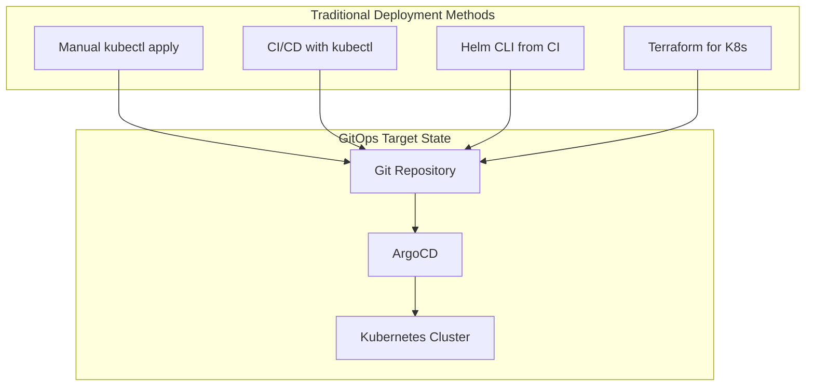
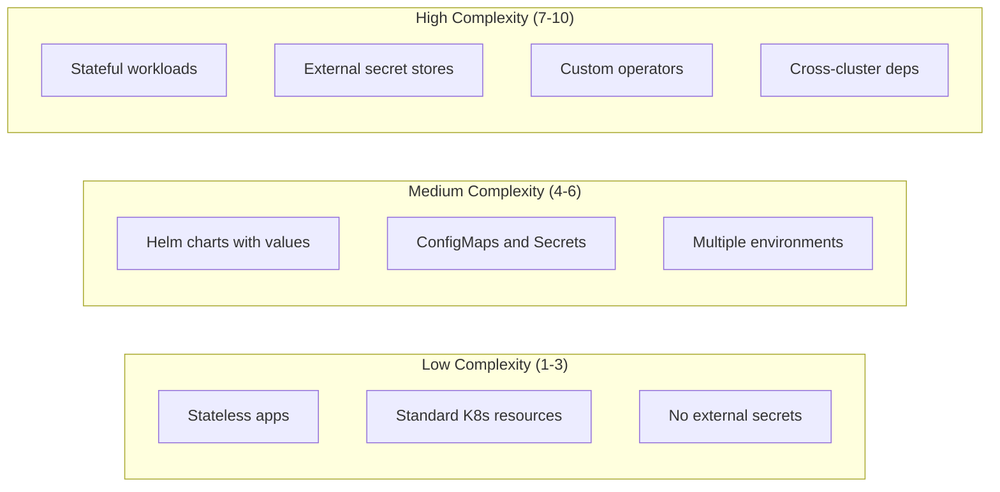
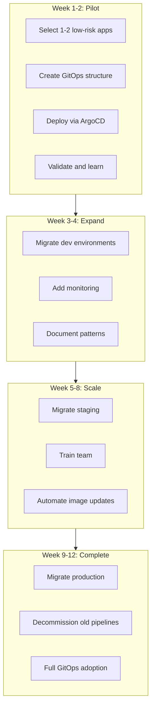
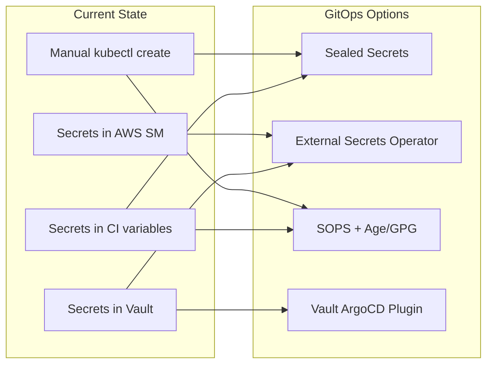
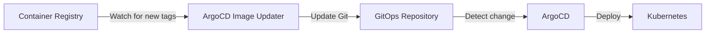
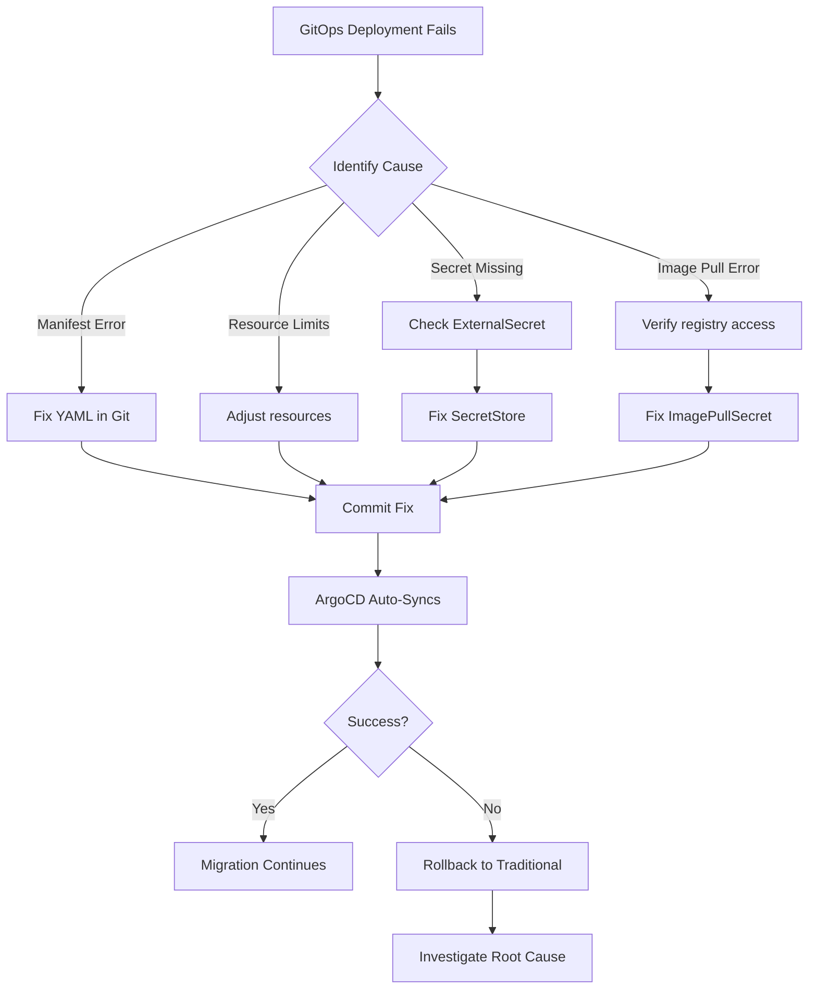

# How to Migrate to GitOps with ArgoCD

Author: [nawazdhandala](https://www.github.com/nawazdhandala)

Tags: GitOps, ArgoCD, Kubernetes, Migration, CI/CD, DevOps, Infrastructure as Code

Description: A step-by-step guide for migrating your existing Kubernetes deployments to GitOps with ArgoCD, covering assessment, planning, incremental migration strategies, and handling legacy workloads.

---

Moving from traditional deployment methods to GitOps requires careful planning and execution. Many teams struggle with the migration because they try to convert everything at once. A phased approach works better, letting you learn and adapt while maintaining system stability.

## Understanding Your Starting Point

Before migrating, you need to understand what you currently have. Most teams fall into one of these deployment patterns:



Common starting points include:
- **Manual deployments** - Running kubectl commands directly from developer machines
- **CI-driven deployments** - Jenkins, GitHub Actions, or GitLab CI pushing changes to clusters
- **Helm CLI** - Using helm install/upgrade from pipelines
- **Terraform** - Managing Kubernetes resources alongside infrastructure

## Migration Assessment Checklist

Run through these questions for each application before migrating.

**Configuration Discovery**

The first step involves documenting all configuration sources your applications use.

```bash
# Find all ConfigMaps used by your applications
kubectl get configmaps --all-namespaces -o json | \
  jq -r '.items[] | select(.metadata.namespace != "kube-system") |
  "\(.metadata.namespace)/\(.metadata.name)"'

# Find all Secrets referenced by deployments
kubectl get deployments --all-namespaces -o json | \
  jq -r '.items[].spec.template.spec.containers[].envFrom[]?.secretRef.name // empty' | \
  sort -u

# List all external dependencies (services, endpoints)
kubectl get endpoints --all-namespaces -o json | \
  jq -r '.items[] | select(.subsets[].addresses[].ip | test("^10\\.|^172\\.|^192\\.168\\.") | not) |
  .metadata.name' 2>/dev/null || echo "No external endpoints found"
```

**Deployment Complexity Score**

Assign each application a migration complexity score based on these factors.



## Phase 1: Setting Up ArgoCD

Install ArgoCD in a dedicated namespace with production-ready settings.

The following Helm values configure ArgoCD for high availability and secure defaults.

```yaml
# argocd-values.yaml
# Production-ready ArgoCD Helm values for migration
global:
  image:
    tag: "v2.9.3"

controller:
  replicas: 2
  metrics:
    enabled: true
    serviceMonitor:
      enabled: true

server:
  replicas: 2
  autoscaling:
    enabled: true
    minReplicas: 2
    maxReplicas: 5
  ingress:
    enabled: true
    ingressClassName: nginx
    hosts:
      - argocd.yourdomain.com
    tls:
      - secretName: argocd-tls
        hosts:
          - argocd.yourdomain.com

repoServer:
  replicas: 2
  autoscaling:
    enabled: true
    minReplicas: 2
    maxReplicas: 5

applicationSet:
  enabled: true
  replicas: 2

configs:
  params:
    server.insecure: false
  cm:
    # Enable status badge for README files
    statusbadge.enabled: "true"
    # Resource tracking method
    application.resourceTrackingMethod: annotation
```

Install using Helm with these values.

```bash
# Add the ArgoCD Helm repository and install
helm repo add argo https://argoproj.github.io/argo-helm
helm repo update

# Install ArgoCD with production values
helm install argocd argo/argo-cd \
  --namespace argocd \
  --create-namespace \
  --values argocd-values.yaml \
  --wait
```

## Phase 2: Converting Existing Manifests

Most migrations involve converting existing Kubernetes manifests into a Git-friendly structure.

### From Raw Manifests to Kustomize

If your team uses raw YAML files, Kustomize provides an excellent migration path.

The following script helps convert a directory of raw manifests into a Kustomize structure.

```bash
#!/bin/bash
# convert-to-kustomize.sh
# Converts raw Kubernetes manifests to Kustomize structure

set -e

SOURCE_DIR=${1:-"./manifests"}
OUTPUT_DIR=${2:-"./k8s"}

# Create directory structure
mkdir -p "${OUTPUT_DIR}/base"
mkdir -p "${OUTPUT_DIR}/overlays/development"
mkdir -p "${OUTPUT_DIR}/overlays/staging"
mkdir -p "${OUTPUT_DIR}/overlays/production"

# Copy all manifests to base
cp "${SOURCE_DIR}"/*.yaml "${OUTPUT_DIR}/base/" 2>/dev/null || true
cp "${SOURCE_DIR}"/*.yml "${OUTPUT_DIR}/base/" 2>/dev/null || true

# Generate base kustomization.yaml
cd "${OUTPUT_DIR}/base"
echo "apiVersion: kustomize.config.k8s.io/v1beta1
kind: Kustomization
resources:" > kustomization.yaml

for f in *.yaml *.yml 2>/dev/null; do
  if [ -f "$f" ] && [ "$f" != "kustomization.yaml" ]; then
    echo "  - $f" >> kustomization.yaml
  fi
done

echo "Kustomize structure created at ${OUTPUT_DIR}"
```

### From Helm CLI to ArgoCD Helm Source

If you deploy Helm charts via CI pipelines, convert them to ArgoCD Application resources.

Before migration, your CI pipeline might look like the following.

```bash
# Old CI/CD pipeline approach - Helm deployment from Jenkins/GitLab
helm upgrade --install myapp ./charts/myapp \
  --namespace production \
  --set image.tag=${CI_COMMIT_SHA} \
  --set replicas=3 \
  --set resources.limits.memory=512Mi \
  --values ./values/production.yaml
```

Convert that to an ArgoCD Application with Helm source.

```yaml
# applications/myapp.yaml
# ArgoCD Application resource for Helm chart deployment
apiVersion: argoproj.io/v1alpha1
kind: Application
metadata:
  name: myapp
  namespace: argocd
  # Finalizer ensures clean deletion
  finalizers:
    - resources-finalizer.argocd.argoproj.io
spec:
  project: default
  source:
    # Point to your Helm chart in Git
    repoURL: https://github.com/yourorg/myapp.git
    targetRevision: HEAD
    path: charts/myapp
    helm:
      # Values files relative to the chart
      valueFiles:
        - ../../values/production.yaml
      # Override specific values
      parameters:
        - name: replicas
          value: "3"
        - name: resources.limits.memory
          value: "512Mi"
  destination:
    server: https://kubernetes.default.svc
    namespace: production
  syncPolicy:
    automated:
      prune: true
      selfHeal: true
    syncOptions:
      - CreateNamespace=true
      - PruneLast=true
```

### From Terraform Kubernetes Provider

Teams using Terraform for Kubernetes resources need a different approach.

The following strategy exports Terraform-managed resources to YAML files.

```hcl
# terraform/export-to-yaml.tf
# Export Kubernetes resources managed by Terraform to YAML files

# Generate YAML from Terraform state for migration
resource "local_file" "deployment_yaml" {
  for_each = var.applications

  content = yamlencode({
    apiVersion = "apps/v1"
    kind       = "Deployment"
    metadata = {
      name      = each.key
      namespace = each.value.namespace
      labels    = each.value.labels
    }
    spec = {
      replicas = each.value.replicas
      selector = {
        matchLabels = each.value.labels
      }
      template = {
        metadata = {
          labels = each.value.labels
        }
        spec = {
          containers = [{
            name  = each.key
            image = "${each.value.image}:${each.value.tag}"
            ports = each.value.ports
            resources = each.value.resources
          }]
        }
      }
    }
  })

  filename = "${path.module}/exported/${each.key}/deployment.yaml"
}
```

After exporting, import those manifests into your GitOps repository.

```bash
# Import Terraform-managed resources into GitOps repo
cd /path/to/terraform/exported

for app in */; do
  app_name="${app%/}"

  # Create GitOps structure
  mkdir -p "/path/to/gitops-repo/apps/${app_name}/base"

  # Copy exported manifests
  cp "${app}"*.yaml "/path/to/gitops-repo/apps/${app_name}/base/"

  # Generate kustomization
  cd "/path/to/gitops-repo/apps/${app_name}/base"
  kustomize create --autodetect
  cd -
done
```

## Phase 3: Incremental Migration Strategy

Never migrate everything at once. Use an incremental approach that maintains stability.



### Running Parallel Deployments

During migration, run ArgoCD alongside your existing CI/CD to validate.

The following Application uses manual sync to allow controlled migration.

```yaml
# applications/myapp-migration.yaml
# Parallel deployment for migration validation
apiVersion: argoproj.io/v1alpha1
kind: Application
metadata:
  name: myapp-gitops
  namespace: argocd
  labels:
    migration-phase: pilot
spec:
  project: default
  source:
    repoURL: https://github.com/yourorg/gitops-config.git
    targetRevision: HEAD
    path: apps/myapp/overlays/staging
  destination:
    server: https://kubernetes.default.svc
    # Deploy to a parallel namespace during migration
    namespace: myapp-gitops-staging
  # Manual sync during migration - no automated deployment
  syncPolicy:
    syncOptions:
      - CreateNamespace=true
      - Validate=true
```

Compare deployments between the old and new methods.

```bash
#!/bin/bash
# compare-deployments.sh
# Compare resources between traditional and GitOps deployments

TRADITIONAL_NS="myapp-staging"
GITOPS_NS="myapp-gitops-staging"

echo "=== Comparing Deployments ==="
diff <(kubectl get deployment -n $TRADITIONAL_NS -o yaml | yq 'del(.metadata.resourceVersion, .metadata.uid, .metadata.creationTimestamp, .status)') \
     <(kubectl get deployment -n $GITOPS_NS -o yaml | yq 'del(.metadata.resourceVersion, .metadata.uid, .metadata.creationTimestamp, .status)')

echo "=== Comparing ConfigMaps ==="
diff <(kubectl get configmap -n $TRADITIONAL_NS -o yaml | yq 'del(.metadata.resourceVersion, .metadata.uid, .metadata.creationTimestamp)') \
     <(kubectl get configmap -n $GITOPS_NS -o yaml | yq 'del(.metadata.resourceVersion, .metadata.uid, .metadata.creationTimestamp)')

echo "=== Pod Resource Comparison ==="
echo "Traditional namespace:"
kubectl top pods -n $TRADITIONAL_NS
echo "GitOps namespace:"
kubectl top pods -n $GITOPS_NS
```

## Phase 4: Handling Secrets Migration

Secrets require special handling since they cannot be stored in Git as plain text.



### Option 1: Sealed Secrets Migration

Sealed Secrets encrypts secrets so they can be safely stored in Git.

Install the Sealed Secrets controller first.

```bash
# Install Sealed Secrets controller
helm repo add sealed-secrets https://bitnami-labs.github.io/sealed-secrets
helm install sealed-secrets sealed-secrets/sealed-secrets \
  --namespace kube-system \
  --set fullnameOverride=sealed-secrets-controller

# Install kubeseal CLI
# macOS
brew install kubeseal

# Linux
wget https://github.com/bitnami-labs/sealed-secrets/releases/download/v0.24.0/kubeseal-0.24.0-linux-amd64.tar.gz
tar -xvzf kubeseal-0.24.0-linux-amd64.tar.gz
sudo mv kubeseal /usr/local/bin/
```

Convert existing secrets to Sealed Secrets.

```bash
#!/bin/bash
# migrate-secrets.sh
# Convert existing Kubernetes secrets to Sealed Secrets

NAMESPACE=${1:-"default"}
OUTPUT_DIR=${2:-"./sealed-secrets"}

mkdir -p "$OUTPUT_DIR"

# Get all secrets except service account tokens
for secret in $(kubectl get secrets -n "$NAMESPACE" -o jsonpath='{.items[?(@.type!="kubernetes.io/service-account-token")].metadata.name}'); do
  echo "Converting secret: $secret"

  # Export existing secret
  kubectl get secret "$secret" -n "$NAMESPACE" -o yaml | \
    # Remove cluster-specific metadata
    yq 'del(.metadata.resourceVersion, .metadata.uid, .metadata.creationTimestamp, .metadata.annotations["kubectl.kubernetes.io/last-applied-configuration"])' | \
    # Seal the secret
    kubeseal --format yaml > "$OUTPUT_DIR/${secret}-sealed.yaml"

  echo "Created: $OUTPUT_DIR/${secret}-sealed.yaml"
done

echo "Migration complete. Review sealed secrets before committing to Git."
```

### Option 2: External Secrets Operator Migration

For teams using external secret stores like AWS Secrets Manager or HashiCorp Vault.

Install External Secrets Operator.

```bash
helm repo add external-secrets https://charts.external-secrets.io
helm install external-secrets external-secrets/external-secrets \
  --namespace external-secrets \
  --create-namespace
```

Create a ClusterSecretStore for your provider.

```yaml
# secret-stores/aws-secretsmanager.yaml
# ClusterSecretStore for AWS Secrets Manager
apiVersion: external-secrets.io/v1beta1
kind: ClusterSecretStore
metadata:
  name: aws-secrets-manager
spec:
  provider:
    aws:
      service: SecretsManager
      region: us-east-1
      # Uses IRSA for authentication
      auth:
        jwt:
          serviceAccountRef:
            name: external-secrets-sa
            namespace: external-secrets
```

Convert your secrets to ExternalSecret resources.

```yaml
# apps/myapp/base/external-secret.yaml
# ExternalSecret pulls database credentials from AWS Secrets Manager
apiVersion: external-secrets.io/v1beta1
kind: ExternalSecret
metadata:
  name: myapp-db-credentials
spec:
  refreshInterval: 1h
  secretStoreRef:
    name: aws-secrets-manager
    kind: ClusterSecretStore
  target:
    name: myapp-db-credentials
    creationPolicy: Owner
  data:
    - secretKey: username
      remoteRef:
        key: myapp/production/database
        property: username
    - secretKey: password
      remoteRef:
        key: myapp/production/database
        property: password
```

## Phase 5: Image Update Automation

After migrating to GitOps, automate image updates using ArgoCD Image Updater.



Install ArgoCD Image Updater.

```bash
helm install argocd-image-updater argo/argocd-image-updater \
  --namespace argocd \
  --set config.registries[0].name=Docker\ Hub \
  --set config.registries[0].prefix=docker.io \
  --set config.registries[0].api_url=https://registry-1.docker.io
```

Configure your Application for automatic image updates.

```yaml
# applications/myapp.yaml
# Application with automatic image updates
apiVersion: argoproj.io/v1alpha1
kind: Application
metadata:
  name: myapp
  namespace: argocd
  annotations:
    # Enable image updater for this app
    argocd-image-updater.argoproj.io/image-list: myapp=yourorg/myapp
    # Update strategy: semver, latest, digest, or name
    argocd-image-updater.argoproj.io/myapp.update-strategy: semver
    # Only update patch versions automatically
    argocd-image-updater.argoproj.io/myapp.allow-tags: "regexp:^v1\\.2\\.\\d+$"
    # Write changes back to Git
    argocd-image-updater.argoproj.io/write-back-method: git
    argocd-image-updater.argoproj.io/git-branch: main
spec:
  project: default
  source:
    repoURL: https://github.com/yourorg/gitops-config.git
    targetRevision: HEAD
    path: apps/myapp/overlays/production
  destination:
    server: https://kubernetes.default.svc
    namespace: production
```

## Phase 6: Decommissioning Old Pipelines

Once applications are running successfully via GitOps, safely remove old deployment pipelines.

Create a migration tracker to manage the transition.

```yaml
# migration-tracker/status.yaml
# Track migration progress across applications
applications:
  - name: myapp
    status: completed
    traditional_pipeline: .github/workflows/deploy-myapp.yml
    gitops_path: apps/myapp
    migrated_date: "2026-01-15"
    validated_by: jane.doe

  - name: api-gateway
    status: in_progress
    traditional_pipeline: jenkins/api-gateway/Jenkinsfile
    gitops_path: apps/api-gateway
    migration_started: "2026-01-20"
    blockers:
      - "Secret migration pending"

  - name: legacy-service
    status: not_started
    traditional_pipeline: scripts/deploy-legacy.sh
    notes: "Requires refactoring before migration"
```

Disable old pipelines gradually.

```yaml
# .github/workflows/deploy-myapp.yml
# Deprecated: Migration to GitOps complete
# Remove after 2026-03-01

name: Deploy MyApp (DEPRECATED)

on:
  push:
    branches:
      - main
    paths:
      - 'src/myapp/**'

jobs:
  deploy:
    runs-on: ubuntu-latest
    steps:
      - name: Migration Notice
        run: |
          echo "::warning::This pipeline is deprecated."
          echo "::warning::MyApp now deploys via ArgoCD GitOps."
          echo "::warning::See: https://argocd.yourdomain.com/applications/myapp"
          echo "::warning::This pipeline will be removed on 2026-03-01"

      # Comment out actual deployment steps
      # - name: Deploy to Kubernetes
      #   run: kubectl apply -f ...
```

## Handling Migration Failures

When things go wrong, having a rollback strategy helps.



Emergency rollback to traditional deployment if needed.

```bash
#!/bin/bash
# emergency-rollback.sh
# Temporarily disable GitOps and restore traditional deployment

APP_NAME=$1
NAMESPACE=$2

if [ -z "$APP_NAME" ] || [ -z "$NAMESPACE" ]; then
  echo "Usage: ./emergency-rollback.sh <app-name> <namespace>"
  exit 1
fi

echo "=== Emergency Rollback for $APP_NAME ==="

# Step 1: Disable ArgoCD auto-sync
echo "Disabling ArgoCD auto-sync..."
argocd app set "$APP_NAME" --sync-policy none

# Step 2: Remove ArgoCD tracking labels (prevents ArgoCD from managing resources)
echo "Removing ArgoCD tracking annotations..."
kubectl annotate deployment "$APP_NAME" -n "$NAMESPACE" \
  argocd.argoproj.io/tracking-id- \
  argocd.argoproj.io/compare-options-

# Step 3: Document the rollback
echo "Rollback initiated at $(date)" >> /tmp/rollback-log.txt
echo "Application: $APP_NAME" >> /tmp/rollback-log.txt
echo "Namespace: $NAMESPACE" >> /tmp/rollback-log.txt

echo ""
echo "=== Rollback Complete ==="
echo "Traditional deployment methods can now be used."
echo "Remember to re-enable GitOps after fixing the issue."
echo ""
echo "To re-enable GitOps:"
echo "  argocd app set $APP_NAME --sync-policy automated"
```

## Post-Migration Checklist

After completing migration, verify everything works correctly.

```yaml
# post-migration-checklist.yaml
# Validation checklist for completed migrations

validation:
  argocd_sync:
    - name: "Application shows 'Synced' status"
      check: "argocd app get myapp | grep -q 'Sync Status: Synced'"
    - name: "Application shows 'Healthy' status"
      check: "argocd app get myapp | grep -q 'Health Status: Healthy'"
    - name: "No sync errors in last 24 hours"
      check: "Check ArgoCD UI for sync history"

  kubernetes_resources:
    - name: "All pods running"
      check: "kubectl get pods -n production -l app=myapp | grep -v Running"
    - name: "Services have endpoints"
      check: "kubectl get endpoints -n production myapp"
    - name: "Ingress routes correctly"
      check: "curl -s https://myapp.yourdomain.com/health"

  observability:
    - name: "Metrics flowing"
      check: "Query Prometheus for myapp metrics"
    - name: "Logs aggregating"
      check: "Check log aggregation for myapp namespace"
    - name: "Alerts configured"
      check: "Verify alerting rules exist"

  security:
    - name: "Secrets not in Git history"
      check: "git log --all -p | grep -i password (should return nothing)"
    - name: "RBAC configured"
      check: "argocd proj get default | grep sourceRepos"
    - name: "Network policies applied"
      check: "kubectl get networkpolicies -n production"

  documentation:
    - name: "Runbook updated"
      location: "docs/runbooks/myapp.md"
    - name: "Architecture diagram current"
      location: "docs/architecture/myapp.png"
    - name: "On-call procedures documented"
      location: "docs/oncall/gitops-troubleshooting.md"
```

## Common Migration Pitfalls

Avoid these mistakes that teams commonly make during GitOps migration.

**1. Migrating too fast**

Taking time with pilot applications helps you understand ArgoCD behavior before scaling.

**2. Ignoring drift**

Enable self-heal only after validating that your Git manifests are complete.

```yaml
# Start with manual sync during migration
syncPolicy: null

# Then enable automated sync without self-heal
syncPolicy:
  automated:
    prune: false
    selfHeal: false

# Finally enable full automation after validation
syncPolicy:
  automated:
    prune: true
    selfHeal: true
```

**3. Forgetting about RBAC**

Create proper ArgoCD projects to limit blast radius.

```yaml
# projects/team-backend.yaml
# Restrict team access to their namespaces only
apiVersion: argoproj.io/v1alpha1
kind: AppProject
metadata:
  name: team-backend
  namespace: argocd
spec:
  description: Backend team applications
  sourceRepos:
    - 'https://github.com/yourorg/backend-*'
  destinations:
    - namespace: 'backend-*'
      server: https://kubernetes.default.svc
  # Prevent accidental cluster-wide changes
  clusterResourceWhitelist: []
  namespaceResourceBlacklist:
    - group: ''
      kind: ResourceQuota
    - group: ''
      kind: LimitRange
```

---

Migrating to GitOps with ArgoCD transforms how your team deploys and manages applications. The key to success lies in taking an incremental approach, validating each step, and maintaining the option to rollback if needed. Start with low-risk applications, build confidence, and expand gradually. Within a few months, your entire deployment workflow can benefit from the auditability, reliability, and developer experience that GitOps provides.
