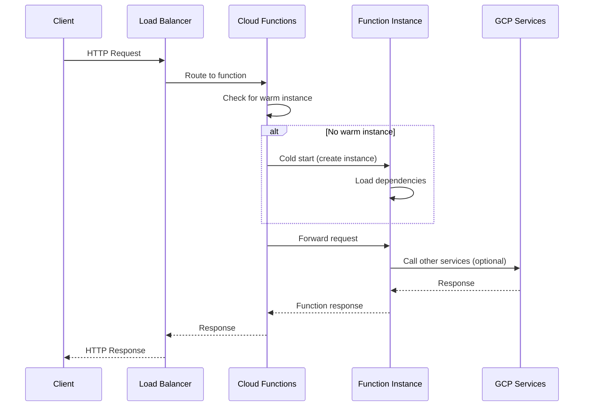

# How to Create Google Cloud Functions

Author: [nawazdhandala](https://www.github.com/nawazdhandala)

Tags: Google Cloud, Cloud Functions, Serverless, GCP, Python

Description: Learn how to build and deploy serverless functions on Google Cloud Platform, from simple HTTP triggers to event-driven architectures with Pub/Sub and Cloud Storage.

---

> Google Cloud Functions lets you run code without provisioning servers. You write the function, deploy it, and Google handles the rest. This guide walks through everything from your first function to production-ready deployments.

Cloud Functions work well for webhooks, data processing pipelines, scheduled tasks, and API backends. You pay only for what you use, down to 100ms increments.

---

## Cloud Functions Overview

Google offers two generations of Cloud Functions:

| Feature | 1st Gen | 2nd Gen |
|---------|---------|---------|
| **Max timeout** | 9 minutes | 60 minutes |
| **Max instances** | 3000 | 1000 (configurable) |
| **Concurrency** | 1 request per instance | Up to 1000 per instance |
| **Min instances** | Not supported | Supported |
| **VPC connector** | Supported | Supported |
| **Built on** | Proprietary | Cloud Run |

2nd Gen is recommended for new projects. It offers better performance, longer timeouts, and concurrency support.

---

## Prerequisites

Before you start, you need a Google Cloud project with billing enabled and the gcloud CLI installed.

Install and configure gcloud CLI:

```bash
# Install gcloud CLI (macOS)
brew install --cask google-cloud-sdk

# Initialize gcloud and authenticate
gcloud init

# Set your project
gcloud config set project YOUR_PROJECT_ID

# Enable required APIs
gcloud services enable cloudfunctions.googleapis.com
gcloud services enable cloudbuild.googleapis.com
gcloud services enable run.googleapis.com
```

---

## Your First HTTP Function

Let's start with a simple HTTP function that returns a greeting.

Create a project directory and add the main Python file:

```python
# main.py
import functions_framework

@functions_framework.http
def hello_world(request):
    """
    HTTP Cloud Function.
    Args:
        request: The request object containing headers, body, etc.
    Returns:
        The response text or a tuple (response, status_code, headers).
    """
    # Get the name from query parameters, default to "World"
    name = request.args.get("name", "World")

    return f"Hello, {name}!"
```

Add a requirements file for dependencies:

```text
# requirements.txt
functions-framework==3.*
```

Deploy the function using gcloud:

```bash
# Deploy 2nd gen function
gcloud functions deploy hello-world \
    --gen2 \
    --runtime python312 \
    --region us-central1 \
    --source . \
    --entry-point hello_world \
    --trigger-http \
    --allow-unauthenticated

# Test the deployed function
curl https://us-central1-YOUR_PROJECT.cloudfunctions.net/hello-world?name=Developer
```

---

## Function Execution Flow

Here's how a Cloud Function request flows through GCP infrastructure:



---

## Handling JSON Requests

Most APIs work with JSON. Here's how to handle JSON requests and responses properly.

This function processes JSON payloads and returns structured responses:

```python
# main.py
import functions_framework
from flask import jsonify

@functions_framework.http
def process_data(request):
    """
    Process JSON data and return structured response.
    Handles both GET and POST methods.
    """
    # Handle CORS preflight requests
    if request.method == "OPTIONS":
        headers = {
            "Access-Control-Allow-Origin": "*",
            "Access-Control-Allow-Methods": "GET, POST",
            "Access-Control-Allow-Headers": "Content-Type",
            "Access-Control-Max-Age": "3600",
        }
        return ("", 204, headers)

    # Set CORS headers for the main request
    headers = {"Access-Control-Allow-Origin": "*"}

    # Parse JSON body for POST requests
    if request.method == "POST":
        try:
            request_json = request.get_json(silent=True)

            if not request_json:
                return (jsonify({"error": "No JSON body provided"}), 400, headers)

            # Process the data
            result = {
                "status": "success",
                "received": request_json,
                "processed_at": request_json.get("timestamp", "not provided"),
            }

            return (jsonify(result), 200, headers)

        except Exception as e:
            return (jsonify({"error": str(e)}), 500, headers)

    # Handle GET requests
    return (jsonify({"message": "Send a POST request with JSON data"}), 200, headers)
```

---

## Pub/Sub Triggered Functions

Event-driven functions respond to messages on Pub/Sub topics. This is useful for decoupling services and building async workflows.

Create a function that processes Pub/Sub messages:

```python
# main.py
import base64
import json
import functions_framework
from cloudevents.http import CloudEvent

@functions_framework.cloud_event
def process_pubsub_message(cloud_event: CloudEvent):
    """
    Triggered by a Pub/Sub message.
    The message data is base64-encoded in cloud_event.data["message"]["data"].
    """
    # Extract the Pub/Sub message data
    pubsub_message = cloud_event.data["message"]

    # Decode the base64 message
    if "data" in pubsub_message:
        message_data = base64.b64decode(pubsub_message["data"]).decode("utf-8")
        print(f"Received message: {message_data}")

        # Parse JSON if the message is JSON
        try:
            payload = json.loads(message_data)
            print(f"Parsed payload: {payload}")

            # Process the payload
            handle_event(payload)

        except json.JSONDecodeError:
            print(f"Message is not JSON: {message_data}")

    # Get message attributes if any
    attributes = pubsub_message.get("attributes", {})
    if attributes:
        print(f"Message attributes: {attributes}")

def handle_event(payload: dict):
    """
    Business logic for processing the event.
    """
    event_type = payload.get("type")

    if event_type == "user.created":
        print(f"New user created: {payload.get('user_id')}")
        # Send welcome email, create default resources, etc.

    elif event_type == "order.completed":
        print(f"Order completed: {payload.get('order_id')}")
        # Update inventory, send confirmation, etc.

    else:
        print(f"Unknown event type: {event_type}")
```

Deploy the Pub/Sub triggered function:

```bash
# Create a Pub/Sub topic first
gcloud pubsub topics create my-events

# Deploy the function
gcloud functions deploy process-pubsub-message \
    --gen2 \
    --runtime python312 \
    --region us-central1 \
    --source . \
    --entry-point process_pubsub_message \
    --trigger-topic my-events

# Test by publishing a message
gcloud pubsub topics publish my-events \
    --message '{"type": "user.created", "user_id": "123"}'
```

---

## Cloud Storage Triggered Functions

Process files automatically when they're uploaded to Cloud Storage.

This function handles new files in a storage bucket:

```python
# main.py
import functions_framework
from cloudevents.http import CloudEvent
from google.cloud import storage

@functions_framework.cloud_event
def process_uploaded_file(cloud_event: CloudEvent):
    """
    Triggered when a file is uploaded to Cloud Storage.
    Processes the file based on its type.
    """
    data = cloud_event.data

    # Extract file information
    bucket_name = data["bucket"]
    file_name = data["name"]
    content_type = data.get("contentType", "unknown")
    size = data.get("size", 0)

    print(f"Processing file: gs://{bucket_name}/{file_name}")
    print(f"Content type: {content_type}, Size: {size} bytes")

    # Skip processing for certain file patterns
    if file_name.startswith("processed/"):
        print("File already processed, skipping")
        return

    # Initialize storage client
    storage_client = storage.Client()
    bucket = storage_client.bucket(bucket_name)
    blob = bucket.blob(file_name)

    # Process based on content type
    if content_type.startswith("image/"):
        process_image(blob, bucket)
    elif content_type == "application/json":
        process_json(blob, bucket)
    elif content_type == "text/csv":
        process_csv(blob, bucket)
    else:
        print(f"Unsupported content type: {content_type}")

def process_image(blob, bucket):
    """
    Process an uploaded image.
    Example: Create a thumbnail, extract metadata, etc.
    """
    print(f"Processing image: {blob.name}")

    # Download the image
    image_data = blob.download_as_bytes()

    # Here you would process the image
    # For example, using Pillow to create a thumbnail

    # Move to processed folder
    new_name = f"processed/{blob.name}"
    bucket.copy_blob(blob, bucket, new_name)
    print(f"Copied to: {new_name}")

def process_json(blob, bucket):
    """
    Process a JSON file.
    Example: Validate schema, transform data, load to BigQuery.
    """
    import json

    print(f"Processing JSON: {blob.name}")

    # Download and parse JSON
    content = blob.download_as_text()
    data = json.loads(content)

    # Validate and transform
    record_count = len(data) if isinstance(data, list) else 1
    print(f"JSON contains {record_count} records")

def process_csv(blob, bucket):
    """
    Process a CSV file.
    Example: Validate columns, transform data, load to BigQuery.
    """
    import csv
    import io

    print(f"Processing CSV: {blob.name}")

    # Download CSV content
    content = blob.download_as_text()
    reader = csv.DictReader(io.StringIO(content))

    row_count = sum(1 for _ in reader)
    print(f"CSV contains {row_count} rows")
```

Deploy with Cloud Storage trigger:

```bash
# Create a bucket (if needed)
gsutil mb -l us-central1 gs://YOUR_BUCKET_NAME

# Deploy the function
gcloud functions deploy process-uploaded-file \
    --gen2 \
    --runtime python312 \
    --region us-central1 \
    --source . \
    --entry-point process_uploaded_file \
    --trigger-bucket YOUR_BUCKET_NAME

# Test by uploading a file
gsutil cp test.json gs://YOUR_BUCKET_NAME/
```

---

## Environment Variables and Secrets

Never hardcode credentials. Use environment variables for configuration and Secret Manager for sensitive data.

Configure your function with environment variables and secrets:

```python
# main.py
import os
import functions_framework
from google.cloud import secretmanager

@functions_framework.http
def secure_function(request):
    """
    Function that uses environment variables and secrets.
    """
    # Read environment variables (set during deployment)
    environment = os.environ.get("ENVIRONMENT", "development")
    api_endpoint = os.environ.get("API_ENDPOINT", "https://api.example.com")

    # Read from Secret Manager for sensitive values
    api_key = get_secret("api-key")
    db_password = get_secret("db-password")

    # Use the configuration
    print(f"Running in {environment} environment")
    print(f"API endpoint: {api_endpoint}")

    return f"Function configured for {environment}"

def get_secret(secret_id: str, version: str = "latest") -> str:
    """
    Retrieve a secret from Google Cloud Secret Manager.
    """
    project_id = os.environ.get("GCP_PROJECT")

    client = secretmanager.SecretManagerServiceClient()
    name = f"projects/{project_id}/secrets/{secret_id}/versions/{version}"

    response = client.access_secret_version(request={"name": name})
    return response.payload.data.decode("UTF-8")
```

Update requirements to include Secret Manager client:

```text
# requirements.txt
functions-framework==3.*
google-cloud-secret-manager==2.*
```

Deploy with environment variables:

```bash
# Create secrets first
echo -n "your-api-key" | gcloud secrets create api-key --data-file=-
echo -n "your-db-password" | gcloud secrets create db-password --data-file=-

# Grant the function access to secrets
gcloud secrets add-iam-policy-binding api-key \
    --member="serviceAccount:YOUR_PROJECT@appspot.gserviceaccount.com" \
    --role="roles/secretmanager.secretAccessor"

# Deploy with environment variables
gcloud functions deploy secure-function \
    --gen2 \
    --runtime python312 \
    --region us-central1 \
    --source . \
    --entry-point secure_function \
    --trigger-http \
    --set-env-vars ENVIRONMENT=production,API_ENDPOINT=https://api.prod.example.com \
    --allow-unauthenticated
```

---

## Error Handling and Retries

Proper error handling makes functions reliable. For event-driven functions, Cloud Functions automatically retries on failure.

Implement robust error handling:

```python
# main.py
import functions_framework
import logging
from cloudevents.http import CloudEvent

# Configure logging
logging.basicConfig(level=logging.INFO)
logger = logging.getLogger(__name__)

class RetryableError(Exception):
    """Error that should trigger a retry."""
    pass

class PermanentError(Exception):
    """Error that should not be retried."""
    pass

@functions_framework.cloud_event
def reliable_processor(cloud_event: CloudEvent):
    """
    Event processor with proper error handling.
    Retries on transient errors, fails fast on permanent errors.
    """
    try:
        data = cloud_event.data
        logger.info(f"Processing event: {cloud_event.id}")

        # Validate the event data
        if not validate_event(data):
            raise PermanentError("Invalid event data")

        # Process the event
        result = process_event(data)

        logger.info(f"Successfully processed event: {cloud_event.id}")
        return result

    except RetryableError as e:
        # Log and re-raise to trigger retry
        logger.warning(f"Retryable error: {e}")
        raise

    except PermanentError as e:
        # Log but don't re-raise to avoid retry
        logger.error(f"Permanent error, not retrying: {e}")
        # Optionally send to dead letter queue
        send_to_dlq(cloud_event, str(e))
        return

    except Exception as e:
        # Unexpected error, log and re-raise
        logger.exception(f"Unexpected error: {e}")
        raise

def validate_event(data: dict) -> bool:
    """Validate event data."""
    required_fields = ["id", "type", "timestamp"]
    return all(field in data for field in required_fields)

def process_event(data: dict):
    """
    Process the event. May raise RetryableError or PermanentError.
    """
    import random

    # Simulate transient failures
    if random.random() < 0.1:
        raise RetryableError("Temporary service unavailable")

    # Simulate processing
    return {"processed": True, "id": data.get("id")}

def send_to_dlq(event: CloudEvent, error: str):
    """
    Send failed event to dead letter queue for manual review.
    """
    from google.cloud import pubsub_v1
    import json

    publisher = pubsub_v1.PublisherClient()
    topic_path = "projects/YOUR_PROJECT/topics/dlq"

    message = {
        "original_event": event.data,
        "error": error,
        "event_id": event.id,
    }

    publisher.publish(topic_path, json.dumps(message).encode("utf-8"))
    logger.info(f"Sent to DLQ: {event.id}")
```

Deploy with retry configuration:

```bash
# Deploy with retry settings
gcloud functions deploy reliable-processor \
    --gen2 \
    --runtime python312 \
    --region us-central1 \
    --source . \
    --entry-point reliable_processor \
    --trigger-topic my-events \
    --retry
```

---

## Connecting to Databases

Cloud Functions can connect to Cloud SQL, Firestore, or any external database. For Cloud SQL, use the Unix socket for secure connections.

Connect to Cloud SQL (PostgreSQL) from a function:

```python
# main.py
import os
import functions_framework
import sqlalchemy

# Connection pool - reused across invocations
db_pool = None

def get_db_pool():
    """
    Create a connection pool for Cloud SQL.
    Reuse the pool across function invocations.
    """
    global db_pool

    if db_pool is not None:
        return db_pool

    # Connection string for Cloud SQL
    db_user = os.environ["DB_USER"]
    db_pass = os.environ["DB_PASS"]
    db_name = os.environ["DB_NAME"]
    instance_connection_name = os.environ["INSTANCE_CONNECTION_NAME"]

    # Use Unix socket for Cloud SQL connection
    unix_socket_path = f"/cloudsql/{instance_connection_name}"

    db_pool = sqlalchemy.create_engine(
        sqlalchemy.engine.url.URL.create(
            drivername="postgresql+pg8000",
            username=db_user,
            password=db_pass,
            database=db_name,
            query={"unix_sock": f"{unix_socket_path}/.s.PGSQL.5432"},
        ),
        pool_size=5,
        max_overflow=2,
        pool_timeout=30,
        pool_recycle=1800,
    )

    return db_pool

@functions_framework.http
def database_function(request):
    """
    Function that queries Cloud SQL database.
    """
    pool = get_db_pool()

    with pool.connect() as conn:
        # Execute a query
        result = conn.execute(
            sqlalchemy.text("SELECT id, name FROM users LIMIT 10")
        )

        users = [{"id": row[0], "name": row[1]} for row in result]

    return {"users": users}
```

Update requirements for database connectivity:

```text
# requirements.txt
functions-framework==3.*
sqlalchemy==2.*
pg8000==1.*
cloud-sql-python-connector==1.*
```

Deploy with Cloud SQL connection:

```bash
gcloud functions deploy database-function \
    --gen2 \
    --runtime python312 \
    --region us-central1 \
    --source . \
    --entry-point database_function \
    --trigger-http \
    --set-env-vars DB_USER=myuser,DB_NAME=mydb,INSTANCE_CONNECTION_NAME=project:region:instance \
    --set-secrets DB_PASS=db-password:latest \
    --allow-unauthenticated
```

---

## Local Development and Testing

Test functions locally before deploying to catch issues early.

Run functions locally using the Functions Framework:

```bash
# Install functions-framework locally
pip install functions-framework

# Run HTTP function locally
functions-framework --target hello_world --debug

# The function is now available at http://localhost:8080

# Test it with curl
curl http://localhost:8080?name=LocalTest
```

Write unit tests for your functions:

```python
# test_main.py
import pytest
from unittest.mock import Mock, patch
import main

class TestHelloWorld:
    """Tests for the hello_world function."""

    def test_hello_world_default_name(self):
        """Test with no name parameter."""
        # Create a mock request
        request = Mock()
        request.args = {}

        # Call the function
        response = main.hello_world(request)

        # Assert the response
        assert response == "Hello, World!"

    def test_hello_world_with_name(self):
        """Test with a name parameter."""
        request = Mock()
        request.args = {"name": "Developer"}

        response = main.hello_world(request)

        assert response == "Hello, Developer!"

class TestProcessData:
    """Tests for the process_data function."""

    def test_process_data_post(self):
        """Test POST request with JSON body."""
        request = Mock()
        request.method = "POST"
        request.get_json.return_value = {"timestamp": "2024-01-01"}

        response, status_code, headers = main.process_data(request)

        assert status_code == 200
        assert "success" in response.get_json()["status"]

    def test_process_data_no_body(self):
        """Test POST request without body."""
        request = Mock()
        request.method = "POST"
        request.get_json.return_value = None

        response, status_code, headers = main.process_data(request)

        assert status_code == 400

# Run tests with pytest
# pytest test_main.py -v
```

---

## Deployment Best Practices

Here's a deployment script that follows best practices:

```bash
#!/bin/bash
# deploy.sh - Deploy Cloud Function with best practices

set -e

# Configuration
PROJECT_ID="your-project-id"
FUNCTION_NAME="my-function"
REGION="us-central1"
RUNTIME="python312"
ENTRY_POINT="main_handler"
SERVICE_ACCOUNT="cloud-functions@${PROJECT_ID}.iam.gserviceaccount.com"

# Memory and timeout based on function needs
MEMORY="256MB"
TIMEOUT="60s"
MAX_INSTANCES="100"
MIN_INSTANCES="0"

echo "Deploying ${FUNCTION_NAME} to ${PROJECT_ID}..."

gcloud functions deploy ${FUNCTION_NAME} \
    --gen2 \
    --project ${PROJECT_ID} \
    --region ${REGION} \
    --runtime ${RUNTIME} \
    --source . \
    --entry-point ${ENTRY_POINT} \
    --trigger-http \
    --memory ${MEMORY} \
    --timeout ${TIMEOUT} \
    --max-instances ${MAX_INSTANCES} \
    --min-instances ${MIN_INSTANCES} \
    --service-account ${SERVICE_ACCOUNT} \
    --set-env-vars "ENVIRONMENT=production" \
    --ingress-settings internal-and-gclb \
    --no-allow-unauthenticated

echo "Deployment complete!"
echo "Function URL: $(gcloud functions describe ${FUNCTION_NAME} --region ${REGION} --format='value(url)')"
```

---

## Cost Optimization Tips

| Optimization | Impact | How to Implement |
|--------------|--------|------------------|
| **Right-size memory** | High | Start with 256MB, increase if needed |
| **Use 2nd Gen concurrency** | High | Handle multiple requests per instance |
| **Set max instances** | Medium | Prevent runaway costs from traffic spikes |
| **Avoid cold starts** | Medium | Use min instances for critical functions |
| **Optimize dependencies** | Medium | Smaller packages mean faster cold starts |
| **Use regional endpoints** | Low | Reduce network latency and egress costs |

---

## Monitoring and Logging

Cloud Functions automatically send logs to Cloud Logging. Structure your logs for better analysis.

Implement structured logging:

```python
# main.py
import json
import functions_framework

def log_structured(severity: str, message: str, **kwargs):
    """
    Write a structured log entry to Cloud Logging.
    """
    entry = {
        "severity": severity,
        "message": message,
        **kwargs
    }
    print(json.dumps(entry))

@functions_framework.http
def monitored_function(request):
    """
    Function with proper logging for monitoring.
    """
    import time
    start_time = time.time()

    # Log the incoming request
    log_structured(
        "INFO",
        "Function invoked",
        method=request.method,
        path=request.path,
        user_agent=request.headers.get("User-Agent"),
    )

    try:
        # Process the request
        result = do_work(request)

        # Log success with timing
        duration = time.time() - start_time
        log_structured(
            "INFO",
            "Function completed successfully",
            duration_ms=int(duration * 1000),
            result_size=len(str(result)),
        )

        return result

    except Exception as e:
        # Log errors with full context
        duration = time.time() - start_time
        log_structured(
            "ERROR",
            f"Function failed: {str(e)}",
            duration_ms=int(duration * 1000),
            error_type=type(e).__name__,
        )
        raise

def do_work(request):
    """Actual business logic."""
    return {"status": "ok"}
```

---

## Summary

Google Cloud Functions provides a straightforward way to run serverless code. Key points to remember:

- Use 2nd Gen functions for new projects (better performance, concurrency support)
- Structure your code with proper error handling and logging
- Use environment variables and Secret Manager for configuration
- Test locally with functions-framework before deploying
- Set appropriate memory, timeout, and instance limits
- Monitor your functions through Cloud Logging and Cloud Monitoring

Start simple, then add complexity as your needs grow. The serverless model lets you focus on code while Google handles the infrastructure.

---

*Need to monitor your Cloud Functions in production? [OneUptime](https://oneuptime.com) provides comprehensive monitoring for serverless functions, including latency tracking, error alerting, and status pages for your APIs.*
