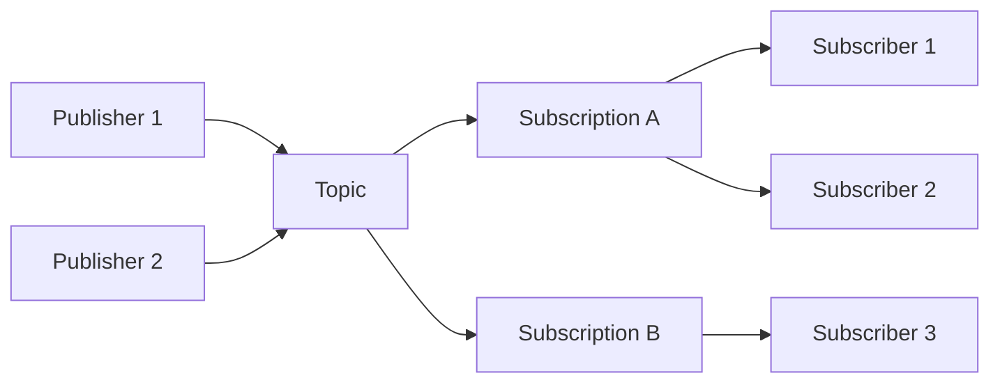

# How to Get Started with Google Cloud Pub/Sub

Author: [nawazdhandala](https://www.github.com/nawazdhandala)

Tags: Google Cloud, Pub/Sub, Messaging, GCP, Event-Driven

Description: Learn how to set up and use Google Cloud Pub/Sub for reliable, scalable messaging between your services with practical examples in Python and Node.js.

---

> Google Cloud Pub/Sub is a fully managed messaging service that lets you send and receive messages between independent applications. If you've worked with RabbitMQ, Kafka, or AWS SQS, you'll find Pub/Sub familiar but with the benefit of Google's infrastructure handling all the scaling and reliability concerns.

Pub/Sub follows the publish-subscribe pattern: publishers send messages to topics, and subscribers receive those messages through subscriptions. This decoupling makes it perfect for building event-driven architectures, streaming data pipelines, and asynchronous communication between microservices.

---

## Core Concepts

Before we dive into code, let's understand the key components:



| Component | Description |
|-----------|-------------|
| **Topic** | A named resource to which publishers send messages |
| **Subscription** | A named resource representing the stream of messages from a topic to subscribers |
| **Publisher** | Application that creates and sends messages to topics |
| **Subscriber** | Application that receives messages from subscriptions |
| **Message** | The data (payload + attributes) that moves through the system |

Each subscription receives a copy of every message published to the topic. Multiple subscribers can pull from the same subscription for load balancing, or each subscriber can have its own subscription for fan-out patterns.

---

## Prerequisites

You'll need:

1. A Google Cloud account with billing enabled
2. A GCP project
3. The gcloud CLI installed
4. Python 3.8+ or Node.js 16+

First, authenticate and set your project:

```bash
# Authenticate with Google Cloud
gcloud auth login

# Set your project
gcloud config set project YOUR_PROJECT_ID

# Enable the Pub/Sub API
gcloud services enable pubsub.googleapis.com
```

---

## Creating Topics and Subscriptions

### Using gcloud CLI

The quickest way to get started is with the gcloud CLI. These commands create the basic infrastructure you need:

```bash
# Create a topic - this is where publishers will send messages
gcloud pubsub topics create orders

# Create a subscription - subscribers will pull messages from here
# The ack-deadline is how long Pub/Sub waits before redelivering unacknowledged messages
gcloud pubsub subscriptions create orders-subscription \
    --topic=orders \
    --ack-deadline=60

# Verify your topic exists
gcloud pubsub topics list

# Verify your subscription is attached to the topic
gcloud pubsub subscriptions list
```

### Using Terraform

For production environments, infrastructure as code is the way to go. Here's a Terraform configuration that creates a topic with a subscription:

```hcl
# main.tf
provider "google" {
  project = var.project_id
  region  = var.region
}

# Create the Pub/Sub topic
resource "google_pubsub_topic" "orders" {
  name = "orders"

  # Messages are retained for 7 days even after acknowledgment
  # Useful for replaying messages if needed
  message_retention_duration = "604800s"

  labels = {
    environment = var.environment
    team        = "platform"
  }
}

# Create a subscription with sensible defaults for production
resource "google_pubsub_subscription" "orders_subscription" {
  name  = "orders-subscription"
  topic = google_pubsub_topic.orders.name

  # How long to wait for ack before redelivering
  ack_deadline_seconds = 60

  # Keep unacknowledged messages for 7 days
  message_retention_duration = "604800s"

  # Retain acknowledged messages so they can be replayed
  retain_acked_messages = true

  # Exponential backoff for failed deliveries
  retry_policy {
    minimum_backoff = "10s"
    maximum_backoff = "600s"
  }

  # Send undeliverable messages to a dead letter topic after 5 attempts
  dead_letter_policy {
    dead_letter_topic     = google_pubsub_topic.orders_dlq.id
    max_delivery_attempts = 5
  }

  labels = {
    environment = var.environment
  }
}

# Dead letter topic for messages that fail processing
resource "google_pubsub_topic" "orders_dlq" {
  name = "orders-dlq"
}

# Subscription for the dead letter queue
resource "google_pubsub_subscription" "orders_dlq_subscription" {
  name  = "orders-dlq-subscription"
  topic = google_pubsub_topic.orders_dlq.name

  ack_deadline_seconds       = 120
  message_retention_duration = "604800s"
}
```

---

## Publishing Messages with Python

Install the client library:

```bash
pip install google-cloud-pubsub
```

Here's a complete publisher implementation. The key thing to understand is that publishing is asynchronous - the publish() method returns a future that resolves to the message ID:

```python
# publisher.py
from google.cloud import pubsub_v1
from concurrent import futures
import json
import time

# Initialize the publisher client
# This client is thread-safe and should be reused
publisher = pubsub_v1.PublisherClient()

# Build the topic path - format is projects/{project}/topics/{topic}
project_id = "your-project-id"
topic_id = "orders"
topic_path = publisher.topic_path(project_id, topic_id)

def publish_message(data: dict, attributes: dict = None):
    """
    Publish a message to the topic.

    Args:
        data: The message payload (will be JSON encoded)
        attributes: Optional key-value pairs for filtering/routing

    Returns:
        The message ID assigned by Pub/Sub
    """
    # Pub/Sub requires bytes, so encode our JSON data
    message_bytes = json.dumps(data).encode("utf-8")

    # publish() returns a future - it doesn't block
    future = publisher.publish(
        topic_path,
        message_bytes,
        **(attributes or {})  # Attributes must be strings
    )

    # Wait for the publish to complete and get the message ID
    message_id = future.result()
    print(f"Published message {message_id}")
    return message_id

def publish_batch(messages: list):
    """
    Publish multiple messages efficiently using futures.

    Pub/Sub batches messages automatically, but we can also
    collect futures and wait for them together.
    """
    futures_list = []

    for msg in messages:
        data = msg.get("data", {})
        attributes = msg.get("attributes", {})

        message_bytes = json.dumps(data).encode("utf-8")
        future = publisher.publish(topic_path, message_bytes, **attributes)
        futures_list.append(future)

    # Wait for all publishes to complete
    # This is more efficient than waiting for each one individually
    results = []
    for future in futures.as_completed(futures_list):
        try:
            message_id = future.result()
            results.append({"status": "success", "message_id": message_id})
        except Exception as e:
            results.append({"status": "error", "error": str(e)})

    return results

# Example usage
if __name__ == "__main__":
    # Publish a single order event
    order = {
        "order_id": "12345",
        "customer_id": "cust-789",
        "items": [
            {"sku": "WIDGET-01", "quantity": 2},
            {"sku": "GADGET-02", "quantity": 1}
        ],
        "total": 149.99,
        "timestamp": time.time()
    }

    # Attributes are useful for filtering without parsing the message body
    attributes = {
        "event_type": "order.created",
        "priority": "high"
    }

    publish_message(order, attributes)
```

---

## Subscribing with Python (Pull)

Pull subscriptions give you control over when to fetch messages. This is great for batch processing or when you need to manage throughput:

```python
# subscriber_pull.py
from google.cloud import pubsub_v1
from concurrent.futures import TimeoutError
import json

# Initialize subscriber client
subscriber = pubsub_v1.SubscriberClient()

project_id = "your-project-id"
subscription_id = "orders-subscription"
subscription_path = subscriber.subscription_path(project_id, subscription_id)

def process_message(message_data: dict, attributes: dict):
    """
    Process a single message. This is where your business logic goes.

    Returns True if processing succeeded, False otherwise.
    """
    try:
        order_id = message_data.get("order_id")
        event_type = attributes.get("event_type", "unknown")

        print(f"Processing {event_type} for order {order_id}")

        # Your actual processing logic here
        # For example: save to database, trigger workflow, etc.

        return True
    except Exception as e:
        print(f"Error processing message: {e}")
        return False

def callback(message: pubsub_v1.subscriber.message.Message):
    """
    Callback function invoked for each message.

    Important: You must call ack() or nack() on every message.
    - ack(): Message processed successfully, remove from queue
    - nack(): Processing failed, redeliver the message
    """
    try:
        # Decode the message data
        data = json.loads(message.data.decode("utf-8"))

        # Get message attributes (useful for routing/filtering)
        attributes = dict(message.attributes)

        # Process the message
        success = process_message(data, attributes)

        if success:
            # Acknowledge - tells Pub/Sub we're done with this message
            message.ack()
            print(f"Acknowledged message {message.message_id}")
        else:
            # Negative acknowledgment - message will be redelivered
            message.nack()
            print(f"Nacked message {message.message_id}")

    except json.JSONDecodeError as e:
        print(f"Invalid JSON in message: {e}")
        # Don't ack invalid messages - they'll go to DLQ after max retries
        message.nack()
    except Exception as e:
        print(f"Unexpected error: {e}")
        message.nack()

def start_subscriber():
    """
    Start the streaming pull subscriber.

    The subscriber runs in a background thread and calls the callback
    for each message received.
    """
    # Flow control limits how many messages are outstanding at once
    # This prevents memory issues when messages arrive faster than you can process
    flow_control = pubsub_v1.types.FlowControl(
        max_messages=100,        # Max messages in memory at once
        max_bytes=10 * 1024 * 1024  # Max 10MB of messages
    )

    # Start the subscriber
    streaming_pull_future = subscriber.subscribe(
        subscription_path,
        callback=callback,
        flow_control=flow_control
    )

    print(f"Listening for messages on {subscription_path}")

    # Keep the main thread alive
    try:
        # Block indefinitely (or until Ctrl+C)
        streaming_pull_future.result()
    except TimeoutError:
        streaming_pull_future.cancel()
        streaming_pull_future.result()
    except KeyboardInterrupt:
        streaming_pull_future.cancel()
        print("Subscriber stopped")

if __name__ == "__main__":
    start_subscriber()
```

---

## Publishing Messages with Node.js

Install the client library:

```bash
npm install @google-cloud/pubsub
```

Here's a publisher implementation in Node.js with batching support:

```javascript
// publisher.js
const { PubSub } = require('@google-cloud/pubsub');

// Create a client - it will use Application Default Credentials
const pubsub = new PubSub({
  projectId: 'your-project-id',
});

const topicName = 'orders';

/**
 * Publish a single message to the topic.
 *
 * @param {Object} data - The message payload
 * @param {Object} attributes - Optional message attributes for filtering
 * @returns {Promise<string>} - The message ID
 */
async function publishMessage(data, attributes = {}) {
  // Get a reference to the topic
  const topic = pubsub.topic(topicName);

  // Convert data to a Buffer (Pub/Sub requires bytes)
  const dataBuffer = Buffer.from(JSON.stringify(data));

  try {
    // Publish returns the message ID
    const messageId = await topic.publishMessage({
      data: dataBuffer,
      attributes: attributes,  // Must be string key-value pairs
    });

    console.log(`Published message ${messageId}`);
    return messageId;
  } catch (error) {
    console.error('Error publishing message:', error);
    throw error;
  }
}

/**
 * Publish multiple messages with batching for better throughput.
 *
 * The Pub/Sub client automatically batches messages, but you can
 * configure the batching behavior for your use case.
 *
 * @param {Array} messages - Array of {data, attributes} objects
 * @returns {Promise<Array>} - Array of message IDs
 */
async function publishBatch(messages) {
  // Configure batching - send when we hit 100 messages or 1 second passes
  const topic = pubsub.topic(topicName, {
    batching: {
      maxMessages: 100,
      maxMilliseconds: 1000,
    },
  });

  const publishPromises = messages.map(async (msg) => {
    const dataBuffer = Buffer.from(JSON.stringify(msg.data));
    return topic.publishMessage({
      data: dataBuffer,
      attributes: msg.attributes || {},
    });
  });

  const messageIds = await Promise.all(publishPromises);
  console.log(`Published ${messageIds.length} messages`);
  return messageIds;
}

/**
 * Publish with ordering key to guarantee message order.
 *
 * Messages with the same ordering key are delivered in order.
 * Useful for events that must be processed sequentially.
 *
 * @param {Object} data - The message payload
 * @param {string} orderingKey - Key for message ordering
 */
async function publishWithOrdering(data, orderingKey) {
  // Enable message ordering on the topic
  const topic = pubsub.topic(topicName, {
    enableMessageOrdering: true,
  });

  const dataBuffer = Buffer.from(JSON.stringify(data));

  try {
    const messageId = await topic.publishMessage({
      data: dataBuffer,
      orderingKey: orderingKey,
    });

    console.log(`Published ordered message ${messageId}`);
    return messageId;
  } catch (error) {
    console.error('Error publishing ordered message:', error);
    // If ordering publish fails, you may need to resume publishing
    topic.resumePublishing(orderingKey);
    throw error;
  }
}

// Example usage
async function main() {
  // Single message
  await publishMessage(
    {
      orderId: '12345',
      customerId: 'cust-789',
      total: 149.99,
      timestamp: Date.now(),
    },
    {
      eventType: 'order.created',
      priority: 'high',
    }
  );

  // Batch of messages
  const orders = [
    { data: { orderId: '001', total: 50 }, attributes: { eventType: 'order.created' } },
    { data: { orderId: '002', total: 75 }, attributes: { eventType: 'order.created' } },
    { data: { orderId: '003', total: 100 }, attributes: { eventType: 'order.created' } },
  ];
  await publishBatch(orders);

  // Ordered messages for a specific customer
  await publishWithOrdering({ orderId: '004', status: 'pending' }, 'customer-123');
  await publishWithOrdering({ orderId: '004', status: 'paid' }, 'customer-123');
}

main().catch(console.error);
```

---

## Subscribing with Node.js

Here's a subscriber implementation with proper error handling and graceful shutdown:

```javascript
// subscriber.js
const { PubSub } = require('@google-cloud/pubsub');

const pubsub = new PubSub({
  projectId: 'your-project-id',
});

const subscriptionName = 'orders-subscription';

/**
 * Process a message - this is where your business logic goes.
 *
 * @param {Object} data - The parsed message data
 * @param {Object} attributes - Message attributes
 * @returns {Promise<boolean>} - True if processing succeeded
 */
async function processMessage(data, attributes) {
  const orderId = data.orderId;
  const eventType = attributes.eventType || 'unknown';

  console.log(`Processing ${eventType} for order ${orderId}`);

  // Simulate some async processing
  await new Promise((resolve) => setTimeout(resolve, 100));

  // Your actual logic here: save to DB, call APIs, etc.

  return true;
}

/**
 * Start the subscriber with proper error handling.
 */
async function startSubscriber() {
  const subscription = pubsub.subscription(subscriptionName, {
    // Flow control to prevent memory issues
    flowControl: {
      maxMessages: 100,
      allowExcessMessages: false,
    },
  });

  // Handler for incoming messages
  const messageHandler = async (message) => {
    try {
      // Parse the message data
      const data = JSON.parse(message.data.toString());
      const attributes = message.attributes || {};

      console.log(`Received message ${message.id}`);

      // Process the message
      const success = await processMessage(data, attributes);

      if (success) {
        // Acknowledge the message - it won't be delivered again
        message.ack();
        console.log(`Acknowledged message ${message.id}`);
      } else {
        // Negative acknowledgment - message will be redelivered
        message.nack();
        console.log(`Nacked message ${message.id}`);
      }
    } catch (error) {
      console.error(`Error processing message ${message.id}:`, error);
      message.nack();
    }
  };

  // Handler for errors
  const errorHandler = (error) => {
    console.error('Subscription error:', error);
    // The client will automatically reconnect
  };

  // Register handlers
  subscription.on('message', messageHandler);
  subscription.on('error', errorHandler);

  console.log(`Listening for messages on ${subscriptionName}`);

  // Graceful shutdown
  process.on('SIGTERM', async () => {
    console.log('Received SIGTERM, closing subscription...');
    await subscription.close();
    process.exit(0);
  });

  process.on('SIGINT', async () => {
    console.log('Received SIGINT, closing subscription...');
    await subscription.close();
    process.exit(0);
  });
}

startSubscriber().catch(console.error);
```

---

## Push Subscriptions

Instead of pulling messages, you can have Pub/Sub push them to an HTTP endpoint. This is useful when you have a web service that should react to events:

```bash
# Create a push subscription that sends messages to your endpoint
gcloud pubsub subscriptions create orders-push-subscription \
    --topic=orders \
    --push-endpoint=https://your-service.com/pubsub/orders \
    --push-auth-service-account=your-service-account@project.iam.gserviceaccount.com
```

Here's a simple Express handler for push subscriptions:

```javascript
// push-handler.js
const express = require('express');
const app = express();

// Pub/Sub sends messages as JSON
app.use(express.json());

/**
 * Handle incoming Pub/Sub push messages.
 *
 * The message format from Pub/Sub looks like:
 * {
 *   message: {
 *     data: "base64-encoded-data",
 *     attributes: { ... },
 *     messageId: "...",
 *     publishTime: "..."
 *   },
 *   subscription: "projects/.../subscriptions/..."
 * }
 */
app.post('/pubsub/orders', async (req, res) => {
  try {
    // Verify the request came from Pub/Sub (in production, verify the JWT token)
    if (!req.body || !req.body.message) {
      console.error('Invalid Pub/Sub message format');
      return res.status(400).send('Bad Request');
    }

    const pubsubMessage = req.body.message;

    // Decode the base64 data
    const data = JSON.parse(
      Buffer.from(pubsubMessage.data, 'base64').toString()
    );

    const attributes = pubsubMessage.attributes || {};
    const messageId = pubsubMessage.messageId;

    console.log(`Processing push message ${messageId}`);

    // Process the message
    await processOrder(data, attributes);

    // Return 2xx to acknowledge the message
    // Any other status code will cause Pub/Sub to retry
    res.status(200).send('OK');
  } catch (error) {
    console.error('Error processing push message:', error);

    // Return 500 to trigger a retry
    res.status(500).send('Processing failed');
  }
});

async function processOrder(data, attributes) {
  console.log('Order data:', data);
  // Your business logic here
}

const PORT = process.env.PORT || 8080;
app.listen(PORT, () => {
  console.log(`Push endpoint listening on port ${PORT}`);
});
```

---

## Message Filtering

Subscriptions can filter messages by attributes, so subscribers only receive messages they care about:

```bash
# Create a subscription that only receives high-priority orders
gcloud pubsub subscriptions create orders-high-priority \
    --topic=orders \
    --filter='attributes.priority = "high"'

# Create a subscription for a specific event type
gcloud pubsub subscriptions create orders-created \
    --topic=orders \
    --filter='attributes.event_type = "order.created"'

# More complex filter with multiple conditions
gcloud pubsub subscriptions create orders-us-high \
    --topic=orders \
    --filter='attributes.priority = "high" AND attributes.region = "us"'
```

---

## Dead Letter Queues

When messages fail processing repeatedly, you want to move them somewhere for investigation rather than losing them or blocking your queue:

```bash
# Create a dead letter topic
gcloud pubsub topics create orders-dlq

# Create a subscription with dead letter policy
gcloud pubsub subscriptions create orders-subscription \
    --topic=orders \
    --dead-letter-topic=orders-dlq \
    --max-delivery-attempts=5 \
    --ack-deadline=60
```

Messages that fail delivery 5 times will automatically move to the dead letter topic.

---

## Monitoring and Debugging

Use these gcloud commands to monitor your Pub/Sub setup:

```bash
# Check backlog - how many undelivered messages are waiting
gcloud pubsub subscriptions describe orders-subscription \
    --format="value(numUndeliveredMessages)"

# Pull and display a few messages without acknowledging (for debugging)
gcloud pubsub subscriptions pull orders-subscription \
    --limit=5 \
    --auto-ack=false

# Seek to a timestamp to replay messages
gcloud pubsub subscriptions seek orders-subscription \
    --time="2024-01-15T12:00:00Z"

# View topic metrics
gcloud pubsub topics describe orders
```

For production monitoring, set up alerts in Cloud Monitoring for:

- `pubsub.googleapis.com/subscription/num_undelivered_messages` - Backlog size
- `pubsub.googleapis.com/subscription/oldest_unacked_message_age` - How long messages are waiting
- `pubsub.googleapis.com/subscription/dead_letter_message_count` - Messages going to DLQ

---

## Best Practices

| Practice | Why It Matters |
|----------|----------------|
| **Use message attributes for routing** | Avoids parsing message bodies for filtering |
| **Set appropriate ack deadlines** | Too short causes duplicates, too long delays retries |
| **Implement idempotent processing** | Messages may be delivered more than once |
| **Use dead letter queues** | Don't lose messages that fail processing |
| **Enable message ordering when needed** | Use ordering keys for events that must be sequential |
| **Monitor subscription backlog** | Catch processing bottlenecks early |
| **Use flow control** | Prevent memory issues under high load |

---

## Conclusion

Google Cloud Pub/Sub gives you a solid foundation for event-driven architectures without the operational burden of managing message brokers yourself. The key things to remember:

- Topics are for publishing, subscriptions are for consuming
- Always ack or nack your messages
- Use attributes for filtering and routing
- Set up dead letter queues for production
- Monitor your backlog and oldest unacked message age

Start simple with a topic and subscription, then add filtering, ordering, and dead letter handling as your needs grow.

---

*Building event-driven systems? [OneUptime](https://oneuptime.com) helps you monitor your Pub/Sub infrastructure with real-time alerting on subscription backlog, message age, and dead letter queue growth.*
