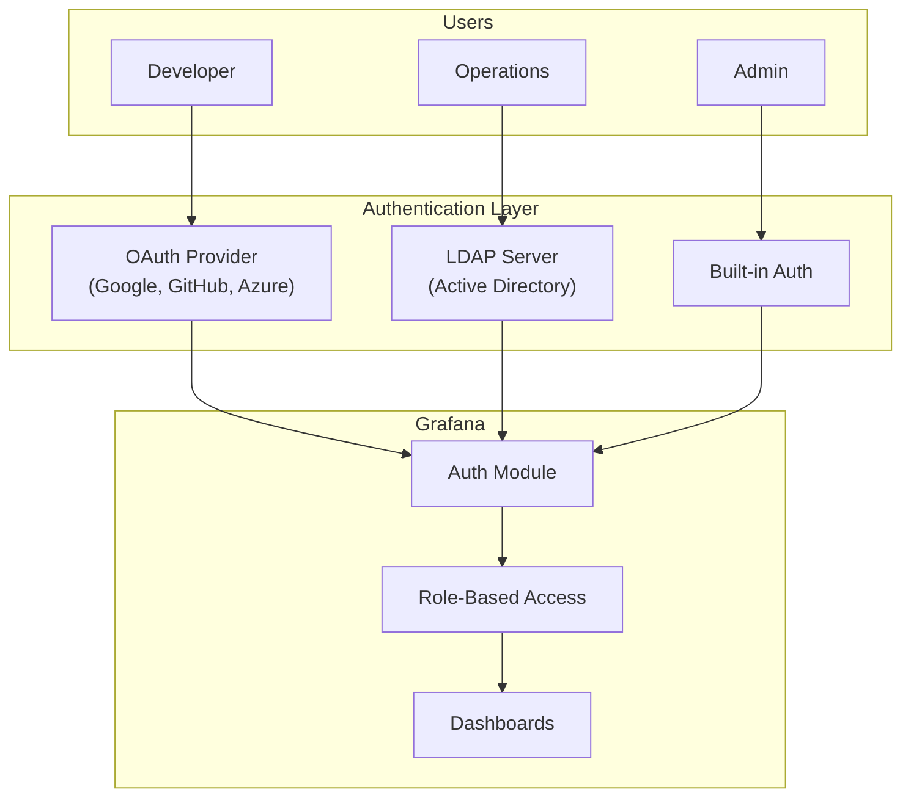
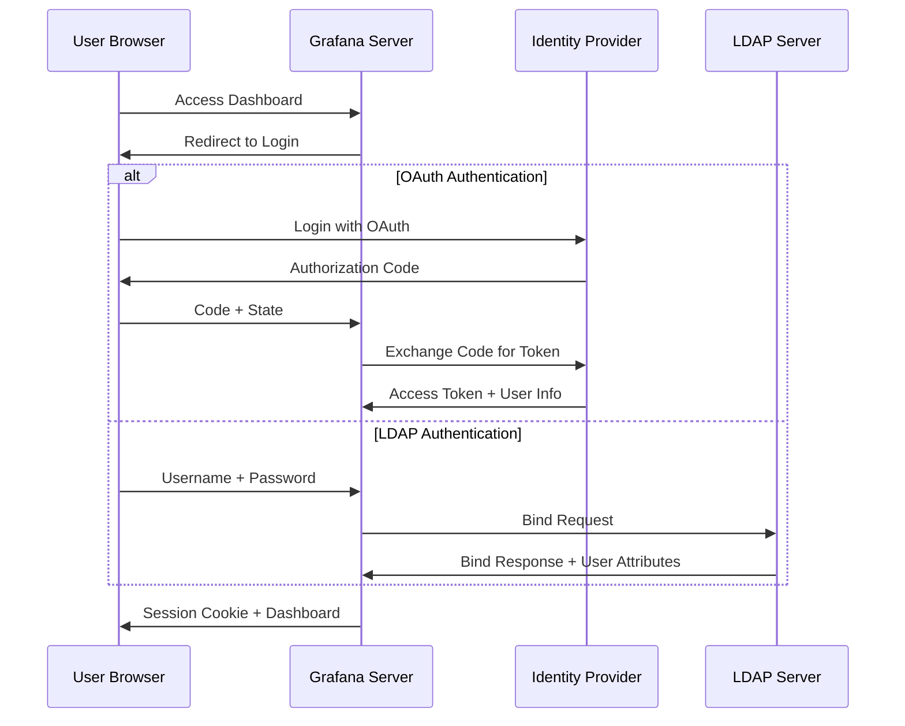
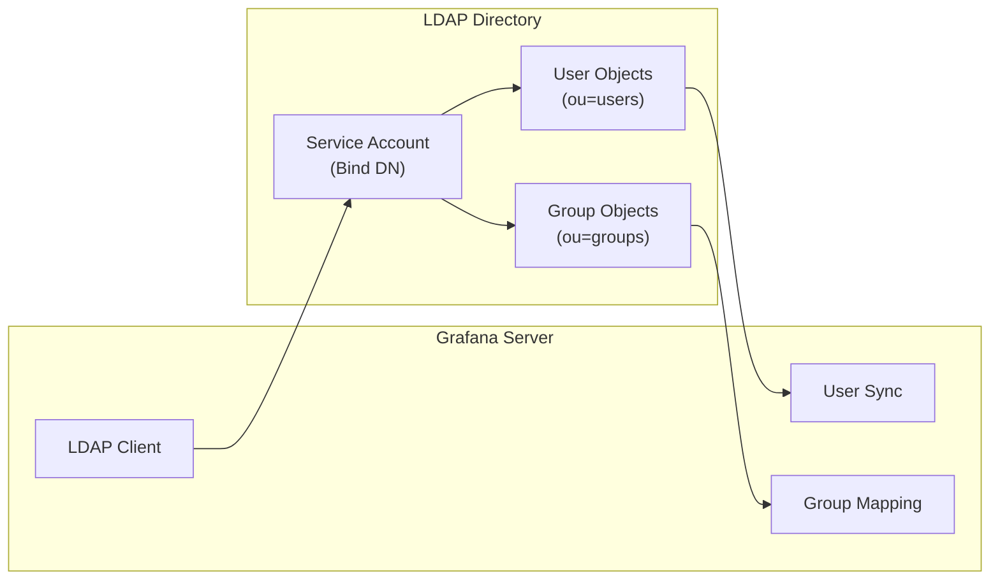
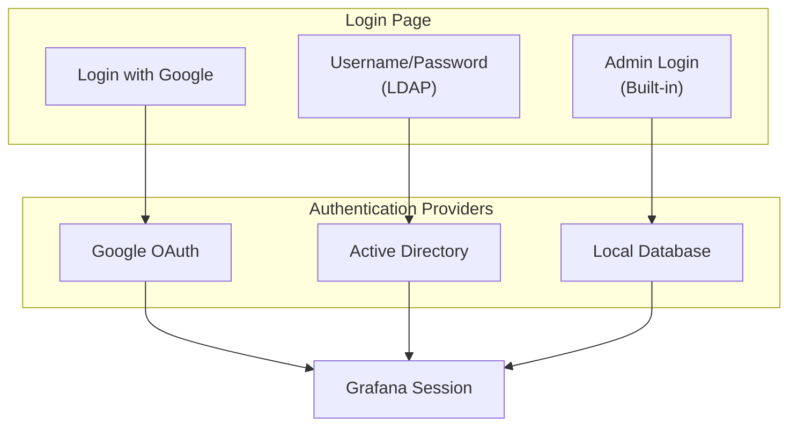
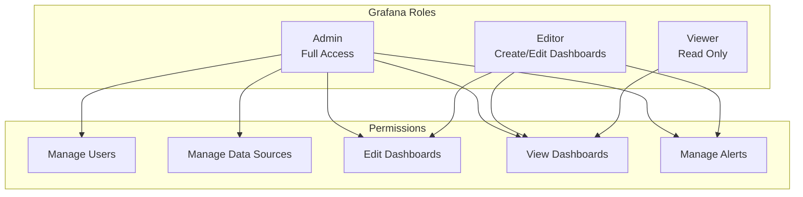

# How to Configure Grafana Authentication (OAuth, LDAP)

Author: [nawazdhandala](https://www.github.com/nawazdhandala)

Tags: Grafana, Authentication, OAuth, LDAP, SSO, Security, Monitoring, Observability

Description: A practical guide to configuring Grafana authentication using OAuth providers like Google, GitHub, and Azure AD, as well as LDAP integration for enterprise directory services. Learn how to secure your Grafana dashboards with proper identity management.

---

> Securing Grafana dashboards requires proper authentication configuration. Whether you need OAuth for modern identity providers or LDAP for enterprise directory integration, Grafana supports multiple authentication methods that can work together or independently.

Managing who can access your monitoring dashboards matters as much as the data they display. A misconfigured Grafana instance could expose sensitive infrastructure metrics to unauthorized users.

---

## Overview



Grafana supports multiple authentication backends simultaneously. You can enable OAuth for developers, LDAP for enterprise users, and keep built-in authentication as a fallback for administrators.

---

## Authentication Flow



---

## Grafana Configuration Basics

Grafana reads configuration from `/etc/grafana/grafana.ini` or environment variables. All authentication settings live under specific sections in the configuration file.

### Configuration File Location

Configuration files vary by installation method:

| Installation | Config Path |
|-------------|-------------|
| Package (apt/yum) | `/etc/grafana/grafana.ini` |
| Docker | `/etc/grafana/grafana.ini` or env vars |
| Helm/Kubernetes | ConfigMap or values.yaml |
| Binary | `./conf/defaults.ini` |

### Environment Variable Override

Every configuration option can be set via environment variables using the format `GF_<SECTION>_<OPTION>`. Here is how the pattern works:

```bash
# Example: Set the admin password
# Config: [security] admin_password = secret
# Env var: GF_SECURITY_ADMIN_PASSWORD=secret

# Example: Enable anonymous access
# Config: [auth.anonymous] enabled = true
# Env var: GF_AUTH_ANONYMOUS_ENABLED=true
```

---

## OAuth Configuration

### Google OAuth Setup

Google OAuth provides a straightforward way to authenticate users with their Google accounts. Start by creating credentials in the Google Cloud Console.

**Step 1: Create OAuth Credentials in Google Cloud**

Navigate to the Google Cloud Console, create a new project or select an existing one, then go to APIs & Services > Credentials > Create Credentials > OAuth Client ID.

**Step 2: Configure the OAuth consent screen and set the authorized redirect URI**

The redirect URI follows the pattern: `https://grafana.yourdomain.com/login/google`

**Step 3: Update Grafana configuration with your Google OAuth credentials**

```ini
# /etc/grafana/grafana.ini
# Google OAuth configuration section
# Replace client_id and client_secret with values from Google Cloud Console

[auth.google]
# Enable Google OAuth authentication
enabled = true

# OAuth client credentials from Google Cloud Console
client_id = YOUR_GOOGLE_CLIENT_ID.apps.googleusercontent.com
client_secret = YOUR_GOOGLE_CLIENT_SECRET

# Scopes determine what user information Grafana can access
# openid email profile provides basic user identity
scopes = openid email profile

# Redirect URL must match exactly what you configured in Google Cloud
auth_url = https://accounts.google.com/o/oauth2/auth
token_url = https://accounts.google.com/o/oauth2/token

# Allow users to sign up automatically on first login
allow_sign_up = true

# Restrict access to specific Google Workspace domain
# Leave empty to allow any Google account
allowed_domains = yourdomain.com

# Map Google users to Grafana roles based on email domain
# Users from yourdomain.com get Editor role by default
role_attribute_path = contains(email, '@yourdomain.com') && 'Editor' || 'Viewer'
```

### GitHub OAuth Setup

GitHub OAuth works well for development teams already using GitHub for version control. Create an OAuth application in your GitHub organization settings.

**Step 1: Register a new OAuth application in GitHub**

Go to Settings > Developer settings > OAuth Apps > New OAuth App. Set the authorization callback URL to `https://grafana.yourdomain.com/login/github`.

**Step 2: Configure Grafana with GitHub OAuth credentials**

```ini
# /etc/grafana/grafana.ini
# GitHub OAuth configuration
# Ideal for teams already using GitHub for development workflows

[auth.github]
enabled = true

# OAuth app credentials from GitHub
client_id = YOUR_GITHUB_CLIENT_ID
client_secret = YOUR_GITHUB_CLIENT_SECRET

# Request read access to user profile and organization membership
scopes = user:email,read:org

auth_url = https://github.com/login/oauth/authorize
token_url = https://github.com/login/oauth/access_token
api_url = https://api.github.com/user

allow_sign_up = true

# Restrict access to specific GitHub organizations
# Users must be members of at least one listed organization
allowed_organizations = your-org another-org

# Restrict to specific teams within organizations
# Format: organization/team-slug
team_ids = your-org/devops-team your-org/platform-team

# Role mapping based on team membership
# Members of devops-team get Admin role
role_attribute_path = contains(groups[*], '@your-org/devops-team') && 'Admin' || 'Viewer'
```

### Azure AD OAuth Setup

Azure Active Directory integration enables enterprise SSO with Microsoft 365 and Azure services.

**Step 1: Register an application in Azure Portal**

Navigate to Azure Active Directory > App registrations > New registration. Set the redirect URI type to Web with the value `https://grafana.yourdomain.com/login/azuread`.

**Step 2: Create a client secret under Certificates & secrets**

**Step 3: Configure API permissions for User.Read scope**

**Step 4: Update Grafana configuration**

```ini
# /etc/grafana/grafana.ini
# Azure AD OAuth configuration
# Enterprise SSO integration with Microsoft identity platform

[auth.azuread]
enabled = true

# Application (client) ID from Azure Portal
client_id = YOUR_AZURE_CLIENT_ID

# Client secret value (not the secret ID)
client_secret = YOUR_AZURE_CLIENT_SECRET

# Azure AD endpoints - replace TENANT_ID with your directory ID
# Use 'common' for multi-tenant apps, specific tenant ID for single-tenant
auth_url = https://login.microsoftonline.com/TENANT_ID/oauth2/v2.0/authorize
token_url = https://login.microsoftonline.com/TENANT_ID/oauth2/v2.0/token

# Scopes for Microsoft Graph API access
scopes = openid email profile

allow_sign_up = true

# Restrict to specific Azure AD groups
# Users must be members of at least one listed group
allowed_groups = grafana-admins grafana-editors grafana-viewers

# Role mapping based on Azure AD group membership
# Uses JMESPath expressions to evaluate group claims
role_attribute_path = contains(groups[*], 'grafana-admins') && 'Admin' || contains(groups[*], 'grafana-editors') && 'Editor' || 'Viewer'

# Enable group synchronization
# Grafana teams will mirror Azure AD group membership
skip_org_role_sync = false
```

---

## LDAP Configuration

### LDAP Architecture



LDAP authentication requires a separate configuration file in addition to grafana.ini. Grafana uses a service account (Bind DN) to search for users and verify their credentials.

### Enable LDAP in grafana.ini

First, enable LDAP and specify the configuration file location:

```ini
# /etc/grafana/grafana.ini
# Enable LDAP authentication and specify config file location

[auth.ldap]
# Enable LDAP authentication
enabled = true

# Path to LDAP-specific configuration file
# Contains server details, search parameters, and group mappings
config_file = /etc/grafana/ldap.toml

# Allow users to sign up automatically on first LDAP login
allow_sign_up = true

# Sync user information on every login
# Ensures Grafana reflects current LDAP state
sync_cron = "0 0 1 * * *"
active_sync_enabled = true
```

### Basic LDAP Configuration

Create the LDAP configuration file with server details and search parameters:

```toml
# /etc/grafana/ldap.toml
# LDAP configuration for Active Directory integration

# Primary LDAP server configuration
[[servers]]
# LDAP server hostname or IP address
# Use FQDN for SSL certificate validation
host = "ldap.yourdomain.com"

# Port 389 for LDAP, 636 for LDAPS, 3268 for Global Catalog
port = 636

# Use SSL/TLS for encrypted connections
use_ssl = true

# StartTLS upgrades plain connection to TLS
# Set to false when using port 636 (LDAPS)
start_tls = false

# Skip SSL certificate verification (not recommended for production)
ssl_skip_verify = false

# Path to CA certificate for validating LDAP server certificate
root_ca_cert = "/etc/grafana/ldap-ca.crt"

# Service account credentials for searching the directory
# Account needs read access to user and group objects
bind_dn = "cn=grafana-svc,ou=service-accounts,dc=yourdomain,dc=com"
bind_password = "${LDAP_BIND_PASSWORD}"

# Timeout for LDAP operations in seconds
timeout = 10

# Base DN where user searches begin
# All users must be somewhere under this DN
search_base_dns = ["ou=users,dc=yourdomain,dc=com"]

# LDAP filter to find user objects
# %s gets replaced with the login username
search_filter = "(sAMAccountName=%s)"

# Attribute mappings translate LDAP attributes to Grafana user fields
[servers.attributes]
# Common attribute names differ between directory types:
# Active Directory: sAMAccountName, userPrincipalName, memberOf
# OpenLDAP: uid, mail, member
name = "givenName"
surname = "sn"
username = "sAMAccountName"
member_of = "memberOf"
email = "mail"
```

### LDAP Group Mapping

Map LDAP groups to Grafana roles and organizations:

```toml
# /etc/grafana/ldap.toml
# Group mapping section - defines how LDAP groups translate to Grafana roles

# Grafana Admin role mapping
# Members of this group get full administrative access
[[servers.group_mappings]]
# DN of the LDAP group
group_dn = "cn=grafana-admins,ou=groups,dc=yourdomain,dc=com"
# Grafana organization ID (1 is the default org)
org_id = 1
# Grafana role: Admin, Editor, or Viewer
org_role = "Admin"
# Make members Grafana server administrators
grafana_admin = true

# Editor role mapping for DevOps team
[[servers.group_mappings]]
group_dn = "cn=devops-team,ou=groups,dc=yourdomain,dc=com"
org_id = 1
org_role = "Editor"

# Viewer role for general staff
[[servers.group_mappings]]
group_dn = "cn=all-staff,ou=groups,dc=yourdomain,dc=com"
org_id = 1
org_role = "Viewer"

# Catch-all for users without specific group membership
# Assign minimal Viewer role to prevent login failures
[[servers.group_mappings]]
group_dn = "*"
org_id = 1
org_role = "Viewer"
```

### LDAP with Multiple Servers

For high availability, configure multiple LDAP servers:

```toml
# /etc/grafana/ldap.toml
# High availability LDAP configuration with primary and secondary servers

# Primary LDAP server
[[servers]]
host = "ldap1.yourdomain.com"
port = 636
use_ssl = true
bind_dn = "cn=grafana-svc,ou=service-accounts,dc=yourdomain,dc=com"
bind_password = "${LDAP_BIND_PASSWORD}"
search_base_dns = ["ou=users,dc=yourdomain,dc=com"]
search_filter = "(sAMAccountName=%s)"

[servers.attributes]
name = "givenName"
surname = "sn"
username = "sAMAccountName"
member_of = "memberOf"
email = "mail"

[[servers.group_mappings]]
group_dn = "cn=grafana-admins,ou=groups,dc=yourdomain,dc=com"
org_id = 1
org_role = "Admin"

# Secondary LDAP server (failover)
# Grafana tries servers in order until one succeeds
[[servers]]
host = "ldap2.yourdomain.com"
port = 636
use_ssl = true
bind_dn = "cn=grafana-svc,ou=service-accounts,dc=yourdomain,dc=com"
bind_password = "${LDAP_BIND_PASSWORD}"
search_base_dns = ["ou=users,dc=yourdomain,dc=com"]
search_filter = "(sAMAccountName=%s)"

[servers.attributes]
name = "givenName"
surname = "sn"
username = "sAMAccountName"
member_of = "memberOf"
email = "mail"

[[servers.group_mappings]]
group_dn = "cn=grafana-admins,ou=groups,dc=yourdomain,dc=com"
org_id = 1
org_role = "Admin"
```

---

## Docker Deployment

### Docker Compose with OAuth

Deploy Grafana with OAuth configuration using Docker Compose:

```yaml
# docker-compose.yml
# Grafana deployment with Google OAuth authentication

version: '3.8'

services:
  grafana:
    image: grafana/grafana:10.4.0
    container_name: grafana
    restart: unless-stopped
    ports:
      - "3000:3000"
    environment:
      # Basic Grafana settings
      GF_SERVER_ROOT_URL: https://grafana.yourdomain.com
      GF_SERVER_DOMAIN: grafana.yourdomain.com

      # Security settings
      GF_SECURITY_ADMIN_USER: admin
      GF_SECURITY_ADMIN_PASSWORD: ${GRAFANA_ADMIN_PASSWORD}

      # Google OAuth configuration via environment variables
      GF_AUTH_GOOGLE_ENABLED: "true"
      GF_AUTH_GOOGLE_CLIENT_ID: ${GOOGLE_CLIENT_ID}
      GF_AUTH_GOOGLE_CLIENT_SECRET: ${GOOGLE_CLIENT_SECRET}
      GF_AUTH_GOOGLE_SCOPES: openid email profile
      GF_AUTH_GOOGLE_AUTH_URL: https://accounts.google.com/o/oauth2/auth
      GF_AUTH_GOOGLE_TOKEN_URL: https://accounts.google.com/o/oauth2/token
      GF_AUTH_GOOGLE_ALLOWED_DOMAINS: yourdomain.com
      GF_AUTH_GOOGLE_ALLOW_SIGN_UP: "true"

      # Disable basic authentication for OAuth-only access
      # GF_AUTH_BASIC_ENABLED: "false"

    volumes:
      # Persist Grafana data (dashboards, users, etc.)
      - grafana-data:/var/lib/grafana
    networks:
      - monitoring

volumes:
  grafana-data:

networks:
  monitoring:
    driver: bridge
```

### Docker Compose with LDAP

Configure LDAP authentication in Docker:

```yaml
# docker-compose.yml
# Grafana deployment with LDAP authentication

version: '3.8'

services:
  grafana:
    image: grafana/grafana:10.4.0
    container_name: grafana
    restart: unless-stopped
    ports:
      - "3000:3000"
    environment:
      GF_SERVER_ROOT_URL: https://grafana.yourdomain.com
      GF_SECURITY_ADMIN_USER: admin
      GF_SECURITY_ADMIN_PASSWORD: ${GRAFANA_ADMIN_PASSWORD}

      # Enable LDAP authentication
      GF_AUTH_LDAP_ENABLED: "true"
      GF_AUTH_LDAP_CONFIG_FILE: /etc/grafana/ldap.toml
      GF_AUTH_LDAP_ALLOW_SIGN_UP: "true"

    volumes:
      - grafana-data:/var/lib/grafana
      # Mount LDAP configuration file
      - ./ldap.toml:/etc/grafana/ldap.toml:ro
      # Mount CA certificate for LDAPS
      - ./ldap-ca.crt:/etc/grafana/ldap-ca.crt:ro
    networks:
      - monitoring

volumes:
  grafana-data:

networks:
  monitoring:
    driver: bridge
```

---

## Kubernetes Deployment

### Helm Values for OAuth

Deploy Grafana on Kubernetes using Helm with OAuth configuration:

```yaml
# values.yaml
# Helm values for Grafana with GitHub OAuth

image:
  repository: grafana/grafana
  tag: 10.4.0

replicas: 2

ingress:
  enabled: true
  annotations:
    kubernetes.io/ingress.class: nginx
    cert-manager.io/cluster-issuer: letsencrypt-prod
  hosts:
    - grafana.yourdomain.com
  tls:
    - secretName: grafana-tls
      hosts:
        - grafana.yourdomain.com

# Grafana configuration via Helm values
# These translate to grafana.ini settings
grafana.ini:
  server:
    root_url: https://grafana.yourdomain.com
    domain: grafana.yourdomain.com

  # GitHub OAuth settings
  auth.github:
    enabled: true
    allow_sign_up: true
    client_id: ${GITHUB_CLIENT_ID}
    client_secret: ${GITHUB_CLIENT_SECRET}
    scopes: user:email,read:org
    auth_url: https://github.com/login/oauth/authorize
    token_url: https://github.com/login/oauth/access_token
    api_url: https://api.github.com/user
    allowed_organizations: your-org
    role_attribute_path: contains(groups[*], '@your-org/platform-team') && 'Admin' || 'Editor'

# Store sensitive values in a Kubernetes Secret
envFromSecret: grafana-oauth-secrets

persistence:
  enabled: true
  size: 10Gi
  storageClassName: standard

resources:
  requests:
    memory: 256Mi
    cpu: 100m
  limits:
    memory: 512Mi
    cpu: 200m
```

### Create the OAuth secrets

```yaml
# grafana-oauth-secrets.yaml
# Kubernetes Secret for OAuth credentials

apiVersion: v1
kind: Secret
metadata:
  name: grafana-oauth-secrets
  namespace: monitoring
type: Opaque
stringData:
  # GitHub OAuth credentials
  GF_AUTH_GITHUB_CLIENT_ID: "your-github-client-id"
  GF_AUTH_GITHUB_CLIENT_SECRET: "your-github-client-secret"
```

### Helm Values for LDAP

```yaml
# values.yaml
# Helm values for Grafana with LDAP authentication

image:
  repository: grafana/grafana
  tag: 10.4.0

grafana.ini:
  server:
    root_url: https://grafana.yourdomain.com

  auth.ldap:
    enabled: true
    config_file: /etc/grafana/ldap.toml
    allow_sign_up: true

# Mount LDAP configuration from ConfigMap
extraConfigmapMounts:
  - name: ldap-config
    mountPath: /etc/grafana/ldap.toml
    subPath: ldap.toml
    configMap: grafana-ldap-config
    readOnly: true

# Mount LDAP CA certificate from Secret
extraSecretMounts:
  - name: ldap-ca
    mountPath: /etc/grafana/ldap-ca.crt
    subPath: ldap-ca.crt
    secretName: grafana-ldap-ca
    readOnly: true

# LDAP bind password from Secret
envFromSecret: grafana-ldap-secrets
```

### LDAP ConfigMap

```yaml
# grafana-ldap-configmap.yaml
# ConfigMap containing LDAP configuration

apiVersion: v1
kind: ConfigMap
metadata:
  name: grafana-ldap-config
  namespace: monitoring
data:
  ldap.toml: |
    [[servers]]
    host = "ldap.yourdomain.com"
    port = 636
    use_ssl = true
    ssl_skip_verify = false
    root_ca_cert = "/etc/grafana/ldap-ca.crt"
    bind_dn = "cn=grafana-svc,ou=service-accounts,dc=yourdomain,dc=com"
    bind_password = "${LDAP_BIND_PASSWORD}"
    search_base_dns = ["ou=users,dc=yourdomain,dc=com"]
    search_filter = "(sAMAccountName=%s)"

    [servers.attributes]
    name = "givenName"
    surname = "sn"
    username = "sAMAccountName"
    member_of = "memberOf"
    email = "mail"

    [[servers.group_mappings]]
    group_dn = "cn=grafana-admins,ou=groups,dc=yourdomain,dc=com"
    org_id = 1
    org_role = "Admin"
    grafana_admin = true

    [[servers.group_mappings]]
    group_dn = "*"
    org_id = 1
    org_role = "Viewer"
```

---

## Combining OAuth and LDAP

Grafana can use multiple authentication providers simultaneously. Users choose their preferred method on the login page.



### Multi-Provider Configuration

Enable both OAuth and LDAP in a single configuration:

```ini
# /etc/grafana/grafana.ini
# Multi-provider authentication configuration

[server]
root_url = https://grafana.yourdomain.com
domain = grafana.yourdomain.com

# Disable anonymous access
[auth.anonymous]
enabled = false

# Keep basic auth as admin fallback
[auth.basic]
enabled = true

# Google OAuth for external users and contractors
[auth.google]
enabled = true
client_id = YOUR_GOOGLE_CLIENT_ID
client_secret = YOUR_GOOGLE_CLIENT_SECRET
scopes = openid email profile
auth_url = https://accounts.google.com/o/oauth2/auth
token_url = https://accounts.google.com/o/oauth2/token
allowed_domains = contractor-domain.com
allow_sign_up = true

# LDAP for internal employees
[auth.ldap]
enabled = true
config_file = /etc/grafana/ldap.toml
allow_sign_up = true

# Auto-login configuration
# Redirect users directly to a specific auth provider
# Set to the provider name: google, github, azuread, ldap
# Leave empty to show login page with all options
[auth]
oauth_auto_login = false
disable_login_form = false
```

---

## Security Best Practices

### Session Management

Configure secure session handling:

```ini
# /etc/grafana/grafana.ini
# Session security configuration

[security]
# Enforce HTTPS for all connections
cookie_secure = true

# Restrict cookies to same-site requests
cookie_samesite = strict

# Disable embedding in iframes (clickjacking protection)
allow_embedding = false

# Content Security Policy
content_security_policy = true

# Session cookie name
login_cookie_name = grafana_session

[session]
# Session lifetime in seconds (24 hours)
session_life_time = 86400

# Cookie lifetime for "remember me" in days
login_maximum_inactive_lifetime_duration = 7d

# Cookie lifetime for all sessions in days
login_maximum_lifetime_duration = 30d
```

### Role-Based Access Control



Configure default roles and permissions:

```ini
# /etc/grafana/grafana.ini
# Role and permission settings

[users]
# Default role for new users (Admin, Editor, Viewer)
auto_assign_org_role = Viewer

# Automatically add new users to the main organization
auto_assign_org = true
auto_assign_org_id = 1

# Allow users to create their own organizations
allow_org_create = false

# Viewer role permissions
[viewers]
viewers_can_edit = false

[editors]
editors_can_admin = false
```

---

## Troubleshooting

### Debug LDAP Connections

Enable LDAP debug logging to diagnose connection issues:

```ini
# /etc/grafana/grafana.ini
# Enable debug logging for LDAP troubleshooting

[log]
# Set log level to debug for verbose output
level = debug

# Filter logs to show only LDAP-related messages
filters = ldap:debug
```

### Test LDAP Configuration

Use the Grafana CLI to test LDAP settings without logging in:

```bash
# Test LDAP connection and user lookup
# Replace 'testuser' with an actual LDAP username
grafana-cli admin ldap test testuser

# Reload LDAP configuration without restart
grafana-cli admin ldap reload
```

### Common OAuth Issues

| Issue | Cause | Solution |
|-------|-------|----------|
| Redirect URI mismatch | OAuth callback URL differs from configured value | Verify redirect URI in IdP matches root_url/login/provider |
| Invalid client credentials | Wrong client ID or secret | Regenerate credentials in IdP console |
| User not authorized | User not in allowed domains/orgs | Check allowed_domains or allowed_organizations settings |
| Token validation failed | Clock skew between servers | Sync server time with NTP |
| CORS errors | Missing allowed origins | Configure allowed origins in IdP settings |

### Common LDAP Issues

| Issue | Cause | Solution |
|-------|-------|----------|
| Connection refused | Wrong port or firewall blocking | Verify port 636/389 is open and LDAP server is reachable |
| Certificate error | Invalid or self-signed cert | Add CA cert to root_ca_cert or set ssl_skip_verify (not recommended) |
| Bind failed | Wrong service account credentials | Verify bind_dn and bind_password are correct |
| User not found | Incorrect search base or filter | Check search_base_dns and search_filter syntax |
| Group mapping failed | Wrong group DN format | Verify group DNs match exactly including case |

---

## Monitoring Authentication

Track authentication events and failures with Grafana metrics:

```yaml
# prometheus-rules.yaml
# Alerting rules for Grafana authentication issues

groups:
  - name: grafana-auth
    rules:
      - alert: GrafanaAuthFailures
        expr: increase(grafana_api_login_failures_total[5m]) > 10
        for: 5m
        labels:
          severity: warning
        annotations:
          summary: High number of Grafana login failures
          description: "More than 10 login failures in the last 5 minutes"

      - alert: GrafanaLDAPDown
        expr: grafana_ldap_request_duration_seconds_count == 0
        for: 10m
        labels:
          severity: critical
        annotations:
          summary: Grafana LDAP connectivity lost
          description: "No LDAP requests in the last 10 minutes"
```

Integrate authentication monitoring with [OneUptime](https://oneuptime.com) to get alerts when authentication services fail or experience unusual activity.

---

## Conclusion

Configuring Grafana authentication properly protects your monitoring infrastructure from unauthorized access. Key takeaways:

- **OAuth providers** (Google, GitHub, Azure AD) offer seamless SSO for modern teams
- **LDAP integration** connects Grafana to enterprise directories like Active Directory
- **Multiple providers** can work together, giving users authentication options
- **Group mapping** automates role assignment based on directory group membership
- **Security settings** like TLS, session management, and RBAC add defense in depth

For complete infrastructure monitoring including authentication service health, consider using [OneUptime](https://oneuptime.com) to track the availability of your identity providers and alert when users cannot log in to critical dashboards.

---

*Need to monitor your Grafana infrastructure and authentication services? [OneUptime](https://oneuptime.com) provides comprehensive monitoring for your observability stack, ensuring your team always has access to critical dashboards and metrics.*
