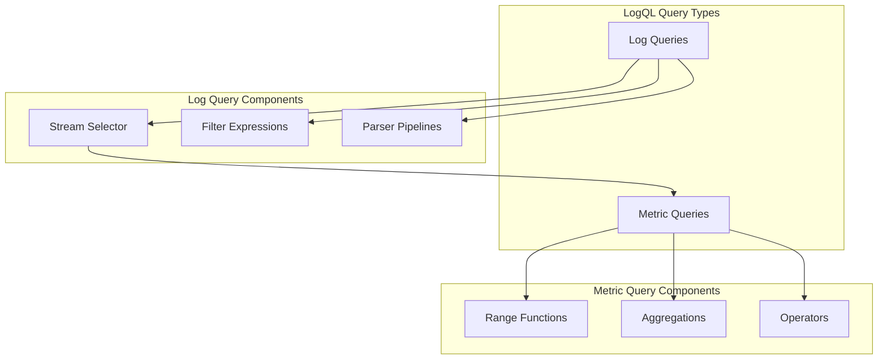
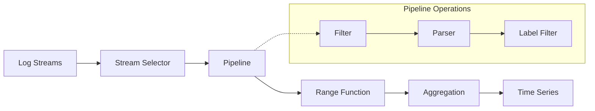
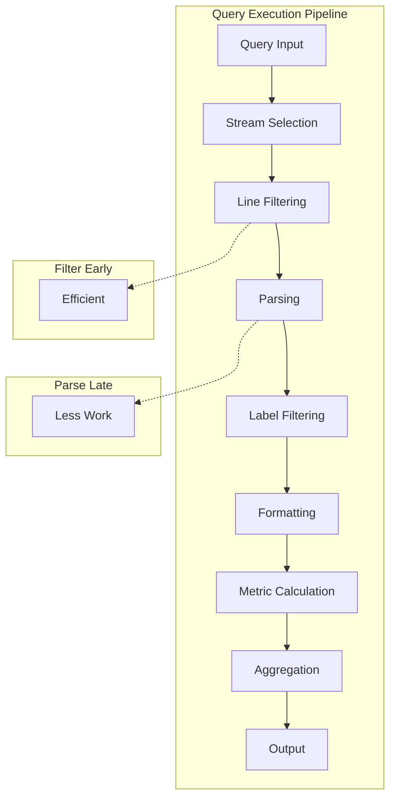
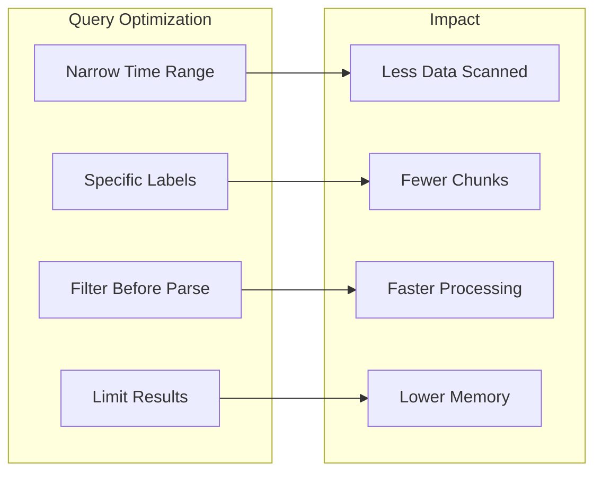
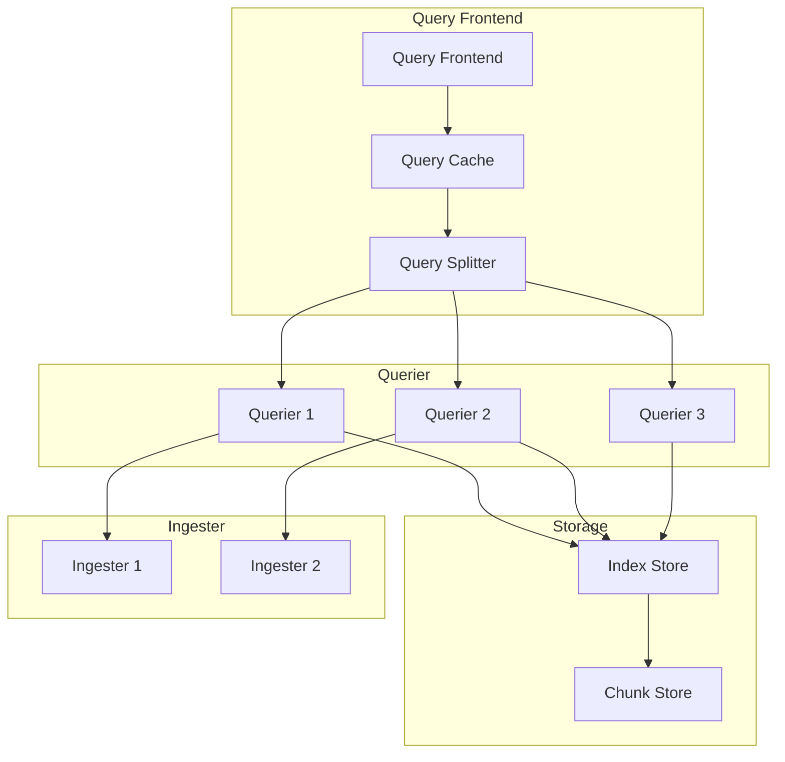

# How to Build Grafana LogQL Queries for Loki

Author: [nawazdhandala](https://www.github.com/nawazdhandala)

Tags: Grafana, Loki, LogQL, Log Management, Observability, Monitoring, DevOps

Description: Learn how to build powerful LogQL queries in Grafana for analyzing logs stored in Loki. Master log stream selectors, filter expressions, aggregations, and real-world query patterns.

---

Loki is Grafana's log aggregation system, designed to be cost-effective and easy to operate. Unlike other log systems that index the full content of logs, Loki only indexes metadata (labels), making it highly efficient. LogQL is the query language used to interact with Loki, and mastering it unlocks the full potential of your log data.

## Understanding LogQL Fundamentals

LogQL combines two types of operations: log queries that return log lines and metric queries that calculate values from logs.



## Log Stream Selectors

Stream selectors form the foundation of every LogQL query. They filter logs based on labels attached during ingestion.

### Basic Label Matching

Label matchers use curly braces to specify which log streams to query. The following query retrieves all logs from the nginx application in the production namespace.

```logql
# Select logs from a specific application and namespace
# The = operator performs exact string matching
{app="nginx", namespace="production"}
```

### Label Matching Operators

LogQL supports four label matching operators for flexible stream selection. Each operator serves a different filtering purpose.

```logql
# Exact match - returns logs where app label equals "api-gateway"
{app="api-gateway"}

# Not equal - excludes logs where environment is "development"
{app="api-gateway", environment!="development"}

# Regex match - selects logs where app starts with "payment"
{app=~"payment.*"}

# Negative regex - excludes logs matching the pattern
{namespace=~"prod-.*", app!~"test-.*"}
```

### Combining Multiple Label Selectors

Complex queries often need multiple label conditions. All label matchers within a selector use AND logic.

```logql
# Multiple conditions combined with AND logic
# Selects production API logs excluding internal services
{
    namespace="production",
    app=~"api-.*",
    team!="platform",
    environment="live"
}
```

## Line Filter Expressions

After selecting log streams, filter expressions narrow down specific log lines based on content.

### Basic Line Filters

Line filters check if log lines contain specific text. The pipe symbol chains filters after the stream selector.

```logql
# Filter for lines containing "error" (case-sensitive)
{app="backend"} |= "error"

# Filter for lines NOT containing "debug"
{app="backend"} != "debug"

# Case-insensitive filter using regex
{app="backend"} |~ "(?i)error"

# Exclude lines matching a pattern
{app="backend"} !~ "health.*check"
```

### Chaining Multiple Filters

Multiple filters create powerful queries by progressively narrowing results. Filters execute from left to right.

```logql
# Find error logs excluding health checks and containing user IDs
# Each filter reduces the result set further
{app="authentication"}
    |= "error"
    != "healthcheck"
    |~ "user_id=[0-9]+"
```

## Parser Expressions

Parsers extract structured data from log lines, enabling label-based filtering on log content.

### JSON Parser

When your logs are JSON formatted, the json parser extracts all fields as labels.

```logql
# Parse JSON logs and filter by extracted fields
# Original log: {"level":"error","message":"connection failed","user_id":12345}
{app="api"} | json | level="error"

# Extract only specific fields to reduce memory usage
{app="api"} | json level, user_id, message

# Filter on extracted JSON fields
{app="api"} | json | user_id > 1000 | level="error"
```

### Logfmt Parser

Logfmt is a common log format using key=value pairs. The logfmt parser handles these efficiently.

```logql
# Parse logfmt structured logs
# Original log: level=error msg="database timeout" duration=5.2s
{app="database-service"} | logfmt

# Filter on parsed fields
{app="database-service"} | logfmt | level="error" | duration > 1s

# Extract specific fields only
{app="database-service"} | logfmt level, msg, duration
```

### Pattern Parser

The pattern parser extracts fields from semi-structured logs using a template syntax.

```logql
# Parse Apache-style access logs
# Original: 192.168.1.1 - - [10/Oct/2023:13:55:36 -0700] "GET /api/users HTTP/1.1" 200 2326
{app="nginx"}
    | pattern `<ip> - - [<timestamp>] "<method> <path> <protocol>" <status> <bytes>`
    | status >= 400

# Parse custom application logs
# Original: [2023-10-10 13:55:36] ERROR UserService - Failed to authenticate user
{app="backend"}
    | pattern `[<timestamp>] <level> <service> - <message>`
    | level="ERROR"
    | service="UserService"
```

### Regexp Parser

For complex log formats, the regexp parser provides full regex control with named capture groups.

```logql
# Extract data using named capture groups
# Original: Request processed in 234ms for user john@example.com
{app="api"}
    | regexp `processed in (?P<duration>\d+)ms for user (?P<email>\S+)`
    | duration > 100

# Parse multi-format logs
{app="legacy"}
    | regexp `(?P<level>INFO|WARN|ERROR)\s+\[(?P<thread>[^\]]+)\]\s+(?P<message>.*)`
    | level="ERROR"
```

## Line Format Expressions

Line format expressions transform log lines for better readability or downstream processing.

```logql
# Reformat log output to show only relevant information
{app="api"} | json
    | line_format "{{.level}} - {{.message}} [user={{.user_id}}]"

# Include computed values in output
{app="api"} | json
    | line_format `{{.timestamp}} {{.level | ToUpper}} {{.message}}`

# Conditional formatting using template functions
{app="api"} | json
    | line_format `{{ if eq .level "error" }}ALERT: {{end}}{{.message}}`
```

## Label Format Expressions

Label format expressions modify or create new labels from existing ones.

```logql
# Rename a label
{app="api"} | json
    | label_format service=app

# Combine labels into a new label
{app="api"} | json
    | label_format full_name="{{ .namespace }}/{{ .app }}"

# Transform label values
{app="api"} | json
    | label_format level_upper="{{ .level | ToUpper }}"
```

## Metric Queries

Metric queries transform log data into numeric time series for visualization and alerting.

### Log Query Flow

Understanding how metric queries process data helps write efficient queries.



### Rate Function

The rate function calculates log entries per second over a time range. Use it to track log volume and error rates.

```logql
# Calculate error logs per second over 5 minutes
rate({app="api"} |= "error" [5m])

# Track request rate by endpoint
sum by (path) (
    rate({app="api"} | json | __error__="" [5m])
)

# Compare error rates across environments
sum by (environment) (
    rate({app="api", level="error"} [5m])
)
```

### Count Over Time

Count over time returns the total number of log entries in a time range.

```logql
# Count errors in the last hour
count_over_time({app="api"} |= "error" [1h])

# Count unique users generating errors
count_over_time(
    {app="api"}
    | json
    | level="error"
    | user_id != ""
    [1h]
)
```

### Bytes Rate and Bytes Over Time

These functions measure log volume in bytes, useful for capacity planning and cost management.

```logql
# Calculate bytes per second by application
sum by (app) (
    bytes_rate({namespace="production"} [5m])
)

# Total bytes ingested per hour
sum(bytes_over_time({namespace="production"} [1h]))

# Identify verbose services generating excessive logs
topk(10,
    sum by (app) (
        bytes_rate({namespace="production"} [5m])
    )
)
```

### Unwrap for Numeric Metrics

The unwrap function extracts numeric values from parsed log fields for mathematical operations.

```logql
# Calculate average response time from logs
# Log format: {"path":"/api/users","duration_ms":234,"status":200}
avg_over_time(
    {app="api"}
    | json
    | unwrap duration_ms
    [5m]
)

# Calculate 95th percentile latency
quantile_over_time(0.95,
    {app="api"}
    | json
    | unwrap duration_ms
    [5m]
)

# Sum of bytes transferred
sum_over_time(
    {app="api"}
    | json
    | unwrap bytes_sent
    [1h]
)
```

## Aggregation Operators

Aggregation operators combine multiple time series into summarized results.

### Sum, Avg, Min, Max

Standard aggregation functions work on metric query results.

```logql
# Total error rate across all pods
sum(rate({app="api"} |= "error" [5m]))

# Average error rate per namespace
avg by (namespace) (
    rate({app="api"} |= "error" [5m])
)

# Maximum latency by service
max by (service) (
    avg_over_time(
        {app="api"}
        | json
        | unwrap latency_ms
        [5m]
    )
)
```

### TopK and BottomK

Identify the highest or lowest values in your data.

```logql
# Top 5 services by error rate
topk(5,
    sum by (app) (
        rate({namespace="production"} |= "error" [5m])
    )
)

# Bottom 3 endpoints by request volume
bottomk(3,
    sum by (path) (
        rate({app="api"} | json [5m])
    )
)
```

## Vector Matching and Binary Operations

Combine multiple queries using vector matching and arithmetic.

```logql
# Calculate error percentage
# Divides error count by total count
sum(rate({app="api"} |= "error" [5m]))
/
sum(rate({app="api"} [5m]))
* 100

# Compare current error rate to baseline
sum(rate({app="api"} |= "error" [5m]))
-
sum(rate({app="api"} |= "error" [5m] offset 1d))

# Alert threshold comparison
sum(rate({app="api"} |= "error" [5m])) > 10
```

## Query Pipeline Architecture

Understanding the query pipeline helps optimize complex queries.



## Real-World Query Patterns

### HTTP Error Analysis

Analyze HTTP errors with detailed breakdowns by status code and endpoint.

```logql
# Count HTTP errors by status code in the last hour
sum by (status) (
    count_over_time(
        {app="nginx"}
        | json
        | status >= 400
        [1h]
    )
)

# Error rate by endpoint with response codes
sum by (path, status) (
    rate(
        {app="api"}
        | json
        | status >= 500
        [5m]
    )
)

# Track 5xx errors over time for alerting
sum(rate({app="api"} | json | status >= 500 [5m])) > 0.1
```

### Latency Analysis

Monitor application performance through log-based latency metrics.

```logql
# P99 latency per service
quantile_over_time(0.99,
    {namespace="production"}
    | json
    | unwrap duration_ms
    [5m]
) by (app)

# Latency distribution buckets
# Uses label_format to create histogram buckets
sum by (bucket) (
    count_over_time(
        {app="api"}
        | json
        | label_format bucket="{{ if lt .duration_ms 100.0 }}fast{{ else if lt .duration_ms 500.0 }}medium{{ else }}slow{{ end }}"
        [1h]
    )
)

# Slow request identification
{app="api"}
| json
| duration_ms > 1000
| line_format "SLOW: {{.path}} took {{.duration_ms}}ms"
```

### Security Monitoring

Build security dashboards with LogQL queries.

```logql
# Failed authentication attempts by IP
sum by (client_ip) (
    count_over_time(
        {app="auth-service"}
        | json
        | event="login_failed"
        [1h]
    )
)

# Detect potential brute force attacks (more than 10 failures)
sum by (client_ip) (
    count_over_time(
        {app="auth-service"}
        | json
        | event="login_failed"
        [5m]
    )
) > 10

# Track privilege escalation events
{app="auth-service"}
| json
| event=~"permission_changed|role_assigned|admin_access"
| line_format "SECURITY: {{.user}} - {{.event}} - {{.details}}"
```

### Application Debugging

Find specific errors and trace request flows.

```logql
# Find all logs for a specific request ID
{namespace="production"} |= "request_id=abc-123-xyz"

# Stack trace extraction
{app="java-service"}
| json
| level="ERROR"
| message=~".*Exception.*"
| line_format "{{.timestamp}} {{.message}}\n{{.stacktrace}}"

# Trace request flow across services
{namespace="production"}
| json
| trace_id="abc-123"
| line_format "[{{.app}}] {{.timestamp}} {{.message}}"
```

## Performance Optimization

### Query Optimization Strategies

Efficient queries reduce load on Loki and return results faster.



### Label Cardinality Management

High cardinality labels increase query costs. Design labels carefully.

```logql
# BAD: High cardinality label query
# Avoid using unique identifiers as label matchers
{user_id="12345"}  # user_id should not be a label

# GOOD: Filter unique values in the pipeline
{app="api"} | json | user_id="12345"

# BAD: Regex on high cardinality label
{pod=~"api-.*"}

# GOOD: Use structured labels
{app="api", deployment="production"}
```

### Filter Early Principle

Apply line filters before parsing to reduce processing overhead.

```logql
# INEFFICIENT: Parse all logs then filter
{app="api"}
| json
| level="error"

# EFFICIENT: Filter first, then parse
{app="api"}
|= "error"  # Quick string filter first
| json
| level="error"  # Precise filter on parsed field
```

## Building Dashboards

### Creating Alert Rules

Use LogQL metric queries for Grafana alerting.

```logql
# Alert when error rate exceeds threshold
sum(rate({app="api"} |= "error" [5m])) > 10

# Alert on missing logs (potential service down)
absent_over_time({app="api"} [5m])

# Alert on sudden spike in errors (2x normal)
sum(rate({app="api"} |= "error" [5m]))
>
2 * sum(rate({app="api"} |= "error" [5m] offset 1h))
```

### Dashboard Variables

Use template variables in Grafana for interactive dashboards.

```logql
# Query using Grafana variables
{namespace="$namespace", app="$app"}
|= "$search_term"
| json
| level=~"$level"

# Dynamic aggregation based on selection
sum by ($group_by) (
    rate({namespace="$namespace"} [5m])
)
```

## Common Patterns Reference

### Quick Reference Table

| Pattern | Query Example | Use Case |
|---------|--------------|----------|
| Error count | `count_over_time({app="x"} \|= "error" [1h])` | Error tracking |
| Error rate | `rate({app="x"} \|= "error" [5m])` | Alerting |
| Latency P99 | `quantile_over_time(0.99, {app="x"} \| json \| unwrap latency [5m])` | SLA monitoring |
| Log volume | `bytes_rate({app="x"} [5m])` | Capacity planning |
| Top errors | `topk(10, sum by (error) (count_over_time({app="x"} \| json [1h])))` | Error analysis |

### Troubleshooting Query Errors

When queries fail or return unexpected results, check these common issues.

```logql
# Check for parsing errors
# __error__ label contains parser error messages
{app="api"} | json | __error__!=""

# Debug parsed fields
# Shows what the parser extracted
{app="api"} | json | line_format "{{__line__}} => level={{.level}}"

# Verify label extraction
{app="api"} | logfmt | label_format debug="parsed: {{.level}}"
```

## Loki Query Architecture

Understanding how Loki processes queries helps write better LogQL.



---

LogQL provides a powerful way to query and analyze logs in Grafana Loki. Start with simple stream selectors and line filters, then gradually incorporate parsers and metric queries as your needs grow. Remember to filter early, use specific labels, and leverage aggregations for dashboards and alerts. With these techniques, you can build comprehensive log analysis solutions that scale with your infrastructure.
