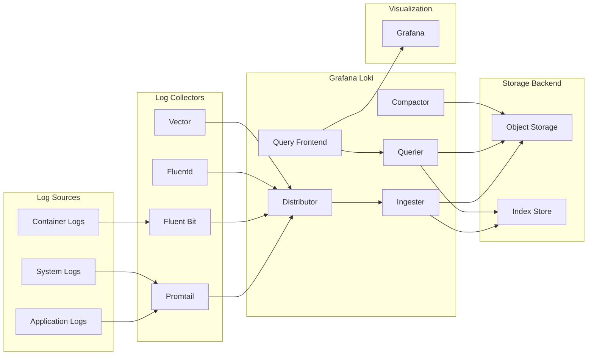
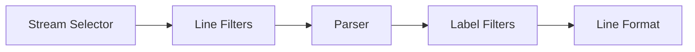
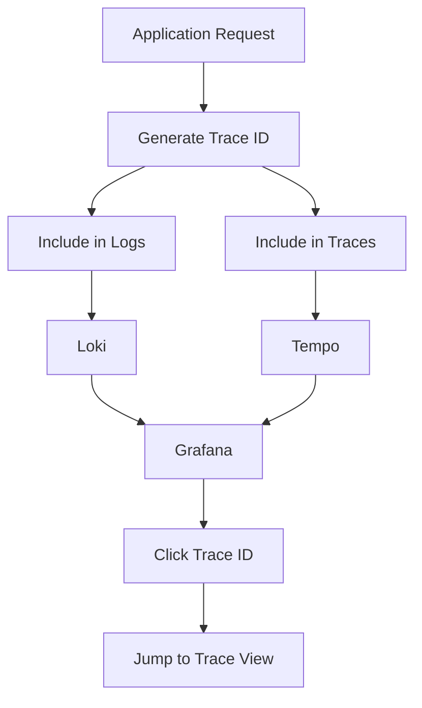

# How to Use Grafana Loki for Logs

Author: [nawazdhandala](https://www.github.com/nawazdhandala)

Tags: Grafana, Loki, Logging, Observability, LogQL, Promtail, Log Management

Description: A comprehensive guide to using Grafana Loki for log aggregation and analysis. Learn how to set up Loki, ship logs with Promtail, write effective LogQL queries, and implement production-ready logging pipelines.

---

Log management is a critical component of modern observability stacks. Grafana Loki has emerged as a powerful, cost-effective solution for log aggregation that integrates seamlessly with the Grafana ecosystem. Unlike traditional log management systems that index the full content of logs, Loki indexes only metadata (labels), making it significantly more efficient and easier to operate at scale. In this comprehensive guide, you will learn how to use Grafana Loki for logs from the ground up.

## What is Grafana Loki?

Grafana Loki is a horizontally scalable, highly available, multi-tenant log aggregation system inspired by Prometheus. It was designed by Grafana Labs to be cost-effective and easy to operate. The key design principle behind Loki is that it does not index the content of logs but rather indexes a set of labels for each log stream, similar to how Prometheus handles metrics.

This design choice means:
- Lower storage costs compared to full-text indexing systems
- Simpler operations with fewer resources required
- Natural integration with Prometheus labels and Grafana dashboards
- Efficient queries when you know what you are looking for

## Loki Architecture Overview

Understanding Loki's architecture helps you deploy and operate it effectively. Here is a visual representation of how logs flow through Loki:



The main components are:

- **Distributor**: Receives incoming log streams and distributes them to ingesters
- **Ingester**: Writes log data to long-term storage and serves recent data from memory
- **Querier**: Handles queries, fetching data from both ingesters and storage
- **Query Frontend**: Provides query scheduling and caching
- **Compactor**: Handles index compaction and retention

## Prerequisites

Before getting started, ensure you have:

- Docker and Docker Compose installed
- Basic understanding of YAML configuration
- Familiarity with command-line operations
- At least 4GB of available RAM for a development setup

## Setting Up Loki with Docker Compose

Let us start with a complete local setup that includes Loki, Promtail, and Grafana. First, create a project directory and the necessary configuration files.

The following Docker Compose file defines a complete logging stack with all three components networked together:

```yaml
# docker-compose.yml
# Complete Loki stack with Grafana for visualization and Promtail for log collection

version: "3.8"

services:
  # Loki is the core log aggregation service
  loki:
    image: grafana/loki:2.9.4
    container_name: loki
    ports:
      - "3100:3100"
    volumes:
      # Mount custom configuration file
      - ./loki-config.yaml:/etc/loki/local-config.yaml
      # Persist log data across container restarts
      - loki-data:/loki
    command: -config.file=/etc/loki/local-config.yaml
    restart: unless-stopped
    networks:
      - loki-network
    # Health check ensures Loki is ready before dependent services start
    healthcheck:
      test: ["CMD-SHELL", "wget --no-verbose --tries=1 --spider http://localhost:3100/ready || exit 1"]
      interval: 10s
      timeout: 5s
      retries: 5

  # Promtail is the log shipping agent that sends logs to Loki
  promtail:
    image: grafana/promtail:2.9.4
    container_name: promtail
    volumes:
      # Mount Promtail configuration
      - ./promtail-config.yaml:/etc/promtail/config.yaml
      # Mount host log directories in read-only mode
      - /var/log:/var/log:ro
      - /var/lib/docker/containers:/var/lib/docker/containers:ro
    command: -config.file=/etc/promtail/config.yaml
    restart: unless-stopped
    networks:
      - loki-network
    depends_on:
      loki:
        condition: service_healthy

  # Grafana provides the visualization layer for exploring logs
  grafana:
    image: grafana/grafana:10.3.1
    container_name: grafana
    ports:
      - "3000:3000"
    environment:
      # Default admin credentials - change in production
      - GF_SECURITY_ADMIN_USER=admin
      - GF_SECURITY_ADMIN_PASSWORD=admin
      - GF_USERS_ALLOW_SIGN_UP=false
    volumes:
      # Persist Grafana dashboards and settings
      - grafana-data:/var/lib/grafana
      # Auto-provision Loki as a data source
      - ./grafana-provisioning:/etc/grafana/provisioning
    restart: unless-stopped
    networks:
      - loki-network
    depends_on:
      loki:
        condition: service_healthy

networks:
  loki-network:
    driver: bridge

volumes:
  loki-data:
  grafana-data:
```

## Loki Configuration

The Loki configuration file controls how logs are ingested, stored, and queried. Create the following configuration file with settings optimized for a development environment:

```yaml
# loki-config.yaml
# Loki configuration for single-node deployment with filesystem storage

# Disable multi-tenancy for simpler single-tenant deployments
auth_enabled: false

server:
  # HTTP API endpoint for queries and pushes
  http_listen_port: 3100
  # gRPC endpoint for internal communication
  grpc_listen_port: 9096
  log_level: info

# Common settings shared across components
common:
  instance_addr: 127.0.0.1
  path_prefix: /loki
  storage:
    filesystem:
      # Directory where log chunks are stored
      chunks_directory: /loki/chunks
      # Directory for alerting rules
      rules_directory: /loki/rules
  # Replication factor of 1 for single-node deployment
  replication_factor: 1
  ring:
    kvstore:
      # Use in-memory key-value store for single node
      store: inmemory

# Schema configuration defines how logs are indexed and stored
schema_config:
  configs:
    - from: 2020-10-24
      # TSDB is the recommended store type for new deployments
      store: tsdb
      object_store: filesystem
      # v13 schema provides the best query performance
      schema: v13
      index:
        prefix: index_
        # Create a new index table every 24 hours
        period: 24h

# Query result caching improves performance for repeated queries
query_range:
  results_cache:
    cache:
      embedded_cache:
        enabled: true
        max_size_mb: 100

# Ingester configuration for write path
ingester:
  # Write-ahead log ensures durability during crashes
  wal:
    enabled: true
    dir: /loki/wal
  lifecycler:
    ring:
      replication_factor: 1

# Limits prevent resource exhaustion and ensure fair usage
limits_config:
  # Reject logs older than 7 days
  reject_old_samples: true
  reject_old_samples_max_age: 168h
  # Ingestion rate limits per tenant
  ingestion_rate_mb: 16
  ingestion_burst_size_mb: 24
  # Maximum number of active streams per tenant
  max_streams_per_user: 10000
  # Maximum size of a single log line
  max_line_size: 256kb

# Chunk storage configuration with caching
chunk_store_config:
  chunk_cache_config:
    embedded_cache:
      enabled: true
      max_size_mb: 100

# TSDB shipper configuration for index management
storage_config:
  tsdb_shipper:
    active_index_directory: /loki/tsdb-index
    cache_location: /loki/tsdb-cache

# Compactor handles index compaction and log retention
compactor:
  working_directory: /loki/compactor
  # Run compaction every 10 minutes
  compaction_interval: 10m
  retention_enabled: true
  # Wait 2 hours before actually deleting logs
  retention_delete_delay: 2h
  retention_delete_worker_count: 150
  delete_request_store: filesystem

# Table manager handles retention policies
table_manager:
  retention_deletes_enabled: true
  # Keep logs for 30 days
  retention_period: 720h
```

## Promtail Configuration

Promtail is the default log shipping agent for Loki. It discovers log files, adds labels, and ships logs to Loki. The following configuration collects Docker container logs and system logs:

```yaml
# promtail-config.yaml
# Promtail configuration for collecting Docker and system logs

server:
  # HTTP endpoint for Promtail metrics and health checks
  http_listen_port: 9080
  grpc_listen_port: 0

# Positions file tracks which log lines have been read
# This ensures logs are not lost or duplicated on restart
positions:
  filename: /tmp/positions.yaml

# Define the Loki endpoint to send logs to
clients:
  - url: http://loki:3100/loki/api/v1/push
    # Batch settings for efficient network usage
    batchwait: 1s
    batchsize: 1048576

scrape_configs:
  # Scrape configuration for Docker container logs
  - job_name: docker
    static_configs:
      - targets:
          - localhost
        labels:
          job: docker
          # Path pattern for Docker JSON log files
          __path__: /var/lib/docker/containers/*/*-json.log
    # Pipeline stages transform and enrich log entries
    pipeline_stages:
      # Parse Docker JSON log format
      - json:
          expressions:
            log: log
            stream: stream
            time: time
      # Add stream (stdout/stderr) as a label
      - labels:
          stream:
      # Use Docker's timestamp as the log timestamp
      - timestamp:
          source: time
          format: RFC3339Nano
      # Output only the actual log message
      - output:
          source: log

  # Scrape configuration for application logs with JSON format
  - job_name: application
    static_configs:
      - targets:
          - localhost
        labels:
          job: application
          __path__: /var/log/app/*.log
    pipeline_stages:
      # Parse JSON-formatted application logs
      - json:
          expressions:
            level: level
            message: message
            service: service
            trace_id: trace_id
      # Extract labels from parsed fields
      - labels:
          level:
          service:
      # Add trace_id as a label for correlation with traces
      - labels:
          trace_id:
      # Format the output message
      - output:
          source: message

  # Scrape configuration for system syslog
  - job_name: syslog
    static_configs:
      - targets:
          - localhost
        labels:
          job: syslog
          __path__: /var/log/syslog
    pipeline_stages:
      # Parse syslog format using regex
      - regex:
          expression: '^(?P<timestamp>\w+\s+\d+\s+\d+:\d+:\d+)\s+(?P<hostname>\S+)\s+(?P<program>\S+?)(\[(?P<pid>\d+)\])?:\s+(?P<message>.*)$'
      # Add hostname and program as labels
      - labels:
          hostname:
          program:
      # Use syslog timestamp
      - timestamp:
          source: timestamp
          format: "Jan _2 15:04:05"
      - output:
          source: message
```

## Grafana Data Source Provisioning

To automatically configure Grafana with Loki as a data source, create the provisioning directory and configuration file:

```bash
mkdir -p grafana-provisioning/datasources
```

Create the data source configuration file that Grafana will load automatically on startup:

```yaml
# grafana-provisioning/datasources/loki.yaml
# Auto-provision Loki as the default data source in Grafana

apiVersion: 1

datasources:
  - name: Loki
    type: loki
    access: proxy
    # Use Docker service name for internal networking
    url: http://loki:3100
    isDefault: true
    editable: false
    jsonData:
      # Maximum number of log lines to return
      maxLines: 1000
      # Derived fields allow linking to other data sources
      derivedFields:
        # Link trace IDs to a Tempo data source if configured
        - name: TraceID
          matcherRegex: "trace_id=(\\w+)"
          url: "$${__value.raw}"
          datasourceUid: tempo
```

## Starting the Stack

With all configuration files in place, start the entire stack with a single command:

```bash
# Start all services in detached mode
docker compose up -d

# Verify all containers are running and healthy
docker compose ps

# Follow Loki logs to monitor startup
docker compose logs -f loki
```

Access Grafana at http://localhost:3000 with the default credentials (admin/admin).

## Understanding LogQL

LogQL is Loki's query language, designed to be familiar to users of PromQL. It consists of two types of queries: log queries that return log lines, and metric queries that calculate values from logs.

### Log Query Structure

The basic structure of a LogQL query follows this pattern:



### Basic Log Queries

Log stream selectors use labels to identify which logs to query. Here are examples of basic queries:

```logql
# Select all logs from a specific job
# The curly braces define the stream selector using label matchers
{job="docker"}

# Select logs from multiple jobs using regex
# The =~ operator performs regex matching on label values
{job=~"docker|syslog"}

# Select logs from a specific container
# Multiple label matchers are AND-ed together
{job="docker", container="nginx"}

# Exclude logs from a specific source
# The != operator excludes matching values
{job!="healthcheck"}
```

### Line Filters

Line filters search within log content. They are applied after the stream selector and before any parsing:

```logql
# Find logs containing the word "error" (case-sensitive)
# The |= operator performs a contains match
{job="application"} |= "error"

# Case-insensitive search using regex
# The |~ operator performs regex matching on log content
{job="application"} |~ "(?i)error"

# Find logs NOT containing a pattern
# The != operator excludes lines matching the pattern
{job="application"} != "healthcheck"

# Multiple filters are applied in sequence (AND logic)
# Each filter further narrows the results
{job="application"} |= "error" != "timeout"

# Regex filter for complex patterns
# Match HTTP status codes in the 5xx range
{job="nginx"} |~ "HTTP/1\\.[01]\" 5[0-9]{2}"
```

### Log Parsers

Parsers extract structured data from log lines. Loki supports several parser types:

```logql
# JSON parser extracts all fields from JSON logs
# After parsing, all JSON keys become available as labels
{job="application"} | json

# JSON parser with specific field extraction
# This is more efficient when you only need certain fields
{job="application"} | json level="level", msg="message"

# Logfmt parser for key=value formatted logs
# Common format: level=info msg="request completed" duration=1.23s
{job="application"} | logfmt

# Pattern parser uses a template to extract fields
# Underscores represent parts of the line to skip
{job="nginx"} | pattern `<ip> - - [<timestamp>] "<method> <path> <_>" <status> <size>`

# Regex parser for custom log formats
# Named capture groups become labels
{job="application"} | regexp `(?P<timestamp>\d{4}-\d{2}-\d{2}) (?P<level>\w+) (?P<message>.*)`

# Unpack parser extracts embedded JSON within a wrapper
{job="docker"} | json | unpack
```

### Label Filters

After parsing, you can filter on extracted labels:

```logql
# Filter by exact label value
{job="application"} | json | level="error"

# Filter by numeric comparison
# Loki automatically detects numeric values
{job="application"} | json | status >= 400

# Filter by regex on extracted label
{job="application"} | json | message =~ ".*timeout.*"

# Combine multiple label filters
{job="application"} | json | level="error" | service="api"

# Filter on duration values
# Loki understands duration suffixes like ms, s, m, h
{job="application"} | json | duration > 1s
```

### Line Formatting

Format the output of log lines for better readability:

```logql
# Format output to show specific fields
# Template syntax uses Go's text/template format
{job="application"} | json | line_format "{{.level}} - {{.message}}"

# Include timestamp in formatted output
{job="application"} | json | line_format "{{.timestamp}} [{{.level}}] {{.message}}"

# Conditional formatting based on values
{job="application"} | json | line_format `{{ if eq .level "error" }}ERROR: {{ end }}{{.message}}`

# Label formatting to modify label values
{job="application"} | json | label_format level=`{{.level | ToUpper}}`
```

## Metric Queries

LogQL can compute metrics from logs, enabling alerting and dashboarding based on log data:

```logql
# Count log lines per second over 5-minute windows
# rate() calculates the per-second rate of log entries
rate({job="application"}[5m])

# Count error logs over time
# Combine line filters with rate calculations
count_over_time({job="application"} |= "error" [5m])

# Calculate error rate as a percentage
# Division of two aggregations gives you ratios
sum(rate({job="application"} |= "error" [5m]))
  /
sum(rate({job="application"}[5m])) * 100

# Sum of extracted numeric values
# bytes_over_time sums a numeric field across the time range
sum(bytes_over_time({job="nginx"} | json | __error__="" [1h]))

# Calculate request duration percentiles
# quantile_over_time computes percentiles from extracted values
quantile_over_time(0.95, {job="application"} | json | unwrap duration [5m])

# Average response time by endpoint
# Group aggregations by label values
avg by (path) (
  rate({job="application"} | json | unwrap duration [5m])
)

# Top 5 endpoints by request count
topk(5, sum by (path) (rate({job="nginx"} | json [5m])))
```

## Advanced Pipeline Stages

Promtail pipeline stages provide powerful log transformation capabilities. Here are advanced patterns:

```yaml
# promtail-config.yaml (advanced pipeline example)
scrape_configs:
  - job_name: advanced_app
    static_configs:
      - targets:
          - localhost
        labels:
          job: advanced_app
          __path__: /var/log/app/*.log
    pipeline_stages:
      # Multi-line log aggregation for stack traces
      # This joins lines that start with whitespace to the previous line
      - multiline:
          firstline: '^\d{4}-\d{2}-\d{2}'
          max_wait_time: 3s
          max_lines: 128

      # Parse JSON logs
      - json:
          expressions:
            level: level
            message: message
            request_id: request_id
            user_id: user_id
            duration_ms: duration_ms

      # Add static labels based on conditions
      - match:
          selector: '{job="advanced_app"}'
          stages:
            # Mark slow requests for easy filtering
            - template:
                source: slow_request
                template: '{{ if gt .duration_ms 1000.0 }}true{{ else }}false{{ end }}'
            - labels:
                slow_request:

      # Drop noisy logs that are not useful
      - match:
          selector: '{job="advanced_app"} |= "healthcheck"'
          action: drop
          drop_counter_reason: healthcheck_logs

      # Mask sensitive data like credit card numbers
      - replace:
          expression: '(\d{4})-(\d{4})-(\d{4})-(\d{4})'
          replace: '****-****-****-$4'

      # Add tenant label based on log content
      - tenant:
          source: tenant_id

      # Add labels from extracted fields
      - labels:
          level:
          request_id:
          user_id:

      # Format the final output
      - output:
          source: message
```

## Building Effective Dashboards

When building Grafana dashboards for Loki, consider these patterns for useful visualizations:

### Log Volume Panel

Create a panel showing log volume over time by level:

```logql
# Sum of log lines by level over 1-minute intervals
sum by (level) (count_over_time({job="application"} | json [1m]))
```

### Error Rate Panel

Display the error rate as a percentage:

```logql
# Error percentage over 5-minute windows
sum(rate({job="application"} | json | level="error" [5m]))
  /
sum(rate({job="application"} | json [5m])) * 100
```

### Response Time Heatmap

Show request duration distribution:

```logql
# Response time histogram buckets
sum by (le) (
  rate({job="application"}
    | json
    | unwrap duration
    | histogram_over_time(duration [5m])
  )
)
```

### Top Errors Table

Display the most common error messages:

```logql
# Top 10 error messages by frequency
topk(10,
  sum by (message) (
    count_over_time({job="application"} | json | level="error" [1h])
  )
)
```

## Log-to-Trace Correlation

Linking logs to distributed traces is a powerful debugging technique. Configure Loki and your application to enable correlation:



Configure your application to include trace IDs in log output:

```python
# Python example with OpenTelemetry
import logging
from opentelemetry import trace
from opentelemetry.instrumentation.logging import LoggingInstrumentor

# Instrument logging to automatically include trace context
LoggingInstrumentor().instrument(set_logging_format=True)

# Configure structured logging format
logging.basicConfig(
    format='{"timestamp": "%(asctime)s", "level": "%(levelname)s", '
           '"message": "%(message)s", "trace_id": "%(otelTraceID)s", '
           '"span_id": "%(otelSpanID)s"}',
    level=logging.INFO
)

logger = logging.getLogger(__name__)

# Logs will automatically include trace_id and span_id
logger.info("Processing request", extra={"user_id": "12345"})
```

Configure Grafana derived fields to create clickable trace links:

```yaml
# grafana-provisioning/datasources/loki.yaml
datasources:
  - name: Loki
    type: loki
    url: http://loki:3100
    jsonData:
      derivedFields:
        - name: TraceID
          matcherRegex: '"trace_id":\s*"([a-f0-9]+)"'
          url: "$${__value.raw}"
          datasourceUid: tempo
          urlDisplayLabel: View Trace
```

## Production Best Practices

### Label Cardinality Management

High label cardinality is the most common cause of Loki performance issues. Follow these guidelines:

```yaml
# Good: Low cardinality labels
labels:
  job: "api"
  environment: "production"
  level: "error"

# Bad: High cardinality labels (avoid these)
labels:
  request_id: "abc123"  # Unique per request
  user_id: "user_456"   # Many unique values
  timestamp: "2024-01-15T10:30:00Z"  # Unique per log line
```

Instead of using high-cardinality labels, keep them in the log line and filter using LogQL:

```logql
# Filter by request_id in log content instead of as a label
{job="api"} | json | request_id="abc123"
```

### Retention and Storage

Configure appropriate retention based on your needs:

```yaml
# loki-config.yaml
compactor:
  retention_enabled: true
  retention_delete_delay: 2h
  delete_request_store: filesystem

limits_config:
  # Different retention per tenant (multi-tenant setup)
  retention_period: 720h  # 30 days default

# Per-stream retention using stream selectors
overrides:
  # Keep error logs longer than other logs
  "tenant-a":
    retention_period: 2160h  # 90 days
```

### Resource Limits

Set appropriate resource limits in production:

```yaml
# loki-config.yaml
limits_config:
  # Ingestion limits
  ingestion_rate_mb: 32
  ingestion_burst_size_mb: 64
  per_stream_rate_limit: 5MB
  per_stream_rate_limit_burst: 15MB

  # Query limits
  max_query_length: 721h
  max_query_parallelism: 32
  max_entries_limit_per_query: 5000

  # Stream limits
  max_streams_per_user: 25000
  max_global_streams_per_user: 50000

  # Cache limits
  max_cache_freshness_per_query: 10m
```

### Alerting on Log Patterns

Create alerts based on log patterns using Loki's ruler:

```yaml
# rules/alerts.yaml
groups:
  - name: application-alerts
    rules:
      # Alert when error rate exceeds threshold
      - alert: HighErrorRate
        expr: |
          sum(rate({job="application"} | json | level="error" [5m]))
          /
          sum(rate({job="application"} [5m])) > 0.05
        for: 5m
        labels:
          severity: critical
        annotations:
          summary: "High error rate detected"
          description: "Error rate is {{ $value | printf \"%.2f\" }}%"

      # Alert on specific error patterns
      - alert: DatabaseConnectionErrors
        expr: |
          sum(rate({job="application"} |= "database connection failed" [5m])) > 0
        for: 1m
        labels:
          severity: critical
        annotations:
          summary: "Database connection errors detected"
          description: "Application is experiencing database connectivity issues"

      # Alert on missing logs (application might be down)
      - alert: NoLogsReceived
        expr: |
          absent(rate({job="application"}[5m])) or
          rate({job="application"}[5m]) == 0
        for: 5m
        labels:
          severity: warning
        annotations:
          summary: "No logs received from application"
          description: "No logs have been received from {{ $labels.job }} for 5 minutes"
```

## Troubleshooting Common Issues

### Logs Not Appearing

Check the following when logs are not showing up:

```bash
# Verify Promtail is running and connected
curl http://localhost:9080/ready

# Check Promtail targets and their status
curl http://localhost:9080/targets

# Verify Loki is accepting pushes
curl http://localhost:3100/ready

# Check for Promtail errors in logs
docker compose logs promtail | grep -i error
```

### Query Performance Issues

Optimize slow queries with these techniques:

```logql
# Bad: Scanning all logs without time range
{job="application"}

# Good: Always specify a time range in Grafana or the query
{job="application"} | json | level="error"
# Use the time picker to limit to last 1 hour

# Bad: High cardinality regex on labels
{job=~".*"}

# Good: Be specific with label selectors
{job="application", environment="production"}

# Bad: Parsing then filtering
{job="application"} | json | level="error"

# Good: Filter before parsing when possible
{job="application"} |= "error" | json | level="error"
```

### Out of Order Entries

Handle out-of-order log entries:

```yaml
# loki-config.yaml
limits_config:
  # Allow some out-of-order entries
  unordered_writes: true

ingester:
  # Increase the window for accepting out-of-order entries
  max_chunk_age: 2h
```

## Integrating with Existing Systems

### Sending Logs from Applications

Send logs directly to Loki using the HTTP API:

```python
# Python example using requests
import requests
import time
import json

def push_logs_to_loki(logs, labels):
    """
    Push logs directly to Loki's HTTP API.

    Args:
        logs: List of log messages
        labels: Dictionary of labels for the log stream
    """
    # Loki expects timestamps in nanoseconds
    timestamp_ns = str(int(time.time() * 1e9))

    # Format labels as Loki expects
    label_str = ",".join([f'{k}="{v}"' for k, v in labels.items()])

    payload = {
        "streams": [
            {
                "stream": labels,
                "values": [[timestamp_ns, log] for log in logs]
            }
        ]
    }

    response = requests.post(
        "http://localhost:3100/loki/api/v1/push",
        json=payload,
        headers={"Content-Type": "application/json"}
    )

    if response.status_code != 204:
        print(f"Failed to push logs: {response.text}")

    return response.status_code == 204

# Example usage
push_logs_to_loki(
    logs=[
        '{"level": "info", "message": "Application started"}',
        '{"level": "error", "message": "Connection failed"}'
    ],
    labels={
        "job": "my-application",
        "environment": "development"
    }
)
```

### Using Fluent Bit as an Alternative

If you prefer Fluent Bit over Promtail, here is a configuration:

```ini
# fluent-bit.conf
[SERVICE]
    Flush         5
    Daemon        Off
    Log_Level     info
    Parsers_File  parsers.conf

[INPUT]
    Name              tail
    Path              /var/log/app/*.log
    Parser            json
    Tag               app.*
    Refresh_Interval  5
    Mem_Buf_Limit     50MB
    Skip_Long_Lines   On

[OUTPUT]
    Name        loki
    Match       app.*
    Host        loki
    Port        3100
    Labels      job=application, environment=production
    # Include these fields as labels
    Label_keys  $level,$service
    # Remove these fields from the log line (already in labels)
    Remove_keys level,service
    # Batch settings
    Line_Format json
    Batch_Size  10485760
    Timeout     10
```

## Conclusion

Grafana Loki provides a powerful and cost-effective solution for log aggregation and analysis. By indexing only labels rather than full log content, Loki offers significant advantages in terms of storage costs and operational simplicity while still providing powerful querying capabilities through LogQL.

Key takeaways from this guide:

1. **Architecture matters**: Understanding Loki's components helps you deploy and scale effectively. Start with a single-node setup and move to distributed mode as your needs grow.

2. **Label design is critical**: Keep label cardinality low by using labels for categorical data and filtering on log content for high-cardinality values.

3. **LogQL is powerful**: Master log queries, parsers, and metric queries to get the most value from your logs.

4. **Pipeline stages transform data**: Use Promtail pipeline stages to parse, filter, and enrich logs before they reach Loki.

5. **Integration enables observability**: Connect logs with traces and metrics for a complete observability picture.

6. **Production requires planning**: Set appropriate limits, configure retention, and implement alerting based on log patterns.

With proper configuration and best practices, Loki can serve as the foundation of your observability stack, providing insights into your applications at a fraction of the cost of traditional log management systems.
