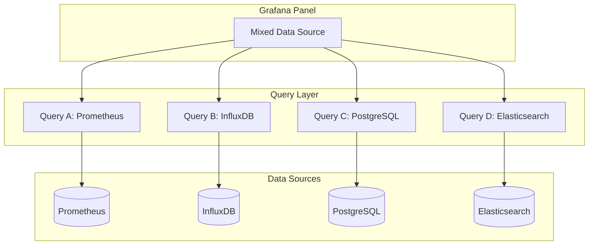
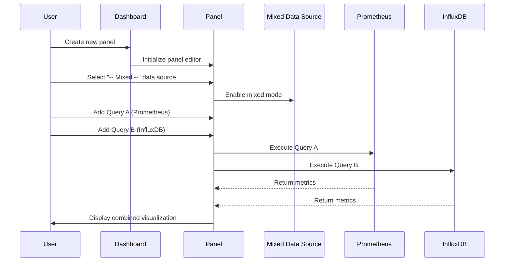
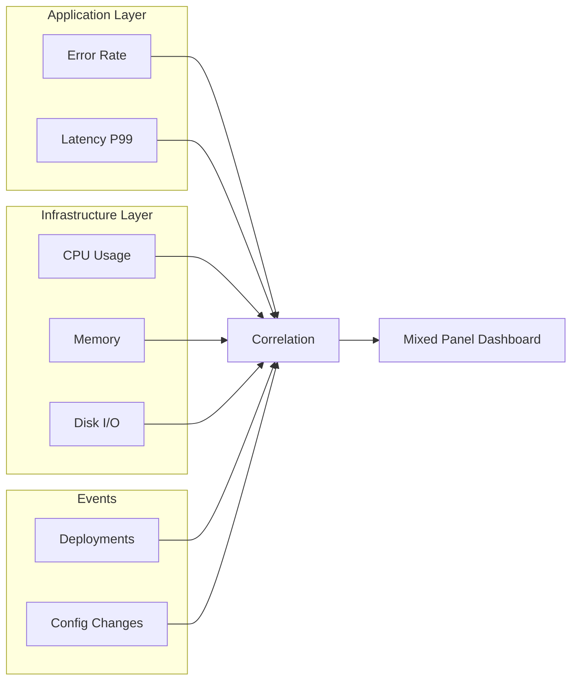
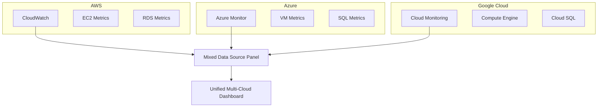
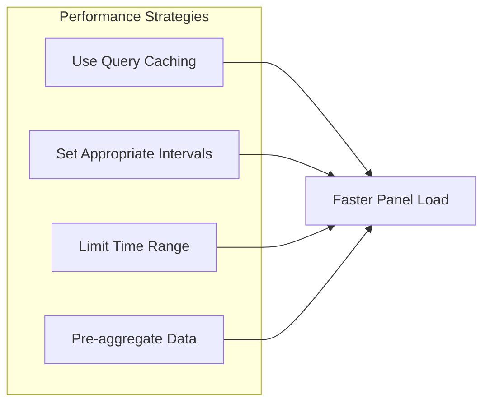
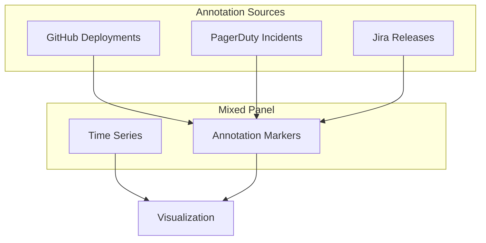
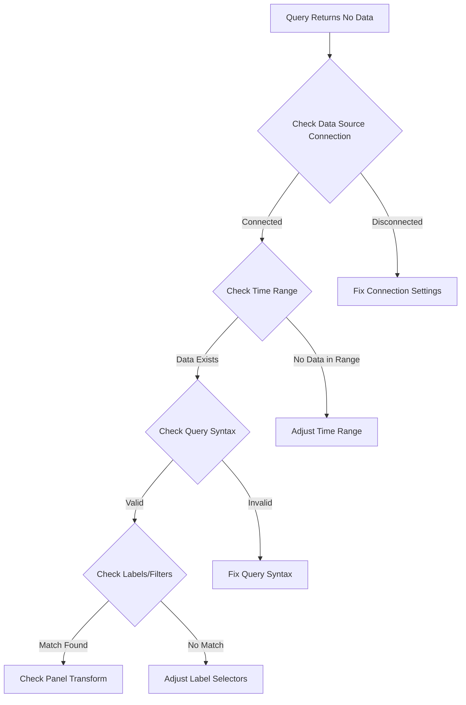

# How to Configure Grafana Mixed Data Source Panels

Author: [nawazdhandala](https://github.com/nawazdhandala)

Tags: Grafana, Mixed Data Source, Observability, Dashboards, Monitoring, Data Visualization, Prometheus, InfluxDB

Description: A practical guide to configuring Grafana mixed data source panels that combine metrics from multiple sources in a single visualization. Learn how to correlate data from Prometheus, InfluxDB, Elasticsearch, and other backends.

---

## Introduction

Modern infrastructure generates metrics across dozens of different systems. Your application metrics might live in Prometheus, while infrastructure data sits in InfluxDB, and business metrics come from PostgreSQL. Building meaningful dashboards means bringing all these data sources together.

Grafana's mixed data source feature solves exactly that problem. Instead of creating separate panels for each data source, you can overlay and correlate metrics from multiple backends in a single visualization. Imagine seeing CPU usage from Prometheus alongside deployment events from your CI/CD database - that kind of correlation helps you spot issues fast.

In this guide, you will learn how to configure mixed data source panels, handle common challenges like timezone alignment and unit conversion, and build production-ready dashboards that tell a complete story.

## Architecture Overview

Understanding how mixed data source queries work helps you design better dashboards.



Grafana executes each query against its respective data source, then merges the results for display. Each query maintains its own connection, authentication, and query language.

## Prerequisites

Before configuring mixed data source panels, ensure you have:

- Grafana 9.0 or higher installed
- Multiple data sources configured (Prometheus, InfluxDB, MySQL, etc.)
- Basic familiarity with Grafana panel configuration
- Appropriate permissions to create and edit dashboards

## Configuring Your First Mixed Data Source Panel

Let's walk through creating a panel that combines Prometheus application metrics with InfluxDB infrastructure metrics.

### Step 1: Create a New Panel

Start by creating a new panel in your dashboard.

1. Click the "Add panel" button or use the keyboard shortcut `e`
2. Select "Add a new panel"
3. In the data source dropdown, select "-- Mixed --"



### Step 2: Add Multiple Queries

With mixed data source selected, each query row shows its own data source selector. Here's how to configure queries from different sources.

The following JSON represents a panel configuration combining HTTP request metrics from Prometheus with system memory data from InfluxDB:

```json
{
  "datasource": {
    "type": "mixed",
    "uid": "-- Mixed --"
  },
  "targets": [
    {
      "datasource": {
        "type": "prometheus",
        "uid": "prometheus-main"
      },
      "expr": "rate(http_requests_total{job=\"api-server\"}[5m])",
      "legendFormat": "HTTP Requests/s - {{instance}}",
      "refId": "A"
    },
    {
      "datasource": {
        "type": "influxdb",
        "uid": "influxdb-infra"
      },
      "query": "SELECT mean(\"used_percent\") FROM \"mem\" WHERE $timeFilter GROUP BY time($__interval), \"host\" fill(null)",
      "alias": "Memory % - $tag_host",
      "refId": "B"
    }
  ]
}
```

### Step 3: Configure Query Options

Each query in a mixed panel maintains its own configuration. Pay attention to these settings.

The following example shows a complete panel configuration with multiple queries and their individual settings:

```json
{
  "id": 15,
  "title": "Application Performance Overview",
  "type": "timeseries",
  "datasource": {
    "type": "mixed",
    "uid": "-- Mixed --"
  },
  "fieldConfig": {
    "defaults": {
      "custom": {
        "drawStyle": "line",
        "lineInterpolation": "smooth",
        "showPoints": "never",
        "spanNulls": true
      },
      "unit": "short"
    },
    "overrides": [
      {
        "matcher": {
          "id": "byFrameRefID",
          "options": "B"
        },
        "properties": [
          {
            "id": "unit",
            "value": "percent"
          },
          {
            "id": "custom.axisPlacement",
            "value": "right"
          }
        ]
      }
    ]
  },
  "targets": [
    {
      "datasource": {
        "type": "prometheus",
        "uid": "prometheus-main"
      },
      "expr": "rate(http_requests_total{job=\"api-server\"}[5m])",
      "legendFormat": "Requests/s",
      "refId": "A"
    },
    {
      "datasource": {
        "type": "influxdb",
        "uid": "influxdb-infra"
      },
      "query": "SELECT mean(\"used_percent\") FROM \"mem\" WHERE $timeFilter GROUP BY time($__interval) fill(null)",
      "alias": "Memory Usage %",
      "refId": "B"
    }
  ]
}
```

## Practical Examples

### Example 1: Correlating Application Errors with System Metrics

Correlating application errors with infrastructure health reveals whether issues stem from code or resource constraints.



Here's a complete panel configuration that combines these metrics effectively. The Prometheus queries capture application error rates and latency, while InfluxDB provides CPU utilization data:

```json
{
  "title": "Error Correlation Dashboard",
  "datasource": {
    "type": "mixed",
    "uid": "-- Mixed --"
  },
  "targets": [
    {
      "datasource": {
        "type": "prometheus",
        "uid": "prometheus-main"
      },
      "expr": "sum(rate(http_requests_total{status=~\"5..\"}[5m])) / sum(rate(http_requests_total[5m])) * 100",
      "legendFormat": "Error Rate %",
      "refId": "A"
    },
    {
      "datasource": {
        "type": "prometheus",
        "uid": "prometheus-main"
      },
      "expr": "histogram_quantile(0.99, sum(rate(http_request_duration_seconds_bucket[5m])) by (le))",
      "legendFormat": "P99 Latency",
      "refId": "B"
    },
    {
      "datasource": {
        "type": "influxdb",
        "uid": "influxdb-telegraf"
      },
      "query": "SELECT mean(\"usage_idle\") FROM \"cpu\" WHERE $timeFilter GROUP BY time($__interval) fill(null)",
      "alias": "CPU Idle %",
      "refId": "C"
    }
  ],
  "fieldConfig": {
    "overrides": [
      {
        "matcher": {
          "id": "byFrameRefID",
          "options": "A"
        },
        "properties": [
          {
            "id": "unit",
            "value": "percent"
          },
          {
            "id": "color",
            "value": {
              "mode": "fixed",
              "fixedColor": "red"
            }
          }
        ]
      },
      {
        "matcher": {
          "id": "byFrameRefID",
          "options": "B"
        },
        "properties": [
          {
            "id": "unit",
            "value": "s"
          },
          {
            "id": "custom.axisPlacement",
            "value": "right"
          }
        ]
      }
    ]
  }
}
```

### Example 2: Business Metrics with Technical Metrics

Combining business KPIs from a SQL database with technical metrics provides executive-friendly dashboards that connect user experience to system health.

The PostgreSQL query retrieves order counts while Prometheus tracks the API performance. Using overrides, the panel displays revenue data on a secondary axis with currency formatting:

```json
{
  "title": "Business and Technical Metrics",
  "datasource": {
    "type": "mixed",
    "uid": "-- Mixed --"
  },
  "targets": [
    {
      "datasource": {
        "type": "postgres",
        "uid": "postgres-analytics"
      },
      "rawSql": "SELECT $__timeGroup(created_at, $__interval) as time, count(*) as orders FROM orders WHERE $__timeFilter(created_at) GROUP BY 1 ORDER BY 1",
      "format": "time_series",
      "refId": "A"
    },
    {
      "datasource": {
        "type": "postgres",
        "uid": "postgres-analytics"
      },
      "rawSql": "SELECT $__timeGroup(created_at, $__interval) as time, sum(total_amount) as revenue FROM orders WHERE $__timeFilter(created_at) GROUP BY 1 ORDER BY 1",
      "format": "time_series",
      "refId": "B"
    },
    {
      "datasource": {
        "type": "prometheus",
        "uid": "prometheus-main"
      },
      "expr": "histogram_quantile(0.95, sum(rate(checkout_duration_seconds_bucket[5m])) by (le))",
      "legendFormat": "Checkout P95 Latency",
      "refId": "C"
    }
  ],
  "fieldConfig": {
    "overrides": [
      {
        "matcher": {
          "id": "byFrameRefID",
          "options": "B"
        },
        "properties": [
          {
            "id": "unit",
            "value": "currencyUSD"
          },
          {
            "id": "custom.axisPlacement",
            "value": "right"
          }
        ]
      },
      {
        "matcher": {
          "id": "byFrameRefID",
          "options": "C"
        },
        "properties": [
          {
            "id": "unit",
            "value": "s"
          }
        ]
      }
    ]
  }
}
```

### Example 3: Multi-Cloud Monitoring

Organizations running workloads across multiple cloud providers need unified visibility. Mixed data sources enable combining CloudWatch, Azure Monitor, and Google Cloud Monitoring in a single view.



Here's the configuration for a panel comparing compute costs across clouds. Each cloud provider uses its native query language:

```json
{
  "title": "Multi-Cloud Compute Usage",
  "datasource": {
    "type": "mixed",
    "uid": "-- Mixed --"
  },
  "targets": [
    {
      "datasource": {
        "type": "cloudwatch",
        "uid": "cloudwatch-prod"
      },
      "namespace": "AWS/EC2",
      "metricName": "CPUUtilization",
      "statistics": ["Average"],
      "dimensions": {
        "InstanceId": ["*"]
      },
      "period": "300",
      "refId": "A",
      "alias": "AWS EC2 CPU"
    },
    {
      "datasource": {
        "type": "grafana-azure-monitor-datasource",
        "uid": "azure-monitor-prod"
      },
      "azureMonitor": {
        "resourceGroup": "production-rg",
        "metricDefinition": "Microsoft.Compute/virtualMachines",
        "metricName": "Percentage CPU",
        "aggregation": "Average",
        "timeGrain": "PT5M"
      },
      "refId": "B",
      "alias": "Azure VM CPU"
    },
    {
      "datasource": {
        "type": "stackdriver",
        "uid": "gcp-monitoring-prod"
      },
      "metricType": "compute.googleapis.com/instance/cpu/utilization",
      "crossSeriesReducer": "REDUCE_MEAN",
      "perSeriesAligner": "ALIGN_MEAN",
      "refId": "C",
      "alias": "GCP Compute CPU"
    }
  ]
}
```

## Handling Common Challenges

### Time Zone Alignment

Different data sources may store timestamps in different time zones. Grafana normalizes everything to the dashboard timezone, but you might encounter edge cases.

Use the panel's time shift feature for sources with timezone issues. For Prometheus queries, apply an offset to align with InfluxDB data:

```promql
# Shift Prometheus data by 1 hour if needed
rate(http_requests_total[5m]) offset 1h
```

For InfluxDB, use the timezone function:

```sql
SELECT mean("value") FROM "measurement" WHERE $timeFilter GROUP BY time($__interval) tz('America/New_York')
```

### Unit Conversion and Axis Placement

When combining metrics with different units, use field overrides to place them on separate axes and apply appropriate formatting.

The following configuration shows how to override units and axis placement for individual queries:

```json
{
  "fieldConfig": {
    "defaults": {
      "unit": "reqps"
    },
    "overrides": [
      {
        "matcher": {
          "id": "byFrameRefID",
          "options": "A"
        },
        "properties": [
          {
            "id": "unit",
            "value": "reqps"
          },
          {
            "id": "custom.axisPlacement",
            "value": "left"
          },
          {
            "id": "custom.axisLabel",
            "value": "Requests per Second"
          }
        ]
      },
      {
        "matcher": {
          "id": "byFrameRefID",
          "options": "B"
        },
        "properties": [
          {
            "id": "unit",
            "value": "percent"
          },
          {
            "id": "custom.axisPlacement",
            "value": "right"
          },
          {
            "id": "custom.axisLabel",
            "value": "CPU Utilization %"
          }
        ]
      }
    ]
  }
}
```

### Query Performance Optimization

Mixed panels execute queries in parallel, but a slow data source can still impact panel load time. Follow these optimization strategies.



For Prometheus, pre-compute aggregations using recording rules. Add rules to your Prometheus configuration:

```yaml
# prometheus-rules.yml
# Recording rules pre-compute expensive queries
# Run these calculations once, query the results many times

groups:
  - name: api_performance
    interval: 30s
    rules:
      # Pre-calculate request rate to avoid repeated rate() computations
      - record: job:http_requests:rate5m
        expr: sum(rate(http_requests_total[5m])) by (job)

      # Pre-calculate error percentage
      - record: job:http_errors:percentage
        expr: |
          sum(rate(http_requests_total{status=~"5.."}[5m])) by (job)
          /
          sum(rate(http_requests_total[5m])) by (job)
          * 100

      # Pre-calculate latency percentiles
      - record: job:http_latency:p99
        expr: histogram_quantile(0.99, sum(rate(http_request_duration_seconds_bucket[5m])) by (job, le))
```

For InfluxDB, create continuous queries or use tasks to downsample high-resolution data:

```sql
-- InfluxDB continuous query for downsampling
-- Reduces storage and speeds up historical queries

CREATE CONTINUOUS QUERY "cq_cpu_hourly" ON "telegraf"
BEGIN
  SELECT mean("usage_idle") AS "mean_idle",
         max("usage_idle") AS "max_idle",
         min("usage_idle") AS "min_idle"
  INTO "telegraf_downsampled"."autogen"."cpu_hourly"
  FROM "telegraf"."autogen"."cpu"
  GROUP BY time(1h), "host"
END
```

## Advanced Configuration

### Using Variables Across Data Sources

Dashboard variables work across all data sources in mixed panels. Define variables that make sense for each backend.

Create a multi-value variable for server selection:

```json
{
  "name": "server",
  "type": "query",
  "datasource": {
    "type": "prometheus",
    "uid": "prometheus-main"
  },
  "query": "label_values(up, instance)",
  "multi": true,
  "includeAll": true,
  "allValue": ".*"
}
```

Use the variable in queries for each data source. Prometheus uses regex matching while SQL uses IN clauses:

```json
{
  "targets": [
    {
      "datasource": {
        "type": "prometheus",
        "uid": "prometheus-main"
      },
      "expr": "rate(http_requests_total{instance=~\"$server\"}[5m])",
      "refId": "A"
    },
    {
      "datasource": {
        "type": "postgres",
        "uid": "postgres-analytics"
      },
      "rawSql": "SELECT time, value FROM metrics WHERE server IN ($server) AND $__timeFilter(time)",
      "refId": "B"
    }
  ]
}
```

### Annotations from Multiple Sources

Annotations add context to your graphs by showing events like deployments, incidents, or configuration changes.



Configure multiple annotation queries in your dashboard settings:

```json
{
  "annotations": {
    "list": [
      {
        "name": "Deployments",
        "datasource": {
          "type": "postgres",
          "uid": "postgres-devops"
        },
        "enable": true,
        "iconColor": "green",
        "rawQuery": "SELECT deployed_at as time, version as text, 'deployment' as tags FROM deployments WHERE $__timeFilter(deployed_at)",
        "showIn": 0
      },
      {
        "name": "Incidents",
        "datasource": {
          "type": "prometheus",
          "uid": "prometheus-alertmanager"
        },
        "enable": true,
        "iconColor": "red",
        "expr": "ALERTS{alertstate=\"firing\"}",
        "showIn": 0
      },
      {
        "name": "Config Changes",
        "datasource": {
          "type": "elasticsearch",
          "uid": "elasticsearch-audit"
        },
        "enable": true,
        "iconColor": "yellow",
        "query": "event_type:config_change",
        "showIn": 0
      }
    ]
  }
}
```

### Transformations for Mixed Data

Grafana transformations help merge and manipulate data from different sources before visualization.

The "Join by field" transformation combines time series from different sources based on timestamps. Configure it in the panel settings:

```json
{
  "transformations": [
    {
      "id": "joinByField",
      "options": {
        "byField": "Time",
        "mode": "outer"
      }
    },
    {
      "id": "organize",
      "options": {
        "excludeByName": {},
        "indexByName": {
          "Time": 0,
          "requests_per_second": 1,
          "cpu_usage": 2,
          "memory_usage": 3
        },
        "renameByName": {
          "Value #A": "Requests/s",
          "Value #B": "CPU %",
          "Value #C": "Memory %"
        }
      }
    }
  ]
}
```

For calculating derived metrics, use the "Add field from calculation" transformation:

```json
{
  "transformations": [
    {
      "id": "calculateField",
      "options": {
        "mode": "binary",
        "reduce": {
          "reducer": "sum"
        },
        "binary": {
          "left": "errors_total",
          "operator": "/",
          "right": "requests_total"
        },
        "alias": "Error Rate"
      }
    }
  ]
}
```

## Dashboard as Code

Managing mixed data source dashboards as code ensures reproducibility and version control. Export your dashboard JSON and store it in Git.

The following Python script automates dashboard provisioning using the Grafana HTTP API:

```python
#!/usr/bin/env python3
# grafana_dashboard_sync.py
# Synchronize dashboard JSON files with Grafana instance
# Supports creating and updating dashboards from version control

import json
import os
import requests
from pathlib import Path

# Configuration - use environment variables for sensitive data
GRAFANA_URL = os.environ.get("GRAFANA_URL", "http://localhost:3000")
GRAFANA_API_KEY = os.environ.get("GRAFANA_API_KEY")
DASHBOARDS_DIR = Path("./dashboards")

def load_dashboard(filepath: Path) -> dict:
    """Load dashboard JSON from file."""
    with open(filepath, "r") as f:
        return json.load(f)

def upload_dashboard(dashboard: dict, folder_id: int = 0) -> dict:
    """Upload dashboard to Grafana using the HTTP API."""
    headers = {
        "Authorization": f"Bearer {GRAFANA_API_KEY}",
        "Content-Type": "application/json"
    }

    # Prepare payload for Grafana dashboard API
    # Setting id to null creates a new dashboard
    # Setting overwrite to true updates existing dashboards
    payload = {
        "dashboard": dashboard,
        "folderId": folder_id,
        "overwrite": True,
        "message": "Updated via automation"
    }

    response = requests.post(
        f"{GRAFANA_URL}/api/dashboards/db",
        headers=headers,
        json=payload
    )

    response.raise_for_status()
    return response.json()

def sync_dashboards():
    """Sync all dashboards from local directory to Grafana."""
    if not GRAFANA_API_KEY:
        raise ValueError("GRAFANA_API_KEY environment variable required")

    # Process all JSON files in dashboards directory
    for dashboard_file in DASHBOARDS_DIR.glob("*.json"):
        print(f"Processing {dashboard_file.name}...")

        dashboard = load_dashboard(dashboard_file)

        # Remove id to allow Grafana to assign one
        dashboard.pop("id", None)

        result = upload_dashboard(dashboard)
        print(f"  Uploaded: {result.get('url', 'unknown')}")

if __name__ == "__main__":
    sync_dashboards()
```

Store your mixed data source dashboard configuration in a JSON file:

```json
{
  "title": "Production Overview - Mixed Sources",
  "uid": "prod-overview-mixed",
  "tags": ["production", "mixed-sources", "overview"],
  "timezone": "browser",
  "schemaVersion": 38,
  "panels": [
    {
      "id": 1,
      "title": "Request Rate vs CPU Usage",
      "type": "timeseries",
      "gridPos": {
        "h": 8,
        "w": 12,
        "x": 0,
        "y": 0
      },
      "datasource": {
        "type": "mixed",
        "uid": "-- Mixed --"
      },
      "targets": [
        {
          "datasource": {
            "type": "prometheus",
            "uid": "${DS_PROMETHEUS}"
          },
          "expr": "sum(rate(http_requests_total[5m]))",
          "legendFormat": "Requests/s",
          "refId": "A"
        },
        {
          "datasource": {
            "type": "influxdb",
            "uid": "${DS_INFLUXDB}"
          },
          "query": "SELECT mean(\"usage_idle\") FROM \"cpu\" WHERE $timeFilter GROUP BY time($__interval) fill(null)",
          "alias": "CPU Idle %",
          "refId": "B"
        }
      ],
      "fieldConfig": {
        "overrides": [
          {
            "matcher": {
              "id": "byFrameRefID",
              "options": "B"
            },
            "properties": [
              {
                "id": "custom.axisPlacement",
                "value": "right"
              },
              {
                "id": "unit",
                "value": "percent"
              }
            ]
          }
        ]
      }
    }
  ],
  "__inputs": [
    {
      "name": "DS_PROMETHEUS",
      "type": "datasource",
      "pluginId": "prometheus"
    },
    {
      "name": "DS_INFLUXDB",
      "type": "datasource",
      "pluginId": "influxdb"
    }
  ]
}
```

## Troubleshooting Common Issues

### Query Returns No Data

When a query in your mixed panel returns no data, investigate systematically.



Use Grafana's Query Inspector to debug issues. Open it by clicking the panel title and selecting "Inspect > Query". You will see the raw query sent to each data source and the raw response.

### Misaligned Time Series

When time series from different sources do not align properly, check these settings.

For InfluxDB, ensure your query uses the same interval variable:

```sql
-- Use $__interval for consistent alignment with other queries
SELECT mean("value") FROM "measurement"
WHERE $timeFilter
GROUP BY time($__interval) fill(null)
```

For Prometheus, use the same evaluation window:

```promql
# Match the interval to your InfluxDB queries
rate(metric_name[5m])
```

### Performance Degradation

Mixed panels with many queries can slow down dashboard loads. Monitor query performance using Grafana's built-in metrics.

Create a panel that tracks query duration:

```promql
# Query latency by data source
grafana_datasource_request_duration_seconds_bucket
```

## Best Practices

Following these practices helps maintain reliable mixed data source dashboards.

### Organize Queries Logically

Group related queries together and use clear naming conventions:

```json
{
  "targets": [
    {
      "refId": "A_requests",
      "legendFormat": "[App] Request Rate"
    },
    {
      "refId": "B_errors",
      "legendFormat": "[App] Error Rate"
    },
    {
      "refId": "C_cpu",
      "legendFormat": "[Infra] CPU Usage"
    },
    {
      "refId": "D_memory",
      "legendFormat": "[Infra] Memory Usage"
    }
  ]
}
```

### Document Data Source Dependencies

Add a text panel to your dashboard explaining which data sources power each visualization:

```markdown
## Data Sources Used

- **Prometheus (prometheus-main)**: Application metrics, request rates, latencies
- **InfluxDB (influxdb-telegraf)**: Infrastructure metrics from Telegraf agents
- **PostgreSQL (postgres-analytics)**: Business metrics, order counts, revenue
- **Elasticsearch (elasticsearch-logs)**: Log-based metrics and annotations

### Refresh Rates
- Application metrics: 10s
- Infrastructure metrics: 30s
- Business metrics: 1m
```

### Use Consistent Colors

Define a color scheme that remains consistent across queries from different sources:

```json
{
  "fieldConfig": {
    "overrides": [
      {
        "matcher": {
          "id": "byRegexp",
          "options": "/.*Error.*|.*error.*/"
        },
        "properties": [
          {
            "id": "color",
            "value": {
              "mode": "fixed",
              "fixedColor": "red"
            }
          }
        ]
      },
      {
        "matcher": {
          "id": "byRegexp",
          "options": "/.*Success.*|.*success.*/"
        },
        "properties": [
          {
            "id": "color",
            "value": {
              "mode": "fixed",
              "fixedColor": "green"
            }
          }
        ]
      }
    ]
  }
}
```

## Conclusion

Mixed data source panels transform Grafana from a simple metrics viewer into a comprehensive observability platform. By combining data from Prometheus, InfluxDB, SQL databases, and cloud providers, you can build dashboards that tell the complete story of your systems.

Start with a single mixed panel combining two data sources. Once you are comfortable with the basics, expand to include business metrics, multi-cloud monitoring, and automated annotations. The key is correlating data that previously lived in silos.

Remember these core principles:

- Always use field overrides to handle different units and axis placements
- Optimize query performance with recording rules and continuous queries
- Document your data source dependencies for team members
- Version control your dashboards using JSON exports and automation scripts

With mixed data source panels, your dashboards become the single pane of glass your team needs for effective incident response and capacity planning.

---

*Need a unified observability platform that works seamlessly with your existing tools? [OneUptime](https://oneuptime.com) provides native integration with Prometheus, logs, and traces in a single platform. Start correlating your metrics today with our free tier.*

**Related Reading:**
- [Three Pillars of Observability: Logs, Metrics, Traces](https://oneuptime.com/blog/post/2025-08-20-three-pillars-of-observability-logs-metrics-traces/view)
- [How to Instrument Python Applications with OpenTelemetry](https://oneuptime.com/blog/post/2025-01-06-instrument-python-opentelemetry/view)
