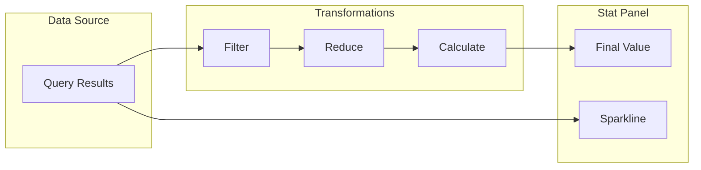
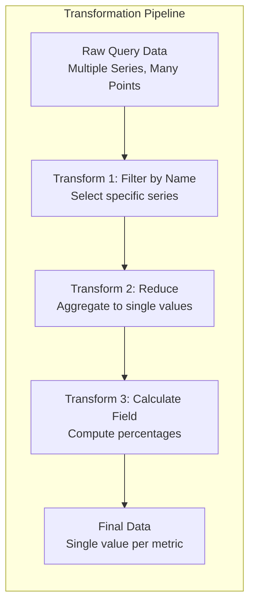
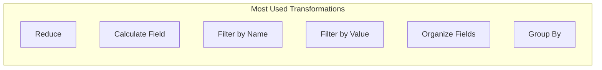
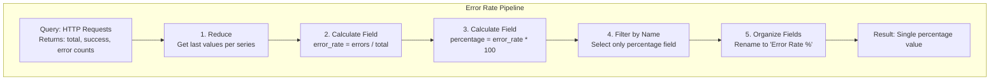
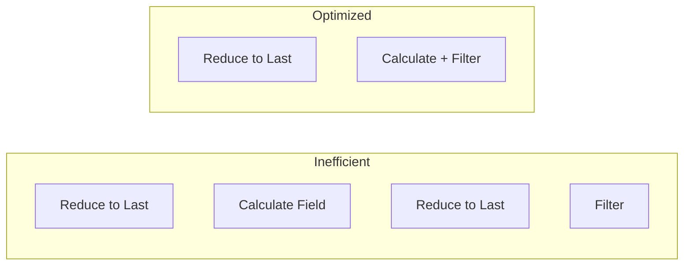

# How to Build Grafana Stat Panels with Transformations

Author: [nawazdhandala](https://www.github.com/nawazdhandala)

Tags: Grafana, Dashboards, Transformations, Monitoring, Observability, Metrics, Data Visualization

Description: A hands-on guide to building powerful Grafana stat panels using transformations. Learn how to aggregate, filter, calculate, and display metrics effectively for real-time monitoring dashboards.

---

Stat panels in Grafana are the workhorses of monitoring dashboards. They distill complex time-series data into single values that communicate system health at a glance. When combined with transformations, stat panels become incredibly flexible, allowing you to derive meaningful metrics from raw data without modifying your queries or data sources.

---

## Table of Contents

1. Understanding Stat Panels
2. Anatomy of a Transformation Pipeline
3. Setting Up Your First Stat Panel
4. Essential Transformations for Stat Panels
5. Reduce Transformation
6. Calculate Field Transformation
7. Filter by Name and Value
8. Organize Fields Transformation
9. Grouping and Aggregation
10. Chaining Multiple Transformations
11. Real-World Examples
12. Thresholds and Value Mappings
13. Performance Considerations
14. Troubleshooting Common Issues

---

## 1. Understanding Stat Panels

Stat panels display a single numeric value prominently, often accompanied by a sparkline showing recent trends. They excel at showing current status, counts, rates, and percentages.



Unlike time series panels that display data over time, stat panels focus on a single representative value. Transformations let you control exactly which value gets displayed and how it gets calculated.

---

## 2. Anatomy of a Transformation Pipeline

Transformations in Grafana process query results before they reach the visualization. Each transformation takes input data, applies an operation, and outputs modified data. You can chain transformations to build complex data processing pipelines.



Key principles to remember:

- Transformations execute in order from top to bottom
- Each transformation receives the output of the previous one
- The final transformation output goes to the panel
- Some transformations work on individual rows, others on entire series

---

## 3. Setting Up Your First Stat Panel

Start with a Prometheus query that returns CPU usage metrics. Grafana needs to reduce multiple time series points to a single displayable value.

Create a new panel and select the Stat visualization type:

```yaml
# Panel Configuration
Panel Type: Stat
Data Source: Prometheus (or your preferred source)

# Example Query
Query: avg(rate(node_cpu_seconds_total{mode!="idle"}[5m])) * 100
Legend: CPU Usage %
```

Configure the stat panel display options to show the value effectively:

```json
{
  "options": {
    "reduceOptions": {
      "values": false,
      "calcs": ["lastNotNull"],
      "fields": ""
    },
    "orientation": "auto",
    "textMode": "auto",
    "colorMode": "value",
    "graphMode": "area",
    "justifyMode": "auto"
  }
}
```

The `reduceOptions.calcs` array determines how multiple values become one. Common calculations include:

| Calculation | Description |
|-------------|-------------|
| lastNotNull | Most recent non-null value |
| last | Most recent value (may be null) |
| first | First value in the series |
| mean | Average of all values |
| max | Maximum value |
| min | Minimum value |
| sum | Total of all values |
| count | Number of data points |
| range | Difference between max and min |
| delta | Cumulative change |

---

## 4. Essential Transformations for Stat Panels

Grafana offers numerous transformations, but a handful prove particularly useful for stat panels.



Each transformation serves a specific purpose:

| Transformation | Purpose | When to Use |
|----------------|---------|-------------|
| Reduce | Collapse series to single values | Always needed for multi-point series |
| Calculate Field | Create new fields from existing ones | Percentages, rates, differences |
| Filter by Name | Select specific series | Multi-metric queries |
| Filter by Value | Remove rows based on conditions | Filtering by threshold |
| Organize Fields | Rename, reorder, hide fields | Cleaning up display |
| Group By | Aggregate rows by field values | Summarizing by category |

---

## 5. Reduce Transformation

The Reduce transformation is fundamental for stat panels. It takes a time series with many data points and reduces it to a single value per series.

Add a Reduce transformation when your query returns time series data:

```yaml
# Transformation Configuration
Type: Reduce
Mode: Series to rows

Calculations:
  - Last (most recent value)
  - Mean (average over time range)
  - Max (peak value)
```

The Mode setting controls output structure:

**Series to rows** creates one row per series with calculated values as columns:

```
| Field    | Last  | Mean  | Max   |
|----------|-------|-------|-------|
| cpu_0    | 45.2  | 42.1  | 78.3  |
| cpu_1    | 38.7  | 35.4  | 65.2  |
| cpu_2    | 52.1  | 48.9  | 82.1  |
```

**Reduce fields** calculates across all series:

```
| Last  | Mean  | Max   |
|-------|-------|-------|
| 45.2  | 42.1  | 82.1  |
```

Use the following JSON to configure a Reduce transformation programmatically:

```json
{
  "id": "reduce",
  "options": {
    "reducers": ["lastNotNull", "mean", "max"],
    "mode": "seriesToRows",
    "includeTimeField": false,
    "labelsToFields": true
  }
}
```

---

## 6. Calculate Field Transformation

Calculate Field lets you derive new metrics from existing ones. Create percentages, ratios, differences, and more without modifying your queries.

Below is a configuration that calculates the percentage of used memory from total and available metrics:

```yaml
# Calculate memory usage percentage
Type: Calculate Field
Mode: Binary operation

Field 1: total_memory
Field 2: available_memory
Operation: Subtract

# Result: used_memory = total_memory - available_memory
```

Chain another calculation to get the percentage:

```yaml
# Calculate percentage
Type: Calculate Field
Mode: Binary operation

Field 1: used_memory
Field 2: total_memory
Operation: Divide

# Then multiply by 100 using another transformation
Type: Calculate Field
Mode: Binary operation

Field 1: used_memory / total_memory
Field 2: (constant 100)
Operation: Multiply
```

For simpler operations, use Reduce Row mode to calculate across columns:

```json
{
  "id": "calculateField",
  "options": {
    "mode": "reduceRow",
    "reduce": {
      "reducer": "sum"
    },
    "alias": "Total"
  }
}
```

Available binary operations:

| Operation | Symbol | Example |
|-----------|--------|---------|
| Add | + | A + B |
| Subtract | - | A - B |
| Multiply | * | A * B |
| Divide | / | A / B |

---

## 7. Filter by Name and Value

Filter transformations help you select specific data from queries that return multiple series.

**Filter by Name** selects series based on their field names or labels:

```yaml
# Select only the 'success' and 'total' fields
Type: Filter by Name
Include by name:
  - success
  - total
```

Regular expressions provide flexible matching patterns:

```yaml
# Match all HTTP status code metrics
Type: Filter by Name
Match by regex: true
Pattern: http_requests_.*
```

**Filter by Value** removes rows based on numeric conditions:

```yaml
# Keep only rows where error_count exceeds threshold
Type: Filter by Value
Conditions:
  - Field: error_count
    Match: Greater than
    Value: 0
```

Filter by Value supports multiple condition types:

| Match Type | Description |
|------------|-------------|
| Greater | Field > Value |
| Greater or equal | Field >= Value |
| Lower | Field < Value |
| Lower or equal | Field <= Value |
| Equal | Field == Value |
| Not equal | Field != Value |
| Is null | Field is null |
| Is not null | Field is not null |
| Regex | Field matches pattern |

---

## 8. Organize Fields Transformation

Organize Fields cleans up your data for display. Rename cryptic field names, reorder columns, and hide unnecessary fields.

Transform verbose Prometheus metric names into readable labels:

```yaml
Type: Organize Fields

Rename Fields:
  node_memory_MemTotal_bytes: Total Memory
  node_memory_MemAvailable_bytes: Available Memory
  node_memory_Buffers_bytes: Buffers

Hide Fields:
  - __name__
  - instance
  - job

Field Order:
  1. Total Memory
  2. Available Memory
  3. Buffers
```

JSON configuration for Organize Fields:

```json
{
  "id": "organize",
  "options": {
    "excludeByName": {
      "__name__": true,
      "instance": true,
      "job": true
    },
    "indexByName": {
      "Total Memory": 0,
      "Available Memory": 1,
      "Buffers": 2
    },
    "renameByName": {
      "node_memory_MemTotal_bytes": "Total Memory",
      "node_memory_MemAvailable_bytes": "Available Memory"
    }
  }
}
```

---

## 9. Grouping and Aggregation

Group By transformation aggregates data by field values. Combine it with calculations to summarize metrics across dimensions.

Group requests by endpoint and calculate totals:

```yaml
Type: Group By

Group by fields:
  - endpoint

Calculations:
  - Field: request_count
    Aggregation: Sum
  - Field: response_time
    Aggregation: Mean
  - Field: error_count
    Aggregation: Sum
```

Output shows aggregated values per group:

```
| endpoint     | request_count (sum) | response_time (mean) | error_count (sum) |
|--------------|---------------------|----------------------|-------------------|
| /api/users   | 15420               | 45.2                 | 23                |
| /api/orders  | 8932                | 78.5                 | 12                |
| /api/health  | 52100               | 2.1                  | 0                 |
```

For stat panels showing totals, group by a constant field to aggregate all rows:

```json
{
  "id": "groupBy",
  "options": {
    "fields": {
      "request_count": {
        "aggregations": ["sum"],
        "operation": "aggregate"
      }
    }
  }
}
```

---

## 10. Chaining Multiple Transformations

Real-world dashboards often require multiple transformations working together. Order matters because each transformation processes the output of the previous one.

Here is a complete pipeline that calculates error rate percentage from request metrics:



Full transformation configuration in YAML:

```yaml
# Complete transformation pipeline for error rate stat panel
transformations:
  # Step 1: Reduce time series to single values
  - id: reduce
    options:
      reducers: [lastNotNull]
      mode: seriesToRows
      includeTimeField: false

  # Step 2: Calculate error rate
  - id: calculateField
    options:
      mode: binaryOperation
      binary:
        left: errors
        operator: "/"
        right: total
      alias: error_rate

  # Step 3: Convert to percentage
  - id: calculateField
    options:
      mode: binaryOperation
      binary:
        left: error_rate
        operator: "*"
        right: "100"
      alias: error_percentage

  # Step 4: Select only the percentage field
  - id: filterFieldsByName
    options:
      include:
        names: [error_percentage]

  # Step 5: Clean up field name
  - id: organize
    options:
      renameByName:
        error_percentage: Error Rate %
```

---

## 11. Real-World Examples

### Example 1: Service Availability Percentage

Calculate uptime percentage from probe success metrics:

```yaml
# Query
Query A: probe_success{job="blackbox"}

# Transformations
1. Reduce:
   - Mode: Series to rows
   - Calculations: Mean (over selected time range)

2. Calculate Field:
   - Mode: Binary operation
   - Left: Mean
   - Operation: Multiply
   - Right: 100
   - Alias: Availability %

3. Organize Fields:
   - Hide: Mean, Field
   - Show: Availability %
```

### Example 2: Request Rate with Delta

Show requests per second using rate calculation:

```yaml
# Query
Query A: sum(increase(http_requests_total[5m]))

# Transformations
1. Reduce:
   - Calculations: Last

2. Calculate Field:
   - Mode: Binary operation
   - Left: Last
   - Operation: Divide
   - Right: 300  # 5 minutes in seconds
   - Alias: Requests/sec
```

### Example 3: Multi-Environment Comparison

Show production vs staging error counts side by side:

```yaml
# Query
Query A: sum(errors_total{env="production"})
Query B: sum(errors_total{env="staging"})

# Transformations
1. Outer Join:
   - Field name: Time

2. Reduce:
   - Mode: Reduce fields
   - Calculations: Last

3. Organize Fields:
   - Rename: errors_total {env="production"} -> Production Errors
   - Rename: errors_total {env="staging"} -> Staging Errors
```

### Example 4: Percentage of Quota Used

Calculate resource usage against defined limits:

```yaml
# Queries
Query A (Usage): container_memory_usage_bytes{container="app"}
Query B (Limit): container_spec_memory_limit_bytes{container="app"}

# Transformations
1. Join by field:
   - Mode: Outer join
   - Field: container

2. Reduce:
   - Calculations: Last

3. Calculate Field:
   - Left: container_memory_usage_bytes
   - Operation: Divide
   - Right: container_spec_memory_limit_bytes
   - Alias: usage_ratio

4. Calculate Field:
   - Left: usage_ratio
   - Operation: Multiply
   - Right: 100
   - Alias: Memory Usage %
```

---

## 12. Thresholds and Value Mappings

Thresholds and value mappings enhance stat panels by adding visual context to values.

Configure thresholds to change colors based on value ranges:

```json
{
  "fieldConfig": {
    "defaults": {
      "thresholds": {
        "mode": "absolute",
        "steps": [
          { "color": "green", "value": null },
          { "color": "yellow", "value": 70 },
          { "color": "orange", "value": 85 },
          { "color": "red", "value": 95 }
        ]
      }
    }
  }
}
```

Value mappings translate numeric values to text:

```json
{
  "fieldConfig": {
    "defaults": {
      "mappings": [
        {
          "type": "range",
          "options": {
            "from": 0,
            "to": 50,
            "result": { "text": "Healthy", "color": "green" }
          }
        },
        {
          "type": "range",
          "options": {
            "from": 50,
            "to": 80,
            "result": { "text": "Warning", "color": "yellow" }
          }
        },
        {
          "type": "range",
          "options": {
            "from": 80,
            "to": 100,
            "result": { "text": "Critical", "color": "red" }
          }
        }
      ]
    }
  }
}
```

Combine thresholds with the Calculate Field transformation to create derived status indicators:

```yaml
# Create a status field based on error rate
1. Calculate error_rate (as shown above)

2. Add threshold configuration:
   - Base: green
   - 1: yellow (warning threshold)
   - 5: red (critical threshold)

3. Set color mode to "value" to apply threshold colors
```

---

## 13. Performance Considerations

Transformations execute in the browser, so complex pipelines can impact dashboard performance.

Follow these practices for responsive dashboards:

**Do as much as possible in the query:**

```promql
# Instead of transforming in Grafana
avg(rate(http_requests_total[5m]))

# Let Prometheus do the heavy lifting
avg by (status_code) (rate(http_requests_total[5m]))
```

**Limit data points returned:**

```yaml
# Set appropriate time range and resolution
Query Options:
  Max data points: 100
  Min interval: 1m
```

**Avoid redundant transformations:**



**Use server-side processing when available:**

Some data sources support server-side transformations. InfluxDB, for instance, can perform aggregations before sending data to Grafana.

---

## 14. Troubleshooting Common Issues

### No Data After Transformation

Symptoms: Panel shows "No data" after adding transformations.

Debug steps:

1. Remove all transformations and verify query returns data
2. Add transformations one at a time
3. Check the Transform tab data preview after each step
4. Verify field names match between transformations

Common causes:

- Filter by Name uses wrong field names (check query inspector)
- Reduce mode incompatible with data structure
- Calculate Field references non-existent fields

### Unexpected Values

Symptoms: Stat panel shows wrong numbers.

Debug process:

```yaml
# Add debug transformation to see intermediate data
1. Add "Debug" transformation (shows raw data)
2. Check field names and values
3. Verify calculation order
4. Check for null values affecting calculations
```

### Performance Issues

Symptoms: Dashboard loads slowly or browser becomes unresponsive.

Solutions:

- Reduce query time range
- Increase minimum interval
- Move calculations to data source queries
- Split complex dashboards into multiple pages

### Type Mismatches

Symptoms: Calculate Field produces null or NaN results.

Causes and fixes:

| Issue | Solution |
|-------|----------|
| String fields in math operations | Use Convert field type transformation first |
| Null values in calculations | Use "Replace null" transformation |
| Different series lengths | Use "Join" transformation to align data |

---

## Summary

Stat panels with transformations provide a powerful combination for building informative monitoring dashboards. Master these key concepts:

| Concept | Key Takeaway |
|---------|--------------|
| Reduce | Always needed to collapse time series to single values |
| Calculate Field | Derive percentages, rates, and differences |
| Filters | Select specific series and rows |
| Organize | Clean up field names for display |
| Chaining | Order matters; each step processes previous output |
| Performance | Do calculations in queries when possible |

Start with simple transformations and gradually build complexity as needed. The transformation preview panel in Grafana shows intermediate results, making it easy to debug and understand each step of your pipeline.

---

*Need unified monitoring for your infrastructure? [OneUptime](https://oneuptime.com) provides integrated metrics, logs, and traces with customizable dashboards. Send your Grafana metrics to OneUptime for correlation with alerts and incident management.*

---

### Related Reading

- [What are metrics in OpenTelemetry: A Complete Guide](https://oneuptime.com/blog/post/2025-08-26-what-are-metrics-in-opentelemetry/view)
- [SRE Metrics to Track](https://oneuptime.com/blog/post/2025-11-28-sre-metrics-to-track/view)
- [Three Pillars of Observability: Logs, Metrics, Traces](https://oneuptime.com/blog/post/2025-08-20-three-pillars-of-observability-logs-metrics-traces/view)
