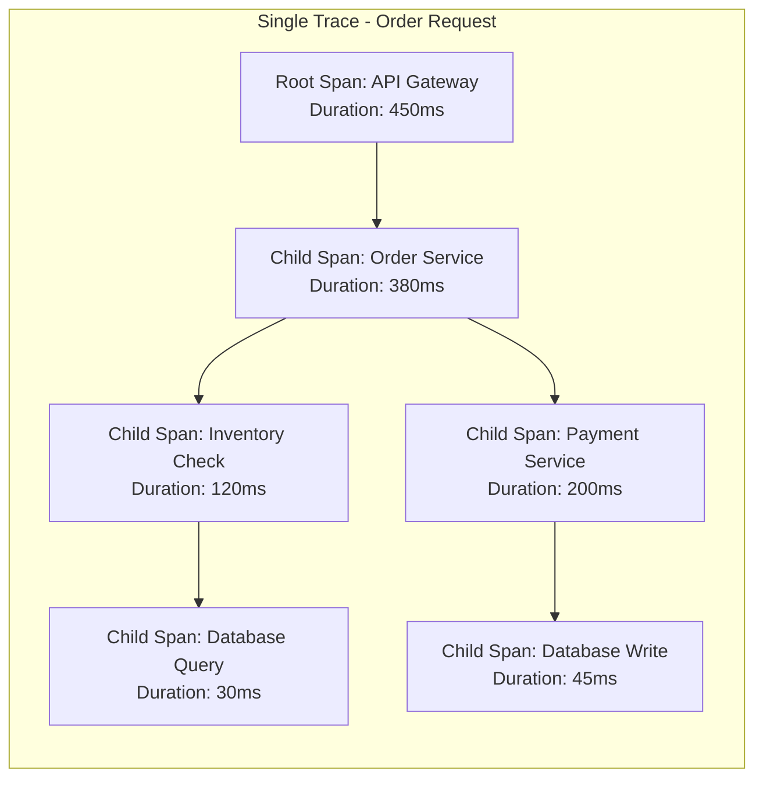
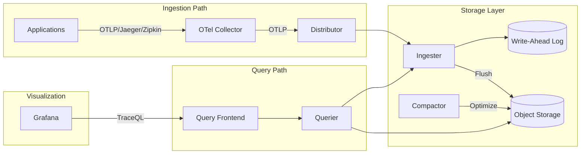
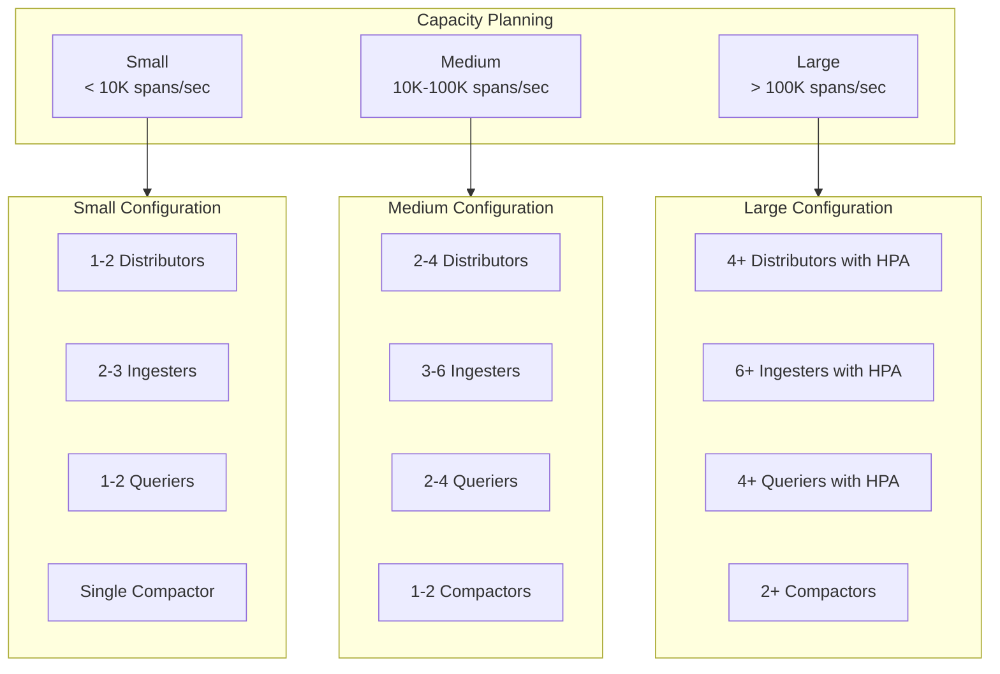

# How to Use Grafana Tempo for Traces

Author: [nawazdhandala](https://github.com/nawazdhandala)

Tags: Grafana Tempo, Distributed Tracing, Observability, OpenTelemetry, Traces, APM

Description: A comprehensive guide to using Grafana Tempo for trace storage, querying, and analysis. Learn TraceQL queries, trace correlation, sampling strategies, and production deployment patterns.

---

Tracing provides the missing link between metrics and logs when debugging distributed systems. Grafana Tempo stores and queries these traces efficiently without requiring a complex indexing layer. Engineers working with microservices architectures need practical knowledge of how to leverage Tempo for root cause analysis and performance optimization.

Tempo differs from traditional APM solutions by using object storage as its primary backend. The architecture reduces operational overhead and cost while supporting massive trace volumes. Understanding how to instrument applications, write effective queries, and correlate traces with other telemetry data unlocks powerful debugging capabilities.

## Table of Contents

1. [Understanding Traces and Tempo Architecture](#understanding-traces-and-tempo-architecture)
2. [Setting Up Tempo](#setting-up-tempo)
3. [Sending Traces to Tempo](#sending-traces-to-tempo)
4. [TraceQL Query Language](#traceql-query-language)
5. [Trace Correlation with Logs and Metrics](#trace-correlation-with-logs-and-metrics)
6. [Sampling Strategies](#sampling-strategies)
7. [Production Deployment Patterns](#production-deployment-patterns)
8. [Advanced Trace Analysis](#advanced-trace-analysis)
9. [Troubleshooting Trace Issues](#troubleshooting-trace-issues)
10. [Best Practices](#best-practices)

## Understanding Traces and Tempo Architecture

A trace represents the journey of a single request through a distributed system. Each trace contains multiple spans, where each span represents a unit of work within a service. Parent-child relationships between spans reveal the call hierarchy and timing dependencies.



### Tempo Component Architecture

Tempo consists of several components working together to ingest, store, and query traces.



### Component Responsibilities

| Component | Purpose |
|-----------|---------|
| Distributor | Receives spans and forwards to ingesters |
| Ingester | Batches spans into blocks, maintains WAL |
| Compactor | Merges and optimizes stored blocks |
| Querier | Retrieves traces from storage and ingesters |
| Query Frontend | Coordinates queries, handles caching |

## Setting Up Tempo

A minimal Tempo deployment requires configuration for receivers, storage, and the query interface. The following sections walk through different deployment scenarios.

### Local Development Setup

The following Docker Compose configuration creates a complete tracing environment with Tempo, Grafana, and an OpenTelemetry Collector.

```yaml
# docker-compose.yaml
# Complete tracing stack for local development and testing

version: "3.9"

services:
  # Grafana Tempo - trace storage and query backend
  tempo:
    image: grafana/tempo:2.3.1
    command: ["-config.file=/etc/tempo.yaml"]
    volumes:
      - ./tempo.yaml:/etc/tempo.yaml:ro
      - tempo-data:/var/tempo
    ports:
      - "3200:3200"   # Tempo API and query endpoint
      - "4317:4317"   # OTLP gRPC receiver
      - "4318:4318"   # OTLP HTTP receiver
      - "9411:9411"   # Zipkin receiver
    healthcheck:
      test: ["CMD", "wget", "--spider", "-q", "http://localhost:3200/ready"]
      interval: 10s
      timeout: 5s
      retries: 3

  # OpenTelemetry Collector - optional but recommended for production
  otel-collector:
    image: otel/opentelemetry-collector-contrib:0.91.0
    command: ["--config=/etc/otel-collector.yaml"]
    volumes:
      - ./otel-collector.yaml:/etc/otel-collector.yaml:ro
    ports:
      - "4327:4317"   # OTLP gRPC for applications
      - "4328:4318"   # OTLP HTTP for applications
    depends_on:
      - tempo

  # Grafana - visualization and exploration
  grafana:
    image: grafana/grafana:10.2.3
    environment:
      - GF_AUTH_ANONYMOUS_ENABLED=true
      - GF_AUTH_ANONYMOUS_ORG_ROLE=Admin
      - GF_AUTH_DISABLE_LOGIN_FORM=true
    volumes:
      - ./grafana-datasources.yaml:/etc/grafana/provisioning/datasources/datasources.yaml:ro
    ports:
      - "3000:3000"
    depends_on:
      - tempo

volumes:
  tempo-data:
```

### Tempo Configuration File

The Tempo configuration defines receivers, storage backends, and query settings.

```yaml
# tempo.yaml
# Tempo configuration optimized for development with explanation of each section

# HTTP server configuration for API and health endpoints
server:
  http_listen_port: 3200
  grpc_listen_port: 9095

# Distributor receives incoming traces from collectors and applications
distributor:
  receivers:
    # OpenTelemetry Protocol - the modern standard for trace ingestion
    otlp:
      protocols:
        grpc:
          endpoint: "0.0.0.0:4317"
        http:
          endpoint: "0.0.0.0:4318"
    # Zipkin format support for legacy applications
    zipkin:
      endpoint: "0.0.0.0:9411"
    # Jaeger format support for existing Jaeger-instrumented apps
    jaeger:
      protocols:
        thrift_http:
          endpoint: "0.0.0.0:14268"
        grpc:
          endpoint: "0.0.0.0:14250"
        thrift_binary:
          endpoint: "0.0.0.0:6832"
        thrift_compact:
          endpoint: "0.0.0.0:6831"

# Ingester batches traces before writing to storage
ingester:
  max_block_duration: 5m   # Time before flushing block to storage
  max_block_bytes: 1000000 # Maximum block size in bytes
  trace_idle_period: 10s   # Time before considering a trace complete

# Compactor merges small blocks into larger ones for query efficiency
compactor:
  compaction:
    block_retention: 72h           # How long to keep trace data
    compacted_block_retention: 1h  # Retention for compacted blocks
    compaction_window: 1h          # Time window for compaction

# Storage configuration using local filesystem for development
storage:
  trace:
    backend: local
    wal:
      path: /var/tempo/wal
    local:
      path: /var/tempo/blocks
    pool:
      max_workers: 100
      queue_depth: 10000

# Query frontend handles search requests and result caching
query_frontend:
  search:
    duration_slo: 5s              # Target query duration
    throughput_bytes_slo: 1.073741824e+09
  trace_by_id:
    duration_slo: 5s

# Metrics generator creates derived metrics from trace data
metrics_generator:
  registry:
    external_labels:
      source: tempo
      cluster: development
  storage:
    path: /var/tempo/generator/wal
  traces_storage:
    path: /var/tempo/generator/traces
```

### Grafana Datasource Provisioning

Automatically configure Tempo as a Grafana datasource.

```yaml
# grafana-datasources.yaml
# Provision Tempo as the default tracing datasource in Grafana

apiVersion: 1

datasources:
  - name: Tempo
    type: tempo
    access: proxy
    url: http://tempo:3200
    isDefault: true
    editable: true
    jsonData:
      # HTTP method for API calls
      httpMethod: GET
      # Enable service graph visualization
      serviceMap:
        datasourceUid: prometheus
      # Enable node graph for trace visualization
      nodeGraph:
        enabled: true
      # TraceQL search configuration
      search:
        hide: false
      # Link traces to logs in Loki
      tracesToLogsV2:
        datasourceUid: loki
        spanStartTimeShift: "-1h"
        spanEndTimeShift: "1h"
        filterByTraceID: true
        filterBySpanID: true
        customQuery: true
        query: '{$${__tags}} |= "$${__span.traceId}"'
      # Link traces to metrics
      tracesToMetrics:
        datasourceUid: prometheus
        spanStartTimeShift: "-1h"
        spanEndTimeShift: "1h"
        tags:
          - key: service.name
            value: job
```

### Starting the Stack

Launch the tracing environment with the following commands.

```bash
# Start all services in the background
docker-compose up -d

# Verify all containers are healthy
docker-compose ps

# Check Tempo is receiving data
curl http://localhost:3200/ready

# View Tempo logs for any errors
docker-compose logs tempo --tail 50
```

## Sending Traces to Tempo

Applications need instrumentation to generate traces. OpenTelemetry provides standardized libraries for all major languages.

### Python Application Instrumentation

The following example demonstrates manual and automatic instrumentation for a Flask application.

```python
# tracing_setup.py
# Configure OpenTelemetry tracing for Python applications

from opentelemetry import trace
from opentelemetry.exporter.otlp.proto.grpc.trace_exporter import OTLPSpanExporter
from opentelemetry.sdk.resources import Resource, SERVICE_NAME, SERVICE_VERSION
from opentelemetry.sdk.trace import TracerProvider
from opentelemetry.sdk.trace.export import BatchSpanProcessor
from opentelemetry.instrumentation.flask import FlaskInstrumentor
from opentelemetry.instrumentation.requests import RequestsInstrumentor
from opentelemetry.instrumentation.sqlalchemy import SQLAlchemyInstrumentor


def configure_tracing(service_name: str, otlp_endpoint: str = "localhost:4317"):
    """
    Configure OpenTelemetry tracing with OTLP export to Tempo.

    Args:
        service_name: Name that identifies this service in traces
        otlp_endpoint: OTLP collector or Tempo endpoint
    """
    # Resource attributes identify this service in trace data
    # These appear in Grafana when filtering and grouping traces
    resource = Resource.create({
        SERVICE_NAME: service_name,
        SERVICE_VERSION: "1.0.0",
        "deployment.environment": "production",
        "service.namespace": "ecommerce",
    })

    # Create the tracer provider with the resource
    provider = TracerProvider(resource=resource)

    # Configure OTLP exporter to send traces to Tempo
    # Using gRPC for better performance in high-volume scenarios
    exporter = OTLPSpanExporter(
        endpoint=otlp_endpoint,
        insecure=True,  # Use secure=True in production with TLS
    )

    # BatchSpanProcessor batches spans before export
    # This reduces network overhead compared to sending each span individually
    processor = BatchSpanProcessor(
        exporter,
        max_queue_size=2048,
        max_export_batch_size=512,
        scheduled_delay_millis=5000,
    )
    provider.add_span_processor(processor)

    # Set as the global tracer provider
    trace.set_tracer_provider(provider)

    return trace.get_tracer(service_name)
```

```python
# app.py
# Flask application with distributed tracing

from flask import Flask, request, jsonify
from opentelemetry import trace
from opentelemetry.trace import Status, StatusCode
import requests
import time

from tracing_setup import configure_tracing

# Initialize tracing before creating the Flask app
tracer = configure_tracing(
    service_name="order-service",
    otlp_endpoint="localhost:4317"
)

app = Flask(__name__)

# Automatically instrument Flask and requests library
# This creates spans for all HTTP requests without manual code
from opentelemetry.instrumentation.flask import FlaskInstrumentor
from opentelemetry.instrumentation.requests import RequestsInstrumentor

FlaskInstrumentor().instrument_app(app)
RequestsInstrumentor().instrument()


@app.route("/orders", methods=["POST"])
def create_order():
    """
    Create a new order with traced sub-operations.
    Each operation creates a child span for detailed timing analysis.
    """
    order_data = request.get_json()

    # Create a span for input validation
    # Span names should describe the operation being performed
    with tracer.start_as_current_span("validate_order_input") as span:
        # Add attributes that help with debugging and filtering
        span.set_attribute("order.customer_id", order_data.get("customer_id"))
        span.set_attribute("order.item_count", len(order_data.get("items", [])))

        if not validate_order(order_data):
            span.set_status(Status(StatusCode.ERROR, "Validation failed"))
            span.set_attribute("error.type", "ValidationError")
            return jsonify({"error": "Invalid order data"}), 400

    # Create span for inventory check - this calls another service
    with tracer.start_as_current_span("check_inventory") as span:
        span.set_attribute("inventory.service", "inventory-api")

        try:
            # Trace context propagates automatically via RequestsInstrumentor
            inventory_response = requests.post(
                "http://inventory-service:8080/check",
                json={"items": order_data["items"]},
                timeout=5
            )
            span.set_attribute("http.status_code", inventory_response.status_code)

            if inventory_response.status_code != 200:
                span.set_status(Status(StatusCode.ERROR, "Inventory check failed"))
                return jsonify({"error": "Inventory unavailable"}), 503

        except requests.Timeout:
            span.set_status(Status(StatusCode.ERROR, "Timeout"))
            span.record_exception(Exception("Inventory service timeout"))
            return jsonify({"error": "Service timeout"}), 504

    # Create span for payment processing
    with tracer.start_as_current_span("process_payment") as span:
        payment_result = process_payment(order_data, span)

        if not payment_result["success"]:
            span.set_status(Status(StatusCode.ERROR, "Payment failed"))
            return jsonify({"error": payment_result["message"]}), 402

        # Record successful payment as an event within the span
        span.add_event(
            "payment_completed",
            {
                "payment.transaction_id": payment_result["transaction_id"],
                "payment.amount": order_data.get("total", 0),
            }
        )

    # Create span for database persistence
    with tracer.start_as_current_span("persist_order") as span:
        span.set_attribute("db.system", "postgresql")
        span.set_attribute("db.operation", "INSERT")

        order_id = save_order_to_database(order_data)
        span.set_attribute("order.id", order_id)

    return jsonify({"order_id": order_id, "status": "created"}), 201


def validate_order(data):
    """Validate order data structure and required fields."""
    return data.get("customer_id") and data.get("items")


def process_payment(order_data, parent_span):
    """
    Process payment with detailed span attributes.

    Args:
        order_data: Order information including payment details
        parent_span: Parent span for adding attributes
    """
    parent_span.set_attribute("payment.method", order_data.get("payment_method", "card"))
    parent_span.set_attribute("payment.currency", order_data.get("currency", "USD"))

    # Simulate payment processing
    time.sleep(0.1)

    return {
        "success": True,
        "transaction_id": "txn_12345",
        "message": "Payment processed"
    }


def save_order_to_database(order_data):
    """Save order to database and return order ID."""
    # Simulate database write
    time.sleep(0.05)
    return "order_" + str(hash(str(order_data)))[:8]


if __name__ == "__main__":
    app.run(host="0.0.0.0", port=5000)
```

### Node.js Application Instrumentation

Configure tracing for Node.js applications using the OpenTelemetry SDK.

```javascript
// tracing.js
// OpenTelemetry configuration for Node.js - import this file FIRST

const { NodeSDK } = require('@opentelemetry/sdk-node');
const { OTLPTraceExporter } = require('@opentelemetry/exporter-trace-otlp-grpc');
const { getNodeAutoInstrumentations } = require('@opentelemetry/auto-instrumentations-node');
const { Resource } = require('@opentelemetry/resources');
const { SemanticResourceAttributes } = require('@opentelemetry/semantic-conventions');

// Create OTLP exporter configured for Tempo
const traceExporter = new OTLPTraceExporter({
  url: process.env.OTLP_ENDPOINT || 'http://localhost:4317',
});

// Configure the SDK with resource attributes and auto-instrumentation
const sdk = new NodeSDK({
  resource: new Resource({
    // Service identification for trace grouping
    [SemanticResourceAttributes.SERVICE_NAME]: 'user-service',
    [SemanticResourceAttributes.SERVICE_VERSION]: '2.1.0',
    [SemanticResourceAttributes.DEPLOYMENT_ENVIRONMENT]: process.env.NODE_ENV || 'development',
    // Custom attributes for organization
    'service.team': 'platform',
    'service.tier': 'critical',
  }),

  traceExporter: traceExporter,

  // Auto-instrument common libraries
  instrumentations: [
    getNodeAutoInstrumentations({
      // Customize HTTP instrumentation
      '@opentelemetry/instrumentation-http': {
        // Skip health check endpoints to reduce trace volume
        ignoreIncomingRequestHook: (request) => {
          const ignorePaths = ['/health', '/ready', '/metrics'];
          return ignorePaths.includes(request.url);
        },
      },
      // Disable file system instrumentation - too noisy
      '@opentelemetry/instrumentation-fs': {
        enabled: false,
      },
      // Configure Express instrumentation
      '@opentelemetry/instrumentation-express': {
        enabled: true,
      },
    }),
  ],
});

// Start the SDK
sdk.start();
console.log('OpenTelemetry tracing initialized');

// Graceful shutdown handler
process.on('SIGTERM', () => {
  sdk.shutdown()
    .then(() => console.log('Tracing shut down successfully'))
    .catch((error) => console.error('Error shutting down tracing', error))
    .finally(() => process.exit(0));
});

module.exports = sdk;
```

```javascript
// app.js
// Express application with custom span creation

// Import tracing BEFORE any other imports
require('./tracing');

const express = require('express');
const { trace, SpanStatusCode, context } = require('@opentelemetry/api');

const app = express();
app.use(express.json());

// Get a tracer for creating custom spans
const tracer = trace.getTracer('user-service', '2.1.0');

app.get('/users/:id', async (req, res) => {
  const userId = req.params.id;

  // Start a custom span for the business logic
  const span = tracer.startSpan('fetch_user_data');

  try {
    // Add searchable attributes to the span
    span.setAttribute('user.id', userId);
    span.setAttribute('request.source', req.get('X-Request-Source') || 'unknown');

    // Nested span for cache lookup
    const user = await tracer.startActiveSpan('cache_lookup', async (cacheSpan) => {
      cacheSpan.setAttribute('cache.type', 'redis');
      cacheSpan.setAttribute('cache.key', `user:${userId}`);

      const cached = await checkCache(userId);
      cacheSpan.setAttribute('cache.hit', cached !== null);
      cacheSpan.end();

      return cached;
    });

    if (user) {
      span.setAttribute('data.source', 'cache');
      span.setStatus({ code: SpanStatusCode.OK });
      span.end();
      return res.json(user);
    }

    // Nested span for database query
    const dbUser = await tracer.startActiveSpan('database_query', async (dbSpan) => {
      dbSpan.setAttribute('db.system', 'postgresql');
      dbSpan.setAttribute('db.operation', 'SELECT');
      dbSpan.setAttribute('db.statement', 'SELECT * FROM users WHERE id = ?');

      const result = await queryDatabase(userId);
      dbSpan.setAttribute('db.rows_affected', result ? 1 : 0);
      dbSpan.end();

      return result;
    });

    if (!dbUser) {
      span.setStatus({ code: SpanStatusCode.ERROR, message: 'User not found' });
      span.setAttribute('error.type', 'NotFoundError');
      span.end();
      return res.status(404).json({ error: 'User not found' });
    }

    span.setAttribute('data.source', 'database');
    span.setStatus({ code: SpanStatusCode.OK });
    span.end();

    res.json(dbUser);

  } catch (error) {
    // Record exception details in the span
    span.recordException(error);
    span.setStatus({ code: SpanStatusCode.ERROR, message: error.message });
    span.end();

    res.status(500).json({ error: 'Internal server error' });
  }
});

// Simulated cache and database functions
async function checkCache(userId) {
  await new Promise(resolve => setTimeout(resolve, 5));
  return null; // Simulate cache miss
}

async function queryDatabase(userId) {
  await new Promise(resolve => setTimeout(resolve, 25));
  return { id: userId, name: 'Test User', email: 'test@example.com' };
}

const PORT = process.env.PORT || 3001;
app.listen(PORT, () => {
  console.log(`User service listening on port ${PORT}`);
});
```

### Go Application Instrumentation

Set up tracing in Go applications with the OpenTelemetry SDK.

```go
// tracing/tracing.go
// OpenTelemetry tracing configuration for Go applications

package tracing

import (
    "context"
    "log"
    "time"

    "go.opentelemetry.io/otel"
    "go.opentelemetry.io/otel/attribute"
    "go.opentelemetry.io/otel/exporters/otlp/otlptrace/otlptracegrpc"
    "go.opentelemetry.io/otel/propagation"
    "go.opentelemetry.io/otel/sdk/resource"
    sdktrace "go.opentelemetry.io/otel/sdk/trace"
    semconv "go.opentelemetry.io/otel/semconv/v1.21.0"
    "go.opentelemetry.io/otel/trace"
    "google.golang.org/grpc"
    "google.golang.org/grpc/credentials/insecure"
)

// Config holds tracing configuration parameters
type Config struct {
    ServiceName    string
    ServiceVersion string
    Environment    string
    OTLPEndpoint   string
}

// InitTracer configures and returns an OpenTelemetry tracer
func InitTracer(cfg Config) (trace.Tracer, func(), error) {
    ctx := context.Background()

    // Create OTLP exporter with gRPC transport
    conn, err := grpc.DialContext(
        ctx,
        cfg.OTLPEndpoint,
        grpc.WithTransportCredentials(insecure.NewCredentials()),
        grpc.WithBlock(),
    )
    if err != nil {
        return nil, nil, err
    }

    exporter, err := otlptracegrpc.New(ctx, otlptracegrpc.WithGRPCConn(conn))
    if err != nil {
        return nil, nil, err
    }

    // Define resource attributes that identify this service
    res, err := resource.Merge(
        resource.Default(),
        resource.NewWithAttributes(
            semconv.SchemaURL,
            semconv.ServiceName(cfg.ServiceName),
            semconv.ServiceVersion(cfg.ServiceVersion),
            attribute.String("deployment.environment", cfg.Environment),
            attribute.String("service.team", "backend"),
        ),
    )
    if err != nil {
        return nil, nil, err
    }

    // Create tracer provider with batch span processor
    tp := sdktrace.NewTracerProvider(
        sdktrace.WithBatcher(exporter,
            sdktrace.WithMaxQueueSize(2048),
            sdktrace.WithMaxExportBatchSize(512),
            sdktrace.WithBatchTimeout(5*time.Second),
        ),
        sdktrace.WithResource(res),
        sdktrace.WithSampler(sdktrace.AlwaysSample()),
    )

    // Set global tracer provider and propagator
    otel.SetTracerProvider(tp)
    otel.SetTextMapPropagator(propagation.NewCompositeTextMapPropagator(
        propagation.TraceContext{},
        propagation.Baggage{},
    ))

    // Return tracer and cleanup function
    tracer := tp.Tracer(cfg.ServiceName)
    cleanup := func() {
        ctx, cancel := context.WithTimeout(context.Background(), 5*time.Second)
        defer cancel()
        if err := tp.Shutdown(ctx); err != nil {
            log.Printf("Error shutting down tracer provider: %v", err)
        }
    }

    return tracer, cleanup, nil
}
```

```go
// main.go
// HTTP server with distributed tracing

package main

import (
    "context"
    "encoding/json"
    "log"
    "net/http"
    "time"

    "go.opentelemetry.io/contrib/instrumentation/net/http/otelhttp"
    "go.opentelemetry.io/otel"
    "go.opentelemetry.io/otel/attribute"
    "go.opentelemetry.io/otel/codes"
    "go.opentelemetry.io/otel/trace"

    "myapp/tracing"
)

var tracer trace.Tracer

func main() {
    // Initialize tracing
    cfg := tracing.Config{
        ServiceName:    "product-service",
        ServiceVersion: "1.0.0",
        Environment:    "production",
        OTLPEndpoint:   "localhost:4317",
    }

    var cleanup func()
    var err error
    tracer, cleanup, err = tracing.InitTracer(cfg)
    if err != nil {
        log.Fatalf("Failed to initialize tracing: %v", err)
    }
    defer cleanup()

    // Create HTTP handlers with automatic instrumentation
    mux := http.NewServeMux()
    mux.HandleFunc("/products/", handleGetProduct)
    mux.HandleFunc("/products", handleListProducts)

    // Wrap the mux with OpenTelemetry HTTP instrumentation
    handler := otelhttp.NewHandler(mux, "http-server")

    log.Println("Product service starting on :8080")
    if err := http.ListenAndServe(":8080", handler); err != nil {
        log.Fatalf("Server failed: %v", err)
    }
}

func handleGetProduct(w http.ResponseWriter, r *http.Request) {
    ctx := r.Context()
    productID := r.URL.Path[len("/products/"):]

    // Create span for the product fetch operation
    ctx, span := tracer.Start(ctx, "get_product",
        trace.WithAttributes(
            attribute.String("product.id", productID),
        ),
    )
    defer span.End()

    // Check cache first
    product, found := checkProductCache(ctx, productID)
    if found {
        span.SetAttributes(attribute.String("data.source", "cache"))
        respondJSON(w, product)
        return
    }

    // Query database
    product, err := queryProductDB(ctx, productID)
    if err != nil {
        span.RecordError(err)
        span.SetStatus(codes.Error, "Database query failed")
        http.Error(w, "Internal error", http.StatusInternalServerError)
        return
    }

    if product == nil {
        span.SetStatus(codes.Error, "Product not found")
        http.Error(w, "Not found", http.StatusNotFound)
        return
    }

    span.SetAttributes(attribute.String("data.source", "database"))
    respondJSON(w, product)
}

func checkProductCache(ctx context.Context, productID string) (map[string]interface{}, bool) {
    _, span := tracer.Start(ctx, "cache_lookup",
        trace.WithAttributes(
            attribute.String("cache.type", "redis"),
            attribute.String("cache.key", "product:"+productID),
        ),
    )
    defer span.End()

    // Simulate cache check
    time.Sleep(2 * time.Millisecond)
    span.SetAttributes(attribute.Bool("cache.hit", false))
    return nil, false
}

func queryProductDB(ctx context.Context, productID string) (map[string]interface{}, error) {
    _, span := tracer.Start(ctx, "database_query",
        trace.WithAttributes(
            attribute.String("db.system", "postgresql"),
            attribute.String("db.operation", "SELECT"),
            attribute.String("db.table", "products"),
        ),
    )
    defer span.End()

    // Simulate database query
    time.Sleep(15 * time.Millisecond)

    product := map[string]interface{}{
        "id":    productID,
        "name":  "Example Product",
        "price": 29.99,
    }

    span.SetAttributes(attribute.Int("db.rows_returned", 1))
    return product, nil
}

func handleListProducts(w http.ResponseWriter, r *http.Request) {
    // Implementation similar to handleGetProduct
    respondJSON(w, []map[string]interface{}{})
}

func respondJSON(w http.ResponseWriter, data interface{}) {
    w.Header().Set("Content-Type", "application/json")
    json.NewEncoder(w).Encode(data)
}
```

## TraceQL Query Language

TraceQL provides a powerful query language for searching and filtering traces in Tempo. Understanding its syntax enables efficient debugging.

### Basic Query Syntax

TraceQL queries use curly braces to define span selectors.

```
# Find all traces from a specific service
{ resource.service.name = "order-service" }

# Find spans with a specific operation name
{ name = "process_payment" }

# Find spans with error status
{ status = error }

# Combine conditions with AND
{ resource.service.name = "order-service" && status = error }

# Find spans with specific attribute values
{ span.http.status_code = 500 }

# Use comparison operators for numeric attributes
{ span.http.response_content_length > 1000000 }

# Match attribute existence
{ span.user.id != nil }
```

### Duration-Based Queries

Filter traces by timing characteristics.

```
# Find slow spans - duration over 500ms
{ duration > 500ms }

# Find very fast spans - useful for identifying cached responses
{ duration < 5ms }

# Combine duration with other filters
{ resource.service.name = "api-gateway" && duration > 1s }

# Find spans within a duration range
{ duration >= 100ms && duration <= 500ms }
```

### Span Relationship Queries

Query traces based on parent-child relationships between spans.

```
# Find traces where api-gateway calls order-service
{ resource.service.name = "api-gateway" } >> { resource.service.name = "order-service" }

# Find traces where a parent span has error status and child is slow
{ status = error } >> { duration > 500ms }

# Find traces with a specific call path
{ name = "HTTP GET" } >> { name = "database_query" }

# Sibling selector - spans at the same level
{ name = "validate_input" } ~ { name = "check_permissions" }

# Descendant selector - any level below
{ resource.service.name = "frontend" } >> { span.db.system = "postgresql" }
```

### Aggregate Queries

Perform aggregate operations on trace data.

```
# Count traces by service
{ } | count() by (resource.service.name)

# Calculate average duration by operation
{ resource.service.name = "order-service" } | avg(duration) by (name)

# Find services with the most errors
{ status = error } | count() by (resource.service.name)

# Calculate percentiles for a specific operation
{ name = "process_payment" } | quantile_over_time(duration, 0.95)
```

### Practical Query Examples

Common queries for debugging and analysis.

```
# Find all failed payment transactions in the last hour
{ resource.service.name = "payment-service" && status = error && span.payment.method != nil }

# Find slow database queries
{ span.db.system = "postgresql" && duration > 100ms }

# Find traces where user authentication took a long time
{ name =~ ".*authenticate.*" && duration > 2s }

# Find traces from a specific user
{ span.user.id = "user-12345" }

# Find traces with high response sizes
{ span.http.response_content_length > 5000000 }

# Find traces that touched both cache and database
{ span.cache.hit = false } && { span.db.operation != nil }

# Find retried operations
{ span.retry.count > 0 }

# Find traces from a specific deployment
{ resource.deployment.environment = "production" && resource.k8s.deployment.name = "api-v2" }
```

## Trace Correlation with Logs and Metrics

Linking traces with logs and metrics creates a complete observability picture.

### Correlating Traces with Logs

Configure applications to include trace context in log entries.

```python
# logging_setup.py
# Configure structured logging with trace context injection

import logging
import json
from opentelemetry import trace
from opentelemetry.trace import get_current_span


class TraceContextFilter(logging.Filter):
    """
    Logging filter that injects trace context into log records.
    Enables correlation between logs and traces in Grafana.
    """

    def filter(self, record):
        span = get_current_span()

        if span.is_recording():
            ctx = span.get_span_context()
            # Add trace and span IDs in the format Loki expects
            record.trace_id = format(ctx.trace_id, '032x')
            record.span_id = format(ctx.span_id, '016x')
            record.trace_flags = ctx.trace_flags
        else:
            record.trace_id = "00000000000000000000000000000000"
            record.span_id = "0000000000000000"
            record.trace_flags = 0

        return True


class JSONFormatter(logging.Formatter):
    """
    JSON log formatter for structured logging.
    Includes trace context for log-to-trace correlation.
    """

    def format(self, record):
        log_obj = {
            "timestamp": self.formatTime(record),
            "level": record.levelname,
            "message": record.getMessage(),
            "logger": record.name,
            "trace_id": getattr(record, 'trace_id', ''),
            "span_id": getattr(record, 'span_id', ''),
            "service": "order-service",
        }

        # Include exception info if present
        if record.exc_info:
            log_obj["exception"] = self.formatException(record.exc_info)

        return json.dumps(log_obj)


def configure_logging():
    """Set up logging with trace context injection."""
    handler = logging.StreamHandler()
    handler.setFormatter(JSONFormatter())
    handler.addFilter(TraceContextFilter())

    logger = logging.getLogger()
    logger.setLevel(logging.INFO)
    logger.addHandler(handler)

    return logger
```

```python
# app_with_logging.py
# Application code demonstrating trace-log correlation

from flask import Flask, request
from opentelemetry import trace
import logging

from tracing_setup import configure_tracing
from logging_setup import configure_logging

# Initialize tracing and logging
tracer = configure_tracing("order-service", "localhost:4317")
logger = configure_logging()

app = Flask(__name__)


@app.route("/orders", methods=["POST"])
def create_order():
    with tracer.start_as_current_span("create_order") as span:
        order_id = request.json.get("order_id")

        # Log messages automatically include trace context
        # These logs can be found in Loki using the trace_id
        logger.info(f"Processing order {order_id}")

        try:
            process_order(order_id)
            logger.info(f"Order {order_id} created successfully")
            return {"status": "created", "order_id": order_id}

        except Exception as e:
            # Error logs with trace context help correlate issues
            logger.error(f"Failed to create order {order_id}: {str(e)}")
            span.record_exception(e)
            raise


def process_order(order_id):
    with tracer.start_as_current_span("process_order_internal") as span:
        span.set_attribute("order.id", order_id)
        logger.debug(f"Starting internal processing for {order_id}")
        # Processing logic here
```

### Trace-to-Metrics Correlation

Configure Tempo to generate metrics from traces using the metrics generator.

```yaml
# tempo.yaml
# Metrics generator configuration for trace-derived metrics

metrics_generator:
  registry:
    external_labels:
      source: tempo
      cluster: production
  storage:
    path: /var/tempo/generator/wal
    remote_write:
      - url: http://prometheus:9090/api/v1/write
        send_exemplars: true  # Include trace IDs in metrics

  processor:
    # Service graph metrics for visualizing dependencies
    service_graphs:
      dimensions:
        - service.namespace
        - http.method
      enable_client_server_prefix: true
      histogram_buckets: [0.01, 0.02, 0.05, 0.1, 0.2, 0.5, 1, 2, 5, 10]

    # Span metrics for custom RED metrics
    span_metrics:
      dimensions:
        - service.name
        - span.name
        - status.code
        - http.method
        - http.route
      histogram_buckets: [0.002, 0.005, 0.01, 0.025, 0.05, 0.1, 0.25, 0.5, 1, 2.5]

  # Filter which traces feed into metrics generation
  traces_storage:
    path: /var/tempo/generator/traces
```

### Grafana Dashboard with Correlation

Create a dashboard that links metrics, logs, and traces.

```json
{
  "panels": [
    {
      "title": "Request Rate by Service",
      "type": "timeseries",
      "datasource": "Prometheus",
      "targets": [
        {
          "expr": "sum(rate(traces_spanmetrics_calls_total[5m])) by (service)",
          "legendFormat": "{{service}}"
        }
      ],
      "options": {
        "tooltip": {
          "mode": "single"
        }
      },
      "fieldConfig": {
        "defaults": {
          "links": [
            {
              "title": "View traces",
              "url": "/explore?left={\"datasource\":\"Tempo\",\"queries\":[{\"refId\":\"A\",\"query\":\"{resource.service.name=\\\"${__field.labels.service}\\\"}\""}]}",
              "targetBlank": true
            }
          ]
        }
      }
    },
    {
      "title": "Error Rate",
      "type": "stat",
      "datasource": "Prometheus",
      "targets": [
        {
          "expr": "sum(rate(traces_spanmetrics_calls_total{status_code=\"STATUS_CODE_ERROR\"}[5m])) / sum(rate(traces_spanmetrics_calls_total[5m]))"
        }
      ]
    },
    {
      "title": "Recent Errors",
      "type": "logs",
      "datasource": "Loki",
      "targets": [
        {
          "expr": "{service=\"order-service\"} |= \"error\" | json"
        }
      ],
      "options": {
        "enableLogDetails": true
      }
    }
  ]
}
```

## Sampling Strategies

Sampling reduces trace volume while preserving visibility into important requests.

### Head-Based Sampling

Make sampling decisions at trace creation time.

```yaml
# otel-collector.yaml
# Head-based sampling configuration

processors:
  # Probabilistic sampler - keeps a percentage of all traces
  probabilistic_sampler:
    sampling_percentage: 10  # Keep 10% of traces

  # Rate limiting sampler - limits traces per second
  rate_limiting_sampler:
    spans_per_second: 1000

service:
  pipelines:
    traces:
      receivers: [otlp]
      processors: [probabilistic_sampler]
      exporters: [otlp/tempo]
```

### Tail-Based Sampling

Make sampling decisions after seeing the complete trace.

```yaml
# otel-collector.yaml
# Tail-based sampling with multiple policies

processors:
  tail_sampling:
    # Wait time for trace completion before making decision
    decision_wait: 10s
    # Number of traces held in memory
    num_traces: 50000
    # Spans held per trace
    expected_new_traces_per_sec: 100

    policies:
      # Always keep traces with errors
      - name: error-policy
        type: status_code
        status_code:
          status_codes: [ERROR]

      # Always keep slow traces
      - name: latency-policy
        type: latency
        latency:
          threshold_ms: 2000

      # Keep traces from specific services at higher rate
      - name: critical-service-policy
        type: string_attribute
        string_attribute:
          key: service.name
          values: [payment-service, auth-service]

      # Keep traces with specific attributes
      - name: vip-customer-policy
        type: string_attribute
        string_attribute:
          key: user.tier
          values: [premium, enterprise]

      # Sample remaining traces probabilistically
      - name: probabilistic-policy
        type: probabilistic
        probabilistic:
          sampling_percentage: 5

exporters:
  otlp/tempo:
    endpoint: tempo:4317
    tls:
      insecure: true

service:
  pipelines:
    traces:
      receivers: [otlp]
      processors: [tail_sampling]
      exporters: [otlp/tempo]
```

### Application-Level Sampling

Configure sampling within the application SDK.

```python
# sampling.py
# Custom sampler implementation for application-level control

from opentelemetry.sdk.trace.sampling import (
    Sampler,
    SamplingResult,
    Decision,
    ParentBased,
    TraceIdRatioBased,
)
from opentelemetry.trace import SpanKind
from opentelemetry.context import Context


class CustomSampler(Sampler):
    """
    Custom sampler that makes decisions based on span attributes.
    Always samples errors, high-value operations, and a percentage of others.
    """

    def __init__(self, base_rate: float = 0.1):
        self.base_rate = base_rate
        self.ratio_sampler = TraceIdRatioBased(base_rate)

    def should_sample(
        self,
        parent_context: Context,
        trace_id: int,
        name: str,
        kind: SpanKind = None,
        attributes=None,
        links=None,
    ) -> SamplingResult:

        attributes = attributes or {}

        # Always sample payment operations
        if "payment" in name.lower():
            return SamplingResult(
                decision=Decision.RECORD_AND_SAMPLE,
                attributes={"sampling.reason": "payment_operation"},
            )

        # Always sample if user is premium tier
        if attributes.get("user.tier") == "premium":
            return SamplingResult(
                decision=Decision.RECORD_AND_SAMPLE,
                attributes={"sampling.reason": "premium_user"},
            )

        # Always sample admin operations
        if attributes.get("user.role") == "admin":
            return SamplingResult(
                decision=Decision.RECORD_AND_SAMPLE,
                attributes={"sampling.reason": "admin_operation"},
            )

        # Use ratio-based sampling for everything else
        return self.ratio_sampler.should_sample(
            parent_context, trace_id, name, kind, attributes, links
        )

    def get_description(self) -> str:
        return f"CustomSampler(base_rate={self.base_rate})"


# Use the custom sampler with parent-based wrapper
# This respects sampling decisions from parent spans
sampler = ParentBased(root=CustomSampler(base_rate=0.1))
```

## Production Deployment Patterns

Deploy Tempo in production with high availability and scalability.

### Kubernetes Deployment

Deploy Tempo using the microservices mode for horizontal scaling.

```yaml
# tempo-distributed-values.yaml
# Helm values for Grafana Tempo distributed deployment

# Global settings
global:
  image:
    registry: docker.io

  # Pod priority class for critical components
  priorityClassName: high-priority

# Gateway handles incoming requests
gateway:
  enabled: true
  replicas: 2
  resources:
    requests:
      cpu: 100m
      memory: 128Mi
    limits:
      cpu: 500m
      memory: 512Mi

# Distributor receives and forwards traces
distributor:
  replicas: 3
  resources:
    requests:
      cpu: 500m
      memory: 512Mi
    limits:
      cpu: 1
      memory: 1Gi
  autoscaling:
    enabled: true
    minReplicas: 2
    maxReplicas: 10
    targetCPUUtilizationPercentage: 80

# Ingester batches and stores traces
ingester:
  replicas: 3
  resources:
    requests:
      cpu: 500m
      memory: 1Gi
    limits:
      cpu: 2
      memory: 4Gi
  persistence:
    enabled: true
    size: 50Gi
    storageClass: fast-ssd
  autoscaling:
    enabled: true
    minReplicas: 3
    maxReplicas: 15

# Querier handles trace retrieval
querier:
  replicas: 2
  resources:
    requests:
      cpu: 500m
      memory: 512Mi
    limits:
      cpu: 1
      memory: 2Gi
  autoscaling:
    enabled: true
    minReplicas: 2
    maxReplicas: 8

# Query frontend coordinates queries
queryFrontend:
  replicas: 2
  resources:
    requests:
      cpu: 250m
      memory: 256Mi
    limits:
      cpu: 500m
      memory: 512Mi

# Compactor optimizes stored blocks
compactor:
  replicas: 1
  resources:
    requests:
      cpu: 500m
      memory: 1Gi
    limits:
      cpu: 2
      memory: 4Gi

# Metrics generator creates derived metrics
metricsGenerator:
  enabled: true
  replicas: 1
  resources:
    requests:
      cpu: 250m
      memory: 512Mi
    limits:
      cpu: 1
      memory: 1Gi

# Storage configuration for S3
storage:
  trace:
    backend: s3
    s3:
      bucket: tempo-traces-production
      endpoint: s3.amazonaws.com
      region: us-west-2
      access_key: ${S3_ACCESS_KEY}
      secret_key: ${S3_SECRET_KEY}

# Tempo configuration overrides
tempo:
  structuredConfig:
    # Query settings
    query_frontend:
      search:
        duration_slo: 5s
        throughput_bytes_slo: 1.073741824e+09

    # Ingester settings
    ingester:
      max_block_duration: 10m
      max_block_bytes: 524288000  # 500MB

    # Compactor settings
    compactor:
      compaction:
        block_retention: 336h  # 14 days
        compacted_block_retention: 1h
        compaction_window: 4h
```

### Monitoring Tempo

Configure Prometheus monitoring for Tempo itself.

```yaml
# tempo-servicemonitor.yaml
# Prometheus ServiceMonitor for Tempo metrics

apiVersion: monitoring.coreos.com/v1
kind: ServiceMonitor
metadata:
  name: tempo
  namespace: observability
  labels:
    app: tempo
spec:
  selector:
    matchLabels:
      app.kubernetes.io/name: tempo
  namespaceSelector:
    matchNames:
      - observability
  endpoints:
    - port: http-metrics
      interval: 30s
      path: /metrics
---
# Alert rules for Tempo
apiVersion: monitoring.coreos.com/v1
kind: PrometheusRule
metadata:
  name: tempo-alerts
  namespace: observability
spec:
  groups:
    - name: tempo
      rules:
        # Alert on high ingestion latency
        - alert: TempoIngesterHighLatency
          expr: |
            histogram_quantile(0.99, sum(rate(tempo_distributor_push_duration_seconds_bucket[5m])) by (le)) > 1
          for: 5m
          labels:
            severity: warning
          annotations:
            summary: Tempo ingester latency is high
            description: 99th percentile ingestion latency is above 1 second

        # Alert on trace rejection
        - alert: TempoTracesRejected
          expr: |
            sum(rate(tempo_discarded_spans_total[5m])) > 100
          for: 5m
          labels:
            severity: warning
          annotations:
            summary: Tempo is rejecting traces
            description: More than 100 spans per second are being discarded

        # Alert on compaction failures
        - alert: TempoCompactionFailed
          expr: |
            increase(tempo_compactor_compaction_failed_total[1h]) > 0
          for: 15m
          labels:
            severity: warning
          annotations:
            summary: Tempo compaction is failing
            description: Compaction has failed in the last hour
```

### Scaling Guidelines

Reference for capacity planning.



## Advanced Trace Analysis

Use advanced techniques to extract insights from trace data.

### Identifying Performance Bottlenecks

Analyze trace data to find slow operations.

```
# Find the slowest operations across all services
{ duration > 500ms } | avg(duration) by (resource.service.name, name) | sort(desc)

# Find operations that consistently timeout
{ span.error.type = "TimeoutError" } | count() by (resource.service.name, name)

# Identify database queries taking too long
{ span.db.system != nil && duration > 100ms } | avg(duration) by (span.db.statement)

# Find HTTP endpoints with high latency variance
{ span.http.route != nil } | stddev(duration) by (resource.service.name, span.http.route)
```

### Comparing Traces Across Deployments

Analyze performance differences between versions.

```
# Compare latency between deployments
# Run these queries separately and compare in Grafana

# Version A
{ resource.service.version = "1.0.0" && name = "checkout" } | avg(duration)

# Version B
{ resource.service.version = "1.1.0" && name = "checkout" } | avg(duration)

# Find traces only present in new version (new code paths)
{ resource.service.version = "1.1.0" && name =~ "new_feature.*" }
```

### Dependency Analysis

Map service dependencies from trace data.

```
# Find all services that call the payment service
{ } >> { resource.service.name = "payment-service" } | count() by (resource.service.name)

# Find services with circular dependencies
{ resource.service.name = "service-a" } >> { resource.service.name = "service-b" } >> { resource.service.name = "service-a" }

# Identify external API dependencies
{ span.http.url =~ ".*external-api.*" } | count() by (resource.service.name, span.http.url)
```

## Troubleshooting Trace Issues

Common problems and their solutions.

### Traces Not Appearing

Diagnose missing trace data.

```bash
# Check if Tempo is receiving data
curl http://localhost:3200/metrics | grep tempo_distributor_spans_received

# Verify OTLP endpoint is accessible
grpcurl -plaintext localhost:4317 list

# Check for ingestion errors
curl http://localhost:3200/metrics | grep tempo_discarded

# View Tempo logs for errors
kubectl logs -l app.kubernetes.io/name=tempo -n observability --tail 100 | grep -i error
```

### Incomplete Traces

Investigate traces with missing spans.

```bash
# Check for clock skew between services
# Spans may appear disconnected if timestamps are off

# Verify trace context propagation
# Add debug logging in your application:
# Python
from opentelemetry import trace
span = trace.get_current_span()
print(f"Trace ID: {span.get_span_context().trace_id:032x}")
print(f"Span ID: {span.get_span_context().span_id:016x}")

# Check collector is forwarding all spans
kubectl logs -l app=otel-collector -n observability | grep -i drop
```

### Query Performance Issues

Optimize slow TraceQL queries.

```yaml
# tempo.yaml
# Query optimization settings

query_frontend:
  search:
    # Increase concurrency for faster searches
    concurrent_jobs: 2000
    # Adjust target bytes per job
    target_bytes_per_job: 104857600  # 100MB

  # Enable query result caching
  cache:
    backend: memcached
    memcached:
      addresses: memcached:11211
      timeout: 500ms
      max_idle_conns: 100

# Increase querier parallelism
querier:
  max_concurrent_queries: 20
  search:
    prefer_self: 10
```

## Best Practices

Follow these guidelines for effective trace management.

### 1. Use Meaningful Span Names

Name spans descriptively for easy identification.

```python
# Good span names
with tracer.start_as_current_span("validate_payment_details"):
    pass

with tracer.start_as_current_span("fetch_user_preferences"):
    pass

with tracer.start_as_current_span("database_query_orders_by_customer"):
    pass

# Avoid generic names
with tracer.start_as_current_span("process"):  # Too vague
    pass

with tracer.start_as_current_span("step1"):  # Not descriptive
    pass
```

### 2. Add Relevant Attributes

Include attributes that aid debugging and filtering.

```python
span.set_attribute("user.id", user_id)
span.set_attribute("order.total", order_total)
span.set_attribute("http.route", "/api/v1/orders")  # Use route, not path with IDs
span.set_attribute("feature.enabled", "new_checkout")
span.set_attribute("cache.hit", cache_hit)
span.set_attribute("db.rows_affected", rows_affected)

# Use semantic conventions when available
from opentelemetry.semconv.trace import SpanAttributes
span.set_attribute(SpanAttributes.HTTP_METHOD, "POST")
span.set_attribute(SpanAttributes.HTTP_STATUS_CODE, 200)
span.set_attribute(SpanAttributes.DB_SYSTEM, "postgresql")
```

### 3. Record Errors Properly

Capture error details for debugging.

```python
try:
    result = process_order(order_data)
except ValidationError as e:
    span.set_status(Status(StatusCode.ERROR, str(e)))
    span.set_attribute("error.type", "ValidationError")
    span.record_exception(e)
    raise
except DatabaseError as e:
    span.set_status(Status(StatusCode.ERROR, "Database operation failed"))
    span.set_attribute("error.type", "DatabaseError")
    span.set_attribute("db.error_code", e.code)
    span.record_exception(e)
    raise
```

### 4. Implement Consistent Sampling

Apply sampling uniformly across services.

```yaml
# All services should use the same sampling configuration
# Inconsistent sampling creates incomplete traces

# Recommended: Use head-based sampling at the edge
# Then propagate the decision downstream
```

### 5. Monitor Trace Pipeline Health

Track metrics about your tracing infrastructure.

```promql
# Spans received per second
sum(rate(tempo_distributor_spans_received_total[5m]))

# Spans rejected per second
sum(rate(tempo_discarded_spans_total[5m]))

# Query latency percentiles
histogram_quantile(0.95, sum(rate(tempo_querier_query_duration_seconds_bucket[5m])) by (le))

# Storage utilization
tempo_ingester_bytes_written_total
```

---

Grafana Tempo provides enterprise-grade trace storage without the complexity of traditional APM solutions. By understanding the architecture, implementing proper instrumentation, and writing effective TraceQL queries, you can debug distributed systems efficiently. Start with the basic setup, add sampling as volume grows, and correlate traces with logs and metrics for complete observability.

For more information about distributed tracing concepts and OpenTelemetry instrumentation, see the related posts on [distributed tracing fundamentals](https://oneuptime.com/blog/post/2026-01-17-grafana-tempo-distributed-tracing/view) and [OpenTelemetry configuration](https://oneuptime.com/blog/post/2026-01-06-nodejs-express-opentelemetry-instrumentation/view).
