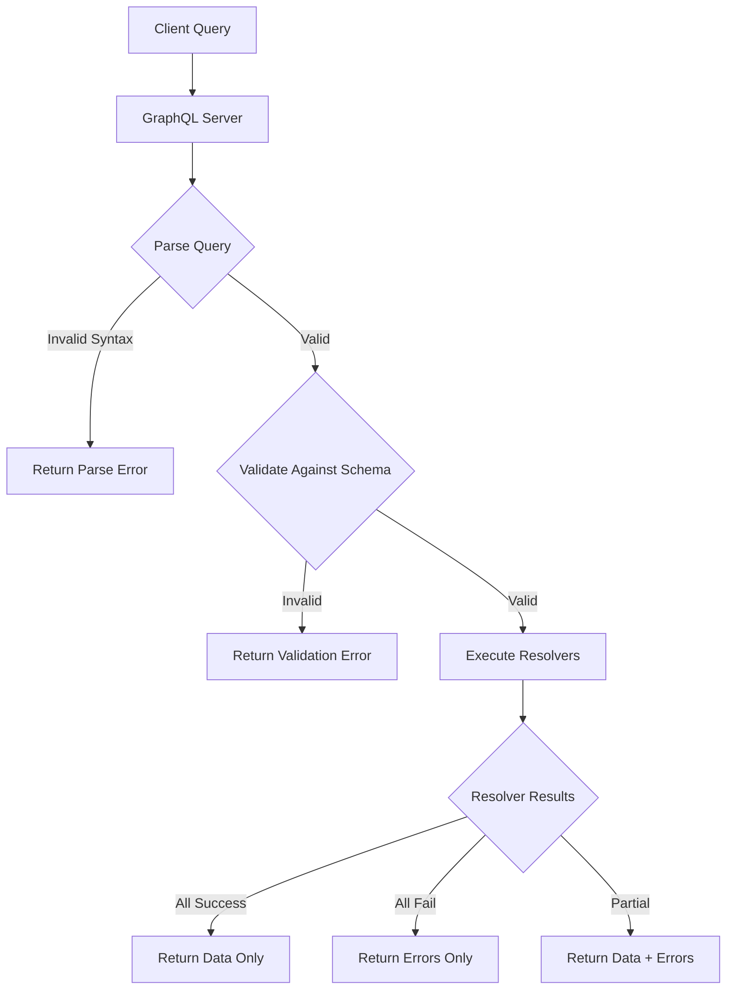
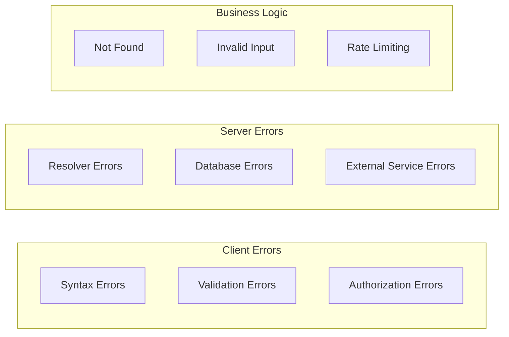
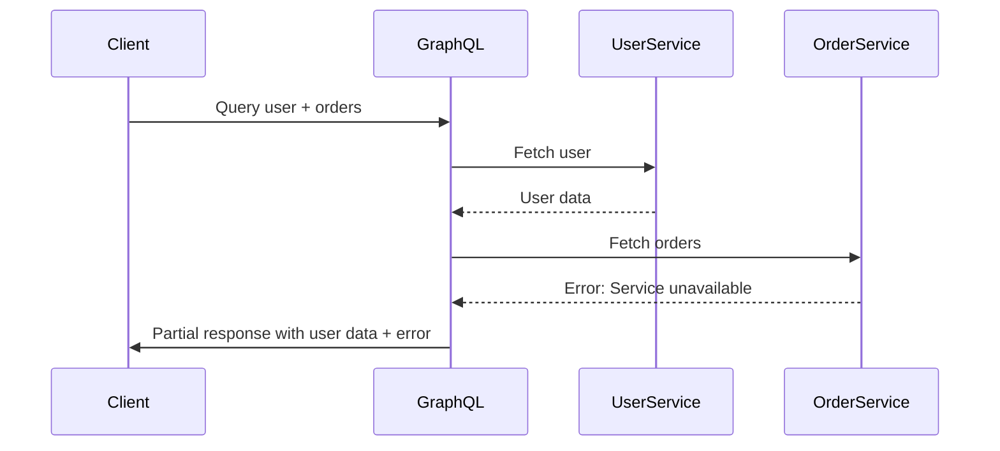
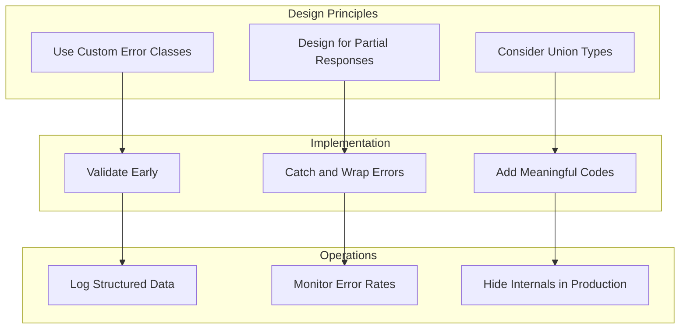

# How to Handle Errors in GraphQL

Author: [nawazdhandala](https://www.github.com/nawazdhandala)

Tags: GraphQL, Error Handling, API

Description: Learn comprehensive strategies for handling errors in GraphQL APIs, including custom error types, error formatting, partial responses, and client-side error management with practical examples.

---

Error handling in GraphQL differs significantly from traditional REST APIs. While REST relies on HTTP status codes to communicate errors, GraphQL always returns a 200 OK status and includes errors in the response body. This design choice enables partial responses, where some fields succeed while others fail. Understanding how to properly handle errors in GraphQL is essential for building robust, user-friendly APIs.

In this guide, we will explore the GraphQL error specification, implement custom error handling strategies, and build patterns that work well for both server-side and client-side development.

## Understanding GraphQL Error Structure

GraphQL defines a standard error format in its specification. Every GraphQL response can contain two top-level fields: `data` and `errors`. This structure allows the server to return partial data alongside error information.

The following diagram illustrates how GraphQL processes a query and determines whether to return data, errors, or both:



A standard GraphQL error response follows this structure. Each error object contains a message, optional path to the field that caused the error, location information for debugging, and an extensions object for custom metadata:

```json
{
  "data": {
    "user": null
  },
  "errors": [
    {
      "message": "User not found",
      "path": ["user"],
      "locations": [{ "line": 2, "column": 3 }],
      "extensions": {
        "code": "USER_NOT_FOUND",
        "statusCode": 404
      }
    }
  ]
}
```

The key fields in a GraphQL error are:

- **message**: Human-readable description of the error
- **path**: Array showing which field in the query caused the error
- **locations**: Where in the query document the error occurred
- **extensions**: Custom metadata like error codes and additional context

## Types of GraphQL Errors

GraphQL errors fall into several categories, each requiring different handling strategies. Understanding these categories helps you implement appropriate error responses.



### Syntax Errors

Syntax errors occur when the query string is malformed. GraphQL catches these during parsing before any execution happens:

```graphql
# This query has a syntax error - missing closing brace
query GetUser {
  user(id: "123") {
    name
    email

```

### Validation Errors

Validation errors occur when the query is syntactically correct but violates the schema. For example, querying a field that does not exist:

```graphql
# This query references a field that does not exist in the schema
query GetUser {
  user(id: "123") {
    name
    nonExistentField
  }
}
```

### Resolver Errors

Resolver errors happen during execution when the resolver function throws an exception or returns an error. These are the most common errors you will handle in application code.

## Building Custom Error Classes

Creating custom error classes helps standardize error handling across your GraphQL API. The following implementation creates a base error class and specific error types for common scenarios.

This base class extends the standard Error and adds properties that map to GraphQL error extensions. Using typed error classes makes it easier to catch and handle specific error types:

```javascript
// Base GraphQL error class that all custom errors extend
// Includes code and statusCode for consistent error responses
class GraphQLError extends Error {
  constructor(message, code, statusCode = 500) {
    super(message);
    this.name = this.constructor.name;
    // Error code for client-side error handling
    this.code = code;
    // HTTP-equivalent status for logging and monitoring
    this.statusCode = statusCode;
    // Captures stack trace for debugging
    Error.captureStackTrace(this, this.constructor);
  }
}

// Thrown when a requested resource does not exist
class NotFoundError extends GraphQLError {
  constructor(resource, id) {
    super(`${resource} with ID ${id} not found`, 'NOT_FOUND', 404);
    this.resource = resource;
    this.resourceId = id;
  }
}

// Thrown when user lacks permission to access a resource
class UnauthorizedError extends GraphQLError {
  constructor(message = 'You are not authorized to perform this action') {
    super(message, 'UNAUTHORIZED', 401);
  }
}

// Thrown when user input fails validation rules
class ValidationError extends GraphQLError {
  constructor(message, field, value) {
    super(message, 'VALIDATION_ERROR', 400);
    // Store which field failed validation
    this.field = field;
    // Store the invalid value for debugging
    this.invalidValue = value;
  }
}

// Thrown when user exceeds rate limits
class RateLimitError extends GraphQLError {
  constructor(retryAfter = 60) {
    super('Too many requests. Please try again later.', 'RATE_LIMITED', 429);
    // Tell client when they can retry
    this.retryAfter = retryAfter;
  }
}
```

## Implementing Error Handling in Resolvers

Resolvers are where most errors originate. Implementing consistent error handling patterns in your resolvers ensures predictable behavior.

The following resolver demonstrates proper error handling with try-catch blocks and custom error types. Each potential failure mode is handled explicitly:

```javascript
// User resolver with comprehensive error handling
const userResolver = {
  Query: {
    // Fetches a single user by ID with full error handling
    user: async (_, { id }, context) => {
      // Check authentication first
      if (!context.user) {
        throw new UnauthorizedError('Authentication required to view user profiles');
      }

      try {
        // Attempt to fetch user from database
        const user = await context.dataSources.users.findById(id);

        // Handle case where user does not exist
        if (!user) {
          throw new NotFoundError('User', id);
        }

        // Check if requesting user has permission to view this profile
        if (!canViewProfile(context.user, user)) {
          throw new UnauthorizedError('You cannot view this profile');
        }

        return user;
      } catch (error) {
        // Re-throw our custom errors as-is
        if (error instanceof GraphQLError) {
          throw error;
        }

        // Log unexpected errors for debugging
        console.error('Unexpected error fetching user:', error);

        // Wrap unknown errors to avoid leaking internal details
        throw new GraphQLError(
          'An unexpected error occurred',
          'INTERNAL_ERROR',
          500
        );
      }
    },

    // Fetches multiple users with pagination
    users: async (_, { limit = 10, offset = 0 }, context) => {
      // Validate pagination parameters
      if (limit < 1 || limit > 100) {
        throw new ValidationError(
          'Limit must be between 1 and 100',
          'limit',
          limit
        );
      }

      if (offset < 0) {
        throw new ValidationError(
          'Offset cannot be negative',
          'offset',
          offset
        );
      }

      try {
        return await context.dataSources.users.findAll({ limit, offset });
      } catch (error) {
        console.error('Error fetching users:', error);
        throw new GraphQLError('Failed to fetch users', 'FETCH_ERROR', 500);
      }
    }
  },

  Mutation: {
    // Creates a new user with input validation
    createUser: async (_, { input }, context) => {
      // Validate required fields
      if (!input.email || !input.email.includes('@')) {
        throw new ValidationError(
          'Valid email address is required',
          'email',
          input.email
        );
      }

      if (!input.password || input.password.length < 8) {
        throw new ValidationError(
          'Password must be at least 8 characters',
          'password',
          '[REDACTED]'
        );
      }

      try {
        // Check for existing user with same email
        const existing = await context.dataSources.users.findByEmail(input.email);
        if (existing) {
          throw new ValidationError(
            'A user with this email already exists',
            'email',
            input.email
          );
        }

        // Create the user
        const user = await context.dataSources.users.create(input);
        return { success: true, user };
      } catch (error) {
        if (error instanceof GraphQLError) {
          throw error;
        }

        console.error('Error creating user:', error);
        throw new GraphQLError('Failed to create user', 'CREATE_ERROR', 500);
      }
    }
  }
};
```

## Error Formatting with Apollo Server

Apollo Server provides a `formatError` function that lets you customize how errors appear in responses. This is where you transform internal errors into client-safe responses.

The formatError function runs for every error before it is sent to the client. Use it to add metadata, redact sensitive information, and standardize error structure:

```javascript
const { ApolloServer } = require('@apollo/server');

// Custom error formatter that transforms errors for client consumption
function formatError(formattedError, error) {
  // Get the original error that was thrown
  const originalError = error.originalError;

  // Start with the formatted error from Apollo
  const formatted = {
    message: formattedError.message,
    path: formattedError.path,
    locations: formattedError.locations,
    extensions: {
      // Default to INTERNAL_ERROR if no code provided
      code: formattedError.extensions?.code || 'INTERNAL_ERROR',
      // Include timestamp for debugging
      timestamp: new Date().toISOString()
    }
  };

  // Add custom properties from our error classes
  if (originalError instanceof GraphQLError) {
    formatted.extensions.code = originalError.code;
    formatted.extensions.statusCode = originalError.statusCode;

    // Add field information for validation errors
    if (originalError instanceof ValidationError) {
      formatted.extensions.field = originalError.field;
    }

    // Add retry information for rate limit errors
    if (originalError instanceof RateLimitError) {
      formatted.extensions.retryAfter = originalError.retryAfter;
    }

    // Add resource information for not found errors
    if (originalError instanceof NotFoundError) {
      formatted.extensions.resource = originalError.resource;
      formatted.extensions.resourceId = originalError.resourceId;
    }
  }

  // In production, hide internal error details
  if (process.env.NODE_ENV === 'production') {
    // Remove stack traces
    delete formatted.extensions.stacktrace;

    // Sanitize internal error messages
    if (!originalError || !(originalError instanceof GraphQLError)) {
      formatted.message = 'An internal error occurred';
    }
  }

  return formatted;
}

// Create Apollo Server with custom error formatting
const server = new ApolloServer({
  typeDefs,
  resolvers,
  formatError
});
```

## Handling Partial Responses

One of GraphQL's powerful features is the ability to return partial data when only some fields fail. This is particularly useful for complex queries where one failing field should not prevent returning valid data.

The following diagram shows how GraphQL handles a query where some fields succeed and others fail:



Here is how you implement nullable fields to enable partial responses. Making fields nullable allows GraphQL to return null for failed fields while still returning successful data:

```graphql
# Schema designed for partial responses
# Nullable fields allow returning data even when some fields fail
type Query {
  # Returns null if user not found, error in extensions
  user(id: ID!): User

  # Can return empty array if service fails
  users(limit: Int, offset: Int): [User!]!
}

type User {
  id: ID!
  name: String!
  email: String!

  # Nullable because order service might be unavailable
  orders: [Order!]

  # Nullable because recommendation service might fail
  recommendations: [Product!]

  # Nullable because statistics calculation might timeout
  statistics: UserStatistics
}
```

The resolver implementation handles each field independently, catching errors and returning null instead of failing the entire query:

```javascript
const resolvers = {
  User: {
    // Fetch orders separately, allowing partial response if this fails
    orders: async (user, _, context) => {
      try {
        return await context.dataSources.orders.findByUserId(user.id);
      } catch (error) {
        // Log the error for monitoring
        console.error(`Failed to fetch orders for user ${user.id}:`, error);

        // Return null instead of failing the entire query
        // The client will see null for orders but still get user data
        return null;
      }
    },

    // Fetch recommendations with timeout protection
    recommendations: async (user, _, context) => {
      try {
        // Set a timeout to prevent slow recommendation service from
        // blocking the entire response
        const recommendations = await Promise.race([
          context.dataSources.recommendations.getForUser(user.id),
          new Promise((_, reject) =>
            setTimeout(() => reject(new Error('Timeout')), 2000)
          )
        ]);

        return recommendations;
      } catch (error) {
        console.error(`Recommendations failed for user ${user.id}:`, error);
        return null;
      }
    }
  }
};
```

## Union Types for Error Handling

A popular pattern in GraphQL is using union types to represent either success or error states. This makes errors part of the schema rather than relying on the errors array.

This approach provides type-safe error handling where clients must explicitly handle error cases. The schema defines what errors are possible for each operation:

```graphql
# Define possible error types for user operations
type UserNotFoundError {
  message: String!
  userId: ID!
}

type ValidationError {
  message: String!
  field: String!
  value: String
}

type UnauthorizedError {
  message: String!
  requiredPermission: String
}

# Union type representing all possible results of fetching a user
union UserResult = User | UserNotFoundError | UnauthorizedError

# Union type for mutation results
union CreateUserResult = CreateUserSuccess | ValidationError | UnauthorizedError

type CreateUserSuccess {
  user: User!
}

type Query {
  # Returns either User or an error type
  userResult(id: ID!): UserResult!
}

type Mutation {
  # Returns either success or an error type
  createUser(input: CreateUserInput!): CreateUserResult!
}
```

The resolver returns the appropriate type based on the result. The __typename field tells GraphQL which type in the union is being returned:

```javascript
const resolvers = {
  Query: {
    userResult: async (_, { id }, context) => {
      // Check authentication
      if (!context.user) {
        return {
          __typename: 'UnauthorizedError',
          message: 'Authentication required',
          requiredPermission: 'read:users'
        };
      }

      // Fetch user
      const user = await context.dataSources.users.findById(id);

      if (!user) {
        return {
          __typename: 'UserNotFoundError',
          message: `User with ID ${id} not found`,
          userId: id
        };
      }

      // Return success case
      return {
        __typename: 'User',
        ...user
      };
    }
  },

  Mutation: {
    createUser: async (_, { input }, context) => {
      // Validate email
      if (!input.email || !input.email.includes('@')) {
        return {
          __typename: 'ValidationError',
          message: 'Invalid email address',
          field: 'email',
          value: input.email
        };
      }

      try {
        const user = await context.dataSources.users.create(input);
        return {
          __typename: 'CreateUserSuccess',
          user
        };
      } catch (error) {
        return {
          __typename: 'ValidationError',
          message: error.message,
          field: 'unknown',
          value: null
        };
      }
    }
  },

  // Resolve union types
  UserResult: {
    __resolveType(obj) {
      // Check which type this object represents
      if (obj.userId !== undefined) return 'UserNotFoundError';
      if (obj.requiredPermission !== undefined) return 'UnauthorizedError';
      return 'User';
    }
  },

  CreateUserResult: {
    __resolveType(obj) {
      if (obj.user) return 'CreateUserSuccess';
      if (obj.field) return 'ValidationError';
      return 'UnauthorizedError';
    }
  }
};
```

## Client-Side Error Handling

Proper error handling on the client side is essential for good user experience. Here is how to handle GraphQL errors in a React application using Apollo Client.

This example shows comprehensive error handling with different responses for different error types:

```javascript
import { useQuery, useMutation } from '@apollo/client';

// Custom hook that wraps useQuery with error handling
function useUserQuery(userId) {
  const { data, loading, error } = useQuery(GET_USER, {
    variables: { id: userId },
    // Configure error policy to get partial data with errors
    errorPolicy: 'all'
  });

  // Process GraphQL errors from the response
  const processedError = useMemo(() => {
    if (!error) return null;

    // Check for network errors
    if (error.networkError) {
      return {
        type: 'NETWORK',
        message: 'Unable to connect to server. Please check your connection.'
      };
    }

    // Process GraphQL errors
    if (error.graphQLErrors?.length > 0) {
      const firstError = error.graphQLErrors[0];
      const code = firstError.extensions?.code;

      switch (code) {
        case 'NOT_FOUND':
          return {
            type: 'NOT_FOUND',
            message: firstError.message,
            resource: firstError.extensions?.resource
          };

        case 'UNAUTHORIZED':
          return {
            type: 'AUTH',
            message: 'Please sign in to view this content'
          };

        case 'RATE_LIMITED':
          return {
            type: 'RATE_LIMIT',
            message: firstError.message,
            retryAfter: firstError.extensions?.retryAfter
          };

        default:
          return {
            type: 'UNKNOWN',
            message: 'Something went wrong. Please try again.'
          };
      }
    }

    return {
      type: 'UNKNOWN',
      message: 'An unexpected error occurred'
    };
  }, [error]);

  return {
    user: data?.user,
    loading,
    error: processedError
  };
}

// Component using the custom hook
function UserProfile({ userId }) {
  const { user, loading, error } = useUserQuery(userId);

  if (loading) {
    return <LoadingSpinner />;
  }

  if (error) {
    // Render different error states based on error type
    switch (error.type) {
      case 'NOT_FOUND':
        return <NotFoundPage resource={error.resource} />;

      case 'AUTH':
        return <LoginPrompt message={error.message} />;

      case 'RATE_LIMIT':
        return (
          <RateLimitMessage
            retryAfter={error.retryAfter}
            onRetry={() => refetch()}
          />
        );

      case 'NETWORK':
        return <NetworkErrorBanner onRetry={() => refetch()} />;

      default:
        return <GenericError message={error.message} />;
    }
  }

  return <UserCard user={user} />;
}
```

## Error Handling for Mutations

Mutations require special attention for error handling because they modify data. You need to handle optimistic updates, rollbacks, and error states.

This mutation handler shows how to manage errors while providing good user feedback:

```javascript
// Mutation hook with comprehensive error handling
function useCreateUser() {
  const [createUser, { loading }] = useMutation(CREATE_USER, {
    // Update cache on success
    update(cache, { data }) {
      if (data?.createUser?.__typename === 'CreateUserSuccess') {
        // Add new user to cached list
        cache.modify({
          fields: {
            users(existingUsers = []) {
              const newUserRef = cache.writeFragment({
                data: data.createUser.user,
                fragment: USER_FRAGMENT
              });
              return [...existingUsers, newUserRef];
            }
          }
        });
      }
    },

    // Handle errors at the Apollo level
    onError(error) {
      // Log for debugging
      console.error('CreateUser mutation failed:', error);

      // Track in monitoring system
      trackError('create_user_failed', {
        message: error.message,
        graphQLErrors: error.graphQLErrors
      });
    }
  });

  // Wrapper function that processes the result
  const handleCreateUser = async (input) => {
    try {
      const { data } = await createUser({
        variables: { input }
      });

      // Handle union type result
      const result = data?.createUser;

      if (!result) {
        return {
          success: false,
          error: { type: 'UNKNOWN', message: 'No response received' }
        };
      }

      switch (result.__typename) {
        case 'CreateUserSuccess':
          return { success: true, user: result.user };

        case 'ValidationError':
          return {
            success: false,
            error: {
              type: 'VALIDATION',
              message: result.message,
              field: result.field
            }
          };

        case 'UnauthorizedError':
          return {
            success: false,
            error: {
              type: 'AUTH',
              message: result.message
            }
          };

        default:
          return {
            success: false,
            error: { type: 'UNKNOWN', message: 'Unexpected response type' }
          };
      }
    } catch (error) {
      // Handle network errors
      return {
        success: false,
        error: {
          type: 'NETWORK',
          message: 'Failed to connect to server'
        }
      };
    }
  };

  return { createUser: handleCreateUser, loading };
}
```

## Logging and Monitoring Errors

Proper error logging helps you identify and fix issues in production. Implement structured logging that captures all relevant context.

The following plugin logs errors with context for debugging and monitoring integration:

```javascript
// Apollo Server plugin for error logging and monitoring
const errorLoggingPlugin = {
  async requestDidStart() {
    return {
      async didEncounterErrors(requestContext) {
        // Extract relevant context
        const { errors, request, context } = requestContext;

        for (const error of errors) {
          // Build structured log entry
          const logEntry = {
            timestamp: new Date().toISOString(),
            level: error.originalError instanceof GraphQLError ? 'warn' : 'error',
            message: error.message,
            code: error.extensions?.code,
            path: error.path?.join('.'),

            // Request context
            operationName: request.operationName,
            query: request.query?.slice(0, 500), // Truncate long queries
            variables: sanitizeVariables(request.variables),

            // User context if available
            userId: context.user?.id,

            // Stack trace for debugging (not in production logs)
            stack: process.env.NODE_ENV !== 'production'
              ? error.originalError?.stack
              : undefined
          };

          // Log to your logging service
          logger.log(logEntry);

          // Track in monitoring system
          if (logEntry.level === 'error') {
            monitoring.trackError({
              name: error.name,
              message: error.message,
              code: error.extensions?.code,
              tags: {
                operation: request.operationName,
                path: logEntry.path
              }
            });
          }
        }
      }
    };
  }
};

// Helper to remove sensitive data from logged variables
function sanitizeVariables(variables) {
  if (!variables) return undefined;

  const sanitized = { ...variables };
  const sensitiveFields = ['password', 'token', 'secret', 'apiKey'];

  for (const field of sensitiveFields) {
    if (sanitized[field]) {
      sanitized[field] = '[REDACTED]';
    }
  }

  return sanitized;
}

// Add plugin to Apollo Server
const server = new ApolloServer({
  typeDefs,
  resolvers,
  plugins: [errorLoggingPlugin]
});
```

## Best Practices Summary

Following these best practices will help you build robust error handling in your GraphQL APIs:



**Design Principles:**

1. **Use custom error classes** with consistent properties like code and statusCode
2. **Design schemas for partial responses** by making non-critical fields nullable
3. **Consider union types** for operations where error handling should be type-safe

**Implementation Guidelines:**

4. **Validate inputs early** before performing database operations
5. **Catch and wrap unexpected errors** to prevent leaking internal details
6. **Add meaningful error codes** that clients can use for programmatic handling

**Operational Concerns:**

7. **Log errors with context** including operation names, paths, and user IDs
8. **Monitor error rates** and set up alerts for unusual patterns
9. **Hide internal details in production** while keeping them available in development

## Common Pitfalls to Avoid

When implementing error handling in GraphQL, watch out for these common mistakes:

**Leaking sensitive information:** Never expose database error messages, stack traces, or internal system details in production responses. Always sanitize errors before sending them to clients.

**Using HTTP status codes:** GraphQL uses 200 OK for all responses, including errors. Do not try to use 404 or 500 status codes; instead, use error codes in the extensions field.

**Ignoring partial responses:** Design your schema to take advantage of partial responses. Make fields nullable when appropriate so that one failing field does not break the entire query.

**Inconsistent error formats:** Establish a standard error format early and use it consistently across all resolvers. Inconsistent errors make client-side handling difficult.

**Not handling network errors:** GraphQL clients need to handle both GraphQL errors and network errors differently. Make sure your client code accounts for both cases.

## Conclusion

Error handling in GraphQL requires a different mindset than REST APIs. By understanding the error specification, implementing custom error classes, using union types where appropriate, and properly formatting errors for clients, you can build GraphQL APIs that are robust and user-friendly.

The key takeaways are:

- GraphQL returns errors in the response body, not via HTTP status codes
- Custom error classes with codes and metadata make debugging easier
- Union types provide type-safe error handling at the schema level
- Partial responses allow returning valid data alongside errors
- Proper logging and monitoring are essential for production systems

Implementing these patterns from the start will save significant debugging time and improve the developer experience for anyone consuming your API.
