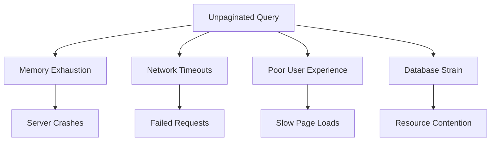
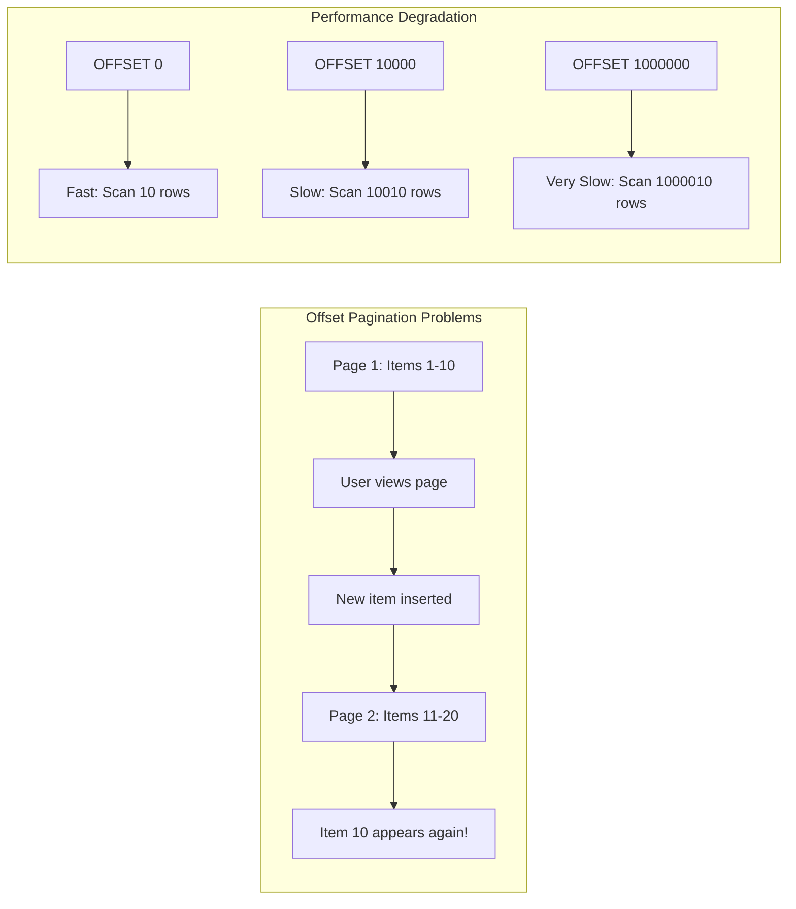
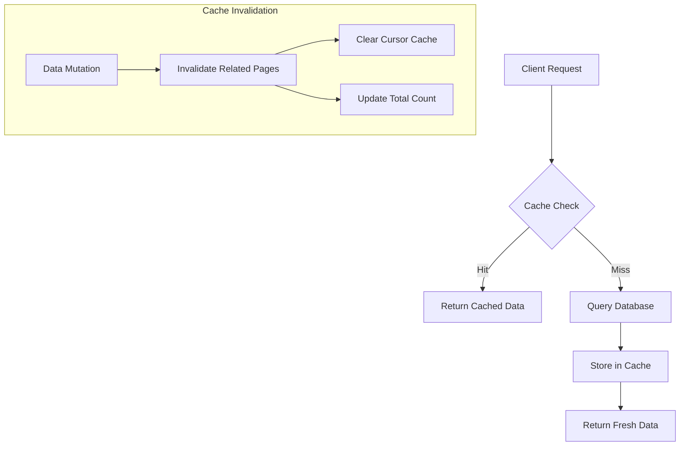
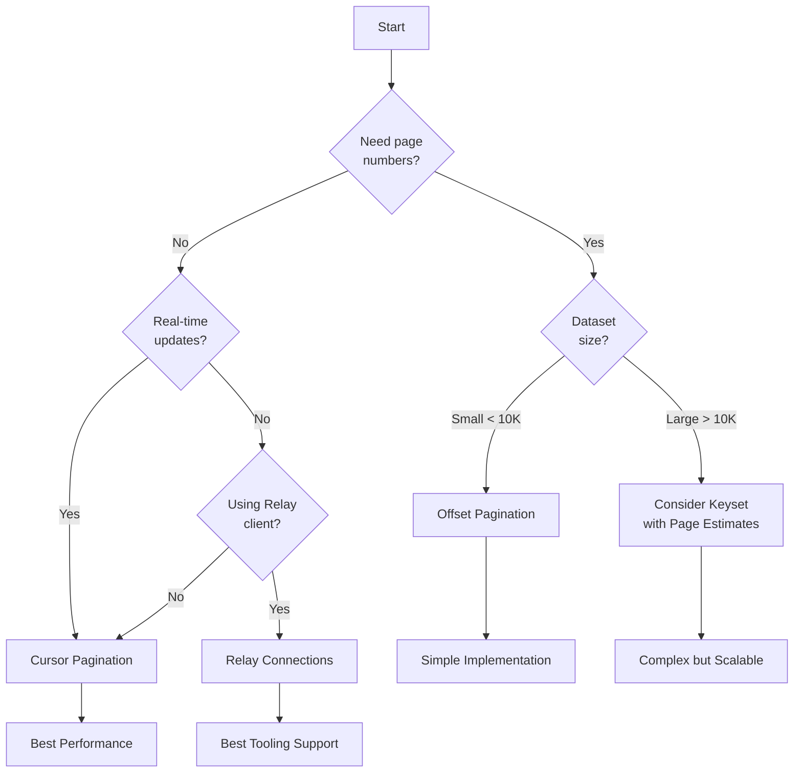

# How to Implement Pagination in GraphQL

Author: [nawazdhandala](https://github.com/nawazdhandala)

Tags: GraphQL, Pagination, API, Cursor

Description: A comprehensive guide to implementing pagination in GraphQL APIs, covering offset-based, cursor-based, and keyset pagination with practical examples, database optimizations, and production best practices.

---

Pagination is one of the most critical patterns in API design. When your GraphQL API needs to return lists of data, you must decide how clients will navigate through large datasets efficiently. Poor pagination choices lead to slow queries, inconsistent results, and frustrated users. This guide walks you through implementing pagination correctly in GraphQL, with real code examples and production-ready patterns.

## Understanding Why Pagination Matters

Before diving into implementation, let's understand the problem pagination solves. Consider a GraphQL query that fetches all users:

```graphql
query {
  users {
    id
    name
    email
  }
}
```

Without pagination, this query might return millions of records, causing several problems:



Pagination solves these problems by breaking large datasets into manageable chunks. Let's explore the three main pagination strategies and when to use each.

## Offset-Based Pagination

Offset pagination is the simplest approach. It uses `limit` and `offset` parameters to specify which slice of data to return.

### Schema Design for Offset Pagination

The following GraphQL schema defines types and queries for offset-based pagination with sorting support.

```graphql
# Define the input type for pagination parameters
input PaginationInput {
  # Number of items to skip (defaults to 0)
  offset: Int = 0
  # Maximum number of items to return (defaults to 20)
  limit: Int = 20
}

# Define sorting options for user queries
enum UserSortField {
  CREATED_AT
  NAME
  EMAIL
}

enum SortDirection {
  ASC
  DESC
}

# Input for sorting configuration
input UserSortInput {
  field: UserSortField = CREATED_AT
  direction: SortDirection = DESC
}

# The paginated result type contains items and metadata
type UserPage {
  # The list of users for the current page
  items: [User!]!
  # Total number of users matching the query
  totalCount: Int!
  # Whether more items exist after this page
  hasMore: Boolean!
  # Current offset position
  currentOffset: Int!
}

type Query {
  # Query users with pagination and optional sorting
  users(
    pagination: PaginationInput
    sort: UserSortInput
  ): UserPage!
}
```

### Resolver Implementation for Offset Pagination

This resolver handles offset-based pagination with validation and parallel query execution.

```typescript
// src/resolvers/userResolver.ts
import { PrismaClient } from '@prisma/client';

const prisma = new PrismaClient();

// Maximum items per page to prevent abuse
const MAX_LIMIT = 100;
// Default items per page
const DEFAULT_LIMIT = 20;

interface PaginationInput {
  offset?: number;
  limit?: number;
}

interface UserSortInput {
  field?: 'CREATED_AT' | 'NAME' | 'EMAIL';
  direction?: 'ASC' | 'DESC';
}

// Map GraphQL enum values to database column names
const sortFieldMap: Record<string, string> = {
  CREATED_AT: 'createdAt',
  NAME: 'name',
  EMAIL: 'email',
};

export const userResolvers = {
  Query: {
    users: async (
      _parent: unknown,
      args: { pagination?: PaginationInput; sort?: UserSortInput }
    ) => {
      // Extract and validate pagination parameters
      const offset = Math.max(0, args.pagination?.offset ?? 0);
      const limit = Math.min(
        MAX_LIMIT,
        Math.max(1, args.pagination?.limit ?? DEFAULT_LIMIT)
      );

      // Build sort configuration
      const sortField = sortFieldMap[args.sort?.field ?? 'CREATED_AT'];
      const sortDirection = (args.sort?.direction ?? 'DESC').toLowerCase();

      // Execute queries in parallel for better performance
      // One query fetches the paginated items, the other counts total records
      const [items, totalCount] = await Promise.all([
        prisma.user.findMany({
          skip: offset,
          take: limit,
          orderBy: { [sortField]: sortDirection },
        }),
        prisma.user.count(),
      ]);

      // Calculate whether more items exist beyond this page
      const hasMore = offset + items.length < totalCount;

      return {
        items,
        totalCount,
        hasMore,
        currentOffset: offset,
      };
    },
  },
};
```

### Offset Pagination Limitations

While offset pagination is simple, it has significant drawbacks that make it unsuitable for certain use cases.



Key limitations of offset pagination:

1. **Performance degrades with large offsets**: The database must scan and discard all rows before the offset
2. **Inconsistent results with concurrent modifications**: Items can be duplicated or skipped when data changes between page requests
3. **Not suitable for real-time data**: Feeds, notifications, and live data streams become unreliable

## Cursor-Based Pagination

Cursor pagination solves the consistency and performance problems of offset pagination by using a stable reference point instead of a numeric position.

### Schema Design for Cursor Pagination

The following schema implements cursor-based pagination following common GraphQL conventions.

```graphql
# PageInfo provides navigation metadata for cursor pagination
type PageInfo {
  # Cursor of the first item in the current page
  startCursor: String
  # Cursor of the last item in the current page
  endCursor: String
  # Whether more items exist after endCursor
  hasNextPage: Boolean!
  # Whether more items exist before startCursor
  hasPreviousPage: Boolean!
}

# Edge wraps each item with its cursor for navigation
type UserEdge {
  # The actual user data
  node: User!
  # Opaque cursor for this specific item
  cursor: String!
}

# Connection type for paginated user results
type UserConnection {
  # List of edges containing users and their cursors
  edges: [UserEdge!]!
  # Pagination metadata
  pageInfo: PageInfo!
  # Total count of all users (optional but useful for UI)
  totalCount: Int!
}

type Query {
  # Forward pagination: use 'first' and 'after'
  # Backward pagination: use 'last' and 'before'
  users(
    first: Int
    after: String
    last: Int
    before: String
  ): UserConnection!
}
```

### Implementing Cursor Encoding and Decoding

Cursors should be opaque to clients. The following utility functions handle cursor encoding and decoding securely.

```typescript
// src/utils/cursor.ts

// Cursor data structure containing the field value and unique identifier
interface CursorData {
  // The value of the sort field at this position
  value: string | number | Date;
  // Unique identifier to break ties when sort values are equal
  id: string;
}

// Encode cursor data into a base64 string
// Using base64 makes cursors opaque and prevents clients from manipulating them
export function encodeCursor(data: CursorData): string {
  const payload = JSON.stringify({
    v: data.value instanceof Date ? data.value.toISOString() : data.value,
    i: data.id,
  });
  return Buffer.from(payload).toString('base64');
}

// Decode a cursor string back into its component parts
// Returns null if the cursor is invalid or malformed
export function decodeCursor(cursor: string): CursorData | null {
  try {
    const payload = JSON.parse(Buffer.from(cursor, 'base64').toString('utf8'));
    return {
      value: payload.v,
      id: payload.i,
    };
  } catch {
    // Return null for invalid cursors rather than throwing
    // This allows graceful handling of corrupted or tampered cursors
    return null;
  }
}

// Validate that cursor data matches expected format
export function isValidCursor(cursor: string): boolean {
  const decoded = decodeCursor(cursor);
  return decoded !== null && decoded.id !== undefined && decoded.value !== undefined;
}
```

### Resolver Implementation for Cursor Pagination

This resolver implements forward and backward cursor pagination with proper handling of edge cases.

```typescript
// src/resolvers/cursorPaginationResolver.ts
import { PrismaClient, Prisma } from '@prisma/client';
import { encodeCursor, decodeCursor } from '../utils/cursor';

const prisma = new PrismaClient();

// Maximum items per request
const MAX_PAGE_SIZE = 100;
// Default items if not specified
const DEFAULT_PAGE_SIZE = 20;

interface ConnectionArgs {
  first?: number;
  after?: string;
  last?: number;
  before?: string;
}

export const cursorPaginationResolvers = {
  Query: {
    users: async (_parent: unknown, args: ConnectionArgs) => {
      // Determine pagination direction and validate arguments
      const isForwardPagination = args.first !== undefined || args.after !== undefined;
      const isBackwardPagination = args.last !== undefined || args.before !== undefined;

      // Validate that client isn't mixing forward and backward pagination
      if (isForwardPagination && isBackwardPagination) {
        throw new Error(
          'Cannot use forward pagination (first/after) and backward pagination (last/before) together'
        );
      }

      // Calculate the page size with bounds checking
      let pageSize: number;
      if (args.first !== undefined) {
        pageSize = Math.min(MAX_PAGE_SIZE, Math.max(1, args.first));
      } else if (args.last !== undefined) {
        pageSize = Math.min(MAX_PAGE_SIZE, Math.max(1, args.last));
      } else {
        pageSize = DEFAULT_PAGE_SIZE;
      }

      // Build the WHERE clause based on cursor
      const whereClause: Prisma.UserWhereInput = {};
      const cursor = args.after || args.before;

      if (cursor) {
        const cursorData = decodeCursor(cursor);
        if (!cursorData) {
          throw new Error('Invalid cursor format');
        }

        // For forward pagination, get items after the cursor
        // For backward pagination, get items before the cursor
        if (args.after) {
          whereClause.OR = [
            // Items with the same timestamp but higher ID
            {
              createdAt: new Date(cursorData.value as string),
              id: { gt: cursorData.id },
            },
            // Items with a later timestamp
            {
              createdAt: { gt: new Date(cursorData.value as string) },
            },
          ];
        } else if (args.before) {
          whereClause.OR = [
            // Items with the same timestamp but lower ID
            {
              createdAt: new Date(cursorData.value as string),
              id: { lt: cursorData.id },
            },
            // Items with an earlier timestamp
            {
              createdAt: { lt: new Date(cursorData.value as string) },
            },
          ];
        }
      }

      // Fetch one extra item to determine if there are more pages
      const items = await prisma.user.findMany({
        where: whereClause,
        take: pageSize + 1,
        orderBy: [
          { createdAt: isBackwardPagination ? 'asc' : 'desc' },
          { id: isBackwardPagination ? 'asc' : 'desc' },
        ],
      });

      // Check if we got the extra item indicating more pages exist
      const hasExtraItem = items.length > pageSize;

      // Remove the extra item and reverse if doing backward pagination
      let pageItems = items.slice(0, pageSize);
      if (isBackwardPagination) {
        pageItems = pageItems.reverse();
      }

      // Build edges with cursors for each item
      const edges = pageItems.map((user) => ({
        node: user,
        cursor: encodeCursor({
          value: user.createdAt,
          id: user.id,
        }),
      }));

      // Get total count for UI display
      const totalCount = await prisma.user.count();

      // Build page info based on pagination direction
      const pageInfo = {
        startCursor: edges[0]?.cursor ?? null,
        endCursor: edges[edges.length - 1]?.cursor ?? null,
        hasNextPage: isBackwardPagination ? Boolean(args.before) : hasExtraItem,
        hasPreviousPage: isBackwardPagination ? hasExtraItem : Boolean(args.after),
      };

      return {
        edges,
        pageInfo,
        totalCount,
      };
    },
  },
};
```

## Keyset Pagination for Maximum Performance

Keyset pagination, also called seek pagination, is the most performant approach for large datasets. It uses indexed columns directly without the overhead of cursor encoding.

### Understanding Keyset Pagination

```mermaid
flowchart TD
    subgraph "Keyset vs Offset Performance"
        A[Keyset Query] --> B["WHERE created_at < '2024-01-15'<br/>AND id < 'abc123'"]
        B --> C[Index Seek: O(log n)]

        D[Offset Query] --> E["OFFSET 50000 LIMIT 20"]
        E --> F[Table Scan: O(n)]
    end

    subgraph "Index Usage"
        G[Keyset] --> H[Uses Index Directly]
        H --> I[Constant Time Lookup]

        J[Offset] --> K[Scans From Start]
        K --> L[Linear Time Growth]
    end
```

### Schema Design for Keyset Pagination

This schema uses explicit field values instead of opaque cursors for maximum transparency and performance.

```graphql
# Keyset pagination uses explicit field values for positioning
input UserKeysetInput {
  # The createdAt value to seek from
  seekCreatedAt: DateTime
  # The ID to seek from (for tie-breaking)
  seekId: ID
}

# Result type includes the keyset values for the next query
type UserKeysetPage {
  items: [User!]!
  # Last item's createdAt for next page query
  lastCreatedAt: DateTime
  # Last item's ID for next page query
  lastId: ID
  # Whether more items exist
  hasMore: Boolean!
  totalCount: Int!
}

type Query {
  usersKeyset(
    # Number of items to fetch
    limit: Int = 20
    # Keyset values for seeking
    keyset: UserKeysetInput
    # Sort direction
    direction: SortDirection = DESC
  ): UserKeysetPage!
}
```

### Resolver Implementation for Keyset Pagination

This implementation demonstrates keyset pagination with proper index utilization.

```typescript
// src/resolvers/keysetPaginationResolver.ts
import { PrismaClient, Prisma } from '@prisma/client';

const prisma = new PrismaClient();

const MAX_LIMIT = 100;
const DEFAULT_LIMIT = 20;

interface KeysetInput {
  seekCreatedAt?: Date;
  seekId?: string;
}

interface KeysetArgs {
  limit?: number;
  keyset?: KeysetInput;
  direction?: 'ASC' | 'DESC';
}

export const keysetResolvers = {
  Query: {
    usersKeyset: async (_parent: unknown, args: KeysetArgs) => {
      const limit = Math.min(MAX_LIMIT, Math.max(1, args.limit ?? DEFAULT_LIMIT));
      const direction = args.direction ?? 'DESC';
      const isDescending = direction === 'DESC';

      // Build WHERE clause for keyset pagination
      // This query uses the index on (createdAt, id) efficiently
      const whereClause: Prisma.UserWhereInput = {};

      if (args.keyset?.seekCreatedAt && args.keyset?.seekId) {
        // Compound condition ensures correct ordering with duplicates
        if (isDescending) {
          // For descending order, get items before the keyset position
          whereClause.OR = [
            {
              createdAt: args.keyset.seekCreatedAt,
              id: { lt: args.keyset.seekId },
            },
            {
              createdAt: { lt: args.keyset.seekCreatedAt },
            },
          ];
        } else {
          // For ascending order, get items after the keyset position
          whereClause.OR = [
            {
              createdAt: args.keyset.seekCreatedAt,
              id: { gt: args.keyset.seekId },
            },
            {
              createdAt: { gt: args.keyset.seekCreatedAt },
            },
          ];
        }
      }

      // Fetch items with one extra to check for more pages
      const items = await prisma.user.findMany({
        where: whereClause,
        take: limit + 1,
        orderBy: [
          { createdAt: isDescending ? 'desc' : 'asc' },
          { id: isDescending ? 'desc' : 'asc' },
        ],
      });

      const hasMore = items.length > limit;
      const pageItems = items.slice(0, limit);
      const lastItem = pageItems[pageItems.length - 1];

      // Get total count
      const totalCount = await prisma.user.count();

      return {
        items: pageItems,
        lastCreatedAt: lastItem?.createdAt ?? null,
        lastId: lastItem?.id ?? null,
        hasMore,
        totalCount,
      };
    },
  },
};
```

### Database Index Optimization

For keyset pagination to be efficient, you need proper indexes on your database.

```sql
-- Create a composite index for keyset pagination on users table
-- This index supports both ascending and descending queries efficiently
CREATE INDEX idx_users_keyset ON users (created_at DESC, id DESC);

-- For queries that filter by additional columns, create covering indexes
-- This index supports pagination within a specific organization
CREATE INDEX idx_users_org_keyset ON users (organization_id, created_at DESC, id DESC);

-- Analyze the query plan to verify index usage
EXPLAIN ANALYZE
SELECT id, name, email, created_at
FROM users
WHERE (created_at, id) < ('2024-01-15 10:30:00', 'user_abc123')
ORDER BY created_at DESC, id DESC
LIMIT 21;
```

## Implementing Relay-Style Connections

The Relay specification provides a standardized approach to pagination that works well with client-side caching and data normalization.

### Complete Relay Connection Schema

This schema follows the Relay Connection specification with full bidirectional pagination support.

```graphql
# The Node interface enables global object identification
interface Node {
  # Globally unique identifier
  id: ID!
}

# Standard PageInfo type from Relay specification
type PageInfo {
  hasNextPage: Boolean!
  hasPreviousPage: Boolean!
  startCursor: String
  endCursor: String
}

# User type implementing Node for Relay compatibility
type User implements Node {
  id: ID!
  name: String!
  email: String!
  createdAt: DateTime!
  # Nested connection for user's posts
  posts(first: Int, after: String, last: Int, before: String): PostConnection!
}

type UserEdge {
  node: User!
  cursor: String!
}

type UserConnection {
  edges: [UserEdge!]!
  pageInfo: PageInfo!
  totalCount: Int!
}

type Post implements Node {
  id: ID!
  title: String!
  content: String!
  author: User!
  createdAt: DateTime!
}

type PostEdge {
  node: Post!
  cursor: String!
}

type PostConnection {
  edges: [PostEdge!]!
  pageInfo: PageInfo!
  totalCount: Int!
}

type Query {
  # Global node lookup by ID
  node(id: ID!): Node
  # Paginated users query
  users(first: Int, after: String, last: Int, before: String): UserConnection!
}
```

### Building a Reusable Connection Factory

Create a factory function to generate connection types and resolvers programmatically.

```typescript
// src/utils/connectionFactory.ts
import { encodeCursor, decodeCursor } from './cursor';

// Generic interface for items that can be paginated
interface Identifiable {
  id: string;
  createdAt: Date;
}

// Connection arguments matching Relay specification
interface ConnectionArgs {
  first?: number;
  after?: string;
  last?: number;
  before?: string;
}

// Edge type wrapping an item with its cursor
interface Edge<T> {
  node: T;
  cursor: string;
}

// PageInfo following Relay specification
interface PageInfo {
  hasNextPage: boolean;
  hasPreviousPage: boolean;
  startCursor: string | null;
  endCursor: string | null;
}

// Complete connection result
interface Connection<T> {
  edges: Edge<T>[];
  pageInfo: PageInfo;
  totalCount: number;
}

// Configuration for the connection factory
interface ConnectionFactoryConfig<T extends Identifiable> {
  // Function to fetch items from the database
  fetchItems: (params: {
    cursor?: { value: Date; id: string };
    limit: number;
    direction: 'forward' | 'backward';
  }) => Promise<T[]>;
  // Function to count total items
  countItems: () => Promise<number>;
  // Maximum page size
  maxPageSize?: number;
  // Default page size
  defaultPageSize?: number;
}

// Factory function that creates a connection resolver
export function createConnectionResolver<T extends Identifiable>(
  config: ConnectionFactoryConfig<T>
) {
  const maxPageSize = config.maxPageSize ?? 100;
  const defaultPageSize = config.defaultPageSize ?? 20;

  return async (args: ConnectionArgs): Promise<Connection<T>> => {
    // Validate arguments
    const isForward = args.first !== undefined || args.after !== undefined;
    const isBackward = args.last !== undefined || args.before !== undefined;

    if (isForward && isBackward) {
      throw new Error('Cannot mix forward and backward pagination');
    }

    // Determine page size
    const requestedSize = args.first ?? args.last ?? defaultPageSize;
    const pageSize = Math.min(maxPageSize, Math.max(1, requestedSize));

    // Parse cursor if provided
    const cursorString = args.after ?? args.before;
    let cursorData: { value: Date; id: string } | undefined;

    if (cursorString) {
      const decoded = decodeCursor(cursorString);
      if (!decoded) {
        throw new Error('Invalid cursor');
      }
      cursorData = {
        value: new Date(decoded.value as string),
        id: decoded.id,
      };
    }

    // Fetch items with one extra to detect more pages
    const items = await config.fetchItems({
      cursor: cursorData,
      limit: pageSize + 1,
      direction: isBackward ? 'backward' : 'forward',
    });

    // Process results
    const hasExtraItem = items.length > pageSize;
    let pageItems = items.slice(0, pageSize);

    // Reverse for backward pagination
    if (isBackward) {
      pageItems = pageItems.reverse();
    }

    // Build edges
    const edges: Edge<T>[] = pageItems.map((item) => ({
      node: item,
      cursor: encodeCursor({
        value: item.createdAt,
        id: item.id,
      }),
    }));

    // Get total count
    const totalCount = await config.countItems();

    // Build page info
    const pageInfo: PageInfo = {
      startCursor: edges[0]?.cursor ?? null,
      endCursor: edges[edges.length - 1]?.cursor ?? null,
      hasNextPage: isBackward ? Boolean(args.before) : hasExtraItem,
      hasPreviousPage: isBackward ? hasExtraItem : Boolean(args.after),
    };

    return { edges, pageInfo, totalCount };
  };
}
```

### Using the Connection Factory

Apply the factory to create paginated resolvers for different types.

```typescript
// src/resolvers/index.ts
import { PrismaClient, Prisma } from '@prisma/client';
import { createConnectionResolver } from '../utils/connectionFactory';
import { decodeCursor } from '../utils/cursor';

const prisma = new PrismaClient();

// Create a reusable user connection resolver
const userConnectionResolver = createConnectionResolver({
  fetchItems: async ({ cursor, limit, direction }) => {
    const isForward = direction === 'forward';
    const whereClause: Prisma.UserWhereInput = {};

    if (cursor) {
      whereClause.OR = isForward
        ? [
            { createdAt: cursor.value, id: { gt: cursor.id } },
            { createdAt: { gt: cursor.value } },
          ]
        : [
            { createdAt: cursor.value, id: { lt: cursor.id } },
            { createdAt: { lt: cursor.value } },
          ];
    }

    return prisma.user.findMany({
      where: whereClause,
      take: limit,
      orderBy: [
        { createdAt: isForward ? 'asc' : 'desc' },
        { id: isForward ? 'asc' : 'desc' },
      ],
    });
  },
  countItems: () => prisma.user.count(),
  maxPageSize: 50,
  defaultPageSize: 20,
});

// Create a post connection resolver for nested pagination
const createPostConnectionResolver = (userId: string) =>
  createConnectionResolver({
    fetchItems: async ({ cursor, limit, direction }) => {
      const isForward = direction === 'forward';
      const whereClause: Prisma.PostWhereInput = { authorId: userId };

      if (cursor) {
        whereClause.OR = isForward
          ? [
              { createdAt: cursor.value, id: { gt: cursor.id } },
              { createdAt: { gt: cursor.value } },
            ]
          : [
              { createdAt: cursor.value, id: { lt: cursor.id } },
              { createdAt: { lt: cursor.value } },
            ];
      }

      return prisma.post.findMany({
        where: whereClause,
        take: limit,
        orderBy: [
          { createdAt: isForward ? 'asc' : 'desc' },
          { id: isForward ? 'asc' : 'desc' },
        ],
      });
    },
    countItems: () => prisma.post.count({ where: { authorId: userId } }),
  });

export const resolvers = {
  Query: {
    users: (_parent: unknown, args: any) => userConnectionResolver(args),
  },
  User: {
    posts: (parent: { id: string }, args: any) =>
      createPostConnectionResolver(parent.id)(args),
  },
};
```

## Client-Side Implementation

Implementing pagination on the client requires handling loading states, caching, and infinite scroll or pagination controls.

### React Client with Apollo

This example shows a complete React component with cursor-based pagination and infinite scroll.

```tsx
// src/components/UserList.tsx
import { gql, useQuery } from '@apollo/client';
import { useCallback, useEffect, useRef, useState } from 'react';

// Define the GraphQL query with cursor pagination
const GET_USERS = gql`
  query GetUsers($first: Int!, $after: String) {
    users(first: $first, after: $after) {
      edges {
        node {
          id
          name
          email
          createdAt
        }
        cursor
      }
      pageInfo {
        hasNextPage
        endCursor
      }
      totalCount
    }
  }
`;

interface User {
  id: string;
  name: string;
  email: string;
  createdAt: string;
}

interface UserEdge {
  node: User;
  cursor: string;
}

interface UsersData {
  users: {
    edges: UserEdge[];
    pageInfo: {
      hasNextPage: boolean;
      endCursor: string | null;
    };
    totalCount: number;
  };
}

export function UserList() {
  const [isLoadingMore, setIsLoadingMore] = useState(false);
  const observerTarget = useRef<HTMLDivElement>(null);

  const { data, loading, error, fetchMore } = useQuery<UsersData>(GET_USERS, {
    variables: { first: 20 },
    notifyOnNetworkStatusChange: true,
  });

  // Function to load more users
  const loadMore = useCallback(async () => {
    if (!data?.users.pageInfo.hasNextPage || isLoadingMore) {
      return;
    }

    setIsLoadingMore(true);

    try {
      await fetchMore({
        variables: {
          first: 20,
          after: data.users.pageInfo.endCursor,
        },
        // Update the cache by merging new results
        updateQuery: (previousResult, { fetchMoreResult }) => {
          if (!fetchMoreResult) return previousResult;

          return {
            users: {
              ...fetchMoreResult.users,
              edges: [
                ...previousResult.users.edges,
                ...fetchMoreResult.users.edges,
              ],
            },
          };
        },
      });
    } finally {
      setIsLoadingMore(false);
    }
  }, [data, fetchMore, isLoadingMore]);

  // Set up intersection observer for infinite scroll
  useEffect(() => {
    const observer = new IntersectionObserver(
      (entries) => {
        // Load more when the target element becomes visible
        if (entries[0].isIntersecting) {
          loadMore();
        }
      },
      { threshold: 0.1 }
    );

    const currentTarget = observerTarget.current;
    if (currentTarget) {
      observer.observe(currentTarget);
    }

    return () => {
      if (currentTarget) {
        observer.unobserve(currentTarget);
      }
    };
  }, [loadMore]);

  if (error) {
    return (
      <div className="error">
        Error loading users: {error.message}
      </div>
    );
  }

  if (loading && !data) {
    return <div className="loading">Loading users...</div>;
  }

  return (
    <div className="user-list">
      <h2>Users ({data?.users.totalCount ?? 0})</h2>

      <ul>
        {data?.users.edges.map(({ node }) => (
          <li key={node.id} className="user-item">
            <strong>{node.name}</strong>
            <span>{node.email}</span>
            <small>
              Joined: {new Date(node.createdAt).toLocaleDateString()}
            </small>
          </li>
        ))}
      </ul>

      {/* Intersection observer target for infinite scroll */}
      <div ref={observerTarget} className="load-more-trigger">
        {isLoadingMore && <span>Loading more...</span>}
      </div>

      {/* Show message when all items are loaded */}
      {!data?.users.pageInfo.hasNextPage && (
        <p className="end-message">You have reached the end of the list</p>
      )}
    </div>
  );
}
```

## Performance Best Practices

Follow these practices to ensure your pagination implementation performs well at scale.

### Avoiding the N+1 Problem with DataLoader

When paginating items that have nested connections, use DataLoader to batch database queries.

```typescript
// src/loaders/postLoader.ts
import DataLoader from 'dataloader';
import { PrismaClient } from '@prisma/client';

const prisma = new PrismaClient();

// Create a DataLoader that batches post lookups by user ID
export function createPostLoader() {
  return new DataLoader<string, any[]>(async (userIds) => {
    // Fetch all posts for all requested user IDs in a single query
    const posts = await prisma.post.findMany({
      where: {
        authorId: { in: [...userIds] },
      },
      orderBy: { createdAt: 'desc' },
    });

    // Group posts by author ID
    const postsByUserId = new Map<string, any[]>();
    for (const post of posts) {
      const userPosts = postsByUserId.get(post.authorId) ?? [];
      userPosts.push(post);
      postsByUserId.set(post.authorId, userPosts);
    }

    // Return posts in the same order as the input user IDs
    return userIds.map((id) => postsByUserId.get(id) ?? []);
  });
}
```

### Caching Strategies



### Query Complexity Limits

Implement query complexity analysis to prevent abuse of nested paginated connections.

```typescript
// src/middleware/queryComplexity.ts
import { getComplexity, simpleEstimator, fieldExtensionsEstimator } from 'graphql-query-complexity';
import { GraphQLSchema } from 'graphql';

const MAX_COMPLEXITY = 1000;

export function createComplexityPlugin(schema: GraphQLSchema) {
  return {
    requestDidStart: () => ({
      didResolveOperation({ request, document }: any) {
        const complexity = getComplexity({
          schema,
          query: document,
          variables: request.variables,
          estimators: [
            // Use field extensions for custom complexity
            fieldExtensionsEstimator(),
            // Default estimator for fields without extensions
            simpleEstimator({ defaultComplexity: 1 }),
          ],
        });

        if (complexity > MAX_COMPLEXITY) {
          throw new Error(
            `Query complexity ${complexity} exceeds maximum allowed ${MAX_COMPLEXITY}`
          );
        }

        console.log(`Query complexity: ${complexity}`);
      },
    }),
  };
}
```

## Choosing the Right Pagination Strategy

Use this decision tree to select the appropriate pagination approach for your use case.



| Use Case | Recommended Approach | Reason |
|----------|---------------------|--------|
| Admin dashboards with page navigation | Offset | Users expect page numbers |
| Social media feeds | Cursor | Real-time data, infinite scroll |
| Search results | Keyset | Performance at scale |
| Mobile apps | Cursor | Bandwidth efficiency |
| Relay/React applications | Relay Connections | Client library support |
| Analytics exports | Keyset | Large datasets |

## Summary

Implementing pagination in GraphQL requires understanding the trade-offs between different approaches:

1. **Offset pagination** is simple but degrades with large datasets and causes inconsistencies with concurrent modifications
2. **Cursor pagination** provides stable results and constant-time performance regardless of dataset size
3. **Keyset pagination** offers maximum performance by leveraging database indexes directly
4. **Relay Connections** provide a standardized approach with excellent client tooling support

For most production applications, cursor-based pagination with properly indexed database columns provides the best balance of performance, consistency, and developer experience. Start with cursor pagination as your default choice and only use offset pagination for specific use cases like admin interfaces where page numbers are required.

Remember to implement proper query complexity limits, use DataLoader for nested connections, and consider caching strategies to maintain performance as your application scales.

**Related Reading:**

- [How to Handle Pagination in GraphQL APIs](https://oneuptime.com/blog/post/2026-01-24-graphql-pagination/view)
- [How to Build GraphQL Query Optimization](https://oneuptime.com/blog/post/2026-01-30-build-graphql-query-optimization/view)
- [How to Design GraphQL Schemas](https://oneuptime.com/blog/post/2026-01-30-graphql-schema-design/view)
