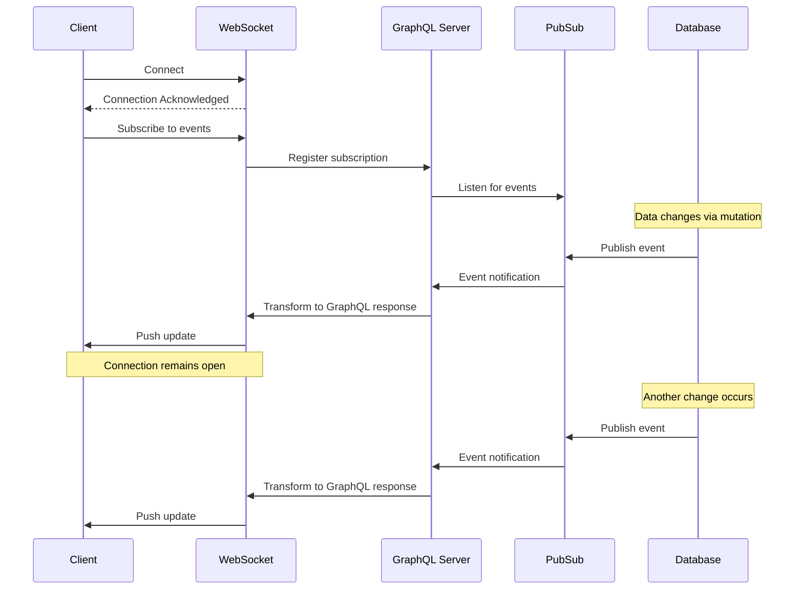
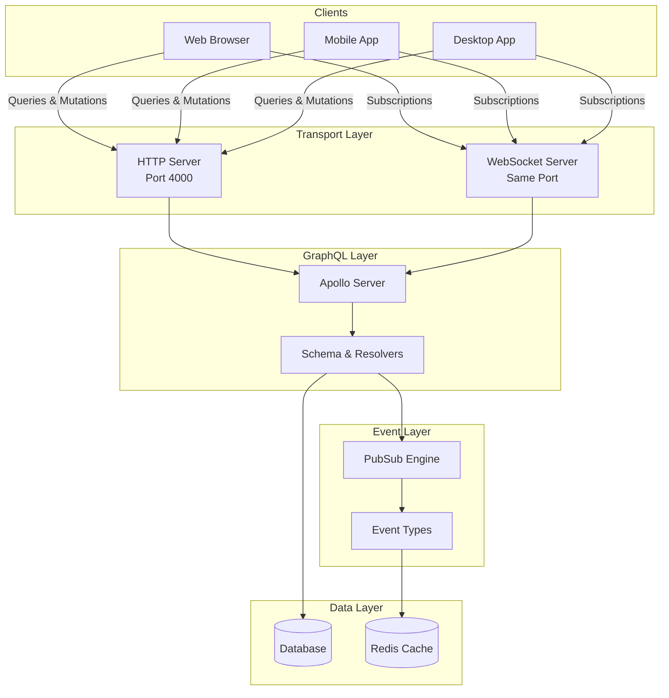
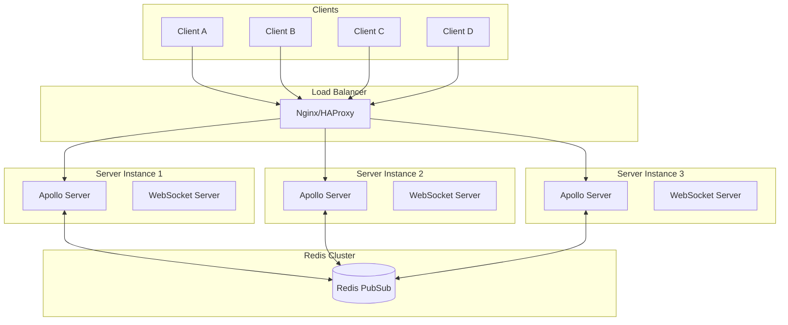

# How to Implement Real-time Features with GraphQL

Author: [nawazdhandala](https://github.com/nawazdhandala)

Tags: GraphQL, Subscriptions, Real-time, WebSockets

Description: A comprehensive guide to building real-time features using GraphQL subscriptions. Learn WebSocket configuration, PubSub patterns, event filtering, authentication, scaling strategies, and production best practices.

---

Real-time functionality has become a baseline expectation for modern applications. Users expect instant updates when new messages arrive, when dashboards refresh, or when collaborative documents change. GraphQL subscriptions provide an elegant solution by extending the GraphQL specification to support server-pushed updates over persistent connections.

This guide walks through implementing real-time features with GraphQL from basic concepts to production-ready patterns. You will learn how subscriptions work under the hood, how to configure WebSocket transport, implement filtering and authentication, and scale your subscription infrastructure horizontally.

## Understanding GraphQL Subscriptions

GraphQL defines three operation types: queries for reading data, mutations for writing data, and subscriptions for real-time data streams. While queries and mutations follow a request-response pattern, subscriptions establish a persistent connection that allows the server to push updates when relevant events occur.



The key components in this architecture are:

1. **WebSocket Connection**: A persistent bidirectional channel between client and server
2. **PubSub System**: An event broker that decouples publishers from subscribers
3. **Subscription Resolvers**: Functions that define what data to send when events occur
4. **Event Filtering**: Logic that determines which subscribers receive which events

## Project Setup

Let us build a real-time notification and chat system to demonstrate these concepts. Start by creating a new project and installing dependencies.

```bash
# Create a new project directory and initialize it
mkdir graphql-realtime-demo
cd graphql-realtime-demo
npm init -y

# Install production dependencies
# @apollo/server: The GraphQL server
# graphql: The GraphQL implementation
# graphql-ws: WebSocket protocol for GraphQL subscriptions
# ws: WebSocket library for Node.js
# graphql-subscriptions: PubSub implementation
# express: HTTP server framework
npm install @apollo/server graphql graphql-ws ws graphql-subscriptions express cors

# Install development dependencies for TypeScript
npm install -D typescript @types/node @types/express @types/ws ts-node nodemon
```

Create a TypeScript configuration file for the project.

```json
{
  "compilerOptions": {
    "target": "ES2022",
    "module": "NodeNext",
    "moduleResolution": "NodeNext",
    "strict": true,
    "esModuleInterop": true,
    "skipLibCheck": true,
    "outDir": "./dist",
    "rootDir": "./src"
  },
  "include": ["src/**/*"],
  "exclude": ["node_modules"]
}
```

## Application Architecture

Before diving into code, let us understand the overall architecture of our real-time GraphQL application.



## Defining the GraphQL Schema

The schema defines the contract between client and server. For real-time features, we need to define subscription types that specify what events clients can subscribe to.

```typescript
// src/schema.ts
// This file defines our GraphQL type definitions including
// queries, mutations, and subscriptions for the real-time system

import { gql } from 'graphql-tag';

export const typeDefs = gql`
  # Timestamp scalar for date/time handling
  scalar DateTime

  # User type represents a participant in the chat system
  type User {
    id: ID!
    username: String!
    email: String!
    avatar: String
    status: UserStatus!
    lastSeen: DateTime
  }

  # Enum for tracking user online status
  enum UserStatus {
    ONLINE
    AWAY
    DO_NOT_DISTURB
    OFFLINE
  }

  # Chat room that can contain multiple users and messages
  type Room {
    id: ID!
    name: String!
    description: String
    members: [User!]!
    createdAt: DateTime!
    lastActivity: DateTime
  }

  # Message sent within a room
  type Message {
    id: ID!
    content: String!
    author: User!
    room: Room!
    createdAt: DateTime!
    editedAt: DateTime
    reactions: [Reaction!]!
  }

  # Reaction to a message (like emoji reactions in Slack)
  type Reaction {
    emoji: String!
    user: User!
    createdAt: DateTime!
  }

  # Notification for system events
  type Notification {
    id: ID!
    type: NotificationType!
    title: String!
    message: String!
    data: NotificationData
    read: Boolean!
    createdAt: DateTime!
  }

  # Types of notifications the system can generate
  enum NotificationType {
    NEW_MESSAGE
    MENTION
    ROOM_INVITE
    USER_JOINED
    USER_LEFT
    SYSTEM_ALERT
  }

  # Flexible data payload for notifications
  type NotificationData {
    roomId: ID
    messageId: ID
    userId: ID
  }

  # Typing indicator for showing who is currently typing
  type TypingIndicator {
    user: User!
    room: Room!
    isTyping: Boolean!
  }

  # Standard queries for fetching data
  type Query {
    # Get current authenticated user
    me: User

    # Get a specific user by ID
    user(id: ID!): User

    # Get all rooms the current user is a member of
    myRooms: [Room!]!

    # Get a specific room by ID
    room(id: ID!): Room

    # Get messages in a room with pagination
    messages(roomId: ID!, limit: Int, before: ID): [Message!]!

    # Get unread notifications for current user
    notifications(unreadOnly: Boolean): [Notification!]!
  }

  # Mutations for creating and modifying data
  type Mutation {
    # Send a message to a room
    sendMessage(roomId: ID!, content: String!): Message!

    # Edit an existing message
    editMessage(messageId: ID!, content: String!): Message!

    # Delete a message
    deleteMessage(messageId: ID!): Boolean!

    # Add a reaction to a message
    addReaction(messageId: ID!, emoji: String!): Message!

    # Remove a reaction from a message
    removeReaction(messageId: ID!, emoji: String!): Message!

    # Create a new room
    createRoom(name: String!, description: String, memberIds: [ID!]): Room!

    # Join an existing room
    joinRoom(roomId: ID!): Room!

    # Leave a room
    leaveRoom(roomId: ID!): Boolean!

    # Update user status
    updateStatus(status: UserStatus!): User!

    # Set typing indicator
    setTyping(roomId: ID!, isTyping: Boolean!): Boolean!

    # Mark notification as read
    markNotificationRead(notificationId: ID!): Notification!

    # Mark all notifications as read
    markAllNotificationsRead: Boolean!
  }

  # Subscriptions for real-time updates
  type Subscription {
    # Subscribe to new messages in a specific room
    # Clients must specify which room to watch
    messageReceived(roomId: ID!): Message!

    # Subscribe to message edits in a room
    messageEdited(roomId: ID!): Message!

    # Subscribe to message deletions in a room
    messageDeleted(roomId: ID!): ID!

    # Subscribe to typing indicators in a room
    # Shows when users start and stop typing
    typingIndicator(roomId: ID!): TypingIndicator!

    # Subscribe to user status changes
    # Useful for showing online/offline status
    userStatusChanged: User!

    # Subscribe to notifications for the current user
    # Only receives notifications intended for the authenticated user
    notificationReceived: Notification!

    # Subscribe to room membership changes
    # Notifies when users join or leave rooms
    roomMembershipChanged(roomId: ID!): RoomMembershipEvent!
  }

  # Event type for room membership changes
  type RoomMembershipEvent {
    type: MembershipEventType!
    user: User!
    room: Room!
  }

  enum MembershipEventType {
    JOINED
    LEFT
  }
`;
```

## Implementing the PubSub System

The PubSub system is the backbone of real-time features. It manages the relationship between event publishers and subscribers.

```typescript
// src/pubsub.ts
// This module sets up the PubSub system that enables communication
// between mutations (publishers) and subscriptions (subscribers)

import { PubSub } from 'graphql-subscriptions';

// Create a single PubSub instance for the application
// In production, replace this with RedisPubSub for horizontal scaling
export const pubsub = new PubSub();

// Define event names as constants to prevent typos and enable autocomplete
// Using a const object ensures type safety when publishing and subscribing
export const EVENTS = {
  // Message events
  MESSAGE_RECEIVED: 'MESSAGE_RECEIVED',
  MESSAGE_EDITED: 'MESSAGE_EDITED',
  MESSAGE_DELETED: 'MESSAGE_DELETED',

  // User events
  USER_STATUS_CHANGED: 'USER_STATUS_CHANGED',
  TYPING_INDICATOR: 'TYPING_INDICATOR',

  // Notification events
  NOTIFICATION_RECEIVED: 'NOTIFICATION_RECEIVED',

  // Room events
  ROOM_MEMBERSHIP_CHANGED: 'ROOM_MEMBERSHIP_CHANGED',
} as const;

// TypeScript type for event names
export type EventName = typeof EVENTS[keyof typeof EVENTS];

// Type definitions for event payloads
// These ensure type safety when publishing events
export interface MessagePayload {
  messageReceived: {
    id: string;
    content: string;
    authorId: string;
    roomId: string;
    createdAt: Date;
  };
}

export interface TypingPayload {
  typingIndicator: {
    userId: string;
    roomId: string;
    isTyping: boolean;
  };
}

export interface NotificationPayload {
  notificationReceived: {
    id: string;
    type: string;
    title: string;
    message: string;
    userId: string;
    data?: Record<string, unknown>;
    createdAt: Date;
  };
}

// Helper function to publish events with type checking
export function publishEvent<T>(eventName: EventName, payload: T): void {
  pubsub.publish(eventName, payload);
}
```

## Building Subscription Resolvers

Subscription resolvers define what happens when clients subscribe to events and how to filter which events reach which subscribers.

```typescript
// src/resolvers/subscriptions.ts
// This module contains all subscription resolvers that handle
// real-time event streaming to connected clients

import { withFilter } from 'graphql-subscriptions';
import { pubsub, EVENTS } from '../pubsub';
import { GraphQLError } from 'graphql';

// Context type that includes authenticated user information
interface SubscriptionContext {
  user?: {
    id: string;
    username: string;
  };
  pubsub: typeof pubsub;
}

// Subscription resolvers
export const subscriptionResolvers = {
  Subscription: {
    // Subscribe to new messages in a specific room
    // Uses withFilter to only send messages from the subscribed room
    messageReceived: {
      subscribe: withFilter(
        // First argument: the async iterator that yields all message events
        () => pubsub.asyncIterator([EVENTS.MESSAGE_RECEIVED]),

        // Second argument: filter function that determines if this event
        // should be sent to this particular subscriber
        // Returns true to send the event, false to skip it
        (payload, variables, context: SubscriptionContext) => {
          // Only send messages that belong to the room the client subscribed to
          const roomMatches = payload.messageReceived.roomId === variables.roomId;

          // Optionally verify the user has access to this room
          // This adds an extra security layer beyond the initial subscription
          if (roomMatches && context.user) {
            // In a real app, verify room membership here
            return true;
          }

          return roomMatches;
        }
      ),
    },

    // Subscribe to message edits in a specific room
    messageEdited: {
      subscribe: withFilter(
        () => pubsub.asyncIterator([EVENTS.MESSAGE_EDITED]),
        (payload, variables) => {
          return payload.messageEdited.roomId === variables.roomId;
        }
      ),
    },

    // Subscribe to message deletions in a specific room
    // Only sends the deleted message ID, not the full message
    messageDeleted: {
      subscribe: withFilter(
        () => pubsub.asyncIterator([EVENTS.MESSAGE_DELETED]),
        (payload, variables) => {
          return payload.messageDeleted.roomId === variables.roomId;
        }
      ),
      // Transform the payload to only return the message ID
      resolve: (payload: { messageDeleted: { id: string; roomId: string } }) => {
        return payload.messageDeleted.id;
      },
    },

    // Subscribe to typing indicators in a room
    // High frequency events that benefit from throttling on the client
    typingIndicator: {
      subscribe: withFilter(
        () => pubsub.asyncIterator([EVENTS.TYPING_INDICATOR]),
        (payload, variables, context: SubscriptionContext) => {
          // Filter by room
          const roomMatches = payload.typingIndicator.roomId === variables.roomId;

          // Do not send typing indicators for the user's own typing
          // This prevents echo when the user types
          const notSelf = context.user?.id !== payload.typingIndicator.userId;

          return roomMatches && notSelf;
        }
      ),
    },

    // Subscribe to user status changes (online, away, offline)
    // No filtering needed since all users see all status changes
    userStatusChanged: {
      subscribe: () => pubsub.asyncIterator([EVENTS.USER_STATUS_CHANGED]),
    },

    // Subscribe to notifications for the authenticated user only
    // Critical security: each user only receives their own notifications
    notificationReceived: {
      subscribe: withFilter(
        () => pubsub.asyncIterator([EVENTS.NOTIFICATION_RECEIVED]),
        (payload, _variables, context: SubscriptionContext) => {
          // Ensure user is authenticated
          if (!context.user) {
            throw new GraphQLError('Authentication required for notifications', {
              extensions: { code: 'UNAUTHENTICATED' },
            });
          }

          // Only send notifications intended for this user
          return payload.notificationReceived.userId === context.user.id;
        }
      ),
    },

    // Subscribe to room membership changes
    roomMembershipChanged: {
      subscribe: withFilter(
        () => pubsub.asyncIterator([EVENTS.ROOM_MEMBERSHIP_CHANGED]),
        (payload, variables) => {
          return payload.roomMembershipChanged.roomId === variables.roomId;
        }
      ),
    },
  },
};
```

## Implementing Mutation Resolvers That Publish Events

Mutations trigger events that subscriptions listen for. Here is how to implement mutations that publish to the PubSub system.

```typescript
// src/resolvers/mutations.ts
// This module contains mutation resolvers that modify data
// and publish events to notify subscribers of changes

import { pubsub, EVENTS } from '../pubsub';
import { GraphQLError } from 'graphql';

// Simulated data stores (replace with actual database in production)
const messages: Map<string, any> = new Map();
const rooms: Map<string, any> = new Map();
const users: Map<string, any> = new Map();
const notifications: Map<string, any> = new Map();

// Helper to generate unique IDs
const generateId = (): string => {
  return `${Date.now()}-${Math.random().toString(36).substring(2, 9)}`;
};

// Context type with authenticated user
interface MutationContext {
  user?: {
    id: string;
    username: string;
  };
}

export const mutationResolvers = {
  Mutation: {
    // Send a message to a room
    // This mutation creates the message and publishes an event
    sendMessage: async (
      _parent: unknown,
      args: { roomId: string; content: string },
      context: MutationContext
    ) => {
      // Verify authentication
      if (!context.user) {
        throw new GraphQLError('You must be logged in to send messages', {
          extensions: { code: 'UNAUTHENTICATED' },
        });
      }

      // Verify room exists and user is a member
      const room = rooms.get(args.roomId);
      if (!room) {
        throw new GraphQLError('Room not found', {
          extensions: { code: 'NOT_FOUND' },
        });
      }

      // Create the message object
      const message = {
        id: generateId(),
        content: args.content,
        authorId: context.user.id,
        roomId: args.roomId,
        createdAt: new Date(),
        editedAt: null,
        reactions: [],
      };

      // Store the message (in production, save to database)
      messages.set(message.id, message);

      // Update room's last activity timestamp
      room.lastActivity = new Date();

      // Publish the message event to all subscribers watching this room
      // The payload structure must match what the subscription resolver expects
      pubsub.publish(EVENTS.MESSAGE_RECEIVED, {
        messageReceived: {
          ...message,
          author: users.get(context.user.id),
          room: room,
        },
      });

      // Check for mentions and send notifications
      const mentionedUsers = extractMentions(args.content);
      for (const mentionedUserId of mentionedUsers) {
        if (mentionedUserId !== context.user.id) {
          const notification = {
            id: generateId(),
            type: 'MENTION',
            title: 'You were mentioned',
            message: `${context.user.username} mentioned you in ${room.name}`,
            userId: mentionedUserId,
            data: {
              roomId: args.roomId,
              messageId: message.id,
            },
            read: false,
            createdAt: new Date(),
          };

          notifications.set(notification.id, notification);

          // Publish notification to the mentioned user
          pubsub.publish(EVENTS.NOTIFICATION_RECEIVED, {
            notificationReceived: notification,
          });
        }
      }

      return {
        ...message,
        author: users.get(context.user.id),
        room: room,
      };
    },

    // Edit an existing message
    editMessage: async (
      _parent: unknown,
      args: { messageId: string; content: string },
      context: MutationContext
    ) => {
      if (!context.user) {
        throw new GraphQLError('Authentication required', {
          extensions: { code: 'UNAUTHENTICATED' },
        });
      }

      const message = messages.get(args.messageId);
      if (!message) {
        throw new GraphQLError('Message not found', {
          extensions: { code: 'NOT_FOUND' },
        });
      }

      // Only the author can edit their message
      if (message.authorId !== context.user.id) {
        throw new GraphQLError('You can only edit your own messages', {
          extensions: { code: 'FORBIDDEN' },
        });
      }

      // Update the message
      message.content = args.content;
      message.editedAt = new Date();

      // Publish the edit event
      pubsub.publish(EVENTS.MESSAGE_EDITED, {
        messageEdited: {
          ...message,
          author: users.get(message.authorId),
          room: rooms.get(message.roomId),
        },
      });

      return {
        ...message,
        author: users.get(message.authorId),
        room: rooms.get(message.roomId),
      };
    },

    // Delete a message
    deleteMessage: async (
      _parent: unknown,
      args: { messageId: string },
      context: MutationContext
    ) => {
      if (!context.user) {
        throw new GraphQLError('Authentication required', {
          extensions: { code: 'UNAUTHENTICATED' },
        });
      }

      const message = messages.get(args.messageId);
      if (!message) {
        throw new GraphQLError('Message not found', {
          extensions: { code: 'NOT_FOUND' },
        });
      }

      // Only the author can delete their message
      if (message.authorId !== context.user.id) {
        throw new GraphQLError('You can only delete your own messages', {
          extensions: { code: 'FORBIDDEN' },
        });
      }

      // Delete the message
      messages.delete(args.messageId);

      // Publish the deletion event
      pubsub.publish(EVENTS.MESSAGE_DELETED, {
        messageDeleted: {
          id: args.messageId,
          roomId: message.roomId,
        },
      });

      return true;
    },

    // Update user online status
    updateStatus: async (
      _parent: unknown,
      args: { status: string },
      context: MutationContext
    ) => {
      if (!context.user) {
        throw new GraphQLError('Authentication required', {
          extensions: { code: 'UNAUTHENTICATED' },
        });
      }

      const user = users.get(context.user.id);
      if (!user) {
        throw new GraphQLError('User not found', {
          extensions: { code: 'NOT_FOUND' },
        });
      }

      // Update status
      user.status = args.status;
      user.lastSeen = new Date();

      // Publish status change to all connected clients
      pubsub.publish(EVENTS.USER_STATUS_CHANGED, {
        userStatusChanged: user,
      });

      return user;
    },

    // Set typing indicator
    // This is a high-frequency operation that should be throttled on the client
    setTyping: async (
      _parent: unknown,
      args: { roomId: string; isTyping: boolean },
      context: MutationContext
    ) => {
      if (!context.user) {
        throw new GraphQLError('Authentication required', {
          extensions: { code: 'UNAUTHENTICATED' },
        });
      }

      // Publish typing indicator
      // No persistence needed since typing state is ephemeral
      pubsub.publish(EVENTS.TYPING_INDICATOR, {
        typingIndicator: {
          userId: context.user.id,
          roomId: args.roomId,
          isTyping: args.isTyping,
          user: users.get(context.user.id),
          room: rooms.get(args.roomId),
        },
      });

      return true;
    },

    // Join a room
    joinRoom: async (
      _parent: unknown,
      args: { roomId: string },
      context: MutationContext
    ) => {
      if (!context.user) {
        throw new GraphQLError('Authentication required', {
          extensions: { code: 'UNAUTHENTICATED' },
        });
      }

      const room = rooms.get(args.roomId);
      if (!room) {
        throw new GraphQLError('Room not found', {
          extensions: { code: 'NOT_FOUND' },
        });
      }

      // Add user to room members
      if (!room.memberIds.includes(context.user.id)) {
        room.memberIds.push(context.user.id);
      }

      // Publish membership change event
      pubsub.publish(EVENTS.ROOM_MEMBERSHIP_CHANGED, {
        roomMembershipChanged: {
          type: 'JOINED',
          user: users.get(context.user.id),
          room: room,
          roomId: args.roomId,
        },
      });

      // Send notification to other room members
      for (const memberId of room.memberIds) {
        if (memberId !== context.user.id) {
          const notification = {
            id: generateId(),
            type: 'USER_JOINED',
            title: 'New member',
            message: `${context.user.username} joined ${room.name}`,
            userId: memberId,
            data: { roomId: args.roomId, userId: context.user.id },
            read: false,
            createdAt: new Date(),
          };

          pubsub.publish(EVENTS.NOTIFICATION_RECEIVED, {
            notificationReceived: notification,
          });
        }
      }

      return room;
    },
  },
};

// Helper function to extract @mentions from message content
function extractMentions(content: string): string[] {
  const mentionRegex = /@(\w+)/g;
  const mentions: string[] = [];
  let match;

  while ((match = mentionRegex.exec(content)) !== null) {
    // In production, resolve username to user ID
    mentions.push(match[1]);
  }

  return mentions;
}
```

## Setting Up the Server with WebSocket Support

Now let us create the server that handles both HTTP requests and WebSocket connections.

```typescript
// src/server.ts
// Main server file that sets up Apollo Server with WebSocket subscriptions

import { ApolloServer } from '@apollo/server';
import { expressMiddleware } from '@apollo/server/express4';
import { ApolloServerPluginDrainHttpServer } from '@apollo/server/plugin/drainHttpServer';
import { createServer } from 'http';
import express from 'express';
import { makeExecutableSchema } from '@graphql-tools/schema';
import { WebSocketServer } from 'ws';
import { useServer } from 'graphql-ws/lib/use/ws';
import cors from 'cors';
import { typeDefs } from './schema';
import { subscriptionResolvers } from './resolvers/subscriptions';
import { mutationResolvers } from './resolvers/mutations';
import { queryResolvers } from './resolvers/queries';
import { pubsub } from './pubsub';

// Combine all resolvers
const resolvers = {
  ...queryResolvers,
  ...mutationResolvers,
  ...subscriptionResolvers,
};

// Function to verify authentication tokens
// In production, use a proper JWT verification library
async function verifyToken(token: string): Promise<{ id: string; username: string } | null> {
  // Simplified token verification for demonstration
  // Replace with actual JWT verification in production
  if (token && token.startsWith('Bearer ')) {
    const payload = token.substring(7);
    // In production, verify JWT signature and expiration
    try {
      // Simulated user lookup
      return { id: payload, username: `user_${payload}` };
    } catch {
      return null;
    }
  }
  return null;
}

async function startServer() {
  // Create Express application
  const app = express();

  // Create HTTP server from Express app
  const httpServer = createServer(app);

  // Build the executable GraphQL schema
  const schema = makeExecutableSchema({ typeDefs, resolvers });

  // Create WebSocket server for subscriptions
  // It uses the same HTTP server but upgrades connections to WebSocket
  const wsServer = new WebSocketServer({
    server: httpServer,
    path: '/graphql',
  });

  // Set up the WebSocket server with graphql-ws
  // This handles the GraphQL subscription protocol
  const serverCleanup = useServer(
    {
      schema,

      // Called when a WebSocket connection is initiated
      // Use this for authentication
      onConnect: async (ctx) => {
        console.log('Client attempting to connect');

        // Extract authentication token from connection parameters
        const token = ctx.connectionParams?.authToken as string;

        if (token) {
          const user = await verifyToken(token);
          if (user) {
            console.log(`User ${user.username} connected`);
            // Return value becomes available in subscription context
            return { user };
          }
        }

        // Allow anonymous connections for public subscriptions
        // For strict authentication, return false to reject
        console.log('Anonymous connection accepted');
        return true;
      },

      // Called when a subscription operation starts
      onSubscribe: async (ctx, msg) => {
        console.log(`Subscription started: ${msg.payload.operationName || 'anonymous'}`);
      },

      // Called when a subscription operation completes
      onComplete: async (ctx, msg) => {
        console.log('Subscription completed');
      },

      // Called when a client disconnects
      onDisconnect: async (ctx, code, reason) => {
        console.log(`Client disconnected: ${code} ${reason}`);
      },

      // Build context for subscription resolvers
      context: async (ctx) => {
        // ctx.extra contains the return value from onConnect
        return {
          user: ctx.extra?.user,
          pubsub,
        };
      },
    },
    wsServer
  );

  // Create Apollo Server instance
  const server = new ApolloServer({
    schema,
    plugins: [
      // Plugin for graceful HTTP server shutdown
      ApolloServerPluginDrainHttpServer({ httpServer }),

      // Plugin for graceful WebSocket server shutdown
      {
        async serverWillStart() {
          return {
            async drainServer() {
              await serverCleanup.dispose();
            },
          };
        },
      },
    ],
  });

  // Start Apollo Server
  await server.start();

  // Apply Express middleware
  app.use(
    '/graphql',
    cors<cors.CorsRequest>({
      origin: ['http://localhost:3000', 'http://localhost:5173'],
      credentials: true,
    }),
    express.json(),
    expressMiddleware(server, {
      // Build context for query and mutation resolvers
      context: async ({ req }) => {
        const token = req.headers.authorization || '';
        const user = await verifyToken(token);

        return {
          user,
          pubsub,
        };
      },
    })
  );

  // Health check endpoint
  app.get('/health', (_req, res) => {
    res.json({ status: 'healthy', timestamp: new Date().toISOString() });
  });

  // Start the server
  const PORT = process.env.PORT || 4000;
  httpServer.listen(PORT, () => {
    console.log(`HTTP server ready at http://localhost:${PORT}/graphql`);
    console.log(`WebSocket server ready at ws://localhost:${PORT}/graphql`);
  });
}

// Start the server
startServer().catch(console.error);
```

## Client-Side Implementation

Setting up the client requires configuring Apollo Client to use different transports for different operation types.

```typescript
// client/src/apollo-client.ts
// Apollo Client configuration with split links for HTTP and WebSocket

import {
  ApolloClient,
  InMemoryCache,
  HttpLink,
  split,
  ApolloLink,
} from '@apollo/client';
import { GraphQLWsLink } from '@apollo/client/link/subscriptions';
import { createClient } from 'graphql-ws';
import { getMainDefinition } from '@apollo/client/utilities';
import { onError } from '@apollo/client/link/error';

// Get authentication token from storage
const getAuthToken = (): string | null => {
  return localStorage.getItem('authToken');
};

// Create HTTP link for queries and mutations
const httpLink = new HttpLink({
  uri: 'http://localhost:4000/graphql',
  headers: {
    authorization: getAuthToken() ? `Bearer ${getAuthToken()}` : '',
  },
});

// Create WebSocket link for subscriptions
const wsLink = new GraphQLWsLink(
  createClient({
    url: 'ws://localhost:4000/graphql',

    // Connection parameters sent during WebSocket handshake
    connectionParams: () => ({
      authToken: getAuthToken() ? `Bearer ${getAuthToken()}` : '',
    }),

    // Reconnection configuration
    retryAttempts: 5,
    shouldRetry: () => true,

    // Connection lifecycle hooks
    on: {
      connected: () => {
        console.log('WebSocket connected');
      },
      closed: (event) => {
        console.log('WebSocket closed:', event);
      },
      error: (error) => {
        console.error('WebSocket error:', error);
      },
    },

    // Lazy connection - only connect when first subscription is made
    lazy: true,

    // Keep alive ping interval (milliseconds)
    keepAlive: 10000,
  })
);

// Error handling link
const errorLink = onError(({ graphQLErrors, networkError, operation }) => {
  if (graphQLErrors) {
    graphQLErrors.forEach(({ message, locations, path, extensions }) => {
      console.error(
        `GraphQL error: ${message}`,
        { locations, path, extensions, operation: operation.operationName }
      );

      // Handle authentication errors
      if (extensions?.code === 'UNAUTHENTICATED') {
        // Redirect to login or refresh token
        localStorage.removeItem('authToken');
        window.location.href = '/login';
      }
    });
  }

  if (networkError) {
    console.error('Network error:', networkError);
  }
});

// Split link: route subscriptions to WebSocket, everything else to HTTP
const splitLink = split(
  ({ query }) => {
    const definition = getMainDefinition(query);
    return (
      definition.kind === 'OperationDefinition' &&
      definition.operation === 'subscription'
    );
  },
  wsLink,
  httpLink
);

// Combine links: error handling -> split (HTTP/WebSocket)
const link = ApolloLink.from([errorLink, splitLink]);

// Create Apollo Client instance
export const apolloClient = new ApolloClient({
  link,
  cache: new InMemoryCache({
    typePolicies: {
      Query: {
        fields: {
          // Merge paginated messages
          messages: {
            keyArgs: ['roomId'],
            merge(existing = [], incoming) {
              return [...existing, ...incoming];
            },
          },
        },
      },
      Room: {
        fields: {
          // Reference messages by room ID
          messages: {
            merge(existing = [], incoming) {
              return [...existing, ...incoming];
            },
          },
        },
      },
    },
  }),
  defaultOptions: {
    watchQuery: {
      fetchPolicy: 'cache-and-network',
    },
  },
});
```

## React Components with Subscriptions

Here is a complete React component that demonstrates using subscriptions for real-time chat.

```tsx
// client/src/components/ChatRoom.tsx
// Chat room component with real-time message updates

import React, { useState, useEffect, useRef } from 'react';
import {
  useQuery,
  useMutation,
  useSubscription,
  gql,
} from '@apollo/client';

// GraphQL operations
const GET_MESSAGES = gql`
  query GetMessages($roomId: ID!, $limit: Int) {
    messages(roomId: $roomId, limit: $limit) {
      id
      content
      createdAt
      editedAt
      author {
        id
        username
        avatar
      }
    }
  }
`;

const SEND_MESSAGE = gql`
  mutation SendMessage($roomId: ID!, $content: String!) {
    sendMessage(roomId: $roomId, content: $content) {
      id
      content
      createdAt
      author {
        id
        username
        avatar
      }
    }
  }
`;

const SET_TYPING = gql`
  mutation SetTyping($roomId: ID!, $isTyping: Boolean!) {
    setTyping(roomId: $roomId, isTyping: $isTyping)
  }
`;

const MESSAGE_SUBSCRIPTION = gql`
  subscription OnMessageReceived($roomId: ID!) {
    messageReceived(roomId: $roomId) {
      id
      content
      createdAt
      author {
        id
        username
        avatar
      }
    }
  }
`;

const TYPING_SUBSCRIPTION = gql`
  subscription OnTypingIndicator($roomId: ID!) {
    typingIndicator(roomId: $roomId) {
      user {
        id
        username
      }
      isTyping
    }
  }
`;

interface ChatRoomProps {
  roomId: string;
  currentUserId: string;
}

export const ChatRoom: React.FC<ChatRoomProps> = ({ roomId, currentUserId }) => {
  const [messageInput, setMessageInput] = useState('');
  const [typingUsers, setTypingUsers] = useState<Map<string, string>>(new Map());
  const messagesEndRef = useRef<HTMLDivElement>(null);
  const typingTimeoutRef = useRef<NodeJS.Timeout | null>(null);

  // Query for initial messages
  const { data, loading, error } = useQuery(GET_MESSAGES, {
    variables: { roomId, limit: 50 },
  });

  // Mutation for sending messages
  const [sendMessage] = useMutation(SEND_MESSAGE, {
    // Optimistic response for instant UI feedback
    optimisticResponse: ({ content }) => ({
      sendMessage: {
        __typename: 'Message',
        id: `temp-${Date.now()}`,
        content,
        createdAt: new Date().toISOString(),
        author: {
          __typename: 'User',
          id: currentUserId,
          username: 'You',
          avatar: null,
        },
      },
    }),
    // Update cache when mutation completes
    update: (cache, { data }) => {
      if (!data?.sendMessage) return;

      const existingData = cache.readQuery<{ messages: any[] }>({
        query: GET_MESSAGES,
        variables: { roomId, limit: 50 },
      });

      if (existingData) {
        cache.writeQuery({
          query: GET_MESSAGES,
          variables: { roomId, limit: 50 },
          data: {
            messages: [...existingData.messages, data.sendMessage],
          },
        });
      }
    },
  });

  // Mutation for typing indicator
  const [setTyping] = useMutation(SET_TYPING);

  // Subscribe to new messages
  useSubscription(MESSAGE_SUBSCRIPTION, {
    variables: { roomId },
    onData: ({ client, data }) => {
      if (!data.data?.messageReceived) return;

      const newMessage = data.data.messageReceived;

      // Skip if this is our own message (already in cache from mutation)
      if (newMessage.author.id === currentUserId) return;

      // Update cache with new message
      const existingData = client.readQuery<{ messages: any[] }>({
        query: GET_MESSAGES,
        variables: { roomId, limit: 50 },
      });

      if (existingData) {
        // Check if message already exists to prevent duplicates
        const exists = existingData.messages.some(m => m.id === newMessage.id);
        if (!exists) {
          client.writeQuery({
            query: GET_MESSAGES,
            variables: { roomId, limit: 50 },
            data: {
              messages: [...existingData.messages, newMessage],
            },
          });
        }
      }
    },
  });

  // Subscribe to typing indicators
  useSubscription(TYPING_SUBSCRIPTION, {
    variables: { roomId },
    onData: ({ data }) => {
      if (!data.data?.typingIndicator) return;

      const { user, isTyping } = data.data.typingIndicator;

      setTypingUsers((prev) => {
        const updated = new Map(prev);
        if (isTyping) {
          updated.set(user.id, user.username);
        } else {
          updated.delete(user.id);
        }
        return updated;
      });
    },
  });

  // Scroll to bottom when new messages arrive
  useEffect(() => {
    messagesEndRef.current?.scrollIntoView({ behavior: 'smooth' });
  }, [data?.messages]);

  // Handle message input changes with typing indicator
  const handleInputChange = (e: React.ChangeEvent<HTMLInputElement>) => {
    setMessageInput(e.target.value);

    // Send typing indicator
    setTyping({ variables: { roomId, isTyping: true } });

    // Clear previous timeout
    if (typingTimeoutRef.current) {
      clearTimeout(typingTimeoutRef.current);
    }

    // Set timeout to stop typing indicator after 2 seconds of inactivity
    typingTimeoutRef.current = setTimeout(() => {
      setTyping({ variables: { roomId, isTyping: false } });
    }, 2000);
  };

  // Handle message submission
  const handleSubmit = async (e: React.FormEvent) => {
    e.preventDefault();

    if (!messageInput.trim()) return;

    // Clear typing indicator
    if (typingTimeoutRef.current) {
      clearTimeout(typingTimeoutRef.current);
    }
    setTyping({ variables: { roomId, isTyping: false } });

    // Send the message
    await sendMessage({
      variables: { roomId, content: messageInput },
    });

    setMessageInput('');
  };

  if (loading) return <div className="loading">Loading messages...</div>;
  if (error) return <div className="error">Error: {error.message}</div>;

  const messages = data?.messages || [];
  const typingUsersList = Array.from(typingUsers.values());

  return (
    <div className="chat-room">
      <div className="messages-container">
        {messages.map((message: any) => (
          <div
            key={message.id}
            className={`message ${message.author.id === currentUserId ? 'own' : ''}`}
          >
            
            <div className="message-content">
              <div className="message-header">
                <span className="username">{message.author.username}</span>
                <span className="timestamp">
                  {new Date(message.createdAt).toLocaleTimeString()}
                </span>
                {message.editedAt && <span className="edited">(edited)</span>}
              </div>
              <p className="text">{message.content}</p>
            </div>
          </div>
        ))}
        <div ref={messagesEndRef} />
      </div>

      {typingUsersList.length > 0 && (
        <div className="typing-indicator">
          {typingUsersList.length === 1
            ? `${typingUsersList[0]} is typing...`
            : `${typingUsersList.join(', ')} are typing...`}
        </div>
      )}

      <form onSubmit={handleSubmit} className="message-form">
        <input
          type="text"
          value={messageInput}
          onChange={handleInputChange}
          placeholder="Type a message..."
          className="message-input"
        />
        <button type="submit" className="send-button">
          Send
        </button>
      </form>
    </div>
  );
};
```

## Notification Component with Subscriptions

Here is a component that displays real-time notifications.

```tsx
// client/src/components/NotificationCenter.tsx
// Real-time notification component

import React, { useState } from 'react';
import { useQuery, useSubscription, useMutation, gql } from '@apollo/client';

const GET_NOTIFICATIONS = gql`
  query GetNotifications($unreadOnly: Boolean) {
    notifications(unreadOnly: $unreadOnly) {
      id
      type
      title
      message
      read
      createdAt
      data {
        roomId
        messageId
      }
    }
  }
`;

const NOTIFICATION_SUBSCRIPTION = gql`
  subscription OnNotificationReceived {
    notificationReceived {
      id
      type
      title
      message
      read
      createdAt
      data {
        roomId
        messageId
      }
    }
  }
`;

const MARK_READ = gql`
  mutation MarkNotificationRead($notificationId: ID!) {
    markNotificationRead(notificationId: $notificationId) {
      id
      read
    }
  }
`;

const MARK_ALL_READ = gql`
  mutation MarkAllNotificationsRead {
    markAllNotificationsRead
  }
`;

export const NotificationCenter: React.FC = () => {
  const [isOpen, setIsOpen] = useState(false);

  // Query for existing notifications
  const { data, loading, refetch } = useQuery(GET_NOTIFICATIONS, {
    variables: { unreadOnly: false },
  });

  // Mutations
  const [markRead] = useMutation(MARK_READ);
  const [markAllRead] = useMutation(MARK_ALL_READ, {
    onCompleted: () => refetch(),
  });

  // Subscribe to new notifications
  useSubscription(NOTIFICATION_SUBSCRIPTION, {
    onData: ({ client, data }) => {
      if (!data.data?.notificationReceived) return;

      const newNotification = data.data.notificationReceived;

      // Update cache with new notification
      const existingData = client.readQuery<{ notifications: any[] }>({
        query: GET_NOTIFICATIONS,
        variables: { unreadOnly: false },
      });

      if (existingData) {
        client.writeQuery({
          query: GET_NOTIFICATIONS,
          variables: { unreadOnly: false },
          data: {
            notifications: [newNotification, ...existingData.notifications],
          },
        });
      }

      // Show browser notification if permitted
      if (Notification.permission === 'granted') {
        new Notification(newNotification.title, {
          body: newNotification.message,
        });
      }
    },
  });

  const notifications = data?.notifications || [];
  const unreadCount = notifications.filter((n: any) => !n.read).length;

  const handleNotificationClick = async (notification: any) => {
    if (!notification.read) {
      await markRead({ variables: { notificationId: notification.id } });
    }

    // Navigate based on notification type
    if (notification.data?.roomId) {
      window.location.href = `/room/${notification.data.roomId}`;
    }
  };

  const getNotificationIcon = (type: string): string => {
    switch (type) {
      case 'NEW_MESSAGE':
        return 'message';
      case 'MENTION':
        return 'at';
      case 'ROOM_INVITE':
        return 'user-plus';
      case 'USER_JOINED':
        return 'user-check';
      case 'USER_LEFT':
        return 'user-minus';
      default:
        return 'bell';
    }
  };

  return (
    <div className="notification-center">
      <button
        className="notification-button"
        onClick={() => setIsOpen(!isOpen)}
      >
        <span className="bell-icon">Notifications</span>
        {unreadCount > 0 && (
          <span className="badge">{unreadCount}</span>
        )}
      </button>

      {isOpen && (
        <div className="notification-dropdown">
          <div className="notification-header">
            <h3>Notifications</h3>
            {unreadCount > 0 && (
              <button
                className="mark-all-read"
                onClick={() => markAllRead()}
              >
                Mark all read
              </button>
            )}
          </div>

          {loading ? (
            <div className="loading">Loading...</div>
          ) : notifications.length === 0 ? (
            <div className="empty">No notifications</div>
          ) : (
            <ul className="notification-list">
              {notifications.map((notification: any) => (
                <li
                  key={notification.id}
                  className={`notification-item ${notification.read ? '' : 'unread'}`}
                  onClick={() => handleNotificationClick(notification)}
                >
                  <span className={`icon ${getNotificationIcon(notification.type)}`} />
                  <div className="content">
                    <strong>{notification.title}</strong>
                    <p>{notification.message}</p>
                    <time>
                      {new Date(notification.createdAt).toLocaleString()}
                    </time>
                  </div>
                </li>
              ))}
            </ul>
          )}
        </div>
      )}
    </div>
  );
};
```

## Scaling with Redis PubSub

For production deployments with multiple server instances, you need a distributed PubSub system. Redis is the most common choice.



Implement Redis PubSub for horizontal scaling.

```typescript
// src/pubsub-redis.ts
// Redis-based PubSub for distributed subscription handling

import { RedisPubSub } from 'graphql-redis-subscriptions';
import Redis from 'ioredis';

// Redis connection configuration
const redisConfig = {
  host: process.env.REDIS_HOST || 'localhost',
  port: parseInt(process.env.REDIS_PORT || '6379', 10),
  password: process.env.REDIS_PASSWORD,
  db: parseInt(process.env.REDIS_DB || '0', 10),

  // Retry strategy for connection failures
  retryStrategy: (times: number) => {
    const delay = Math.min(times * 50, 2000);
    console.log(`Redis connection retry attempt ${times}, delay: ${delay}ms`);
    return delay;
  },

  // Maximum retry attempts
  maxRetriesPerRequest: 3,

  // Enable offline queue
  enableOfflineQueue: true,
};

// Create separate Redis clients for publishing and subscribing
// Redis requires separate connections for pub/sub operations
const publisherClient = new Redis(redisConfig);
const subscriberClient = new Redis(redisConfig);

// Connection event handlers
publisherClient.on('connect', () => {
  console.log('Redis publisher connected');
});

publisherClient.on('error', (err) => {
  console.error('Redis publisher error:', err);
});

subscriberClient.on('connect', () => {
  console.log('Redis subscriber connected');
});

subscriberClient.on('error', (err) => {
  console.error('Redis subscriber error:', err);
});

// Create RedisPubSub instance
// This replaces the in-memory PubSub for production use
export const pubsub = new RedisPubSub({
  publisher: publisherClient,
  subscriber: subscriberClient,

  // Optional: customize message serialization
  // Useful for handling complex objects or adding metadata
  reviver: (key, value) => {
    // Convert ISO date strings back to Date objects
    if (typeof value === 'string' && /^\d{4}-\d{2}-\d{2}T/.test(value)) {
      return new Date(value);
    }
    return value;
  },
});

// Export event names (same as before)
export const EVENTS = {
  MESSAGE_RECEIVED: 'MESSAGE_RECEIVED',
  MESSAGE_EDITED: 'MESSAGE_EDITED',
  MESSAGE_DELETED: 'MESSAGE_DELETED',
  USER_STATUS_CHANGED: 'USER_STATUS_CHANGED',
  TYPING_INDICATOR: 'TYPING_INDICATOR',
  NOTIFICATION_RECEIVED: 'NOTIFICATION_RECEIVED',
  ROOM_MEMBERSHIP_CHANGED: 'ROOM_MEMBERSHIP_CHANGED',
} as const;

// Graceful shutdown handler
export async function closePubSub(): Promise<void> {
  console.log('Closing Redis connections...');
  await publisherClient.quit();
  await subscriberClient.quit();
  console.log('Redis connections closed');
}
```

## Connection Management and Monitoring

Implement connection tracking for operational visibility and debugging.

```typescript
// src/connection-manager.ts
// Track and manage WebSocket connections

interface ConnectionInfo {
  id: string;
  userId: string | null;
  connectedAt: Date;
  subscriptions: Set<string>;
  lastActivity: Date;
}

class ConnectionManager {
  private connections: Map<string, ConnectionInfo> = new Map();

  // Generate unique connection ID
  generateId(): string {
    return `conn_${Date.now()}_${Math.random().toString(36).substring(2, 9)}`;
  }

  // Register a new connection
  addConnection(id: string, userId: string | null): void {
    this.connections.set(id, {
      id,
      userId,
      connectedAt: new Date(),
      subscriptions: new Set(),
      lastActivity: new Date(),
    });

    console.log(`Connection added: ${id}, User: ${userId || 'anonymous'}`);
    console.log(`Total connections: ${this.connections.size}`);
  }

  // Remove a connection
  removeConnection(id: string): void {
    const connection = this.connections.get(id);
    if (connection) {
      this.connections.delete(id);
      console.log(`Connection removed: ${id}`);
      console.log(`Total connections: ${this.connections.size}`);
    }
  }

  // Track subscription for a connection
  addSubscription(connectionId: string, subscriptionName: string): void {
    const connection = this.connections.get(connectionId);
    if (connection) {
      connection.subscriptions.add(subscriptionName);
      connection.lastActivity = new Date();
    }
  }

  // Remove subscription tracking
  removeSubscription(connectionId: string, subscriptionName: string): void {
    const connection = this.connections.get(connectionId);
    if (connection) {
      connection.subscriptions.delete(subscriptionName);
    }
  }

  // Get all connections for a user
  getConnectionsForUser(userId: string): ConnectionInfo[] {
    const userConnections: ConnectionInfo[] = [];
    this.connections.forEach((conn) => {
      if (conn.userId === userId) {
        userConnections.push(conn);
      }
    });
    return userConnections;
  }

  // Get connection statistics
  getStats(): {
    totalConnections: number;
    authenticatedConnections: number;
    anonymousConnections: number;
    subscriptionCounts: Record<string, number>;
  } {
    let authenticated = 0;
    let anonymous = 0;
    const subscriptionCounts: Record<string, number> = {};

    this.connections.forEach((conn) => {
      if (conn.userId) {
        authenticated++;
      } else {
        anonymous++;
      }

      conn.subscriptions.forEach((sub) => {
        subscriptionCounts[sub] = (subscriptionCounts[sub] || 0) + 1;
      });
    });

    return {
      totalConnections: this.connections.size,
      authenticatedConnections: authenticated,
      anonymousConnections: anonymous,
      subscriptionCounts,
    };
  }

  // Clean up stale connections
  cleanupStaleConnections(maxAgeMs: number = 3600000): number {
    const now = Date.now();
    let removed = 0;

    this.connections.forEach((conn, id) => {
      if (now - conn.lastActivity.getTime() > maxAgeMs) {
        this.connections.delete(id);
        removed++;
      }
    });

    if (removed > 0) {
      console.log(`Cleaned up ${removed} stale connections`);
    }

    return removed;
  }
}

export const connectionManager = new ConnectionManager();

// Periodic cleanup of stale connections
setInterval(() => {
  connectionManager.cleanupStaleConnections();
}, 300000); // Every 5 minutes
```

## WebSocket Authentication Patterns

Implement secure authentication for WebSocket connections.

```typescript
// src/auth/websocket-auth.ts
// Authentication middleware for WebSocket connections

import jwt from 'jsonwebtoken';
import { GraphQLError } from 'graphql';

interface TokenPayload {
  userId: string;
  username: string;
  email: string;
  roles: string[];
  exp: number;
  iat: number;
}

interface AuthenticatedUser {
  id: string;
  username: string;
  email: string;
  roles: string[];
}

// Verify JWT token and extract user information
export async function authenticateToken(
  token: string | undefined
): Promise<AuthenticatedUser | null> {
  if (!token) {
    return null;
  }

  // Remove Bearer prefix if present
  const cleanToken = token.startsWith('Bearer ') ? token.slice(7) : token;

  try {
    const secret = process.env.JWT_SECRET;
    if (!secret) {
      throw new Error('JWT_SECRET not configured');
    }

    const decoded = jwt.verify(cleanToken, secret) as TokenPayload;

    // Token is valid, return user information
    return {
      id: decoded.userId,
      username: decoded.username,
      email: decoded.email,
      roles: decoded.roles,
    };
  } catch (error) {
    if (error instanceof jwt.TokenExpiredError) {
      console.log('Token expired');
    } else if (error instanceof jwt.JsonWebTokenError) {
      console.log('Invalid token');
    } else {
      console.error('Token verification error:', error);
    }
    return null;
  }
}

// Authorization check for subscription operations
export function authorizeSubscription(
  user: AuthenticatedUser | null,
  subscriptionName: string,
  variables: Record<string, unknown>
): void {
  // Define subscription authorization rules
  const publicSubscriptions = ['userStatusChanged'];
  const authenticatedSubscriptions = [
    'messageReceived',
    'messageEdited',
    'messageDeleted',
    'typingIndicator',
    'notificationReceived',
    'roomMembershipChanged',
  ];

  // Public subscriptions require no authentication
  if (publicSubscriptions.includes(subscriptionName)) {
    return;
  }

  // Authenticated subscriptions require a valid user
  if (authenticatedSubscriptions.includes(subscriptionName)) {
    if (!user) {
      throw new GraphQLError('Authentication required', {
        extensions: { code: 'UNAUTHENTICATED' },
      });
    }
    return;
  }

  // Unknown subscription - deny by default
  throw new GraphQLError('Unknown subscription', {
    extensions: { code: 'BAD_REQUEST' },
  });
}

// Rate limiting for subscriptions
const subscriptionRateLimits: Map<string, { count: number; resetAt: number }> = new Map();

export function checkSubscriptionRateLimit(
  userId: string,
  maxSubscriptions: number = 10,
  windowMs: number = 60000
): boolean {
  const now = Date.now();
  const key = `sub:${userId}`;
  const current = subscriptionRateLimits.get(key);

  if (!current || current.resetAt < now) {
    // New window
    subscriptionRateLimits.set(key, { count: 1, resetAt: now + windowMs });
    return true;
  }

  if (current.count >= maxSubscriptions) {
    return false;
  }

  current.count++;
  return true;
}
```

## Error Handling and Resilience

Implement proper error handling for subscription operations.

```typescript
// src/utils/subscription-errors.ts
// Error handling utilities for subscriptions

import { GraphQLError } from 'graphql';

// Custom error types for subscriptions
export class SubscriptionError extends GraphQLError {
  constructor(message: string, code: string, details?: Record<string, unknown>) {
    super(message, {
      extensions: {
        code,
        type: 'SUBSCRIPTION_ERROR',
        ...details,
      },
    });
  }
}

export const SubscriptionErrors = {
  // Authentication errors
  unauthenticated: () =>
    new SubscriptionError(
      'You must be authenticated to subscribe',
      'UNAUTHENTICATED'
    ),

  tokenExpired: () =>
    new SubscriptionError(
      'Your session has expired. Please log in again.',
      'TOKEN_EXPIRED'
    ),

  // Authorization errors
  forbidden: (resource: string) =>
    new SubscriptionError(
      `You do not have permission to access ${resource}`,
      'FORBIDDEN',
      { resource }
    ),

  // Rate limiting
  rateLimited: (retryAfter: number) =>
    new SubscriptionError(
      'Too many subscription requests. Please try again later.',
      'RATE_LIMITED',
      { retryAfter }
    ),

  // Resource errors
  notFound: (resource: string, id: string) =>
    new SubscriptionError(
      `${resource} not found`,
      'NOT_FOUND',
      { resource, id }
    ),

  // Connection errors
  connectionFailed: () =>
    new SubscriptionError(
      'Failed to establish subscription connection',
      'CONNECTION_FAILED'
    ),

  // Validation errors
  invalidInput: (field: string, message: string) =>
    new SubscriptionError(
      `Invalid input for ${field}: ${message}`,
      'INVALID_INPUT',
      { field }
    ),
};

// Error handler for subscription resolvers
export function handleSubscriptionError(error: unknown): never {
  if (error instanceof GraphQLError) {
    throw error;
  }

  if (error instanceof Error) {
    console.error('Subscription error:', error);
    throw new SubscriptionError(
      'An unexpected error occurred',
      'INTERNAL_ERROR',
      { originalMessage: error.message }
    );
  }

  throw new SubscriptionError('An unknown error occurred', 'UNKNOWN_ERROR');
}
```

## Testing Subscriptions

Write tests for your subscription functionality.

```typescript
// src/__tests__/subscriptions.test.ts
// Tests for GraphQL subscriptions

import { createClient } from 'graphql-ws';
import WebSocket from 'ws';
import { pubsub, EVENTS } from '../pubsub';

describe('GraphQL Subscriptions', () => {
  let client: ReturnType<typeof createClient>;

  beforeAll(() => {
    // Create WebSocket client for testing
    client = createClient({
      url: 'ws://localhost:4000/graphql',
      webSocketImpl: WebSocket,
      connectionParams: {
        authToken: 'Bearer test-token',
      },
    });
  });

  afterAll(() => {
    client.dispose();
  });

  describe('Message Subscriptions', () => {
    it('should receive messages for subscribed room', (done) => {
      const roomId = 'test-room-1';
      const testMessage = {
        id: 'msg-1',
        content: 'Hello, World!',
        authorId: 'user-1',
        roomId,
        createdAt: new Date(),
      };

      // Set up subscription
      const unsubscribe = client.subscribe(
        {
          query: `
            subscription OnMessageReceived($roomId: ID!) {
              messageReceived(roomId: $roomId) {
                id
                content
                author {
                  id
                }
              }
            }
          `,
          variables: { roomId },
        },
        {
          next: (data) => {
            expect(data.data?.messageReceived).toBeDefined();
            expect(data.data?.messageReceived.content).toBe(testMessage.content);
            unsubscribe();
            done();
          },
          error: (err) => {
            unsubscribe();
            done(err);
          },
          complete: () => {},
        }
      );

      // Publish test message after subscription is established
      setTimeout(() => {
        pubsub.publish(EVENTS.MESSAGE_RECEIVED, {
          messageReceived: testMessage,
        });
      }, 100);
    });

    it('should not receive messages for other rooms', (done) => {
      const subscribedRoom = 'room-a';
      const otherRoom = 'room-b';
      let messageCount = 0;

      const unsubscribe = client.subscribe(
        {
          query: `
            subscription OnMessageReceived($roomId: ID!) {
              messageReceived(roomId: $roomId) {
                id
                roomId
              }
            }
          `,
          variables: { roomId: subscribedRoom },
        },
        {
          next: () => {
            messageCount++;
          },
          error: done,
          complete: () => {},
        }
      );

      // Publish to subscribed room
      setTimeout(() => {
        pubsub.publish(EVENTS.MESSAGE_RECEIVED, {
          messageReceived: { id: '1', roomId: subscribedRoom },
        });
      }, 50);

      // Publish to other room (should not be received)
      setTimeout(() => {
        pubsub.publish(EVENTS.MESSAGE_RECEIVED, {
          messageReceived: { id: '2', roomId: otherRoom },
        });
      }, 100);

      // Verify only one message was received
      setTimeout(() => {
        expect(messageCount).toBe(1);
        unsubscribe();
        done();
      }, 200);
    });
  });

  describe('Notification Subscriptions', () => {
    it('should only receive notifications for authenticated user', (done) => {
      const userId = 'user-123';

      const unsubscribe = client.subscribe(
        {
          query: `
            subscription OnNotificationReceived {
              notificationReceived {
                id
                title
                message
              }
            }
          `,
        },
        {
          next: (data) => {
            expect(data.data?.notificationReceived).toBeDefined();
            expect(data.data?.notificationReceived.title).toBe('Test Notification');
            unsubscribe();
            done();
          },
          error: done,
          complete: () => {},
        }
      );

      // Publish notification for the authenticated user
      setTimeout(() => {
        pubsub.publish(EVENTS.NOTIFICATION_RECEIVED, {
          notificationReceived: {
            id: 'notif-1',
            title: 'Test Notification',
            message: 'This is a test',
            userId,
          },
        });
      }, 100);
    });
  });
});
```

## Best Practices Summary

When implementing real-time features with GraphQL subscriptions, follow these best practices:

```mermaid
flowchart LR
    subgraph Security
        A1[Authenticate connections]
        A2[Authorize subscriptions]
        A3[Validate inputs]
    end

    subgraph Performance
        B1[Filter events server-side]
        B2[Throttle high-frequency updates]
        B3[Use Redis for scaling]
    end

    subgraph Reliability
        C1[Handle reconnection]
        C2[Implement heartbeats]
        C3[Graceful degradation]
    end

    subgraph Operations
        D1[Monitor connections]
        D2[Log subscription lifecycle]
        D3[Alert on anomalies]
    end

    Security --> Performance
    Performance --> Reliability
    Reliability --> Operations
```



1. **Always authenticate WebSocket connections** - Verify tokens during the connection handshake, not just during subscription operations.

2. **Filter events server-side** - Use `withFilter` to ensure clients only receive events they should see. This reduces bandwidth and processing on both client and server.

3. **Use Redis PubSub for production** - The in-memory PubSub does not work across server instances. Redis enables horizontal scaling.

4. **Implement proper error handling** - Define clear error types and handle them consistently across all subscription resolvers.

5. **Throttle high-frequency events** - Typing indicators and cursor positions can generate many events. Throttle on both client and server.

6. **Monitor connection health** - Track active connections, subscription counts, and message rates to identify issues early.

7. **Handle reconnection gracefully** - Clients will disconnect. Ensure they can resubscribe and receive missed updates.

8. **Clean up resources** - Remove subscriptions and connections when clients disconnect to prevent memory leaks.

9. **Test subscription behavior** - Write tests that verify filtering logic, authentication, and event delivery.

10. **Document subscription contracts** - Clearly document what events each subscription emits and what data they contain.

## Conclusion

GraphQL subscriptions provide a powerful foundation for building real-time features. By combining WebSocket transport with the GraphQL type system, you get type-safe real-time updates that integrate seamlessly with your existing queries and mutations.

The key components are the PubSub system for event distribution, subscription resolvers for defining what data to send, and proper filtering to ensure each client receives only relevant events. For production deployments, Redis PubSub enables horizontal scaling, while proper authentication and monitoring ensure security and reliability.

With the patterns and code examples in this guide, you have everything needed to implement real-time features like chat, notifications, live updates, and collaborative editing in your GraphQL applications.

---

*Looking to monitor your real-time GraphQL applications? [OneUptime](https://oneuptime.com) provides comprehensive monitoring for WebSocket connections, subscription latency, and event throughput with intelligent alerting.*
