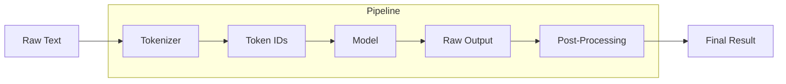

# How to Get Started with Hugging Face Transformers

Author: [nawazdhandala](https://www.github.com/nawazdhandala)

Tags: Hugging Face, Transformers, NLP, AI, Machine Learning

Description: Learn how to get started with Hugging Face Transformers for natural language processing tasks, from installation to running pre-trained models and building your first text pipeline.

---

> Hugging Face Transformers has become the go-to library for working with state-of-the-art NLP models. Whether you want to classify text, generate content, or extract information, this library makes it surprisingly easy to get started.

The library provides access to thousands of pre-trained models and handles all the complexity of tokenization, model loading, and inference. You can go from zero to running a sentiment analysis model in under 10 lines of code.

---

## Installation

### Basic Installation

Install the core transformers library along with PyTorch as the backend. You can also use TensorFlow if you prefer:

```bash
# Install with PyTorch (recommended)
pip install transformers torch

# Or install with TensorFlow
pip install transformers tensorflow
```

### Full Installation for Production

For production use, install additional dependencies that enable optimized performance and more model formats:

```bash
# Full installation with all optional dependencies
pip install transformers[torch] accelerate datasets tokenizers sentencepiece

# Verify installation
python -c "from transformers import pipeline; print('Transformers installed successfully')"
```

---

## Quick Start with Pipelines

Pipelines are the easiest way to use Transformers. They handle tokenization, model loading, and post-processing automatically.

### Sentiment Analysis

The pipeline API abstracts away complexity. Just specify the task and pass your text:

```python
from transformers import pipeline

# Create a sentiment analysis pipeline
# This downloads and caches the model on first run
classifier = pipeline("sentiment-analysis")

# Analyze single text
result = classifier("I love using Hugging Face! It makes NLP so accessible.")
print(result)
# Output: [{'label': 'POSITIVE', 'score': 0.9998}]

# Analyze multiple texts at once (more efficient)
texts = [
    "This product exceeded my expectations.",
    "The service was terrible and I want a refund.",
    "It's okay, nothing special."
]
results = classifier(texts)
for text, result in zip(texts, results):
    print(f"{text[:50]}... -> {result['label']} ({result['score']:.2%})")
```

### Text Generation

Generate text using models like GPT-2. Control the output with parameters like max_length and temperature:

```python
from transformers import pipeline

# Create text generation pipeline
generator = pipeline("text-generation", model="gpt2")

# Generate text with various parameters
output = generator(
    "The future of artificial intelligence is",
    max_length=50,           # Maximum tokens to generate
    num_return_sequences=2,  # Generate multiple completions
    temperature=0.7,         # Lower = more focused, higher = more creative
    do_sample=True           # Enable sampling for varied outputs
)

for i, sequence in enumerate(output):
    print(f"Completion {i + 1}: {sequence['generated_text']}")
```

### Named Entity Recognition

Extract entities like people, organizations, and locations from text:

```python
from transformers import pipeline

# Create NER pipeline
ner = pipeline("ner", aggregation_strategy="simple")

# Extract entities from text
text = "Apple Inc. was founded by Steve Jobs in Cupertino, California."
entities = ner(text)

# Print extracted entities
for entity in entities:
    print(f"Entity: {entity['word']}")
    print(f"  Type: {entity['entity_group']}")
    print(f"  Confidence: {entity['score']:.2%}")
    print()

# Output:
# Entity: Apple Inc.
#   Type: ORG
#   Confidence: 99.87%
# Entity: Steve Jobs
#   Type: PER
#   Confidence: 99.91%
# ...
```

---

## Available Pipeline Tasks

Hugging Face supports many task types out of the box:

| Task | Pipeline Name | Use Case |
|------|--------------|----------|
| Sentiment Analysis | `sentiment-analysis` | Classify text as positive/negative |
| Text Classification | `text-classification` | Categorize text into custom labels |
| Named Entity Recognition | `ner` | Extract people, places, organizations |
| Question Answering | `question-answering` | Answer questions based on context |
| Text Generation | `text-generation` | Generate text continuations |
| Summarization | `summarization` | Create concise summaries |
| Translation | `translation` | Translate between languages |
| Fill Mask | `fill-mask` | Predict missing words |
| Zero-Shot Classification | `zero-shot-classification` | Classify without training examples |
| Feature Extraction | `feature-extraction` | Get text embeddings |

---

## Working with Specific Models

### Loading a Specific Model

You can specify any model from the Hugging Face Hub. This gives you access to thousands of community and official models:

```python
from transformers import pipeline

# Use a specific model for better performance on your task
# DistilBERT is faster and lighter than BERT with similar accuracy
classifier = pipeline(
    "sentiment-analysis",
    model="distilbert-base-uncased-finetuned-sst-2-english"
)

# Use a multilingual model for non-English text
multilingual_classifier = pipeline(
    "sentiment-analysis",
    model="nlptown/bert-base-multilingual-uncased-sentiment"
)

# Analyze text in different languages
result = multilingual_classifier("Ce produit est fantastique!")  # French
print(f"Sentiment: {result[0]['label']}")
```

### Using Models for Question Answering

Question answering models extract answers from a given context:

```python
from transformers import pipeline

# Create QA pipeline with a specific model
qa_pipeline = pipeline(
    "question-answering",
    model="distilbert-base-cased-distilled-squad"
)

# Provide context and question
context = """
Hugging Face was founded in 2016 by Clement Delangue, Julien Chaumond,
and Thomas Wolf. The company is headquartered in New York City.
Their Transformers library has over 100,000 stars on GitHub and
supports over 100 languages.
"""

# Ask questions about the context
questions = [
    "When was Hugging Face founded?",
    "Where is Hugging Face headquartered?",
    "How many stars does Transformers have on GitHub?"
]

for question in questions:
    result = qa_pipeline(question=question, context=context)
    print(f"Q: {question}")
    print(f"A: {result['answer']} (confidence: {result['score']:.2%})")
    print()
```

---

## The Architecture Flow

Here's how Transformers processes your input:



---

## Manual Model and Tokenizer Usage

For more control, load the tokenizer and model separately. This is useful when you need to customize the inference process:

```python
from transformers import AutoTokenizer, AutoModelForSequenceClassification
import torch

# Load tokenizer and model separately
model_name = "distilbert-base-uncased-finetuned-sst-2-english"
tokenizer = AutoTokenizer.from_pretrained(model_name)
model = AutoModelForSequenceClassification.from_pretrained(model_name)

# Tokenize input text
text = "Hugging Face makes machine learning accessible to everyone."
inputs = tokenizer(
    text,
    return_tensors="pt",    # Return PyTorch tensors
    padding=True,           # Pad to max length
    truncation=True,        # Truncate if too long
    max_length=512          # Maximum sequence length
)

# Print tokenization details
print(f"Input IDs: {inputs['input_ids']}")
print(f"Attention Mask: {inputs['attention_mask']}")
print(f"Number of tokens: {inputs['input_ids'].shape[1]}")

# Run inference
with torch.no_grad():  # Disable gradient computation for inference
    outputs = model(**inputs)

# Get predictions
logits = outputs.logits
probabilities = torch.softmax(logits, dim=-1)
predicted_class = torch.argmax(probabilities, dim=-1).item()

# Map to labels
labels = model.config.id2label
print(f"\nPredicted: {labels[predicted_class]}")
print(f"Confidence: {probabilities[0][predicted_class]:.2%}")
```

---

## Text Embeddings for Semantic Search

Extract embeddings to build semantic search or similarity systems:

```python
from transformers import AutoTokenizer, AutoModel
import torch

# Load a model designed for embeddings
model_name = "sentence-transformers/all-MiniLM-L6-v2"
tokenizer = AutoTokenizer.from_pretrained(model_name)
model = AutoModel.from_pretrained(model_name)

def get_embedding(text):
    """
    Generate embedding for input text.
    Returns a normalized vector suitable for cosine similarity.
    """
    # Tokenize input
    inputs = tokenizer(
        text,
        return_tensors="pt",
        padding=True,
        truncation=True,
        max_length=256
    )

    # Get model output
    with torch.no_grad():
        outputs = model(**inputs)

    # Mean pooling - average all token embeddings
    attention_mask = inputs['attention_mask']
    token_embeddings = outputs.last_hidden_state
    input_mask_expanded = attention_mask.unsqueeze(-1).expand(token_embeddings.size()).float()
    sum_embeddings = torch.sum(token_embeddings * input_mask_expanded, 1)
    sum_mask = torch.clamp(input_mask_expanded.sum(1), min=1e-9)
    embedding = sum_embeddings / sum_mask

    # Normalize for cosine similarity
    return torch.nn.functional.normalize(embedding, p=2, dim=1)

# Create embeddings for documents
documents = [
    "Machine learning models require training data",
    "Neural networks are inspired by biological neurons",
    "Python is a popular programming language"
]

# Create embeddings
embeddings = [get_embedding(doc) for doc in documents]

# Query for similar documents
query = "How do I train an AI model?"
query_embedding = get_embedding(query)

# Calculate similarity scores
similarities = [
    torch.cosine_similarity(query_embedding, doc_emb).item()
    for doc_emb in embeddings
]

# Show results sorted by similarity
print(f"Query: {query}\n")
for doc, score in sorted(zip(documents, similarities), key=lambda x: x[1], reverse=True):
    print(f"Score: {score:.4f} - {doc}")
```

---

## Text Summarization

Summarize long documents into concise versions:

```python
from transformers import pipeline

# Create summarization pipeline with a T5 model
summarizer = pipeline(
    "summarization",
    model="facebook/bart-large-cnn"
)

# Long article to summarize
article = """
Artificial intelligence has transformed numerous industries over the past decade.
From healthcare to finance, AI systems are now handling tasks that previously
required human expertise. Machine learning algorithms can analyze vast amounts
of data to identify patterns and make predictions with remarkable accuracy.

In healthcare, AI is being used to diagnose diseases from medical images,
predict patient outcomes, and discover new drugs. Financial institutions
use AI for fraud detection, algorithmic trading, and risk assessment.
The transportation industry is developing self-driving vehicles that
rely heavily on AI systems.

However, the rapid advancement of AI has also raised important ethical concerns.
Questions about bias in AI systems, job displacement, and privacy have become
central to public discourse. Researchers and policymakers are working to
develop frameworks for responsible AI development and deployment.
"""

# Generate summary with length constraints
summary = summarizer(
    article,
    max_length=100,   # Maximum summary length
    min_length=30,    # Minimum summary length
    do_sample=False   # Deterministic output
)

print("Original length:", len(article.split()))
print("Summary length:", len(summary[0]['summary_text'].split()))
print("\nSummary:")
print(summary[0]['summary_text'])
```

---

## Zero-Shot Classification

Classify text without any training examples. Just provide the candidate labels:

```python
from transformers import pipeline

# Create zero-shot classification pipeline
classifier = pipeline(
    "zero-shot-classification",
    model="facebook/bart-large-mnli"
)

# Text to classify
text = "The new iPhone features an improved camera system and longer battery life."

# Define possible categories - no training needed
candidate_labels = [
    "technology",
    "sports",
    "politics",
    "entertainment",
    "business"
]

# Classify the text
result = classifier(
    text,
    candidate_labels,
    multi_label=False  # Set True if text can belong to multiple categories
)

print(f"Text: {text}\n")
print("Classification Results:")
for label, score in zip(result['labels'], result['scores']):
    bar = '#' * int(score * 40)
    print(f"  {label:15} {score:.2%} {bar}")
```

---

## Handling GPU Acceleration

Use GPU for faster inference when processing large amounts of data:

```python
from transformers import pipeline
import torch

# Check if GPU is available
device = 0 if torch.cuda.is_available() else -1
print(f"Using device: {'GPU' if device == 0 else 'CPU'}")

# Create pipeline with GPU acceleration
classifier = pipeline(
    "sentiment-analysis",
    model="distilbert-base-uncased-finetuned-sst-2-english",
    device=device  # 0 for GPU, -1 for CPU
)

# Process large batches efficiently
texts = [f"Sample text number {i}" for i in range(100)]

# Batch processing is more efficient on GPU
results = classifier(texts, batch_size=32)

print(f"Processed {len(results)} texts")
```

---

## Caching and Model Management

Models are cached locally after the first download. Here's how to manage them:

```python
import os
from transformers import AutoModel, AutoTokenizer

# Default cache directory
# Linux/Mac: ~/.cache/huggingface/hub
# Windows: C:\Users\<user>\.cache\huggingface\hub

# Set custom cache directory via environment variable
os.environ['HF_HOME'] = '/path/to/your/cache'

# Or specify cache directory when loading
model = AutoModel.from_pretrained(
    "distilbert-base-uncased",
    cache_dir="/path/to/cache"
)

# Force re-download if model seems corrupted
model = AutoModel.from_pretrained(
    "distilbert-base-uncased",
    force_download=True
)

# Load model in offline mode (use cached version only)
model = AutoModel.from_pretrained(
    "distilbert-base-uncased",
    local_files_only=True
)
```

### Checking Model Size

```python
from transformers import AutoModel

# Load model
model = AutoModel.from_pretrained("distilbert-base-uncased")

# Count parameters
total_params = sum(p.numel() for p in model.parameters())
trainable_params = sum(p.numel() for p in model.parameters() if p.requires_grad)

print(f"Total parameters: {total_params:,}")
print(f"Trainable parameters: {trainable_params:,}")
print(f"Model size (MB): {total_params * 4 / 1024 / 1024:.1f}")  # Assuming float32
```

---

## Common Model Choices

Here are recommended models for different tasks:

| Task | Model | Size | Notes |
|------|-------|------|-------|
| Sentiment Analysis | `distilbert-base-uncased-finetuned-sst-2-english` | 255MB | Fast and accurate |
| Text Generation | `gpt2` | 548MB | Good balance of speed and quality |
| Question Answering | `distilbert-base-cased-distilled-squad` | 255MB | Efficient for QA |
| Named Entity Recognition | `dslim/bert-base-NER` | 416MB | High accuracy NER |
| Summarization | `facebook/bart-large-cnn` | 1.6GB | News article summarization |
| Embeddings | `sentence-transformers/all-MiniLM-L6-v2` | 80MB | Fast semantic similarity |
| Zero-Shot | `facebook/bart-large-mnli` | 1.6GB | Classify without training |

---

## Error Handling Best Practices

Handle common errors gracefully in production:

```python
from transformers import pipeline, AutoModel
from transformers.pipelines import PipelineException
import torch

def safe_inference(texts, max_retries=3):
    """
    Perform inference with error handling and retries.
    """
    classifier = None

    for attempt in range(max_retries):
        try:
            # Initialize pipeline if not done
            if classifier is None:
                classifier = pipeline(
                    "sentiment-analysis",
                    model="distilbert-base-uncased-finetuned-sst-2-english"
                )

            # Run inference
            results = classifier(texts)
            return results

        except torch.cuda.OutOfMemoryError:
            # Handle GPU memory issues
            print("GPU out of memory, falling back to CPU")
            torch.cuda.empty_cache()
            classifier = pipeline(
                "sentiment-analysis",
                model="distilbert-base-uncased-finetuned-sst-2-english",
                device=-1  # Force CPU
            )

        except OSError as e:
            # Handle model download issues
            if "Connection" in str(e):
                print(f"Network error (attempt {attempt + 1}): {e}")
                continue
            raise

        except Exception as e:
            print(f"Unexpected error: {e}")
            raise

    raise RuntimeError("Max retries exceeded")

# Usage
texts = ["Great product!", "Terrible experience"]
results = safe_inference(texts)
```

---

## Performance Tips

1. **Use batching** - Process multiple texts at once instead of one at a time
2. **Choose the right model size** - DistilBERT is 60% faster than BERT with 97% of the performance
3. **Enable GPU** - Set `device=0` when creating pipelines if you have a CUDA-capable GPU
4. **Use `torch.no_grad()`** - Disable gradient computation during inference
5. **Cache models locally** - Avoid downloading on every run
6. **Consider quantization** - Reduce model size with 8-bit quantization for deployment

---

## Conclusion

Hugging Face Transformers makes it easy to add state-of-the-art NLP capabilities to your applications. Key takeaways:

- **Pipelines** provide the simplest way to get started
- **Pre-trained models** save you from training from scratch
- **Manual loading** gives you fine-grained control
- **Zero-shot classification** lets you classify without training data
- **Embeddings** enable semantic search and similarity

The library continues to grow with new models being added regularly. Check the [Hugging Face Hub](https://huggingface.co/models) for thousands of pre-trained models ready to use.

---

*Building AI-powered applications? [OneUptime](https://oneuptime.com) provides monitoring and observability for your ML infrastructure, tracking model latency, error rates, and resource utilization in production.*
