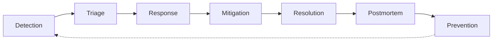
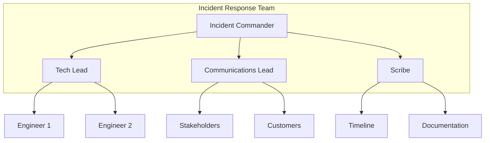

# How to Build an Incident Response Process

Author: [nawazdhandala](https://www.github.com/nawazdhandala)

Tags: SRE, Incident Management, DevOps, On-Call, Reliability

Description: A practical guide to building an incident response process that reduces downtime, improves team coordination, and helps you learn from failures.

---

When an incident hits at 2 AM, the worst thing you can have is confusion. Who owns this? What should I check first? Who needs to know? A solid incident response process turns chaos into a structured, repeatable workflow that gets services back online faster and reduces stress on your team.

This guide walks through building an incident response process from scratch, with real code examples for automation and clear explanations of each phase.

## Why You Need a Defined Process

Without a process, incidents become a scramble. Engineers waste time figuring out what to do instead of fixing the problem. Communication breaks down. The same issues recur because nobody documented what happened.

A good incident response process gives you:

- **Faster resolution** - Clear roles and runbooks mean less time figuring out what to do
- **Better communication** - Stakeholders know what's happening without interrupting engineers
- **Continuous improvement** - Postmortems turn incidents into learning opportunities
- **Reduced burnout** - Predictable on-call experience with proper escalation paths

## The Incident Lifecycle

Every incident follows a lifecycle from detection to resolution. Understanding this helps you build the right tools and procedures for each phase.



Let's break down each phase and what you need to implement.

## Phase 1: Detection

Detection is about knowing something is wrong before your customers tell you. This means monitoring, alerting, and synthetic checks.

### Setting Up Effective Alerts

Good alerts are actionable. If an alert fires, someone should need to do something about it. Here's a simple Python example for creating alerts based on error rates:

The following script monitors an application's error rate by calling a metrics endpoint, calculates the percentage of errors over a time window, and triggers an alert via webhook if the error rate exceeds a defined threshold.

```python
# alert_monitor.py
# Monitors error rate and triggers alerts when thresholds are exceeded

import requests
import time
from datetime import datetime, timedelta

class AlertMonitor:
    def __init__(self, metrics_endpoint, alert_webhook):
        self.metrics_endpoint = metrics_endpoint
        self.alert_webhook = alert_webhook
        # Alert if error rate exceeds 5% over 5 minutes
        self.error_threshold = 0.05
        self.window_minutes = 5

    def get_error_rate(self):
        """Fetch current error rate from metrics endpoint."""
        response = requests.get(f"{self.metrics_endpoint}/error_rate")
        data = response.json()
        return data['rate'], data['total_requests']

    def should_alert(self, error_rate, total_requests):
        """Determine if alert should fire based on rate and volume."""
        # Don't alert on low traffic - might be noise
        if total_requests < 100:
            return False
        return error_rate > self.error_threshold

    def send_alert(self, error_rate, total_requests):
        """Send alert to incident management system."""
        payload = {
            'severity': 'high' if error_rate > 0.10 else 'medium',
            'title': f'High error rate detected: {error_rate:.2%}',
            'description': f'Error rate is {error_rate:.2%} over {total_requests} requests',
            'timestamp': datetime.utcnow().isoformat(),
            'source': 'error_rate_monitor',
            'runbook_url': 'https://wiki.example.com/runbooks/high-error-rate'
        }
        requests.post(self.alert_webhook, json=payload)
        print(f"Alert sent: {payload['title']}")

    def run(self):
        """Main monitoring loop."""
        while True:
            try:
                error_rate, total_requests = self.get_error_rate()
                if self.should_alert(error_rate, total_requests):
                    self.send_alert(error_rate, total_requests)
            except Exception as e:
                print(f"Monitor error: {e}")
            time.sleep(60)  # Check every minute


if __name__ == '__main__':
    monitor = AlertMonitor(
        metrics_endpoint='http://localhost:9090/metrics',
        alert_webhook='https://alerts.example.com/webhook'
    )
    monitor.run()
```

### Alert Fatigue Prevention

Too many alerts lead to alert fatigue, where engineers start ignoring pages. Follow these rules:

| Rule | Why It Matters |
|------|----------------|
| Every alert should be actionable | If you can't do anything, don't page |
| No duplicate alerts for the same issue | Deduplicate before paging |
| Include runbook links | Engineers shouldn't have to search for docs |
| Set appropriate severity levels | Not everything is critical |
| Review alerts monthly | Remove or tune noisy alerts |

## Phase 2: Triage

When an alert fires, the on-call engineer needs to quickly determine severity and whether to escalate. This is triage.

### Severity Matrix

Define clear severity levels so everyone speaks the same language:

| Severity | Impact | Response Time | Example |
|----------|--------|---------------|---------|
| SEV1 | Complete outage, all users affected | Immediate, all hands | Database down |
| SEV2 | Major feature broken, many users affected | 15 minutes | Payment processing failed |
| SEV3 | Minor feature broken, some users affected | 1 hour | Search results slow |
| SEV4 | Cosmetic or minor issue | Next business day | Typo on error page |

### Automated Triage Helper

This script helps on-call engineers quickly gather diagnostic information when they get paged. It checks service health, recent deployments, and related metrics to speed up initial assessment.

```python
# triage_helper.py
# Gathers diagnostic information to speed up incident triage

import subprocess
import requests
from datetime import datetime, timedelta

class TriageHelper:
    def __init__(self, config):
        self.config = config

    def check_service_health(self, service_name):
        """Check basic health of a service."""
        results = {
            'service': service_name,
            'timestamp': datetime.utcnow().isoformat(),
            'checks': {}
        }

        # Check if service is responding
        health_url = f"{self.config['services'][service_name]}/health"
        try:
            resp = requests.get(health_url, timeout=5)
            results['checks']['health_endpoint'] = {
                'status': 'ok' if resp.status_code == 200 else 'failed',
                'response_time_ms': resp.elapsed.total_seconds() * 1000,
                'status_code': resp.status_code
            }
        except requests.exceptions.RequestException as e:
            results['checks']['health_endpoint'] = {
                'status': 'unreachable',
                'error': str(e)
            }

        return results

    def get_recent_deployments(self, hours=24):
        """Fetch recent deployments that might have caused issues."""
        # In real implementation, this would query your deployment system
        deployments_url = f"{self.config['deploy_api']}/deployments"
        params = {
            'since': (datetime.utcnow() - timedelta(hours=hours)).isoformat()
        }
        resp = requests.get(deployments_url, params=params)
        return resp.json()

    def get_related_alerts(self, alert_id):
        """Find other alerts that fired around the same time."""
        alerts_url = f"{self.config['alert_api']}/alerts"
        params = {
            'related_to': alert_id,
            'window_minutes': 30
        }
        resp = requests.get(alerts_url, params=params)
        return resp.json()

    def generate_triage_report(self, service_name, alert_id):
        """Generate a complete triage report."""
        report = {
            'generated_at': datetime.utcnow().isoformat(),
            'service': service_name,
            'alert_id': alert_id
        }

        report['health'] = self.check_service_health(service_name)
        report['recent_deployments'] = self.get_recent_deployments()
        report['related_alerts'] = self.get_related_alerts(alert_id)

        # Add suggested actions based on findings
        report['suggested_actions'] = self._suggest_actions(report)

        return report

    def _suggest_actions(self, report):
        """Suggest next steps based on triage findings."""
        suggestions = []

        # Check if recent deployment might be the cause
        deployments = report.get('recent_deployments', [])
        if deployments:
            latest = deployments[0]
            suggestions.append({
                'action': 'Consider rollback',
                'reason': f"Deployment {latest['id']} was made {latest['time_ago']}",
                'command': f"kubectl rollout undo deployment/{report['service']}"
            })

        # Check if health endpoint is failing
        health = report.get('health', {}).get('checks', {}).get('health_endpoint', {})
        if health.get('status') == 'unreachable':
            suggestions.append({
                'action': 'Check pod status',
                'reason': 'Service health endpoint is not responding',
                'command': f"kubectl get pods -l app={report['service']}"
            })

        return suggestions
```

## Phase 3: Response

Once triage confirms an incident, you need to coordinate the response. This is where roles and communication become critical.

### Incident Roles

For any significant incident, you need clear roles:



**Incident Commander** - Owns the overall incident. Makes decisions about escalation, coordinates between teams, and decides when the incident is resolved.

**Tech Lead** - Directs technical investigation. Assigns debugging tasks, reviews changes before deployment, decides on mitigation strategies.

**Communications Lead** - Handles all external communication. Updates status pages, notifies stakeholders, drafts customer communications.

**Scribe** - Documents everything in real-time. Maintains the incident timeline, captures decisions and their rationale, notes action items.

### Incident Channel Automation

This script automatically creates a dedicated Slack channel when an incident is declared, invites relevant team members, and sets up the initial context with runbook links and alert details.

```python
# incident_bot.py
# Automates incident channel creation and initial setup

import os
from slack_sdk import WebClient
from datetime import datetime

class IncidentBot:
    def __init__(self, slack_token):
        self.client = WebClient(token=slack_token)
        self.oncall_channel = '#oncall'

    def create_incident_channel(self, incident_id, severity, title):
        """Create a dedicated channel for incident coordination."""
        # Format: inc-2024-01-15-payment-errors
        date_str = datetime.utcnow().strftime('%Y-%m-%d')
        slug = title.lower().replace(' ', '-')[:30]
        channel_name = f"inc-{date_str}-{slug}"

        # Create the channel
        response = self.client.conversations_create(
            name=channel_name,
            is_private=False
        )
        channel_id = response['channel']['id']

        # Set channel topic
        self.client.conversations_setTopic(
            channel=channel_id,
            topic=f"SEV{severity} | {title} | Status: Investigating"
        )

        return channel_id, channel_name

    def post_incident_header(self, channel_id, incident_data):
        """Post initial incident information to the channel."""
        blocks = [
            {
                "type": "header",
                "text": {
                    "type": "plain_text",
                    "text": f"Incident: {incident_data['title']}"
                }
            },
            {
                "type": "section",
                "fields": [
                    {"type": "mrkdwn", "text": f"*Severity:* SEV{incident_data['severity']}"},
                    {"type": "mrkdwn", "text": f"*Status:* Investigating"},
                    {"type": "mrkdwn", "text": f"*Started:* {incident_data['started_at']}"},
                    {"type": "mrkdwn", "text": f"*IC:* {incident_data.get('commander', 'Unassigned')}"}
                ]
            },
            {
                "type": "section",
                "text": {
                    "type": "mrkdwn",
                    "text": f"*Description:*\n{incident_data['description']}"
                }
            },
            {
                "type": "actions",
                "elements": [
                    {
                        "type": "button",
                        "text": {"type": "plain_text", "text": "View Runbook"},
                        "url": incident_data.get('runbook_url', 'https://wiki.example.com/runbooks')
                    },
                    {
                        "type": "button",
                        "text": {"type": "plain_text", "text": "View Dashboard"},
                        "url": incident_data.get('dashboard_url', 'https://grafana.example.com')
                    }
                ]
            }
        ]

        self.client.chat_postMessage(
            channel=channel_id,
            blocks=blocks,
            text=f"Incident: {incident_data['title']}"
        )

    def invite_responders(self, channel_id, severity):
        """Invite appropriate responders based on severity."""
        # Get on-call engineers for this severity
        responders = self._get_oncall_responders(severity)

        for user_id in responders:
            self.client.conversations_invite(
                channel=channel_id,
                users=user_id
            )

    def _get_oncall_responders(self, severity):
        """Get list of on-call responders based on severity."""
        # In real implementation, query your on-call system
        # Returns list of Slack user IDs
        if severity == 1:
            return ['U123', 'U456', 'U789']  # Primary, secondary, and manager
        elif severity == 2:
            return ['U123', 'U456']  # Primary and secondary
        else:
            return ['U123']  # Just primary

    def update_status(self, channel_id, new_status, update_message):
        """Update incident status and notify channel."""
        # Update channel topic
        current_topic = self.client.conversations_info(channel=channel_id)
        topic_parts = current_topic['channel']['topic']['value'].split(' | ')
        topic_parts[2] = f"Status: {new_status}"
        new_topic = ' | '.join(topic_parts)

        self.client.conversations_setTopic(
            channel=channel_id,
            topic=new_topic
        )

        # Post status update
        self.client.chat_postMessage(
            channel=channel_id,
            text=f"*Status Update:* {new_status}\n{update_message}"
        )


def handle_new_incident(incident_data):
    """Main handler for new incidents."""
    bot = IncidentBot(os.environ['SLACK_BOT_TOKEN'])

    # Create incident channel
    channel_id, channel_name = bot.create_incident_channel(
        incident_data['id'],
        incident_data['severity'],
        incident_data['title']
    )

    # Post initial information
    bot.post_incident_header(channel_id, incident_data)

    # Invite responders
    bot.invite_responders(channel_id, incident_data['severity'])

    return channel_id, channel_name
```

## Phase 4: Mitigation and Resolution

The goal during an incident is to restore service first, then fix the root cause. These are often different things.

### Mitigation Strategies

Have a playbook of mitigation options ready:

| Strategy | When to Use | Example |
|----------|-------------|---------|
| Rollback | Recent deployment caused issue | `kubectl rollout undo` |
| Feature flag toggle | New feature causing problems | Disable the flag |
| Scale up | Traffic spike overwhelming system | Add more instances |
| Restart | Service in bad state | Rolling restart of pods |
| Traffic shift | One region is failing | Route traffic to healthy region |
| Degrade gracefully | Dependency is down | Serve cached data |

### Rollback Helper Script

This script provides a safe, documented rollback procedure with automatic pre-flight checks and logging. It verifies the target deployment exists and records who performed the rollback and why.

```bash
#!/bin/bash
# rollback.sh - Safe rollback with logging and verification

set -e

SERVICE=$1
REASON=$2

if [ -z "$SERVICE" ] || [ -z "$REASON" ]; then
    echo "Usage: ./rollback.sh <service-name> <reason>"
    echo "Example: ./rollback.sh payment-api 'High error rate after deploy'"
    exit 1
fi

NAMESPACE=${NAMESPACE:-production}
TIMESTAMP=$(date -u +"%Y-%m-%dT%H:%M:%SZ")
OPERATOR=$(whoami)

echo "============================================"
echo "Rollback Request"
echo "============================================"
echo "Service: $SERVICE"
echo "Namespace: $NAMESPACE"
echo "Reason: $REASON"
echo "Operator: $OPERATOR"
echo "Timestamp: $TIMESTAMP"
echo "============================================"

# Check current deployment status
echo "Current deployment status:"
kubectl get deployment "$SERVICE" -n "$NAMESPACE" -o wide

# Get current and previous revision numbers
CURRENT_REV=$(kubectl rollout history deployment/"$SERVICE" -n "$NAMESPACE" | tail -2 | head -1 | awk '{print $1}')
PREVIOUS_REV=$((CURRENT_REV - 1))

echo ""
echo "Rolling back from revision $CURRENT_REV to $PREVIOUS_REV"
echo ""

# Confirm rollback
read -p "Proceed with rollback? (yes/no): " CONFIRM
if [ "$CONFIRM" != "yes" ]; then
    echo "Rollback cancelled"
    exit 0
fi

# Perform rollback
echo "Initiating rollback..."
kubectl rollout undo deployment/"$SERVICE" -n "$NAMESPACE"

# Wait for rollout to complete
echo "Waiting for rollout to complete..."
kubectl rollout status deployment/"$SERVICE" -n "$NAMESPACE" --timeout=300s

# Log the rollback for audit purposes
echo "Logging rollback to audit system..."
curl -X POST "https://audit.example.com/events" \
    -H "Content-Type: application/json" \
    -d "{
        \"event\": \"rollback\",
        \"service\": \"$SERVICE\",
        \"namespace\": \"$NAMESPACE\",
        \"from_revision\": \"$CURRENT_REV\",
        \"to_revision\": \"$PREVIOUS_REV\",
        \"reason\": \"$REASON\",
        \"operator\": \"$OPERATOR\",
        \"timestamp\": \"$TIMESTAMP\"
    }"

echo ""
echo "============================================"
echo "Rollback complete"
echo "============================================"
echo "Please verify service health and update the incident channel"
```

## Phase 5: Postmortem

The postmortem is where you turn a painful incident into lasting improvement. The goal is learning, not blame.

### Blameless Postmortem Template

Structure your postmortems consistently. Here's a template that works well:

```markdown
# Incident Postmortem: [Title]

## Summary
- **Date:** YYYY-MM-DD
- **Duration:** X hours Y minutes
- **Severity:** SEV-X
- **Author:** [Name]

## Impact
- Number of users affected: X
- Revenue impact: $X
- SLA impact: X% availability during incident

## Timeline
All times in UTC.

| Time | Event |
|------|-------|
| HH:MM | First alert fired |
| HH:MM | On-call engineer acknowledged |
| HH:MM | Incident declared, channel created |
| HH:MM | Root cause identified |
| HH:MM | Mitigation deployed |
| HH:MM | Service restored |
| HH:MM | Incident resolved |

## Root Cause
[Describe the technical root cause. Be specific about what failed and why.]

## Contributing Factors
[What conditions allowed this to happen? Missing tests? Inadequate monitoring?]

## What Went Well
- [List things that worked during the response]

## What Could Be Improved
- [List areas where the response could have been better]

## Action Items
| Action | Owner | Due Date | Status |
|--------|-------|----------|--------|
| Add monitoring for X | @engineer | YYYY-MM-DD | Open |
| Update runbook for Y | @engineer | YYYY-MM-DD | Open |
| Add integration test | @engineer | YYYY-MM-DD | Open |

## Lessons Learned
[Key takeaways that should be shared with the broader team]
```

### Postmortem Tracking

This script helps track postmortem action items and ensures they get completed. It integrates with your issue tracker to create tickets and sends reminders for overdue items.

```python
# postmortem_tracker.py
# Tracks postmortem action items and ensures follow-through

import requests
from datetime import datetime, timedelta

class PostmortemTracker:
    def __init__(self, jira_config, slack_webhook):
        self.jira_url = jira_config['url']
        self.jira_auth = (jira_config['user'], jira_config['token'])
        self.slack_webhook = slack_webhook

    def create_action_items(self, postmortem_id, action_items):
        """Create Jira tickets for each action item."""
        created_tickets = []

        for item in action_items:
            ticket_data = {
                'fields': {
                    'project': {'key': 'SRE'},
                    'summary': item['title'],
                    'description': f"""
                        *From Postmortem:* {postmortem_id}

                        *Action Required:*
                        {item['description']}

                        *Due Date:* {item['due_date']}
                    """,
                    'issuetype': {'name': 'Task'},
                    'assignee': {'name': item['owner']},
                    'duedate': item['due_date'],
                    'labels': ['postmortem', postmortem_id]
                }
            }

            response = requests.post(
                f"{self.jira_url}/rest/api/2/issue",
                json=ticket_data,
                auth=self.jira_auth
            )

            if response.status_code == 201:
                ticket_key = response.json()['key']
                created_tickets.append(ticket_key)
                item['ticket'] = ticket_key

        return created_tickets

    def check_overdue_items(self):
        """Find overdue postmortem action items."""
        jql = 'labels = postmortem AND status != Done AND duedate < now()'

        response = requests.get(
            f"{self.jira_url}/rest/api/2/search",
            params={'jql': jql},
            auth=self.jira_auth
        )

        return response.json().get('issues', [])

    def send_overdue_reminder(self, overdue_items):
        """Send Slack reminder for overdue action items."""
        if not overdue_items:
            return

        blocks = [
            {
                "type": "header",
                "text": {
                    "type": "plain_text",
                    "text": "Overdue Postmortem Action Items"
                }
            },
            {
                "type": "section",
                "text": {
                    "type": "mrkdwn",
                    "text": "The following action items from postmortems are overdue:"
                }
            }
        ]

        for item in overdue_items:
            assignee = item['fields']['assignee']['displayName']
            due_date = item['fields']['duedate']
            days_overdue = (datetime.now() - datetime.strptime(due_date, '%Y-%m-%d')).days

            blocks.append({
                "type": "section",
                "text": {
                    "type": "mrkdwn",
                    "text": f"*<{self.jira_url}/browse/{item['key']}|{item['key']}>*: {item['fields']['summary']}\n"
                           f"Assignee: {assignee} | {days_overdue} days overdue"
                }
            })

        requests.post(self.slack_webhook, json={"blocks": blocks})

    def calculate_follow_through_rate(self, days=90):
        """Calculate what percentage of postmortem actions get completed."""
        jql = f'labels = postmortem AND created >= -{days}d'

        response = requests.get(
            f"{self.jira_url}/rest/api/2/search",
            params={'jql': jql, 'maxResults': 1000},
            auth=self.jira_auth
        )

        issues = response.json().get('issues', [])
        if not issues:
            return 0

        completed = sum(1 for i in issues if i['fields']['status']['name'] == 'Done')
        return (completed / len(issues)) * 100


def daily_check():
    """Run daily to check for overdue items."""
    tracker = PostmortemTracker(
        jira_config={
            'url': 'https://company.atlassian.net',
            'user': 'bot@company.com',
            'token': 'your-api-token'
        },
        slack_webhook='https://hooks.slack.com/services/xxx'
    )

    overdue = tracker.check_overdue_items()
    tracker.send_overdue_reminder(overdue)

    # Report follow-through rate monthly
    rate = tracker.calculate_follow_through_rate()
    print(f"Postmortem action completion rate: {rate:.1f}%")
```

## Building the On-Call Culture

A good incident response process is only as good as the people running it. Here's how to build a healthy on-call culture.

### On-Call Rotations

Set up sustainable rotations that don't burn people out:

- **Primary and Secondary** - Always have a backup
- **Weekly rotations** - Long enough to get context, short enough to not be exhausting
- **No more than one week per month** - Gives people time to recover
- **Time zone aware** - Follow-the-sun for global teams

### On-Call Compensation

Acknowledge that on-call is extra work:

- Compensatory time off after heavy rotations
- Bonus pay for incident response
- Never penalize people for issues that happen on their watch

### Runbook Standards

Every service should have a runbook. At minimum, include:

1. **Service overview** - What does this do and why does it matter?
2. **Architecture** - Dependencies, data flow, critical paths
3. **Common alerts** - What they mean and how to respond
4. **Escalation paths** - Who to contact when stuck
5. **Recovery procedures** - How to restart, rollback, failover

## Measuring Your Process

You can't improve what you don't measure. Track these metrics:

| Metric | What It Measures | Target |
|--------|------------------|--------|
| MTTD (Mean Time to Detect) | How quickly you notice problems | < 5 minutes |
| MTTA (Mean Time to Acknowledge) | How quickly on-call responds | < 15 minutes |
| MTTR (Mean Time to Recover) | How quickly you fix issues | Depends on severity |
| Incident frequency | How often incidents occur | Trending down |
| Postmortem completion rate | Are you learning from incidents? | 100% for SEV1/2 |
| Action item completion rate | Are you fixing root causes? | > 80% |

### Metrics Dashboard Script

This script generates incident response metrics from your incident tracking system. Use it to create dashboards and track improvement over time.

```python
# incident_metrics.py
# Calculate incident response metrics for reporting

from datetime import datetime, timedelta
from statistics import mean, median

class IncidentMetrics:
    def __init__(self, incidents_api):
        self.api = incidents_api

    def calculate_mttr(self, incidents):
        """Calculate Mean Time to Recovery."""
        recovery_times = []

        for incident in incidents:
            if incident.get('resolved_at'):
                started = datetime.fromisoformat(incident['started_at'])
                resolved = datetime.fromisoformat(incident['resolved_at'])
                recovery_times.append((resolved - started).total_seconds() / 60)

        if not recovery_times:
            return None

        return {
            'mean_minutes': mean(recovery_times),
            'median_minutes': median(recovery_times),
            'p95_minutes': sorted(recovery_times)[int(len(recovery_times) * 0.95)]
        }

    def calculate_mttd(self, incidents):
        """Calculate Mean Time to Detect."""
        detection_times = []

        for incident in incidents:
            if incident.get('detected_at') and incident.get('impact_started_at'):
                impact = datetime.fromisoformat(incident['impact_started_at'])
                detected = datetime.fromisoformat(incident['detected_at'])
                detection_times.append((detected - impact).total_seconds() / 60)

        if not detection_times:
            return None

        return {
            'mean_minutes': mean(detection_times),
            'median_minutes': median(detection_times)
        }

    def incident_frequency(self, days=30):
        """Count incidents by severity over time period."""
        incidents = self.api.get_incidents(
            since=(datetime.utcnow() - timedelta(days=days)).isoformat()
        )

        by_severity = {'SEV1': 0, 'SEV2': 0, 'SEV3': 0, 'SEV4': 0}
        for incident in incidents:
            sev = f"SEV{incident['severity']}"
            by_severity[sev] = by_severity.get(sev, 0) + 1

        return {
            'period_days': days,
            'total': len(incidents),
            'by_severity': by_severity,
            'per_week': len(incidents) / (days / 7)
        }

    def postmortem_stats(self, days=90):
        """Track postmortem completion and action item follow-through."""
        incidents = self.api.get_incidents(
            since=(datetime.utcnow() - timedelta(days=days)).isoformat(),
            severity_max=2  # Only SEV1 and SEV2 require postmortems
        )

        with_postmortem = sum(1 for i in incidents if i.get('postmortem_url'))

        # Get action items from postmortems
        action_items = self.api.get_postmortem_actions(days=days)
        completed = sum(1 for a in action_items if a['status'] == 'completed')

        return {
            'total_incidents': len(incidents),
            'postmortems_written': with_postmortem,
            'postmortem_rate': (with_postmortem / len(incidents) * 100) if incidents else 0,
            'action_items_total': len(action_items),
            'action_items_completed': completed,
            'completion_rate': (completed / len(action_items) * 100) if action_items else 0
        }

    def generate_report(self):
        """Generate complete metrics report."""
        incidents = self.api.get_incidents(
            since=(datetime.utcnow() - timedelta(days=30)).isoformat()
        )

        return {
            'generated_at': datetime.utcnow().isoformat(),
            'period': '30 days',
            'mttr': self.calculate_mttr(incidents),
            'mttd': self.calculate_mttd(incidents),
            'frequency': self.incident_frequency(),
            'postmortems': self.postmortem_stats()
        }
```

## Putting It All Together

Building an incident response process takes time. Start small and iterate:

1. **Week 1-2**: Define severity levels and create basic runbooks
2. **Week 3-4**: Set up on-call rotation and paging
3. **Week 5-6**: Implement incident channel automation
4. **Week 7-8**: Create postmortem template and tracking
5. **Ongoing**: Review metrics monthly, improve continuously

The goal isn't perfection. It's having a process that helps your team respond calmly and effectively when things go wrong. That calm comes from knowing what to do, who's responsible, and that you'll learn from every incident.

---

*Building an incident response process is one piece of the reliability puzzle. [OneUptime](https://oneuptime.com) provides integrated incident management, on-call scheduling, status pages, and monitoring, giving you the complete toolkit to detect, respond to, and communicate about incidents from a single platform. Start building your incident response workflow today.*
