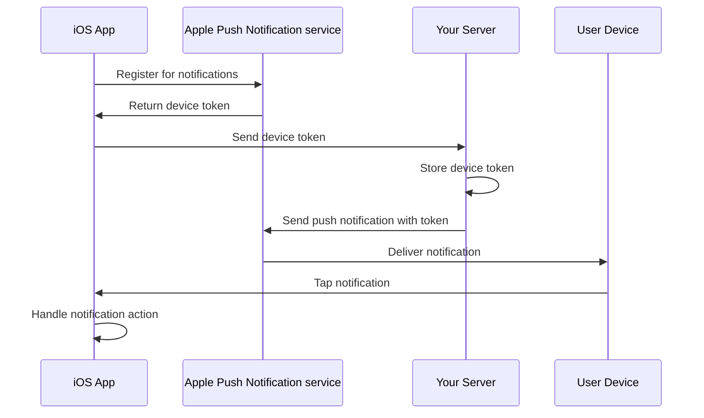
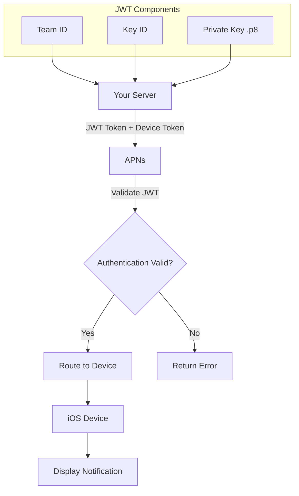
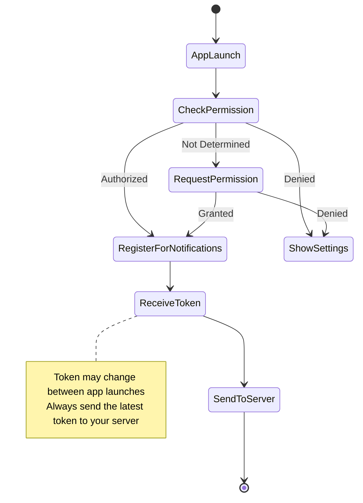
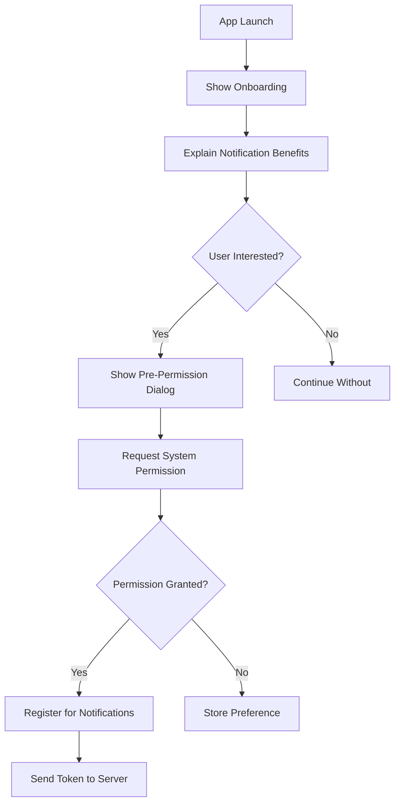

# How to Implement Push Notifications in iOS

Author: [nawazdhandala](https://github.com/nawazdhandala)

Tags: Swift, iOS, Push Notifications, APNs, Mobile Development, Apple, Xcode

Description: A comprehensive guide to implementing push notifications in iOS using Swift and Apple Push Notification service (APNs), covering setup, configuration, handling, and best practices.

---

> Push notifications are a powerful way to engage users, deliver real-time updates, and keep your app relevant even when it is not actively running. This guide walks you through implementing push notifications in iOS from scratch using Swift and the Apple Push Notification service (APNs).

Push notifications have become an essential feature for modern iOS applications. Whether you are building a messaging app, e-commerce platform, or news application, push notifications help you maintain user engagement and deliver timely information. In this comprehensive guide, we will cover everything you need to know about implementing push notifications in iOS.

---

## Table of Contents

1. [Understanding Push Notifications](#understanding-push-notifications)
2. [Prerequisites](#prerequisites)
3. [Apple Developer Account Setup](#apple-developer-account-setup)
4. [Xcode Project Configuration](#xcode-project-configuration)
5. [Requesting User Permission](#requesting-user-permission)
6. [Registering for Remote Notifications](#registering-for-remote-notifications)
7. [Handling Notifications](#handling-notifications)
8. [Server-Side Implementation](#server-side-implementation)
9. [Rich Notifications](#rich-notifications)
10. [Notification Actions](#notification-actions)
11. [Silent Push Notifications](#silent-push-notifications)
12. [Testing Push Notifications](#testing-push-notifications)
13. [Best Practices](#best-practices)
14. [Troubleshooting Common Issues](#troubleshooting-common-issues)
15. [Conclusion](#conclusion)

---

## Understanding Push Notifications

Before diving into implementation, it is important to understand how push notifications work in the iOS ecosystem.

### Push Notification Flow

The following diagram illustrates the flow of push notifications from your server to the user's device:



### Key Components

| Component | Description |
|-----------|-------------|
| **APNs** | Apple Push Notification service - Apple's cloud service that handles notification delivery |
| **Device Token** | Unique identifier for your app on a specific device |
| **Payload** | JSON data containing the notification content (max 4KB) |
| **Certificate/Key** | Authentication credentials for your server to communicate with APNs |

---

## Prerequisites

Before you begin implementing push notifications, ensure you have:

- **Xcode 15** or later installed
- An **Apple Developer Program** membership ($99/year)
- A **physical iOS device** (push notifications do not work on simulators for remote notifications)
- A **server** or backend service to send notifications
- Basic knowledge of **Swift** and **iOS development**

---

## Apple Developer Account Setup

### Step 1: Create an App ID

First, you need to create an App ID with push notification capability enabled.

1. Log in to the [Apple Developer Portal](https://developer.apple.com/account)
2. Navigate to **Certificates, Identifiers & Profiles**
3. Select **Identifiers** from the sidebar
4. Click the **+** button to create a new identifier
5. Select **App IDs** and click **Continue**
6. Choose **App** as the type and click **Continue**
7. Enter a description and your Bundle ID
8. Scroll down to **Capabilities** and check **Push Notifications**
9. Click **Continue** and then **Register**

### Step 2: Create an APNs Key

Apple recommends using APNs authentication keys over certificates. Keys are simpler to manage and do not expire.

1. In the Developer Portal, navigate to **Keys**
2. Click the **+** button to create a new key
3. Enter a key name (e.g., "Push Notifications Key")
4. Check **Apple Push Notifications service (APNs)**
5. Click **Continue** and then **Register**
6. **Download the key file** (.p8) - you can only download it once
7. Note your **Key ID** and **Team ID** (found in the top right of the portal)

### APNs Authentication Architecture



---

## Xcode Project Configuration

### Step 1: Enable Push Notifications Capability

Open your Xcode project and configure the push notifications capability.

1. Select your project in the navigator
2. Select your app target
3. Go to the **Signing & Capabilities** tab
4. Click **+ Capability**
5. Search for and add **Push Notifications**

### Step 2: Enable Background Modes (Optional)

If you want to support silent push notifications or background refresh:

1. Click **+ Capability** again
2. Add **Background Modes**
3. Check **Remote notifications**

### Step 3: Configure Your AppDelegate

The AppDelegate setup is crucial for handling push notifications. Here is the complete configuration:

```swift
// AppDelegate.swift
// This file handles the core push notification setup and registration

import UIKit
import UserNotifications

@main
class AppDelegate: UIResponder, UIApplicationDelegate {

    // This method is called when the app finishes launching
    // We set up the notification center delegate and request permissions here
    func application(
        _ application: UIApplication,
        didFinishLaunchingWithOptions launchOptions: [UIApplication.LaunchOptionsKey: Any]?
    ) -> Bool {

        // Set the notification center delegate to receive notifications while app is in foreground
        UNUserNotificationCenter.current().delegate = self

        // Request permission to display notifications
        requestNotificationPermission()

        // Check if app was launched from a notification
        if let notificationPayload = launchOptions?[.remoteNotification] as? [String: Any] {
            // Handle the notification that launched the app
            handleNotificationPayload(notificationPayload)
        }

        return true
    }

    // This method requests permission from the user to display notifications
    // It handles the authorization options for alerts, sounds, and badges
    private func requestNotificationPermission() {
        let center = UNUserNotificationCenter.current()

        // Define the authorization options we need
        let options: UNAuthorizationOptions = [.alert, .sound, .badge, .provisional]

        center.requestAuthorization(options: options) { granted, error in
            if let error = error {
                print("Error requesting notification permission: \(error.localizedDescription)")
                return
            }

            if granted {
                print("Notification permission granted")
                // Register for remote notifications on the main thread
                DispatchQueue.main.async {
                    UIApplication.shared.registerForRemoteNotifications()
                }
            } else {
                print("Notification permission denied")
            }
        }
    }

    // Called when the app successfully registers with APNs
    // The device token is what your server needs to send notifications to this device
    func application(
        _ application: UIApplication,
        didRegisterForRemoteNotificationsWithDeviceToken deviceToken: Data
    ) {
        // Convert the device token to a string format
        let tokenString = deviceToken.map { String(format: "%02.2hhx", $0) }.joined()
        print("Device Token: \(tokenString)")

        // Send this token to your server
        sendTokenToServer(tokenString)
    }

    // Called when registration for remote notifications fails
    // This provides error information for debugging
    func application(
        _ application: UIApplication,
        didFailToRegisterForRemoteNotificationsWithError error: Error
    ) {
        print("Failed to register for remote notifications: \(error.localizedDescription)")
    }

    // Send the device token to your backend server
    // Your server needs this token to send push notifications to this device
    private func sendTokenToServer(_ token: String) {
        // Replace with your actual API endpoint
        guard let url = URL(string: "https://your-api.com/register-device") else { return }

        var request = URLRequest(url: url)
        request.httpMethod = "POST"
        request.setValue("application/json", forHTTPHeaderField: "Content-Type")

        let body: [String: Any] = [
            "device_token": token,
            "platform": "ios",
            "app_version": Bundle.main.infoDictionary?["CFBundleShortVersionString"] as? String ?? "1.0"
        ]

        request.httpBody = try? JSONSerialization.data(withJSONObject: body)

        URLSession.shared.dataTask(with: request) { data, response, error in
            if let error = error {
                print("Error sending token to server: \(error.localizedDescription)")
                return
            }
            print("Device token successfully sent to server")
        }.resume()
    }

    // Helper method to process notification payloads
    private func handleNotificationPayload(_ payload: [String: Any]) {
        // Extract relevant data from the notification
        if let customData = payload["custom_data"] as? [String: Any] {
            // Handle your custom notification data
            print("Received custom data: \(customData)")
        }
    }
}
```

---

## Requesting User Permission

The permission request is critical because users must explicitly grant permission for your app to display notifications. Here is a more detailed implementation with better user experience:

```swift
// NotificationManager.swift
// A dedicated manager class for handling all notification-related functionality

import Foundation
import UserNotifications

// Enum to represent the different notification permission states
enum NotificationPermissionStatus {
    case notDetermined
    case authorized
    case denied
    case provisional
    case ephemeral
}

class NotificationManager: NSObject {

    // Singleton instance for easy access throughout the app
    static let shared = NotificationManager()

    // Reference to the notification center
    private let notificationCenter = UNUserNotificationCenter.current()

    private override init() {
        super.init()
    }

    // Check the current authorization status
    // This is useful for determining whether to show a pre-permission dialog
    func checkPermissionStatus(completion: @escaping (NotificationPermissionStatus) -> Void) {
        notificationCenter.getNotificationSettings { settings in
            DispatchQueue.main.async {
                switch settings.authorizationStatus {
                case .notDetermined:
                    completion(.notDetermined)
                case .authorized:
                    completion(.authorized)
                case .denied:
                    completion(.denied)
                case .provisional:
                    completion(.provisional)
                case .ephemeral:
                    completion(.ephemeral)
                @unknown default:
                    completion(.notDetermined)
                }
            }
        }
    }

    // Request notification permissions with a completion handler
    // This method handles all the authorization logic
    func requestPermission(completion: @escaping (Bool, Error?) -> Void) {
        let options: UNAuthorizationOptions = [.alert, .sound, .badge]

        notificationCenter.requestAuthorization(options: options) { granted, error in
            DispatchQueue.main.async {
                if granted {
                    // Register for remote notifications after permission is granted
                    UIApplication.shared.registerForRemoteNotifications()
                }
                completion(granted, error)
            }
        }
    }

    // Request provisional authorization (iOS 12+)
    // Provisional notifications appear silently in Notification Center
    // Great for non-critical notifications that do not require immediate attention
    func requestProvisionalPermission(completion: @escaping (Bool, Error?) -> Void) {
        let options: UNAuthorizationOptions = [.alert, .sound, .badge, .provisional]

        notificationCenter.requestAuthorization(options: options) { granted, error in
            DispatchQueue.main.async {
                if granted {
                    UIApplication.shared.registerForRemoteNotifications()
                }
                completion(granted, error)
            }
        }
    }

    // Open the app settings page so users can enable notifications
    // Use this when permission was previously denied
    func openAppSettings() {
        if let settingsUrl = URL(string: UIApplication.openSettingsURLString) {
            UIApplication.shared.open(settingsUrl)
        }
    }
}
```

### Using the NotificationManager in a View Controller

Here is how to integrate the notification manager into your view controller with a pre-permission dialog:

```swift
// OnboardingViewController.swift
// Shows how to properly request notification permissions with user context

import UIKit

class OnboardingViewController: UIViewController {

    // Button that triggers the permission request
    @IBOutlet weak var enableNotificationsButton: UIButton!

    override func viewDidLoad() {
        super.viewDidLoad()
        checkNotificationStatus()
    }

    // Check the current status and update UI accordingly
    private func checkNotificationStatus() {
        NotificationManager.shared.checkPermissionStatus { [weak self] status in
            switch status {
            case .notDetermined:
                // Show the enable button
                self?.enableNotificationsButton.isHidden = false
            case .authorized:
                // User already granted permission
                self?.enableNotificationsButton.setTitle("Notifications Enabled", for: .normal)
                self?.enableNotificationsButton.isEnabled = false
            case .denied:
                // Show option to open settings
                self?.enableNotificationsButton.setTitle("Enable in Settings", for: .normal)
            case .provisional:
                // Provisional authorization granted
                self?.enableNotificationsButton.setTitle("Upgrade Notifications", for: .normal)
            case .ephemeral:
                self?.enableNotificationsButton.isHidden = true
            }
        }
    }

    // Handle the button tap to request permissions
    @IBAction func enableNotificationsTapped(_ sender: UIButton) {
        NotificationManager.shared.checkPermissionStatus { [weak self] status in
            switch status {
            case .notDetermined:
                // Show a pre-permission dialog explaining why notifications are valuable
                self?.showPrePermissionDialog()
            case .denied:
                // Direct user to settings
                NotificationManager.shared.openAppSettings()
            default:
                NotificationManager.shared.requestPermission { granted, error in
                    self?.checkNotificationStatus()
                }
            }
        }
    }

    // Show a custom dialog before the system permission prompt
    // This improves opt-in rates by explaining the value first
    private func showPrePermissionDialog() {
        let alert = UIAlertController(
            title: "Stay Updated",
            message: "Enable notifications to receive important updates, messages, and alerts from the app.",
            preferredStyle: .alert
        )

        alert.addAction(UIAlertAction(title: "Not Now", style: .cancel))
        alert.addAction(UIAlertAction(title: "Enable", style: .default) { [weak self] _ in
            NotificationManager.shared.requestPermission { granted, error in
                self?.checkNotificationStatus()
            }
        })

        present(alert, animated: true)
    }
}
```

---

## Registering for Remote Notifications

Once the user grants permission, your app needs to register for remote notifications and handle the device token properly.

### Device Token Lifecycle



### Token Management Best Practices

```swift
// TokenManager.swift
// Handles device token storage and synchronization with the server

import Foundation

class TokenManager {

    // Keys for UserDefaults storage
    private enum Keys {
        static let deviceToken = "push_device_token"
        static let lastSyncDate = "token_last_sync_date"
    }

    static let shared = TokenManager()
    private init() {}

    // Store the current device token locally
    // Compare with previous token to avoid unnecessary server calls
    func updateToken(_ newToken: String) {
        let previousToken = UserDefaults.standard.string(forKey: Keys.deviceToken)

        // Only update server if token changed or never synced
        if previousToken != newToken || shouldResync() {
            sendTokenToServer(newToken) { success in
                if success {
                    UserDefaults.standard.set(newToken, forKey: Keys.deviceToken)
                    UserDefaults.standard.set(Date(), forKey: Keys.lastSyncDate)
                }
            }
        }
    }

    // Check if we should resync the token
    // Resync periodically to handle server-side token invalidation
    private func shouldResync() -> Bool {
        guard let lastSync = UserDefaults.standard.object(forKey: Keys.lastSyncDate) as? Date else {
            return true
        }

        // Resync if more than 7 days since last sync
        let daysSinceSync = Calendar.current.dateComponents([.day], from: lastSync, to: Date()).day ?? 0
        return daysSinceSync >= 7
    }

    // Send the token to your server
    private func sendTokenToServer(_ token: String, completion: @escaping (Bool) -> Void) {
        // Implementation similar to AppDelegate example
        // Include user identifier if authenticated
        guard let url = URL(string: "https://your-api.com/devices/register") else {
            completion(false)
            return
        }

        var request = URLRequest(url: url)
        request.httpMethod = "POST"
        request.setValue("application/json", forHTTPHeaderField: "Content-Type")

        // Include authentication token if user is logged in
        if let authToken = getAuthToken() {
            request.setValue("Bearer \(authToken)", forHTTPHeaderField: "Authorization")
        }

        let body: [String: Any] = [
            "device_token": token,
            "platform": "ios",
            "bundle_id": Bundle.main.bundleIdentifier ?? "",
            "app_version": Bundle.main.infoDictionary?["CFBundleShortVersionString"] as? String ?? "1.0",
            "os_version": UIDevice.current.systemVersion,
            "device_model": UIDevice.current.model
        ]

        request.httpBody = try? JSONSerialization.data(withJSONObject: body)

        URLSession.shared.dataTask(with: request) { _, response, error in
            let httpResponse = response as? HTTPURLResponse
            let success = error == nil && httpResponse?.statusCode == 200
            DispatchQueue.main.async {
                completion(success)
            }
        }.resume()
    }

    private func getAuthToken() -> String? {
        // Return user's authentication token if logged in
        // This links the device token to a specific user
        return UserDefaults.standard.string(forKey: "user_auth_token")
    }
}
```

---

## Handling Notifications

iOS provides different methods for handling notifications depending on the app's state. Here is a comprehensive implementation:

```swift
// AppDelegate+Notifications.swift
// Extension to handle all notification delegate methods

import UIKit
import UserNotifications

extension AppDelegate: UNUserNotificationCenterDelegate {

    // Called when a notification is received while the app is in the foreground
    // You can choose to display the notification or handle it silently
    func userNotificationCenter(
        _ center: UNUserNotificationCenter,
        willPresent notification: UNNotification,
        withCompletionHandler completionHandler: @escaping (UNNotificationPresentationOptions) -> Void
    ) {
        let userInfo = notification.request.content.userInfo

        // Log the notification for debugging
        print("Received notification in foreground: \(userInfo)")

        // Process the notification data
        processNotificationData(userInfo)

        // Determine how to present the notification
        // You might want to suppress certain notifications when viewing related content
        if shouldShowNotification(userInfo) {
            // Show banner, play sound, and update badge
            completionHandler([.banner, .sound, .badge])
        } else {
            // Handle silently
            completionHandler([])
        }
    }

    // Called when the user taps on a notification
    // This is where you handle navigation based on the notification content
    func userNotificationCenter(
        _ center: UNUserNotificationCenter,
        didReceive response: UNNotificationResponse,
        withCompletionHandler completionHandler: @escaping () -> Void
    ) {
        let userInfo = response.notification.request.content.userInfo
        let actionIdentifier = response.actionIdentifier

        // Handle different action types
        switch actionIdentifier {
        case UNNotificationDefaultActionIdentifier:
            // User tapped the notification itself
            handleNotificationTap(userInfo)

        case UNNotificationDismissActionIdentifier:
            // User dismissed the notification
            logNotificationDismissed(userInfo)

        default:
            // Handle custom actions (defined in notification categories)
            handleCustomAction(actionIdentifier, userInfo: userInfo)
        }

        completionHandler()
    }

    // Determine if a notification should be shown while app is in foreground
    private func shouldShowNotification(_ userInfo: [AnyHashable: Any]) -> Bool {
        // Example: Do not show chat notifications if user is already viewing that chat
        if let chatId = userInfo["chat_id"] as? String {
            return !isViewingChat(chatId)
        }
        return true
    }

    // Handle the notification tap and navigate to appropriate screen
    private func handleNotificationTap(_ userInfo: [AnyHashable: Any]) {
        // Extract the notification type and relevant data
        guard let notificationType = userInfo["type"] as? String else { return }

        switch notificationType {
        case "message":
            if let chatId = userInfo["chat_id"] as? String {
                navigateToChat(chatId)
            }

        case "order_update":
            if let orderId = userInfo["order_id"] as? String {
                navigateToOrder(orderId)
            }

        case "promo":
            if let promoUrl = userInfo["url"] as? String {
                openPromoUrl(promoUrl)
            }

        default:
            // Navigate to home or notifications list
            navigateToHome()
        }
    }

    // Handle custom notification actions
    private func handleCustomAction(_ action: String, userInfo: [AnyHashable: Any]) {
        switch action {
        case "REPLY_ACTION":
            // Handle quick reply action
            break
        case "MARK_READ_ACTION":
            // Handle mark as read action
            break
        default:
            break
        }
    }

    // Navigation helper methods
    private func navigateToChat(_ chatId: String) {
        // Post notification or use coordinator to navigate
        NotificationCenter.default.post(
            name: NSNotification.Name("NavigateToChat"),
            object: nil,
            userInfo: ["chatId": chatId]
        )
    }

    private func navigateToOrder(_ orderId: String) {
        NotificationCenter.default.post(
            name: NSNotification.Name("NavigateToOrder"),
            object: nil,
            userInfo: ["orderId": orderId]
        )
    }

    private func openPromoUrl(_ url: String) {
        if let promoUrl = URL(string: url) {
            UIApplication.shared.open(promoUrl)
        }
    }

    private func navigateToHome() {
        NotificationCenter.default.post(
            name: NSNotification.Name("NavigateToHome"),
            object: nil
        )
    }

    // Helper methods for state checking
    private func isViewingChat(_ chatId: String) -> Bool {
        // Check if user is currently viewing this specific chat
        return false
    }

    private func processNotificationData(_ userInfo: [AnyHashable: Any]) {
        // Process and store notification data
        // Update app state, sync data, etc.
    }

    private func logNotificationDismissed(_ userInfo: [AnyHashable: Any]) {
        // Log analytics for notification dismissal
    }
}
```

---

## Server-Side Implementation

Your server needs to communicate with APNs to send push notifications. Here is an example using Node.js:

```javascript
// push-notification-service.js
// Server-side implementation for sending push notifications via APNs

const jwt = require('jsonwebtoken');
const http2 = require('http2');
const fs = require('fs');

class APNsService {
    constructor(config) {
        // Store the APNs configuration
        this.teamId = config.teamId;           // Your Apple Team ID
        this.keyId = config.keyId;             // Your APNs Key ID
        this.bundleId = config.bundleId;       // Your app's bundle identifier
        this.privateKey = fs.readFileSync(config.keyPath); // Path to .p8 file

        // APNs endpoints
        this.productionHost = 'api.push.apple.com';
        this.sandboxHost = 'api.sandbox.push.apple.com';

        // JWT token cache
        this.jwtToken = null;
        this.tokenExpiry = null;
    }

    // Generate a JWT token for APNs authentication
    // Tokens are valid for 1 hour, so we cache and reuse them
    generateJWT() {
        const now = Math.floor(Date.now() / 1000);

        // Return cached token if still valid (with 5 minute buffer)
        if (this.jwtToken && this.tokenExpiry && now < this.tokenExpiry - 300) {
            return this.jwtToken;
        }

        // Generate new token
        const payload = {
            iss: this.teamId,    // Issuer: Team ID
            iat: now             // Issued at: current timestamp
        };

        const options = {
            algorithm: 'ES256',
            header: {
                alg: 'ES256',
                kid: this.keyId  // Key ID in header
            }
        };

        this.jwtToken = jwt.sign(payload, this.privateKey, options);
        this.tokenExpiry = now + 3600; // Token valid for 1 hour

        return this.jwtToken;
    }

    // Send a push notification to a device
    async sendNotification(deviceToken, payload, options = {}) {
        return new Promise((resolve, reject) => {
            const host = options.sandbox ? this.sandboxHost : this.productionHost;
            const path = `/3/device/${deviceToken}`;

            // Create HTTP/2 client
            const client = http2.connect(`https://${host}`);

            client.on('error', (err) => {
                reject(err);
            });

            // Prepare headers
            const headers = {
                ':method': 'POST',
                ':path': path,
                'authorization': `bearer ${this.generateJWT()}`,
                'apns-topic': this.bundleId,
                'apns-push-type': options.pushType || 'alert',
                'apns-priority': options.priority || '10',
                'apns-expiration': options.expiration || '0'
            };

            // Add collapse ID if provided (for updatable notifications)
            if (options.collapseId) {
                headers['apns-collapse-id'] = options.collapseId;
            }

            const req = client.request(headers);

            let responseData = '';

            req.on('response', (headers) => {
                const status = headers[':status'];

                req.on('data', (chunk) => {
                    responseData += chunk;
                });

                req.on('end', () => {
                    client.close();

                    if (status === 200) {
                        resolve({ success: true, status });
                    } else {
                        const error = responseData ? JSON.parse(responseData) : {};
                        resolve({
                            success: false,
                            status,
                            reason: error.reason || 'Unknown error'
                        });
                    }
                });
            });

            req.on('error', (err) => {
                client.close();
                reject(err);
            });

            // Send the payload
            req.write(JSON.stringify(payload));
            req.end();
        });
    }

    // Helper method to build a standard notification payload
    buildPayload(options) {
        const payload = {
            aps: {
                alert: {},
                sound: options.sound || 'default',
                badge: options.badge
            }
        };

        // Set alert content
        if (typeof options.alert === 'string') {
            payload.aps.alert = options.alert;
        } else {
            payload.aps.alert = {
                title: options.title,
                subtitle: options.subtitle,
                body: options.body
            };
        }

        // Add category for actionable notifications
        if (options.category) {
            payload.aps.category = options.category;
        }

        // Add thread ID for notification grouping
        if (options.threadId) {
            payload.aps['thread-id'] = options.threadId;
        }

        // Add content-available for silent notifications
        if (options.contentAvailable) {
            payload.aps['content-available'] = 1;
        }

        // Add mutable-content for notification service extensions
        if (options.mutableContent) {
            payload.aps['mutable-content'] = 1;
        }

        // Add custom data
        if (options.customData) {
            Object.assign(payload, options.customData);
        }

        return payload;
    }
}

// Usage example
const apns = new APNsService({
    teamId: 'YOUR_TEAM_ID',
    keyId: 'YOUR_KEY_ID',
    keyPath: './AuthKey_XXXXXXXX.p8',
    bundleId: 'com.yourcompany.yourapp'
});

// Send a notification
async function sendPushNotification() {
    const deviceToken = 'user_device_token_here';

    const payload = apns.buildPayload({
        title: 'New Message',
        body: 'You have a new message from John',
        sound: 'default',
        badge: 1,
        category: 'MESSAGE_CATEGORY',
        threadId: 'chat_123',
        mutableContent: true,
        customData: {
            type: 'message',
            chat_id: 'chat_123',
            sender_id: 'user_456'
        }
    });

    try {
        const result = await apns.sendNotification(deviceToken, payload);
        console.log('Notification sent:', result);
    } catch (error) {
        console.error('Failed to send notification:', error);
    }
}
```

---

## Rich Notifications

Rich notifications allow you to include images, videos, and custom interfaces. This requires a Notification Service Extension.

### Creating a Notification Service Extension

1. In Xcode, go to **File > New > Target**
2. Select **Notification Service Extension**
3. Name it (e.g., "NotificationServiceExtension")
4. Click **Finish**

### Implementing the Service Extension

```swift
// NotificationService.swift
// This extension modifies notifications before they are displayed

import UserNotifications

class NotificationService: UNNotificationServiceExtension {

    // Reference to keep the content handler for delivery
    var contentHandler: ((UNNotificationContent) -> Void)?

    // Best attempt content in case we run out of time
    var bestAttemptContent: UNMutableNotificationContent?

    // Called when a notification is received
    // You have approximately 30 seconds to modify the notification
    override func didReceive(
        _ request: UNNotificationRequest,
        withContentHandler contentHandler: @escaping (UNNotificationContent) -> Void
    ) {
        self.contentHandler = contentHandler
        bestAttemptContent = (request.content.mutableCopy() as? UNMutableNotificationContent)

        guard let content = bestAttemptContent else {
            contentHandler(request.content)
            return
        }

        // Check for media URL in the notification payload
        if let mediaUrlString = content.userInfo["media_url"] as? String,
           let mediaUrl = URL(string: mediaUrlString) {

            // Download and attach the media
            downloadMedia(from: mediaUrl) { [weak self] attachment in
                if let attachment = attachment {
                    content.attachments = [attachment]
                }

                // Deliver the modified notification
                contentHandler(content)
            }
        } else {
            // No media to download, deliver as-is
            contentHandler(content)
        }
    }

    // Download media from URL and create an attachment
    private func downloadMedia(
        from url: URL,
        completion: @escaping (UNNotificationAttachment?) -> Void
    ) {
        let task = URLSession.shared.downloadTask(with: url) { localUrl, response, error in
            guard let localUrl = localUrl, error == nil else {
                completion(nil)
                return
            }

            // Determine file extension from MIME type or URL
            let fileExtension = self.getFileExtension(from: response, url: url)

            // Create a unique filename
            let uniqueFilename = UUID().uuidString + fileExtension

            // Move file to a temporary location with proper extension
            let tempDirectory = FileManager.default.temporaryDirectory
            let destinationUrl = tempDirectory.appendingPathComponent(uniqueFilename)

            do {
                // Remove existing file if any
                try? FileManager.default.removeItem(at: destinationUrl)

                // Copy downloaded file
                try FileManager.default.copyItem(at: localUrl, to: destinationUrl)

                // Create the attachment
                let attachment = try UNNotificationAttachment(
                    identifier: UUID().uuidString,
                    url: destinationUrl,
                    options: nil
                )

                completion(attachment)
            } catch {
                print("Error creating attachment: \(error.localizedDescription)")
                completion(nil)
            }
        }

        task.resume()
    }

    // Determine file extension from response or URL
    private func getFileExtension(from response: URLResponse?, url: URL) -> String {
        // Try to get from MIME type
        if let mimeType = response?.mimeType {
            switch mimeType {
            case "image/jpeg": return ".jpg"
            case "image/png": return ".png"
            case "image/gif": return ".gif"
            case "video/mp4": return ".mp4"
            case "audio/mpeg": return ".mp3"
            default: break
            }
        }

        // Fall back to URL extension
        let pathExtension = url.pathExtension
        if !pathExtension.isEmpty {
            return "." + pathExtension
        }

        // Default to jpg for images
        return ".jpg"
    }

    // Called if the extension is about to be terminated
    // Deliver the best attempt content
    override func serviceExtensionTimeWillExpire() {
        if let contentHandler = contentHandler,
           let content = bestAttemptContent {
            contentHandler(content)
        }
    }
}
```

---

## Notification Actions

Actionable notifications allow users to respond directly from the notification banner.

```swift
// NotificationActions.swift
// Define and handle notification action categories

import UserNotifications

class NotificationActionManager {

    static let shared = NotificationActionManager()

    // Category identifiers
    struct Categories {
        static let message = "MESSAGE_CATEGORY"
        static let reminder = "REMINDER_CATEGORY"
        static let order = "ORDER_CATEGORY"
    }

    // Action identifiers
    struct Actions {
        static let reply = "REPLY_ACTION"
        static let markRead = "MARK_READ_ACTION"
        static let snooze = "SNOOZE_ACTION"
        static let complete = "COMPLETE_ACTION"
        static let viewDetails = "VIEW_DETAILS_ACTION"
        static let cancel = "CANCEL_ACTION"
    }

    private init() {}

    // Register all notification categories
    // Call this early in the app lifecycle
    func registerCategories() {
        let center = UNUserNotificationCenter.current()

        // Create all categories
        let categories: Set<UNNotificationCategory> = [
            createMessageCategory(),
            createReminderCategory(),
            createOrderCategory()
        ]

        center.setNotificationCategories(categories)
    }

    // Category for message notifications with reply action
    private func createMessageCategory() -> UNNotificationCategory {
        // Reply action with text input
        let replyAction = UNTextInputNotificationAction(
            identifier: Actions.reply,
            title: "Reply",
            options: [],
            textInputButtonTitle: "Send",
            textInputPlaceholder: "Type your reply..."
        )

        // Mark as read action
        let markReadAction = UNNotificationAction(
            identifier: Actions.markRead,
            title: "Mark as Read",
            options: []
        )

        return UNNotificationCategory(
            identifier: Categories.message,
            actions: [replyAction, markReadAction],
            intentIdentifiers: [],
            options: [.customDismissAction]
        )
    }

    // Category for reminder notifications
    private func createReminderCategory() -> UNNotificationCategory {
        // Snooze action
        let snoozeAction = UNNotificationAction(
            identifier: Actions.snooze,
            title: "Snooze 15 min",
            options: []
        )

        // Complete action
        let completeAction = UNNotificationAction(
            identifier: Actions.complete,
            title: "Complete",
            options: [.destructive]
        )

        return UNNotificationCategory(
            identifier: Categories.reminder,
            actions: [snoozeAction, completeAction],
            intentIdentifiers: [],
            options: []
        )
    }

    // Category for order notifications
    private func createOrderCategory() -> UNNotificationCategory {
        // View details action (opens the app)
        let viewAction = UNNotificationAction(
            identifier: Actions.viewDetails,
            title: "View Details",
            options: [.foreground]
        )

        // Cancel order action (requires unlock)
        let cancelAction = UNNotificationAction(
            identifier: Actions.cancel,
            title: "Cancel Order",
            options: [.destructive, .authenticationRequired]
        )

        return UNNotificationCategory(
            identifier: Categories.order,
            actions: [viewAction, cancelAction],
            intentIdentifiers: [],
            options: []
        )
    }
}

// Handle action responses in AppDelegate extension
extension AppDelegate {

    // Called from userNotificationCenter(_:didReceive:withCompletionHandler:)
    func handleActionResponse(_ response: UNNotificationResponse) {
        let actionId = response.actionIdentifier
        let userInfo = response.notification.request.content.userInfo

        switch actionId {
        case NotificationActionManager.Actions.reply:
            // Handle text input reply
            if let textResponse = response as? UNTextInputNotificationResponse {
                let replyText = textResponse.userText
                handleReplyAction(text: replyText, userInfo: userInfo)
            }

        case NotificationActionManager.Actions.markRead:
            handleMarkReadAction(userInfo: userInfo)

        case NotificationActionManager.Actions.snooze:
            handleSnoozeAction(userInfo: userInfo)

        case NotificationActionManager.Actions.complete:
            handleCompleteAction(userInfo: userInfo)

        case NotificationActionManager.Actions.viewDetails:
            handleViewDetailsAction(userInfo: userInfo)

        case NotificationActionManager.Actions.cancel:
            handleCancelAction(userInfo: userInfo)

        default:
            break
        }
    }

    private func handleReplyAction(text: String, userInfo: [AnyHashable: Any]) {
        guard let chatId = userInfo["chat_id"] as? String else { return }

        // Send the reply to your server
        print("Sending reply '\(text)' to chat \(chatId)")
    }

    private func handleMarkReadAction(userInfo: [AnyHashable: Any]) {
        guard let messageId = userInfo["message_id"] as? String else { return }

        // Mark message as read on server
        print("Marking message \(messageId) as read")
    }

    private func handleSnoozeAction(userInfo: [AnyHashable: Any]) {
        // Schedule a new local notification for 15 minutes later
        let content = UNMutableNotificationContent()
        content.title = userInfo["title"] as? String ?? "Reminder"
        content.body = userInfo["body"] as? String ?? ""
        content.sound = .default
        content.userInfo = userInfo

        let trigger = UNTimeIntervalNotificationTrigger(timeInterval: 900, repeats: false)
        let request = UNNotificationRequest(
            identifier: UUID().uuidString,
            content: content,
            trigger: trigger
        )

        UNUserNotificationCenter.current().add(request)
    }

    private func handleCompleteAction(userInfo: [AnyHashable: Any]) {
        guard let reminderId = userInfo["reminder_id"] as? String else { return }
        print("Completing reminder \(reminderId)")
    }

    private func handleViewDetailsAction(userInfo: [AnyHashable: Any]) {
        // This opens the app - navigation handled in didReceive
    }

    private func handleCancelAction(userInfo: [AnyHashable: Any]) {
        guard let orderId = userInfo["order_id"] as? String else { return }
        print("Canceling order \(orderId)")
    }
}
```

---

## Silent Push Notifications

Silent push notifications wake your app in the background to perform tasks without alerting the user.

```swift
// AppDelegate+SilentPush.swift
// Handle silent push notifications for background updates

import UIKit

extension AppDelegate {

    // Called when a silent push notification is received
    // Must complete within 30 seconds
    func application(
        _ application: UIApplication,
        didReceiveRemoteNotification userInfo: [AnyHashable: Any],
        fetchCompletionHandler completionHandler: @escaping (UIBackgroundFetchResult) -> Void
    ) {
        // Check if this is a silent notification
        guard let aps = userInfo["aps"] as? [String: Any],
              aps["content-available"] as? Int == 1 else {
            completionHandler(.noData)
            return
        }

        // Determine the type of background task
        if let taskType = userInfo["background_task"] as? String {
            handleBackgroundTask(taskType, userInfo: userInfo) { result in
                completionHandler(result)
            }
        } else {
            completionHandler(.noData)
        }
    }

    // Handle different types of background tasks
    private func handleBackgroundTask(
        _ taskType: String,
        userInfo: [AnyHashable: Any],
        completion: @escaping (UIBackgroundFetchResult) -> Void
    ) {
        switch taskType {
        case "sync_data":
            syncDataFromServer(completion: completion)

        case "update_cache":
            updateLocalCache(userInfo: userInfo, completion: completion)

        case "refresh_token":
            refreshAuthToken(completion: completion)

        case "update_location":
            requestLocationUpdate(completion: completion)

        default:
            completion(.noData)
        }
    }

    // Sync data from server in background
    private func syncDataFromServer(completion: @escaping (UIBackgroundFetchResult) -> Void) {
        guard let url = URL(string: "https://your-api.com/sync") else {
            completion(.failed)
            return
        }

        URLSession.shared.dataTask(with: url) { data, response, error in
            if let error = error {
                print("Sync failed: \(error.localizedDescription)")
                completion(.failed)
                return
            }

            guard let data = data else {
                completion(.noData)
                return
            }

            // Process the synced data
            do {
                // Parse and save data
                let decoder = JSONDecoder()
                // let syncData = try decoder.decode(SyncResponse.self, from: data)
                // Save to local storage...

                completion(.newData)
            } catch {
                completion(.failed)
            }
        }.resume()
    }

    // Update local cache based on notification data
    private func updateLocalCache(
        userInfo: [AnyHashable: Any],
        completion: @escaping (UIBackgroundFetchResult) -> Void
    ) {
        // Extract cache key and new value from notification
        guard let cacheKey = userInfo["cache_key"] as? String,
              let cacheValue = userInfo["cache_value"] else {
            completion(.noData)
            return
        }

        // Update UserDefaults or other local storage
        UserDefaults.standard.set(cacheValue, forKey: cacheKey)

        completion(.newData)
    }

    // Refresh authentication token in background
    private func refreshAuthToken(completion: @escaping (UIBackgroundFetchResult) -> Void) {
        // Implementation for token refresh
        completion(.newData)
    }

    // Request location update in background
    private func requestLocationUpdate(completion: @escaping (UIBackgroundFetchResult) -> Void) {
        // Trigger location manager to get current location
        // LocationManager.shared.requestSingleUpdate()
        completion(.newData)
    }
}
```

### Server Payload for Silent Notifications

```javascript
// Silent push notification payload
const silentPayload = {
    aps: {
        'content-available': 1
        // Note: no alert, sound, or badge
    },
    background_task: 'sync_data',
    sync_id: 'sync_12345'
};

// Send with appropriate headers
await apns.sendNotification(deviceToken, silentPayload, {
    pushType: 'background',  // Important: use 'background' for silent push
    priority: '5'            // Use priority 5 for silent notifications
});
```

---

## Testing Push Notifications

### Using Xcode

Xcode allows you to test push notifications using a JSON payload file:

1. Create a file named `test_notification.apns`:

```json
{
    "Simulator Target Bundle": "com.yourcompany.yourapp",
    "aps": {
        "alert": {
            "title": "Test Notification",
            "body": "This is a test push notification"
        },
        "sound": "default",
        "badge": 1
    },
    "custom_key": "custom_value"
}
```

2. Drag the file onto the simulator
3. Or use the command line:

```bash
xcrun simctl push booted com.yourcompany.yourapp test_notification.apns
```

### Using a Test Script

```swift
// PushNotificationTester.swift
// Utility for testing push notifications during development

#if DEBUG
import Foundation

class PushNotificationTester {

    // Simulate receiving a notification for testing UI handling
    static func simulateNotification(
        title: String,
        body: String,
        userInfo: [String: Any] = [:]
    ) {
        var payload: [AnyHashable: Any] = [
            "aps": [
                "alert": [
                    "title": title,
                    "body": body
                ],
                "sound": "default"
            ]
        ]

        // Merge custom user info
        for (key, value) in userInfo {
            payload[key] = value
        }

        // Post notification to simulate receiving a push
        NotificationCenter.default.post(
            name: NSNotification.Name("SimulatedPushNotification"),
            object: nil,
            userInfo: payload
        )
    }

    // Print the current device token
    static func printDeviceToken() {
        if let token = UserDefaults.standard.string(forKey: "push_device_token") {
            print("Current Device Token: \(token)")
        } else {
            print("No device token stored")
        }
    }
}
#endif
```

---

## Best Practices

### 1. Request Permission at the Right Time

Do not request permission immediately on app launch. Wait until the user understands the value of notifications.



### 2. Personalize Notifications

```swift
// Send relevant, personalized notifications
let payload = apns.buildPayload({
    title: "Hi \(userName)!",
    body: "Your order #\(orderNumber) has shipped",
    threadId: "orders_\(userId)",
    customData: {
        type: "order_shipped",
        order_id: orderId
    }
});
```

### 3. Respect User Preferences

```swift
// NotificationPreferences.swift
// Allow users to control notification types

struct NotificationPreferences: Codable {
    var marketingEnabled: Bool = true
    var orderUpdatesEnabled: Bool = true
    var chatMessagesEnabled: Bool = true
    var remindersEnabled: Bool = true

    // Check if a notification type is enabled
    func isEnabled(for type: String) -> Bool {
        switch type {
        case "marketing": return marketingEnabled
        case "order": return orderUpdatesEnabled
        case "message": return chatMessagesEnabled
        case "reminder": return remindersEnabled
        default: return true
        }
    }
}
```

### 4. Handle Token Refresh

Device tokens can change. Always handle token updates:

```swift
// Called when token changes
func application(
    _ application: UIApplication,
    didRegisterForRemoteNotificationsWithDeviceToken deviceToken: Data
) {
    // Always send the new token to your server
    TokenManager.shared.updateToken(tokenString)
}
```

### 5. Test on Real Devices

Push notifications have limitations on simulators. Always test on physical devices before release.

---

## Troubleshooting Common Issues

### Notification Not Appearing

| Issue | Solution |
|-------|----------|
| Permission not granted | Check `UNUserNotificationCenter.current().getNotificationSettings()` |
| Invalid device token | Ensure you are using the correct environment (sandbox vs production) |
| Payload too large | Keep payload under 4KB |
| App in foreground | Implement `willPresent` delegate method |
| Do Not Disturb enabled | Notifications are silenced - test with DND off |

### Token Registration Fails

```swift
// Debug token registration issues
func application(
    _ application: UIApplication,
    didFailToRegisterForRemoteNotificationsWithError error: Error
) {
    // Common errors:
    // - Network unavailable
    // - Push entitlement missing
    // - Running on simulator (for remote notifications)
    print("Registration error: \(error.localizedDescription)")

    // Check error code for specific handling
    let nsError = error as NSError
    switch nsError.code {
    case 3000:
        print("No valid aps-environment entitlement")
    case 3010:
        print("Simulator does not support remote notifications")
    default:
        print("Unknown error code: \(nsError.code)")
    }
}
```

### Server-Side Issues

```javascript
// APNs error handling
const result = await apns.sendNotification(deviceToken, payload);

if (!result.success) {
    switch (result.reason) {
        case 'BadDeviceToken':
            // Remove invalid token from database
            await removeDeviceToken(deviceToken);
            break;
        case 'Unregistered':
            // User uninstalled app or disabled notifications
            await markTokenInactive(deviceToken);
            break;
        case 'PayloadTooLarge':
            // Reduce payload size
            console.error('Payload exceeds 4KB limit');
            break;
        case 'TooManyRequests':
            // Implement backoff strategy
            await sleep(1000);
            break;
        default:
            console.error('APNs error:', result.reason);
    }
}
```

---

## Conclusion

Implementing push notifications in iOS requires careful attention to user experience, proper error handling, and server-side integration. Key takeaways:

- **Always request permission thoughtfully** - explain the value before asking
- **Handle all notification states** - foreground, background, and terminated
- **Use rich notifications** to enhance engagement with images and actions
- **Implement silent push** for background data sync
- **Test thoroughly** on real devices before release
- **Monitor delivery rates** and handle token invalidation

Push notifications are a powerful tool for user engagement when used responsibly. Focus on delivering value to your users rather than interrupting them with irrelevant messages.

---

*Need to monitor your push notification delivery rates and app health? [OneUptime](https://oneuptime.com) provides comprehensive mobile app monitoring with real-time alerting and detailed analytics.*

**Related Reading:**
- [How to Set Up Push Notifications with Firebase in React Native](https://oneuptime.com/blog/post/2026-01-15-react-native-firebase-push/view)
- [Building a Notification System with Node.js](https://oneuptime.com/blog/post/2026-01-25-notification-system-nodejs/view)
