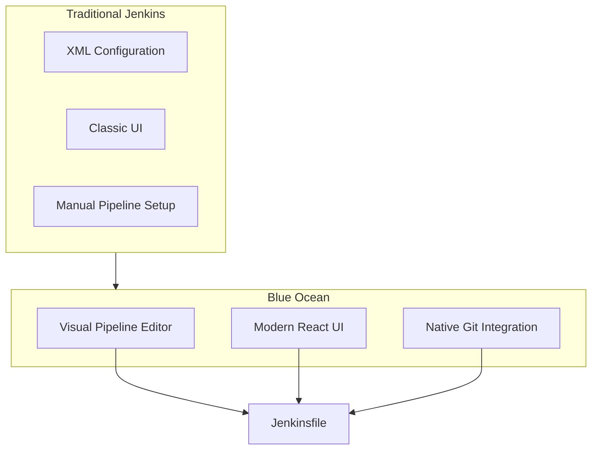
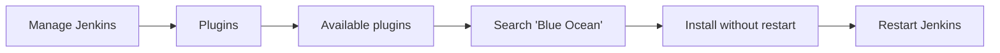
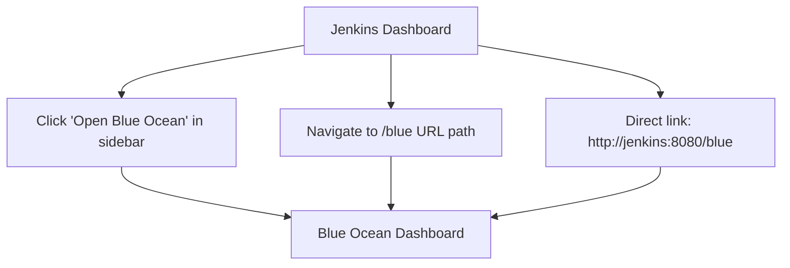
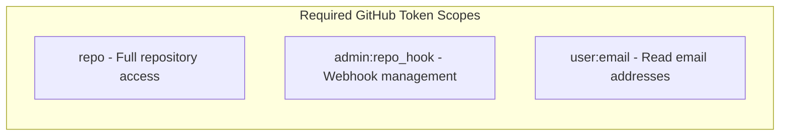
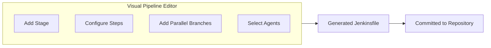
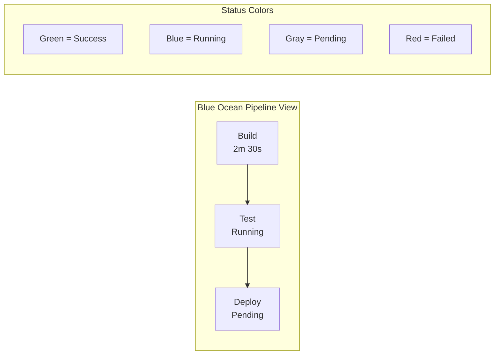
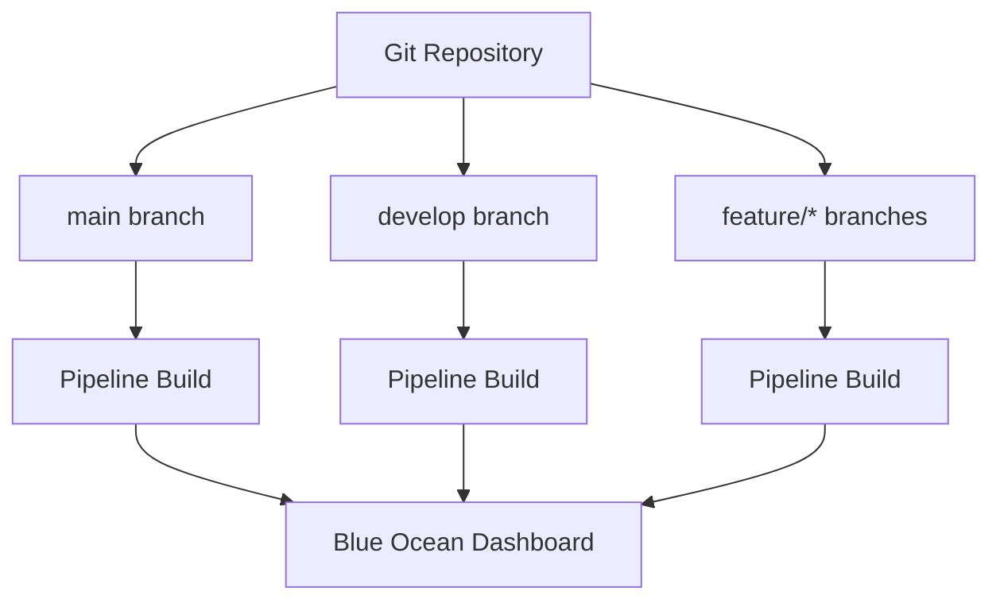
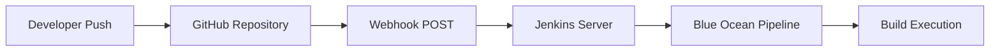
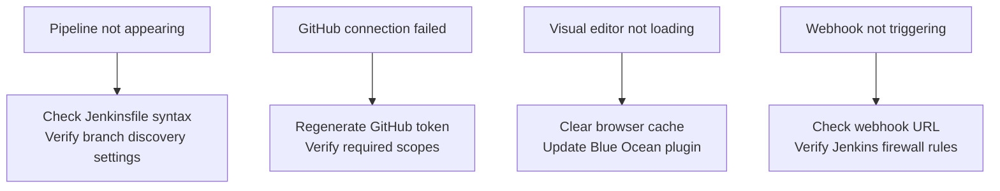

# How to Configure Jenkins for Blue Ocean

Author: [nawazdhandala](https://www.github.com/nawazdhandala)

Tags: Jenkins, Blue Ocean, CI/CD, DevOps, Pipeline, Continuous Integration, Automation, Build

Description: A comprehensive guide to installing and configuring Jenkins Blue Ocean for modern pipeline visualization. Learn how to create pipelines, integrate with Git repositories, and leverage the visual pipeline editor for streamlined CI/CD workflows.

---

> Jenkins Blue Ocean transforms the traditional Jenkins experience into a modern, visual interface designed for continuous delivery pipelines. With its intuitive design, pipeline creation becomes accessible to both experienced DevOps engineers and newcomers alike.

Manual CI/CD configuration is error-prone and time-consuming. Blue Ocean provides a visual approach that reduces complexity while maintaining full Jenkins power.

---

## What is Blue Ocean?

Blue Ocean is a complete reimagining of the Jenkins user experience. Rather than navigating through multiple configuration screens and XML files, Blue Ocean offers a visual pipeline editor, real-time execution visualization, and GitHub/Bitbucket integration out of the box.



---

## Prerequisites

Before installing Blue Ocean, ensure your Jenkins instance meets these requirements:

- Jenkins version 2.387 or higher
- Java 11 or Java 17 runtime
- At least 2GB of RAM available
- Administrative access to Jenkins

Verify your Jenkins version by navigating to **Manage Jenkins > About Jenkins** or by running the following command on your Jenkins server.

```bash
# Check Jenkins version from the command line
java -jar /usr/share/jenkins/jenkins.war --version
```

---

## Installation Methods

### Method 1: Install via Jenkins Plugin Manager

Navigate to the Jenkins Plugin Manager to install Blue Ocean through the web interface.



The following steps will guide you through the Plugin Manager installation.

1. Log in to Jenkins as an administrator
2. Navigate to **Manage Jenkins** from the left sidebar
3. Click **Plugins** in the System Configuration section
4. Select the **Available plugins** tab
5. Search for "Blue Ocean" in the filter box
6. Check the box next to "Blue Ocean"
7. Click **Install without restart**
8. Restart Jenkins when installation completes

### Method 2: Install via Jenkins CLI

Use the Jenkins CLI for automated installation, which is ideal for scripted deployments.

```bash
# Download the Jenkins CLI JAR file from your Jenkins instance
wget http://localhost:8080/jnlpJars/jenkins-cli.jar

# Install Blue Ocean plugin using the CLI
# Replace 'admin:password' with your Jenkins credentials
java -jar jenkins-cli.jar -s http://localhost:8080 -auth admin:password install-plugin blueocean

# Restart Jenkins to activate the plugin
java -jar jenkins-cli.jar -s http://localhost:8080 -auth admin:password safe-restart
```

### Method 3: Docker Installation with Blue Ocean Pre-installed

Deploy Jenkins with Blue Ocean already configured using Docker.

```bash
# Pull the official Jenkins LTS image with Blue Ocean
docker pull jenkins/jenkins:lts-jdk17

# Create a Docker network for Jenkins
docker network create jenkins

# Run Jenkins with Blue Ocean and persistent storage
# The -v flags mount volumes for Jenkins data and Docker socket access
docker run -d \
  --name jenkins-blueocean \
  --network jenkins \
  -p 8080:8080 \
  -p 50000:50000 \
  -v jenkins-data:/var/jenkins_home \
  -v /var/run/docker.sock:/var/run/docker.sock \
  jenkins/jenkins:lts-jdk17
```

After starting the container, install Blue Ocean through the Plugin Manager or use this script.

```bash
# Install Blue Ocean in running container
docker exec -it jenkins-blueocean \
  jenkins-plugin-cli --plugins blueocean

# Restart Jenkins to apply changes
docker restart jenkins-blueocean
```

---

## Initial Configuration

### Access Blue Ocean Interface

Once installed, Blue Ocean is accessible through multiple entry points.



### Retrieve Initial Admin Password

For fresh Jenkins installations, retrieve the initial admin password to complete setup.

```bash
# For standard Jenkins installations
cat /var/jenkins_home/secrets/initialAdminPassword

# For Docker installations
docker exec jenkins-blueocean cat /var/jenkins_home/secrets/initialAdminPassword
```

---

## Connecting Git Repositories

### GitHub Integration

Blue Ocean simplifies GitHub repository connections with built-in OAuth support.

Generate a GitHub Personal Access Token with the following scopes.



Configure GitHub in Blue Ocean using these steps.

1. Click **New Pipeline** in Blue Ocean
2. Select **GitHub** as the source
3. Enter your GitHub Personal Access Token
4. Select your organization or user account
5. Choose the repository containing your Jenkinsfile
6. Click **Create Pipeline**

### Bitbucket Integration

Connect Bitbucket repositories using a similar process.

```groovy
// Example Jenkinsfile for Bitbucket pipeline
// Place this file in your repository root

pipeline {
    agent any

    stages {
        stage('Checkout') {
            steps {
                // Blue Ocean automatically handles checkout for connected repos
                checkout scm
            }
        }

        stage('Build') {
            steps {
                echo 'Building application...'
                sh 'npm install'
            }
        }

        stage('Test') {
            steps {
                echo 'Running tests...'
                sh 'npm test'
            }
        }
    }
}
```

### GitLab Integration

GitLab requires additional plugin installation for full Blue Ocean support.

```bash
# Install GitLab Branch Source plugin via CLI
java -jar jenkins-cli.jar -s http://localhost:8080 \
  -auth admin:password \
  install-plugin gitlab-branch-source
```

Configure GitLab connection through Jenkins system settings.

```groovy
// Navigate to Manage Jenkins > System > GitLab
// Add the following configuration programmatically via init.groovy.d

import jenkins.model.*
import com.dabsquared.gitlabjenkins.connection.*

def instance = Jenkins.getInstance()

// Configure GitLab connection with API token
GitLabConnectionConfig descriptor = instance.getDescriptorByType(GitLabConnectionConfig.class)
GitLabConnection gitlabConnection = new GitLabConnection(
    'gitlab-connection',                    // Connection name
    'https://gitlab.company.com',           // GitLab URL
    'gitlab-api-token',                     // Credentials ID for API token
    true,                                   // Ignore certificate errors
    10,                                     // Connection timeout
    10                                      // Read timeout
)

descriptor.addConnection(gitlabConnection)
descriptor.save()
```

---

## Creating Pipelines with Visual Editor

### Visual Pipeline Editor Overview

Blue Ocean's visual editor generates Jenkinsfile syntax automatically from a drag-and-drop interface.



### Create Pipeline Using Visual Editor

Follow these steps to create a new pipeline visually.

1. Open Blue Ocean and click **New Pipeline**
2. Select your source control provider
3. Connect to your repository
4. Click **Create Pipeline** (Blue Ocean will look for an existing Jenkinsfile)
5. If no Jenkinsfile exists, click **Create Pipeline** to open the visual editor

### Visual Editor Generated Jenkinsfile

The visual editor produces clean, maintainable Jenkinsfile code.

```groovy
// Jenkinsfile generated by Blue Ocean Visual Editor
// Each stage corresponds to a visual block in the editor

pipeline {
    // Agent defines where the pipeline executes
    // 'any' means any available Jenkins agent
    agent any

    // Environment variables available to all stages
    environment {
        APP_NAME = 'my-application'
        DEPLOY_ENV = 'staging'
    }

    stages {
        // First stage handles source code checkout and dependency installation
        stage('Build') {
            steps {
                sh 'echo "Building ${APP_NAME}"'
                sh 'npm ci'
                sh 'npm run build'
            }
        }

        // Testing stage runs in parallel for faster execution
        stage('Test') {
            parallel {
                // Unit tests run on the default agent
                stage('Unit Tests') {
                    steps {
                        sh 'npm run test:unit'
                    }
                }

                // Integration tests can run simultaneously
                stage('Integration Tests') {
                    steps {
                        sh 'npm run test:integration'
                    }
                }
            }
        }

        // Deployment stage with manual approval gate
        stage('Deploy') {
            // Only deploy from the main branch
            when {
                branch 'main'
            }
            steps {
                // Wait for manual approval before deployment
                input message: 'Deploy to staging?'
                sh './deploy.sh ${DEPLOY_ENV}'
            }
        }
    }

    // Post-build actions run regardless of pipeline result
    post {
        always {
            // Clean up workspace after build
            cleanWs()
        }
        success {
            echo 'Pipeline completed successfully!'
        }
        failure {
            // Send notification on failure
            echo 'Pipeline failed - check logs for details'
        }
    }
}
```

---

## Pipeline Visualization

### Understanding the Pipeline View

Blue Ocean displays pipeline execution as a visual flow with real-time status updates.



### Viewing Pipeline Logs

Access detailed logs for each stage by clicking on the stage in the visualization.

```groovy
// Configure log output for better Blue Ocean display
// Timestamps and ANSI colors improve readability

pipeline {
    agent any

    options {
        // Add timestamps to all console output
        timestamps()
        // Enable ANSI color support for colored output
        ansiColor('xterm')
    }

    stages {
        stage('Build') {
            steps {
                // Colored output appears properly in Blue Ocean
                sh '''
                    echo "\\033[32m[INFO]\\033[0m Starting build..."
                    echo "\\033[34m[DEBUG]\\033[0m Running npm install"
                    npm install
                    echo "\\033[32m[INFO]\\033[0m Build complete"
                '''
            }
        }
    }
}
```

---

## Multi-Branch Pipeline Configuration

### Automatic Branch Detection

Blue Ocean automatically discovers and builds branches in your repository.



### Configure Branch Discovery

Control which branches trigger pipeline builds through organization folder settings.

```groovy
// Jenkinsfile with branch-specific behavior
// Different stages execute based on the branch name

pipeline {
    agent any

    stages {
        stage('Build') {
            steps {
                sh 'npm ci'
                sh 'npm run build'
            }
        }

        stage('Test') {
            steps {
                sh 'npm test'
            }
        }

        // Deploy to staging only from develop branch
        stage('Deploy Staging') {
            when {
                branch 'develop'
            }
            steps {
                echo 'Deploying to staging environment'
                sh './deploy.sh staging'
            }
        }

        // Production deployment only from main branch with approval
        stage('Deploy Production') {
            when {
                branch 'main'
            }
            steps {
                input message: 'Approve production deployment?', ok: 'Deploy'
                echo 'Deploying to production environment'
                sh './deploy.sh production'
            }
        }

        // Feature branches get preview deployments
        stage('Deploy Preview') {
            when {
                branch pattern: 'feature/*', comparator: 'GLOB'
            }
            steps {
                echo "Deploying preview for branch ${env.BRANCH_NAME}"
                sh "./deploy-preview.sh ${env.BRANCH_NAME}"
            }
        }
    }
}
```

---

## Pipeline Configuration Options

### Agent Configuration

Define where pipeline stages execute using various agent types.

```groovy
// Demonstrating different agent configurations
// Blue Ocean displays agent information in the pipeline view

pipeline {
    // Default agent for stages without specific requirements
    agent none

    stages {
        // Run on any available agent
        stage('Build') {
            agent any
            steps {
                sh 'npm install && npm run build'
            }
        }

        // Run on agent with specific label
        stage('Test') {
            agent {
                label 'linux && docker'
            }
            steps {
                sh 'npm test'
            }
        }

        // Run inside a Docker container
        stage('Integration Test') {
            agent {
                docker {
                    image 'node:18-alpine'
                    // Mount npm cache for faster builds
                    args '-v $HOME/.npm:/root/.npm'
                }
            }
            steps {
                sh 'npm run test:integration'
            }
        }

        // Run on Kubernetes pod
        stage('Deploy') {
            agent {
                kubernetes {
                    yaml '''
                        apiVersion: v1
                        kind: Pod
                        spec:
                          containers:
                          - name: kubectl
                            image: bitnami/kubectl:latest
                            command:
                            - cat
                            tty: true
                    '''
                }
            }
            steps {
                container('kubectl') {
                    sh 'kubectl apply -f k8s/'
                }
            }
        }
    }
}
```

### Environment Variables and Credentials

Manage secrets securely with Jenkins credentials integration.

```groovy
// Secure credentials handling in Blue Ocean pipelines
// Never hardcode secrets in Jenkinsfile

pipeline {
    agent any

    // Define environment variables for the entire pipeline
    environment {
        // Reference Jenkins credentials by ID
        // 'withCredentials' alternative shown in steps
        DOCKER_REGISTRY = 'registry.company.com'
        APP_VERSION = "${env.BUILD_NUMBER}"
    }

    stages {
        stage('Build and Push') {
            environment {
                // Username/password credential binding
                DOCKER_CREDS = credentials('docker-registry-creds')
            }
            steps {
                // DOCKER_CREDS_USR and DOCKER_CREDS_PSW are automatically available
                sh '''
                    echo "${DOCKER_CREDS_PSW}" | docker login ${DOCKER_REGISTRY} -u ${DOCKER_CREDS_USR} --password-stdin
                    docker build -t ${DOCKER_REGISTRY}/myapp:${APP_VERSION} .
                    docker push ${DOCKER_REGISTRY}/myapp:${APP_VERSION}
                '''
            }
        }

        stage('Deploy') {
            steps {
                // Alternative: withCredentials block for scoped access
                withCredentials([
                    string(credentialsId: 'api-token', variable: 'API_TOKEN'),
                    file(credentialsId: 'kubeconfig', variable: 'KUBECONFIG')
                ]) {
                    sh '''
                        export KUBECONFIG=${KUBECONFIG}
                        kubectl set image deployment/myapp myapp=${DOCKER_REGISTRY}/myapp:${APP_VERSION}
                    '''
                }
            }
        }
    }
}
```

---

## Webhook Configuration

### GitHub Webhooks

Configure automatic pipeline triggers on code push events.



Blue Ocean configures webhooks automatically when connecting to GitHub. Manual configuration requires these settings.

```bash
# GitHub webhook configuration
# URL: https://jenkins.company.com/github-webhook/
# Content type: application/json
# Events: Push, Pull Request

# Verify webhook connectivity
curl -X POST https://jenkins.company.com/github-webhook/ \
  -H "Content-Type: application/json" \
  -H "X-GitHub-Event: ping" \
  -d '{"zen": "test"}'
```

### Generic Webhook Trigger

Use the Generic Webhook Trigger plugin for custom integrations.

```groovy
// Pipeline with generic webhook trigger
// Supports custom payload parsing and filtering

pipeline {
    agent any

    triggers {
        // Configure webhook trigger with token authentication
        GenericTrigger(
            genericVariables: [
                // Extract values from webhook payload
                [key: 'ref', value: '$.ref'],
                [key: 'commit', value: '$.after'],
                [key: 'repository', value: '$.repository.full_name']
            ],
            // Token for webhook authentication
            token: 'my-webhook-token',
            // Only trigger for specific branches
            regexpFilterText: '$ref',
            regexpFilterExpression: 'refs/heads/(main|develop)',
            // Cause message shown in build history
            causeString: 'Triggered by webhook: $repository @ $commit'
        )
    }

    stages {
        stage('Build') {
            steps {
                echo "Building commit: ${commit}"
                echo "Repository: ${repository}"
                sh 'npm ci && npm run build'
            }
        }
    }
}
```

---

## Parallel and Matrix Builds

### Parallel Execution

Run multiple stages simultaneously to reduce pipeline duration.

```groovy
// Parallel stages for faster pipeline execution
// Blue Ocean displays parallel branches side by side

pipeline {
    agent any

    stages {
        stage('Build') {
            steps {
                sh 'npm ci'
                sh 'npm run build'
                // Stash build artifacts for later stages
                stash includes: 'dist/**', name: 'build-artifacts'
            }
        }

        stage('Quality Checks') {
            // All parallel branches execute simultaneously
            parallel {
                stage('Unit Tests') {
                    steps {
                        unstash 'build-artifacts'
                        sh 'npm run test:unit'
                    }
                    post {
                        always {
                            // Publish test results to Blue Ocean
                            junit 'test-results/unit/*.xml'
                        }
                    }
                }

                stage('Integration Tests') {
                    agent {
                        docker {
                            image 'node:18'
                            args '--network host'
                        }
                    }
                    steps {
                        unstash 'build-artifacts'
                        sh 'npm run test:integration'
                    }
                }

                stage('Security Scan') {
                    steps {
                        sh 'npm audit --audit-level=high'
                    }
                }

                stage('Lint') {
                    steps {
                        sh 'npm run lint'
                    }
                }
            }
        }
    }
}
```

### Matrix Builds

Test across multiple configurations using matrix syntax.

```groovy
// Matrix builds test all combinations of parameters
// Useful for cross-platform and multi-version testing

pipeline {
    agent none

    stages {
        stage('Test Matrix') {
            matrix {
                // Define axes for matrix combinations
                axes {
                    axis {
                        name 'NODE_VERSION'
                        values '16', '18', '20'
                    }
                    axis {
                        name 'OS'
                        values 'linux', 'windows'
                    }
                }

                // Exclude specific combinations that are not needed
                excludes {
                    exclude {
                        axis {
                            name 'NODE_VERSION'
                            values '16'
                        }
                        axis {
                            name 'OS'
                            values 'windows'
                        }
                    }
                }

                stages {
                    stage('Test') {
                        agent {
                            label "${OS}"
                        }
                        steps {
                            // Use the appropriate Node.js version
                            sh """
                                nvm install ${NODE_VERSION}
                                nvm use ${NODE_VERSION}
                                npm ci
                                npm test
                            """
                        }
                    }
                }
            }
        }
    }
}
```

---

## Blue Ocean REST API

### Query Pipeline Status

Interact with Blue Ocean programmatically using the REST API.

```bash
# Get all pipelines
# Returns JSON array of pipeline objects
curl -u admin:token "http://jenkins:8080/blue/rest/organizations/jenkins/pipelines/"

# Get specific pipeline runs
# Replace 'my-pipeline' with your pipeline name
curl -u admin:token "http://jenkins:8080/blue/rest/organizations/jenkins/pipelines/my-pipeline/runs/"

# Get latest run details including stages and steps
curl -u admin:token "http://jenkins:8080/blue/rest/organizations/jenkins/pipelines/my-pipeline/runs/latest/"

# Get pipeline run nodes (stages)
curl -u admin:token "http://jenkins:8080/blue/rest/organizations/jenkins/pipelines/my-pipeline/runs/1/nodes/"

# Download run logs
curl -u admin:token "http://jenkins:8080/blue/rest/organizations/jenkins/pipelines/my-pipeline/runs/1/log/"
```

### Trigger Pipeline via API

Start pipeline builds programmatically with parameters.

```bash
# Trigger a parameterized build
# Parameters are passed as form data
curl -X POST "http://jenkins:8080/blue/rest/organizations/jenkins/pipelines/my-pipeline/runs/" \
  -u admin:token \
  -H "Content-Type: application/json" \
  -d '{
    "parameters": [
      {"name": "DEPLOY_ENV", "value": "staging"},
      {"name": "VERSION", "value": "1.2.3"}
    ]
  }'
```

### Python API Client

Automate Blue Ocean interactions using Python.

```python
# blue_ocean_client.py
# Python client for Jenkins Blue Ocean REST API

import requests
from requests.auth import HTTPBasicAuth
from typing import Optional, List, Dict
import json

class BlueOceanClient:
    """Client for interacting with Jenkins Blue Ocean REST API"""

    def __init__(self, jenkins_url: str, username: str, token: str):
        # Initialize client with Jenkins URL and credentials
        self.base_url = f"{jenkins_url}/blue/rest/organizations/jenkins"
        self.auth = HTTPBasicAuth(username, token)
        self.session = requests.Session()
        self.session.auth = self.auth

    def get_pipelines(self) -> List[Dict]:
        """Fetch all pipelines in the Jenkins instance"""
        response = self.session.get(f"{self.base_url}/pipelines/")
        response.raise_for_status()
        return response.json()

    def get_pipeline_runs(self, pipeline_name: str, limit: int = 10) -> List[Dict]:
        """Fetch recent runs for a specific pipeline"""
        params = {"limit": limit}
        response = self.session.get(
            f"{self.base_url}/pipelines/{pipeline_name}/runs/",
            params=params
        )
        response.raise_for_status()
        return response.json()

    def get_run_details(self, pipeline_name: str, run_id: str) -> Dict:
        """Fetch detailed information about a specific run"""
        response = self.session.get(
            f"{self.base_url}/pipelines/{pipeline_name}/runs/{run_id}/"
        )
        response.raise_for_status()
        return response.json()

    def trigger_build(
        self,
        pipeline_name: str,
        parameters: Optional[Dict[str, str]] = None
    ) -> Dict:
        """Trigger a new pipeline build with optional parameters"""
        payload = {}
        if parameters:
            payload["parameters"] = [
                {"name": k, "value": v} for k, v in parameters.items()
            ]

        response = self.session.post(
            f"{self.base_url}/pipelines/{pipeline_name}/runs/",
            json=payload
        )
        response.raise_for_status()
        return response.json()

    def get_run_log(self, pipeline_name: str, run_id: str) -> str:
        """Download the complete log for a pipeline run"""
        response = self.session.get(
            f"{self.base_url}/pipelines/{pipeline_name}/runs/{run_id}/log/",
            params={"start": 0}
        )
        response.raise_for_status()
        return response.text


# Usage example demonstrating common operations
if __name__ == "__main__":
    client = BlueOceanClient(
        jenkins_url="http://jenkins:8080",
        username="admin",
        token="your-api-token"
    )

    # List all pipelines
    pipelines = client.get_pipelines()
    for pipeline in pipelines:
        print(f"Pipeline: {pipeline['name']}")

    # Trigger a build with parameters
    result = client.trigger_build(
        "my-pipeline",
        parameters={"DEPLOY_ENV": "staging"}
    )
    print(f"Started build: {result['id']}")
```

---

## Customizing Blue Ocean

### Pipeline SCM Configuration

Fine-tune how Blue Ocean discovers and builds branches.

```groovy
// Multibranch Pipeline job configuration
// Stored in job config.xml

// Programmatic configuration via Job DSL
multibranchPipelineJob('my-project') {
    // Configure branch discovery from GitHub
    branchSources {
        github {
            id('my-project-github')
            repoOwner('my-organization')
            repository('my-project')

            // Discover branches and pull requests
            buildOriginBranch(true)
            buildOriginBranchWithPR(true)
            buildForkPRHead(false)

            // Filter branches to build
            includes('main develop feature/*')
            excludes('release/*')
        }
    }

    // Orphaned branch cleanup
    orphanedItemStrategy {
        discardOldItems {
            numToKeep(20)
            daysToKeep(30)
        }
    }

    // Configure pipeline triggers
    triggers {
        periodic(1) // Scan for new branches every minute
    }

    // Factory for creating pipeline projects
    factory {
        workflowBranchProjectFactory {
            scriptPath('Jenkinsfile')
        }
    }
}
```

### Custom Pipeline Libraries

Share common functionality across pipelines using shared libraries.

```groovy
// vars/standardPipeline.groovy
// Shared library providing a standard pipeline template

def call(Map config = [:]) {
    // Default configuration values
    def appName = config.get('appName', 'my-app')
    def deployEnvs = config.get('deployEnvs', ['staging'])
    def nodeVersion = config.get('nodeVersion', '18')

    pipeline {
        agent any

        tools {
            nodejs nodeVersion
        }

        environment {
            APP_NAME = appName
        }

        stages {
            stage('Install') {
                steps {
                    sh 'npm ci'
                }
            }

            stage('Build') {
                steps {
                    sh 'npm run build'
                }
            }

            stage('Test') {
                steps {
                    sh 'npm test'
                }
                post {
                    always {
                        junit 'test-results/**/*.xml'
                    }
                }
            }

            stage('Deploy') {
                when {
                    branch 'main'
                }
                steps {
                    script {
                        deployEnvs.each { env ->
                            echo "Deploying to ${env}"
                            sh "./deploy.sh ${env}"
                        }
                    }
                }
            }
        }
    }
}
```

Use the shared library in project Jenkinsfiles.

```groovy
// Jenkinsfile using shared library
// Simple, declarative project configuration

@Library('my-shared-library') _

// Call the standard pipeline with project-specific configuration
standardPipeline(
    appName: 'web-frontend',
    nodeVersion: '20',
    deployEnvs: ['staging', 'production']
)
```

---

## Troubleshooting

### Common Issues and Solutions

Address frequent Blue Ocean configuration problems with these solutions.



### Verify Plugin Installation

Confirm all required Blue Ocean components are installed.

```bash
# List installed plugins related to Blue Ocean
java -jar jenkins-cli.jar -s http://localhost:8080 \
  -auth admin:password list-plugins | grep -i blue

# Expected output includes:
# blueocean-core-js
# blueocean-web
# blueocean-rest
# blueocean-pipeline-editor
# blueocean-github-pipeline
# blueocean-bitbucket-pipeline
```

### Debug Pipeline Issues

Enable detailed logging for troubleshooting pipeline problems.

```groovy
// Jenkinsfile with enhanced debugging
// Use temporarily when troubleshooting issues

pipeline {
    agent any

    options {
        // Keep more builds for debugging
        buildDiscarder(logRotator(numToKeepStr: '20'))
        // Show timestamps in logs
        timestamps()
        // Fail if pipeline takes too long
        timeout(time: 1, unit: 'HOURS')
    }

    stages {
        stage('Debug Info') {
            steps {
                // Print environment for debugging
                sh 'printenv | sort'

                // Show workspace contents
                sh 'ls -la'

                // Print Jenkins and Blue Ocean versions
                script {
                    def jenkins = Jenkins.instance
                    echo "Jenkins Version: ${jenkins.VERSION}"

                    def plugins = jenkins.pluginManager.plugins
                    plugins.findAll { it.shortName.contains('blueocean') }.each {
                        echo "Plugin: ${it.shortName} - ${it.version}"
                    }
                }
            }
        }
    }

    post {
        failure {
            // Archive logs on failure for later analysis
            archiveArtifacts artifacts: '**/*.log', allowEmptyArchive: true
        }
    }
}
```

### Reset Blue Ocean Configuration

Clear Blue Ocean state when experiencing persistent issues.

```bash
# Stop Jenkins before clearing data
systemctl stop jenkins

# Remove Blue Ocean cache and favorites
rm -rf /var/jenkins_home/userContent/.blueocean
rm -rf /var/jenkins_home/users/*/blueocean*

# Clear plugin cache
rm -rf /var/jenkins_home/plugins/*.bak
rm -rf /var/jenkins_home/plugins/blueocean*/

# Restart and reinstall
systemctl start jenkins

# Reinstall Blue Ocean via CLI
java -jar jenkins-cli.jar -s http://localhost:8080 \
  -auth admin:password install-plugin blueocean
```

---

## Best Practices

### Pipeline Design

1. **Keep Jenkinsfiles simple** - use shared libraries for complex logic
2. **Use meaningful stage names** - Blue Ocean displays these prominently
3. **Implement parallel stages** - reduce total pipeline duration
4. **Add timeouts** - prevent runaway builds from consuming resources
5. **Archive artifacts selectively** - avoid filling disk space

### Security Considerations

1. **Use credentials binding** - never hardcode secrets
2. **Limit plugin installations** - reduce attack surface
3. **Enable CSRF protection** - required for webhook security
4. **Restrict API access** - use API tokens instead of passwords
5. **Audit pipeline changes** - track Jenkinsfile modifications

### Performance Optimization

1. **Cache dependencies** - mount volumes for npm, Maven caches
2. **Use lightweight agents** - containers spin up faster than VMs
3. **Prune old builds** - configure build retention policies
4. **Optimize checkout** - use shallow clones for large repositories

---

## Conclusion

Blue Ocean transforms Jenkins from a traditional CI server into a modern, visual continuous delivery platform. By following the configuration steps and best practices outlined in this guide, your team can leverage pipeline visualization, Git integration, and the visual editor to streamline CI/CD workflows.

Key takeaways from this guide:

- **Installation is straightforward** - through Plugin Manager, CLI, or Docker
- **Git integration works out of the box** - GitHub, Bitbucket, and GitLab connections are built-in
- **Visual editor generates clean Jenkinsfiles** - no manual syntax required
- **Multi-branch pipelines discover automatically** - branches trigger builds without configuration
- **REST API enables automation** - integrate Blue Ocean with external tools

Start experimenting with Blue Ocean on a test Jenkins instance before rolling it out to production pipelines.

---

*Looking for CI/CD monitoring solutions? [OneUptime](https://oneuptime.com) provides comprehensive monitoring for Jenkins pipelines with build status tracking, failure alerting, and performance metrics.*
