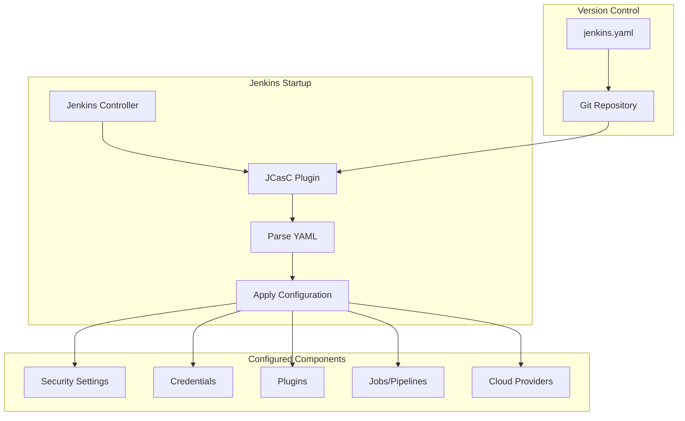
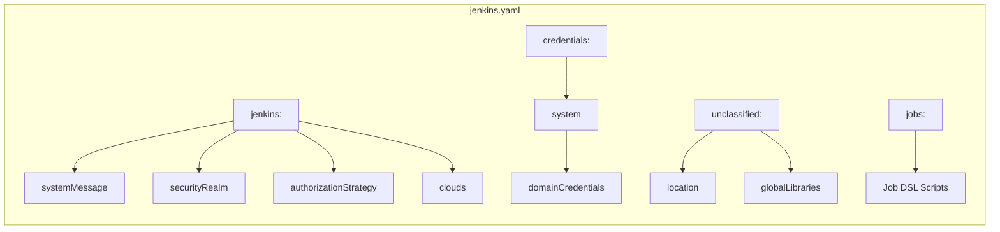
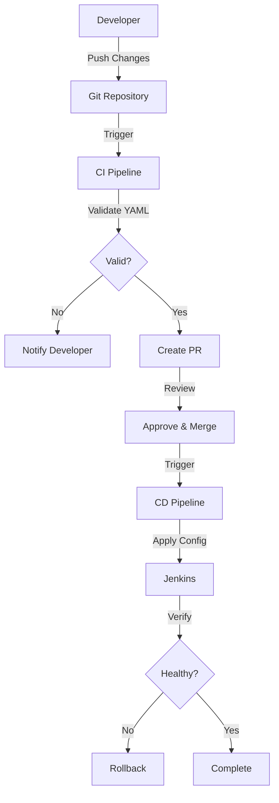

# How to Use Jenkins Configuration as Code

Author: [nawazdhandala](https://www.github.com/nawazdhandala)

Tags: Jenkins, Configuration as Code, JCasC, CI/CD, DevOps, Automation, Infrastructure as Code

Description: A complete guide to managing Jenkins with Configuration as Code (JCasC), covering installation, YAML configuration, secrets management, and production best practices for reproducible Jenkins environments.

---

> Manually clicking through Jenkins menus to configure jobs, credentials, and plugins wastes hours and creates snowflake servers that are impossible to reproduce. Jenkins Configuration as Code (JCasC) lets you define your entire Jenkins setup in version-controlled YAML files that can be applied automatically.

## What is Jenkins Configuration as Code?

Jenkins Configuration as Code (JCasC) is a plugin that allows you to define Jenkins configuration in human-readable YAML files. Instead of clicking through the web UI or writing Groovy init scripts, you declare your desired state in YAML and JCasC makes it happen.

The following diagram illustrates how JCasC fits into the Jenkins ecosystem.



### Benefits of JCasC

- **Reproducibility**: Spin up identical Jenkins instances from the same configuration
- **Version Control**: Track changes, review PRs, and roll back when needed
- **Disaster Recovery**: Rebuild Jenkins in minutes, not hours
- **Environment Parity**: Keep development, staging, and production Jenkins instances consistent
- **Auditability**: Every configuration change is tracked in Git history

## Installing the JCasC Plugin

Before configuring Jenkins as code, you need the Configuration as Code plugin installed.

### Via Jenkins UI

Navigate to **Manage Jenkins > Manage Plugins > Available** and search for "Configuration as Code". Install the plugin and restart Jenkins.

### Via Docker

When using the official Jenkins Docker image, you can pre-install plugins using a plugins.txt file. Here is a minimal plugins.txt that includes JCasC and common dependencies.

```text
# plugins.txt
# Core plugin for Configuration as Code
configuration-as-code:latest

# Commonly needed plugins for JCasC configurations
credentials:latest
credentials-binding:latest
git:latest
workflow-aggregator:latest
job-dsl:latest
```

Build a custom Jenkins image with these plugins pre-installed.

```dockerfile
# Dockerfile
# Custom Jenkins image with JCasC and essential plugins
FROM jenkins/jenkins:lts

# Skip initial setup wizard since we configure via JCasC
ENV JAVA_OPTS="-Djenkins.install.runSetupWizard=false"

# Copy plugins list and install them
COPY plugins.txt /usr/share/jenkins/ref/plugins.txt
RUN jenkins-plugin-cli --plugin-file /usr/share/jenkins/ref/plugins.txt

# Copy JCasC configuration file
COPY jenkins.yaml /var/jenkins_home/casc_configs/jenkins.yaml

# Tell JCasC where to find configuration files
ENV CASC_JENKINS_CONFIG=/var/jenkins_home/casc_configs
```

### Via Helm Chart

When deploying Jenkins on Kubernetes using the official Helm chart, enable JCasC in your values.yaml file.

```yaml
# values.yaml
# Helm chart configuration for Jenkins with JCasC
controller:
  # Install these plugins on startup
  installPlugins:
    - configuration-as-code:latest
    - kubernetes:latest
    - workflow-aggregator:latest
    - git:latest
    - credentials-binding:latest

  # JCasC configuration embedded in Helm values
  JCasC:
    defaultConfig: true
    configScripts:
      welcome-message: |
        jenkins:
          systemMessage: "Jenkins configured via Helm and JCasC"
```

## Basic Configuration Structure

JCasC configuration files use a specific YAML structure that maps to Jenkins internal APIs. Understanding the hierarchy helps you write correct configurations.

The following diagram shows the main configuration sections and their relationships.



### Minimal Configuration Example

Start with a minimal configuration that sets basic Jenkins properties.

```yaml
# jenkins.yaml
# Minimal JCasC configuration to get started
jenkins:
  # Message displayed on Jenkins dashboard
  systemMessage: "Jenkins managed by Configuration as Code"

  # Number of executors on the built-in node (set to 0 for security)
  numExecutors: 0

  # How Jenkins handles distributed builds
  mode: NORMAL

  # Labels for the built-in node
  labelString: "built-in"

# Configure Jenkins URL and admin email
unclassified:
  location:
    url: "https://jenkins.example.com/"
    adminAddress: "admin@example.com"
```

### Complete Configuration Template

A production-ready JCasC configuration typically includes security, credentials, and tool configurations. Here is a comprehensive template showing all major sections.

```yaml
# jenkins.yaml
# Complete JCasC configuration template for production use
jenkins:
  systemMessage: "Production Jenkins - Managed by JCasC"
  numExecutors: 0
  mode: EXCLUSIVE

  # Security realm defines how users authenticate
  securityRealm:
    local:
      allowsSignup: false
      users:
        - id: "admin"
          password: "${JENKINS_ADMIN_PASSWORD}"

  # Authorization strategy defines what users can do
  authorizationStrategy:
    globalMatrix:
      permissions:
        - "Overall/Administer:admin"
        - "Overall/Read:authenticated"

  # Global environment variables available to all builds
  globalNodeProperties:
    - envVars:
        env:
          - key: "DOCKER_REGISTRY"
            value: "registry.example.com"
          - key: "MAVEN_OPTS"
            value: "-Xmx1024m"

# Credentials available to pipelines
credentials:
  system:
    domainCredentials:
      - credentials:
          - usernamePassword:
              scope: GLOBAL
              id: "github-credentials"
              username: "jenkins-bot"
              password: "${GITHUB_TOKEN}"

# Plugins and tool configurations
unclassified:
  location:
    url: "https://jenkins.example.com/"
    adminAddress: "devops@example.com"

# Job definitions using Job DSL
jobs:
  - script: |
      folder('applications') {
        description('Application build jobs')
      }
```

## Configuring Security

Security configuration is one of the most important aspects of JCasC. You can define authentication methods, authorization strategies, and security settings.

### Local User Database

For simple setups, configure a local user database with predefined users.

```yaml
# jenkins-security-local.yaml
# Local user authentication with predefined admin account
jenkins:
  securityRealm:
    local:
      # Prevent random users from creating accounts
      allowsSignup: false
      users:
        # Admin user with password from environment variable
        - id: "admin"
          name: "Administrator"
          password: "${JENKINS_ADMIN_PASSWORD}"
        # Read-only user for dashboards
        - id: "readonly"
          name: "Read Only User"
          password: "${JENKINS_READONLY_PASSWORD}"
```

### LDAP Authentication

For enterprise environments, integrate with LDAP or Active Directory.

```yaml
# jenkins-security-ldap.yaml
# LDAP authentication for enterprise environments
jenkins:
  securityRealm:
    ldap:
      configurations:
        # LDAP server connection settings
        - server: "ldap://ldap.example.com"
          rootDN: "dc=example,dc=com"

          # Service account for LDAP queries
          managerDN: "cn=jenkins,ou=services,dc=example,dc=com"
          managerPasswordSecret: "${LDAP_MANAGER_PASSWORD}"

          # Where to search for users
          userSearchBase: "ou=users"
          userSearch: "uid={0}"

          # Where to search for groups
          groupSearchBase: "ou=groups"
          groupSearchFilter: "(& (cn={0}) (objectclass=groupOfNames))"
          groupMembershipStrategy:
            fromGroupSearch:
              filter: "member={0}"
```

### Matrix-Based Authorization

Control who can do what with matrix-based authorization. Permissions are granular and can be assigned to users or groups.

```yaml
# jenkins-security-matrix.yaml
# Fine-grained authorization using matrix strategy
jenkins:
  authorizationStrategy:
    globalMatrix:
      permissions:
        # Full admin access for admins group
        - "Overall/Administer:admins"

        # Developers can build and view jobs
        - "Overall/Read:developers"
        - "Job/Build:developers"
        - "Job/Read:developers"
        - "Job/Workspace:developers"

        # QA team can only view and run builds
        - "Overall/Read:qa"
        - "Job/Read:qa"
        - "Job/Build:qa"

        # Everyone authenticated can at least read
        - "Overall/Read:authenticated"
```

### Role-Based Authorization

For larger organizations, role-based authorization provides cleaner permission management.

```yaml
# jenkins-security-rbac.yaml
# Role-based authorization with Role Strategy plugin
jenkins:
  authorizationStrategy:
    roleBased:
      roles:
        global:
          # Admin role with full access
          - name: "admin"
            permissions:
              - "Overall/Administer"
            assignments:
              - "admin"
              - "devops-team"

          # Read-only role for monitoring
          - name: "viewer"
            permissions:
              - "Overall/Read"
              - "Job/Read"
            assignments:
              - "authenticated"

        # Project-specific roles
        items:
          - name: "backend-developer"
            pattern: "backend-.*"
            permissions:
              - "Job/Build"
              - "Job/Read"
              - "Job/Workspace"
            assignments:
              - "backend-team"

          - name: "frontend-developer"
            pattern: "frontend-.*"
            permissions:
              - "Job/Build"
              - "Job/Read"
              - "Job/Workspace"
            assignments:
              - "frontend-team"
```

## Managing Credentials

Credentials are essential for connecting to external systems. JCasC supports various credential types while keeping secrets secure.

### Username and Password Credentials

Store username/password combinations for services like Git repositories or artifact servers.

```yaml
# jenkins-credentials.yaml
# Various credential types for external service authentication
credentials:
  system:
    domainCredentials:
      - credentials:
          # Git repository access
          - usernamePassword:
              scope: GLOBAL
              id: "github-credentials"
              description: "GitHub access for Jenkins"
              username: "jenkins-bot"
              # Password from environment variable - never hardcode
              password: "${GITHUB_TOKEN}"

          # Artifact repository access
          - usernamePassword:
              scope: GLOBAL
              id: "nexus-credentials"
              description: "Nexus repository manager"
              username: "jenkins"
              password: "${NEXUS_PASSWORD}"

          # Docker registry access
          - usernamePassword:
              scope: GLOBAL
              id: "docker-registry"
              description: "Private Docker registry"
              username: "jenkins"
              password: "${DOCKER_REGISTRY_PASSWORD}"
```

### SSH Private Key Credentials

For SSH-based Git access or server connections, use SSH private key credentials.

```yaml
# jenkins-ssh-credentials.yaml
# SSH key credentials for Git and server access
credentials:
  system:
    domainCredentials:
      - credentials:
          # SSH key from environment variable
          - basicSSHUserPrivateKey:
              scope: GLOBAL
              id: "git-ssh-key"
              description: "SSH key for Git repositories"
              username: "git"
              privateKeySource:
                directEntry:
                  # Private key from environment variable
                  privateKey: "${GIT_SSH_PRIVATE_KEY}"

          # SSH key from file on disk
          - basicSSHUserPrivateKey:
              scope: GLOBAL
              id: "deploy-ssh-key"
              description: "SSH key for deployment servers"
              username: "deploy"
              privateKeySource:
                fileOnMaster:
                  keyFile: "/var/jenkins_home/secrets/deploy-key"
```

### Secret Text and Files

Store API tokens, certificates, and other sensitive data as secret text or files.

```yaml
# jenkins-secret-credentials.yaml
# Secret text and file credentials for various integrations
credentials:
  system:
    domainCredentials:
      - credentials:
          # API tokens stored as secret text
          - string:
              scope: GLOBAL
              id: "slack-token"
              description: "Slack API token for notifications"
              secret: "${SLACK_TOKEN}"

          - string:
              scope: GLOBAL
              id: "sonarqube-token"
              description: "SonarQube authentication token"
              secret: "${SONARQUBE_TOKEN}"

          # Certificate file for mTLS
          - file:
              scope: GLOBAL
              id: "client-certificate"
              description: "Client certificate for API authentication"
              fileName: "client.pem"
              secretBytes: "${base64:CLIENT_CERT_BASE64}"
```

### AWS Credentials

When using AWS services, configure AWS credentials for Jenkins.

```yaml
# jenkins-aws-credentials.yaml
# AWS credentials for S3, ECR, and other AWS services
credentials:
  system:
    domainCredentials:
      - credentials:
          # Static AWS credentials (not recommended for production)
          - aws:
              scope: GLOBAL
              id: "aws-credentials"
              description: "AWS access for Jenkins"
              accessKey: "${AWS_ACCESS_KEY_ID}"
              secretKey: "${AWS_SECRET_ACCESS_KEY}"

          # Web identity credentials for EKS (recommended)
          - awsCredentialsFromWebIdentity:
              scope: GLOBAL
              id: "aws-web-identity"
              description: "AWS credentials from EKS service account"
              roleArn: "arn:aws:iam::123456789012:role/jenkins-role"
```

## Configuring Cloud Providers

JCasC excels at configuring dynamic build agents on cloud platforms. Kubernetes is the most common choice.

### Kubernetes Cloud Configuration

Configure Jenkins to provision agents dynamically on Kubernetes.

```yaml
# jenkins-kubernetes-cloud.yaml
# Kubernetes cloud configuration for dynamic agent provisioning
jenkins:
  clouds:
    - kubernetes:
        # Unique identifier for this cloud
        name: "kubernetes"

        # Kubernetes API server URL (empty for in-cluster)
        serverUrl: ""

        # Namespace for agent pods
        namespace: "jenkins"

        # URL for agents to connect back to Jenkins
        jenkinsUrl: "http://jenkins.jenkins.svc.cluster.local:8080"

        # JNLP tunnel for inbound agents
        jenkinsTunnel: "jenkins-agent.jenkins.svc.cluster.local:50000"

        # Maximum concurrent agent pods
        containerCapStr: "20"

        # Pod templates define agent specifications
        templates:
          # General-purpose build agent
          - name: "default-agent"
            label: "jenkins-agent"
            nodeUsageMode: "NORMAL"
            containers:
              - name: "jnlp"
                image: "jenkins/inbound-agent:latest"
                workingDir: "/home/jenkins/agent"
                resourceRequestCpu: "200m"
                resourceRequestMemory: "256Mi"
                resourceLimitCpu: "1000m"
                resourceLimitMemory: "1Gi"
```

### Multiple Pod Templates

Define specialized pod templates for different build types.

```yaml
# jenkins-pod-templates.yaml
# Multiple pod templates for different build scenarios
jenkins:
  clouds:
    - kubernetes:
        name: "kubernetes"
        namespace: "jenkins"
        jenkinsUrl: "http://jenkins:8080"
        templates:
          # Maven build agent with caching
          - name: "maven"
            label: "maven"
            containers:
              - name: "jnlp"
                image: "jenkins/inbound-agent:latest"
              - name: "maven"
                image: "maven:3.9-eclipse-temurin-17"
                command: "sleep"
                args: "infinity"
                ttyEnabled: true
                resourceRequestMemory: "1Gi"
                resourceLimitMemory: "4Gi"
            volumes:
              - persistentVolumeClaim:
                  claimName: "maven-cache"
                  mountPath: "/root/.m2/repository"

          # Node.js build agent
          - name: "nodejs"
            label: "nodejs"
            containers:
              - name: "jnlp"
                image: "jenkins/inbound-agent:latest"
              - name: "nodejs"
                image: "node:20-alpine"
                command: "sleep"
                args: "infinity"
                ttyEnabled: true
                resourceRequestMemory: "512Mi"
                resourceLimitMemory: "2Gi"

          # Docker build agent using Kaniko
          - name: "kaniko"
            label: "kaniko"
            containers:
              - name: "jnlp"
                image: "jenkins/inbound-agent:latest"
              - name: "kaniko"
                image: "gcr.io/kaniko-project/executor:debug"
                command: "sleep"
                args: "infinity"
                ttyEnabled: true
            volumes:
              - secretVolume:
                  secretName: "docker-credentials"
                  mountPath: "/kaniko/.docker"
```

## Defining Jobs with Job DSL

While pipeline jobs are typically defined in Jenkinsfiles within repositories, you can bootstrap jobs using Job DSL within JCasC.

### Basic Job DSL Configuration

Create folder structures and seed jobs using Job DSL.

```yaml
# jenkins-jobs.yaml
# Job DSL configuration for creating initial job structure
jobs:
  - script: |
      // Create organizational folders
      folder('applications') {
        description('Application CI/CD pipelines')
      }

      folder('infrastructure') {
        description('Infrastructure automation jobs')
      }

      folder('tools') {
        description('Development and operations tools')
      }
```

### Multibranch Pipeline Jobs

Configure multibranch pipeline jobs that automatically discover branches.

```yaml
# jenkins-multibranch.yaml
# Multibranch pipeline jobs using Job DSL
jobs:
  - script: |
      // Create multibranch pipeline for a Git repository
      multibranchPipelineJob('applications/backend-api') {
        description('Backend API microservice')

        // Branch sources define where to discover branches
        branchSources {
          git {
            id('backend-api-repo')
            remote('https://github.com/example/backend-api.git')
            credentialsId('github-credentials')
            includes('main develop feature/*')
          }
        }

        // Build configuration
        factory {
          workflowBranchProjectFactory {
            // Path to Jenkinsfile in repository
            scriptPath('Jenkinsfile')
          }
        }

        // How often to scan for new branches
        triggers {
          periodicFolderTrigger {
            interval('5m')
          }
        }

        // Orphaned branch cleanup
        orphanedItemStrategy {
          discardOldItems {
            numToKeep(10)
          }
        }
      }
```

### Pipeline Jobs with Parameters

Create parameterized pipeline jobs for manual workflows.

```yaml
# jenkins-parameterized-jobs.yaml
# Parameterized pipeline jobs for manual operations
jobs:
  - script: |
      // Deployment pipeline with environment selection
      pipelineJob('infrastructure/deploy-application') {
        description('Deploy application to selected environment')

        parameters {
          // Environment selection dropdown
          choiceParam('ENVIRONMENT', ['dev', 'staging', 'production'],
            'Target deployment environment')

          // Version input
          stringParam('VERSION', '',
            'Version tag to deploy (e.g., v1.2.3)')

          // Optional debug flag
          booleanParam('DEBUG', false,
            'Enable debug logging during deployment')
        }

        definition {
          cpsScm {
            scm {
              git {
                remote {
                  url('https://github.com/example/deployment-scripts.git')
                  credentials('github-credentials')
                }
                branch('main')
              }
            }
            scriptPath('deploy/Jenkinsfile')
          }
        }
      }
```

## Environment Variables and Secrets

JCasC supports variable interpolation to keep secrets out of configuration files. Environment variables can be referenced anywhere in the YAML.

### Variable Interpolation Syntax

JCasC supports several syntaxes for referencing variables.

```yaml
# jenkins-variables.yaml
# Demonstrating different variable interpolation methods
jenkins:
  systemMessage: "Welcome to Jenkins on ${HOSTNAME}"

credentials:
  system:
    domainCredentials:
      - credentials:
          # Simple environment variable reference
          - string:
              id: "api-token"
              secret: "${API_TOKEN}"

          # Default value if variable is not set
          - string:
              id: "optional-token"
              secret: "${OPTIONAL_TOKEN:-default-value}"

          # Base64 encoded value (useful for certificates)
          - file:
              id: "certificate"
              secretBytes: "${base64:CERT_CONTENT}"
```

### Kubernetes Secrets Integration

When running on Kubernetes, mount secrets as environment variables or files.

```yaml
# kubernetes-deployment.yaml
# Jenkins deployment with secrets mounted as environment variables
apiVersion: apps/v1
kind: Deployment
metadata:
  name: jenkins
spec:
  template:
    spec:
      containers:
        - name: jenkins
          image: jenkins/jenkins:lts
          env:
            # JCasC configuration location
            - name: CASC_JENKINS_CONFIG
              value: /var/jenkins_home/casc_configs

            # Secrets from Kubernetes Secret object
            - name: JENKINS_ADMIN_PASSWORD
              valueFrom:
                secretKeyRef:
                  name: jenkins-secrets
                  key: admin-password

            - name: GITHUB_TOKEN
              valueFrom:
                secretKeyRef:
                  name: jenkins-secrets
                  key: github-token

            - name: SLACK_TOKEN
              valueFrom:
                secretKeyRef:
                  name: jenkins-secrets
                  key: slack-token

          volumeMounts:
            - name: casc-config
              mountPath: /var/jenkins_home/casc_configs

      volumes:
        - name: casc-config
          configMap:
            name: jenkins-casc-config
```

### HashiCorp Vault Integration

For production environments, integrate with HashiCorp Vault for secret management.

```yaml
# jenkins-vault.yaml
# JCasC configuration using HashiCorp Vault for secrets
# Requires the hashicorp-vault-plugin
unclassified:
  hashicorpVault:
    configuration:
      vaultUrl: "https://vault.example.com"
      vaultCredentialId: "vault-approle"
      engineVersion: 2

credentials:
  system:
    domainCredentials:
      - credentials:
          # Vault AppRole for authentication
          - vaultAppRoleCredential:
              scope: GLOBAL
              id: "vault-approle"
              roleId: "${VAULT_ROLE_ID}"
              secretId: "${VAULT_SECRET_ID}"

          # Credentials fetched from Vault at runtime
          - vaultStringCredentialBinding:
              scope: GLOBAL
              id: "database-password"
              vaultPath: "secret/data/jenkins/database"
              vaultKey: "password"
```

## Multiple Configuration Files

For large Jenkins installations, split configuration across multiple files for better organization.

### Directory-Based Configuration

JCasC can load multiple YAML files from a directory. Set the `CASC_JENKINS_CONFIG` environment variable to a directory path.

```
/var/jenkins_home/casc_configs/
  01-jenkins-core.yaml
  02-security.yaml
  03-credentials.yaml
  04-clouds.yaml
  05-tools.yaml
  06-jobs.yaml
```

The files are processed in alphabetical order, so use numeric prefixes to control the order.

### Core Configuration

Split core Jenkins settings into a separate file.

```yaml
# 01-jenkins-core.yaml
# Core Jenkins settings and system configuration
jenkins:
  systemMessage: "Production Jenkins - Managed by JCasC"
  numExecutors: 0
  mode: EXCLUSIVE

  # Global environment variables
  globalNodeProperties:
    - envVars:
        env:
          - key: "COMPANY_NAME"
            value: "Example Corp"
          - key: "DEFAULT_BRANCH"
            value: "main"
```

### Security Configuration

Keep security settings in a dedicated file.

```yaml
# 02-security.yaml
# Security realm and authorization configuration
jenkins:
  securityRealm:
    ldap:
      configurations:
        - server: "ldap://ldap.example.com"
          rootDN: "dc=example,dc=com"
          userSearchBase: "ou=users"
          userSearch: "uid={0}"
          groupSearchBase: "ou=groups"
          managerDN: "cn=jenkins,ou=services,dc=example,dc=com"
          managerPasswordSecret: "${LDAP_PASSWORD}"

  authorizationStrategy:
    globalMatrix:
      permissions:
        - "Overall/Administer:jenkins-admins"
        - "Overall/Read:authenticated"
```

### Tools Configuration

Configure global tools like JDK, Maven, and Node.js.

```yaml
# 05-tools.yaml
# Global tool installations and configurations
tool:
  jdk:
    installations:
      - name: "jdk-17"
        home: "/opt/java/openjdk-17"
      - name: "jdk-21"
        home: "/opt/java/openjdk-21"

  maven:
    installations:
      - name: "maven-3.9"
        home: "/opt/maven/3.9"

  nodejs:
    installations:
      - name: "nodejs-20"
        home: "/opt/nodejs/20"

  git:
    installations:
      - name: "Default"
        home: "git"
```

## Reloading Configuration

JCasC configuration can be reloaded without restarting Jenkins, enabling fast iteration during development.

### Reload via UI

Navigate to **Manage Jenkins > Configuration as Code > Reload existing configuration** to apply changes.

### Reload via CLI

Use the Jenkins CLI to reload configuration programmatically.

```bash
# Reload JCasC configuration using Jenkins CLI
# Download the CLI JAR first
java -jar jenkins-cli.jar -s https://jenkins.example.com/ \
  -auth admin:$API_TOKEN \
  reload-jcasc-configuration
```

### Reload via REST API

Trigger a reload using the REST API, useful for automation.

```bash
# Reload JCasC configuration via REST API
# Requires CSRF crumb for Jenkins with CSRF protection enabled
CRUMB=$(curl -s -u admin:$API_TOKEN \
  'https://jenkins.example.com/crumbIssuer/api/xml?xpath=concat(//crumbRequestField,":",//crumb)')

curl -X POST -u admin:$API_TOKEN \
  -H "$CRUMB" \
  'https://jenkins.example.com/configuration-as-code/reload'
```

### Configuration Validation

Before applying configuration in production, validate it using the export feature.

```bash
# Export current configuration to compare with desired state
curl -s -u admin:$API_TOKEN \
  'https://jenkins.example.com/configuration-as-code/export' \
  > current-config.yaml

# Diff current state against desired state
diff current-config.yaml jenkins.yaml
```

## Production Best Practices

### GitOps Workflow

The following diagram shows a GitOps workflow for managing Jenkins configuration.



### Configuration Validation Pipeline

Create a pipeline that validates JCasC configuration before applying.

```groovy
// Jenkinsfile for JCasC validation
// Validates configuration syntax and schema before deployment
pipeline {
    agent {
        kubernetes {
            label 'jenkins-agent'
        }
    }

    stages {
        stage('Checkout') {
            steps {
                checkout scm
            }
        }

        stage('Validate YAML Syntax') {
            steps {
                sh '''
                    # Validate all YAML files for syntax errors
                    for file in casc_configs/*.yaml; do
                        echo "Validating $file"
                        python3 -c "import yaml; yaml.safe_load(open('$file'))"
                    done
                '''
            }
        }

        stage('Validate JCasC Schema') {
            steps {
                container('jenkins') {
                    sh '''
                        # Use Jenkins to validate configuration
                        java -jar /usr/share/jenkins/jenkins.war \
                          --httpPort=-1 \
                          -Dcasc.jenkins.config=casc_configs/ \
                          --argumentsRealm.passwd.admin=admin \
                          --argumentsRealm.roles.admin=admin
                    '''
                }
            }
        }

        stage('Apply to Staging') {
            when {
                branch 'main'
            }
            steps {
                sh '''
                    # Copy configuration to staging Jenkins
                    kubectl cp casc_configs/ jenkins-staging-0:/var/jenkins_home/casc_configs/

                    # Trigger reload
                    curl -X POST -u admin:$JENKINS_TOKEN \
                      "https://jenkins-staging.example.com/configuration-as-code/reload"
                '''
            }
        }
    }
}
```

### Backup and Disaster Recovery

Implement regular backups of your JCasC configuration alongside Jenkins data.

```yaml
# backup-cronjob.yaml
# Kubernetes CronJob to backup Jenkins configuration
apiVersion: batch/v1
kind: CronJob
metadata:
  name: jenkins-backup
spec:
  schedule: "0 2 * * *"  # Daily at 2 AM
  jobTemplate:
    spec:
      template:
        spec:
          containers:
            - name: backup
              image: amazon/aws-cli:latest
              command:
                - /bin/sh
                - -c
                - |
                  # Export current JCasC configuration
                  curl -s -u admin:$JENKINS_TOKEN \
                    'http://jenkins:8080/configuration-as-code/export' \
                    > /backup/jenkins-$(date +%Y%m%d).yaml

                  # Upload to S3
                  aws s3 cp /backup/ s3://jenkins-backups/casc/ --recursive
              env:
                - name: JENKINS_TOKEN
                  valueFrom:
                    secretKeyRef:
                      name: jenkins-secrets
                      key: api-token
          restartPolicy: OnFailure
```

### Monitoring Configuration Drift

Monitor for configuration drift between Git and running Jenkins using OneUptime.

```yaml
# jenkins-monitoring.yaml
# Configure alerts for configuration monitoring
unclassified:
  # Email notifications for configuration changes
  mailer:
    smtpHost: "smtp.example.com"
    smtpPort: "587"
    useSsl: true
    charset: "UTF-8"
    defaultSuffix: "@example.com"

  # Slack notifications for operational events
  slackNotifier:
    teamDomain: "example"
    tokenCredentialId: "slack-token"
    room: "#jenkins-alerts"
```

### Security Hardening

Follow security best practices in your JCasC configuration.

```yaml
# jenkins-security-hardened.yaml
# Security-hardened JCasC configuration
jenkins:
  # Disable builds on controller for security
  numExecutors: 0

  # Disable CLI over remoting
  remotingSecurity:
    enabled: true

  # CSRF protection
  crumbIssuer:
    standard:
      excludeClientIPFromCrumb: false

  # Disable agent-to-controller security bypass
  securityRealm:
    local:
      allowsSignup: false

security:
  # Disable deprecated agent protocols
  agentProtocolControl:
    entries:
      - name: "JNLP-connect"
        enabled: false
      - name: "JNLP2-connect"
        enabled: false
      - name: "JNLP4-connect"
        enabled: true

  # Script security
  scriptApproval:
    approvedSignatures: []

unclassified:
  # Disable usage statistics
  usageStatistics:
    enabled: false

  # Configure build agent timeout
  buildDiscarder:
    configuredBuildDiscarders:
      - "defaultBuildDiscarder"
```

## Troubleshooting Common Issues

### Configuration Not Loading

When configuration fails to load, check the Jenkins logs for JCasC errors.

```bash
# Check Jenkins container logs for JCasC errors
kubectl logs jenkins-0 | grep -i casc

# Common issues:
# - YAML syntax errors
# - Missing environment variables
# - Invalid plugin configuration
# - Permission issues reading files
```

### Credential Resolution Failures

When credentials fail to resolve, verify environment variables are set.

```bash
# Verify environment variables are available to Jenkins
kubectl exec jenkins-0 -- env | grep -E "(TOKEN|PASSWORD|KEY)"

# Check if secrets are mounted correctly
kubectl exec jenkins-0 -- ls -la /var/jenkins_home/secrets/
```

### Plugin Compatibility Issues

Some plugins may not fully support JCasC. Check the plugin documentation.

```yaml
# Check if a plugin supports JCasC
# Navigate to: Manage Jenkins > Configuration as Code > Documentation
# Review supported configurators for each plugin

# If a plugin lacks JCasC support, use Groovy init scripts as fallback
jenkins:
  systemMessage: "Jenkins configured via JCasC"

groovy:
  - script: |
      // Fallback Groovy script for unsupported plugin
      import jenkins.model.Jenkins

      def instance = Jenkins.getInstance()
      // Plugin-specific configuration here
      instance.save()
```

---

Jenkins Configuration as Code transforms Jenkins from a hand-crafted snowflake into a reproducible, version-controlled system. Every setting lives in Git, changes go through code review, and spinning up a new Jenkins instance takes minutes instead of hours. Start with the basics - system message and credentials - then gradually expand to cover security, clouds, and jobs.

For complete observability of your Jenkins infrastructure, including build performance, configuration health, and pipeline metrics, monitor everything with [OneUptime](https://oneuptime.com). Get alerts when configurations drift, builds fail, or agents become unavailable.
