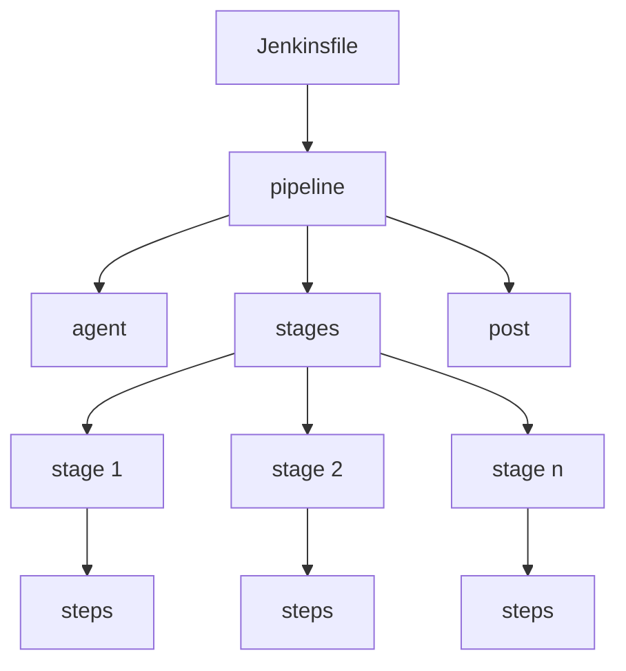

# How to Use Jenkins Declarative Pipelines

Author: [nawazdhandala](https://www.github.com/nawazdhandala)

Tags: Jenkins, CI/CD, Pipelines, DevOps, Automation

Description: Learn how to build, test, and deploy applications using Jenkins Declarative Pipelines with practical examples and best practices for CI/CD automation.

---

> Jenkins Declarative Pipelines offer a structured, readable way to define your entire build process as code. Instead of clicking through the UI or writing complex Groovy scripts, you get a clean syntax that's easy to version control and review.

If you've worked with Jenkins before, you know the old Freestyle jobs can become a mess of plugins and manual configurations. Declarative Pipelines fix that by putting everything in a single `Jenkinsfile` that lives in your repository alongside your code.

---

## What is a Declarative Pipeline?

A Declarative Pipeline is a simplified way to write Jenkins Pipeline code. It uses a predefined structure with specific blocks and sections that make your pipeline more readable and maintainable.

Here's a quick look at how Declarative and Scripted pipelines compare:

| Feature | Declarative Pipeline | Scripted Pipeline |
|---------|---------------------|-------------------|
| Syntax | Structured, predefined blocks | Full Groovy flexibility |
| Learning curve | Lower | Higher |
| Error handling | Built-in validation | Manual implementation |
| Readability | Better for teams | Can get complex |
| Flexibility | Some limitations | Unlimited |

---

## Pipeline Structure Overview

Before diving into code, let's understand the building blocks of a Declarative Pipeline.



The pipeline flows from top to bottom: define your agent (where it runs), specify stages (what to do), and handle post-build actions (cleanup, notifications).

---

## Your First Declarative Pipeline

Let's start with a minimal pipeline that builds and tests a Node.js application. Create a file called `Jenkinsfile` in your repository root.

This basic pipeline defines three stages: checkout, install dependencies, and run tests. The agent directive tells Jenkins to run on any available executor.

```groovy
// Jenkinsfile - Basic Node.js build pipeline
// This file should be placed in your repository root

pipeline {
    // Run on any available Jenkins agent
    agent any

    stages {
        // Stage 1: Get the source code
        stage('Checkout') {
            steps {
                // Checkout code from the configured SCM
                checkout scm
            }
        }

        // Stage 2: Install project dependencies
        stage('Install Dependencies') {
            steps {
                // Use sh for Linux/macOS, bat for Windows
                sh 'npm install'
            }
        }

        // Stage 3: Run the test suite
        stage('Test') {
            steps {
                sh 'npm test'
            }
        }
    }
}
```

---

## Agent Configuration

The `agent` directive controls where your pipeline runs. You have several options depending on your Jenkins setup.

This example shows different agent configurations, from running anywhere to targeting specific Docker containers or Kubernetes pods.

```groovy
pipeline {
    // Option 1: Run on any available agent
    agent any

    // Option 2: Run on a node with a specific label
    // agent { label 'linux' }

    // Option 3: Run inside a Docker container
    // agent {
    //     docker {
    //         image 'node:18-alpine'
    //         args '-v /tmp:/tmp'  // Mount volumes if needed
    //     }
    // }

    // Option 4: Run in a Kubernetes pod
    // agent {
    //     kubernetes {
    //         yaml '''
    //         apiVersion: v1
    //         kind: Pod
    //         spec:
    //           containers:
    //           - name: node
    //             image: node:18
    //             command:
    //             - cat
    //             tty: true
    //         '''
    //     }
    // }

    stages {
        stage('Build') {
            steps {
                sh 'node --version'
            }
        }
    }
}
```

You can also define different agents per stage if your build requires different environments for different tasks.

```groovy
pipeline {
    // No global agent - each stage specifies its own
    agent none

    stages {
        stage('Build Frontend') {
            // Frontend builds in Node container
            agent {
                docker { image 'node:18-alpine' }
            }
            steps {
                sh 'npm run build'
            }
        }

        stage('Build Backend') {
            // Backend builds in Go container
            agent {
                docker { image 'golang:1.21' }
            }
            steps {
                sh 'go build -o app .'
            }
        }
    }
}
```

---

## Environment Variables

Environment variables help you avoid hardcoding values and make pipelines more flexible. You can define them at the pipeline level or within specific stages.

This configuration shows how to set global and stage-specific environment variables, plus how to use Jenkins credentials securely.

```groovy
pipeline {
    agent any

    // Global environment variables - available in all stages
    environment {
        // Static values
        APP_NAME = 'my-application'
        DEPLOY_ENV = 'staging'

        // Read from Jenkins credentials (stored securely)
        // This creates USERNAME and PASSWORD variables from the credential
        DOCKER_CREDS = credentials('docker-hub-credentials')

        // API tokens or secrets (single value credential)
        API_KEY = credentials('api-key-credential')
    }

    stages {
        stage('Build') {
            // Stage-specific environment variables
            environment {
                BUILD_VERSION = "${env.BUILD_NUMBER}-${env.GIT_COMMIT?.take(7)}"
            }
            steps {
                // Access variables using either syntax
                echo "Building ${APP_NAME} version ${BUILD_VERSION}"
                echo "Build number: ${env.BUILD_NUMBER}"

                // Use credentials (masked in logs automatically)
                sh '''
                    echo "Logging into Docker Hub..."
                    echo $DOCKER_CREDS_PSW | docker login -u $DOCKER_CREDS_USR --password-stdin
                '''
            }
        }

        stage('Deploy') {
            steps {
                echo "Deploying to ${DEPLOY_ENV}"
            }
        }
    }
}
```

---

## Stages and Steps

Stages represent major phases of your pipeline. Each stage contains steps that do the actual work. Here's a complete build, test, and deploy pipeline.

This pipeline demonstrates a typical workflow with parallel test execution to speed up the feedback loop.

```groovy
pipeline {
    agent any

    environment {
        DOCKER_IMAGE = "myregistry/myapp"
        DOCKER_TAG = "${env.BUILD_NUMBER}"
    }

    stages {
        stage('Checkout') {
            steps {
                checkout scm
                // Store the commit hash for later use
                script {
                    env.GIT_COMMIT_SHORT = sh(
                        script: 'git rev-parse --short HEAD',
                        returnStdout: true
                    ).trim()
                }
            }
        }

        stage('Build') {
            steps {
                sh '''
                    echo "Building application..."
                    npm ci
                    npm run build
                '''
            }
        }

        // Run multiple test types in parallel
        stage('Test') {
            parallel {
                stage('Unit Tests') {
                    steps {
                        sh 'npm run test:unit'
                    }
                }
                stage('Integration Tests') {
                    steps {
                        sh 'npm run test:integration'
                    }
                }
                stage('Lint') {
                    steps {
                        sh 'npm run lint'
                    }
                }
            }
        }

        stage('Build Docker Image') {
            steps {
                sh """
                    docker build -t ${DOCKER_IMAGE}:${DOCKER_TAG} .
                    docker tag ${DOCKER_IMAGE}:${DOCKER_TAG} ${DOCKER_IMAGE}:latest
                """
            }
        }

        stage('Push to Registry') {
            steps {
                withCredentials([usernamePassword(
                    credentialsId: 'docker-registry',
                    usernameVariable: 'DOCKER_USER',
                    passwordVariable: 'DOCKER_PASS'
                )]) {
                    sh '''
                        echo $DOCKER_PASS | docker login -u $DOCKER_USER --password-stdin
                        docker push ${DOCKER_IMAGE}:${DOCKER_TAG}
                        docker push ${DOCKER_IMAGE}:latest
                    '''
                }
            }
        }
    }
}
```

---

## Conditional Execution with when

The `when` directive lets you skip stages based on conditions like branch name, environment variables, or custom expressions.

This example shows common patterns for conditional stage execution.

```groovy
pipeline {
    agent any

    parameters {
        booleanParam(name: 'SKIP_TESTS', defaultValue: false, description: 'Skip test stage')
        choice(name: 'ENVIRONMENT', choices: ['dev', 'staging', 'production'], description: 'Deployment environment')
    }

    stages {
        stage('Build') {
            steps {
                sh 'npm run build'
            }
        }

        stage('Test') {
            // Skip tests if parameter is set
            when {
                expression { params.SKIP_TESTS == false }
            }
            steps {
                sh 'npm test'
            }
        }

        stage('Deploy to Dev') {
            // Only run on develop branch
            when {
                branch 'develop'
            }
            steps {
                echo 'Deploying to development...'
            }
        }

        stage('Deploy to Staging') {
            // Run on main branch OR when staging is selected
            when {
                anyOf {
                    branch 'main'
                    expression { params.ENVIRONMENT == 'staging' }
                }
            }
            steps {
                echo 'Deploying to staging...'
            }
        }

        stage('Deploy to Production') {
            // Multiple conditions must all be true
            when {
                allOf {
                    branch 'main'
                    expression { params.ENVIRONMENT == 'production' }
                }
            }
            steps {
                // Add manual approval for production
                input message: 'Deploy to production?', ok: 'Deploy'
                echo 'Deploying to production...'
            }
        }
    }
}
```

---

## Post Actions

The `post` section runs after stages complete, regardless of success or failure. Use it for cleanup, notifications, and reporting.

This configuration demonstrates handling different build outcomes.

```groovy
pipeline {
    agent any

    stages {
        stage('Build') {
            steps {
                sh 'npm run build'
            }
        }

        stage('Test') {
            steps {
                sh 'npm test'
            }
        }
    }

    post {
        // Always runs, regardless of build result
        always {
            echo 'Pipeline completed'

            // Clean up workspace to save disk space
            cleanWs()

            // Archive test results if they exist
            junit allowEmptyResults: true, testResults: '**/test-results/*.xml'
        }

        // Runs only on successful builds
        success {
            echo 'Build succeeded!'

            // Send success notification to Slack
            // slackSend channel: '#builds', color: 'good', message: "Build ${env.BUILD_NUMBER} succeeded"
        }

        // Runs only on failed builds
        failure {
            echo 'Build failed!'

            // Send failure notification
            // slackSend channel: '#builds', color: 'danger', message: "Build ${env.BUILD_NUMBER} failed"

            // Could also send email
            // emailext subject: 'Build Failed', body: 'Check Jenkins', to: 'team@example.com'
        }

        // Runs when build status changes from last build
        changed {
            echo "Build status changed from ${currentBuild.previousBuild?.result} to ${currentBuild.result}"
        }

        // Runs when build is unstable (tests failed but build succeeded)
        unstable {
            echo 'Build is unstable - some tests may have failed'
        }
    }
}
```

---

## Working with Tools

Jenkins can manage tool installations automatically. Define which tools your pipeline needs in the `tools` directive.

This pipeline configures Node.js and Maven tools that Jenkins will install if they're not already available.

```groovy
pipeline {
    agent any

    // Automatically install and configure these tools
    tools {
        // Tool names must match those configured in Jenkins Global Tool Configuration
        nodejs 'NodeJS-18'
        maven 'Maven-3.9'
        jdk 'JDK-17'
    }

    stages {
        stage('Check Tools') {
            steps {
                sh '''
                    echo "Node version: $(node --version)"
                    echo "npm version: $(npm --version)"
                    echo "Maven version: $(mvn --version)"
                    echo "Java version: $(java --version)"
                '''
            }
        }

        stage('Build Frontend') {
            steps {
                dir('frontend') {
                    sh 'npm ci && npm run build'
                }
            }
        }

        stage('Build Backend') {
            steps {
                dir('backend') {
                    sh 'mvn clean package -DskipTests'
                }
            }
        }
    }
}
```

---

## Parameters and User Input

Make your pipelines interactive with parameters. Users can provide values when triggering builds manually.

This example shows different parameter types and how to use them.

```groovy
pipeline {
    agent any

    parameters {
        // Text input
        string(
            name: 'DEPLOY_VERSION',
            defaultValue: 'latest',
            description: 'Version tag to deploy'
        )

        // Dropdown selection
        choice(
            name: 'ENVIRONMENT',
            choices: ['development', 'staging', 'production'],
            description: 'Target environment'
        )

        // Checkbox
        booleanParam(
            name: 'RUN_INTEGRATION_TESTS',
            defaultValue: true,
            description: 'Run integration test suite'
        )

        // Multi-line text
        text(
            name: 'RELEASE_NOTES',
            defaultValue: '',
            description: 'Release notes for this deployment'
        )

        // Password (masked in logs)
        password(
            name: 'DEPLOY_TOKEN',
            defaultValue: '',
            description: 'Deployment authentication token'
        )
    }

    stages {
        stage('Validate') {
            steps {
                echo "Deploying version: ${params.DEPLOY_VERSION}"
                echo "Target environment: ${params.ENVIRONMENT}"
                echo "Run integration tests: ${params.RUN_INTEGRATION_TESTS}"

                // Abort if deploying to production without release notes
                script {
                    if (params.ENVIRONMENT == 'production' && params.RELEASE_NOTES.trim().isEmpty()) {
                        error('Release notes are required for production deployments')
                    }
                }
            }
        }

        stage('Test') {
            when {
                expression { params.RUN_INTEGRATION_TESTS == true }
            }
            steps {
                sh 'npm run test:integration'
            }
        }

        stage('Deploy') {
            steps {
                echo "Deploying to ${params.ENVIRONMENT}..."
                // Use the password parameter (will be masked in logs)
                sh "deploy.sh --token ${params.DEPLOY_TOKEN} --env ${params.ENVIRONMENT}"
            }
        }
    }
}
```

---

## Options and Build Configuration

The `options` directive configures build behavior like timeouts, retry logic, and build history.

```groovy
pipeline {
    agent any

    options {
        // Abort build if it runs longer than 30 minutes
        timeout(time: 30, unit: 'MINUTES')

        // Keep only last 10 builds to save disk space
        buildDiscarder(logRotator(numToKeepStr: '10'))

        // Prevent concurrent builds of the same pipeline
        disableConcurrentBuilds()

        // Add timestamps to console output
        timestamps()

        // Retry the entire pipeline up to 2 times on failure
        retry(2)

        // Skip default checkout - useful when you need custom checkout logic
        skipDefaultCheckout()
    }

    stages {
        stage('Checkout') {
            options {
                // Stage-specific timeout
                timeout(time: 5, unit: 'MINUTES')
            }
            steps {
                checkout scm
            }
        }

        stage('Build') {
            options {
                // Retry just this stage
                retry(3)
            }
            steps {
                sh 'npm run build'
            }
        }

        stage('Deploy') {
            options {
                // Lock a resource during deployment
                lock('deploy-lock')
            }
            steps {
                sh './deploy.sh'
            }
        }
    }
}
```

---

## Shared Libraries

For complex pipelines or shared functionality across multiple projects, use Shared Libraries. They let you write reusable code that any pipeline can import.

First, configure a Shared Library in Jenkins (Manage Jenkins > System > Global Pipeline Libraries). Then use it in your pipelines.

This shows how to import and use functions from a shared library.

```groovy
// Import the shared library configured in Jenkins
// 'my-shared-lib' is the library name, 'main' is the branch
@Library('my-shared-lib@main') _

pipeline {
    agent any

    stages {
        stage('Build') {
            steps {
                // Call a function from the shared library
                // This assumes vars/buildApp.groovy exists in the library
                buildApp(
                    language: 'nodejs',
                    version: '18'
                )
            }
        }

        stage('Deploy') {
            steps {
                // Another shared library function
                deployToKubernetes(
                    cluster: 'production',
                    namespace: 'myapp',
                    image: "myregistry/myapp:${env.BUILD_NUMBER}"
                )
            }
        }

        stage('Notify') {
            steps {
                // Shared notification helper
                notifySlack(
                    channel: '#deployments',
                    status: 'success'
                )
            }
        }
    }
}
```

---

## Complete Production Pipeline

Here's a comprehensive pipeline that puts everything together for a real-world application.

This production-ready pipeline includes all the components discussed: parameters, parallel stages, conditional execution, and proper error handling.

```groovy
// Production-grade CI/CD pipeline
// Handles build, test, security scanning, and deployment

@Library('shared-lib@main') _

pipeline {
    agent any

    options {
        timeout(time: 1, unit: 'HOURS')
        buildDiscarder(logRotator(numToKeepStr: '20'))
        disableConcurrentBuilds()
        timestamps()
    }

    parameters {
        choice(name: 'ENVIRONMENT', choices: ['dev', 'staging', 'production'], description: 'Deployment target')
        booleanParam(name: 'SKIP_TESTS', defaultValue: false, description: 'Skip test stage')
        booleanParam(name: 'FORCE_DEPLOY', defaultValue: false, description: 'Deploy even if tests fail')
    }

    environment {
        APP_NAME = 'myapp'
        DOCKER_REGISTRY = 'registry.example.com'
        DOCKER_IMAGE = "${DOCKER_REGISTRY}/${APP_NAME}"
        DOCKER_TAG = "${env.BUILD_NUMBER}-${env.GIT_COMMIT?.take(7) ?: 'unknown'}"
    }

    stages {
        stage('Checkout') {
            steps {
                checkout scm
                sh 'git log -1 --pretty=format:"%h - %s (%an)" > .git-info'
            }
        }

        stage('Install Dependencies') {
            steps {
                sh '''
                    npm ci --prefer-offline
                    npm audit --audit-level=high || true
                '''
            }
        }

        stage('Quality Gates') {
            when {
                expression { params.SKIP_TESTS == false }
            }
            parallel {
                stage('Unit Tests') {
                    steps {
                        sh 'npm run test:unit -- --coverage'
                    }
                    post {
                        always {
                            junit 'coverage/junit.xml'
                            publishHTML([
                                reportName: 'Coverage Report',
                                reportDir: 'coverage/lcov-report',
                                reportFiles: 'index.html'
                            ])
                        }
                    }
                }

                stage('Integration Tests') {
                    steps {
                        sh 'npm run test:integration'
                    }
                }

                stage('Lint & Security') {
                    steps {
                        sh '''
                            npm run lint
                            npm audit --audit-level=critical
                        '''
                    }
                }
            }
        }

        stage('Build Application') {
            steps {
                sh 'npm run build'
            }
        }

        stage('Build Docker Image') {
            steps {
                sh """
                    docker build \
                        --build-arg BUILD_NUMBER=${env.BUILD_NUMBER} \
                        --build-arg GIT_COMMIT=${env.GIT_COMMIT} \
                        -t ${DOCKER_IMAGE}:${DOCKER_TAG} \
                        -t ${DOCKER_IMAGE}:latest \
                        .
                """
            }
        }

        stage('Push to Registry') {
            steps {
                withCredentials([usernamePassword(
                    credentialsId: 'docker-registry-creds',
                    usernameVariable: 'DOCKER_USER',
                    passwordVariable: 'DOCKER_PASS'
                )]) {
                    sh '''
                        echo $DOCKER_PASS | docker login ${DOCKER_REGISTRY} -u $DOCKER_USER --password-stdin
                        docker push ${DOCKER_IMAGE}:${DOCKER_TAG}
                        docker push ${DOCKER_IMAGE}:latest
                    '''
                }
            }
        }

        stage('Deploy to Dev') {
            when {
                anyOf {
                    expression { params.ENVIRONMENT == 'dev' }
                    branch 'develop'
                }
            }
            steps {
                echo 'Deploying to development environment...'
                sh "./scripts/deploy.sh dev ${DOCKER_TAG}"
            }
        }

        stage('Deploy to Staging') {
            when {
                anyOf {
                    expression { params.ENVIRONMENT == 'staging' }
                    branch 'main'
                }
            }
            steps {
                echo 'Deploying to staging environment...'
                sh "./scripts/deploy.sh staging ${DOCKER_TAG}"
            }
        }

        stage('Deploy to Production') {
            when {
                allOf {
                    expression { params.ENVIRONMENT == 'production' }
                    branch 'main'
                }
            }
            steps {
                // Manual approval required for production
                input message: 'Deploy to production?', ok: 'Deploy', submitter: 'admin,release-team'

                echo 'Deploying to production environment...'
                sh "./scripts/deploy.sh production ${DOCKER_TAG}"
            }
        }
    }

    post {
        always {
            // Clean up Docker images to save disk space
            sh '''
                docker rmi ${DOCKER_IMAGE}:${DOCKER_TAG} || true
                docker rmi ${DOCKER_IMAGE}:latest || true
            '''

            // Archive build artifacts
            archiveArtifacts artifacts: 'dist/**/*', fingerprint: true, allowEmptyArchive: true

            cleanWs()
        }

        success {
            echo "Build ${env.BUILD_NUMBER} completed successfully"
            // slackSend channel: '#builds', color: 'good', message: "Build succeeded: ${env.JOB_NAME} #${env.BUILD_NUMBER}"
        }

        failure {
            echo "Build ${env.BUILD_NUMBER} failed"
            // slackSend channel: '#builds', color: 'danger', message: "Build failed: ${env.JOB_NAME} #${env.BUILD_NUMBER}"
        }
    }
}
```

---

## Best Practices

Here are some key practices to keep your pipelines maintainable:

1. **Keep Jenkinsfiles in source control** - Version your pipeline code alongside your application code

2. **Use shared libraries for common patterns** - Don't copy-paste the same code across repositories

3. **Fail fast** - Put quick checks (lint, unit tests) before slow ones (integration tests, deployments)

4. **Use meaningful stage names** - They appear in the Jenkins UI and help with debugging

5. **Handle secrets properly** - Always use Jenkins credentials, never hardcode sensitive values

6. **Set reasonable timeouts** - Prevent runaway builds from consuming resources

7. **Clean up after yourself** - Remove temporary files and Docker images in post actions

8. **Use parameters sparingly** - Too many parameters make pipelines confusing

---

## Troubleshooting Common Issues

When pipelines fail, check these common causes:

| Issue | Likely Cause | Solution |
|-------|--------------|----------|
| "Permission denied" | Script not executable | Add `chmod +x` or use `sh` directly |
| "Command not found" | Tool not in PATH | Use `tools` directive or full paths |
| Timeout errors | Stage taking too long | Increase timeout or optimize the step |
| Credential errors | Missing or wrong credential ID | Verify credential exists in Jenkins |
| Workspace conflicts | Concurrent builds | Use `disableConcurrentBuilds()` |

---

## Conclusion

Jenkins Declarative Pipelines give you a clean, structured way to define your CI/CD workflows as code. Start simple, add complexity as needed, and use shared libraries to keep things DRY across projects.

The key takeaways:

- Use the `pipeline` block to structure your Jenkinsfile
- Define stages for major workflow phases
- Leverage parallel execution to speed up builds
- Use `when` conditions to control stage execution
- Handle success and failure in `post` blocks
- Extract reusable logic into shared libraries

---

*Looking for a unified platform to monitor your CI/CD pipelines and application health? [OneUptime](https://oneuptime.com) provides comprehensive monitoring for Jenkins, GitLab CI, GitHub Actions, and more, so you can track build status, deployment health, and system uptime from a single dashboard.*
