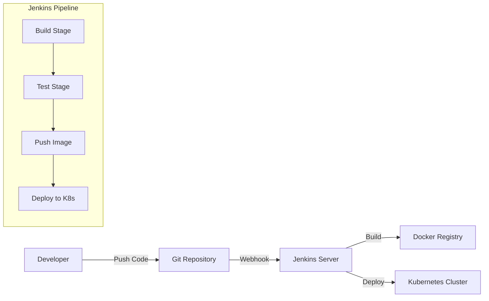
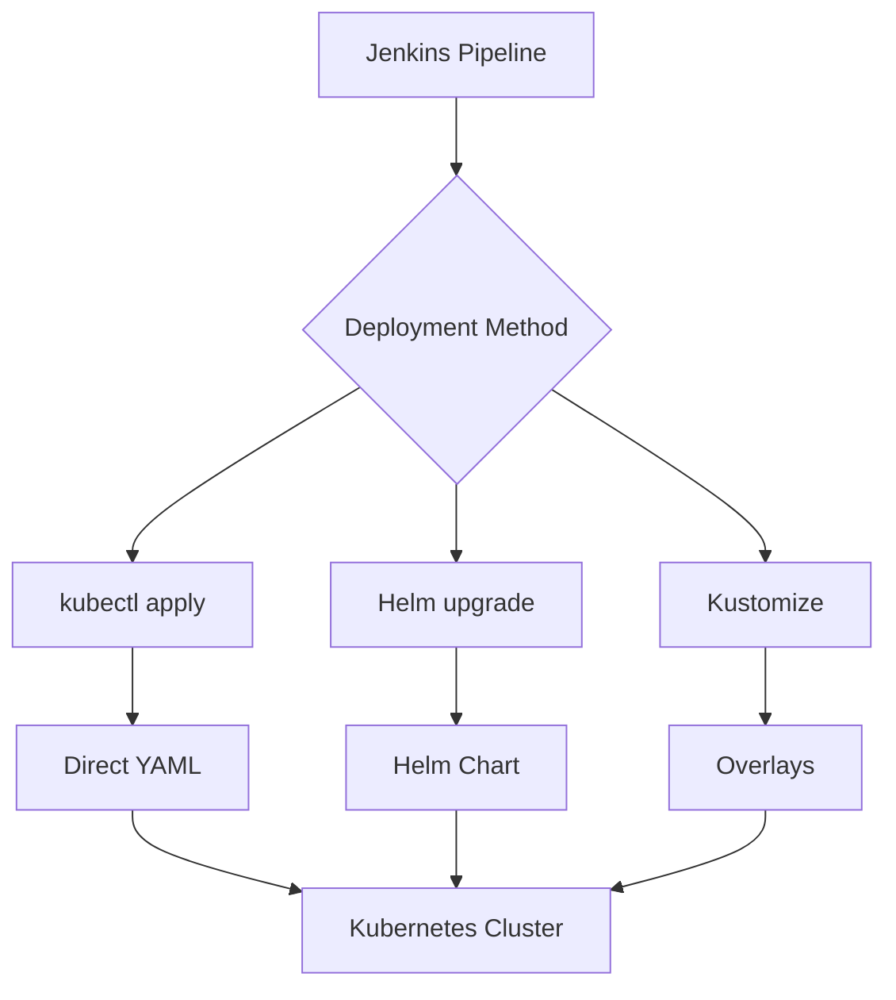
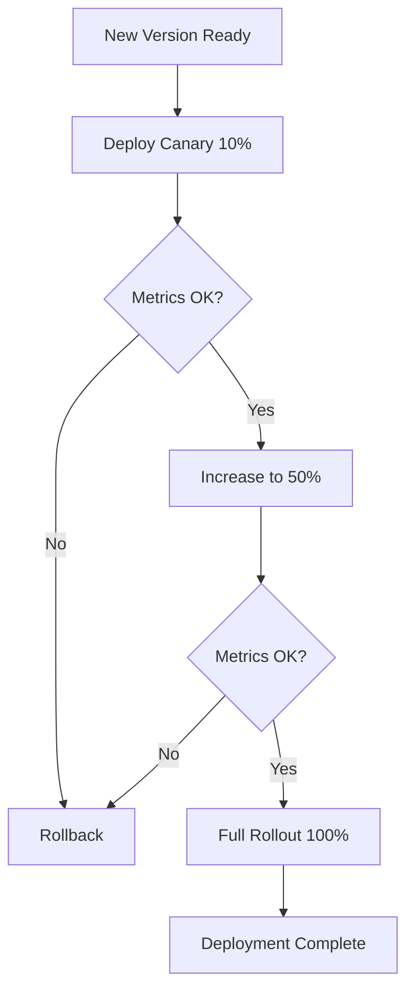
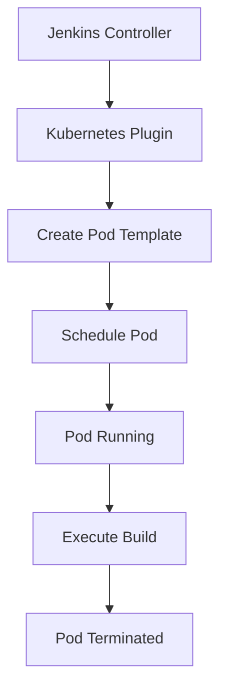

# How to Deploy to Kubernetes from Jenkins

Author: [nawazdhandala](https://www.github.com/nawazdhandala)

Tags: Jenkins, Kubernetes, CI/CD, DevOps, Docker, Automation, Deployment

Description: A complete guide to deploying applications to Kubernetes from Jenkins, covering pipeline configuration, kubectl integration, Helm deployments, rolling updates, and production best practices.

---

Jenkins remains one of the most widely adopted CI/CD tools in enterprise environments. Combining Jenkins with Kubernetes creates a powerful deployment pipeline that can handle everything from simple deployments to complex multi-environment rollouts.

## Architecture Overview

The deployment flow from Jenkins to Kubernetes involves several components working together.



## Prerequisites

Before setting up the deployment pipeline, ensure you have the following components ready:

- Jenkins server (2.400 or later recommended)
- Kubernetes cluster with kubectl access
- Docker registry (Docker Hub, ECR, GCR, or private registry)
- Git repository for your application code

## Installing Required Jenkins Plugins

Jenkins needs specific plugins to interact with Kubernetes and Docker. Install these plugins through the Jenkins UI or using the Jenkins CLI.

Navigate to Manage Jenkins > Manage Plugins > Available and install:

```
Kubernetes Plugin
Kubernetes CLI Plugin
Docker Pipeline Plugin
Pipeline: Stage View Plugin
Git Plugin
Credentials Binding Plugin
```

Alternatively, use the Jenkins CLI to install plugins programmatically.

```bash
# Install plugins using Jenkins CLI
java -jar jenkins-cli.jar -s http://localhost:8080/ install-plugin kubernetes kubernetes-cli docker-workflow pipeline-stage-view git credentials-binding

# Restart Jenkins to activate plugins
java -jar jenkins-cli.jar -s http://localhost:8080/ safe-restart
```

## Configuring Kubernetes Credentials

Jenkins needs proper credentials to authenticate with your Kubernetes cluster. You can use kubeconfig files or service account tokens.

### Option 1: Using Kubeconfig File

Create a credentials entry in Jenkins using your kubeconfig file.

```groovy
// Navigate to: Manage Jenkins > Manage Credentials > System > Global credentials

// Add credentials:
// Kind: Secret file
// File: Upload your kubeconfig file
// ID: kubeconfig
// Description: Kubernetes cluster config
```

### Option 2: Using Service Account Token

Create a dedicated service account in Kubernetes for Jenkins deployments.

```yaml
# jenkins-sa.yaml
# Creates a service account with deployment permissions for Jenkins
apiVersion: v1
kind: ServiceAccount
metadata:
  name: jenkins-deployer
  namespace: default
---
apiVersion: rbac.authorization.k8s.io/v1
kind: ClusterRole
metadata:
  name: jenkins-deployer-role
rules:
  - apiGroups: [""]
    resources: ["pods", "services", "configmaps", "secrets", "persistentvolumeclaims"]
    verbs: ["get", "list", "watch", "create", "update", "patch", "delete"]
  - apiGroups: ["apps"]
    resources: ["deployments", "replicasets", "statefulsets", "daemonsets"]
    verbs: ["get", "list", "watch", "create", "update", "patch", "delete"]
  - apiGroups: ["networking.k8s.io"]
    resources: ["ingresses"]
    verbs: ["get", "list", "watch", "create", "update", "patch", "delete"]
  - apiGroups: ["batch"]
    resources: ["jobs", "cronjobs"]
    verbs: ["get", "list", "watch", "create", "update", "patch", "delete"]
---
apiVersion: rbac.authorization.k8s.io/v1
kind: ClusterRoleBinding
metadata:
  name: jenkins-deployer-binding
roleRef:
  apiGroup: rbac.authorization.k8s.io
  kind: ClusterRole
  name: jenkins-deployer-role
subjects:
  - kind: ServiceAccount
    name: jenkins-deployer
    namespace: default
```

Apply the service account configuration and retrieve the token.

```bash
# Apply the service account configuration
kubectl apply -f jenkins-sa.yaml

# Create a token for the service account
kubectl create token jenkins-deployer --duration=8760h

# Get the cluster CA certificate
kubectl config view --raw -o jsonpath='{.clusters[0].cluster.certificate-authority-data}' | base64 -d > ca.crt
```

## Basic Jenkinsfile for Kubernetes Deployment

Here is a complete Jenkinsfile that builds, tests, pushes, and deploys an application to Kubernetes.

```groovy
// Jenkinsfile
// Complete CI/CD pipeline for Kubernetes deployment
pipeline {
    agent any

    environment {
        // Docker registry configuration
        DOCKER_REGISTRY = 'docker.io'
        DOCKER_IMAGE = 'myorg/myapp'
        DOCKER_CREDENTIALS = 'docker-hub-creds'

        // Kubernetes configuration
        KUBECONFIG_CREDENTIALS = 'kubeconfig'
        K8S_NAMESPACE = 'production'

        // Build configuration
        IMAGE_TAG = "${env.BUILD_NUMBER}-${env.GIT_COMMIT?.take(7) ?: 'latest'}"
    }

    stages {
        stage('Checkout') {
            steps {
                checkout scm
            }
        }

        stage('Build') {
            steps {
                script {
                    // Build the Docker image with build number tag
                    docker.build("${DOCKER_IMAGE}:${IMAGE_TAG}")
                }
            }
        }

        stage('Test') {
            steps {
                script {
                    // Run tests inside the container
                    docker.image("${DOCKER_IMAGE}:${IMAGE_TAG}").inside {
                        sh 'npm test'
                    }
                }
            }
        }

        stage('Push') {
            steps {
                script {
                    // Push image to Docker registry
                    docker.withRegistry("https://${DOCKER_REGISTRY}", DOCKER_CREDENTIALS) {
                        docker.image("${DOCKER_IMAGE}:${IMAGE_TAG}").push()
                        docker.image("${DOCKER_IMAGE}:${IMAGE_TAG}").push('latest')
                    }
                }
            }
        }

        stage('Deploy to Kubernetes') {
            steps {
                withCredentials([file(credentialsId: KUBECONFIG_CREDENTIALS, variable: 'KUBECONFIG')]) {
                    script {
                        // Update deployment with new image
                        sh """
                            kubectl set image deployment/myapp \
                                myapp=${DOCKER_REGISTRY}/${DOCKER_IMAGE}:${IMAGE_TAG} \
                                -n ${K8S_NAMESPACE}

                            # Wait for rollout to complete
                            kubectl rollout status deployment/myapp \
                                -n ${K8S_NAMESPACE} \
                                --timeout=300s
                        """
                    }
                }
            }
        }
    }

    post {
        success {
            echo "Deployment successful! Image: ${DOCKER_IMAGE}:${IMAGE_TAG}"
        }
        failure {
            echo "Deployment failed. Check the logs for details."
        }
    }
}
```

## Deploying with Kubernetes Manifests

For more control over deployments, maintain Kubernetes manifests in your repository and apply them directly.

The following deployment manifest defines a complete application with resource limits and health checks.

```yaml
# k8s/deployment.yaml
# Production deployment configuration with rolling update strategy
apiVersion: apps/v1
kind: Deployment
metadata:
  name: myapp
  labels:
    app: myapp
spec:
  replicas: 3
  selector:
    matchLabels:
      app: myapp
  strategy:
    type: RollingUpdate
    rollingUpdate:
      maxSurge: 1
      maxUnavailable: 0
  template:
    metadata:
      labels:
        app: myapp
    spec:
      containers:
        - name: myapp
          image: IMAGE_PLACEHOLDER
          ports:
            - containerPort: 8080
          resources:
            requests:
              memory: "256Mi"
              cpu: "250m"
            limits:
              memory: "512Mi"
              cpu: "500m"
          livenessProbe:
            httpGet:
              path: /health
              port: 8080
            initialDelaySeconds: 30
            periodSeconds: 10
          readinessProbe:
            httpGet:
              path: /ready
              port: 8080
            initialDelaySeconds: 5
            periodSeconds: 5
---
apiVersion: v1
kind: Service
metadata:
  name: myapp
spec:
  selector:
    app: myapp
  ports:
    - port: 80
      targetPort: 8080
  type: ClusterIP
```

Update your Jenkinsfile to use manifest-based deployments.

```groovy
// Jenkinsfile stage for manifest-based deployment
// Replaces the image placeholder and applies the manifest
stage('Deploy with Manifests') {
    steps {
        withCredentials([file(credentialsId: 'kubeconfig', variable: 'KUBECONFIG')]) {
            script {
                // Replace image placeholder with actual image tag
                sh """
                    sed -i 's|IMAGE_PLACEHOLDER|${DOCKER_REGISTRY}/${DOCKER_IMAGE}:${IMAGE_TAG}|g' k8s/deployment.yaml

                    # Apply the manifests
                    kubectl apply -f k8s/deployment.yaml -n ${K8S_NAMESPACE}

                    # Wait for rollout
                    kubectl rollout status deployment/myapp -n ${K8S_NAMESPACE} --timeout=300s
                """
            }
        }
    }
}
```

## Deploying with Helm Charts

Helm provides templating and release management capabilities that simplify complex deployments. Here is how to integrate Helm with Jenkins.



Create a Helm values file for your application.

```yaml
# helm/values.yaml
# Helm chart values for production deployment
replicaCount: 3

image:
  repository: myorg/myapp
  tag: latest
  pullPolicy: Always

service:
  type: ClusterIP
  port: 80

ingress:
  enabled: true
  className: nginx
  hosts:
    - host: myapp.example.com
      paths:
        - path: /
          pathType: Prefix

resources:
  limits:
    cpu: 500m
    memory: 512Mi
  requests:
    cpu: 250m
    memory: 256Mi

autoscaling:
  enabled: true
  minReplicas: 3
  maxReplicas: 10
  targetCPUUtilizationPercentage: 80
```

Add a Helm deployment stage to your Jenkinsfile.

```groovy
// Jenkinsfile stage for Helm deployment
// Uses Helm upgrade with install flag for idempotent deployments
stage('Deploy with Helm') {
    steps {
        withCredentials([file(credentialsId: 'kubeconfig', variable: 'KUBECONFIG')]) {
            script {
                sh """
                    # Add Helm repository if needed
                    helm repo add stable https://charts.helm.sh/stable
                    helm repo update

                    # Deploy using Helm
                    helm upgrade --install myapp ./helm/myapp \
                        --namespace ${K8S_NAMESPACE} \
                        --create-namespace \
                        --set image.repository=${DOCKER_REGISTRY}/${DOCKER_IMAGE} \
                        --set image.tag=${IMAGE_TAG} \
                        --values helm/values.yaml \
                        --wait \
                        --timeout 5m
                """
            }
        }
    }
}
```

## Multi-Environment Deployment Pipeline

Production deployments typically involve multiple environments. Here is a pipeline that handles dev, staging, and production deployments.

```groovy
// Jenkinsfile
// Multi-environment deployment pipeline with approval gates
pipeline {
    agent any

    environment {
        DOCKER_REGISTRY = 'docker.io'
        DOCKER_IMAGE = 'myorg/myapp'
        IMAGE_TAG = "${env.BUILD_NUMBER}"
    }

    stages {
        stage('Build and Test') {
            steps {
                script {
                    docker.build("${DOCKER_IMAGE}:${IMAGE_TAG}")
                    docker.image("${DOCKER_IMAGE}:${IMAGE_TAG}").inside {
                        sh 'npm test'
                    }
                }
            }
        }

        stage('Push Image') {
            steps {
                script {
                    docker.withRegistry("https://${DOCKER_REGISTRY}", 'docker-creds') {
                        docker.image("${DOCKER_IMAGE}:${IMAGE_TAG}").push()
                    }
                }
            }
        }

        stage('Deploy to Development') {
            steps {
                deployToEnvironment('development', 'kubeconfig-dev')
            }
        }

        stage('Integration Tests') {
            steps {
                sh 'npm run test:integration -- --env=development'
            }
        }

        stage('Deploy to Staging') {
            steps {
                deployToEnvironment('staging', 'kubeconfig-staging')
            }
        }

        stage('Smoke Tests') {
            steps {
                sh 'npm run test:smoke -- --env=staging'
            }
        }

        stage('Approval for Production') {
            steps {
                input message: 'Deploy to production?', ok: 'Deploy'
            }
        }

        stage('Deploy to Production') {
            steps {
                deployToEnvironment('production', 'kubeconfig-prod')
            }
        }
    }
}

// Shared deployment function
// Handles deployment to any environment with consistent configuration
def deployToEnvironment(String environment, String kubeconfigCreds) {
    withCredentials([file(credentialsId: kubeconfigCreds, variable: 'KUBECONFIG')]) {
        sh """
            helm upgrade --install myapp ./helm/myapp \
                --namespace ${environment} \
                --create-namespace \
                --set image.repository=${DOCKER_REGISTRY}/${DOCKER_IMAGE} \
                --set image.tag=${IMAGE_TAG} \
                --values helm/values-${environment}.yaml \
                --wait \
                --timeout 5m
        """
    }
}
```

## Implementing Canary Deployments

Canary deployments allow you to roll out changes to a subset of users before full deployment. Here is how to implement canary releases with Jenkins and Kubernetes.



Create canary and stable deployments.

```yaml
# k8s/canary-deployment.yaml
# Canary deployment receives a percentage of traffic for testing
apiVersion: apps/v1
kind: Deployment
metadata:
  name: myapp-canary
  labels:
    app: myapp
    track: canary
spec:
  replicas: 1
  selector:
    matchLabels:
      app: myapp
      track: canary
  template:
    metadata:
      labels:
        app: myapp
        track: canary
    spec:
      containers:
        - name: myapp
          image: IMAGE_PLACEHOLDER
          ports:
            - containerPort: 8080
---
# Stable deployment handles production traffic
apiVersion: apps/v1
kind: Deployment
metadata:
  name: myapp-stable
  labels:
    app: myapp
    track: stable
spec:
  replicas: 9
  selector:
    matchLabels:
      app: myapp
      track: stable
  template:
    metadata:
      labels:
        app: myapp
        track: stable
    spec:
      containers:
        - name: myapp
          image: STABLE_IMAGE_PLACEHOLDER
          ports:
            - containerPort: 8080
---
# Service routes to both canary and stable pods
apiVersion: v1
kind: Service
metadata:
  name: myapp
spec:
  selector:
    app: myapp
  ports:
    - port: 80
      targetPort: 8080
```

Add canary deployment stages to your Jenkinsfile.

```groovy
// Jenkinsfile stages for canary deployment
// Gradually shifts traffic from stable to canary version
stage('Deploy Canary') {
    steps {
        withCredentials([file(credentialsId: 'kubeconfig', variable: 'KUBECONFIG')]) {
            script {
                // Deploy canary with new image
                sh """
                    kubectl set image deployment/myapp-canary \
                        myapp=${DOCKER_REGISTRY}/${DOCKER_IMAGE}:${IMAGE_TAG} \
                        -n production

                    kubectl rollout status deployment/myapp-canary \
                        -n production --timeout=300s
                """
            }
        }
    }
}

stage('Validate Canary') {
    steps {
        script {
            // Wait and check metrics
            sleep(time: 5, unit: 'MINUTES')

            // Check error rate from monitoring
            def errorRate = sh(
                script: '''
                    curl -s "http://prometheus:9090/api/v1/query?query=rate(http_requests_total{status=~'5..'}[5m])/rate(http_requests_total[5m])*100" | jq '.data.result[0].value[1]' | tr -d '"'
                ''',
                returnStdout: true
            ).trim().toFloat()

            if (errorRate > 1.0) {
                error("Canary error rate too high: ${errorRate}%")
            }

            echo "Canary validation passed. Error rate: ${errorRate}%"
        }
    }
}

stage('Promote to Stable') {
    steps {
        withCredentials([file(credentialsId: 'kubeconfig', variable: 'KUBECONFIG')]) {
            script {
                // Update stable deployment with canary image
                sh """
                    kubectl set image deployment/myapp-stable \
                        myapp=${DOCKER_REGISTRY}/${DOCKER_IMAGE}:${IMAGE_TAG} \
                        -n production

                    kubectl rollout status deployment/myapp-stable \
                        -n production --timeout=300s
                """
            }
        }
    }
}
```

## Blue-Green Deployments

Blue-green deployments maintain two identical production environments. Traffic switches from blue to green after successful deployment verification.

```yaml
# k8s/blue-green.yaml
# Blue deployment - current production version
apiVersion: apps/v1
kind: Deployment
metadata:
  name: myapp-blue
  labels:
    app: myapp
    version: blue
spec:
  replicas: 3
  selector:
    matchLabels:
      app: myapp
      version: blue
  template:
    metadata:
      labels:
        app: myapp
        version: blue
    spec:
      containers:
        - name: myapp
          image: myorg/myapp:blue-version
          ports:
            - containerPort: 8080
---
# Green deployment - new version for testing
apiVersion: apps/v1
kind: Deployment
metadata:
  name: myapp-green
  labels:
    app: myapp
    version: green
spec:
  replicas: 3
  selector:
    matchLabels:
      app: myapp
      version: green
  template:
    metadata:
      labels:
        app: myapp
        version: green
    spec:
      containers:
        - name: myapp
          image: myorg/myapp:green-version
          ports:
            - containerPort: 8080
---
# Service selector switches between blue and green
apiVersion: v1
kind: Service
metadata:
  name: myapp
spec:
  selector:
    app: myapp
    version: blue  # Change to 'green' to switch
  ports:
    - port: 80
      targetPort: 8080
```

Implement blue-green switching in Jenkins.

```groovy
// Jenkinsfile for blue-green deployment
// Determines active color and deploys to inactive environment
pipeline {
    agent any

    environment {
        DOCKER_IMAGE = 'myorg/myapp'
        IMAGE_TAG = "${env.BUILD_NUMBER}"
    }

    stages {
        stage('Determine Active Environment') {
            steps {
                withCredentials([file(credentialsId: 'kubeconfig', variable: 'KUBECONFIG')]) {
                    script {
                        // Get current active version
                        env.ACTIVE_VERSION = sh(
                            script: "kubectl get svc myapp -n production -o jsonpath='{.spec.selector.version}'",
                            returnStdout: true
                        ).trim()

                        // Set inactive version as deployment target
                        env.INACTIVE_VERSION = env.ACTIVE_VERSION == 'blue' ? 'green' : 'blue'

                        echo "Active: ${env.ACTIVE_VERSION}, Deploying to: ${env.INACTIVE_VERSION}"
                    }
                }
            }
        }

        stage('Deploy to Inactive') {
            steps {
                withCredentials([file(credentialsId: 'kubeconfig', variable: 'KUBECONFIG')]) {
                    script {
                        sh """
                            kubectl set image deployment/myapp-${INACTIVE_VERSION} \
                                myapp=${DOCKER_IMAGE}:${IMAGE_TAG} \
                                -n production

                            kubectl rollout status deployment/myapp-${INACTIVE_VERSION} \
                                -n production --timeout=300s
                        """
                    }
                }
            }
        }

        stage('Verify Inactive Environment') {
            steps {
                script {
                    // Run health checks against inactive environment
                    sh """
                        INACTIVE_POD=\$(kubectl get pods -n production -l version=${INACTIVE_VERSION} -o jsonpath='{.items[0].metadata.name}')
                        kubectl exec -n production \$INACTIVE_POD -- curl -s http://localhost:8080/health
                    """
                }
            }
        }

        stage('Switch Traffic') {
            steps {
                input message: "Switch traffic to ${env.INACTIVE_VERSION}?", ok: 'Switch'

                withCredentials([file(credentialsId: 'kubeconfig', variable: 'KUBECONFIG')]) {
                    script {
                        // Patch service to point to new version
                        sh """
                            kubectl patch svc myapp -n production \
                                -p '{"spec":{"selector":{"version":"${INACTIVE_VERSION}"}}}'
                        """

                        echo "Traffic switched to ${INACTIVE_VERSION}"
                    }
                }
            }
        }
    }

    post {
        failure {
            echo "Deployment failed. Active environment unchanged: ${env.ACTIVE_VERSION}"
        }
    }
}
```

## Rollback Strategies

Every deployment pipeline needs a robust rollback mechanism. Kubernetes provides built-in rollback capabilities that integrate well with Jenkins.

```groovy
// Jenkinsfile with rollback capability
// Includes automatic rollback on deployment failure
pipeline {
    agent any

    environment {
        DEPLOYMENT_NAME = 'myapp'
        NAMESPACE = 'production'
    }

    stages {
        stage('Store Current Revision') {
            steps {
                withCredentials([file(credentialsId: 'kubeconfig', variable: 'KUBECONFIG')]) {
                    script {
                        // Store current revision for potential rollback
                        env.PREVIOUS_REVISION = sh(
                            script: """
                                kubectl rollout history deployment/${DEPLOYMENT_NAME} \
                                    -n ${NAMESPACE} | tail -2 | head -1 | awk '{print \$1}'
                            """,
                            returnStdout: true
                        ).trim()

                        echo "Previous revision: ${env.PREVIOUS_REVISION}"
                    }
                }
            }
        }

        stage('Deploy') {
            steps {
                withCredentials([file(credentialsId: 'kubeconfig', variable: 'KUBECONFIG')]) {
                    script {
                        try {
                            sh """
                                kubectl set image deployment/${DEPLOYMENT_NAME} \
                                    ${DEPLOYMENT_NAME}=${DOCKER_IMAGE}:${IMAGE_TAG} \
                                    -n ${NAMESPACE}

                                kubectl rollout status deployment/${DEPLOYMENT_NAME} \
                                    -n ${NAMESPACE} --timeout=300s
                            """
                        } catch (Exception e) {
                            echo "Deployment failed, initiating rollback..."
                            rollbackDeployment()
                            throw e
                        }
                    }
                }
            }
        }

        stage('Health Check') {
            steps {
                script {
                    try {
                        // Verify deployment health
                        sh """
                            for i in {1..10}; do
                                HEALTHY=\$(kubectl get deployment/${DEPLOYMENT_NAME} \
                                    -n ${NAMESPACE} \
                                    -o jsonpath='{.status.availableReplicas}')
                                DESIRED=\$(kubectl get deployment/${DEPLOYMENT_NAME} \
                                    -n ${NAMESPACE} \
                                    -o jsonpath='{.spec.replicas}')

                                if [ "\$HEALTHY" = "\$DESIRED" ]; then
                                    echo "All replicas healthy"
                                    exit 0
                                fi

                                echo "Waiting for healthy replicas: \$HEALTHY/\$DESIRED"
                                sleep 10
                            done

                            echo "Health check timeout"
                            exit 1
                        """
                    } catch (Exception e) {
                        echo "Health check failed, initiating rollback..."
                        rollbackDeployment()
                        throw e
                    }
                }
            }
        }
    }
}

// Rollback function
// Reverts to previous deployment revision
def rollbackDeployment() {
    withCredentials([file(credentialsId: 'kubeconfig', variable: 'KUBECONFIG')]) {
        sh """
            kubectl rollout undo deployment/${DEPLOYMENT_NAME} -n ${NAMESPACE}
            kubectl rollout status deployment/${DEPLOYMENT_NAME} -n ${NAMESPACE} --timeout=300s
        """
    }

    echo "Rollback completed successfully"
}
```

## Dynamic Jenkins Agents on Kubernetes

Jenkins can dynamically provision build agents on Kubernetes, providing scalable and isolated build environments.



Configure the Kubernetes cloud in Jenkins.

```groovy
// Jenkins configuration as code for Kubernetes cloud
// Defines pod templates for different build types
jenkins:
  clouds:
    - kubernetes:
        name: "kubernetes"
        serverUrl: "https://kubernetes.default.svc"
        namespace: "jenkins"
        jenkinsUrl: "http://jenkins.jenkins.svc.cluster.local:8080"
        jenkinsTunnel: "jenkins-agent.jenkins.svc.cluster.local:50000"
        containerCapStr: "100"
        maxRequestsPerHostStr: "32"
        retentionTimeout: 5
        templates:
          - name: "default"
            label: "jenkins-agent"
            containers:
              - name: "jnlp"
                image: "jenkins/inbound-agent:latest"
                workingDir: "/home/jenkins/agent"
                ttyEnabled: true
                resourceRequestCpu: "500m"
                resourceRequestMemory: "512Mi"
                resourceLimitCpu: "1000m"
                resourceLimitMemory: "1024Mi"
```

Use the Kubernetes agent in your Jenkinsfile.

```groovy
// Jenkinsfile using Kubernetes agents
// Defines custom pod template with build tools
pipeline {
    agent {
        kubernetes {
            yaml '''
apiVersion: v1
kind: Pod
metadata:
  labels:
    jenkins: agent
spec:
  containers:
    - name: docker
      image: docker:24-dind
      securityContext:
        privileged: true
      volumeMounts:
        - name: docker-socket
          mountPath: /var/run/docker.sock
    - name: kubectl
      image: bitnami/kubectl:latest
      command:
        - cat
      tty: true
    - name: helm
      image: alpine/helm:latest
      command:
        - cat
      tty: true
    - name: node
      image: node:20-alpine
      command:
        - cat
      tty: true
  volumes:
    - name: docker-socket
      hostPath:
        path: /var/run/docker.sock
'''
        }
    }

    stages {
        stage('Build') {
            steps {
                container('node') {
                    sh 'npm ci'
                    sh 'npm run build'
                }
            }
        }

        stage('Test') {
            steps {
                container('node') {
                    sh 'npm test'
                }
            }
        }

        stage('Build Image') {
            steps {
                container('docker') {
                    sh 'docker build -t myapp:${BUILD_NUMBER} .'
                    sh 'docker push myapp:${BUILD_NUMBER}'
                }
            }
        }

        stage('Deploy') {
            steps {
                container('helm') {
                    sh '''
                        helm upgrade --install myapp ./chart \
                            --set image.tag=${BUILD_NUMBER} \
                            --namespace production
                    '''
                }
            }
        }
    }
}
```

## Secrets Management

Handling secrets securely in Jenkins pipelines requires careful consideration. Never hardcode secrets in Jenkinsfiles or commit them to version control.

```groovy
// Jenkinsfile with secure secrets handling
// Uses Jenkins credentials and Kubernetes secrets
pipeline {
    agent any

    environment {
        // Reference Jenkins credentials
        DOCKER_CREDS = credentials('docker-registry-creds')
        DB_PASSWORD = credentials('database-password')
    }

    stages {
        stage('Create Kubernetes Secret') {
            steps {
                withCredentials([
                    file(credentialsId: 'kubeconfig', variable: 'KUBECONFIG'),
                    usernamePassword(credentialsId: 'docker-registry-creds', usernameVariable: 'DOCKER_USER', passwordVariable: 'DOCKER_PASS')
                ]) {
                    script {
                        // Create or update Kubernetes secret
                        sh '''
                            kubectl create secret docker-registry regcred \
                                --docker-server=docker.io \
                                --docker-username=${DOCKER_USER} \
                                --docker-password=${DOCKER_PASS} \
                                --namespace=production \
                                --dry-run=client -o yaml | kubectl apply -f -
                        '''
                    }
                }
            }
        }

        stage('Create App Secrets') {
            steps {
                withCredentials([
                    file(credentialsId: 'kubeconfig', variable: 'KUBECONFIG'),
                    string(credentialsId: 'database-password', variable: 'DB_PASS'),
                    string(credentialsId: 'api-key', variable: 'API_KEY')
                ]) {
                    script {
                        // Create application secrets
                        sh '''
                            kubectl create secret generic myapp-secrets \
                                --from-literal=db-password=${DB_PASS} \
                                --from-literal=api-key=${API_KEY} \
                                --namespace=production \
                                --dry-run=client -o yaml | kubectl apply -f -
                        '''
                    }
                }
            }
        }
    }
}
```

## Monitoring Deployments

Integrate deployment monitoring into your pipeline to catch issues early.

```groovy
// Jenkinsfile with deployment monitoring
// Checks metrics after deployment to verify health
stage('Monitor Deployment') {
    steps {
        script {
            // Wait for initial metric collection
            sleep(time: 2, unit: 'MINUTES')

            // Query Prometheus for deployment metrics
            def metrics = sh(
                script: '''
                    curl -s "http://prometheus:9090/api/v1/query" \
                        --data-urlencode 'query=sum(rate(http_requests_total{app="myapp",status=~"5.."}[5m])) / sum(rate(http_requests_total{app="myapp"}[5m])) * 100' \
                        | jq -r '.data.result[0].value[1] // 0'
                ''',
                returnStdout: true
            ).trim()

            def errorRate = metrics.toFloat()

            if (errorRate > 1.0) {
                error("Error rate exceeded threshold: ${errorRate}%")
            }

            // Check pod restarts
            def restarts = sh(
                script: '''
                    kubectl get pods -n production -l app=myapp \
                        -o jsonpath='{.items[*].status.containerStatuses[*].restartCount}' \
                        | tr ' ' '\n' | awk '{sum+=$1} END {print sum}'
                ''',
                returnStdout: true
            ).trim().toInteger()

            if (restarts > 0) {
                echo "Warning: ${restarts} pod restarts detected"
            }

            echo "Deployment monitoring passed. Error rate: ${errorRate}%"
        }
    }
}
```

## Notifications and Alerts

Keep your team informed about deployment status with notifications.

```groovy
// Jenkinsfile with Slack notifications
// Sends deployment status to team channel
pipeline {
    agent any

    stages {
        stage('Deploy') {
            steps {
                // Deployment steps here
                echo "Deploying..."
            }
        }
    }

    post {
        success {
            slackSend(
                channel: '#deployments',
                color: 'good',
                message: """
                    :white_check_mark: Deployment Successful
                    *Application:* myapp
                    *Environment:* production
                    *Version:* ${IMAGE_TAG}
                    *Build:* <${BUILD_URL}|#${BUILD_NUMBER}>
                """
            )
        }

        failure {
            slackSend(
                channel: '#deployments',
                color: 'danger',
                message: """
                    :x: Deployment Failed
                    *Application:* myapp
                    *Environment:* production
                    *Version:* ${IMAGE_TAG}
                    *Build:* <${BUILD_URL}|#${BUILD_NUMBER}>
                    Please investigate immediately!
                """
            )
        }

        unstable {
            slackSend(
                channel: '#deployments',
                color: 'warning',
                message: """
                    :warning: Deployment Unstable
                    *Application:* myapp
                    *Environment:* production
                    Tests may have failed. Review results.
                """
            )
        }
    }
}
```

## Best Practices

### 1. Use Declarative Pipelines

Declarative pipelines are easier to read and maintain.

```groovy
// Prefer declarative syntax for clarity
pipeline {
    agent any
    stages {
        stage('Build') {
            steps {
                sh 'make build'
            }
        }
    }
}
```

### 2. Implement Proper Resource Limits

Always set resource requests and limits in your Kubernetes deployments.

```yaml
# Always specify resource constraints
resources:
  requests:
    memory: "256Mi"
    cpu: "250m"
  limits:
    memory: "512Mi"
    cpu: "500m"
```

### 3. Use Namespaces for Isolation

Deploy to separate namespaces for different environments.

```bash
# Create namespaces for each environment
kubectl create namespace development
kubectl create namespace staging
kubectl create namespace production
```

### 4. Store Configuration in Git

Keep all Kubernetes manifests and Helm charts in version control alongside your application code.

### 5. Implement Health Checks

Always include liveness and readiness probes in your deployments.

### 6. Use Image Tags, Not Latest

Never deploy the `latest` tag to production. Use specific version tags for reproducibility.

---

Deploying to Kubernetes from Jenkins combines the flexibility of Jenkins pipelines with the power of Kubernetes orchestration. Start with simple kubectl deployments, then graduate to Helm charts as your needs grow. Implement canary or blue-green strategies for safer releases. The key is to automate everything, from building to testing to deploying, while maintaining clear visibility into each stage of the process.

For monitoring your Jenkins and Kubernetes deployments, consider using [OneUptime](https://oneuptime.com/blog/post/nodejs-health-checks-kubernetes/view) to track application health and receive alerts when issues arise.
