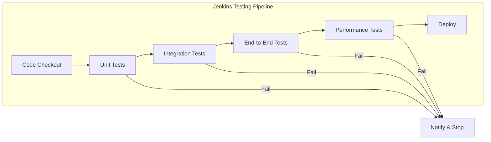
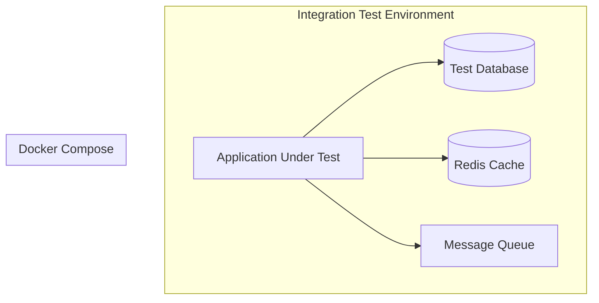
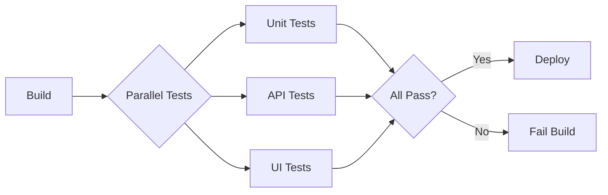
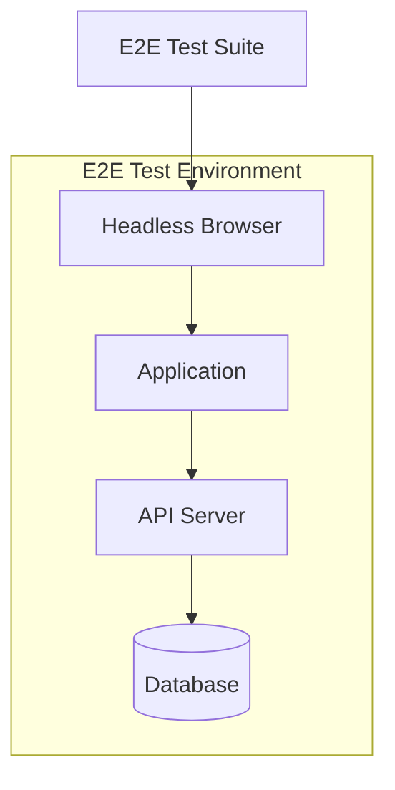

# How to Implement Testing in Jenkins Pipelines

Author: [nawazdhandala](https://www.github.com/nawazdhandala)

Tags: Jenkins, CI/CD, Testing, DevOps, Automation, Pipeline

Description: A practical guide to implementing comprehensive testing strategies in Jenkins pipelines, covering unit tests, integration tests, parallel execution, test reporting, and best practices for reliable continuous integration.

---

Testing is the backbone of any continuous integration pipeline. Jenkins pipelines provide powerful mechanisms to run tests at every stage of your software delivery process. Well-implemented tests catch bugs early, reduce deployment risks, and give teams confidence to ship faster.

## Testing Pipeline Architecture

A solid testing pipeline follows a clear progression from fast, isolated tests to slower, more comprehensive ones. Each stage acts as a quality gate that code must pass before moving forward.



## Setting Up Your First Testing Pipeline

The Jenkinsfile below demonstrates a basic pipeline structure with test stages. Notice how each stage builds upon the previous one.

```groovy
// Basic Jenkins pipeline with test stages
// Uses declarative syntax for better readability
pipeline {
    agent any

    // Define tools required for the build
    tools {
        maven 'Maven-3.9'
        jdk 'JDK-17'
    }

    // Pipeline options for timeout and build history
    options {
        timeout(time: 30, unit: 'MINUTES')
        buildDiscarder(logRotator(numToKeepStr: '10'))
        timestamps()
    }

    stages {
        stage('Checkout') {
            steps {
                checkout scm
            }
        }

        stage('Unit Tests') {
            steps {
                sh 'mvn test -Dtest=*UnitTest'
            }
            post {
                always {
                    // Publish test results regardless of outcome
                    junit '**/target/surefire-reports/*.xml'
                }
            }
        }

        stage('Integration Tests') {
            steps {
                sh 'mvn verify -Dtest=*IntegrationTest'
            }
            post {
                always {
                    junit '**/target/failsafe-reports/*.xml'
                }
            }
        }
    }
}
```

## Running Unit Tests Effectively

Unit tests should run first because they execute quickly and catch obvious issues. Setting up proper test isolation ensures consistent results.

The following configuration runs unit tests with coverage reporting using JaCoCo.

```groovy
// Unit test stage with code coverage
// JaCoCo generates coverage reports for analysis
stage('Unit Tests') {
    steps {
        sh '''
            mvn clean test \
                -Dmaven.test.failure.ignore=false \
                -Dskip.integration.tests=true \
                jacoco:report
        '''
    }
    post {
        always {
            // Collect test results
            junit testResults: '**/target/surefire-reports/*.xml',
                  allowEmptyResults: false

            // Publish code coverage
            jacoco(
                execPattern: '**/target/jacoco.exec',
                classPattern: '**/target/classes',
                sourcePattern: '**/src/main/java',
                exclusionPattern: '**/test/**'
            )
        }
        success {
            echo 'Unit tests passed successfully'
        }
        failure {
            echo 'Unit tests failed - check the report for details'
        }
    }
}
```

### Configuring Test Coverage Thresholds

Enforce minimum coverage requirements to maintain code quality. Failing builds that drop below thresholds prevents coverage from degrading over time.

```groovy
// Stage with coverage quality gates
// Build fails if coverage drops below specified thresholds
stage('Coverage Check') {
    steps {
        sh 'mvn verify'
    }
    post {
        always {
            jacoco(
                execPattern: '**/target/jacoco.exec',
                classPattern: '**/target/classes',
                sourcePattern: '**/src/main/java',
                minimumLineCoverage: '80',
                minimumBranchCoverage: '70',
                minimumMethodCoverage: '80',
                changeBuildStatus: true,
                maximumLineCoverage: '100',
                maximumBranchCoverage: '100'
            )
        }
    }
}
```

## Integration Testing Strategies

Integration tests verify that components work together correctly. Running them requires additional infrastructure like databases and message queues.



### Using Docker for Test Dependencies

Docker Compose provides isolated, reproducible test environments. The configuration below spins up services before running integration tests.

```groovy
// Integration tests using Docker Compose
// Services start before tests and stop after completion
stage('Integration Tests') {
    steps {
        script {
            // Start test infrastructure
            sh 'docker-compose -f docker-compose.test.yml up -d'

            // Wait for services to be healthy
            sh '''
                timeout 60 bash -c '
                    until docker-compose -f docker-compose.test.yml ps | grep -q "healthy"; do
                        echo "Waiting for services..."
                        sleep 5
                    done
                '
            '''

            // Run integration tests
            sh 'mvn verify -P integration-tests'
        }
    }
    post {
        always {
            // Always clean up containers
            sh 'docker-compose -f docker-compose.test.yml down -v'
            junit '**/target/failsafe-reports/*.xml'
        }
    }
}
```

### Docker Compose Configuration for Tests

A Docker Compose file defines the test infrastructure. Health checks ensure services are ready before tests begin.

```yaml
# docker-compose.test.yml
# Defines services required for integration testing
version: '3.8'

services:
  postgres:
    image: postgres:15-alpine
    environment:
      POSTGRES_DB: testdb
      POSTGRES_USER: testuser
      POSTGRES_PASSWORD: testpass
    ports:
      - "5432:5432"
    healthcheck:
      test: ["CMD-SHELL", "pg_isready -U testuser -d testdb"]
      interval: 5s
      timeout: 5s
      retries: 5

  redis:
    image: redis:7-alpine
    ports:
      - "6379:6379"
    healthcheck:
      test: ["CMD", "redis-cli", "ping"]
      interval: 5s
      timeout: 5s
      retries: 5

  rabbitmq:
    image: rabbitmq:3-management-alpine
    ports:
      - "5672:5672"
      - "15672:15672"
    healthcheck:
      test: ["CMD", "rabbitmqctl", "status"]
      interval: 10s
      timeout: 10s
      retries: 5
```

## Parallel Test Execution

Running tests in parallel dramatically reduces pipeline duration. Jenkins supports parallel stages out of the box.



The following pipeline runs multiple test suites simultaneously.

```groovy
// Parallel test execution reduces total pipeline time
// Each parallel branch runs independently on available agents
stage('Parallel Tests') {
    parallel {
        stage('Unit Tests') {
            agent { label 'linux' }
            steps {
                sh 'mvn test -Dtest=*UnitTest'
            }
            post {
                always {
                    junit '**/target/surefire-reports/*.xml'
                }
            }
        }

        stage('API Tests') {
            agent { label 'linux' }
            steps {
                sh 'mvn test -Dtest=*ApiTest'
            }
            post {
                always {
                    junit '**/target/surefire-reports/*.xml'
                }
            }
        }

        stage('Component Tests') {
            agent { label 'linux' }
            steps {
                sh 'mvn test -Dtest=*ComponentTest'
            }
            post {
                always {
                    junit '**/target/surefire-reports/*.xml'
                }
            }
        }
    }
}
```

### Distributing Tests Across Agents

For large test suites, distribute tests across multiple agents using parallel matrix builds.

```groovy
// Matrix builds distribute tests across multiple configurations
// Useful for cross-platform or parameterized testing
stage('Matrix Tests') {
    matrix {
        axes {
            axis {
                name 'JAVA_VERSION'
                values 'JDK-11', 'JDK-17', 'JDK-21'
            }
            axis {
                name 'OS'
                values 'linux', 'windows'
            }
        }

        // Exclude invalid combinations
        excludes {
            exclude {
                axis {
                    name 'JAVA_VERSION'
                    values 'JDK-21'
                }
                axis {
                    name 'OS'
                    values 'windows'
                }
            }
        }

        agent {
            label "${OS}"
        }

        tools {
            jdk "${JAVA_VERSION}"
        }

        stages {
            stage('Test') {
                steps {
                    sh 'mvn test'
                }
                post {
                    always {
                        junit '**/target/surefire-reports/*.xml'
                    }
                }
            }
        }
    }
}
```

## Test Reporting and Visualization

Clear test reports help teams quickly identify failures and track trends over time.

### Aggregating Test Results

Combine results from multiple test stages into a unified report.

```groovy
// Post-build actions collect all test results
// Reports aggregate data from all stages for analysis
pipeline {
    agent any

    stages {
        // ... test stages ...
    }

    post {
        always {
            // Aggregate all JUnit reports
            junit testResults: '**/target/*-reports/*.xml',
                  allowEmptyResults: true,
                  skipPublishingChecks: false

            // Archive test artifacts for debugging
            archiveArtifacts artifacts: '**/target/*-reports/**',
                             allowEmptyArchive: true

            // Publish HTML test reports
            publishHTML(target: [
                allowMissing: true,
                alwaysLinkToLastBuild: true,
                keepAll: true,
                reportDir: 'target/site/jacoco',
                reportFiles: 'index.html',
                reportName: 'Code Coverage Report'
            ])
        }
    }
}
```

### Generating Allure Reports

Allure provides rich, interactive test reports with history tracking.

```groovy
// Allure reporting stage for comprehensive test visualization
// Generates interactive reports with trends and history
stage('Generate Reports') {
    steps {
        sh 'mvn allure:report'
    }
    post {
        always {
            allure([
                includeProperties: false,
                jdk: '',
                properties: [],
                reportBuildPolicy: 'ALWAYS',
                results: [[path: 'target/allure-results']]
            ])
        }
    }
}
```

## Testing Node.js Applications

Node.js projects use npm or yarn to run tests. The pipeline structure remains similar but uses different commands.

```groovy
// Node.js testing pipeline with npm
// Includes linting, unit tests, and integration tests
pipeline {
    agent {
        docker {
            image 'node:20-alpine'
            args '-u root'
        }
    }

    environment {
        CI = 'true'
        npm_config_cache = "${WORKSPACE}/.npm"
    }

    stages {
        stage('Install Dependencies') {
            steps {
                sh 'npm ci'
            }
        }

        stage('Lint') {
            steps {
                sh 'npm run lint'
            }
        }

        stage('Unit Tests') {
            steps {
                sh 'npm run test:unit -- --coverage --ci'
            }
            post {
                always {
                    // Jest JUnit reporter output
                    junit 'junit.xml'

                    // Publish coverage
                    publishHTML(target: [
                        reportDir: 'coverage/lcov-report',
                        reportFiles: 'index.html',
                        reportName: 'Coverage Report'
                    ])
                }
            }
        }

        stage('Integration Tests') {
            steps {
                sh 'npm run test:integration'
            }
        }
    }
}
```

### Jest Configuration for Jenkins

Configure Jest to produce JUnit-compatible output for Jenkins integration.

```javascript
// jest.config.js
// Configuration for Jest test runner with Jenkins compatibility
module.exports = {
  testEnvironment: 'node',

  // Test patterns
  testMatch: [
    '**/__tests__/**/*.test.js',
    '**/*.spec.js'
  ],

  // Coverage configuration
  collectCoverage: true,
  coverageDirectory: 'coverage',
  coverageReporters: ['text', 'lcov', 'cobertura'],
  coverageThreshold: {
    global: {
      branches: 80,
      functions: 80,
      lines: 80,
      statements: 80
    }
  },

  // JUnit reporter for Jenkins
  reporters: [
    'default',
    ['jest-junit', {
      outputDirectory: '.',
      outputName: 'junit.xml',
      ancestorSeparator: ' > ',
      uniqueOutputName: false,
      suiteNameTemplate: '{filepath}',
      classNameTemplate: '{classname}',
      titleTemplate: '{title}'
    }]
  ]
};
```

## Testing Python Applications

Python projects commonly use pytest for testing. The following pipeline demonstrates a complete Python testing setup.

```groovy
// Python testing pipeline with pytest
// Includes virtual environment setup and coverage reporting
pipeline {
    agent {
        docker {
            image 'python:3.11-slim'
        }
    }

    environment {
        PYTHONDONTWRITEBYTECODE = '1'
        PYTHONUNBUFFERED = '1'
    }

    stages {
        stage('Setup') {
            steps {
                sh '''
                    python -m venv venv
                    . venv/bin/activate
                    pip install --upgrade pip
                    pip install -r requirements.txt
                    pip install -r requirements-dev.txt
                '''
            }
        }

        stage('Lint') {
            steps {
                sh '''
                    . venv/bin/activate
                    flake8 src tests
                    black --check src tests
                    mypy src
                '''
            }
        }

        stage('Unit Tests') {
            steps {
                sh '''
                    . venv/bin/activate
                    pytest tests/unit \
                        --junitxml=reports/unit-tests.xml \
                        --cov=src \
                        --cov-report=xml:reports/coverage.xml \
                        --cov-report=html:reports/coverage-html \
                        -v
                '''
            }
            post {
                always {
                    junit 'reports/unit-tests.xml'

                    // Cobertura coverage report
                    cobertura(
                        coberturaReportFile: 'reports/coverage.xml',
                        conditionalCoverageTargets: '70, 0, 0',
                        lineCoverageTargets: '80, 0, 0',
                        methodCoverageTargets: '80, 0, 0'
                    )
                }
            }
        }

        stage('Integration Tests') {
            steps {
                sh '''
                    . venv/bin/activate
                    pytest tests/integration \
                        --junitxml=reports/integration-tests.xml \
                        -v
                '''
            }
            post {
                always {
                    junit 'reports/integration-tests.xml'
                }
            }
        }
    }
}
```

## End-to-End Testing

E2E tests validate the entire application flow from a user's perspective. Running them requires a complete application stack.



### Selenium Tests in Jenkins

Configure Jenkins to run Selenium tests with a headless browser.

```groovy
// E2E testing stage with Selenium
// Uses Selenium Grid for parallel browser testing
stage('E2E Tests') {
    agent {
        docker {
            image 'selenium/standalone-chrome:latest'
            args '--shm-size=2g'
        }
    }

    environment {
        SELENIUM_REMOTE_URL = 'http://localhost:4444/wd/hub'
        BASE_URL = 'http://app:8080'
    }

    steps {
        sh '''
            # Wait for application to be ready
            timeout 120 bash -c '
                until curl -s ${BASE_URL}/health | grep -q "ok"; do
                    echo "Waiting for app..."
                    sleep 5
                done
            '

            # Run E2E tests
            mvn test -P e2e-tests \
                -Dselenium.remote.url=${SELENIUM_REMOTE_URL} \
                -Dbase.url=${BASE_URL}
        '''
    }
    post {
        always {
            junit '**/target/surefire-reports/*.xml'

            // Archive screenshots on failure
            archiveArtifacts artifacts: '**/screenshots/**',
                             allowEmptyArchive: true
        }
    }
}
```

### Playwright for Modern E2E Testing

Playwright offers better performance and reliability than Selenium for modern web applications.

```groovy
// Playwright E2E tests
// Includes trace recording for debugging failures
stage('Playwright Tests') {
    agent {
        docker {
            image 'mcr.microsoft.com/playwright:v1.40.0-jammy'
            args '--ipc=host'
        }
    }

    steps {
        sh '''
            npm ci
            npx playwright install --with-deps
            npx playwright test --reporter=junit
        '''
    }
    post {
        always {
            junit 'test-results/results.xml'

            // Archive Playwright traces and screenshots
            archiveArtifacts artifacts: 'test-results/**',
                             allowEmptyArchive: true

            // Publish HTML report
            publishHTML(target: [
                reportDir: 'playwright-report',
                reportFiles: 'index.html',
                reportName: 'Playwright Report'
            ])
        }
    }
}
```

## Performance Testing

Performance tests prevent regressions in application speed and resource usage.

```groovy
// Performance testing with k6
// Runs load tests and publishes metrics
stage('Performance Tests') {
    agent {
        docker {
            image 'grafana/k6:latest'
        }
    }

    steps {
        sh '''
            k6 run \
                --out json=results.json \
                --summary-export=summary.json \
                tests/performance/load-test.js
        '''
    }
    post {
        always {
            // Archive performance results
            archiveArtifacts artifacts: '*.json',
                             allowEmptyArchive: true

            // Parse and check thresholds
            script {
                def summary = readJSON file: 'summary.json'
                def p95 = summary.metrics.http_req_duration.p95

                if (p95 > 500) {
                    unstable("P95 response time ${p95}ms exceeds 500ms threshold")
                }
            }
        }
    }
}
```

### k6 Load Test Script

A sample k6 script defines the load test scenario and thresholds.

```javascript
// tests/performance/load-test.js
// k6 load test with ramp-up pattern and thresholds
import http from 'k6/http';
import { check, sleep } from 'k6';

// Test configuration
export const options = {
  stages: [
    { duration: '1m', target: 20 },   // Ramp up to 20 users
    { duration: '3m', target: 20 },   // Stay at 20 users
    { duration: '1m', target: 50 },   // Ramp up to 50 users
    { duration: '3m', target: 50 },   // Stay at 50 users
    { duration: '1m', target: 0 },    // Ramp down
  ],
  thresholds: {
    http_req_duration: ['p(95)<500'],  // 95% of requests under 500ms
    http_req_failed: ['rate<0.01'],    // Less than 1% failures
  },
};

// Test scenario
export default function () {
  const res = http.get(`${__ENV.BASE_URL}/api/health`);

  check(res, {
    'status is 200': (r) => r.status === 200,
    'response time < 200ms': (r) => r.timings.duration < 200,
  });

  sleep(1);
}
```

## Handling Test Failures

Proper failure handling helps teams diagnose issues quickly and prevents pipeline blockages.

```groovy
// Comprehensive failure handling with notifications
// Collects diagnostics and sends alerts on failure
pipeline {
    agent any

    options {
        timeout(time: 1, unit: 'HOURS')
    }

    stages {
        stage('Test') {
            steps {
                sh 'mvn test'
            }
        }
    }

    post {
        always {
            junit '**/target/surefire-reports/*.xml'
        }

        failure {
            // Collect diagnostic information
            sh '''
                echo "=== Build Environment ===" > diagnostics.txt
                env >> diagnostics.txt
                echo "=== Disk Space ===" >> diagnostics.txt
                df -h >> diagnostics.txt
                echo "=== Memory ===" >> diagnostics.txt
                free -m >> diagnostics.txt
            '''

            archiveArtifacts artifacts: 'diagnostics.txt',
                             allowEmptyArchive: true

            // Send notification
            emailext(
                subject: "Build Failed: ${env.JOB_NAME} #${env.BUILD_NUMBER}",
                body: '''
                    Build ${BUILD_URL} has failed.

                    Check the test results: ${BUILD_URL}testReport/
                ''',
                recipientProviders: [
                    [$class: 'DevelopersRecipientProvider'],
                    [$class: 'RequesterRecipientProvider']
                ]
            )

            // Slack notification
            slackSend(
                channel: '#ci-alerts',
                color: 'danger',
                message: "Build Failed: ${env.JOB_NAME} #${env.BUILD_NUMBER}\n${env.BUILD_URL}"
            )
        }

        unstable {
            slackSend(
                channel: '#ci-alerts',
                color: 'warning',
                message: "Build Unstable: ${env.JOB_NAME} #${env.BUILD_NUMBER}\n${env.BUILD_URL}"
            )
        }

        success {
            slackSend(
                channel: '#ci-builds',
                color: 'good',
                message: "Build Passed: ${env.JOB_NAME} #${env.BUILD_NUMBER}"
            )
        }
    }
}
```

### Retry Flaky Tests

Flaky tests undermine confidence in the pipeline. Use retry logic for known flaky tests while working to fix them.

```groovy
// Retry logic for flaky tests
// Retries up to 3 times before failing
stage('Flaky Integration Tests') {
    steps {
        retry(3) {
            timeout(time: 10, unit: 'MINUTES') {
                sh 'mvn verify -P integration-tests'
            }
        }
    }
}

// Alternative: Use Maven Surefire retry
stage('Tests with Retry') {
    steps {
        sh '''
            mvn test \
                -Dsurefire.rerunFailingTestsCount=2 \
                -Dfailsafe.rerunFailingTestsCount=2
        '''
    }
}
```

## Test Data Management

Managing test data properly ensures reliable and repeatable tests.

```groovy
// Test data setup and teardown
// Uses database migrations and fixtures
stage('Setup Test Data') {
    steps {
        sh '''
            # Reset test database
            psql -h localhost -U testuser -d testdb -f scripts/reset-db.sql

            # Run migrations
            flyway -url=jdbc:postgresql://localhost:5432/testdb \
                   -user=testuser \
                   -password=testpass \
                   migrate

            # Load fixtures
            psql -h localhost -U testuser -d testdb -f fixtures/test-data.sql
        '''
    }
}
```

### Using Testcontainers

Testcontainers provides programmatic control over test infrastructure.

```java
// TestContainers example for database tests
// Automatically provisions PostgreSQL for each test class
@Testcontainers
class DatabaseIntegrationTest {

    @Container
    static PostgreSQLContainer<?> postgres = new PostgreSQLContainer<>("postgres:15")
            .withDatabaseName("testdb")
            .withUsername("test")
            .withPassword("test")
            .withInitScript("init.sql");

    @DynamicPropertySource
    static void configureProperties(DynamicPropertyRegistry registry) {
        registry.add("spring.datasource.url", postgres::getJdbcUrl);
        registry.add("spring.datasource.username", postgres::getUsername);
        registry.add("spring.datasource.password", postgres::getPassword);
    }

    @Test
    void testDatabaseOperation() {
        // Test runs against fresh PostgreSQL container
    }
}
```

## Security Testing Integration

Include security tests in your pipeline to catch vulnerabilities early.

```groovy
// Security testing stage
// Runs dependency check and SAST tools
stage('Security Scan') {
    parallel {
        stage('Dependency Check') {
            steps {
                sh 'mvn dependency-check:check'
            }
            post {
                always {
                    dependencyCheckPublisher pattern: 'target/dependency-check-report.xml'
                }
            }
        }

        stage('SAST') {
            steps {
                sh 'semgrep scan --config auto --json -o semgrep-results.json src/'
            }
            post {
                always {
                    archiveArtifacts artifacts: 'semgrep-results.json',
                                     allowEmptyArchive: true
                }
            }
        }

        stage('Secret Scan') {
            steps {
                sh 'trufflehog filesystem --json . > secrets-scan.json'
            }
            post {
                always {
                    archiveArtifacts artifacts: 'secrets-scan.json',
                                     allowEmptyArchive: true
                }
            }
        }
    }
}
```

## Complete Pipeline Example

Here is a full pipeline that incorporates all the testing best practices covered above.

```groovy
// Complete Jenkins testing pipeline
// Demonstrates a production-ready CI configuration
pipeline {
    agent any

    tools {
        maven 'Maven-3.9'
        jdk 'JDK-17'
    }

    environment {
        DOCKER_REGISTRY = 'registry.example.com'
        IMAGE_NAME = 'myapp'
    }

    options {
        timeout(time: 1, unit: 'HOURS')
        buildDiscarder(logRotator(numToKeepStr: '20'))
        timestamps()
        disableConcurrentBuilds()
    }

    stages {
        stage('Checkout') {
            steps {
                checkout scm
            }
        }

        stage('Build') {
            steps {
                sh 'mvn clean compile -DskipTests'
            }
        }

        stage('Unit Tests') {
            steps {
                sh 'mvn test jacoco:report'
            }
            post {
                always {
                    junit '**/target/surefire-reports/*.xml'
                    jacoco(
                        execPattern: '**/target/jacoco.exec',
                        minimumLineCoverage: '80'
                    )
                }
            }
        }

        stage('Integration Tests') {
            steps {
                script {
                    docker.image('docker/compose:latest').inside {
                        sh 'docker-compose -f docker-compose.test.yml up -d'
                        sh 'mvn verify -P integration-tests'
                    }
                }
            }
            post {
                always {
                    sh 'docker-compose -f docker-compose.test.yml down -v || true'
                    junit '**/target/failsafe-reports/*.xml'
                }
            }
        }

        stage('Security Scan') {
            steps {
                sh 'mvn dependency-check:check'
            }
            post {
                always {
                    dependencyCheckPublisher pattern: 'target/dependency-check-report.xml'
                }
            }
        }

        stage('Package') {
            when {
                branch 'main'
            }
            steps {
                sh 'mvn package -DskipTests'
                sh "docker build -t ${DOCKER_REGISTRY}/${IMAGE_NAME}:${BUILD_NUMBER} ."
            }
        }

        stage('E2E Tests') {
            when {
                branch 'main'
            }
            steps {
                sh '''
                    docker-compose -f docker-compose.e2e.yml up -d
                    npm run test:e2e
                '''
            }
            post {
                always {
                    sh 'docker-compose -f docker-compose.e2e.yml down -v || true'
                    junit 'e2e-results/*.xml'
                    publishHTML(target: [
                        reportDir: 'playwright-report',
                        reportFiles: 'index.html',
                        reportName: 'E2E Report'
                    ])
                }
            }
        }
    }

    post {
        always {
            cleanWs()
        }
        failure {
            emailext(
                subject: "Pipeline Failed: ${env.JOB_NAME} #${env.BUILD_NUMBER}",
                body: "Check ${env.BUILD_URL} for details",
                recipientProviders: [[$class: 'DevelopersRecipientProvider']]
            )
        }
    }
}
```

## Best Practices Summary

Following these practices will help you build reliable testing pipelines:

1. **Run fast tests first** - Unit tests before integration tests
2. **Fail fast** - Stop the pipeline on first failure
3. **Use parallelization** - Reduce total pipeline time
4. **Isolate test environments** - Use Docker for consistency
5. **Set coverage thresholds** - Prevent quality degradation
6. **Archive artifacts** - Keep test results and logs
7. **Handle flaky tests** - Retry or quarantine them
8. **Include security scans** - Catch vulnerabilities early
9. **Send notifications** - Alert teams on failures
10. **Clean up resources** - Remove containers and temporary files

---

A well-implemented testing pipeline becomes a trusted gatekeeper for your codebase. Teams can merge and deploy with confidence knowing that comprehensive automated checks have validated every change. Start with unit tests, add integration coverage, and gradually expand to E2E and performance testing as your pipeline matures.
