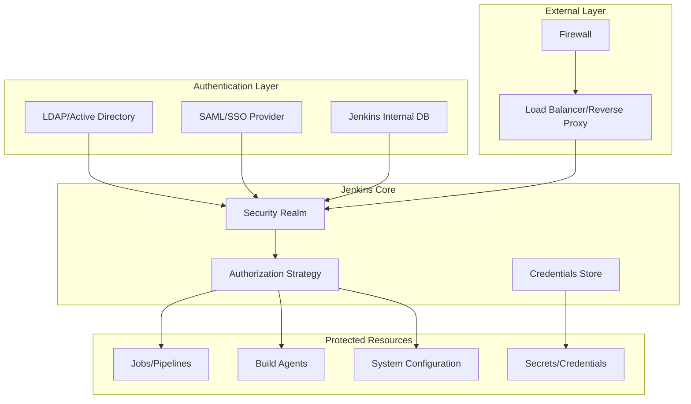
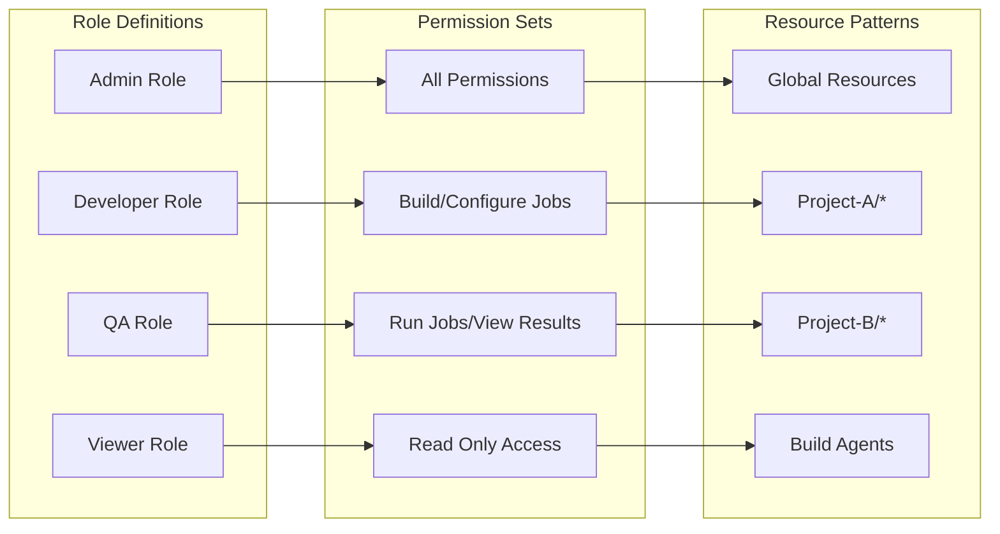
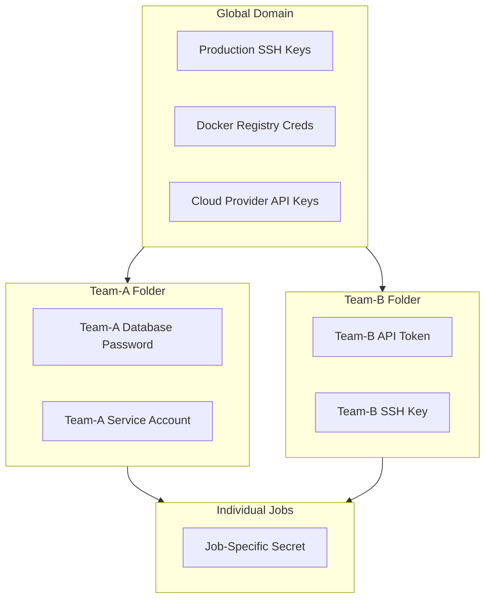

# How to Configure Jenkins Security

Author: [nawazdhandala](https://www.github.com/nawazdhandala)

Tags: Jenkins, Security, CI/CD, DevOps, Authentication, Authorization, RBAC, Secrets Management

Description: A comprehensive guide to securing your Jenkins installation covering authentication methods, authorization strategies, role-based access control, credentials management, and security best practices for production environments.

---

> Running Jenkins without proper security is like leaving your front door wide open. Your CI/CD pipeline has access to source code, deployment credentials, and production systems. A single misconfiguration can expose your entire infrastructure to attackers.

Jenkins powers millions of CI/CD pipelines worldwide. Its flexibility and extensive plugin ecosystem make it incredibly powerful, but also create a large attack surface. Securing Jenkins properly requires understanding authentication, authorization, secrets management, and network security.

---

## Jenkins Security Architecture

The security model in Jenkins operates across multiple layers. Understanding how these components interact helps you build a defense-in-depth strategy.



---

## Initial Security Setup

When installing Jenkins for the first time, always complete the setup wizard to enable security. Skipping the wizard leaves Jenkins in an insecure state with no authentication.

### Enable Security in Jenkins Configuration

Navigate to Manage Jenkins > Configure Global Security to access the main security settings. The security configuration file controls all authentication and authorization behavior.

```xml
<!-- $JENKINS_HOME/config.xml - Core security settings -->
<hudson>
  <!-- Enable security - must be true for production -->
  <useSecurity>true</useSecurity>

  <!-- Disable legacy CLI protocols which have known vulnerabilities -->
  <disabledAgentProtocols>
    <string>JNLP-connect</string>
    <string>JNLP2-connect</string>
    <string>JNLP3-connect</string>
  </disabledAgentProtocols>

  <!-- Disable CLI over remoting - security risk -->
  <enabledAgentProtocols>
    <string>JNLP4-connect</string>
    <string>Ping</string>
  </enabledAgentProtocols>

  <!-- Prevent anonymous read access -->
  <authorizationStrategy class="hudson.security.FullControlOnceLoggedInAuthorizationStrategy">
    <denyAnonymousReadAccess>true</denyAnonymousReadAccess>
  </authorizationStrategy>

  <!-- CSRF Protection - never disable in production -->
  <crumbIssuer class="hudson.security.csrf.DefaultCrumbIssuer">
    <excludeClientIPFromCrumb>false</excludeClientIPFromCrumb>
  </crumbIssuer>
</hudson>
```

### Security Hardening Script

Run the following Groovy script in Manage Jenkins > Script Console to apply recommended security settings programmatically. Each setting addresses a specific vulnerability or attack vector.

```groovy
// security-hardening.groovy
// Apply security best practices to Jenkins instance
import jenkins.model.*
import hudson.security.*
import jenkins.security.s2m.*

def instance = Jenkins.getInstance()

// Disable deprecated and insecure CLI protocols
// These protocols have known vulnerabilities and should never be enabled
def protocols = instance.getAgentProtocols()
protocols.removeAll { it.contains("JNLP-connect") || it.contains("JNLP2") || it.contains("JNLP3") }
instance.setAgentProtocols(protocols)

// Enable agent-to-controller access control
// Prevents build agents from accessing controller file system
def rule = instance.getInjector().getInstance(AdminWhitelistRule.class)
rule.setMasterKillSwitch(false)

// Disable CLI over remoting - modern Jenkins uses HTTP CLI
instance.getDescriptor("jenkins.CLI").get().setEnabled(false)

// Enable CSRF protection with crumb issuer
// Prevents cross-site request forgery attacks
def crumbIssuer = new DefaultCrumbIssuer(true)
instance.setCrumbIssuer(crumbIssuer)

// Disable remember me for stricter session management
instance.setDisableRememberMe(false) // Set to true for high-security environments

// Set markup formatter to plain text to prevent XSS
instance.setMarkupFormatter(new hudson.markup.EscapedMarkupFormatter())

// Apply and save changes
instance.save()
println "Security hardening complete"
```

---

## Authentication Configuration

Authentication verifies user identity before granting access to Jenkins. Multiple security realms are available depending on your organization's identity management infrastructure.

### LDAP Authentication

LDAP integration enables centralized user management through Active Directory or OpenLDAP. Configure the LDAP server connection with proper search bases and group mappings.

```groovy
// configure-ldap.groovy
// Set up LDAP authentication for Jenkins
import jenkins.model.*
import hudson.security.*
import hudson.security.LDAPSecurityRealm
import jenkins.security.plugins.ldap.*

def instance = Jenkins.getInstance()

// LDAP configuration parameters
// Replace these values with your organization's LDAP settings
String ldapServer = 'ldaps://ldap.company.com:636'
String rootDN = 'dc=company,dc=com'
String userSearchBase = 'ou=Users'
String userSearchFilter = 'sAMAccountName={0}'
String groupSearchBase = 'ou=Groups'
String groupSearchFilter = '(member={0})'
String managerDN = 'cn=jenkins-bind,ou=Service Accounts,dc=company,dc=com'
String managerPassword = System.getenv('LDAP_BIND_PASSWORD')

// Create LDAP configuration with secure settings
def ldapConfig = new LDAPConfiguration(
    ldapServer,           // LDAP server URL (use ldaps:// for TLS)
    rootDN,               // Base DN for searches
    false,                // Inhibit root DN inference
    managerDN,            // Bind DN for LDAP queries
    Secret.fromString(managerPassword)  // Bind password (encrypted)
)

// Configure user and group search parameters
ldapConfig.setUserSearchBase(userSearchBase)
ldapConfig.setUserSearch(userSearchFilter)
ldapConfig.setGroupSearchBase(groupSearchBase)
ldapConfig.setGroupSearchFilter(groupSearchFilter)

// Create security realm with LDAP configuration
def configurations = [ldapConfig]
def ldapRealm = new LDAPSecurityRealm(
    configurations,
    false,                // Disable LDAP user caching for real-time updates
    new FromGroupSearchLDAPGroupMembershipStrategy(''),
    new AllowBlankIdResolver()  // Handle users without email
)

// Apply the security realm
instance.setSecurityRealm(ldapRealm)
instance.save()

println "LDAP authentication configured successfully"
```

### SAML Single Sign-On

SAML integration provides enterprise SSO capabilities with identity providers like Okta, Azure AD, or OneLogin. Install the SAML plugin first, then configure the identity provider metadata.

```groovy
// configure-saml.groovy
// Set up SAML SSO authentication for Jenkins
import jenkins.model.*
import org.jenkinsci.plugins.saml.*

def instance = Jenkins.getInstance()

// SAML configuration - values from your IdP metadata
String idpMetadataUrl = 'https://idp.company.com/app/metadata'
String displayNameAttribute = 'displayName'
String groupAttribute = 'groups'
String emailAttribute = 'email'
String usernameAttribute = 'nameID'

// Advanced SAML settings for security
String maximumAuthLifetime = '86400'  // 24 hours in seconds
String spEntityId = 'jenkins-prod'     // Service provider entity ID

// Create SAML security realm
// The IdP metadata URL is fetched automatically for certificate validation
def samlRealm = new SamlSecurityRealm(
    new IdpMetadataConfiguration(idpMetadataUrl),
    displayNameAttribute,
    groupAttribute,
    maximumAuthLifetime.toLong(),
    usernameAttribute,
    emailAttribute,
    null,                 // Custom logout URL (null uses IdP default)
    null,                 // Advanced configuration
    spEntityId,
    null                  // Encryption data
)

instance.setSecurityRealm(samlRealm)
instance.save()

println "SAML SSO configured successfully"
```

### Jenkins Internal User Database

For smaller deployments or development environments, the built-in user database provides simple user management without external dependencies.

```groovy
// configure-internal-auth.groovy
// Set up Jenkins internal user database
import jenkins.model.*
import hudson.security.*

def instance = Jenkins.getInstance()

// Create Hudson private security realm (internal database)
// Second parameter controls whether users can sign up themselves
def realm = new HudsonPrivateSecurityRealm(false)  // false = disable self-signup

// Create admin user programmatically
// Password should come from environment variable, not hardcoded
def adminPassword = System.getenv('JENKINS_ADMIN_PASSWORD')
if (adminPassword) {
    realm.createAccount('admin', adminPassword)
    println "Admin user created"
}

instance.setSecurityRealm(realm)
instance.save()
```

---

## Authorization Strategies

Authorization determines what authenticated users can do within Jenkins. Choose the right strategy based on your team size and security requirements.

### Role-Based Access Control (RBAC)

The Role-Based Strategy plugin provides fine-grained permission management. Define roles with specific permissions and assign users or groups to those roles.



Configure RBAC with the following Groovy script after installing the Role-based Authorization Strategy plugin.

```groovy
// configure-rbac.groovy
// Set up role-based access control for Jenkins
import jenkins.model.*
import com.michelin.cio.hudson.plugins.rolestrategy.*
import com.synopsys.arc.jenkins.plugins.rolestrategy.*
import hudson.security.*

def instance = Jenkins.getInstance()

// Define role types used in Jenkins RBAC
// Global roles apply to overall Jenkins permissions
// Project roles use regex patterns to match job names
enum RoleType {
    GLOBAL,
    PROJECT
}

// Permission sets for different role levels
// Each permission is a Hudson permission object
def adminPermissions = [
    "hudson.model.Hudson.Administer",
    "hudson.model.Hudson.Read",
    "hudson.model.Hudson.RunScripts",
    "hudson.model.Item.Build",
    "hudson.model.Item.Cancel",
    "hudson.model.Item.Configure",
    "hudson.model.Item.Create",
    "hudson.model.Item.Delete",
    "hudson.model.Item.Discover",
    "hudson.model.Item.Move",
    "hudson.model.Item.Read",
    "hudson.model.Item.Workspace",
    "hudson.model.Run.Delete",
    "hudson.model.Run.Replay",
    "hudson.model.Run.Update",
    "hudson.model.View.Configure",
    "hudson.model.View.Create",
    "hudson.model.View.Delete",
    "hudson.model.View.Read"
]

def developerPermissions = [
    "hudson.model.Hudson.Read",
    "hudson.model.Item.Build",
    "hudson.model.Item.Cancel",
    "hudson.model.Item.Configure",
    "hudson.model.Item.Create",
    "hudson.model.Item.Discover",
    "hudson.model.Item.Read",
    "hudson.model.Item.Workspace",
    "hudson.model.Run.Replay",
    "hudson.model.View.Read"
]

def viewerPermissions = [
    "hudson.model.Hudson.Read",
    "hudson.model.Item.Discover",
    "hudson.model.Item.Read",
    "hudson.model.View.Read"
]

// Create authorization strategy
def strategy = new RoleBasedAuthorizationStrategy()

// Create global roles
// Global roles determine base permissions for all of Jenkins
strategy.doAddRole(
    RoleBasedAuthorizationStrategy.GLOBAL,
    "admin",
    new PermissionsList(adminPermissions.collect { Permission.fromId(it) } as Set),
    "Admin users with full access",
    ".*"  // Pattern (not used for global roles)
)

strategy.doAddRole(
    RoleBasedAuthorizationStrategy.GLOBAL,
    "developer",
    new PermissionsList(developerPermissions.collect { Permission.fromId(it) } as Set),
    "Developers with build and configure access",
    ".*"
)

strategy.doAddRole(
    RoleBasedAuthorizationStrategy.GLOBAL,
    "viewer",
    new PermissionsList(viewerPermissions.collect { Permission.fromId(it) } as Set),
    "Read-only users",
    ".*"
)

// Create project-specific roles using regex patterns
// Pattern matches job names to restrict access by project
strategy.doAddRole(
    RoleBasedAuthorizationStrategy.PROJECT,
    "frontend-dev",
    new PermissionsList(developerPermissions.collect { Permission.fromId(it) } as Set),
    "Frontend team project access",
    "frontend-.*"  // Matches all jobs starting with "frontend-"
)

strategy.doAddRole(
    RoleBasedAuthorizationStrategy.PROJECT,
    "backend-dev",
    new PermissionsList(developerPermissions.collect { Permission.fromId(it) } as Set),
    "Backend team project access",
    "backend-.*"  // Matches all jobs starting with "backend-"
)

// Assign users and groups to roles
// Use group names from LDAP/SAML prefixed with role type
strategy.doAssignRole(RoleBasedAuthorizationStrategy.GLOBAL, "admin", "jenkins-admins")
strategy.doAssignRole(RoleBasedAuthorizationStrategy.GLOBAL, "developer", "developers")
strategy.doAssignRole(RoleBasedAuthorizationStrategy.GLOBAL, "viewer", "authenticated")

strategy.doAssignRole(RoleBasedAuthorizationStrategy.PROJECT, "frontend-dev", "frontend-team")
strategy.doAssignRole(RoleBasedAuthorizationStrategy.PROJECT, "backend-dev", "backend-team")

// Apply the authorization strategy
instance.setAuthorizationStrategy(strategy)
instance.save()

println "RBAC configuration complete"
```

### Matrix-Based Security

For simpler permission models, matrix-based security provides a grid of users/groups and their permissions.

```groovy
// configure-matrix-auth.groovy
// Set up project-matrix authorization for Jenkins
import jenkins.model.*
import hudson.security.*
import org.jenkinsci.plugins.matrixauth.*

def instance = Jenkins.getInstance()

// Create project matrix authorization strategy
// Each user/group can have different permissions per project
def strategy = new ProjectMatrixAuthorizationStrategy()

// Grant admin full permissions
def adminUser = 'admin'
[
    Jenkins.ADMINISTER,
    Jenkins.READ,
    Item.BUILD,
    Item.CANCEL,
    Item.CONFIGURE,
    Item.CREATE,
    Item.DELETE,
    Item.DISCOVER,
    Item.READ,
    Item.WORKSPACE,
    Run.DELETE,
    Run.UPDATE,
    View.CONFIGURE,
    View.CREATE,
    View.DELETE,
    View.READ
].each { permission ->
    strategy.add(permission, adminUser)
}

// Grant developers standard permissions
def developerGroup = 'developers'
[
    Jenkins.READ,
    Item.BUILD,
    Item.CANCEL,
    Item.CONFIGURE,
    Item.READ,
    Item.WORKSPACE,
    View.READ
].each { permission ->
    strategy.add(permission, developerGroup)
}

// Grant authenticated users read-only access
def authenticatedUsers = 'authenticated'
[
    Jenkins.READ,
    Item.DISCOVER,
    Item.READ,
    View.READ
].each { permission ->
    strategy.add(permission, authenticatedUsers)
}

instance.setAuthorizationStrategy(strategy)
instance.save()

println "Matrix authorization configured"
```

---

## Credentials Management

Credentials in Jenkins store sensitive data like passwords, API tokens, and SSH keys. Proper credential management prevents secret exposure in build logs and configuration files.

### Credential Provider Configuration

The credential hierarchy in Jenkins allows global, folder-level, and job-specific credentials. Use the most restrictive scope possible.



### Creating Credentials Programmatically

Use Groovy scripts to provision credentials during Jenkins initialization. Never store credentials in source control.

```groovy
// provision-credentials.groovy
// Create credentials from environment variables
import jenkins.model.*
import com.cloudbees.plugins.credentials.*
import com.cloudbees.plugins.credentials.domains.*
import com.cloudbees.plugins.credentials.impl.*
import com.cloudbees.jenkins.plugins.sshcredentials.impl.*
import hudson.util.Secret

def instance = Jenkins.getInstance()
def store = instance.getExtensionList(
    'com.cloudbees.plugins.credentials.SystemCredentialsProvider'
)[0].getStore()

// Define the global domain for credentials
def domain = Domain.global()

// Create username/password credential for Docker registry
// Credentials ID should be meaningful for pipeline references
def dockerCreds = new UsernamePasswordCredentialsImpl(
    CredentialsScope.GLOBAL,           // Available to all jobs
    'docker-registry',                  // Credential ID for pipeline use
    'Docker Registry Authentication',   // Description shown in UI
    System.getenv('DOCKER_USERNAME'),   // Username from environment
    System.getenv('DOCKER_PASSWORD')    // Password from environment
)
store.addCredentials(domain, dockerCreds)

// Create secret text credential for API tokens
def apiToken = new StringCredentialsImpl(
    CredentialsScope.GLOBAL,
    'github-token',
    'GitHub API Token for SCM operations',
    Secret.fromString(System.getenv('GITHUB_TOKEN'))
)
store.addCredentials(domain, apiToken)

// Create SSH key credential for deployment
// Read private key from file mounted as secret
def sshKeyFile = new File('/run/secrets/deploy-key')
if (sshKeyFile.exists()) {
    def sshKey = new BasicSSHUserPrivateKey(
        CredentialsScope.GLOBAL,
        'deploy-ssh-key',
        'deploy',                          // SSH username
        new BasicSSHUserPrivateKey.DirectEntryPrivateKeySource(
            sshKeyFile.text                // Private key content
        ),
        System.getenv('SSH_KEY_PASSPHRASE') ?: '',  // Passphrase if encrypted
        'SSH key for production deployment'
    )
    store.addCredentials(domain, sshKey)
}

// Create AWS credentials for cloud deployments
def awsCreds = new AWSCredentialsImpl(
    CredentialsScope.GLOBAL,
    'aws-prod',
    System.getenv('AWS_ACCESS_KEY_ID'),
    System.getenv('AWS_SECRET_ACCESS_KEY'),
    'AWS Production Account'
)
store.addCredentials(domain, awsCreds)

println "Credentials provisioned successfully"
```

### Folder-Level Credential Isolation

Restrict credential access to specific folders for multi-tenant Jenkins installations.

```groovy
// folder-credentials.groovy
// Create folder-scoped credentials for team isolation
import jenkins.model.*
import com.cloudbees.plugins.credentials.*
import com.cloudbees.plugins.credentials.domains.*
import com.cloudbees.plugins.credentials.impl.*
import com.cloudbees.hudson.plugins.folder.*
import com.cloudbees.hudson.plugins.folder.properties.*

def instance = Jenkins.getInstance()

// Get or create team folder
def folderName = 'team-payments'
def folder = instance.getItem(folderName) ?: instance.createProject(Folder.class, folderName)

// Get folder-level credential store
def folderStore = folder.getProperties().get(FolderCredentialsProvider.FolderCredentialsProperty.class)
if (!folderStore) {
    folderStore = new FolderCredentialsProvider.FolderCredentialsProperty([])
    folder.addProperty(folderStore)
}

// Create folder-scoped database credential
// Only jobs within this folder can access these credentials
def dbCreds = new UsernamePasswordCredentialsImpl(
    CredentialsScope.GLOBAL,
    'payments-db',
    'Payments Database Credentials',
    System.getenv('PAYMENTS_DB_USER'),
    System.getenv('PAYMENTS_DB_PASS')
)

folderStore.getStore().addCredentials(Domain.global(), dbCreds)
folder.save()

println "Folder credentials configured for ${folderName}"
```

---

## Pipeline Security

Pipelines have access to credentials and can execute arbitrary code. Implement guardrails to prevent credential leakage and unauthorized actions.

### Secure Pipeline Template

Follow security best practices in your Jenkinsfile to prevent credential exposure and limit attack surface.

```groovy
// Jenkinsfile
// Secure pipeline template with credential protection
pipeline {
    agent {
        // Use ephemeral containers to prevent credential persistence
        kubernetes {
            yaml '''
apiVersion: v1
kind: Pod
spec:
  containers:
  - name: build
    image: maven:3.9-eclipse-temurin-17
    command: ['sleep']
    args: ['infinity']
    securityContext:
      runAsNonRoot: true
      runAsUser: 1000
      readOnlyRootFilesystem: true
      allowPrivilegeEscalation: false
'''
        }
    }

    // Define build options including timeout and retry limits
    options {
        // Prevent builds from running indefinitely
        timeout(time: 30, unit: 'MINUTES')

        // Disable concurrent builds to prevent race conditions
        disableConcurrentBuilds()

        // Keep limited build history
        buildDiscarder(logRotator(numToKeepStr: '10'))

        // Prevent credential exposure in timestamps
        timestamps()
    }

    // Environment variables with credentials binding
    environment {
        // Bind credentials securely - masked in logs automatically
        DOCKER_CREDS = credentials('docker-registry')

        // Use secret text for API tokens
        GITHUB_TOKEN = credentials('github-token')
    }

    stages {
        stage('Checkout') {
            steps {
                // Use checkout step instead of sh git clone
                // Credentials are handled securely
                checkout scm
            }
        }

        stage('Build') {
            steps {
                container('build') {
                    // Run build with credentials available but masked
                    sh '''
                        # Credentials are available as environment variables
                        # DOCKER_CREDS_USR and DOCKER_CREDS_PSW for username/password

                        # Build without exposing credentials in commands
                        mvn clean package -DskipTests
                    '''
                }
            }
        }

        stage('Push Image') {
            steps {
                container('build') {
                    // Use withCredentials for explicit credential scope
                    // Credentials only available within this block
                    withCredentials([
                        usernamePassword(
                            credentialsId: 'docker-registry',
                            usernameVariable: 'REGISTRY_USER',
                            passwordVariable: 'REGISTRY_PASS'
                        )
                    ]) {
                        sh '''
                            # Login without exposing password in process list
                            echo "$REGISTRY_PASS" | docker login -u "$REGISTRY_USER" --password-stdin registry.example.com

                            docker push registry.example.com/app:${BUILD_NUMBER}

                            # Logout immediately after push
                            docker logout registry.example.com
                        '''
                    }
                }
            }
        }

        stage('Deploy') {
            // Require manual approval for production deployments
            when {
                branch 'main'
            }
            steps {
                // Input step with timeout for approval
                timeout(time: 15, unit: 'MINUTES') {
                    input message: 'Deploy to production?',
                          ok: 'Deploy',
                          submitter: 'deployers'  // Only deployers group can approve
                }

                // Use SSH agent for deployment credentials
                sshagent(credentials: ['deploy-ssh-key']) {
                    sh '''
                        ssh -o StrictHostKeyChecking=accept-new deploy@prod-server \
                            "kubectl set image deployment/app app=registry.example.com/app:${BUILD_NUMBER}"
                    '''
                }
            }
        }
    }

    post {
        always {
            // Clean workspace to remove any credential artifacts
            cleanWs()
        }
        failure {
            // Notify on failure without exposing build details
            emailext(
                subject: "Build Failed: ${env.JOB_NAME}",
                body: "Build ${env.BUILD_NUMBER} failed. Check Jenkins for details.",
                to: 'team@example.com'
            )
        }
    }
}
```

### Script Security and Sandboxing

Jenkins sandboxes Groovy scripts by default. Configure script approval carefully to balance security and functionality.

```groovy
// script-approval-config.groovy
// Configure script security settings
import jenkins.model.*
import org.jenkinsci.plugins.scriptsecurity.scripts.*

def instance = Jenkins.getInstance()
def scriptApproval = ScriptApproval.get()

// Pre-approve common safe method signatures
// Only approve methods that are genuinely needed and safe
def safeSignatures = [
    'method java.lang.String trim',
    'method java.lang.String split java.lang.String',
    'method java.lang.String toLowerCase',
    'method java.lang.String toUpperCase',
    'method java.util.List size',
    'method java.util.Map get java.lang.Object',
    'staticMethod java.lang.System getenv java.lang.String'
]

safeSignatures.each { signature ->
    scriptApproval.approveSignature(signature)
}

// Clear any dangerous pending approvals
// Review pending approvals manually before approving
def pendingApprovals = scriptApproval.getPendingScripts()
println "Pending script approvals: ${pendingApprovals.size()}"
pendingApprovals.each { script ->
    println "  - ${script.getHash()}: Review required"
}

scriptApproval.save()
println "Script security configured"
```

---

## Network Security

Secure network configuration prevents unauthorized access and protects data in transit.

### Reverse Proxy with TLS

Always run Jenkins behind a reverse proxy with TLS termination. Configure headers correctly for proper URL generation.

```nginx
# /etc/nginx/conf.d/jenkins.conf
# Nginx reverse proxy configuration for Jenkins

# Upstream Jenkins server
upstream jenkins {
    server 127.0.0.1:8080;
    keepalive 32;
}

# Redirect HTTP to HTTPS
server {
    listen 80;
    server_name jenkins.example.com;
    return 301 https://$server_name$request_uri;
}

# HTTPS server with security headers
server {
    listen 443 ssl http2;
    server_name jenkins.example.com;

    # TLS configuration
    ssl_certificate /etc/nginx/ssl/jenkins.crt;
    ssl_certificate_key /etc/nginx/ssl/jenkins.key;
    ssl_session_timeout 1d;
    ssl_session_cache shared:SSL:50m;
    ssl_session_tickets off;

    # Modern TLS configuration
    ssl_protocols TLSv1.2 TLSv1.3;
    ssl_ciphers ECDHE-ECDSA-AES128-GCM-SHA256:ECDHE-RSA-AES128-GCM-SHA256:ECDHE-ECDSA-AES256-GCM-SHA384:ECDHE-RSA-AES256-GCM-SHA384;
    ssl_prefer_server_ciphers off;

    # HSTS header for security
    add_header Strict-Transport-Security "max-age=63072000" always;

    # Security headers
    add_header X-Frame-Options "SAMEORIGIN" always;
    add_header X-Content-Type-Options "nosniff" always;
    add_header X-XSS-Protection "1; mode=block" always;
    add_header Referrer-Policy "strict-origin-when-cross-origin" always;

    # Jenkins proxy configuration
    location / {
        proxy_pass http://jenkins;

        # Required headers for Jenkins
        proxy_set_header Host $host;
        proxy_set_header X-Real-IP $remote_addr;
        proxy_set_header X-Forwarded-For $proxy_add_x_forwarded_for;
        proxy_set_header X-Forwarded-Proto $scheme;
        proxy_set_header X-Forwarded-Host $host;
        proxy_set_header X-Forwarded-Port $server_port;

        # WebSocket support for build console
        proxy_http_version 1.1;
        proxy_set_header Upgrade $http_upgrade;
        proxy_set_header Connection "upgrade";

        # Timeouts for long-running operations
        proxy_connect_timeout 150;
        proxy_send_timeout 100;
        proxy_read_timeout 100;

        # Buffer settings
        proxy_buffering off;
        proxy_request_buffering off;
    }

    # Rate limiting for authentication endpoints
    location /j_spring_security_check {
        limit_req zone=auth burst=5 nodelay;
        proxy_pass http://jenkins;
        include /etc/nginx/proxy_params;
    }
}
```

### Jenkins URL Configuration

Configure Jenkins to generate correct URLs when behind a proxy.

```groovy
// configure-url.groovy
// Set Jenkins URL for proper reverse proxy operation
import jenkins.model.*

def instance = Jenkins.getInstance()
def location = instance.getExtensionList(
    'jenkins.model.JenkinsLocationConfiguration'
)[0]

// Set the external URL users will access
location.setUrl('https://jenkins.example.com/')

// Set admin email for notifications
location.setAdminAddress('jenkins-admin@example.com')

location.save()
instance.save()

println "Jenkins URL configured: ${location.getUrl()}"
```

---

## Agent Security

Build agents execute untrusted code from repositories. Isolate agents properly to prevent lateral movement and credential theft.

### Agent-to-Controller Security

Enable agent-to-controller access control to prevent malicious builds from accessing the controller filesystem.

```groovy
// agent-security.groovy
// Configure agent-to-controller access control
import jenkins.model.*
import jenkins.security.s2m.*

def instance = Jenkins.getInstance()

// Get the admin whitelist rule configuration
def rule = instance.getInjector().getInstance(AdminWhitelistRule.class)

// Disable the master kill switch
// When enabled, agents cannot access files on the controller
rule.setMasterKillSwitch(false)

println "Agent-to-controller access control enabled"

// Configure file path rules to allow necessary operations
// Be restrictive - only whitelist what is absolutely needed
def filePathRules = '''
# Allow agents to read build workspace
allow read $JENKINS_HOME/jobs/.*/builds/.*/.*

# Allow artifact archiving
allow read,write $JENKINS_HOME/jobs/.*/builds/.*/archive/.*

# Deny everything else by default
deny all .*
'''

// Write rules to configuration
def rulesFile = new File(instance.getRootDir(), 'secrets/whitelisted-callables.d/custom.conf')
rulesFile.parentFile.mkdirs()
rulesFile.text = filePathRules

println "File path rules configured"
```

### Ephemeral Agent Configuration

Use ephemeral agents that are destroyed after each build to prevent credential persistence and cross-contamination.

```groovy
// kubernetes-agent-template.groovy
// Configure ephemeral Kubernetes agents
import jenkins.model.*
import org.csanchez.jenkins.plugins.kubernetes.*
import org.csanchez.jenkins.plugins.kubernetes.volumes.*

def instance = Jenkins.getInstance()

// Get Kubernetes cloud configuration
def cloud = instance.clouds.find { it instanceof KubernetesCloud }

if (cloud) {
    // Create secure pod template
    def podTemplate = new PodTemplate()
    podTemplate.setName('secure-agent')
    podTemplate.setNamespace('jenkins-agents')
    podTemplate.setLabel('secure')

    // Run as non-root user
    podTemplate.setRunAsUser('1000')
    podTemplate.setRunAsGroup('1000')

    // Service account with minimal permissions
    podTemplate.setServiceAccount('jenkins-agent')

    // Container configuration
    def container = new ContainerTemplate('jnlp')
    container.setImage('jenkins/inbound-agent:latest')
    container.setCommand('')
    container.setArgs('${computer.jnlpmac} ${computer.name}')

    // Resource limits prevent resource abuse
    container.setResourceRequestCpu('500m')
    container.setResourceRequestMemory('512Mi')
    container.setResourceLimitCpu('2000m')
    container.setResourceLimitMemory('2Gi')

    // Security context for container
    container.setRunAsUser('1000')
    container.setRunAsGroup('1000')
    container.setPrivileged(false)

    podTemplate.setContainers([container])

    // Pod-level security context
    def yaml = '''
spec:
  securityContext:
    runAsNonRoot: true
    seccompProfile:
      type: RuntimeDefault
  automountServiceAccountToken: false
'''
    podTemplate.setYaml(yaml)

    // Set pod retention policy - delete after build
    podTemplate.setPodRetention(new OnceRetention())

    cloud.addTemplate(podTemplate)
    instance.save()

    println "Secure Kubernetes agent template configured"
}
```

---

## Security Monitoring and Auditing

Track security events and maintain audit logs for compliance and incident response.

### Audit Trail Configuration

Install and configure the Audit Trail plugin to log security-relevant events.

```groovy
// audit-trail-config.groovy
// Configure audit logging for compliance
import jenkins.model.*
import hudson.plugins.audit_trail.*

def instance = Jenkins.getInstance()

// Get audit trail configuration
def auditTrail = instance.getExtensionList(AuditTrailPlugin.class)[0]

// Configure log file destination
def logFile = new LogFileAuditLogger(
    '/var/log/jenkins/audit.log',    // Log file path
    10,                               // Max file size in MB
    5,                                // Number of backup files
    ','                               // Field separator
)

// Configure syslog destination for centralized logging
def syslog = new SyslogAuditLogger(
    'syslog.example.com',            // Syslog server
    514,                              // Syslog port
    'jenkins',                        // App name
    'LOCAL0'                          // Facility
)

auditTrail.setLoggers([logFile, syslog])

// Configure what events to log
auditTrail.setLogBuildCause(true)
auditTrail.setPattern('.*/(?:configSubmit|doDelete|postBuildResult|script|createItem).*')

instance.save()
println "Audit trail configured"
```

### Security Event Monitoring

Create a monitoring pipeline that checks for security issues regularly.

```groovy
// Jenkinsfile for security monitoring
// Run daily to detect security misconfigurations
pipeline {
    agent any

    triggers {
        cron('H 6 * * *')  // Run daily at 6 AM
    }

    stages {
        stage('Security Checks') {
            steps {
                script {
                    def issues = []

                    // Check for anonymous access
                    def authStrategy = Jenkins.instance.authorizationStrategy
                    if (authStrategy.class.simpleName == 'AuthorizationStrategy$Unsecured') {
                        issues << 'CRITICAL: Jenkins has no authorization configured'
                    }

                    // Check for users with admin rights
                    def adminCount = 0
                    Jenkins.instance.securityRealm.getAllUsers().each { user ->
                        if (Jenkins.instance.authorizationStrategy.hasPermission(
                            user.id.toString(),
                            Jenkins.ADMINISTER
                        )) {
                            adminCount++
                        }
                    }
                    if (adminCount > 5) {
                        issues << "WARNING: ${adminCount} users have admin access"
                    }

                    // Check CSRF protection
                    if (!Jenkins.instance.crumbIssuer) {
                        issues << 'CRITICAL: CSRF protection is disabled'
                    }

                    // Check agent protocols
                    def protocols = Jenkins.instance.agentProtocols
                    def insecure = protocols.findAll {
                        it.contains('JNLP-connect') ||
                        it.contains('JNLP2') ||
                        it.contains('JNLP3')
                    }
                    if (insecure) {
                        issues << "WARNING: Insecure agent protocols enabled: ${insecure}"
                    }

                    // Report findings
                    if (issues) {
                        issues.each { println it }
                        error "Security issues detected"
                    } else {
                        println "All security checks passed"
                    }
                }
            }
        }
    }

    post {
        failure {
            emailext(
                subject: 'Jenkins Security Alert',
                body: '${BUILD_LOG}',
                to: 'security-team@example.com'
            )
        }
    }
}
```

---

## Security Checklist

Use the following checklist to verify your Jenkins security configuration.

```mermaid
flowchart TB
    subgraph Auth["Authentication"]
        A1[Configure security realm]
        A2[Disable anonymous access]
        A3[Enable SSO/LDAP integration]
        A4[Enforce strong passwords]
    end

    subgraph Authz["Authorization"]
        B1[Implement RBAC]
        B2[Follow least privilege]
        B3[Review permissions regularly]
        B4[Restrict admin access]
    end

    subgraph Creds["Credentials"]
        C1[Use credential plugin]
        C2[Scope credentials properly]
        C3[Rotate secrets regularly]
        C4[Never log credentials]
    end

    subgraph Network["Network"]
        D1[Enable HTTPS/TLS]
        D2[Configure reverse proxy]
        D3[Restrict network access]
        D4[Enable security headers]
    end

    subgraph Agents["Agents"]
        E1[Enable A2C security]
        E2[Use ephemeral agents]
        E3[Run non-root containers]
        E4[Limit agent permissions]
    end

    subgraph Monitoring["Monitoring"]
        F1[Enable audit logging]
        F2[Monitor failed logins]
        F3[Alert on config changes]
        F4[Review logs regularly]
    end

    Auth --> Authz
    Authz --> Creds
    Creds --> Network
    Network --> Agents
    Agents --> Monitoring
```



---

## Conclusion

Securing Jenkins requires a multi-layered approach:

- **Authentication**: Integrate with enterprise identity providers and disable anonymous access
- **Authorization**: Implement role-based access control with least privilege principles
- **Credentials**: Use the credentials plugin with proper scoping and never expose secrets in logs
- **Network**: Enable TLS, use reverse proxies, and restrict network access
- **Agents**: Enable agent-to-controller security and use ephemeral build agents
- **Monitoring**: Enable audit logging and monitor for security events

Regular security reviews and updates are essential. Jenkins and its plugins receive frequent security patches that must be applied promptly.

---

*Need to monitor your Jenkins security events and build pipeline health? [OneUptime](https://oneuptime.com) provides comprehensive monitoring for CI/CD systems including build failures, security alerts, and performance metrics.*

**Related Reading:**
- [How to Handle Kubernetes Upgrade Strategies](https://oneuptime.com/blog/post/2026-02-02-kubernetes-upgrade-strategies/view)
- [How to Configure K3s for Air-Gapped Environments](https://oneuptime.com/blog/post/2026-02-02-k3s-air-gapped-environments/view)
