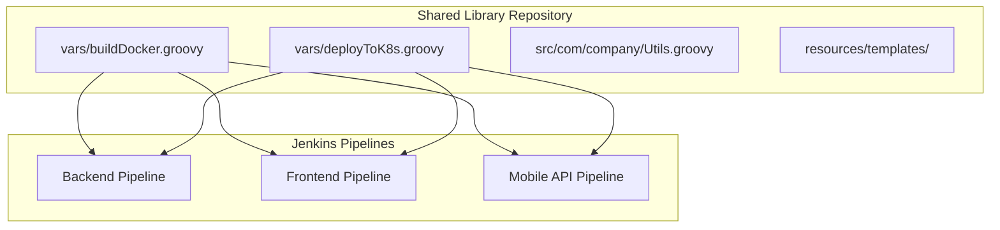
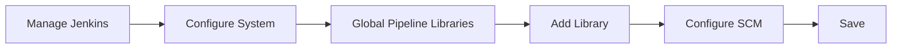
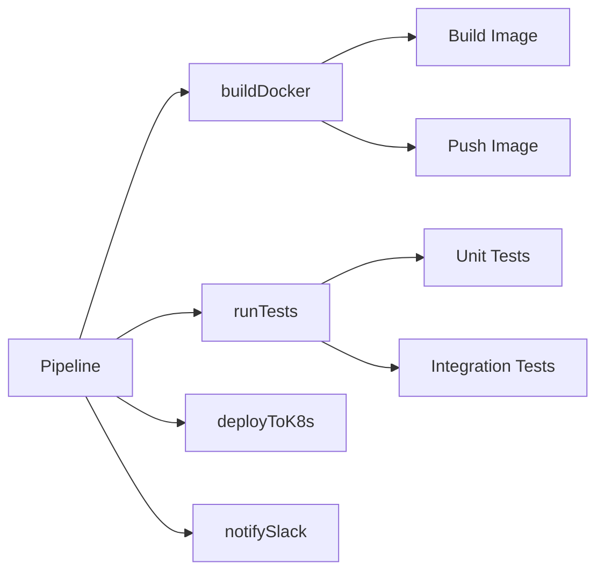

# How to Build Jenkins Shared Library Functions

Author: [nawazdhandala](https://www.github.com/nawazdhandala)

Tags: Jenkins, CI/CD, DevOps, Automation, Groovy, Pipeline

Description: Learn how to create reusable Jenkins Shared Libraries with custom functions, global variables, and resource files to standardize pipelines across your organization.

Jenkins pipelines grow messy fast. Copy-pasting the same build steps across 50 repositories leads to maintenance nightmares when you need to update a single function. Shared Libraries solve the problem by centralizing pipeline logic into version-controlled, reusable components that any pipeline can import.

---

## What is a Jenkins Shared Library?

A Shared Library in Jenkins is a collection of Groovy code stored in a separate Git repository. Pipelines can load functions from the library without duplicating code. When you update the library, every pipeline using it picks up the changes automatically.

The following diagram illustrates how multiple Jenkins pipelines consume functions from a single Shared Library repository.



---

## Shared Library Directory Structure

A properly organized Shared Library follows a specific directory structure that Jenkins expects. Each directory serves a distinct purpose.

```
jenkins-shared-library/
├── vars/                    # Global variables and functions
│   ├── buildDocker.groovy   # Called as buildDocker() in pipelines
│   ├── deployToK8s.groovy   # Called as deployToK8s() in pipelines
│   └── notifySlack.groovy   # Called as notifySlack() in pipelines
├── src/                     # Groovy source files (classes)
│   └── com/
│       └── company/
│           ├── Docker.groovy
│           └── Kubernetes.groovy
├── resources/               # Non-Groovy files (configs, templates)
│   ├── deploy-template.yaml
│   └── config.json
└── README.md
```

### Directory Breakdown

- **vars/**: Contains global functions accessible directly by name in pipelines
- **src/**: Houses Groovy classes following standard Java package conventions
- **resources/**: Stores static files like templates, scripts, and configuration files

---

## Creating Your First Shared Library

### Step 1: Initialize the Repository

Start by creating a new Git repository for your Shared Library. The repository structure must match what Jenkins expects.

```bash
# Create the shared library repository
mkdir jenkins-shared-library
cd jenkins-shared-library
git init

# Create the required directory structure
mkdir -p vars src/com/company resources

# Create a README for documentation
echo "# Jenkins Shared Library" > README.md
```

### Step 2: Create a Simple Global Function

Global functions live in the `vars/` directory. Each file becomes a callable function in your pipelines. The filename determines the function name.

The following Groovy script creates a simple greeting function. Save it as `vars/sayHello.groovy`.

```groovy
// vars/sayHello.groovy
// A simple global function that prints a greeting message
// Usage in pipeline: sayHello('World')

def call(String name = 'Developer') {
    // The call() method is the default entry point
    // Jenkins invokes this when you call sayHello() in a pipeline
    echo "Hello, ${name}! Welcome to the build."
}
```

### Step 3: Create a More Useful Function

Real-world libraries need functions that perform actual work. Here is a Docker build function that handles image tagging and pushing.

Save the following code as `vars/buildDocker.groovy`. The function accepts a Map parameter for flexible configuration.

```groovy
// vars/buildDocker.groovy
// Builds, tags, and pushes Docker images with sensible defaults
// Usage: buildDocker(image: 'myapp', tag: 'v1.0.0', registry: 'docker.io/myorg')

def call(Map config = [:]) {
    // Set default values for optional parameters
    // Using Elvis operator (?:) to provide fallbacks
    def image = config.image ?: 'app'
    def tag = config.tag ?: 'latest'
    def dockerfile = config.dockerfile ?: 'Dockerfile'
    def context = config.context ?: '.'
    def registry = config.registry ?: ''

    // Build the full image name including registry if provided
    def fullImage = registry ? "${registry}/${image}:${tag}" : "${image}:${tag}"

    // Execute the build within a pipeline stage
    stage('Build Docker Image') {
        echo "Building Docker image: ${fullImage}"

        // Build the image with specified dockerfile and context
        sh """
            docker build \
                -t ${fullImage} \
                -f ${dockerfile} \
                ${context}
        """
    }

    // Push to registry if credentials are available
    if (registry && config.credentialsId) {
        stage('Push Docker Image') {
            // Use Jenkins credentials binding for secure authentication
            withCredentials([usernamePassword(
                credentialsId: config.credentialsId,
                usernameVariable: 'DOCKER_USER',
                passwordVariable: 'DOCKER_PASS'
            )]) {
                sh """
                    echo \$DOCKER_PASS | docker login ${registry} -u \$DOCKER_USER --password-stdin
                    docker push ${fullImage}
                """
            }
        }
    }

    // Return the full image name for use in subsequent steps
    return fullImage
}
```

---

## Configuring Jenkins to Use the Library

Before pipelines can import your library, Jenkins needs to know where to find it. You have two options: global configuration or per-pipeline configuration.

### Global Configuration (Recommended for Organization-Wide Libraries)

The following steps add the library globally so all pipelines can access it.

1. Navigate to **Manage Jenkins** > **Configure System**
2. Scroll to **Global Pipeline Libraries**
3. Click **Add** and fill in the fields:

```yaml
Name: my-shared-library
Default version: main
Load implicitly: false (recommended for explicit imports)
Allow default version to be overridden: true

Retrieval method: Modern SCM
  Source Code Management: Git
    Project Repository: https://github.com/your-org/jenkins-shared-library.git
    Credentials: (select your git credentials)
```

The configuration flow is shown in the diagram below.



### Per-Pipeline Configuration (Folder Level)

For team-specific libraries, configure at the folder level instead. Navigate to the folder containing your jobs, click **Configure**, and add the library under **Pipeline Libraries**.

---

## Using the Library in Pipelines

### Importing the Library

Pipelines import Shared Libraries using the `@Library` annotation. The annotation accepts the library name and version.

The following pipeline imports the library and uses the custom functions we created earlier.

```groovy
// Jenkinsfile
// Import the shared library - @Library('name@version')
// The underscore (_) imports all global variables from vars/
@Library('my-shared-library@main') _

pipeline {
    agent any

    stages {
        stage('Greet') {
            steps {
                // Call the sayHello function from vars/sayHello.groovy
                sayHello('Jenkins User')
            }
        }

        stage('Build') {
            steps {
                // Call buildDocker with configuration map
                script {
                    def imageName = buildDocker(
                        image: 'my-application',
                        tag: env.BUILD_NUMBER,
                        registry: 'docker.io/myorg',
                        credentialsId: 'docker-hub-creds'
                    )
                    echo "Built image: ${imageName}"
                }
            }
        }
    }
}
```

### Version Pinning

Pin your library to a specific version in production pipelines to avoid unexpected changes.

```groovy
// Pin to a specific Git tag for stability
@Library('my-shared-library@v1.2.0') _

// Pin to a specific commit hash for maximum reproducibility
@Library('my-shared-library@abc123def456') _

// Use a branch name for development
@Library('my-shared-library@feature/new-deploy') _
```

---

## Building Reusable Pipeline Steps

### Deployment Function

Most organizations deploy to Kubernetes. Here is a reusable deployment function that handles manifest templating and kubectl commands.

Save the following code as `vars/deployToK8s.groovy`.

```groovy
// vars/deployToK8s.groovy
// Deploys applications to Kubernetes with namespace and image configuration
// Usage: deployToK8s(namespace: 'prod', image: 'myapp:v1', manifest: 'k8s/deploy.yaml')

def call(Map config = [:]) {
    // Validate required parameters
    if (!config.namespace) {
        error "deployToK8s: 'namespace' parameter is required"
    }
    if (!config.image) {
        error "deployToK8s: 'image' parameter is required"
    }

    def namespace = config.namespace
    def image = config.image
    def manifest = config.manifest ?: 'kubernetes/deployment.yaml'
    def kubeconfig = config.kubeconfig ?: 'kubeconfig-credentials'

    stage("Deploy to ${namespace}") {
        // Use kubeconfig credentials for cluster authentication
        withCredentials([file(credentialsId: kubeconfig, variable: 'KUBECONFIG')]) {
            // Replace image placeholder in manifest with actual image
            // Using sed for simple templating
            sh """
                # Create a temporary manifest with substituted values
                sed 's|IMAGE_PLACEHOLDER|${image}|g' ${manifest} > /tmp/deploy-manifest.yaml

                # Apply the manifest to the specified namespace
                kubectl apply -f /tmp/deploy-manifest.yaml -n ${namespace}

                # Wait for the deployment to roll out successfully
                kubectl rollout status deployment/\$(grep -m1 'name:' /tmp/deploy-manifest.yaml | awk '{print \$2}') -n ${namespace} --timeout=300s
            """
        }
    }
}
```

### Notification Function

Keeping teams informed about build status is critical. Here is a Slack notification function that sends formatted messages.

Save the following code as `vars/notifySlack.groovy`.

```groovy
// vars/notifySlack.groovy
// Sends build status notifications to Slack channels
// Usage: notifySlack(channel: '#builds', status: 'SUCCESS', message: 'Build complete')

def call(Map config = [:]) {
    def channel = config.channel ?: '#jenkins-builds'
    def status = config.status ?: 'INFO'
    def message = config.message ?: 'Pipeline update'
    def webhookCredential = config.webhookCredential ?: 'slack-webhook'

    // Map status to colors for visual distinction
    def colorMap = [
        'SUCCESS': '#36a64f',  // Green
        'FAILURE': '#dc3545',  // Red
        'UNSTABLE': '#ffc107', // Yellow
        'INFO': '#17a2b8'      // Blue
    ]
    def color = colorMap[status] ?: '#6c757d'

    // Build the Slack message payload
    def payload = """
    {
        "channel": "${channel}",
        "attachments": [
            {
                "color": "${color}",
                "title": "${env.JOB_NAME} - Build #${env.BUILD_NUMBER}",
                "title_link": "${env.BUILD_URL}",
                "text": "${message}",
                "fields": [
                    {"title": "Status", "value": "${status}", "short": true},
                    {"title": "Branch", "value": "${env.GIT_BRANCH ?: 'N/A'}", "short": true}
                ],
                "footer": "Jenkins CI",
                "ts": ${System.currentTimeMillis() / 1000}
            }
        ]
    }
    """

    // Send the webhook request
    withCredentials([string(credentialsId: webhookCredential, variable: 'SLACK_URL')]) {
        sh """
            curl -X POST -H 'Content-type: application/json' \
                --data '${payload}' \
                \$SLACK_URL
        """
    }
}
```

---

## Working with Classes in src/

For complex logic, use classes in the `src/` directory. Classes provide better organization, testing capabilities, and code reuse.

### Creating a Utility Class

The following class provides common utility methods for pipeline operations. Save it as `src/com/company/PipelineUtils.groovy`.

```groovy
// src/com/company/PipelineUtils.groovy
// Utility class providing common pipeline operations
// Must be imported in vars/ files or pipelines before use

package com.company

class PipelineUtils implements Serializable {
    // Reference to the pipeline script context
    // Required for accessing Jenkins pipeline steps
    def script

    // Constructor accepts the pipeline script context
    PipelineUtils(script) {
        this.script = script
    }

    // Parses a semantic version string into components
    // Returns a map with major, minor, and patch values
    def parseVersion(String version) {
        def parts = version.tokenize('.')
        return [
            major: parts[0]?.toInteger() ?: 0,
            minor: parts[1]?.toInteger() ?: 0,
            patch: parts[2]?.toInteger() ?: 0
        ]
    }

    // Generates the next semantic version based on bump type
    def bumpVersion(String currentVersion, String bumpType = 'patch') {
        def v = parseVersion(currentVersion)

        switch(bumpType) {
            case 'major':
                v.major++
                v.minor = 0
                v.patch = 0
                break
            case 'minor':
                v.minor++
                v.patch = 0
                break
            case 'patch':
            default:
                v.patch++
        }

        return "${v.major}.${v.minor}.${v.patch}"
    }

    // Checks if a Docker image exists in a registry
    def imageExists(String registry, String image, String tag) {
        def result = script.sh(
            script: "docker manifest inspect ${registry}/${image}:${tag} > /dev/null 2>&1",
            returnStatus: true
        )
        return result == 0
    }

    // Sanitizes branch names for use in Docker tags
    // Replaces invalid characters with dashes
    def sanitizeBranchName(String branch) {
        return branch
            .replaceAll('[^a-zA-Z0-9._-]', '-')
            .replaceAll('-+', '-')
            .toLowerCase()
    }
}
```

### Using Classes from vars/

Classes must be instantiated with the pipeline context. Create a wrapper function in `vars/` to simplify usage.

Save the following code as `vars/pipelineUtils.groovy`.

```groovy
// vars/pipelineUtils.groovy
// Wrapper that instantiates PipelineUtils class with proper context
// Usage: pipelineUtils.bumpVersion('1.2.3', 'minor')

import com.company.PipelineUtils

// The call() method returns an instance of the class
// Passing 'this' provides access to pipeline steps
def call() {
    return new PipelineUtils(this)
}
```

Using the utility class in a pipeline:

```groovy
@Library('my-shared-library@main') _

pipeline {
    agent any

    stages {
        stage('Version') {
            steps {
                script {
                    // Get an instance of PipelineUtils
                    def utils = pipelineUtils()

                    // Use the utility methods
                    def currentVersion = '1.2.3'
                    def nextVersion = utils.bumpVersion(currentVersion, 'minor')
                    echo "Next version: ${nextVersion}"  // Outputs: 1.3.0

                    // Sanitize branch name for Docker tag
                    def safeBranch = utils.sanitizeBranchName(env.BRANCH_NAME)
                    echo "Safe branch name: ${safeBranch}"
                }
            }
        }
    }
}
```

---

## Loading Resources

Static files stored in `resources/` can be loaded using the `libraryResource` step. Use resources for templates, configuration files, or scripts.

### Creating a Resource Template

Save a Kubernetes deployment template as `resources/kubernetes/deployment.yaml`.

```yaml
# resources/kubernetes/deployment.yaml
# Template with placeholders for dynamic substitution
apiVersion: apps/v1
kind: Deployment
metadata:
  name: {{APP_NAME}}
  namespace: {{NAMESPACE}}
spec:
  replicas: {{REPLICAS}}
  selector:
    matchLabels:
      app: {{APP_NAME}}
  template:
    metadata:
      labels:
        app: {{APP_NAME}}
    spec:
      containers:
        - name: {{APP_NAME}}
          image: {{IMAGE}}
          ports:
            - containerPort: {{PORT}}
          resources:
            requests:
              memory: "{{MEMORY_REQUEST}}"
              cpu: "{{CPU_REQUEST}}"
            limits:
              memory: "{{MEMORY_LIMIT}}"
              cpu: "{{CPU_LIMIT}}"
```

### Loading and Processing Resources

Create a function that loads the template and substitutes values. Save it as `vars/generateK8sManifest.groovy`.

```groovy
// vars/generateK8sManifest.groovy
// Loads a Kubernetes template and replaces placeholders with provided values
// Usage: generateK8sManifest(appName: 'myapp', namespace: 'prod', image: 'myapp:v1')

def call(Map config = [:]) {
    // Load the template from resources directory
    // libraryResource returns file contents as a String
    def template = libraryResource('kubernetes/deployment.yaml')

    // Define default values for all placeholders
    def defaults = [
        APP_NAME: config.appName ?: 'application',
        NAMESPACE: config.namespace ?: 'default',
        REPLICAS: config.replicas ?: '2',
        IMAGE: config.image ?: 'nginx:latest',
        PORT: config.port ?: '8080',
        MEMORY_REQUEST: config.memoryRequest ?: '128Mi',
        CPU_REQUEST: config.cpuRequest ?: '100m',
        MEMORY_LIMIT: config.memoryLimit ?: '256Mi',
        CPU_LIMIT: config.cpuLimit ?: '200m'
    ]

    // Replace all placeholders with actual values
    // Using double curly braces as placeholder markers
    def manifest = template
    defaults.each { key, value ->
        manifest = manifest.replaceAll("\\{\\{${key}\\}\\}", value.toString())
    }

    // Write the processed manifest to workspace
    def outputFile = "${config.appName}-deployment.yaml"
    writeFile(file: outputFile, text: manifest)

    echo "Generated manifest: ${outputFile}"
    return outputFile
}
```

---

## Complete Pipeline Example

Here is a complete pipeline demonstrating all the Shared Library features working together.

```groovy
// Jenkinsfile - Complete example using shared library functions
@Library('my-shared-library@main') _

pipeline {
    agent any

    environment {
        DOCKER_REGISTRY = 'docker.io/myorganization'
        APP_NAME = 'backend-service'
    }

    stages {
        stage('Initialize') {
            steps {
                script {
                    // Instantiate utility class for version management
                    def utils = pipelineUtils()

                    // Generate version tag from branch name
                    def safeBranch = utils.sanitizeBranchName(env.BRANCH_NAME ?: 'main')
                    env.IMAGE_TAG = "${safeBranch}-${env.BUILD_NUMBER}"

                    echo "Building version: ${env.IMAGE_TAG}"
                }
            }
        }

        stage('Build') {
            steps {
                script {
                    // Use shared library Docker build function
                    env.FULL_IMAGE = buildDocker(
                        image: env.APP_NAME,
                        tag: env.IMAGE_TAG,
                        registry: env.DOCKER_REGISTRY,
                        credentialsId: 'docker-credentials'
                    )
                }
            }
        }

        stage('Generate Manifests') {
            steps {
                script {
                    // Generate Kubernetes deployment manifest from template
                    def manifestFile = generateK8sManifest(
                        appName: env.APP_NAME,
                        namespace: 'staging',
                        image: env.FULL_IMAGE,
                        replicas: '3',
                        port: '8080'
                    )

                    // Archive the manifest for review
                    archiveArtifacts artifacts: manifestFile
                }
            }
        }

        stage('Deploy to Staging') {
            when {
                branch 'develop'
            }
            steps {
                deployToK8s(
                    namespace: 'staging',
                    image: env.FULL_IMAGE,
                    manifest: "${env.APP_NAME}-deployment.yaml",
                    kubeconfig: 'k8s-staging-config'
                )
            }
        }

        stage('Deploy to Production') {
            when {
                branch 'main'
            }
            steps {
                // Require manual approval for production deployments
                input message: 'Deploy to production?', ok: 'Deploy'

                deployToK8s(
                    namespace: 'production',
                    image: env.FULL_IMAGE,
                    manifest: "${env.APP_NAME}-deployment.yaml",
                    kubeconfig: 'k8s-prod-config'
                )
            }
        }
    }

    post {
        success {
            notifySlack(
                channel: '#deployments',
                status: 'SUCCESS',
                message: "Successfully deployed ${env.APP_NAME}:${env.IMAGE_TAG}"
            )
        }
        failure {
            notifySlack(
                channel: '#deployments',
                status: 'FAILURE',
                message: "Failed to build/deploy ${env.APP_NAME}"
            )
        }
    }
}
```

---

## Testing Shared Libraries

Testing Shared Library code prevents broken pipelines. Use the Jenkins Pipeline Unit framework for unit testing.

### Setting Up Tests

Add the following to your library's `build.gradle` file.

```groovy
// build.gradle
// Gradle configuration for testing Jenkins Shared Libraries

plugins {
    id 'groovy'
}

repositories {
    mavenCentral()
}

dependencies {
    // Jenkins Pipeline Unit testing framework
    testImplementation 'com.lesfurets:jenkins-pipeline-unit:1.9'
    testImplementation 'junit:junit:4.13.2'
}

// Configure source directories matching library structure
sourceSets {
    main {
        groovy {
            srcDirs = ['src', 'vars']
        }
    }
    test {
        groovy {
            srcDirs = ['test/groovy']
        }
    }
}
```

### Writing Unit Tests

Create tests in `test/groovy/`. The following test verifies the `sayHello` function.

```groovy
// test/groovy/SayHelloTest.groovy
// Unit test for the sayHello shared library function

import com.lesfurets.jenkins.unit.BasePipelineTest
import org.junit.Before
import org.junit.Test

class SayHelloTest extends BasePipelineTest {

    @Override
    @Before
    void setUp() throws Exception {
        super.setUp()
        // Load the script to test
        // The binding provides pipeline step implementations
        helper.registerAllowedMethod('echo', [String.class], { String msg ->
            // Capture echo calls for verification
            binding.setVariable('lastEcho', msg)
        })
    }

    @Test
    void testSayHelloWithName() {
        // Load and run the shared library script
        def script = loadScript('vars/sayHello.groovy')
        script.call('TestUser')

        // Verify the expected output
        assert binding.getVariable('lastEcho') == 'Hello, TestUser! Welcome to the build.'
    }

    @Test
    void testSayHelloDefault() {
        def script = loadScript('vars/sayHello.groovy')
        script.call()

        // Verify default parameter is used
        assert binding.getVariable('lastEcho') == 'Hello, Developer! Welcome to the build.'
    }
}
```

Run tests with:

```bash
# Execute all tests
./gradlew test

# Run with verbose output
./gradlew test --info
```

---

## Best Practices

### 1. Version Your Library

Tag releases and use semantic versioning. Pipelines should pin to specific versions in production.

```bash
# Tag a new release after testing changes
git tag -a v1.2.0 -m "Add Kubernetes deployment functions"
git push origin v1.2.0
```

### 2. Document Your Functions

Add clear documentation at the top of each file explaining usage, parameters, and examples.

```groovy
// vars/myFunction.groovy
/**
 * Performs a specific task in Jenkins pipelines.
 *
 * Parameters:
 *   - param1 (String): Description of param1 [required]
 *   - param2 (Integer): Description of param2 [default: 10]
 *
 * Example:
 *   myFunction(param1: 'value', param2: 20)
 *
 * Returns:
 *   String: Description of return value
 */
def call(Map config = [:]) {
    // Implementation
}
```

### 3. Handle Errors Gracefully

Validate inputs and provide meaningful error messages.

```groovy
def call(Map config = [:]) {
    // Validate required parameters early
    if (!config.image) {
        error "buildDocker: 'image' parameter is required. " +
              "Usage: buildDocker(image: 'myapp', tag: 'v1.0')"
    }

    // Wrap operations in try-catch for better error handling
    try {
        sh "docker build -t ${config.image} ."
    } catch (Exception e) {
        error "Docker build failed: ${e.message}. Check Dockerfile syntax and context."
    }
}
```

### 4. Keep Functions Focused

Each function should do one thing well. Avoid creating monolithic functions that try to handle every scenario.



---

## Troubleshooting Common Issues

### Library Not Found

If Jenkins cannot find your library, verify the configuration in **Manage Jenkins** > **Configure System** > **Global Pipeline Libraries**.

```groovy
// Error: Library 'my-shared-library' not found
// Check:
// 1. Library name matches exactly (case-sensitive)
// 2. Git repository URL is accessible from Jenkins
// 3. Credentials have read access to the repository
```

### Script Security Errors

New methods may require approval in **Manage Jenkins** > **In-process Script Approval**.

```groovy
// Error: Scripts not permitted to use method java.lang.String replaceAll
// Solution: Approve the method in Script Approval
// Or use @NonCPS annotation for non-CPS-transformed methods

@NonCPS
def sanitizeString(String input) {
    return input.replaceAll('[^a-zA-Z0-9]', '')
}
```

### Serialization Issues

Pipeline steps can be paused and resumed, requiring objects to be serializable. Use `@NonCPS` for methods that should not be serialized.

```groovy
// Error: java.io.NotSerializableException
// Solution: Add @NonCPS annotation to methods that don't need serialization

@NonCPS
def parseJson(String jsonText) {
    // Non-serializable JSON parsing
    def slurper = new groovy.json.JsonSlurper()
    return slurper.parseText(jsonText)
}
```

---

## Summary

Jenkins Shared Libraries transform copy-paste pipelines into maintainable, standardized code. Here are the key takeaways:

- Store global functions in `vars/` for direct pipeline access
- Use `src/` for complex classes following Java package conventions
- Keep templates and configs in `resources/` loaded via `libraryResource`
- Pin library versions in production pipelines for stability
- Test your library code to prevent breaking changes
- Document functions with usage examples and parameter descriptions

Building a well-designed Shared Library pays dividends as your organization scales. One update to the library improves every pipeline that uses it, reducing maintenance burden and ensuring consistency across all projects.
