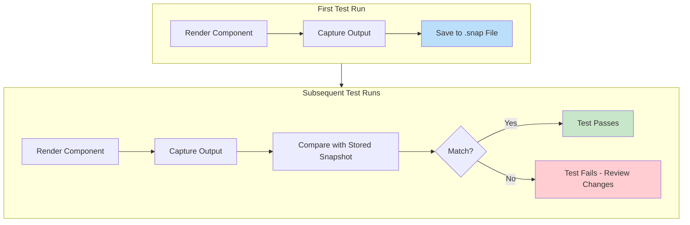
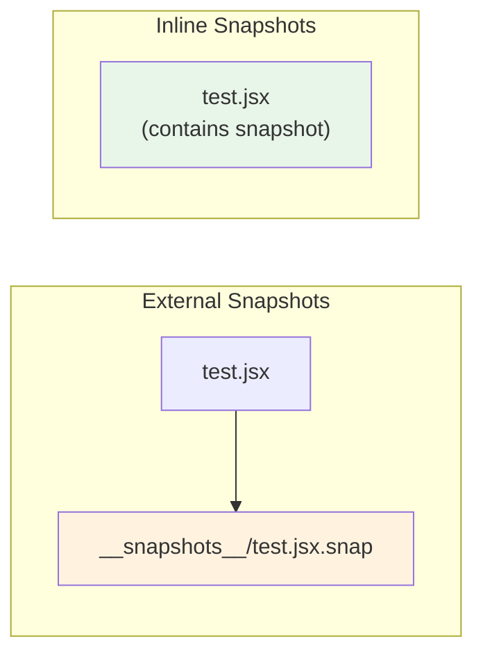
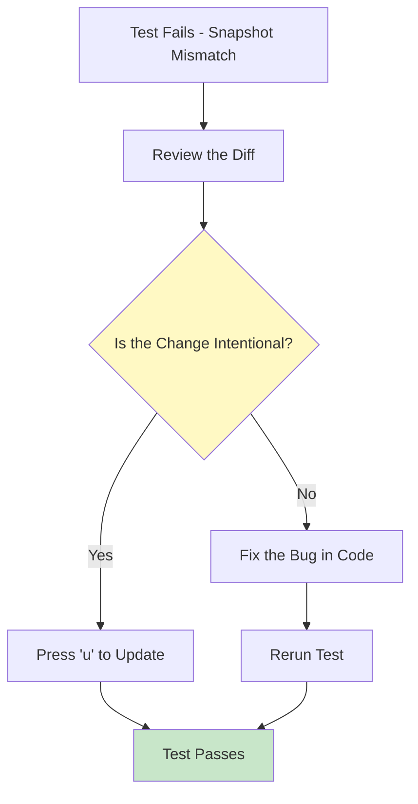
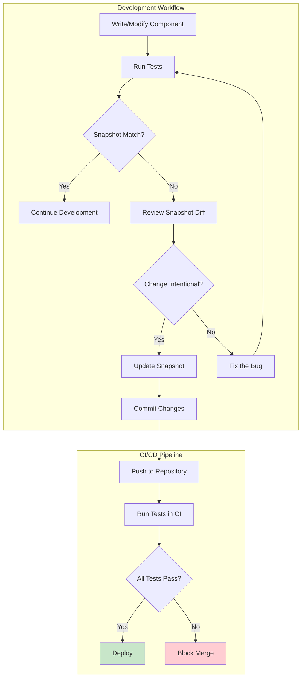

# How to Use Jest Snapshot Testing

Author: [nawazdhandala](https://www.github.com/nawazdhandala)

Tags: Jest, Snapshot Testing, JavaScript, Testing, React, Unit Testing, Test Automation

Description: A practical guide to Jest snapshot testing covering setup, component snapshots, inline snapshots, updating snapshots, best practices, and advanced techniques for maintaining reliable test suites.

---

> Snapshot testing captures the rendered output of your components and compares it against a stored reference. When the output changes unexpectedly, you catch bugs before they reach production.

Catching unintended UI changes during development can be challenging. Manual inspection of every component after each code change is tedious and error-prone. Jest snapshot testing automates this process by taking a "picture" of your component's output and alerting you when something changes.

---

## What is Snapshot Testing?

Snapshot testing compares the current output of a component or function against a previously saved reference (the "snapshot"). If the output matches, the test passes. If it differs, the test fails, prompting you to review the change.



The workflow is straightforward: Jest generates snapshot files automatically on the first run, then uses them as the baseline for future comparisons.

---

## Setting Up Jest for Snapshot Testing

### Installing Dependencies

Install Jest and the React testing utilities in your project:

```bash
# Install Jest as a development dependency
npm install --save-dev jest

# For React projects, add the testing library and renderer
npm install --save-dev @testing-library/react @testing-library/jest-dom

# Alternative: If using react-test-renderer for snapshots
npm install --save-dev react-test-renderer
```

### Configuring Jest

Add Jest configuration to your package.json or create a dedicated config file:

```json
{
  "scripts": {
    "test": "jest",
    "test:update": "jest --updateSnapshot"
  },
  "jest": {
    "testEnvironment": "jsdom",
    "moduleFileExtensions": ["js", "jsx", "ts", "tsx"],
    "snapshotSerializers": ["@emotion/jest/serializer"]
  }
}
```

---

## Writing Your First Snapshot Test

### Basic Component Snapshot

Consider a simple Button component that we want to test:

```jsx
// Button.jsx - A reusable button component with different variants
import React from 'react';

function Button({ children, variant = 'primary', disabled = false }) {
  const baseStyles = 'px-4 py-2 rounded font-medium';
  const variantStyles = {
    primary: 'bg-blue-500 text-white hover:bg-blue-600',
    secondary: 'bg-gray-200 text-gray-800 hover:bg-gray-300',
    danger: 'bg-red-500 text-white hover:bg-red-600'
  };

  return (
    <button
      className={`${baseStyles} ${variantStyles[variant]}`}
      disabled={disabled}
    >
      {children}
    </button>
  );
}

export default Button;
```

Now write the snapshot test for the Button component:

```jsx
// Button.test.jsx - Snapshot tests for the Button component
import React from 'react';
import renderer from 'react-test-renderer';
import Button from './Button';

// Test the primary button variant (default)
test('Button renders with primary variant', () => {
  // Create a test renderer instance of the Button
  const tree = renderer
    .create(<Button>Click me</Button>)
    .toJSON();

  // Compare against the stored snapshot
  expect(tree).toMatchSnapshot();
});

// Test the secondary button variant
test('Button renders with secondary variant', () => {
  const tree = renderer
    .create(<Button variant="secondary">Secondary</Button>)
    .toJSON();

  expect(tree).toMatchSnapshot();
});

// Test disabled state
test('Button renders in disabled state', () => {
  const tree = renderer
    .create(<Button disabled>Disabled Button</Button>)
    .toJSON();

  expect(tree).toMatchSnapshot();
});
```

### Understanding the Snapshot File

Running the test generates a snapshot file in the `__snapshots__` directory:

```javascript
// __snapshots__/Button.test.jsx.snap
// Auto-generated by Jest - Do not edit manually

exports[`Button renders with primary variant 1`] = `
<button
  className="px-4 py-2 rounded font-medium bg-blue-500 text-white hover:bg-blue-600"
  disabled={false}
>
  Click me
</button>
`;

exports[`Button renders with secondary variant 1`] = `
<button
  className="px-4 py-2 rounded font-medium bg-gray-200 text-gray-800 hover:bg-gray-300"
  disabled={false}
>
  Secondary
</button>
`;

exports[`Button renders in disabled state 1`] = `
<button
  className="px-4 py-2 rounded font-medium bg-blue-500 text-white hover:bg-blue-600"
  disabled={true}
>
  Disabled Button
</button>
`;
```

---

## Using Inline Snapshots

Inline snapshots store the expected output directly in your test file instead of a separate `.snap` file. They are useful for small snapshots that benefit from being visible alongside the test code.

### Converting to Inline Snapshots

Use `toMatchInlineSnapshot()` instead of `toMatchSnapshot()`:

```jsx
// Button.test.jsx - Using inline snapshots for better visibility
import React from 'react';
import renderer from 'react-test-renderer';
import Button from './Button';

// Inline snapshot - Jest will fill in the expected value on first run
test('Button renders with primary variant', () => {
  const tree = renderer
    .create(<Button>Click me</Button>)
    .toJSON();

  // Jest automatically populates the snapshot content between the backticks
  expect(tree).toMatchInlineSnapshot(`
    <button
      className="px-4 py-2 rounded font-medium bg-blue-500 text-white hover:bg-blue-600"
      disabled={false}
    >
      Click me
    </button>
  `);
});
```



Inline snapshots work best for small, focused assertions where seeing the expected output directly in the test improves readability.

---

## Snapshot Testing with React Testing Library

React Testing Library offers a different approach that focuses on how users interact with components rather than implementation details.

### Testing DOM Output

Write snapshot tests that capture the rendered DOM:

```jsx
// UserCard.test.jsx - Snapshot testing with React Testing Library
import React from 'react';
import { render } from '@testing-library/react';
import UserCard from './UserCard';

// Test component rendering with user data
test('UserCard displays user information correctly', () => {
  // Define test data that represents a typical user
  const user = {
    name: 'Jane Smith',
    email: 'jane@example.com',
    avatar: 'https://example.com/avatar.jpg',
    role: 'Developer'
  };

  // Render the component and capture the container
  const { container } = render(<UserCard user={user} />);

  // Snapshot the entire rendered output
  expect(container.firstChild).toMatchSnapshot();
});

// Test multiple states of the same component
test('UserCard renders loading state', () => {
  const { container } = render(<UserCard loading />);

  expect(container.firstChild).toMatchSnapshot();
});

// Test error state
test('UserCard renders error state', () => {
  const { container } = render(
    <UserCard error="Failed to load user data" />
  );

  expect(container.firstChild).toMatchSnapshot();
});
```

### Selective Snapshot Testing

Sometimes you only want to snapshot a specific part of the component:

```jsx
// Only snapshot specific elements for more focused tests
import { render, screen } from '@testing-library/react';
import UserProfile from './UserProfile';

test('UserProfile header section matches snapshot', () => {
  render(<UserProfile userId="123" />);

  // Only snapshot the header element, ignoring the rest
  const header = screen.getByRole('banner');
  expect(header).toMatchSnapshot();
});
```

---

## Updating Snapshots

When you intentionally change a component, the snapshot test will fail. You need to update the snapshots to reflect the new expected output.

### Updating All Snapshots

Run Jest with the update flag to regenerate all failing snapshots:

```bash
# Update all snapshots that have changed
npm test -- --updateSnapshot

# Or use the shorthand flag
npm test -- -u

# Using the script defined in package.json
npm run test:update
```

### Interactive Update Mode

Jest's watch mode provides an interactive way to review and update snapshots one at a time:

```bash
# Start Jest in watch mode
npm test -- --watch
```



In watch mode, press:
- `u` to update all failing snapshots
- `i` to update snapshots interactively one by one
- `s` to skip the current test

---

## Snapshot Testing Best Practices

### Keep Snapshots Small and Focused

Large snapshots become difficult to review and maintain. Break down complex components into smaller, testable units:

```jsx
// AVOID: Snapshotting an entire page component
test('entire page snapshot', () => {
  const { container } = render(<EntireDashboardPage />);
  expect(container).toMatchSnapshot(); // Creates a massive, hard-to-review snapshot
});

// BETTER: Snapshot individual sections
test('dashboard header matches snapshot', () => {
  const { container } = render(<DashboardHeader user={mockUser} />);
  expect(container.firstChild).toMatchSnapshot();
});

test('dashboard sidebar matches snapshot', () => {
  const { container } = render(<DashboardSidebar menuItems={mockMenuItems} />);
  expect(container.firstChild).toMatchSnapshot();
});
```

### Use Descriptive Test Names

Clear test names make snapshot diffs easier to understand:

```jsx
// Good test names describe the specific state being captured
describe('NotificationBadge', () => {
  test('renders with zero notifications', () => {
    const { container } = render(<NotificationBadge count={0} />);
    expect(container.firstChild).toMatchSnapshot();
  });

  test('renders with single notification', () => {
    const { container } = render(<NotificationBadge count={1} />);
    expect(container.firstChild).toMatchSnapshot();
  });

  test('renders with 99+ overflow indicator', () => {
    const { container } = render(<NotificationBadge count={150} />);
    expect(container.firstChild).toMatchSnapshot();
  });
});
```

### Avoid Dynamic Data in Snapshots

Dynamic values like dates, random IDs, or timestamps cause unnecessary snapshot failures:

```jsx
// PROBLEM: Dynamic date causes snapshot to change every day
function WelcomeMessage({ user }) {
  return (
    <div>
      <h1>Welcome, {user.name}</h1>
      <p>Today is {new Date().toLocaleDateString()}</p>
    </div>
  );
}

// SOLUTION: Mock dynamic values in tests
test('WelcomeMessage snapshot', () => {
  // Mock the current date for consistent snapshots
  jest.useFakeTimers();
  jest.setSystemTime(new Date('2024-06-15'));

  const { container } = render(<WelcomeMessage user={{ name: 'Alice' }} />);
  expect(container.firstChild).toMatchSnapshot();

  // Restore real timers after the test
  jest.useRealTimers();
});
```

### Use Property Matchers for Dynamic Content

Property matchers let you define patterns for values that change:

```jsx
// Using property matchers for dynamic values
test('user object with generated ID', () => {
  const user = createUser({ name: 'Bob' });

  // Match the structure while allowing any string for the id
  expect(user).toMatchSnapshot({
    id: expect.any(String),
    createdAt: expect.any(Date)
  });
});
```

---

## Advanced Snapshot Techniques

### Custom Serializers

Create custom serializers to format specific types of objects in your snapshots:

```javascript
// jest.config.js - Adding a custom serializer
module.exports = {
  snapshotSerializers: ['./custom-serializer.js']
};
```

```javascript
// custom-serializer.js - Format Luxon DateTime objects nicely
module.exports = {
  // Check if this serializer handles the value
  test(value) {
    return value && value.isLuxonDateTime;
  },

  // Format the value for the snapshot
  print(value, serialize) {
    return `DateTime<${value.toISO()}>`;
  }
};
```

### Snapshot Testing API Responses

Snapshot testing works beyond React components. Test API response structures:

```javascript
// api.test.js - Snapshot testing for API responses
import { fetchUserData } from './api';

// Mock the fetch function to return consistent data
jest.mock('./api');

test('user API response structure matches snapshot', async () => {
  // Define the expected response structure
  const mockResponse = {
    id: 'user-123',
    name: 'Test User',
    email: 'test@example.com',
    preferences: {
      theme: 'dark',
      notifications: true
    }
  };

  fetchUserData.mockResolvedValue(mockResponse);

  const result = await fetchUserData('user-123');

  // Snapshot the response structure
  expect(result).toMatchSnapshot();
});
```

### Testing Styled Components

When using CSS-in-JS libraries, ensure styles are captured in snapshots:

```jsx
// Snapshot testing with styled-components
import React from 'react';
import renderer from 'react-test-renderer';
import 'jest-styled-components'; // Adds serializer for styled-components

import { PrimaryButton } from './StyledButtons';

test('PrimaryButton includes expected styles', () => {
  const tree = renderer.create(<PrimaryButton>Submit</PrimaryButton>).toJSON();

  expect(tree).toMatchSnapshot();
  // Snapshots will include the generated CSS
});
```

---

## Snapshot Testing Workflow



---

## Common Pitfalls and Solutions

### Snapshot Files Getting Too Large

When snapshots grow unwieldy, consider these strategies:

```jsx
// Split large components into smaller, testable units
// Instead of one massive snapshot:
test('ComplexForm snapshot', () => { /* huge snapshot */ });

// Create focused snapshots for each section:
test('FormHeader snapshot', () => { /* small, focused */ });
test('FormFields snapshot', () => { /* small, focused */ });
test('FormActions snapshot', () => { /* small, focused */ });
```

### Handling Asynchronous Components

Components that fetch data need proper handling:

```jsx
// async-component.test.jsx - Testing components with async data
import { render, waitFor } from '@testing-library/react';
import UserList from './UserList';

test('UserList after data loads', async () => {
  // Mock the API call
  jest.spyOn(global, 'fetch').mockResolvedValue({
    json: () => Promise.resolve([
      { id: 1, name: 'Alice' },
      { id: 2, name: 'Bob' }
    ])
  });

  const { container } = render(<UserList />);

  // Wait for the loading state to finish
  await waitFor(() => {
    expect(container.querySelector('.loading')).not.toBeInTheDocument();
  });

  // Now snapshot the loaded state
  expect(container.firstChild).toMatchSnapshot();
});
```

### Managing Snapshots in Version Control

Always commit snapshot files alongside your test changes:

```bash
# Verify snapshots are tracked in git
git status

# Snapshot files should appear alongside test changes
# Changes not staged for commit:
#   modified:   src/Button.jsx
#   modified:   src/__snapshots__/Button.test.jsx.snap
#   modified:   src/Button.test.jsx
```

Review snapshot diffs carefully during code review. They show exactly what changed in your component output.

---

## When to Use Snapshot Testing

Snapshot testing excels in certain scenarios:

| Good Use Cases | Not Ideal For |
|---------------|---------------|
| UI component output | Complex business logic |
| Configuration objects | Frequently changing content |
| API response structures | Large, deeply nested objects |
| Error messages | Components with many dynamic values |
| Static content | Performance-critical assertions |

Combine snapshot testing with other testing strategies for comprehensive coverage:

```jsx
// Comprehensive test suite for a component
describe('PaymentForm', () => {
  // Snapshot test for visual regression
  test('renders correctly', () => {
    const { container } = render(<PaymentForm />);
    expect(container.firstChild).toMatchSnapshot();
  });

  // Unit test for validation logic
  test('validates credit card number', () => {
    expect(validateCardNumber('4111111111111111')).toBe(true);
    expect(validateCardNumber('invalid')).toBe(false);
  });

  // Integration test for form submission
  test('submits payment successfully', async () => {
    const onSubmit = jest.fn();
    render(<PaymentForm onSubmit={onSubmit} />);

    // Fill form and submit
    // ... test interactions

    expect(onSubmit).toHaveBeenCalledWith(expect.objectContaining({
      amount: 100
    }));
  });
});
```

---

## Conclusion

Jest snapshot testing provides a quick and efficient way to catch unintended changes in your components. By capturing the rendered output and comparing it against stored references, you can identify regressions early in the development process.

Key takeaways:

1. **Start small** - Begin with simple component snapshots before tackling complex scenarios
2. **Keep snapshots focused** - Small, targeted snapshots are easier to review and maintain
3. **Review diffs carefully** - Treat snapshot updates like code changes during review
4. **Combine with other tests** - Snapshots complement, not replace, unit and integration tests
5. **Handle dynamic data** - Mock dates, IDs, and other changing values for consistent results

Snapshot testing shines when testing UI components, configuration objects, and API response structures. Integrate it into your testing workflow alongside traditional assertions for comprehensive test coverage.

---

## Additional Resources

- [Jest Snapshot Testing Documentation](https://jestjs.io/docs/snapshot-testing)
- [React Testing Library](https://testing-library.com/docs/react-testing-library/intro/)
- [Testing React Components](https://oneuptime.com/blog/post/2026-01-15-react-native-snapshot-testing/view)
