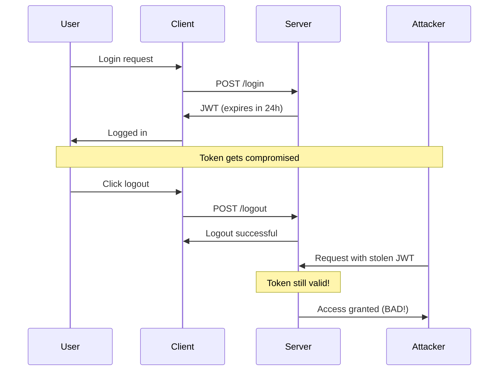
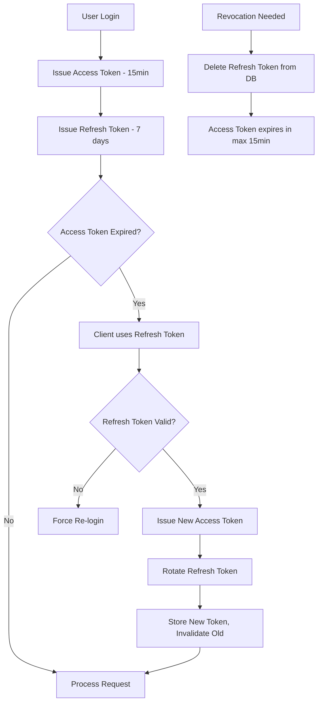
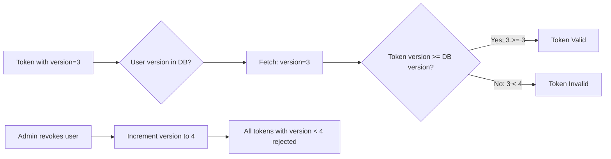
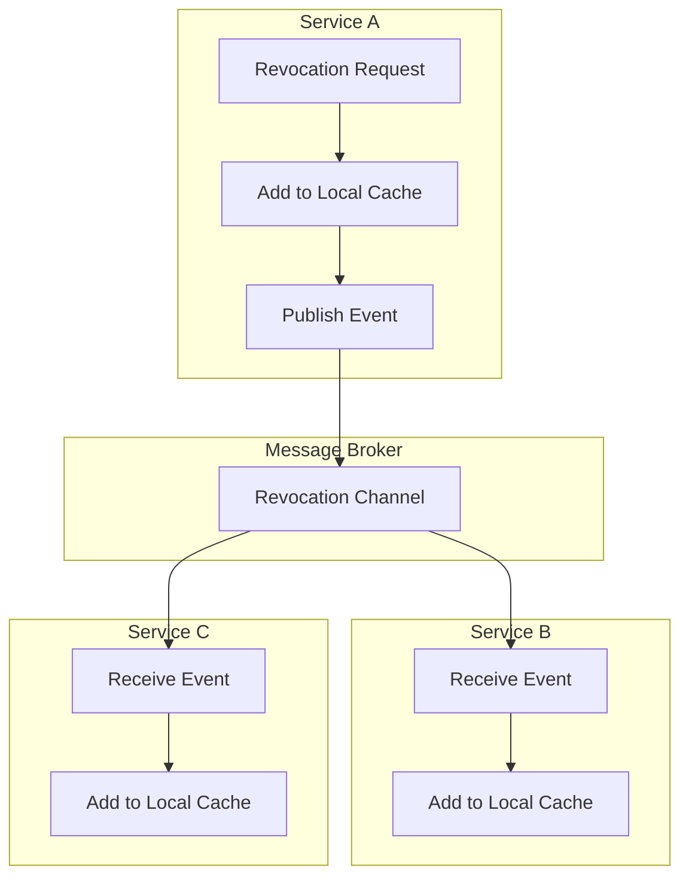

# How to Handle JWT Revocation

Author: [nawazdhandala](https://github.com/nawazdhandala)

Tags: JWT, Revocation, Authentication, Security

Description: A comprehensive guide to handling JWT revocation in your applications. Learn multiple strategies including token blacklisting, short-lived tokens with refresh rotation, and distributed revocation patterns with practical code examples.

---

JSON Web Tokens (JWTs) have become the standard for stateless authentication in modern web applications. Their self-contained nature allows servers to verify authenticity without database lookups, making them excellent for scalability. However, this same stateless property creates a significant challenge: how do you invalidate a token before it expires?

This guide explores multiple strategies for JWT revocation, from simple blacklists to sophisticated distributed patterns. By the end, you will understand the trade-offs and be able to choose the right approach for your application.

## The JWT Revocation Problem

Before diving into solutions, let us understand why JWT revocation is challenging. Traditional session-based authentication stores session data on the server. When you want to log out a user or revoke access, you simply delete their session. The next request fails because the session no longer exists.

JWTs work differently. The token itself contains all the information needed for authentication. When your server receives a JWT, it verifies the signature and checks the claims. If everything is valid, the request proceeds. There is no server-side lookup required.

This creates a fundamental problem: once you issue a JWT, it remains valid until it expires. If a user logs out, their token is still technically valid. If an account is compromised and you need to revoke access immediately, you cannot simply delete something from the server.



## Strategy 1: Token Blacklisting

The most straightforward approach to JWT revocation is maintaining a blacklist of revoked tokens. When a token needs to be revoked, you add it to the blacklist. Every incoming request checks the blacklist before processing.

### Basic Implementation

This implementation uses Redis for the blacklist storage. Redis provides fast lookups and automatic expiration, making it ideal for this use case.

```javascript
// blacklist-service.js
const Redis = require('ioredis');

class TokenBlacklist {
  constructor(redisUrl) {
    this.redis = new Redis(redisUrl);
    // Prefix for blacklist keys to avoid collisions
    this.prefix = 'jwt:blacklist:';
  }

  // Add a token to the blacklist
  // The token will automatically be removed when it would have expired anyway
  async revoke(tokenId, expiresAt) {
    const key = `${this.prefix}${tokenId}`;

    // Calculate TTL - how long until the token would expire naturally
    const ttlSeconds = Math.max(0, Math.floor((expiresAt - Date.now()) / 1000));

    if (ttlSeconds > 0) {
      // Store with automatic expiration
      // No need to keep revoked tokens after they would have expired
      await this.redis.setex(key, ttlSeconds, '1');
    }

    return true;
  }

  // Check if a token has been revoked
  async isRevoked(tokenId) {
    const key = `${this.prefix}${tokenId}`;
    const result = await this.redis.exists(key);
    return result === 1;
  }

  // Revoke all tokens for a specific user
  // Useful for "logout everywhere" functionality
  async revokeAllForUser(userId) {
    // Store the timestamp when revocation happened
    const key = `${this.prefix}user:${userId}:revoked_at`;
    await this.redis.set(key, Date.now().toString());
  }

  // Check if tokens issued before a certain time should be rejected
  async getUserRevocationTime(userId) {
    const key = `${this.prefix}user:${userId}:revoked_at`;
    const timestamp = await this.redis.get(key);
    return timestamp ? parseInt(timestamp, 10) : null;
  }
}

module.exports = { TokenBlacklist };
```

### Authentication Middleware with Blacklist Checking

This middleware integrates blacklist checking into your authentication flow. It verifies the token signature first, then checks the blacklist before allowing the request to proceed.

```javascript
// auth-middleware.js
const jwt = require('jsonwebtoken');
const { TokenBlacklist } = require('./blacklist-service');

const blacklist = new TokenBlacklist(process.env.REDIS_URL);

async function authenticateToken(req, res, next) {
  // Extract token from Authorization header
  const authHeader = req.headers.authorization;
  if (!authHeader || !authHeader.startsWith('Bearer ')) {
    return res.status(401).json({ error: 'No token provided' });
  }

  const token = authHeader.split(' ')[1];

  try {
    // First, verify the token signature and standard claims
    const decoded = jwt.verify(token, process.env.JWT_SECRET);

    // Extract the unique token identifier (jti claim)
    const tokenId = decoded.jti;
    if (!tokenId) {
      return res.status(401).json({ error: 'Invalid token format' });
    }

    // Check if this specific token has been revoked
    const isRevoked = await blacklist.isRevoked(tokenId);
    if (isRevoked) {
      return res.status(401).json({ error: 'Token has been revoked' });
    }

    // Check if all tokens for this user have been revoked
    const userRevocationTime = await blacklist.getUserRevocationTime(decoded.sub);
    if (userRevocationTime && decoded.iat * 1000 < userRevocationTime) {
      return res.status(401).json({ error: 'Session has been invalidated' });
    }

    // Token is valid and not revoked
    req.user = decoded;
    req.tokenId = tokenId;
    next();

  } catch (error) {
    if (error.name === 'TokenExpiredError') {
      return res.status(401).json({ error: 'Token has expired' });
    }
    if (error.name === 'JsonWebTokenError') {
      return res.status(401).json({ error: 'Invalid token' });
    }
    return res.status(500).json({ error: 'Authentication failed' });
  }
}

module.exports = { authenticateToken };
```

### Token Generation with Unique Identifiers

When generating tokens, always include a unique identifier (jti) claim. This identifier is what you store in the blacklist when revoking the token.

```javascript
// token-service.js
const jwt = require('jsonwebtoken');
const { v4: uuidv4 } = require('uuid');

class TokenService {
  constructor(secret, options = {}) {
    this.secret = secret;
    this.accessTokenExpiry = options.accessTokenExpiry || '15m';
    this.refreshTokenExpiry = options.refreshTokenExpiry || '7d';
  }

  // Generate an access token with a unique identifier
  generateAccessToken(user) {
    const payload = {
      sub: user.id,
      email: user.email,
      roles: user.roles,
      // jti (JWT ID) is the unique identifier for this token
      // This is what we use for blacklisting
      jti: uuidv4(),
      // Token type helps distinguish access from refresh tokens
      type: 'access',
    };

    return jwt.sign(payload, this.secret, {
      expiresIn: this.accessTokenExpiry,
      issuer: 'your-app-name',
    });
  }

  // Generate a refresh token with its own unique identifier
  generateRefreshToken(user) {
    const payload = {
      sub: user.id,
      jti: uuidv4(),
      type: 'refresh',
    };

    return jwt.sign(payload, this.secret, {
      expiresIn: this.refreshTokenExpiry,
      issuer: 'your-app-name',
    });
  }

  // Decode a token without verification (to extract claims for revocation)
  decode(token) {
    return jwt.decode(token);
  }

  // Verify a token and return claims
  verify(token) {
    return jwt.verify(token, this.secret);
  }
}

module.exports = { TokenService };
```

### Revocation Endpoints

These endpoints handle the actual revocation of tokens. The logout endpoint revokes the current token, while the logout-all endpoint invalidates all tokens for a user.

```javascript
// auth-routes.js
const express = require('express');
const router = express.Router();
const { authenticateToken } = require('./auth-middleware');
const { TokenBlacklist } = require('./blacklist-service');
const { TokenService } = require('./token-service');

const blacklist = new TokenBlacklist(process.env.REDIS_URL);
const tokenService = new TokenService(process.env.JWT_SECRET);

// Logout - revoke the current token
router.post('/logout', authenticateToken, async (req, res) => {
  try {
    // Get the token from the request
    const token = req.headers.authorization.split(' ')[1];
    const decoded = tokenService.decode(token);

    // Add to blacklist with expiration time
    await blacklist.revoke(
      decoded.jti,
      decoded.exp * 1000 // Convert to milliseconds
    );

    res.json({ message: 'Logged out successfully' });
  } catch (error) {
    console.error('Logout error:', error);
    res.status(500).json({ error: 'Logout failed' });
  }
});

// Logout everywhere - revoke all tokens for the user
router.post('/logout-all', authenticateToken, async (req, res) => {
  try {
    // Mark all tokens issued before now as invalid for this user
    await blacklist.revokeAllForUser(req.user.sub);

    res.json({ message: 'All sessions invalidated' });
  } catch (error) {
    console.error('Logout-all error:', error);
    res.status(500).json({ error: 'Failed to invalidate sessions' });
  }
});

// Admin endpoint to revoke a specific user's access
router.post('/admin/revoke-user/:userId', authenticateToken, async (req, res) => {
  // Check if the requesting user has admin privileges
  if (!req.user.roles.includes('admin')) {
    return res.status(403).json({ error: 'Forbidden' });
  }

  try {
    await blacklist.revokeAllForUser(req.params.userId);
    res.json({ message: `All sessions for user ${req.params.userId} revoked` });
  } catch (error) {
    console.error('Admin revocation error:', error);
    res.status(500).json({ error: 'Revocation failed' });
  }
});

module.exports = router;
```

## Strategy 2: Short-Lived Tokens with Refresh Token Rotation

Instead of maintaining a blacklist, you can use very short-lived access tokens (5-15 minutes) combined with refresh tokens. When you need to revoke access, you simply stop accepting the refresh token. The access token will expire quickly on its own.



### Refresh Token Storage

Refresh tokens need to be stored server-side for this strategy to work. This gives you control over token validity and enables rotation.

```javascript
// refresh-token-store.js
const { Pool } = require('pg');

class RefreshTokenStore {
  constructor(databaseUrl) {
    this.pool = new Pool({ connectionString: databaseUrl });
  }

  // Store a new refresh token
  async store(tokenData) {
    const query = `
      INSERT INTO refresh_tokens (
        token_id,
        user_id,
        token_hash,
        device_info,
        ip_address,
        expires_at,
        created_at
      ) VALUES ($1, $2, $3, $4, $5, $6, NOW())
      RETURNING id
    `;

    const values = [
      tokenData.tokenId,
      tokenData.userId,
      tokenData.tokenHash,
      tokenData.deviceInfo,
      tokenData.ipAddress,
      tokenData.expiresAt,
    ];

    const result = await this.pool.query(query, values);
    return result.rows[0].id;
  }

  // Find a refresh token by its ID
  async findByTokenId(tokenId) {
    const query = `
      SELECT * FROM refresh_tokens
      WHERE token_id = $1
      AND revoked_at IS NULL
      AND expires_at > NOW()
    `;

    const result = await this.pool.query(query, [tokenId]);
    return result.rows[0] || null;
  }

  // Revoke a specific refresh token
  async revoke(tokenId) {
    const query = `
      UPDATE refresh_tokens
      SET revoked_at = NOW()
      WHERE token_id = $1
    `;

    await this.pool.query(query, [tokenId]);
  }

  // Revoke all refresh tokens for a user
  async revokeAllForUser(userId) {
    const query = `
      UPDATE refresh_tokens
      SET revoked_at = NOW()
      WHERE user_id = $1
      AND revoked_at IS NULL
    `;

    const result = await this.pool.query(query, [userId]);
    return result.rowCount;
  }

  // Rotate a refresh token - invalidate old, create new
  async rotate(oldTokenId, newTokenData) {
    const client = await this.pool.connect();

    try {
      await client.query('BEGIN');

      // Revoke the old token
      await client.query(
        'UPDATE refresh_tokens SET revoked_at = NOW() WHERE token_id = $1',
        [oldTokenId]
      );

      // Create the new token
      await client.query(
        `INSERT INTO refresh_tokens (
          token_id, user_id, token_hash, device_info, ip_address, expires_at, created_at
        ) VALUES ($1, $2, $3, $4, $5, $6, NOW())`,
        [
          newTokenData.tokenId,
          newTokenData.userId,
          newTokenData.tokenHash,
          newTokenData.deviceInfo,
          newTokenData.ipAddress,
          newTokenData.expiresAt,
        ]
      );

      await client.query('COMMIT');
    } catch (error) {
      await client.query('ROLLBACK');
      throw error;
    } finally {
      client.release();
    }
  }

  // Clean up expired tokens periodically
  async cleanupExpired() {
    const query = `
      DELETE FROM refresh_tokens
      WHERE expires_at < NOW()
      OR revoked_at < NOW() - INTERVAL '30 days'
    `;

    const result = await this.pool.query(query);
    return result.rowCount;
  }
}

module.exports = { RefreshTokenStore };
```

### Database Schema for Refresh Tokens

You need to create the refresh_tokens table before using the store. This SQL creates the necessary schema with indexes for efficient lookups.

```sql
-- refresh_tokens.sql
CREATE TABLE refresh_tokens (
    id SERIAL PRIMARY KEY,
    token_id VARCHAR(255) UNIQUE NOT NULL,
    user_id VARCHAR(255) NOT NULL,
    token_hash VARCHAR(255) NOT NULL,
    device_info JSONB,
    ip_address INET,
    expires_at TIMESTAMP WITH TIME ZONE NOT NULL,
    created_at TIMESTAMP WITH TIME ZONE NOT NULL,
    revoked_at TIMESTAMP WITH TIME ZONE,

    -- Index for fast token lookups
    CONSTRAINT idx_token_id UNIQUE (token_id)
);

-- Index for finding all tokens for a user
CREATE INDEX idx_refresh_tokens_user_id ON refresh_tokens(user_id);

-- Index for cleanup queries
CREATE INDEX idx_refresh_tokens_expires_at ON refresh_tokens(expires_at);

-- Index for active tokens (not revoked and not expired)
CREATE INDEX idx_refresh_tokens_active ON refresh_tokens(user_id, revoked_at, expires_at)
WHERE revoked_at IS NULL;
```

### Token Refresh Endpoint with Rotation

This endpoint handles the token refresh flow with rotation. Each time a refresh token is used, a new one is issued and the old one is invalidated.

```javascript
// refresh-endpoint.js
const express = require('express');
const crypto = require('crypto');
const { TokenService } = require('./token-service');
const { RefreshTokenStore } = require('./refresh-token-store');

const router = express.Router();
const tokenService = new TokenService(process.env.JWT_SECRET, {
  accessTokenExpiry: '15m',
  refreshTokenExpiry: '7d',
});
const refreshStore = new RefreshTokenStore(process.env.DATABASE_URL);

// Hash the refresh token for storage
// Never store the actual token - only the hash
function hashToken(token) {
  return crypto.createHash('sha256').update(token).digest('hex');
}

router.post('/refresh', async (req, res) => {
  const { refreshToken } = req.body;

  if (!refreshToken) {
    return res.status(400).json({ error: 'Refresh token required' });
  }

  try {
    // Verify the refresh token
    const decoded = tokenService.verify(refreshToken);

    // Check if this is actually a refresh token
    if (decoded.type !== 'refresh') {
      return res.status(401).json({ error: 'Invalid token type' });
    }

    // Look up the token in the database
    const storedToken = await refreshStore.findByTokenId(decoded.jti);

    if (!storedToken) {
      // Token not found or already revoked
      // This could indicate token reuse - a potential security breach
      console.warn(`Refresh token reuse attempt detected for user ${decoded.sub}`);

      // Revoke all tokens for this user as a precaution
      await refreshStore.revokeAllForUser(decoded.sub);

      return res.status(401).json({
        error: 'Invalid refresh token',
        message: 'Please log in again'
      });
    }

    // Verify the token hash matches
    if (storedToken.token_hash !== hashToken(refreshToken)) {
      return res.status(401).json({ error: 'Token mismatch' });
    }

    // Fetch user data for the new access token
    const user = await getUserById(decoded.sub);
    if (!user || !user.isActive) {
      await refreshStore.revoke(decoded.jti);
      return res.status(401).json({ error: 'User account is disabled' });
    }

    // Generate new tokens
    const newAccessToken = tokenService.generateAccessToken(user);
    const newRefreshToken = tokenService.generateRefreshToken(user);
    const newDecoded = tokenService.decode(newRefreshToken);

    // Rotate the refresh token in the database
    await refreshStore.rotate(decoded.jti, {
      tokenId: newDecoded.jti,
      userId: user.id,
      tokenHash: hashToken(newRefreshToken),
      deviceInfo: storedToken.device_info,
      ipAddress: req.ip,
      expiresAt: new Date(newDecoded.exp * 1000),
    });

    res.json({
      accessToken: newAccessToken,
      refreshToken: newRefreshToken,
      expiresIn: 900, // 15 minutes in seconds
    });

  } catch (error) {
    if (error.name === 'TokenExpiredError') {
      return res.status(401).json({
        error: 'Refresh token expired',
        message: 'Please log in again'
      });
    }
    console.error('Token refresh error:', error);
    res.status(500).json({ error: 'Token refresh failed' });
  }
});

module.exports = router;
```

## Strategy 3: Token Versioning

Token versioning is a lightweight alternative to blacklisting. Instead of storing revoked tokens, you store a version number for each user. When you need to revoke all tokens, you simply increment the version.



### Implementation with Version Checking

This approach stores a minimal amount of data - just a version number per user - while enabling full revocation capability.

```javascript
// token-versioning.js
const jwt = require('jsonwebtoken');
const Redis = require('ioredis');

class TokenVersionManager {
  constructor(redisUrl) {
    this.redis = new Redis(redisUrl);
    this.prefix = 'user:token_version:';
  }

  // Get the current token version for a user
  async getVersion(userId) {
    const version = await this.redis.get(`${this.prefix}${userId}`);
    return version ? parseInt(version, 10) : 1;
  }

  // Increment the token version (invalidates all existing tokens)
  async incrementVersion(userId) {
    const key = `${this.prefix}${userId}`;
    const newVersion = await this.redis.incr(key);
    return newVersion;
  }

  // Generate a token that includes the current version
  async generateToken(user, secret, expiresIn) {
    const version = await this.getVersion(user.id);

    const payload = {
      sub: user.id,
      email: user.email,
      roles: user.roles,
      // Include version in the token
      ver: version,
    };

    return jwt.sign(payload, secret, { expiresIn });
  }

  // Verify that a token's version is still valid
  async isVersionValid(decoded) {
    const currentVersion = await this.getVersion(decoded.sub);
    return decoded.ver >= currentVersion;
  }
}

// Middleware using version checking
async function authenticateWithVersion(req, res, next) {
  const versionManager = req.app.get('tokenVersionManager');

  const authHeader = req.headers.authorization;
  if (!authHeader || !authHeader.startsWith('Bearer ')) {
    return res.status(401).json({ error: 'No token provided' });
  }

  const token = authHeader.split(' ')[1];

  try {
    const decoded = jwt.verify(token, process.env.JWT_SECRET);

    // Check if the token version is still valid
    const isValid = await versionManager.isVersionValid(decoded);
    if (!isValid) {
      return res.status(401).json({
        error: 'Token has been invalidated',
        code: 'TOKEN_VERSION_INVALID'
      });
    }

    req.user = decoded;
    next();

  } catch (error) {
    if (error.name === 'TokenExpiredError') {
      return res.status(401).json({ error: 'Token expired' });
    }
    return res.status(401).json({ error: 'Invalid token' });
  }
}

module.exports = { TokenVersionManager, authenticateWithVersion };
```

## Strategy 4: Distributed Revocation with Event Broadcasting

In distributed systems, you need to propagate revocation events across all service instances. This strategy uses a pub/sub mechanism to broadcast revocation events in real-time.



### Distributed Blacklist with Local Caching

This implementation combines a shared Redis blacklist with local in-memory caching and real-time event propagation.

```javascript
// distributed-blacklist.js
const Redis = require('ioredis');
const EventEmitter = require('events');

class DistributedBlacklist extends EventEmitter {
  constructor(redisUrl, options = {}) {
    super();

    // Main Redis connection for read/write
    this.redis = new Redis(redisUrl);

    // Separate connection for pub/sub
    this.subscriber = new Redis(redisUrl);
    this.publisher = new Redis(redisUrl);

    // Local cache for fast lookups
    this.localCache = new Map();
    this.localCacheMaxSize = options.localCacheMaxSize || 10000;

    // Channel for broadcasting revocation events
    this.channel = 'jwt:revocation:events';

    this.setupSubscriber();
  }

  // Subscribe to revocation events from other instances
  setupSubscriber() {
    this.subscriber.subscribe(this.channel, (err) => {
      if (err) {
        console.error('Failed to subscribe to revocation channel:', err);
        return;
      }
      console.log('Subscribed to revocation events');
    });

    this.subscriber.on('message', (channel, message) => {
      if (channel === this.channel) {
        const event = JSON.parse(message);
        this.handleRevocationEvent(event);
      }
    });
  }

  // Handle incoming revocation events
  handleRevocationEvent(event) {
    switch (event.type) {
      case 'token_revoked':
        this.addToLocalCache(event.tokenId, event.expiresAt);
        this.emit('token_revoked', event);
        break;

      case 'user_revoked':
        this.emit('user_revoked', event);
        break;

      case 'cache_clear':
        this.localCache.clear();
        this.emit('cache_cleared');
        break;
    }
  }

  // Add to local cache with LRU eviction
  addToLocalCache(tokenId, expiresAt) {
    // Evict oldest entries if cache is full
    if (this.localCache.size >= this.localCacheMaxSize) {
      const firstKey = this.localCache.keys().next().value;
      this.localCache.delete(firstKey);
    }

    this.localCache.set(tokenId, {
      expiresAt,
      cachedAt: Date.now(),
    });
  }

  // Revoke a token and broadcast the event
  async revoke(tokenId, expiresAt) {
    const key = `jwt:blacklist:${tokenId}`;
    const ttlSeconds = Math.max(0, Math.floor((expiresAt - Date.now()) / 1000));

    if (ttlSeconds > 0) {
      // Store in Redis
      await this.redis.setex(key, ttlSeconds, '1');

      // Add to local cache
      this.addToLocalCache(tokenId, expiresAt);

      // Broadcast to other instances
      await this.publisher.publish(this.channel, JSON.stringify({
        type: 'token_revoked',
        tokenId,
        expiresAt,
        timestamp: Date.now(),
      }));
    }

    return true;
  }

  // Check if a token is revoked (local cache first, then Redis)
  async isRevoked(tokenId) {
    // Check local cache first for fastest response
    const cached = this.localCache.get(tokenId);
    if (cached) {
      // Verify the cached entry has not expired
      if (cached.expiresAt > Date.now()) {
        return true;
      }
      // Clean up expired entry
      this.localCache.delete(tokenId);
    }

    // Fall back to Redis
    const key = `jwt:blacklist:${tokenId}`;
    const exists = await this.redis.exists(key);

    if (exists) {
      // Add to local cache for future lookups
      const ttl = await this.redis.ttl(key);
      this.addToLocalCache(tokenId, Date.now() + ttl * 1000);
    }

    return exists === 1;
  }

  // Revoke all tokens for a user
  async revokeAllForUser(userId, revokedAt = Date.now()) {
    const key = `jwt:user_revoked:${userId}`;
    await this.redis.set(key, revokedAt.toString());

    // Broadcast to other instances
    await this.publisher.publish(this.channel, JSON.stringify({
      type: 'user_revoked',
      userId,
      revokedAt,
      timestamp: Date.now(),
    }));

    return true;
  }

  // Get revocation timestamp for a user
  async getUserRevocationTime(userId) {
    const key = `jwt:user_revoked:${userId}`;
    const timestamp = await this.redis.get(key);
    return timestamp ? parseInt(timestamp, 10) : null;
  }

  // Graceful shutdown
  async close() {
    await this.subscriber.unsubscribe(this.channel);
    await this.subscriber.quit();
    await this.publisher.quit();
    await this.redis.quit();
  }
}

module.exports = { DistributedBlacklist };
```

## Strategy 5: Hybrid Approach

In practice, the best solution often combines multiple strategies. This hybrid approach uses short-lived access tokens, refresh token rotation, and selective blacklisting for immediate revocation.

```javascript
// hybrid-auth-service.js
const { TokenService } = require('./token-service');
const { RefreshTokenStore } = require('./refresh-token-store');
const { DistributedBlacklist } = require('./distributed-blacklist');

class HybridAuthService {
  constructor(config) {
    this.tokenService = new TokenService(config.jwtSecret, {
      // Short-lived access tokens - most requests do not need blacklist check
      accessTokenExpiry: '5m',
      refreshTokenExpiry: '7d',
    });

    this.refreshStore = new RefreshTokenStore(config.databaseUrl);

    // Blacklist only for high-priority revocations
    this.blacklist = new DistributedBlacklist(config.redisUrl);

    // Track which users have active security alerts
    this.securityAlerts = new Map();
  }

  // Normal token verification - no blacklist check for performance
  async verifyAccessToken(token) {
    const decoded = this.tokenService.verify(token);

    // Only check blacklist for users with security alerts
    if (this.securityAlerts.has(decoded.sub)) {
      const isRevoked = await this.blacklist.isRevoked(decoded.jti);
      if (isRevoked) {
        throw new Error('Token has been revoked');
      }
    }

    return decoded;
  }

  // Standard logout - just revoke refresh token
  // Access token will expire within 5 minutes
  async logout(refreshToken) {
    const decoded = this.tokenService.decode(refreshToken);
    if (decoded && decoded.jti) {
      await this.refreshStore.revoke(decoded.jti);
    }
  }

  // Emergency revocation - immediate token invalidation
  // Use this for security breaches, account compromise, etc.
  async emergencyRevoke(userId, accessTokenJti) {
    // Mark user as having security alert
    this.securityAlerts.set(userId, Date.now());

    // Blacklist the current access token for immediate revocation
    if (accessTokenJti) {
      await this.blacklist.revoke(
        accessTokenJti,
        Date.now() + 5 * 60 * 1000 // 5 minutes
      );
    }

    // Revoke all refresh tokens
    await this.refreshStore.revokeAllForUser(userId);

    // Clear security alert after access token would have expired
    setTimeout(() => {
      this.securityAlerts.delete(userId);
    }, 5 * 60 * 1000);
  }

  // Logout from all devices
  async logoutAll(userId) {
    // Revoke all refresh tokens
    await this.refreshStore.revokeAllForUser(userId);

    // Mark user for blacklist checks until current tokens expire
    this.securityAlerts.set(userId, Date.now());

    // Set user-level revocation time
    await this.blacklist.revokeAllForUser(userId);

    setTimeout(() => {
      this.securityAlerts.delete(userId);
    }, 5 * 60 * 1000);
  }
}

module.exports = { HybridAuthService };
```

## Comparison of Strategies

Each strategy has its own trade-offs. Use this comparison to choose the right approach for your application.

| Strategy | Revocation Speed | Scalability | Complexity | Storage Cost |
|----------|-----------------|-------------|------------|--------------|
| Token Blacklisting | Immediate | Good (with Redis) | Low | Medium |
| Short-Lived + Refresh | 5-15 minutes | Excellent | Medium | Low |
| Token Versioning | Immediate | Excellent | Low | Very Low |
| Distributed Blacklist | Immediate | Good | High | Medium |
| Hybrid | Configurable | Excellent | High | Low-Medium |

## Best Practices

### 1. Always Include Token Identifiers

Every JWT should have a unique identifier (jti claim) that can be used for revocation tracking.

```javascript
// Always include jti in your tokens
const token = jwt.sign({
  sub: user.id,
  jti: uuidv4(), // Unique identifier
  iat: Math.floor(Date.now() / 1000),
}, secret);
```

### 2. Set Appropriate Token Lifetimes

Balance security with user experience by choosing appropriate token lifetimes.

```javascript
// Recommended token lifetimes
const config = {
  // Access tokens: short enough to limit exposure
  accessTokenExpiry: '15m',  // 15 minutes

  // Refresh tokens: long enough for good UX
  refreshTokenExpiry: '7d',  // 7 days

  // Remember me refresh tokens
  rememberMeExpiry: '30d',   // 30 days
};
```

### 3. Implement Graceful Token Refresh

Handle token refresh smoothly to avoid disrupting user sessions.

```javascript
// Client-side token refresh with retry
async function fetchWithAuth(url, options = {}) {
  let response = await fetch(url, {
    ...options,
    headers: {
      ...options.headers,
      'Authorization': `Bearer ${getAccessToken()}`,
    },
  });

  // If unauthorized, try refreshing the token
  if (response.status === 401) {
    const refreshed = await refreshAccessToken();
    if (refreshed) {
      // Retry the original request with new token
      response = await fetch(url, {
        ...options,
        headers: {
          ...options.headers,
          'Authorization': `Bearer ${getAccessToken()}`,
        },
      });
    }
  }

  return response;
}
```

### 4. Monitor and Alert on Suspicious Activity

Track revocation patterns to detect potential security issues.

```javascript
// Revocation monitoring
class RevocationMonitor {
  constructor(alertThreshold = 10) {
    this.alertThreshold = alertThreshold;
    this.revocationCounts = new Map();
  }

  async trackRevocation(userId, reason) {
    const key = `${userId}:${new Date().toISOString().split('T')[0]}`;
    const count = (this.revocationCounts.get(key) || 0) + 1;
    this.revocationCounts.set(key, count);

    // Alert if too many revocations for one user
    if (count >= this.alertThreshold) {
      await this.sendAlert({
        userId,
        count,
        reason,
        message: `User ${userId} has had ${count} token revocations today`,
      });
    }

    // Log for audit trail
    console.log(JSON.stringify({
      event: 'token_revocation',
      userId,
      reason,
      timestamp: new Date().toISOString(),
    }));
  }

  async sendAlert(alertData) {
    // Send to your alerting system
    console.warn('Security alert:', alertData);
  }
}
```

### 5. Clean Up Expired Data

Regularly clean up expired tokens and revocation records to keep storage costs low.

```javascript
// Cleanup job - run periodically
async function cleanupExpiredTokens() {
  const refreshStore = new RefreshTokenStore(process.env.DATABASE_URL);

  // Remove expired refresh tokens
  const deletedCount = await refreshStore.cleanupExpired();
  console.log(`Cleaned up ${deletedCount} expired refresh tokens`);

  // Redis blacklist entries expire automatically via TTL
  // No cleanup needed for Redis-based blacklist
}

// Run cleanup daily
setInterval(cleanupExpiredTokens, 24 * 60 * 60 * 1000);
```

## Complete Implementation Example

Here is a complete Express.js application that implements the hybrid revocation strategy.

```javascript
// app.js
const express = require('express');
const { HybridAuthService } = require('./hybrid-auth-service');

const app = express();
app.use(express.json());

// Initialize the auth service
const authService = new HybridAuthService({
  jwtSecret: process.env.JWT_SECRET,
  databaseUrl: process.env.DATABASE_URL,
  redisUrl: process.env.REDIS_URL,
});

// Authentication middleware
async function authenticate(req, res, next) {
  const authHeader = req.headers.authorization;
  if (!authHeader || !authHeader.startsWith('Bearer ')) {
    return res.status(401).json({ error: 'No token provided' });
  }

  const token = authHeader.split(' ')[1];

  try {
    const decoded = await authService.verifyAccessToken(token);
    req.user = decoded;
    req.token = token;
    next();
  } catch (error) {
    return res.status(401).json({ error: error.message });
  }
}

// Login endpoint
app.post('/auth/login', async (req, res) => {
  const { email, password } = req.body;

  // Validate credentials (implement your own logic)
  const user = await validateCredentials(email, password);
  if (!user) {
    return res.status(401).json({ error: 'Invalid credentials' });
  }

  // Generate tokens
  const accessToken = authService.tokenService.generateAccessToken(user);
  const refreshToken = authService.tokenService.generateRefreshToken(user);

  // Store refresh token
  const decoded = authService.tokenService.decode(refreshToken);
  await authService.refreshStore.store({
    tokenId: decoded.jti,
    userId: user.id,
    tokenHash: hashToken(refreshToken),
    deviceInfo: { userAgent: req.headers['user-agent'] },
    ipAddress: req.ip,
    expiresAt: new Date(decoded.exp * 1000),
  });

  res.json({
    accessToken,
    refreshToken,
    expiresIn: 300, // 5 minutes
  });
});

// Logout endpoint
app.post('/auth/logout', authenticate, async (req, res) => {
  const { refreshToken } = req.body;
  await authService.logout(refreshToken);
  res.json({ message: 'Logged out successfully' });
});

// Emergency logout - immediate revocation
app.post('/auth/emergency-logout', authenticate, async (req, res) => {
  const decoded = authService.tokenService.decode(req.token);
  await authService.emergencyRevoke(req.user.sub, decoded.jti);
  res.json({ message: 'Emergency logout successful' });
});

// Logout from all devices
app.post('/auth/logout-all', authenticate, async (req, res) => {
  await authService.logoutAll(req.user.sub);
  res.json({ message: 'Logged out from all devices' });
});

// Protected route example
app.get('/api/profile', authenticate, (req, res) => {
  res.json({ user: req.user });
});

app.listen(3000, () => {
  console.log('Server running on port 3000');
});
```

## Summary

JWT revocation requires careful consideration of your application's security requirements, performance needs, and architectural constraints. Here are the key takeaways:

1. **Token blacklisting** provides immediate revocation but adds latency to every request
2. **Short-lived tokens with refresh rotation** offer a good balance of security and performance
3. **Token versioning** is lightweight but only supports user-level revocation
4. **Distributed blacklisting** is necessary for multi-instance deployments
5. **Hybrid approaches** combine strategies for optimal results

Choose the strategy that best fits your needs:

- For simple applications: Use short-lived access tokens with refresh token rotation
- For high-security requirements: Implement token blacklisting with Redis
- For distributed systems: Use distributed blacklisting with local caching
- For maximum flexibility: Build a hybrid solution that combines multiple strategies

Remember that revocation is just one part of a secure authentication system. Combine it with other security measures like HTTPS, secure cookie settings, rate limiting, and monitoring for a comprehensive security posture.
