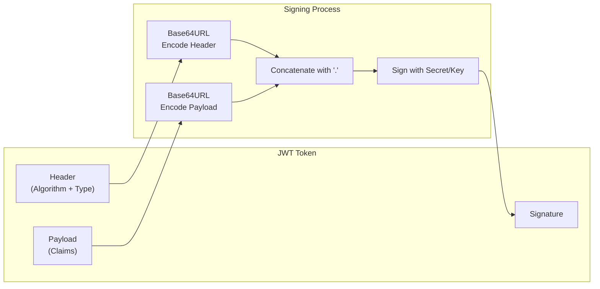
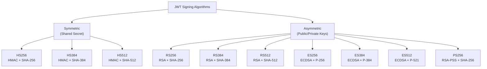
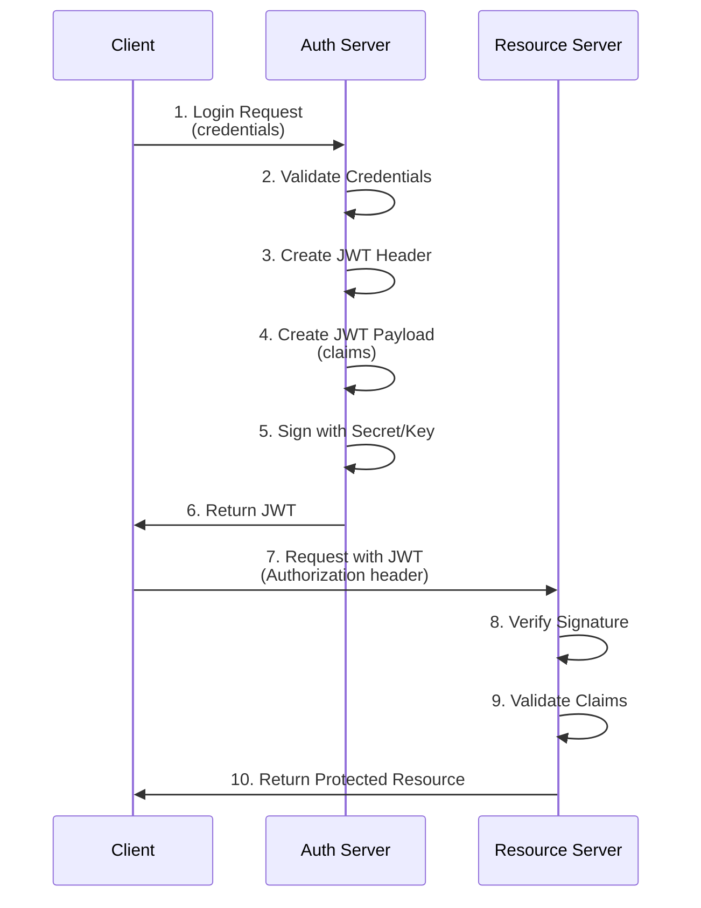
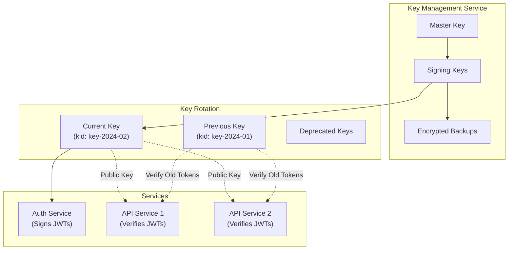

# How to Create and Sign JWTs

Author: [nawazdhandala](https://github.com/nawazdhandala)

Tags: JWT, JSON Web Token, Authentication, Security, Cryptography, Node.js, Python, Go

Description: A comprehensive guide to creating and signing JSON Web Tokens (JWTs) across multiple programming languages. Learn about JWT structure, signing algorithms, key management, and security best practices.

---

JSON Web Tokens have become a cornerstone of modern authentication and authorization systems. Whether you're building APIs, microservices, or single-page applications, understanding how to properly create and sign JWTs is essential for secure system design. In this guide, we'll explore JWT creation from the ground up, covering the underlying mechanics and practical implementations across popular programming languages.

## What is a JWT?

A JWT (pronounced "jot") is a compact, URL-safe means of representing claims to be transferred between two parties. The token consists of three parts separated by dots: a header, a payload, and a signature.

The following diagram illustrates the JWT structure and signing process.



## JWT Structure Deep Dive

Each component of a JWT serves a specific purpose. Let's examine them in detail.

### The Header

The header typically consists of two parts: the token type (JWT) and the signing algorithm being used (such as HMAC SHA256 or RSA).

Here's an example of what a decoded JWT header looks like in JSON format.

```json
{
  "alg": "HS256",
  "typ": "JWT"
}
```

### The Payload

The payload contains the claims. Claims are statements about an entity (typically the user) and additional metadata. There are three types of claims: registered, public, and private claims.

The following JSON shows a payload with common claims including both registered and custom claims.

```json
{
  "sub": "1234567890",
  "name": "John Doe",
  "email": "john@example.com",
  "iat": 1516239022,
  "exp": 1516242622,
  "roles": ["admin", "user"]
}
```

### Registered Claims

These are predefined claims that provide a set of useful, interoperable fields.

| Claim | Name | Description |
|-------|------|-------------|
| `iss` | Issuer | Who issued the token |
| `sub` | Subject | Who the token is about |
| `aud` | Audience | Who the token is intended for |
| `exp` | Expiration | When the token expires (Unix timestamp) |
| `nbf` | Not Before | Token not valid before this time |
| `iat` | Issued At | When the token was issued |
| `jti` | JWT ID | Unique identifier for the token |

## Signing Algorithms

Choosing the right signing algorithm is crucial for security. JWTs support several algorithms, each with different security characteristics.

The diagram below shows the relationship between different JWT signing algorithms.



### Symmetric vs Asymmetric Algorithms

**Symmetric algorithms (HS256, HS384, HS512)** use the same secret key for both signing and verification. They're simpler to implement but require secure key distribution.

**Asymmetric algorithms (RS256, ES256, PS256, etc.)** use a private key for signing and a public key for verification. They're ideal for distributed systems where multiple services need to verify tokens without having access to the signing key.

## Creating JWTs in Node.js

Let's start with a practical implementation in Node.js using the popular `jsonwebtoken` library.

First, install the required package using npm.

```bash
npm install jsonwebtoken
```

The following code demonstrates creating and signing a JWT with a symmetric secret using HS256.

```javascript
// jwt-creator.js
// Import the jsonwebtoken library for JWT operations
const jwt = require('jsonwebtoken');

// Define your secret key - in production, load this from environment variables
// The secret should be at least 256 bits (32 characters) for HS256
const SECRET_KEY = process.env.JWT_SECRET || 'your-256-bit-secret-key-here-min-32-chars';

// Function to create a signed JWT with custom claims
function createAccessToken(userId, email, roles) {
    // Define the payload with standard and custom claims
    const payload = {
        sub: userId,           // Subject - identifies the principal
        email: email,          // Custom claim - user's email
        roles: roles,          // Custom claim - user's roles for authorization
        type: 'access'         // Custom claim - token type identifier
    };

    // Define signing options
    const options = {
        algorithm: 'HS256',    // HMAC with SHA-256
        expiresIn: '15m',      // Token expires in 15 minutes
        issuer: 'my-app',      // Identifies token issuer
        audience: 'my-api',    // Intended recipient of the token
        jwtid: generateTokenId() // Unique identifier for this token
    };

    // Sign and return the token
    return jwt.sign(payload, SECRET_KEY, options);
}

// Generate a unique token ID using timestamp and random string
function generateTokenId() {
    return `${Date.now()}-${Math.random().toString(36).substring(2, 15)}`;
}

// Example usage demonstrating token creation
const token = createAccessToken('user-123', 'john@example.com', ['admin', 'user']);
console.log('Generated JWT:', token);

// Decode the token to inspect its contents (without verification)
const decoded = jwt.decode(token, { complete: true });
console.log('Header:', decoded.header);
console.log('Payload:', decoded.payload);
```

### Creating JWTs with RSA Keys

For systems requiring asymmetric signing, RSA keys provide better security separation. The private key remains on the authentication server while public keys can be distributed to verification services.

The following code shows how to generate RSA keys and use them for JWT signing.

```javascript
// jwt-rsa.js
const jwt = require('jsonwebtoken');
const crypto = require('crypto');
const fs = require('fs');

// Generate RSA key pair (run once, then store keys securely)
// In production, use a key management service or HSM
function generateKeyPair() {
    const { publicKey, privateKey } = crypto.generateKeyPairSync('rsa', {
        modulusLength: 2048,           // Key size in bits - 2048 is minimum for security
        publicKeyEncoding: {
            type: 'spki',              // Subject Public Key Info format
            format: 'pem'              // PEM encoding
        },
        privateKeyEncoding: {
            type: 'pkcs8',             // PKCS#8 format
            format: 'pem'              // PEM encoding
        }
    });

    return { publicKey, privateKey };
}

// Create a JWT signed with RSA private key
function createRSASignedToken(privateKey, userId, permissions) {
    const payload = {
        sub: userId,
        permissions: permissions,
        iat: Math.floor(Date.now() / 1000)
    };

    const options = {
        algorithm: 'RS256',       // RSA signature with SHA-256
        expiresIn: '1h',          // Longer expiry acceptable with asymmetric keys
        issuer: 'auth-service',
        audience: ['api-service', 'data-service'], // Multiple audiences
        keyid: 'key-2024-01'      // Key ID for key rotation support
    };

    return jwt.sign(payload, privateKey, options);
}

// Verify a JWT using the public key
function verifyRSAToken(publicKey, token) {
    try {
        const decoded = jwt.verify(token, publicKey, {
            algorithms: ['RS256'],    // Only accept RS256
            issuer: 'auth-service',
            audience: 'api-service'
        });
        return { valid: true, payload: decoded };
    } catch (error) {
        return { valid: false, error: error.message };
    }
}

// Example: Generate keys and create a token
const { publicKey, privateKey } = generateKeyPair();
const token = createRSASignedToken(privateKey, 'user-456', ['read', 'write']);

console.log('RSA Signed Token:', token);
console.log('Verification:', verifyRSAToken(publicKey, token));
```

## Creating JWTs in Python

Python offers excellent JWT support through the `PyJWT` library. Let's implement JWT creation with both symmetric and asymmetric algorithms.

Install the required packages first.

```bash
pip install PyJWT cryptography
```

The following Python code demonstrates creating JWTs with various signing options.

```python
# jwt_creator.py
import jwt
import datetime
import uuid
import os
from cryptography.hazmat.primitives import serialization
from cryptography.hazmat.primitives.asymmetric import rsa
from cryptography.hazmat.backends import default_backend

# Load secret from environment - never hardcode in production
SECRET_KEY = os.environ.get('JWT_SECRET', 'your-secure-secret-key-at-least-32-characters')


def create_access_token(user_id: str, email: str, roles: list) -> str:
    """
    Create a signed JWT access token with standard claims.

    Args:
        user_id: Unique identifier for the user
        email: User's email address
        roles: List of roles assigned to the user

    Returns:
        Signed JWT string
    """
    # Calculate expiration time - 15 minutes from now
    now = datetime.datetime.utcnow()
    expiration = now + datetime.timedelta(minutes=15)

    # Build the payload with registered and custom claims
    payload = {
        # Registered claims
        'sub': user_id,                        # Subject
        'iat': now,                            # Issued at
        'exp': expiration,                     # Expiration
        'nbf': now,                            # Not before
        'iss': 'my-application',               # Issuer
        'aud': 'my-api',                       # Audience
        'jti': str(uuid.uuid4()),              # Unique token ID

        # Custom claims
        'email': email,
        'roles': roles,
        'token_type': 'access'
    }

    # Sign the token using HS256 algorithm
    token = jwt.encode(
        payload,
        SECRET_KEY,
        algorithm='HS256'
    )

    return token


def create_token_with_rsa():
    """
    Demonstrate JWT creation with RSA asymmetric signing.
    Returns tuple of (token, public_key) for verification.
    """
    # Generate RSA key pair
    # In production, load these from secure storage or a key management service
    private_key = rsa.generate_private_key(
        public_exponent=65537,
        key_size=2048,
        backend=default_backend()
    )
    public_key = private_key.public_key()

    # Serialize keys to PEM format
    private_pem = private_key.private_bytes(
        encoding=serialization.Encoding.PEM,
        format=serialization.PrivateFormat.PKCS8,
        encryption_algorithm=serialization.NoEncryption()
    )

    public_pem = public_key.public_bytes(
        encoding=serialization.Encoding.PEM,
        format=serialization.PublicFormat.SubjectPublicKeyInfo
    )

    # Create payload
    payload = {
        'sub': 'service-account-1',
        'iss': 'auth.mycompany.com',
        'aud': ['api.mycompany.com', 'admin.mycompany.com'],
        'exp': datetime.datetime.utcnow() + datetime.timedelta(hours=1),
        'iat': datetime.datetime.utcnow(),
        'scope': 'read:users write:users'
    }

    # Sign with RS256
    token = jwt.encode(
        payload,
        private_pem,
        algorithm='RS256',
        headers={'kid': 'key-2024-001'}  # Key ID for rotation support
    )

    return token, public_pem


def verify_token(token: str, secret_or_key, algorithms: list) -> dict:
    """
    Verify and decode a JWT token.

    Args:
        token: The JWT string to verify
        secret_or_key: Secret key (HS*) or public key (RS*, ES*)
        algorithms: List of acceptable algorithms

    Returns:
        Decoded payload if valid

    Raises:
        jwt.InvalidTokenError: If token is invalid or expired
    """
    try:
        payload = jwt.decode(
            token,
            secret_or_key,
            algorithms=algorithms,
            audience='my-api',
            issuer='my-application'
        )
        return {'valid': True, 'payload': payload}
    except jwt.ExpiredSignatureError:
        return {'valid': False, 'error': 'Token has expired'}
    except jwt.InvalidTokenError as e:
        return {'valid': False, 'error': str(e)}


# Example usage
if __name__ == '__main__':
    # Create and verify HS256 token
    token = create_access_token('user-789', 'alice@example.com', ['editor', 'viewer'])
    print(f'HS256 Token: {token}')
    print(f'Verification: {verify_token(token, SECRET_KEY, ["HS256"])}')

    # Create and verify RS256 token
    rsa_token, public_key = create_token_with_rsa()
    print(f'\nRS256 Token: {rsa_token}')
```

## Creating JWTs in Go

Go provides robust JWT support through the `golang-jwt/jwt` library. Here's a complete implementation.

Install the required module.

```bash
go get github.com/golang-jwt/jwt/v5
```

The following Go code demonstrates a production-ready JWT creation implementation.

```go
// main.go
package main

import (
	"crypto/rand"
	"crypto/rsa"
	"encoding/base64"
	"fmt"
	"os"
	"time"

	"github.com/golang-jwt/jwt/v5"
)

// CustomClaims extends jwt.RegisteredClaims with application-specific fields
// These claims will be included in the JWT payload
type CustomClaims struct {
	jwt.RegisteredClaims
	Email     string   `json:"email"`
	Roles     []string `json:"roles"`
	TokenType string   `json:"token_type"`
}

// JWTConfig holds configuration for JWT operations
type JWTConfig struct {
	SecretKey     []byte
	Issuer        string
	Audience      []string
	AccessTTL     time.Duration
	SigningMethod jwt.SigningMethod
}

// NewJWTConfig creates a configuration from environment variables
func NewJWTConfig() (*JWTConfig, error) {
	secret := os.Getenv("JWT_SECRET")
	if len(secret) < 32 {
		return nil, fmt.Errorf("JWT_SECRET must be at least 32 characters")
	}

	return &JWTConfig{
		SecretKey:     []byte(secret),
		Issuer:        "my-go-app",
		Audience:      []string{"my-api"},
		AccessTTL:     15 * time.Minute,
		SigningMethod: jwt.SigningMethodHS256,
	}, nil
}

// CreateAccessToken generates a signed JWT for the given user
func (c *JWTConfig) CreateAccessToken(userID, email string, roles []string) (string, error) {
	now := time.Now()

	// Build claims with both registered and custom fields
	claims := CustomClaims{
		RegisteredClaims: jwt.RegisteredClaims{
			ID:        generateTokenID(),
			Subject:   userID,
			Issuer:    c.Issuer,
			Audience:  c.Audience,
			IssuedAt:  jwt.NewNumericDate(now),
			NotBefore: jwt.NewNumericDate(now),
			ExpiresAt: jwt.NewNumericDate(now.Add(c.AccessTTL)),
		},
		Email:     email,
		Roles:     roles,
		TokenType: "access",
	}

	// Create a new token with the specified signing method
	token := jwt.NewWithClaims(c.SigningMethod, claims)

	// Sign the token with our secret key
	signedToken, err := token.SignedString(c.SecretKey)
	if err != nil {
		return "", fmt.Errorf("failed to sign token: %w", err)
	}

	return signedToken, nil
}

// CreateRSASignedToken demonstrates asymmetric signing with RSA
func CreateRSASignedToken(privateKey *rsa.PrivateKey, userID string) (string, error) {
	now := time.Now()

	claims := jwt.RegisteredClaims{
		ID:        generateTokenID(),
		Subject:   userID,
		Issuer:    "auth-service",
		Audience:  []string{"api-service"},
		IssuedAt:  jwt.NewNumericDate(now),
		ExpiresAt: jwt.NewNumericDate(now.Add(time.Hour)),
	}

	// Create token with RS256 algorithm
	token := jwt.NewWithClaims(jwt.SigningMethodRS256, claims)

	// Add key ID to header for key rotation support
	token.Header["kid"] = "rsa-key-001"

	// Sign with private key
	return token.SignedString(privateKey)
}

// VerifyToken validates a JWT and returns its claims
func (c *JWTConfig) VerifyToken(tokenString string) (*CustomClaims, error) {
	// Parse token with custom claims type
	token, err := jwt.ParseWithClaims(
		tokenString,
		&CustomClaims{},
		func(token *jwt.Token) (interface{}, error) {
			// Validate the signing method matches what we expect
			if _, ok := token.Method.(*jwt.SigningMethodHMAC); !ok {
				return nil, fmt.Errorf("unexpected signing method: %v", token.Header["alg"])
			}
			return c.SecretKey, nil
		},
		jwt.WithValidMethods([]string{"HS256"}),
		jwt.WithIssuer(c.Issuer),
		jwt.WithAudience(c.Audience[0]),
		jwt.WithExpirationRequired(),
	)

	if err != nil {
		return nil, fmt.Errorf("token validation failed: %w", err)
	}

	claims, ok := token.Claims.(*CustomClaims)
	if !ok || !token.Valid {
		return nil, fmt.Errorf("invalid token claims")
	}

	return claims, nil
}

// generateTokenID creates a unique identifier for tokens
func generateTokenID() string {
	bytes := make([]byte, 16)
	rand.Read(bytes)
	return base64.RawURLEncoding.EncodeToString(bytes)
}

func main() {
	// Set secret for demo (in production, use proper env management)
	os.Setenv("JWT_SECRET", "your-super-secret-key-at-least-32-characters-long")

	config, err := NewJWTConfig()
	if err != nil {
		fmt.Printf("Config error: %v\n", err)
		return
	}

	// Create a token
	token, err := config.CreateAccessToken("user-001", "bob@example.com", []string{"admin"})
	if err != nil {
		fmt.Printf("Token creation error: %v\n", err)
		return
	}

	fmt.Printf("Generated Token: %s\n\n", token)

	// Verify the token
	claims, err := config.VerifyToken(token)
	if err != nil {
		fmt.Printf("Verification error: %v\n", err)
		return
	}

	fmt.Printf("Verified Claims:\n")
	fmt.Printf("  Subject: %s\n", claims.Subject)
	fmt.Printf("  Email: %s\n", claims.Email)
	fmt.Printf("  Roles: %v\n", claims.Roles)
	fmt.Printf("  Expires: %v\n", claims.ExpiresAt.Time)
}
```

## JWT Signing Flow

Understanding the complete signing flow helps you implement JWTs correctly. The following diagram illustrates the end-to-end process.



## Manual JWT Creation (Understanding the Internals)

To truly understand JWT signing, let's implement it manually without libraries.

The following code demonstrates the low-level mechanics of JWT creation.

```javascript
// manual-jwt.js
const crypto = require('crypto');

// Base64URL encoding (different from standard Base64)
// JWT uses URL-safe Base64 without padding
function base64UrlEncode(data) {
    let base64 = Buffer.from(data).toString('base64');
    // Replace + with -, / with _, and remove padding =
    return base64.replace(/\+/g, '-').replace(/\//g, '_').replace(/=/g, '');
}

// Create HMAC-SHA256 signature
function createHmacSignature(data, secret) {
    const hmac = crypto.createHmac('sha256', secret);
    hmac.update(data);
    return base64UrlEncode(hmac.digest());
}

// Manually create a JWT
function createJWTManually(payload, secret) {
    // Step 1: Create the header
    const header = {
        alg: 'HS256',
        typ: 'JWT'
    };

    // Step 2: Base64URL encode header and payload
    const encodedHeader = base64UrlEncode(JSON.stringify(header));
    const encodedPayload = base64UrlEncode(JSON.stringify(payload));

    // Step 3: Create the signature input
    const signatureInput = `${encodedHeader}.${encodedPayload}`;

    // Step 4: Create the signature
    const signature = createHmacSignature(signatureInput, secret);

    // Step 5: Combine all parts
    return `${encodedHeader}.${encodedPayload}.${signature}`;
}

// Example: Create a token manually
const payload = {
    sub: '1234567890',
    name: 'John Doe',
    iat: Math.floor(Date.now() / 1000),
    exp: Math.floor(Date.now() / 1000) + 3600
};

const secret = 'my-256-bit-secret';
const token = createJWTManually(payload, secret);

console.log('Manually created JWT:');
console.log(token);

// Decode and display parts
const parts = token.split('.');
console.log('\nDecoded parts:');
console.log('Header:', JSON.parse(Buffer.from(parts[0], 'base64url').toString()));
console.log('Payload:', JSON.parse(Buffer.from(parts[1], 'base64url').toString()));
console.log('Signature:', parts[2]);
```

## Key Management Best Practices

Proper key management is essential for JWT security. The following diagram shows a recommended key management architecture.



### Key Rotation Strategy

Implementing key rotation allows you to update signing keys without invalidating existing tokens.

The following code demonstrates a key rotation implementation.

```javascript
// key-rotation.js
const jwt = require('jsonwebtoken');
const crypto = require('crypto');

class KeyManager {
    constructor() {
        // Store multiple keys with their IDs and status
        this.keys = new Map();
        this.currentKeyId = null;
    }

    // Generate a new signing key
    generateKey() {
        const keyId = `key-${Date.now()}`;
        const secret = crypto.randomBytes(32).toString('base64');

        return {
            kid: keyId,
            secret: secret,
            createdAt: new Date(),
            status: 'active'
        };
    }

    // Add a new key and make it current
    rotateKey() {
        // Mark current key as previous
        if (this.currentKeyId) {
            const currentKey = this.keys.get(this.currentKeyId);
            if (currentKey) {
                currentKey.status = 'previous';
            }
        }

        // Generate and store new key
        const newKey = this.generateKey();
        this.keys.set(newKey.kid, newKey);
        this.currentKeyId = newKey.kid;

        console.log(`Rotated to new key: ${newKey.kid}`);
        return newKey.kid;
    }

    // Get the current signing key
    getCurrentKey() {
        return this.keys.get(this.currentKeyId);
    }

    // Get a key by ID (for verification)
    getKeyById(kid) {
        return this.keys.get(kid);
    }

    // Sign a token with the current key
    signToken(payload) {
        const currentKey = this.getCurrentKey();
        if (!currentKey) {
            throw new Error('No signing key available');
        }

        return jwt.sign(payload, currentKey.secret, {
            algorithm: 'HS256',
            expiresIn: '1h',
            keyid: currentKey.kid  // Include key ID in header
        });
    }

    // Verify a token using the appropriate key
    verifyToken(token) {
        // Decode header to get key ID
        const decoded = jwt.decode(token, { complete: true });
        if (!decoded || !decoded.header.kid) {
            throw new Error('Token missing key ID');
        }

        const key = this.getKeyById(decoded.header.kid);
        if (!key) {
            throw new Error('Unknown key ID');
        }

        if (key.status === 'revoked') {
            throw new Error('Key has been revoked');
        }

        return jwt.verify(token, key.secret, {
            algorithms: ['HS256']
        });
    }
}

// Usage example
const keyManager = new KeyManager();

// Initialize with first key
keyManager.rotateKey();

// Create a token
const token1 = keyManager.signToken({ sub: 'user-1', role: 'admin' });
console.log('Token with key 1:', token1);

// Rotate key
keyManager.rotateKey();

// Create another token with new key
const token2 = keyManager.signToken({ sub: 'user-2', role: 'user' });
console.log('Token with key 2:', token2);

// Both tokens should verify
console.log('Verify token 1:', keyManager.verifyToken(token1));
console.log('Verify token 2:', keyManager.verifyToken(token2));
```

## Security Best Practices

When creating and signing JWTs, follow these security guidelines to protect your application.

### 1. Use Strong Secrets

For symmetric algorithms, use secrets with at least 256 bits of entropy.

```javascript
// Generate a cryptographically secure secret
const crypto = require('crypto');
const secret = crypto.randomBytes(32).toString('base64');
// Result: Something like "X4nF8sK2pL9mQ7rT1vY6wZ3bN5cA8dE0gH2jK4mP6s="
```

### 2. Set Appropriate Expiration Times

Keep access tokens short-lived to minimize the impact of token theft.

```javascript
// Recommended expiration times
const accessTokenExpiry = '15m';   // 15 minutes for access tokens
const refreshTokenExpiry = '7d';   // 7 days for refresh tokens
const idTokenExpiry = '1h';        // 1 hour for ID tokens
```

### 3. Validate Algorithm on Verification

Always specify which algorithms you accept to prevent algorithm confusion attacks.

```javascript
// ALWAYS specify accepted algorithms
jwt.verify(token, secret, {
    algorithms: ['HS256']  // Only accept HS256
});

// NEVER do this - vulnerable to algorithm confusion
jwt.verify(token, secret); // Accepts any algorithm including 'none'
```

### 4. Include Essential Claims

Always include security-relevant claims in your tokens.

```javascript
const securePayload = {
    sub: userId,           // Who the token is for
    iss: 'your-app',       // Who issued it
    aud: 'your-api',       // Who should accept it
    exp: expirationTime,   // When it expires
    iat: issuedAtTime,     // When it was issued
    jti: uniqueTokenId     // Unique identifier for revocation
};
```

### 5. Use HTTPS Only

Never transmit JWTs over unencrypted connections.

```javascript
// Set secure cookie options when storing JWTs
const cookieOptions = {
    httpOnly: true,        // Prevent XSS access
    secure: true,          // HTTPS only
    sameSite: 'strict',    // Prevent CSRF
    maxAge: 900000         // 15 minutes in milliseconds
};
```

## Common Mistakes to Avoid

The following table summarizes common JWT implementation errors and their corrections.

| Mistake | Risk | Correct Approach |
|---------|------|------------------|
| Storing sensitive data in payload | Data exposure (JWT payload is base64, not encrypted) | Store only identifiers, fetch sensitive data from database |
| Long expiration times | Extended vulnerability window if token is stolen | Use short-lived access tokens with refresh token rotation |
| Weak secrets | Brute-force attacks | Use 256+ bit cryptographically random secrets |
| Not validating `iss` and `aud` | Token substitution attacks | Always validate issuer and audience claims |
| Using `none` algorithm | Complete authentication bypass | Explicitly specify allowed algorithms |
| Hardcoding secrets | Secret exposure in version control | Use environment variables or secret management services |

## Conclusion

Creating and signing JWTs correctly is fundamental to building secure authentication systems. The key takeaways from this guide include understanding the three-part JWT structure (header, payload, signature), choosing appropriate signing algorithms based on your architecture, implementing proper key management with rotation support, and following security best practices consistently.

Whether you're using symmetric algorithms like HS256 for simpler setups or asymmetric algorithms like RS256 for distributed systems, the principles remain the same: protect your keys, validate everything, and keep tokens short-lived.

For more advanced JWT topics, consider exploring:
- JWKS (JSON Web Key Sets) for public key distribution
- JWT refresh token patterns
- Token revocation strategies
- OpenID Connect for identity tokens

By following the patterns and practices outlined in this guide, you can implement JWT authentication that is both secure and maintainable across your applications.
