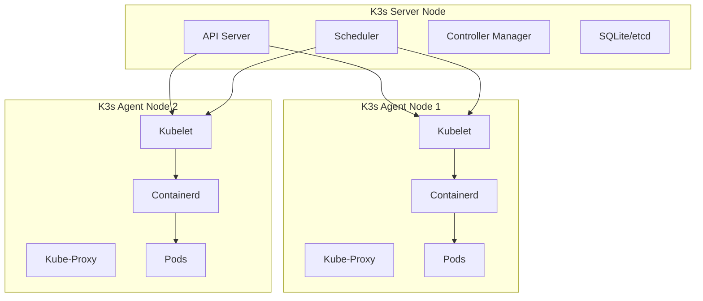
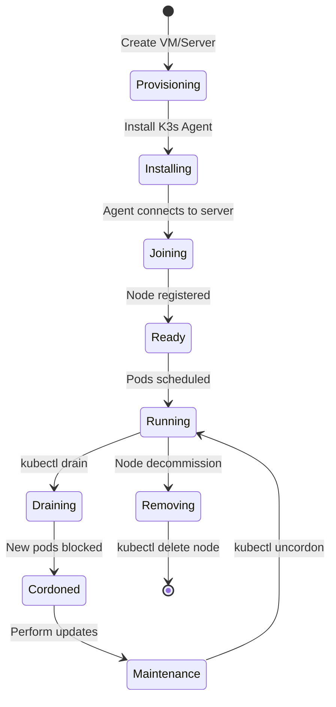
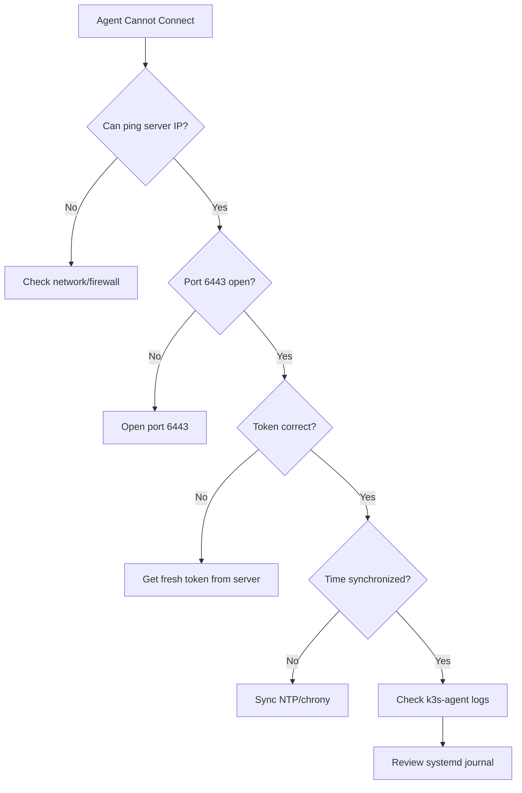
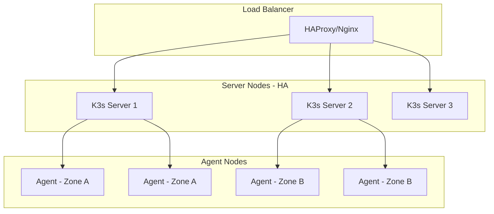

# How to Handle K3s Agent Nodes

Author: [nawazdhandala](https://www.github.com/nawazdhandala)

Tags: K3s, Kubernetes, DevOps, Cluster Management, Lightweight Kubernetes

Description: A practical guide to managing K3s agent nodes, covering installation, configuration, scaling, troubleshooting, and production best practices for lightweight Kubernetes deployments.

K3s has become the go-to solution for running Kubernetes in resource-constrained environments, edge deployments, and development clusters. Agent nodes form the backbone of your K3s cluster, running your actual workloads while the server nodes handle the control plane. Managing these agent nodes effectively is crucial for maintaining a healthy and scalable cluster.

## Understanding K3s Architecture

Before diving into agent node management, let's understand how K3s organizes its components.



Agent nodes communicate with the server through a secure tunnel, which simplifies networking and eliminates the need for complex firewall rules between nodes.

## Installing K3s Agent Nodes

### Prerequisites

Your agent node machines need to meet the following requirements:
- Linux-based operating system (Ubuntu, Debian, CentOS, RHEL, or similar)
- At least 512MB RAM (1GB recommended)
- Network connectivity to the K3s server

### Getting the Server Token

The first step is to retrieve the node token from your K3s server. Run the following command on the server node to obtain the authentication token that agent nodes will use to join the cluster.

```bash
# Retrieve the node-token from the K3s server
# The token file is created automatically during server installation
sudo cat /var/lib/rancher/k3s/server/node-token
```

### Joining an Agent to the Cluster

With the token in hand, you can now join agent nodes to your cluster. Replace the placeholder values with your actual server URL and token.

```bash
# Install K3s in agent mode
# K3S_URL points to the server's API endpoint (port 6443)
# K3S_TOKEN is the authentication token from the server
curl -sfL https://get.k3s.io | K3S_URL=https://your-server-ip:6443 K3S_TOKEN=your-node-token sh -
```

### Verifying Agent Registration

After installation completes, verify that your agent has successfully joined the cluster by running the following command on your server node.

```bash
# List all nodes in the cluster
# The new agent should appear with Ready status
kubectl get nodes -o wide
```

Expected output shows both server and agent nodes:

```
NAME          STATUS   ROLES                  AGE   VERSION
k3s-server    Ready    control-plane,master   2d    v1.28.4+k3s1
k3s-agent-1   Ready    <none>                 5m    v1.28.4+k3s1
```

## Configuring Agent Nodes

### Using Configuration Files

For production deployments, configuration files provide better maintainability than command-line flags. Create the configuration file before installing K3s.

```yaml
# /etc/rancher/k3s/config.yaml
# Agent node configuration file
# Place this file on the agent node before running the installer

# Server URL and authentication token
server: "https://your-server-ip:6443"
token: "your-node-token"

# Node labels help with workload scheduling
# Use labels to identify node characteristics
node-label:
  - "node-type=worker"
  - "environment=production"
  - "disk-type=ssd"

# Node taints prevent pods from scheduling unless they tolerate the taint
# Useful for dedicated workload nodes
node-taint:
  - "workload=database:NoSchedule"

# Container runtime socket path (default is containerd)
container-runtime-endpoint: "unix:///run/containerd/containerd.sock"

# Kubelet arguments for fine-tuning node behavior
kubelet-arg:
  - "max-pods=110"
  - "eviction-hard=memory.available<500Mi"
  - "eviction-soft=memory.available<1Gi"
  - "eviction-soft-grace-period=memory.available=2m"
```

### Environment Variables for Installation

Environment variables offer another way to configure agent nodes during installation. Create an environment file that the systemd service will source.

```bash
# /etc/rancher/k3s/k3s-agent.env
# Environment variables for K3s agent configuration

# Required: Server URL and token
K3S_URL=https://your-server-ip:6443
K3S_TOKEN=your-node-token

# Optional: Node name (defaults to hostname)
K3S_NODE_NAME=custom-agent-name

# Optional: Disable servicelb and traefik on agent
K3S_NODE_LABEL="tier=backend,zone=us-east-1a"
```

## Scaling Your Agent Node Pool

### Adding Multiple Agents with Automation

When scaling beyond a few nodes, automation becomes essential. The following script demonstrates how to provision multiple agent nodes programmatically.

```bash
#!/bin/bash
# scale-agents.sh
# Automated script for joining multiple agents to a K3s cluster
# Usage: ./scale-agents.sh server-ip token node1 node2 node3

# Validate input parameters
if [ "$#" -lt 3 ]; then
    echo "Usage: $0 <server-ip> <token> <agent-host1> [agent-host2] ..."
    exit 1
fi

SERVER_IP=$1
TOKEN=$2
shift 2  # Remove first two arguments, leaving only node hostnames

# K3s installation URL
K3S_INSTALL_URL="https://get.k3s.io"

# Loop through each agent hostname and install K3s
for AGENT_HOST in "$@"; do
    echo "Installing K3s agent on $AGENT_HOST..."

    # SSH to the agent and run the installer
    # Ensure SSH keys are configured for passwordless access
    ssh "$AGENT_HOST" "curl -sfL $K3S_INSTALL_URL | K3S_URL=https://$SERVER_IP:6443 K3S_TOKEN=$TOKEN sh -"

    if [ $? -eq 0 ]; then
        echo "Successfully installed K3s agent on $AGENT_HOST"
    else
        echo "Failed to install K3s agent on $AGENT_HOST"
    fi
done

echo "Agent installation complete. Verify with: kubectl get nodes"
```

### Using Labels for Node Organization

Labels help organize nodes and control workload placement. Apply labels that reflect your infrastructure topology and node capabilities.

```bash
# Add labels to identify node characteristics
# Hardware type labels
kubectl label node k3s-agent-1 hardware=high-memory

# Geographic labels for multi-region deployments
kubectl label node k3s-agent-2 topology.kubernetes.io/zone=us-west-2a

# Application tier labels
kubectl label node k3s-agent-3 tier=frontend

# Custom workload labels
kubectl label node k3s-agent-4 workload=ml-training gpu=nvidia-t4
```

## Node Lifecycle Management

The following diagram illustrates the typical lifecycle of a K3s agent node from provisioning to decommissioning.



### Draining Nodes for Maintenance

Before performing maintenance on an agent node, drain it to safely evict all running pods. Draining ensures workloads are rescheduled to other healthy nodes.

```bash
# Drain a node before maintenance
# --ignore-daemonsets: DaemonSet pods cannot be deleted
# --delete-emptydir-data: Delete pods using emptyDir volumes
# --grace-period: Time given to pods for graceful shutdown
kubectl drain k3s-agent-1 \
    --ignore-daemonsets \
    --delete-emptydir-data \
    --grace-period=60

# Verify no workload pods remain (only DaemonSets)
kubectl get pods --all-namespaces -o wide | grep k3s-agent-1
```

### Returning Nodes to Service

After completing maintenance, uncordon the node to allow new pods to be scheduled.

```bash
# Return node to active duty
# Removes the SchedulingDisabled taint
kubectl uncordon k3s-agent-1

# Verify node status
kubectl get node k3s-agent-1
```

### Removing Nodes Permanently

When decommissioning a node, follow these steps to cleanly remove it from the cluster.

```bash
# Step 1: Drain the node first
kubectl drain k3s-agent-old --ignore-daemonsets --delete-emptydir-data

# Step 2: Delete the node from cluster
kubectl delete node k3s-agent-old

# Step 3: On the agent node itself, uninstall K3s
# Run this command on the agent node being removed
sudo /usr/local/bin/k3s-agent-uninstall.sh
```

## Monitoring Agent Node Health

### Checking Node Conditions

Kubernetes exposes node conditions that indicate health status. Monitor these conditions to detect problems early.

```bash
# View detailed node status including conditions
# Shows Ready, MemoryPressure, DiskPressure, PIDPressure conditions
kubectl describe node k3s-agent-1 | grep -A 10 "Conditions:"
```

### Resource Monitoring Script

The following script provides a quick overview of resource utilization across all agent nodes.

```bash
#!/bin/bash
# monitor-agents.sh
# Quick health check for K3s agent nodes
# Displays CPU, memory, and pod counts

echo "=== K3s Agent Node Health Check ==="
echo ""

# Get node resource usage
# Requires metrics-server to be installed
echo "Resource Utilization:"
kubectl top nodes 2>/dev/null || echo "metrics-server not installed"
echo ""

# Check node conditions
echo "Node Conditions:"
kubectl get nodes -o custom-columns=\
'NAME:.metadata.name,'\
'STATUS:.status.conditions[?(@.type=="Ready")].status,'\
'MEMORY_PRESSURE:.status.conditions[?(@.type=="MemoryPressure")].status,'\
'DISK_PRESSURE:.status.conditions[?(@.type=="DiskPressure")].status'
echo ""

# Count pods per node
echo "Pod Distribution:"
kubectl get pods --all-namespaces -o wide --no-headers | \
    awk '{print $8}' | sort | uniq -c | sort -rn
```

### Setting Up Prometheus Monitoring

For production environments, integrate node monitoring with Prometheus. Apply the following ServiceMonitor to collect node metrics.

```yaml
# node-monitoring.yaml
# Prometheus ServiceMonitor for K3s node metrics
# Requires prometheus-operator or kube-prometheus-stack

apiVersion: monitoring.coreos.com/v1
kind: ServiceMonitor
metadata:
  name: k3s-node-monitor
  namespace: monitoring
  labels:
    release: prometheus
spec:
  # Match the kubelet service
  selector:
    matchLabels:
      app.kubernetes.io/name: kubelet
  endpoints:
    # Kubelet metrics endpoint
    - port: https-metrics
      scheme: https
      path: /metrics
      interval: 30s
      tlsConfig:
        insecureSkipVerify: true
      bearerTokenFile: /var/run/secrets/kubernetes.io/serviceaccount/token
    # cAdvisor metrics for container stats
    - port: https-metrics
      scheme: https
      path: /metrics/cadvisor
      interval: 30s
      tlsConfig:
        insecureSkipVerify: true
      bearerTokenFile: /var/run/secrets/kubernetes.io/serviceaccount/token
  namespaceSelector:
    matchNames:
      - kube-system
```

## Troubleshooting Common Issues

### Agent Cannot Connect to Server

Connection issues are the most common problem when setting up agent nodes. Follow this diagnostic flow.



Use these commands to diagnose connectivity problems.

```bash
# Test network connectivity to K3s server API
# Should return a certificate error (expected) or connection success
curl -k https://your-server-ip:6443/healthz

# Check if the K3s agent service is running
sudo systemctl status k3s-agent

# View agent logs for error messages
# Look for authentication failures or network timeouts
sudo journalctl -u k3s-agent -f --no-pager | tail -100

# Verify time synchronization (certificate validation requires accurate time)
timedatectl status
```

### Node Shows NotReady Status

When a node appears NotReady, several factors could be responsible. Run these diagnostics on the affected agent.

```bash
# Check kubelet status on the agent node
sudo systemctl status k3s-agent

# View recent kubelet logs
sudo journalctl -u k3s-agent --since "10 minutes ago" --no-pager

# Check disk space (DiskPressure condition)
df -h /var/lib/rancher

# Check memory availability (MemoryPressure condition)
free -h

# Verify container runtime is functioning
sudo crictl info
sudo crictl ps

# Check for networking issues
sudo crictl pods
```

### Recovering a Failed Agent

Sometimes agents need to be reset and rejoined. Use the following procedure for a clean restart.

```bash
# Stop the K3s agent service
sudo systemctl stop k3s-agent

# Remove K3s agent data (preserves containerd images)
sudo rm -rf /var/lib/rancher/k3s/agent

# Remove the node from the cluster (run on server)
kubectl delete node failed-agent-name

# Restart the agent service to rejoin
sudo systemctl start k3s-agent

# Verify the node rejoins
kubectl get nodes -w
```

## Production Best Practices

### High Availability Considerations

For production deployments, consider these architectural recommendations.



### Resource Reservations

Reserve resources on agent nodes to ensure system stability. Configure kubelet to set aside resources for system processes.

```yaml
# /etc/rancher/k3s/config.yaml
# Production-ready agent configuration with resource reservations

server: "https://lb.your-domain.com:6443"
token-file: "/etc/rancher/k3s/token"

# Reserve resources for system processes
kubelet-arg:
  # Reserve CPU and memory for kubelet and system services
  - "kube-reserved=cpu=200m,memory=256Mi"
  - "system-reserved=cpu=200m,memory=256Mi"
  # Enforce resource limits
  - "enforce-node-allocatable=pods,kube-reserved,system-reserved"
  # Set eviction thresholds to protect node stability
  - "eviction-hard=memory.available<500Mi,nodefs.available<10%"
  - "eviction-soft=memory.available<1Gi,nodefs.available<15%"
  - "eviction-soft-grace-period=memory.available=2m,nodefs.available=2m"
  # Maximum pods based on node capacity
  - "max-pods=100"

# Security configurations
protect-kernel-defaults: true
```

### Automated Node Registration with Cloud-Init

For cloud deployments, use cloud-init to automatically register agent nodes on first boot.

```yaml
#cloud-config
# cloud-init configuration for K3s agent auto-registration
# Use with cloud providers that support cloud-init

package_update: true
package_upgrade: true

packages:
  - curl
  - nfs-common

write_files:
  # K3s agent configuration
  - path: /etc/rancher/k3s/config.yaml
    content: |
      server: "https://k3s.your-domain.com:6443"
      token: "your-cluster-token"
      node-label:
        - "provisioner=cloud-init"
        - "cloud-provider=aws"
    permissions: '0600'

runcmd:
  # Install K3s agent
  - curl -sfL https://get.k3s.io | INSTALL_K3S_EXEC="agent" sh -
  # Verify installation
  - systemctl status k3s-agent
```

## Conclusion

Managing K3s agent nodes effectively requires understanding the cluster architecture, implementing proper lifecycle management, and following production best practices. By using configuration files, automation scripts, and proper monitoring, you can maintain a healthy and scalable K3s cluster.

Key takeaways:
- Always use configuration files for production deployments
- Label nodes appropriately for workload scheduling
- Drain nodes before maintenance to avoid disruption
- Monitor node health proactively with metrics and alerts
- Implement resource reservations to protect node stability

**Related Reading:**

- [How to configure MetalLB with Kubernetes (Microk8s)](https://oneuptime.com/blog/post/2023-11-06-configure-metallb-with-kubernetes-microk8s/view)
- [Python Health Checks in Kubernetes](https://oneuptime.com/blog/post/2025-01-06-python-health-checks-kubernetes/view)
- [Python Graceful Shutdown in Kubernetes](https://oneuptime.com/blog/post/2025-01-06-python-graceful-shutdown-kubernetes/view)
