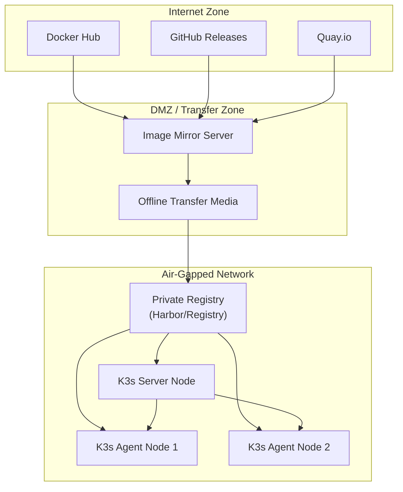
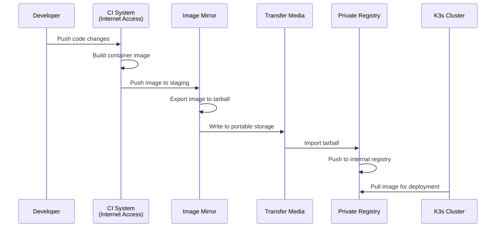
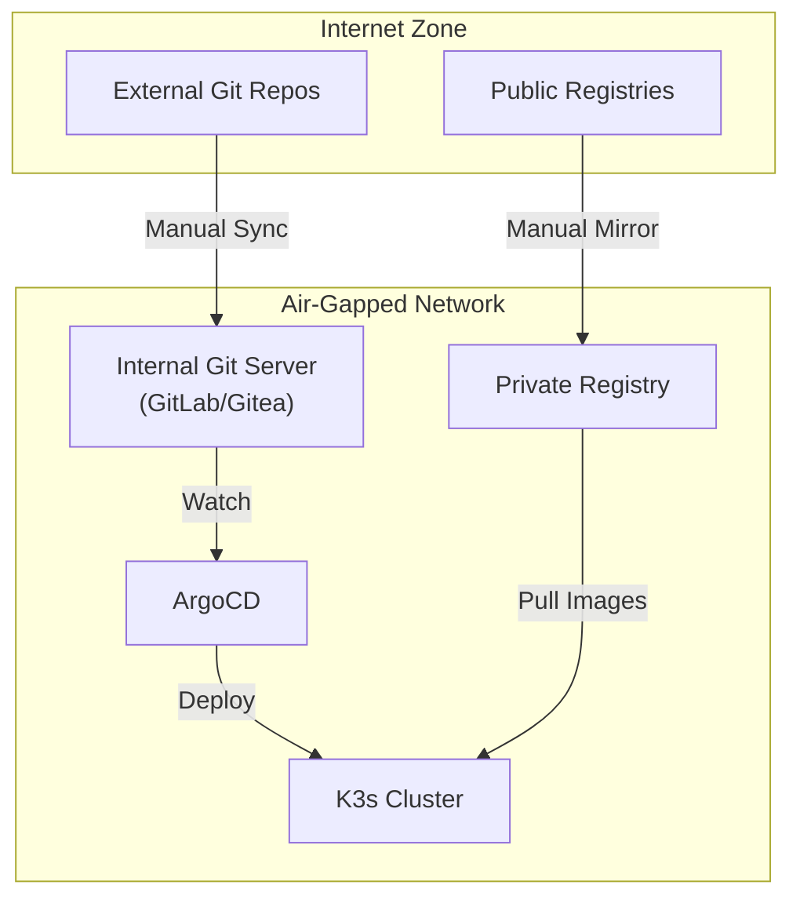

# How to Configure K3s for Air-Gapped Environments

Author: [nawazdhandala](https://www.github.com/nawazdhandala)

Tags: K3s, Kubernetes, Air-Gapped, Security, DevOps, Edge Computing, Offline, Container Registry

Description: A practical guide to deploying and managing K3s clusters in air-gapped environments where internet access is restricted or unavailable, covering image mirroring, private registries, and offline installation techniques.

---

Running Kubernetes in environments without internet access presents unique challenges that standard tutorials rarely address. Government agencies, financial institutions, industrial facilities, and military installations often mandate air-gapped deployments for security compliance. K3s, with its single-binary design and minimal dependencies, makes an excellent choice for these scenarios.

If you are new to Kubernetes distributions, check out [Choosing the Right Kubernetes Distribution](https://oneuptime.com/blog/post/2025-11-27-choosing-the-right-kubernetes-distribution/view) before diving into air-gapped specifics.

## Why K3s for Air-Gapped Deployments?

K3s offers several advantages over full Kubernetes distributions when network isolation is required:

- **Single binary:** The entire K3s distribution ships as one executable under 100MB
- **Embedded components:** etcd, containerd, and CoreDNS come bundled, reducing external dependencies
- **SQLite option:** No need for external database infrastructure in small deployments
- **Minimal container images:** Fewer base images to mirror compared to kubeadm clusters

## Architecture Overview

Before configuring anything, understanding the air-gapped architecture helps avoid common pitfalls.



The key insight: you need a process to move container images and K3s binaries from the internet into your isolated network. Most organizations use a DMZ server that pulls images, writes them to portable media, and then imports them into the air-gapped registry.

## Step 1: Prepare the Air-Gapped Bundle

On a machine with internet access, download everything K3s needs.

The following script downloads the K3s binary, installation script, and required container images for a specific version.

```bash
#!/bin/bash
# download-k3s-bundle.sh
# Run this script on a machine with internet access

K3S_VERSION="v1.29.0+k3s1"
BUNDLE_DIR="./k3s-airgap-bundle"

# Create bundle directory structure
mkdir -p "${BUNDLE_DIR}/bin"
mkdir -p "${BUNDLE_DIR}/images"

# Download K3s binary
echo "Downloading K3s binary..."
curl -Lo "${BUNDLE_DIR}/bin/k3s" \
    "https://github.com/k3s-io/k3s/releases/download/${K3S_VERSION}/k3s"
chmod +x "${BUNDLE_DIR}/bin/k3s"

# Download the K3s installation script
echo "Downloading install script..."
curl -Lo "${BUNDLE_DIR}/install.sh" \
    "https://get.k3s.io"
chmod +x "${BUNDLE_DIR}/install.sh"

# Download the air-gap images tarball provided by K3s
echo "Downloading air-gap images..."
curl -Lo "${BUNDLE_DIR}/images/k3s-airgap-images-amd64.tar.zst" \
    "https://github.com/k3s-io/k3s/releases/download/${K3S_VERSION}/k3s-airgap-images-amd64.tar.zst"

# Download checksums for verification
curl -Lo "${BUNDLE_DIR}/sha256sum.txt" \
    "https://github.com/k3s-io/k3s/releases/download/${K3S_VERSION}/sha256sum-amd64.txt"

echo "Bundle ready at ${BUNDLE_DIR}"
echo "Transfer this directory to your air-gapped environment"
```

The K3s project publishes pre-built image tarballs for each release, which saves you from manually exporting dozens of images.

## Step 2: Set Up a Private Container Registry

Your air-gapped network needs a container registry to serve images to K3s nodes. Harbor and Docker Registry are popular choices.

The following Docker Compose file deploys a basic registry with persistent storage. For production, add TLS and authentication.

```yaml
# docker-compose.yml for private registry
version: "3.8"

services:
  registry:
    image: registry:2
    container_name: airgap-registry
    restart: always
    ports:
      - "5000:5000"
    environment:
      # Storage configuration
      REGISTRY_STORAGE_FILESYSTEM_ROOTDIRECTORY: /var/lib/registry
      # Enable deletion API for cleanup
      REGISTRY_STORAGE_DELETE_ENABLED: "true"
      # HTTP settings (use TLS in production)
      REGISTRY_HTTP_ADDR: 0.0.0.0:5000
    volumes:
      - registry-data:/var/lib/registry
      - ./config.yml:/etc/docker/registry/config.yml:ro

volumes:
  registry-data:
    driver: local
```

For production deployments, Harbor provides vulnerability scanning, replication, and RBAC.

The following script imports the K3s images into your private registry after transferring the bundle.

```bash
#!/bin/bash
# import-images.sh
# Run this on your air-gapped registry server

REGISTRY_HOST="registry.internal.local:5000"
BUNDLE_DIR="/path/to/k3s-airgap-bundle"

# Load images from the tarball into local containerd/docker
echo "Loading images from tarball..."
zstd -d -c "${BUNDLE_DIR}/images/k3s-airgap-images-amd64.tar.zst" | \
    docker load

# Get list of loaded images
IMAGES=$(docker images --format "{{.Repository}}:{{.Tag}}" | grep -E "rancher|k3s|coredns|traefik|pause")

# Retag and push each image to the private registry
for IMAGE in ${IMAGES}; do
    # Extract the image name without the original registry prefix
    IMAGE_NAME=$(echo "${IMAGE}" | sed 's|.*/||')

    echo "Pushing ${IMAGE_NAME} to ${REGISTRY_HOST}..."
    docker tag "${IMAGE}" "${REGISTRY_HOST}/${IMAGE_NAME}"
    docker push "${REGISTRY_HOST}/${IMAGE_NAME}"
done

echo "All images pushed to ${REGISTRY_HOST}"
```

## Step 3: Configure K3s to Use Your Private Registry

K3s needs to know where to pull images from instead of the public internet. Create a registries configuration file on each node before installation.

The registries.yaml file tells K3s to redirect image pulls from public registries to your private registry.

```yaml
# /etc/rancher/k3s/registries.yaml
# Place this file on every K3s node before installation

mirrors:
  # Redirect Docker Hub requests
  docker.io:
    endpoint:
      - "http://registry.internal.local:5000"

  # Redirect GitHub Container Registry
  ghcr.io:
    endpoint:
      - "http://registry.internal.local:5000"

  # Redirect Quay.io
  quay.io:
    endpoint:
      - "http://registry.internal.local:5000"

# If your registry requires authentication
configs:
  "registry.internal.local:5000":
    auth:
      username: admin
      password: secretpassword
    # For registries with self-signed certificates
    tls:
      insecure_skip_verify: false
      ca_file: /etc/rancher/k3s/registry-ca.crt
```

## Step 4: Install K3s Without Internet Access

With the bundle transferred and registry configured, install K3s using the offline installation method.

The following commands install the K3s server node using local binaries and images, with no internet required.

```bash
#!/bin/bash
# install-k3s-server.sh
# Run this on your K3s server node

BUNDLE_DIR="/path/to/k3s-airgap-bundle"
REGISTRY_HOST="registry.internal.local:5000"

# Create required directories
sudo mkdir -p /var/lib/rancher/k3s/agent/images/
sudo mkdir -p /etc/rancher/k3s/

# Copy the K3s binary to the expected location
sudo cp "${BUNDLE_DIR}/bin/k3s" /usr/local/bin/k3s
sudo chmod +x /usr/local/bin/k3s

# Copy the air-gap images to the K3s images directory
# K3s will automatically import images from this location
sudo cp "${BUNDLE_DIR}/images/k3s-airgap-images-amd64.tar.zst" \
    /var/lib/rancher/k3s/agent/images/

# Ensure registries.yaml is in place
# (You should have created this in Step 3)

# Install K3s using the offline installation script
# INSTALL_K3S_SKIP_DOWNLOAD tells the script to use existing binary
export INSTALL_K3S_SKIP_DOWNLOAD=true

# Run the installation script
sudo "${BUNDLE_DIR}/install.sh" \
    --system-default-registry "${REGISTRY_HOST}" \
    --disable traefik \
    --write-kubeconfig-mode 644

# Verify the installation
sudo k3s kubectl get nodes
```

The `--system-default-registry` flag prepends your registry URL to all image references, ensuring K3s pulls from your private registry.

## Step 5: Join Agent Nodes

Agent nodes require the same preparation but join an existing cluster instead of initializing one.

First, retrieve the node token from the server, then use it to join agent nodes.

```bash
#!/bin/bash
# install-k3s-agent.sh
# Run this on each K3s agent node

BUNDLE_DIR="/path/to/k3s-airgap-bundle"
K3S_SERVER="https://k3s-server.internal.local:6443"
# Get this token from /var/lib/rancher/k3s/server/node-token on server
K3S_TOKEN="your-node-token-here"
REGISTRY_HOST="registry.internal.local:5000"

# Create required directories
sudo mkdir -p /var/lib/rancher/k3s/agent/images/
sudo mkdir -p /etc/rancher/k3s/

# Copy the K3s binary
sudo cp "${BUNDLE_DIR}/bin/k3s" /usr/local/bin/k3s
sudo chmod +x /usr/local/bin/k3s

# Copy air-gap images
sudo cp "${BUNDLE_DIR}/images/k3s-airgap-images-amd64.tar.zst" \
    /var/lib/rancher/k3s/agent/images/

# Ensure registries.yaml exists (same as server)

# Install as agent
export INSTALL_K3S_SKIP_DOWNLOAD=true
export K3S_URL="${K3S_SERVER}"
export K3S_TOKEN="${K3S_TOKEN}"

sudo "${BUNDLE_DIR}/install.sh" agent \
    --system-default-registry "${REGISTRY_HOST}"
```

## Deploying Workloads in Air-Gapped Clusters

Every container image your applications need must exist in your private registry. The following workflow ensures new deployments succeed.



The following script helps you identify and mirror additional images required by Helm charts or Kubernetes manifests.

```bash
#!/bin/bash
# extract-images-from-manifests.sh
# Extracts all container images referenced in Kubernetes manifests

MANIFEST_DIR="./k8s-manifests"
OUTPUT_FILE="./required-images.txt"

# Find all image references in YAML files
grep -rhE "image:\s*" "${MANIFEST_DIR}" | \
    sed 's/.*image:\s*//' | \
    sed 's/"//g' | \
    sed "s/'//g" | \
    tr -d ' ' | \
    sort -u > "${OUTPUT_FILE}"

echo "Found the following images:"
cat "${OUTPUT_FILE}"

# Optionally pull and save all images for transfer
echo ""
echo "To download these images, run:"
while read -r IMAGE; do
    echo "docker pull ${IMAGE}"
done < "${OUTPUT_FILE}"
```

## Managing Upgrades in Air-Gapped Environments

Upgrading K3s without internet access requires planning. Download new versions during maintenance windows and stage them before the upgrade.

```mermaid
flowchart LR
    subgraph Preparation["Preparation Phase"]
        Download["Download New\nK3s Version"]
        Test["Test in\nStaging Environment"]
        Bundle["Create Upgrade\nBundle"]
    end

    subgraph Transfer["Transfer Phase"]
        Export["Export to\nPortable Media"]
        Import["Import to\nAir-Gapped Network"]
        Stage["Stage in\nPrivate Registry"]
    end

    subgraph Upgrade["Upgrade Phase"]
        Backup["Backup etcd\nand Configs"]
        UpgradeServer["Upgrade Server\nNodes"]
        UpgradeAgents["Upgrade Agent\nNodes"]
        Verify["Verify Cluster\nHealth"]
    end

    Download --> Test --> Bundle
    Bundle --> Export --> Import --> Stage
    Stage --> Backup --> UpgradeServer --> UpgradeAgents --> Verify
```



The following script performs an in-place upgrade of K3s nodes using pre-staged binaries.

```bash
#!/bin/bash
# upgrade-k3s.sh
# Upgrade K3s on a single node (run on each node sequentially)

NEW_VERSION_DIR="/path/to/k3s-v1.30.0-bundle"
BACKUP_DIR="/var/lib/rancher/k3s-backup-$(date +%Y%m%d)"

# Create backup of current installation
echo "Creating backup..."
sudo mkdir -p "${BACKUP_DIR}"
sudo cp /usr/local/bin/k3s "${BACKUP_DIR}/"
sudo cp -r /var/lib/rancher/k3s/server/db "${BACKUP_DIR}/" 2>/dev/null || true

# Stop K3s service
echo "Stopping K3s..."
sudo systemctl stop k3s

# Replace binary
echo "Installing new binary..."
sudo cp "${NEW_VERSION_DIR}/bin/k3s" /usr/local/bin/k3s
sudo chmod +x /usr/local/bin/k3s

# Update air-gap images
echo "Updating air-gap images..."
sudo cp "${NEW_VERSION_DIR}/images/k3s-airgap-images-amd64.tar.zst" \
    /var/lib/rancher/k3s/agent/images/

# Start K3s
echo "Starting K3s..."
sudo systemctl start k3s

# Wait for node to become ready
echo "Waiting for node to become ready..."
sleep 30
sudo k3s kubectl get nodes

echo "Upgrade complete. Verify workloads before proceeding to next node."
```

## Troubleshooting Common Issues

### Image Pull Failures

When pods fail with `ImagePullBackOff`, the image likely does not exist in your private registry.

The following commands help diagnose image pull problems in air-gapped clusters.

```bash
# Check if the image exists in your registry
curl -s http://registry.internal.local:5000/v2/_catalog | jq

# List tags for a specific image
curl -s http://registry.internal.local:5000/v2/pause/tags/list | jq

# Check K3s containerd for cached images
sudo k3s ctr images ls | grep -i pause

# View detailed pod events
kubectl describe pod <pod-name> -n <namespace>

# Check registries.yaml is correctly loaded
sudo cat /var/lib/rancher/k3s/agent/etc/containerd/config.toml
```

### Certificate Errors

Self-signed certificates require proper CA distribution to all nodes.

The following configuration adds your CA certificate to the K3s trust store.

```yaml
# /etc/rancher/k3s/registries.yaml
configs:
  "registry.internal.local:5000":
    tls:
      # Path to your CA certificate
      ca_file: /etc/rancher/k3s/certs/registry-ca.crt
      # Only use insecure_skip_verify for testing
      insecure_skip_verify: false
```

### DNS Resolution Issues

Air-gapped networks often lack proper DNS. Add static entries if needed.

```bash
# Add to /etc/hosts on each node
192.168.1.10    registry.internal.local
192.168.1.20    k3s-server.internal.local
```

## Security Hardening for Air-Gapped K3s

Air-gapped deployments often exist for security reasons. Apply these additional hardening steps.

The following K3s server configuration enables CIS benchmark compliance mode.

```bash
# install-hardened-k3s.sh
# Hardened installation for security-sensitive environments

sudo "${BUNDLE_DIR}/install.sh" \
    --system-default-registry "${REGISTRY_HOST}" \
    --protect-kernel-defaults \
    --secrets-encryption \
    --write-kubeconfig-mode 600 \
    --kube-apiserver-arg="audit-log-path=/var/lib/rancher/k3s/server/logs/audit.log" \
    --kube-apiserver-arg="audit-log-maxage=30" \
    --kube-apiserver-arg="audit-log-maxbackup=10" \
    --kube-apiserver-arg="audit-log-maxsize=100" \
    --kube-apiserver-arg="anonymous-auth=false"
```

## Monitoring Air-Gapped Clusters

Observability remains critical even without internet access. Deploy monitoring components from your private registry.

The following manifest deploys a Prometheus stack using pre-mirrored images.

```yaml
# prometheus-values.yaml for Helm chart
# Override all images to use your private registry

global:
  imageRegistry: registry.internal.local:5000

prometheus:
  prometheusSpec:
    image:
      repository: prometheus/prometheus
      tag: v2.48.0

    # Retention settings for air-gapped environments
    retention: 30d
    retentionSize: 50GB

    # Storage configuration
    storageSpec:
      volumeClaimTemplate:
        spec:
          accessModes: ["ReadWriteOnce"]
          resources:
            requests:
              storage: 100Gi

alertmanager:
  alertmanagerSpec:
    image:
      repository: prometheus/alertmanager
      tag: v0.26.0
```

For comprehensive observability, consider integrating with OneUptime, which supports on-premises deployment for air-gapped environments. See [Three Pillars of Observability](https://oneuptime.com/blog/post/2025-08-20-three-pillars-of-observability-logs-metrics-traces/view) for guidance on structuring your monitoring approach.

## Automation with GitOps

Even air-gapped environments benefit from GitOps workflows. Run an internal Git server and ArgoCD to manage deployments.



The following ArgoCD configuration works with an internal Git server.

```yaml
# argocd-repo-secret.yaml
apiVersion: v1
kind: Secret
metadata:
  name: internal-repo
  namespace: argocd
  labels:
    argocd.argoproj.io/secret-type: repository
stringData:
  type: git
  url: https://git.internal.local/platform/k8s-manifests.git
  username: argocd
  password: <your-token>
  # For self-signed certificates
  insecure: "false"
  tlsClientCertData: |
    -----BEGIN CERTIFICATE-----
    ...
    -----END CERTIFICATE-----
```

## Summary

Deploying K3s in air-gapped environments requires upfront planning but pays dividends in security and compliance. The key steps are:

1. **Download bundles** on internet-connected systems
2. **Mirror images** to a private registry inside your air gap
3. **Configure registries.yaml** on every node before installation
4. **Use offline installation** with `INSTALL_K3S_SKIP_DOWNLOAD`
5. **Plan upgrade cycles** with staged binary and image transfers

K3s makes air-gapped Kubernetes practical by minimizing dependencies and providing official image tarballs. Combined with GitOps tooling and proper observability, you can run production workloads in the most restricted network environments.

For edge deployments that reconnect periodically, consider [Kubernetes Multi-Cluster for High Availability](https://oneuptime.com/blog/post/2026-01-06-kubernetes-multi-cluster-high-availability/view) for strategies on syncing state across disconnected sites.
