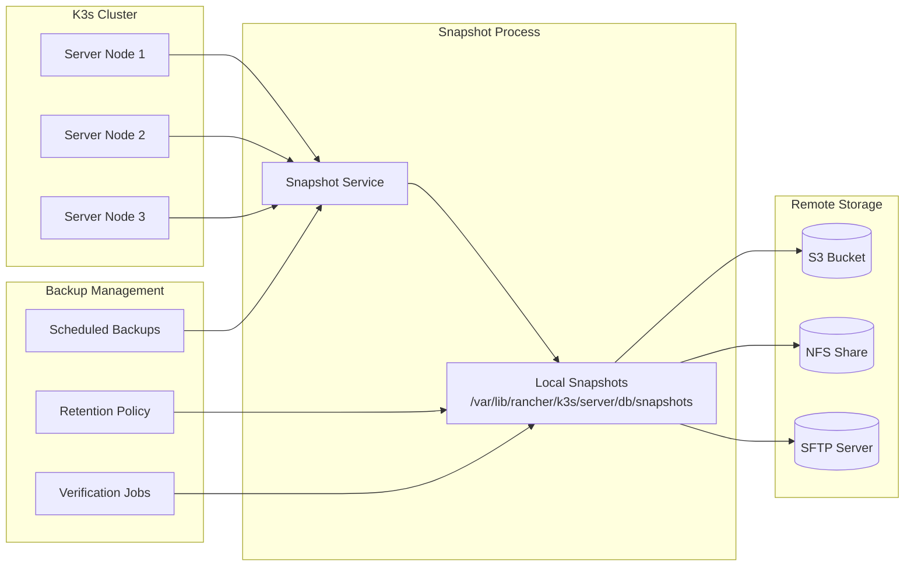
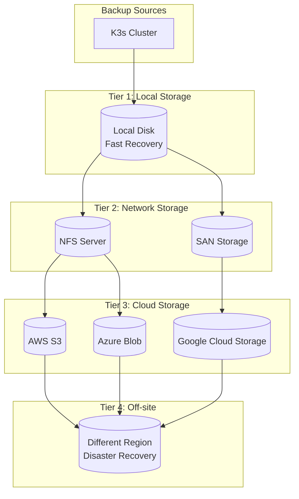
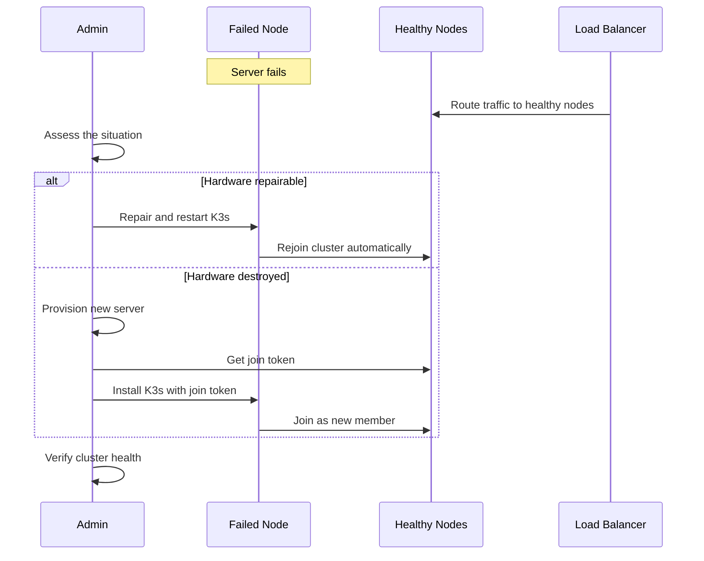

# How to Handle K3s Backup and Restore

Author: [nawazdhandala](https://github.com/nawazdhandala)

Tags: K3s, Kubernetes, Backup, Restore, Disaster Recovery, etcd, DevOps, Infrastructure

Description: A comprehensive guide to backing up and restoring K3s clusters, covering etcd snapshots, automated backup strategies, disaster recovery procedures, and production best practices for protecting your Kubernetes data.

---

Losing your Kubernetes cluster state ranks among the worst operational nightmares. All those deployments, secrets, configurations, and persistent volume claims can vanish in an instant without proper backup procedures. K3s makes running lightweight Kubernetes simple, but simplicity should never mean skipping data protection.

Backups serve two critical purposes: protecting against data corruption and enabling disaster recovery. Whether your server catches fire, someone accidentally deletes the wrong namespace, or a software bug corrupts your etcd database, a tested backup strategy ensures you can recover. K3s provides built-in tools for etcd snapshots along with flexible options for comprehensive cluster protection.

## Table of Contents

1. [Understanding K3s Data Storage](#understanding-k3s-data-storage)
2. [K3s Backup Architecture](#k3s-backup-architecture)
3. [Built-in etcd Snapshot Commands](#built-in-etcd-snapshot-commands)
4. [Configuring Automated Snapshots](#configuring-automated-snapshots)
5. [Manual Backup Procedures](#manual-backup-procedures)
6. [Backing Up External Datastores](#backing-up-external-datastores)
7. [Backup Storage Best Practices](#backup-storage-best-practices)
8. [Restoring from etcd Snapshots](#restoring-from-etcd-snapshots)
9. [Disaster Recovery Scenarios](#disaster-recovery-scenarios)
10. [Backup Verification and Testing](#backup-verification-and-testing)
11. [Monitoring Backup Health](#monitoring-backup-health)
12. [Conclusion](#conclusion)

## Understanding K3s Data Storage

Before diving into backup procedures, understanding where K3s stores its data helps you build a comprehensive backup strategy. K3s consolidates cluster state into a few key locations.

```mermaid
graph TB
    subgraph "K3s Server Node"
        subgraph "Configuration"
            C1[/etc/rancher/k3s/k3s.yaml<br/>Kubeconfig]
            C2[/etc/rancher/k3s/config.yaml<br/>Server Config]
        end

        subgraph "Data Storage"
            D1[/var/lib/rancher/k3s/server/db<br/>etcd Data or SQLite]
            D2[/var/lib/rancher/k3s/server/tls<br/>Certificates]
            D3[/var/lib/rancher/k3s/server/cred<br/>Credentials]
            D4[/var/lib/rancher/k3s/server/manifests<br/>Auto-deploy Manifests]
        end

        subgraph "Runtime"
            R1[/var/lib/rancher/k3s/agent<br/>Containerd Data]
        end
    end

    subgraph "External Resources"
        E1[(External Database<br/>PostgreSQL/MySQL)]
        E2[Persistent Volumes<br/>Application Data]
    end
```

### Critical Data Components

**etcd or SQLite Database**: Contains all Kubernetes objects including deployments, services, secrets, configmaps, and custom resources. Single-node K3s uses SQLite by default, while multi-node HA clusters use embedded etcd.

**TLS Certificates**: Secure communication between cluster components. Losing these requires regenerating certificates and potentially rejoining nodes.

**Server Token**: The shared secret that allows nodes to authenticate with the cluster. Found in `/var/lib/rancher/k3s/server/token`.

**Auto-deploy Manifests**: YAML files in `/var/lib/rancher/k3s/server/manifests/` are automatically applied to the cluster on startup.

### What Backups Cover

K3s snapshots capture the cluster state stored in etcd or SQLite. However, they do not include:

- Data stored in Persistent Volumes (PVs)
- Container images cached on nodes
- Application logs
- External databases used by your applications

You need separate backup strategies for application data stored in persistent volumes.

## K3s Backup Architecture

A robust backup architecture addresses multiple failure scenarios while maintaining operational simplicity.



### Backup Strategy Tiers

**Tier 1 - Local Snapshots**: Fast recovery for minor issues. Keep recent snapshots on the server for quick restoration.

**Tier 2 - Remote Storage**: Protection against server loss. Copy snapshots to S3, NFS, or another remote location.

**Tier 3 - Off-site Backups**: Disaster recovery for catastrophic events. Store copies in a different geographic region.

## Built-in etcd Snapshot Commands

K3s includes commands for creating and managing etcd snapshots directly. These commands work with both embedded etcd and SQLite datastores.

### Creating On-Demand Snapshots

The following command creates an immediate snapshot with a custom name. Run this before major changes or maintenance operations.

```bash
# Create an on-demand snapshot with a descriptive name
# The snapshot is stored in the default snapshot directory
sudo k3s etcd-snapshot save --name "pre-upgrade-$(date +%Y%m%d-%H%M%S)"

# Verify the snapshot was created successfully
sudo k3s etcd-snapshot list
```

### Listing Available Snapshots

View all available snapshots with their metadata including creation time and size.

```bash
# List all local snapshots with details
# Shows snapshot name, creation time, and file size
sudo k3s etcd-snapshot list

# List snapshots with additional metadata
# Useful for verifying snapshot health
sudo k3s etcd-snapshot list --format json | jq '.'
```

### Deleting Old Snapshots

Remove specific snapshots manually when you need to free disk space or clean up after testing.

```bash
# Delete a specific snapshot by name
# Use the exact name from the snapshot list
sudo k3s etcd-snapshot delete snapshot-name-here

# List remaining snapshots to confirm deletion
sudo k3s etcd-snapshot list
```

### Snapshot Command Options

K3s provides various options for customizing snapshot behavior.

```bash
# Create a snapshot with a custom storage directory
# Useful when the default location has limited space
sudo k3s etcd-snapshot save \
    --name "custom-location-backup" \
    --dir /backup/k3s/snapshots

# Create a snapshot and immediately push to S3
# Requires S3 credentials configured in K3s
sudo k3s etcd-snapshot save \
    --name "s3-backup-$(date +%Y%m%d)" \
    --s3 \
    --s3-bucket=my-k3s-backups \
    --s3-region=us-west-2 \
    --s3-endpoint=s3.us-west-2.amazonaws.com \
    --s3-access-key="$AWS_ACCESS_KEY" \
    --s3-secret-key="$AWS_SECRET_KEY"
```

## Configuring Automated Snapshots

Manual snapshots work for one-time events, but production clusters need automated backup schedules. K3s supports cron-based snapshot scheduling.

### Server Configuration for Automated Snapshots

Configure automated snapshots by adding flags to the K3s server startup. Create a systemd drop-in file to persist these settings.

```bash
# Create a systemd drop-in directory for K3s
sudo mkdir -p /etc/systemd/system/k3s.service.d

# Create the configuration file with snapshot settings
# Adjust the cron schedule and retention based on your needs
sudo tee /etc/systemd/system/k3s.service.d/snapshots.conf <<'EOF'
[Service]
# Override the ExecStart to add snapshot configuration
ExecStart=
ExecStart=/usr/local/bin/k3s server \
    --etcd-snapshot-schedule-cron="0 */6 * * *" \
    --etcd-snapshot-retention=24 \
    --etcd-snapshot-compress
EOF

# Reload systemd to pick up the changes
sudo systemctl daemon-reload

# Restart K3s to apply the new configuration
sudo systemctl restart k3s

# Verify K3s started successfully with new settings
sudo systemctl status k3s
```

### Configuration File Approach

Alternatively, use the K3s configuration file for cleaner management of multiple settings.

```yaml
# /etc/rancher/k3s/config.yaml
# K3s server configuration with automated snapshot settings

# Snapshot schedule using cron syntax
# "0 */6 * * *" means every 6 hours at minute 0
etcd-snapshot-schedule-cron: "0 */6 * * *"

# Number of snapshots to retain locally
# Older snapshots are automatically deleted
etcd-snapshot-retention: 24

# Enable compression to reduce storage requirements
# Compressed snapshots use gzip format
etcd-snapshot-compress: true

# Custom snapshot directory (optional)
# Default is /var/lib/rancher/k3s/server/db/snapshots
etcd-snapshot-dir: /var/lib/rancher/k3s/server/db/snapshots
```

### S3 Integration for Automated Backups

Configure K3s to automatically push snapshots to S3-compatible storage.

```yaml
# /etc/rancher/k3s/config.yaml
# Configuration for automated S3 backup integration

# Local snapshot settings
etcd-snapshot-schedule-cron: "0 */4 * * *"
etcd-snapshot-retention: 12

# S3 backup settings
etcd-s3: true
etcd-s3-bucket: k3s-cluster-backups
etcd-s3-region: us-west-2
etcd-s3-endpoint: s3.us-west-2.amazonaws.com
etcd-s3-folder: production-cluster

# S3 credentials can also be set via environment variables
# AWS_ACCESS_KEY_ID and AWS_SECRET_ACCESS_KEY
```

Set up S3 credentials securely using environment variables in the systemd service.

```bash
# Create environment file for S3 credentials
# Protect this file with appropriate permissions
sudo tee /etc/rancher/k3s/s3-credentials.env <<'EOF'
AWS_ACCESS_KEY_ID=your-access-key-here
AWS_SECRET_ACCESS_KEY=your-secret-key-here
EOF

# Set restrictive permissions on the credentials file
sudo chmod 600 /etc/rancher/k3s/s3-credentials.env

# Add environment file to K3s service
sudo tee -a /etc/systemd/system/k3s.service.d/snapshots.conf <<'EOF'
EnvironmentFile=/etc/rancher/k3s/s3-credentials.env
EOF

# Reload and restart K3s
sudo systemctl daemon-reload
sudo systemctl restart k3s
```

## Manual Backup Procedures

Beyond etcd snapshots, comprehensive backups should include additional cluster components. The following script creates a complete backup package.

### Complete Backup Script

```bash
#!/bin/bash
# k3s-full-backup.sh
# Creates a comprehensive backup of K3s cluster state and configuration
# Run on a server node with kubectl access

set -euo pipefail

# Configuration variables
BACKUP_BASE="/backup/k3s"
BACKUP_NAME="k3s-backup-$(date +%Y%m%d-%H%M%S)"
BACKUP_DIR="${BACKUP_BASE}/${BACKUP_NAME}"
RETENTION_DAYS=30

echo "=========================================="
echo "K3s Full Backup Script"
echo "Backup Name: ${BACKUP_NAME}"
echo "=========================================="

# Create backup directory structure
mkdir -p "${BACKUP_DIR}"/{etcd,config,tls,manifests,resources}

# Step 1: Create etcd snapshot
echo "[1/6] Creating etcd snapshot..."
sudo k3s etcd-snapshot save \
    --name "${BACKUP_NAME}" \
    --dir "${BACKUP_DIR}/etcd"

# Step 2: Backup K3s configuration
echo "[2/6] Backing up K3s configuration..."
sudo cp /etc/rancher/k3s/k3s.yaml "${BACKUP_DIR}/config/" 2>/dev/null || true
sudo cp /etc/rancher/k3s/config.yaml "${BACKUP_DIR}/config/" 2>/dev/null || true
sudo cp /var/lib/rancher/k3s/server/token "${BACKUP_DIR}/config/" 2>/dev/null || true

# Step 3: Backup TLS certificates
echo "[3/6] Backing up TLS certificates..."
sudo cp -r /var/lib/rancher/k3s/server/tls/* "${BACKUP_DIR}/tls/"

# Step 4: Backup auto-deploy manifests
echo "[4/6] Backing up auto-deploy manifests..."
if [ -d /var/lib/rancher/k3s/server/manifests ]; then
    sudo cp -r /var/lib/rancher/k3s/server/manifests/* "${BACKUP_DIR}/manifests/"
fi

# Step 5: Export critical Kubernetes resources
echo "[5/6] Exporting Kubernetes resources..."

# Cluster-scoped resources
kubectl get namespaces -o yaml > "${BACKUP_DIR}/resources/namespaces.yaml"
kubectl get clusterroles -o yaml > "${BACKUP_DIR}/resources/clusterroles.yaml" 2>/dev/null || true
kubectl get clusterrolebindings -o yaml > "${BACKUP_DIR}/resources/clusterrolebindings.yaml" 2>/dev/null || true
kubectl get storageclasses -o yaml > "${BACKUP_DIR}/resources/storageclasses.yaml" 2>/dev/null || true
kubectl get persistentvolumes -o yaml > "${BACKUP_DIR}/resources/persistentvolumes.yaml" 2>/dev/null || true

# Namespace-scoped resources
for NS in $(kubectl get namespaces -o jsonpath='{.items[*].metadata.name}'); do
    NS_DIR="${BACKUP_DIR}/resources/namespaces/${NS}"
    mkdir -p "${NS_DIR}"

    # Export key resources from each namespace
    kubectl get deployments -n "${NS}" -o yaml > "${NS_DIR}/deployments.yaml" 2>/dev/null || true
    kubectl get statefulsets -n "${NS}" -o yaml > "${NS_DIR}/statefulsets.yaml" 2>/dev/null || true
    kubectl get services -n "${NS}" -o yaml > "${NS_DIR}/services.yaml" 2>/dev/null || true
    kubectl get configmaps -n "${NS}" -o yaml > "${NS_DIR}/configmaps.yaml" 2>/dev/null || true
    kubectl get secrets -n "${NS}" -o yaml > "${NS_DIR}/secrets.yaml" 2>/dev/null || true
    kubectl get ingresses -n "${NS}" -o yaml > "${NS_DIR}/ingresses.yaml" 2>/dev/null || true
    kubectl get pvc -n "${NS}" -o yaml > "${NS_DIR}/pvcs.yaml" 2>/dev/null || true
done

# Step 6: Create backup manifest with metadata
echo "[6/6] Creating backup manifest..."
cat > "${BACKUP_DIR}/manifest.json" <<EOF
{
    "backup_name": "${BACKUP_NAME}",
    "backup_date": "$(date -Iseconds)",
    "k3s_version": "$(k3s --version | head -1)",
    "kubernetes_version": "$(kubectl version --short 2>/dev/null | grep Server || echo 'unknown')",
    "node_count": $(kubectl get nodes --no-headers | wc -l),
    "namespace_count": $(kubectl get namespaces --no-headers | wc -l),
    "pod_count": $(kubectl get pods -A --no-headers | wc -l),
    "backup_host": "$(hostname)"
}
EOF

# Compress the backup
echo "Compressing backup..."
tar -czf "${BACKUP_BASE}/${BACKUP_NAME}.tar.gz" -C "${BACKUP_BASE}" "${BACKUP_NAME}"

# Calculate backup size
BACKUP_SIZE=$(du -h "${BACKUP_BASE}/${BACKUP_NAME}.tar.gz" | cut -f1)

# Clean up uncompressed directory
rm -rf "${BACKUP_DIR}"

# Remove old backups
echo "Cleaning up old backups (older than ${RETENTION_DAYS} days)..."
find "${BACKUP_BASE}" -name "k3s-backup-*.tar.gz" -mtime +${RETENTION_DAYS} -delete

echo ""
echo "=========================================="
echo "Backup completed successfully!"
echo "Location: ${BACKUP_BASE}/${BACKUP_NAME}.tar.gz"
echo "Size: ${BACKUP_SIZE}"
echo "=========================================="
```

### Backup Individual Components

Sometimes you need to back up specific components rather than the entire cluster.

```bash
# Backup only secrets from a specific namespace
# Useful for preserving credentials before namespace changes
kubectl get secrets -n production -o yaml > production-secrets-backup.yaml

# Backup all ConfigMaps cluster-wide
# Preserves application configurations
kubectl get configmaps -A -o yaml > all-configmaps-backup.yaml

# Backup Custom Resource Definitions (CRDs)
# Important when using operators or custom controllers
kubectl get crds -o yaml > crds-backup.yaml

# Backup Helm release information
# Allows restoration of Helm-managed applications
kubectl get secrets -A -l owner=helm -o yaml > helm-releases-backup.yaml

# Backup RBAC configuration
# Preserves access control settings
kubectl get roles,rolebindings -A -o yaml > rbac-namespace-backup.yaml
kubectl get clusterroles,clusterrolebindings -o yaml > rbac-cluster-backup.yaml
```

## Backing Up External Datastores

When K3s uses an external database instead of embedded etcd, backup procedures differ.

### PostgreSQL Backup

```bash
#!/bin/bash
# backup-k3s-postgres.sh
# Backup script for K3s using PostgreSQL datastore

set -euo pipefail

# PostgreSQL connection details
PG_HOST="postgres.example.com"
PG_PORT="5432"
PG_DATABASE="k3s"
PG_USER="k3s"
BACKUP_DIR="/backup/k3s-postgres"
BACKUP_NAME="k3s-postgres-$(date +%Y%m%d-%H%M%S).sql.gz"

# Create backup directory
mkdir -p "${BACKUP_DIR}"

echo "Backing up K3s PostgreSQL database..."

# Create compressed database dump
# Uses pg_dump with custom format for efficient storage
PGPASSWORD="${PG_PASSWORD}" pg_dump \
    -h "${PG_HOST}" \
    -p "${PG_PORT}" \
    -U "${PG_USER}" \
    -d "${PG_DATABASE}" \
    -F custom \
    -f "${BACKUP_DIR}/${BACKUP_NAME%.gz}"

# Compress the backup
gzip "${BACKUP_DIR}/${BACKUP_NAME%.gz}"

echo "PostgreSQL backup complete: ${BACKUP_DIR}/${BACKUP_NAME}"

# Verify backup integrity
echo "Verifying backup integrity..."
gunzip -t "${BACKUP_DIR}/${BACKUP_NAME}" && echo "Backup verified successfully"

# Clean up old backups (keep last 14 days)
find "${BACKUP_DIR}" -name "k3s-postgres-*.sql.gz" -mtime +14 -delete
```

### MySQL Backup

```bash
#!/bin/bash
# backup-k3s-mysql.sh
# Backup script for K3s using MySQL/MariaDB datastore

set -euo pipefail

# MySQL connection details
MYSQL_HOST="mysql.example.com"
MYSQL_PORT="3306"
MYSQL_DATABASE="k3s"
MYSQL_USER="k3s"
BACKUP_DIR="/backup/k3s-mysql"
BACKUP_NAME="k3s-mysql-$(date +%Y%m%d-%H%M%S).sql.gz"

# Create backup directory
mkdir -p "${BACKUP_DIR}"

echo "Backing up K3s MySQL database..."

# Create compressed database dump
# --single-transaction ensures consistent backup without locking
mysqldump \
    -h "${MYSQL_HOST}" \
    -P "${MYSQL_PORT}" \
    -u "${MYSQL_USER}" \
    -p"${MYSQL_PASSWORD}" \
    --single-transaction \
    --routines \
    --triggers \
    "${MYSQL_DATABASE}" | gzip > "${BACKUP_DIR}/${BACKUP_NAME}"

echo "MySQL backup complete: ${BACKUP_DIR}/${BACKUP_NAME}"

# Verify backup contains data
BACKUP_SIZE=$(stat --format=%s "${BACKUP_DIR}/${BACKUP_NAME}")
if [ "${BACKUP_SIZE}" -lt 1000 ]; then
    echo "WARNING: Backup file seems too small, verify content"
fi

# Clean up old backups
find "${BACKUP_DIR}" -name "k3s-mysql-*.sql.gz" -mtime +14 -delete
```

## Backup Storage Best Practices

Where you store backups matters as much as creating them. Follow these practices to ensure backup availability when needed.



### S3-Compatible Storage Integration

Configure backup synchronization to S3-compatible storage using a dedicated script.

```bash
#!/bin/bash
# sync-backups-to-s3.sh
# Synchronizes local K3s backups to S3-compatible storage

set -euo pipefail

# Configuration
LOCAL_BACKUP_DIR="/backup/k3s"
S3_BUCKET="s3://my-k3s-backups"
S3_FOLDER="production-cluster"
AWS_REGION="us-west-2"

# Optional: Use MinIO or other S3-compatible endpoint
# S3_ENDPOINT="--endpoint-url=https://minio.example.com:9000"
S3_ENDPOINT=""

echo "Syncing backups to S3..."

# Sync local backups to S3
# --delete removes files from S3 that no longer exist locally
aws s3 sync \
    "${LOCAL_BACKUP_DIR}/" \
    "${S3_BUCKET}/${S3_FOLDER}/" \
    --region "${AWS_REGION}" \
    ${S3_ENDPOINT} \
    --exclude "*" \
    --include "*.tar.gz" \
    --include "*.sql.gz"

# Apply lifecycle policy for cost management
# Configure via AWS console or Terraform for production
echo "Backups synced successfully"

# List remote backups
echo ""
echo "Remote backups:"
aws s3 ls "${S3_BUCKET}/${S3_FOLDER}/" ${S3_ENDPOINT}
```

### Backup Encryption

Encrypt backups before storing them remotely to protect sensitive data.

```bash
#!/bin/bash
# encrypt-backup.sh
# Encrypts K3s backups using GPG before remote storage

set -euo pipefail

BACKUP_FILE="$1"
GPG_RECIPIENT="backup@example.com"

if [ -z "${BACKUP_FILE}" ]; then
    echo "Usage: $0 <backup-file>"
    exit 1
fi

echo "Encrypting backup: ${BACKUP_FILE}"

# Encrypt the backup using GPG
# Uses asymmetric encryption with the specified recipient key
gpg --encrypt \
    --recipient "${GPG_RECIPIENT}" \
    --output "${BACKUP_FILE}.gpg" \
    "${BACKUP_FILE}"

# Verify encrypted file was created
if [ -f "${BACKUP_FILE}.gpg" ]; then
    echo "Encrypted backup: ${BACKUP_FILE}.gpg"

    # Optionally remove unencrypted file
    # rm "${BACKUP_FILE}"
else
    echo "ERROR: Encryption failed"
    exit 1
fi
```

## Restoring from etcd Snapshots

When disaster strikes, knowing the exact restoration procedure saves valuable time. Practice these steps before you need them.

### Basic Restore Procedure

The following command restores a K3s cluster from an etcd snapshot.

```bash
#!/bin/bash
# k3s-restore.sh
# Restores K3s cluster from an etcd snapshot

set -euo pipefail

SNAPSHOT_PATH="$1"

if [ -z "${SNAPSHOT_PATH}" ]; then
    echo "Usage: $0 <path-to-snapshot>"
    echo ""
    echo "Available snapshots:"
    sudo k3s etcd-snapshot list
    exit 1
fi

echo "=========================================="
echo "K3s Cluster Restore"
echo "Snapshot: ${SNAPSHOT_PATH}"
echo "=========================================="

# Verify the snapshot exists
if [ ! -f "${SNAPSHOT_PATH}" ]; then
    echo "ERROR: Snapshot file not found: ${SNAPSHOT_PATH}"
    exit 1
fi

echo ""
echo "WARNING: Restoring will reset the cluster to the snapshot state."
echo "All changes made after the snapshot will be lost."
echo ""
read -p "Continue with restore? (yes/no): " CONFIRM

if [ "${CONFIRM}" != "yes" ]; then
    echo "Restore cancelled."
    exit 0
fi

# Step 1: Stop K3s service
echo ""
echo "[1/4] Stopping K3s service..."
sudo systemctl stop k3s

# Step 2: Perform the restore
echo "[2/4] Restoring from snapshot..."
sudo k3s server \
    --cluster-reset \
    --cluster-reset-restore-path="${SNAPSHOT_PATH}"

# Step 3: Start K3s service
echo "[3/4] Starting K3s service..."
sudo systemctl start k3s

# Step 4: Wait for cluster to be ready
echo "[4/4] Waiting for cluster to be ready..."
sleep 30

# Verify restore success
echo ""
echo "Verifying cluster health..."
sudo kubectl get nodes
sudo kubectl get pods -n kube-system

echo ""
echo "=========================================="
echo "Restore completed successfully!"
echo "=========================================="
```

### Restoring to a New Cluster

When the original servers are unavailable, restore the snapshot to new infrastructure.

```bash
#!/bin/bash
# k3s-restore-new-cluster.sh
# Restores K3s to new infrastructure from a backup

set -euo pipefail

SNAPSHOT_PATH="$1"
NEW_NODE_IP="$2"

if [ -z "${SNAPSHOT_PATH}" ] || [ -z "${NEW_NODE_IP}" ]; then
    echo "Usage: $0 <snapshot-path> <new-node-ip>"
    exit 1
fi

echo "Restoring K3s to new cluster..."

# Step 1: Install K3s with cluster-init and restore
curl -sfL https://get.k3s.io | sh -s - server \
    --cluster-init \
    --cluster-reset \
    --cluster-reset-restore-path="${SNAPSHOT_PATH}" \
    --node-ip="${NEW_NODE_IP}" \
    --tls-san="${NEW_NODE_IP}"

# Step 2: Wait for K3s to start
echo "Waiting for K3s to initialize..."
sleep 60

# Step 3: Verify cluster state
sudo kubectl get nodes
sudo kubectl get pods -A

echo ""
echo "New cluster initialized from snapshot"
echo "Update DNS and load balancer configurations to point to ${NEW_NODE_IP}"
```

### Restoring from S3

Restore directly from S3-stored snapshots.

```bash
#!/bin/bash
# k3s-restore-from-s3.sh
# Restores K3s from a snapshot stored in S3

set -euo pipefail

SNAPSHOT_NAME="$1"
S3_BUCKET="my-k3s-backups"
S3_FOLDER="production-cluster"

if [ -z "${SNAPSHOT_NAME}" ]; then
    echo "Usage: $0 <snapshot-name>"
    exit 1
fi

echo "Stopping K3s..."
sudo systemctl stop k3s

echo "Restoring from S3 snapshot: ${SNAPSHOT_NAME}"

# K3s can restore directly from S3
sudo k3s server \
    --cluster-reset \
    --etcd-s3 \
    --etcd-s3-bucket="${S3_BUCKET}" \
    --etcd-s3-folder="${S3_FOLDER}" \
    --cluster-reset-restore-path="${SNAPSHOT_NAME}"

echo "Starting K3s..."
sudo systemctl start k3s

echo "Waiting for cluster..."
sleep 30

sudo kubectl get nodes
```

## Disaster Recovery Scenarios

Different disasters require different recovery approaches. Document and practice these scenarios.

### Scenario 1: Single Server Node Failure



Recovery steps for single node failure:

```bash
# If the node can be repaired and data is intact
# Simply restart K3s service
sudo systemctl restart k3s

# If data is corrupted but other nodes are healthy
# The node will resync from healthy peers
sudo systemctl stop k3s
sudo rm -rf /var/lib/rancher/k3s/server/db
sudo systemctl start k3s

# If deploying a replacement server
# Get the token from a healthy server
TOKEN=$(sudo cat /var/lib/rancher/k3s/server/token)

# On the new server, join the existing cluster
curl -sfL https://get.k3s.io | sh -s - server \
    --server=https://healthy-server:6443 \
    --token="${TOKEN}"
```

### Scenario 2: Complete Cluster Loss

When all servers are lost, restore from the most recent backup.

```bash
#!/bin/bash
# disaster-recovery-full.sh
# Complete cluster recovery from backup

set -euo pipefail

BACKUP_ARCHIVE="$1"
RESTORE_DIR="/tmp/k3s-restore"

if [ -z "${BACKUP_ARCHIVE}" ]; then
    echo "Usage: $0 <backup-archive.tar.gz>"
    exit 1
fi

echo "=========================================="
echo "Full Disaster Recovery"
echo "=========================================="

# Extract backup archive
echo "Extracting backup archive..."
mkdir -p "${RESTORE_DIR}"
tar -xzf "${BACKUP_ARCHIVE}" -C "${RESTORE_DIR}"

# Find the backup directory
BACKUP_DIR=$(find "${RESTORE_DIR}" -maxdepth 1 -type d -name "k3s-backup-*" | head -1)

if [ -z "${BACKUP_DIR}" ]; then
    echo "ERROR: Could not find backup directory in archive"
    exit 1
fi

# Find the etcd snapshot
SNAPSHOT_FILE=$(find "${BACKUP_DIR}/etcd" -type f -name "*.db" -o -name "*snapshot*" | head -1)

if [ -z "${SNAPSHOT_FILE}" ]; then
    echo "ERROR: Could not find etcd snapshot in backup"
    exit 1
fi

echo "Found snapshot: ${SNAPSHOT_FILE}"

# Restore server token if present
if [ -f "${BACKUP_DIR}/config/token" ]; then
    echo "Restoring server token..."
    sudo mkdir -p /var/lib/rancher/k3s/server
    sudo cp "${BACKUP_DIR}/config/token" /var/lib/rancher/k3s/server/token
    sudo chmod 600 /var/lib/rancher/k3s/server/token
fi

# Restore auto-deploy manifests
if [ -d "${BACKUP_DIR}/manifests" ]; then
    echo "Restoring auto-deploy manifests..."
    sudo mkdir -p /var/lib/rancher/k3s/server/manifests
    sudo cp -r "${BACKUP_DIR}/manifests/"* /var/lib/rancher/k3s/server/manifests/
fi

# Install K3s and restore from snapshot
echo "Installing K3s and restoring from snapshot..."
curl -sfL https://get.k3s.io | sh -s - server \
    --cluster-init \
    --cluster-reset \
    --cluster-reset-restore-path="${SNAPSHOT_FILE}"

# Wait for cluster to stabilize
echo "Waiting for cluster to stabilize..."
sleep 60

# Verify cluster state
echo ""
echo "Cluster state after restore:"
sudo kubectl get nodes
sudo kubectl get pods -A

# Clean up
rm -rf "${RESTORE_DIR}"

echo ""
echo "=========================================="
echo "Disaster recovery complete!"
echo "=========================================="
echo ""
echo "Next steps:"
echo "1. Verify all expected workloads are running"
echo "2. Check for any pods in error state"
echo "3. Update DNS records if server IPs changed"
echo "4. Rejoin worker nodes if necessary"
```

### Scenario 3: Accidental Namespace Deletion

Recovery from Kubernetes resource deletion requires the exported YAML backups.

```bash
#!/bin/bash
# recover-namespace.sh
# Recovers a deleted namespace from backup

BACKUP_ARCHIVE="$1"
NAMESPACE="$2"

if [ -z "${BACKUP_ARCHIVE}" ] || [ -z "${NAMESPACE}" ]; then
    echo "Usage: $0 <backup-archive.tar.gz> <namespace>"
    exit 1
fi

RESTORE_DIR="/tmp/ns-restore"
mkdir -p "${RESTORE_DIR}"

# Extract backup
tar -xzf "${BACKUP_ARCHIVE}" -C "${RESTORE_DIR}"
BACKUP_DIR=$(find "${RESTORE_DIR}" -maxdepth 1 -type d -name "k3s-backup-*" | head -1)

NS_BACKUP="${BACKUP_DIR}/resources/namespaces/${NAMESPACE}"

if [ ! -d "${NS_BACKUP}" ]; then
    echo "ERROR: Namespace backup not found in archive"
    exit 1
fi

echo "Recovering namespace: ${NAMESPACE}"

# Create the namespace first
kubectl create namespace "${NAMESPACE}" 2>/dev/null || true

# Apply resources in order to handle dependencies
for RESOURCE in configmaps.yaml secrets.yaml pvcs.yaml services.yaml deployments.yaml statefulsets.yaml ingresses.yaml; do
    if [ -f "${NS_BACKUP}/${RESOURCE}" ]; then
        echo "Applying ${RESOURCE}..."
        kubectl apply -f "${NS_BACKUP}/${RESOURCE}" -n "${NAMESPACE}" || true
    fi
done

# Clean up
rm -rf "${RESTORE_DIR}"

echo ""
echo "Namespace recovery complete"
kubectl get all -n "${NAMESPACE}"
```

## Backup Verification and Testing

Untested backups provide false confidence. Implement regular verification procedures.

### Automated Backup Verification

```bash
#!/bin/bash
# verify-backup.sh
# Verifies backup integrity and contents

set -euo pipefail

BACKUP_FILE="$1"

if [ -z "${BACKUP_FILE}" ]; then
    echo "Usage: $0 <backup-file.tar.gz>"
    exit 1
fi

echo "=========================================="
echo "Backup Verification"
echo "File: ${BACKUP_FILE}"
echo "=========================================="

VERIFY_DIR="/tmp/backup-verify-$$"
mkdir -p "${VERIFY_DIR}"

# Check file exists and is readable
if [ ! -r "${BACKUP_FILE}" ]; then
    echo "FAIL: Cannot read backup file"
    exit 1
fi
echo "PASS: File is readable"

# Verify archive integrity
echo "Checking archive integrity..."
if gzip -t "${BACKUP_FILE}" 2>/dev/null; then
    echo "PASS: Archive integrity verified"
else
    echo "FAIL: Archive is corrupted"
    exit 1
fi

# Extract and verify contents
echo "Extracting archive..."
tar -xzf "${BACKUP_FILE}" -C "${VERIFY_DIR}"

BACKUP_DIR=$(find "${VERIFY_DIR}" -maxdepth 1 -type d -name "k3s-backup-*" | head -1)

# Verify etcd snapshot exists
echo "Checking etcd snapshot..."
SNAPSHOT_COUNT=$(find "${BACKUP_DIR}/etcd" -type f 2>/dev/null | wc -l)
if [ "${SNAPSHOT_COUNT}" -gt 0 ]; then
    echo "PASS: etcd snapshot present (${SNAPSHOT_COUNT} files)"
else
    echo "WARN: No etcd snapshot found"
fi

# Verify TLS certificates
echo "Checking TLS certificates..."
CERT_COUNT=$(find "${BACKUP_DIR}/tls" -name "*.crt" 2>/dev/null | wc -l)
if [ "${CERT_COUNT}" -gt 0 ]; then
    echo "PASS: TLS certificates present (${CERT_COUNT} certificates)"
else
    echo "WARN: No TLS certificates found"
fi

# Verify manifest file
echo "Checking backup manifest..."
if [ -f "${BACKUP_DIR}/manifest.json" ]; then
    echo "PASS: Manifest present"
    echo "Backup metadata:"
    cat "${BACKUP_DIR}/manifest.json" | jq '.'
else
    echo "WARN: No manifest file found"
fi

# Clean up
rm -rf "${VERIFY_DIR}"

echo ""
echo "=========================================="
echo "Verification complete"
echo "=========================================="
```

### Restore Testing in Isolated Environment

Regularly test restores in a separate environment to validate the entire recovery process.

```bash
#!/bin/bash
# test-restore.sh
# Tests backup restoration in an isolated environment
# Requires a separate test server or VM

TEST_SERVER="test-k3s.example.com"
BACKUP_FILE="$1"

if [ -z "${BACKUP_FILE}" ]; then
    echo "Usage: $0 <backup-file.tar.gz>"
    exit 1
fi

echo "Testing restore on: ${TEST_SERVER}"

# Copy backup to test server
scp "${BACKUP_FILE}" "${TEST_SERVER}:/tmp/"

# Execute restore test
ssh "${TEST_SERVER}" <<'REMOTE_SCRIPT'
set -e

BACKUP_FILE=$(ls /tmp/k3s-backup-*.tar.gz | head -1)

# Remove any existing K3s installation
/usr/local/bin/k3s-uninstall.sh 2>/dev/null || true

# Extract backup
RESTORE_DIR="/tmp/restore-test"
mkdir -p "${RESTORE_DIR}"
tar -xzf "${BACKUP_FILE}" -C "${RESTORE_DIR}"

BACKUP_DIR=$(find "${RESTORE_DIR}" -maxdepth 1 -type d -name "k3s-backup-*" | head -1)
SNAPSHOT=$(find "${BACKUP_DIR}/etcd" -type f | head -1)

# Install and restore
curl -sfL https://get.k3s.io | sh -s - server \
    --cluster-init \
    --cluster-reset \
    --cluster-reset-restore-path="${SNAPSHOT}"

# Wait for cluster
sleep 60

# Verify
echo "Nodes:"
kubectl get nodes

echo "Pods:"
kubectl get pods -A

# Clean up test installation
# /usr/local/bin/k3s-uninstall.sh
REMOTE_SCRIPT

echo "Restore test completed"
```

## Monitoring Backup Health

Set up monitoring to ensure backups run successfully and meet recovery objectives.

### Backup Monitoring Script

```bash
#!/bin/bash
# monitor-backups.sh
# Checks backup health and sends alerts if issues detected

set -euo pipefail

BACKUP_DIR="/backup/k3s"
MAX_AGE_HOURS=12
ALERT_ENDPOINT="https://hooks.slack.com/services/YOUR/WEBHOOK/URL"

echo "Checking backup health..."

# Find most recent backup
LATEST_BACKUP=$(ls -t "${BACKUP_DIR}"/*.tar.gz 2>/dev/null | head -1)

if [ -z "${LATEST_BACKUP}" ]; then
    MESSAGE="ALERT: No K3s backups found in ${BACKUP_DIR}"
    curl -X POST -H 'Content-type: application/json' \
        --data "{\"text\":\"${MESSAGE}\"}" \
        "${ALERT_ENDPOINT}"
    exit 1
fi

# Check backup age
BACKUP_AGE_SECONDS=$(( $(date +%s) - $(stat -c %Y "${LATEST_BACKUP}") ))
BACKUP_AGE_HOURS=$(( BACKUP_AGE_SECONDS / 3600 ))

if [ "${BACKUP_AGE_HOURS}" -gt "${MAX_AGE_HOURS}" ]; then
    MESSAGE="ALERT: K3s backup is ${BACKUP_AGE_HOURS} hours old (max: ${MAX_AGE_HOURS})"
    curl -X POST -H 'Content-type: application/json' \
        --data "{\"text\":\"${MESSAGE}\"}" \
        "${ALERT_ENDPOINT}"
    exit 1
fi

# Check backup size (should be at least 1MB for a real backup)
BACKUP_SIZE=$(stat -c %s "${LATEST_BACKUP}")
MIN_SIZE=1048576

if [ "${BACKUP_SIZE}" -lt "${MIN_SIZE}" ]; then
    MESSAGE="ALERT: K3s backup size (${BACKUP_SIZE} bytes) is suspiciously small"
    curl -X POST -H 'Content-type: application/json' \
        --data "{\"text\":\"${MESSAGE}\"}" \
        "${ALERT_ENDPOINT}"
    exit 1
fi

echo "Backup health OK"
echo "Latest: ${LATEST_BACKUP}"
echo "Age: ${BACKUP_AGE_HOURS} hours"
echo "Size: $(numfmt --to=iec ${BACKUP_SIZE})"
```

### Prometheus Metrics for Backup Monitoring

Export backup metrics for Prometheus scraping.

```bash
#!/bin/bash
# backup-metrics.sh
# Generates Prometheus metrics for K3s backup monitoring
# Run periodically and expose via node_exporter textfile collector

METRICS_DIR="/var/lib/node_exporter/textfile_collector"
METRICS_FILE="${METRICS_DIR}/k3s_backup.prom"
BACKUP_DIR="/backup/k3s"

mkdir -p "${METRICS_DIR}"

# Get most recent backup info
LATEST_BACKUP=$(ls -t "${BACKUP_DIR}"/*.tar.gz 2>/dev/null | head -1)

if [ -n "${LATEST_BACKUP}" ]; then
    BACKUP_TIMESTAMP=$(stat -c %Y "${LATEST_BACKUP}")
    BACKUP_SIZE=$(stat -c %s "${LATEST_BACKUP}")
    BACKUP_COUNT=$(ls "${BACKUP_DIR}"/*.tar.gz 2>/dev/null | wc -l)
else
    BACKUP_TIMESTAMP=0
    BACKUP_SIZE=0
    BACKUP_COUNT=0
fi

# Write metrics in Prometheus format
cat > "${METRICS_FILE}.tmp" <<EOF
# HELP k3s_backup_last_success_timestamp_seconds Unix timestamp of last successful backup
# TYPE k3s_backup_last_success_timestamp_seconds gauge
k3s_backup_last_success_timestamp_seconds ${BACKUP_TIMESTAMP}

# HELP k3s_backup_last_size_bytes Size of most recent backup in bytes
# TYPE k3s_backup_last_size_bytes gauge
k3s_backup_last_size_bytes ${BACKUP_SIZE}

# HELP k3s_backup_count_total Total number of backup files
# TYPE k3s_backup_count_total gauge
k3s_backup_count_total ${BACKUP_COUNT}
EOF

# Atomically update metrics file
mv "${METRICS_FILE}.tmp" "${METRICS_FILE}"
```

## Conclusion

K3s backup and restore procedures form the foundation of reliable Kubernetes operations. Without tested backups, every cluster runs the risk of permanent data loss. Implementing a comprehensive backup strategy requires attention to multiple components: etcd snapshots, configuration files, TLS certificates, and exported Kubernetes resources.

Key takeaways for K3s backup success:

**Automate everything**: Manual backup processes get forgotten. Configure K3s automated snapshots and supplement with scripts for comprehensive backups.

**Follow the 3-2-1 rule**: Keep three copies of backups on two different media types with one copy off-site. Local snapshots enable quick recovery while remote storage protects against site-wide disasters.

**Test regularly**: A backup that has never been restored is just a hope. Schedule monthly restore tests to validate your procedures and familiarize your team with the process.

**Monitor backup health**: Set up alerts for backup failures, missed schedules, and aging backups. Problems discovered during an outage cause much more pain than problems caught proactively.

**Document everything**: When disaster strikes at 3 AM, clear documentation makes the difference between quick recovery and extended downtime. Keep runbooks updated and accessible.

**Consider persistent volume data**: K3s snapshots capture cluster state but not application data in persistent volumes. Implement separate backup strategies for databases and other stateful workloads.

Building robust backup procedures takes effort upfront but pays dividends when things go wrong. The question is not whether you will need to restore from backup, but when.

For monitoring your K3s clusters and ensuring backup health alongside application performance, consider tools like OneUptime that provide comprehensive observability. Seeing backup job status, cluster health, and application metrics in a single dashboard makes maintaining reliable infrastructure significantly easier.

**Related Reading:**

- [How to Configure K3s High Availability](https://oneuptime.com/blog/post/2026-02-02-k3s-high-availability/view)
- [How to Install K3s on Ubuntu](https://oneuptime.com/blog/post/2026-02-02-k3s-installation-ubuntu/view)
- [How to Configure K3s Storage Classes](https://oneuptime.com/blog/post/2026-01-27-k3s-storage-classes/view)
