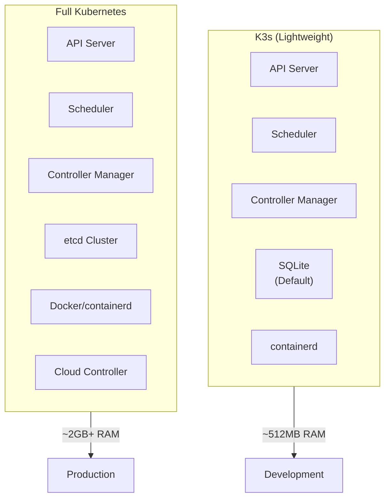
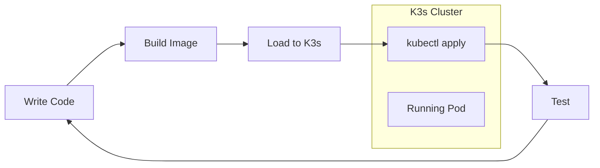

# How to Configure K3s for Development

Author: [nawazdhandala](https://www.github.com/nawazdhandala)

Tags: K3s, Kubernetes, Development, DevOps, Local Development, Containers, Lightweight Kubernetes

Description: Learn how to set up and configure K3s for local development environments. Covers installation, configuration, persistent storage, ingress setup, and tips for productive local Kubernetes development.

---

> K3s offers a lightweight Kubernetes distribution that runs perfectly on developer laptops. Unlike full Kubernetes installations, K3s uses minimal resources while providing complete Kubernetes API compatibility. Your local development environment can mirror production without the overhead.

Running Kubernetes locally has traditionally required significant resources. K3s changes that equation by stripping away cloud-provider-specific features you don't need during development.

---

## What Makes K3s Different



K3s packages the essential Kubernetes components into a single binary under 100MB. The distribution removes legacy and alpha features, cloud-provider integrations, and storage drivers you won't need locally.

---

## Installation Methods

### macOS with Multipass

Multipass creates lightweight Ubuntu VMs perfect for running K3s on Mac. Install Multipass first, then launch a VM with K3s.

The following commands set up a complete K3s environment in a virtual machine with 2 CPUs and 4GB of memory:

```bash
# Install Multipass using Homebrew
# Multipass manages lightweight Ubuntu VMs optimized for development
brew install multipass

# Launch an Ubuntu VM with resources suitable for K3s
# The cloud-init script handles K3s installation automatically
multipass launch --name k3s-dev --cpus 2 --memory 4G --disk 20G

# SSH into the VM and install K3s
multipass exec k3s-dev -- bash -c "curl -sfL https://get.k3s.io | sh -"

# Retrieve the kubeconfig file from the VM
# This file contains credentials needed to connect to your cluster
multipass exec k3s-dev -- sudo cat /etc/rancher/k3s/k3s.yaml > ~/.kube/k3s-config

# Update the server address to point to the VM's IP
# The default 127.0.0.1 won't work from your host machine
VM_IP=$(multipass info k3s-dev | grep IPv4 | awk '{print $2}')
sed -i '' "s/127.0.0.1/${VM_IP}/" ~/.kube/k3s-config

# Set KUBECONFIG to use the new config file
export KUBECONFIG=~/.kube/k3s-config
```

### Linux Native Installation

On Linux systems, K3s runs natively without virtualization overhead. Installation takes less than 30 seconds.

The curl command downloads and executes the K3s installer script, which detects your system and installs appropriate binaries:

```bash
# Download and install K3s with default settings
# The installer automatically starts K3s as a systemd service
curl -sfL https://get.k3s.io | sh -

# Verify the installation completed successfully
# You should see the node in Ready status within a few seconds
sudo k3s kubectl get nodes

# Copy the kubeconfig for non-root kubectl access
# By default, the config file requires root permissions
mkdir -p ~/.kube
sudo cp /etc/rancher/k3s/k3s.yaml ~/.kube/config
sudo chown $(id -u):$(id -g) ~/.kube/config

# Test cluster access with standard kubectl
kubectl get pods -A
```

### Windows with WSL2

Windows developers can run K3s inside Windows Subsystem for Linux. Make sure WSL2 is enabled with systemd support.

Before running K3s, configure WSL2 to use systemd, which K3s requires for service management:

```bash
# First, enable systemd in your WSL2 distribution
# Add this configuration to /etc/wsl.conf
cat <<EOF | sudo tee /etc/wsl.conf
[boot]
systemd=true
EOF

# Restart WSL from PowerShell to apply changes
# Run this in PowerShell: wsl --shutdown

# After restart, install K3s normally
curl -sfL https://get.k3s.io | sh -

# Configure kubectl access
mkdir -p ~/.kube
sudo cp /etc/rancher/k3s/k3s.yaml ~/.kube/config
sudo chown $(id -u):$(id -g) ~/.kube/config
```

---

## Development-Optimized Configuration

### Custom Installation Options

K3s accepts installation flags that optimize the cluster for development workflows. Disable components you don't need to reduce resource usage.

Pass environment variables to the installer script to customize your K3s setup:

```bash
# Install K3s with development-friendly options
# --disable traefik: Skip default ingress, we'll install nginx-ingress instead
# --disable servicelb: Skip ServiceLB if using your own load balancer
# --write-kubeconfig-mode 644: Make kubeconfig readable without sudo
curl -sfL https://get.k3s.io | sh -s - \
  --disable traefik \
  --write-kubeconfig-mode 644 \
  --kube-apiserver-arg="enable-admission-plugins=NodeRestriction"
```

### Configuration File Approach

For reproducible setups, use a configuration file instead of command-line flags. K3s reads from /etc/rancher/k3s/config.yaml at startup.

Create a configuration file that defines all your development preferences:

```yaml
# /etc/rancher/k3s/config.yaml
# Development-optimized K3s configuration

# Disable built-in components we want to customize
disable:
  - traefik        # Using custom ingress controller
  - servicelb      # Not needed for local development

# Make kubeconfig accessible to non-root users
write-kubeconfig-mode: "0644"

# Enable debug logging during development
# Change to "info" or "warn" once your setup stabilizes
debug: true

# Bind API server to all interfaces
# Required when accessing cluster from host machine via VM
bind-address: "0.0.0.0"

# Configure container runtime settings
# Lower default limits for development environments
kubelet-arg:
  - "max-pods=110"
  - "eviction-hard=memory.available<100Mi,nodefs.available<1Gi"
```

---

## Setting Up Local Storage

### Local Path Provisioner

K3s includes a local-path storage provisioner by default. You can create PersistentVolumeClaims that automatically provision storage from the node's filesystem.

Deploy a test pod with persistent storage to verify the provisioner works:

```yaml
# test-storage.yaml
# PersistentVolumeClaim using K3s local-path provisioner
apiVersion: v1
kind: PersistentVolumeClaim
metadata:
  name: dev-storage
  namespace: default
spec:
  # local-path is the default storage class in K3s
  storageClassName: local-path
  accessModes:
    - ReadWriteOnce
  resources:
    requests:
      # Request storage size - actual allocation happens on first use
      storage: 1Gi
---
# Pod that mounts the persistent volume
apiVersion: v1
kind: Pod
metadata:
  name: storage-test
  namespace: default
spec:
  containers:
  - name: app
    image: busybox
    command: ["sleep", "3600"]
    volumeMounts:
    - name: data
      # Data written here persists across pod restarts
      mountPath: /data
  volumes:
  - name: data
    persistentVolumeClaim:
      claimName: dev-storage
```

Apply the manifest and verify storage provisioning:

```bash
# Create the PVC and test pod
kubectl apply -f test-storage.yaml

# Check that the PVC is bound to a PersistentVolume
# Status should show "Bound" within a few seconds
kubectl get pvc dev-storage

# Verify the pod started successfully with the volume mounted
kubectl get pod storage-test

# Write some test data to the persistent volume
kubectl exec storage-test -- sh -c "echo 'persistent data' > /data/test.txt"

# Delete and recreate the pod to verify data persists
kubectl delete pod storage-test
kubectl apply -f test-storage.yaml
kubectl exec storage-test -- cat /data/test.txt
```

### Custom Storage Location

By default, K3s stores persistent volume data in /var/lib/rancher/k3s/storage. Change the location to a path with more space or faster disk.

Configure the local-path provisioner with a custom storage location:

```yaml
# local-path-config.yaml
# ConfigMap to customize local-path provisioner settings
apiVersion: v1
kind: ConfigMap
metadata:
  name: local-path-config
  namespace: kube-system
data:
  config.json: |-
    {
      "nodePathMap": [
        {
          "node": "DEFAULT_PATH_FOR_NON_LISTED_NODES",
          "paths": ["/mnt/dev-storage"]
        }
      ]
    }
```

---

## Ingress Configuration

### Installing NGINX Ingress Controller

For development, NGINX ingress provides familiar configuration options. Install using Helm for easy management.

Add the ingress-nginx Helm repository and install the controller with development settings:

```bash
# Add the official ingress-nginx Helm repository
helm repo add ingress-nginx https://kubernetes.github.io/ingress-nginx
helm repo update

# Install NGINX ingress controller optimized for development
# hostPort enables direct access on ports 80 and 443
helm install ingress-nginx ingress-nginx/ingress-nginx \
  --namespace ingress-nginx \
  --create-namespace \
  --set controller.hostPort.enabled=true \
  --set controller.service.type=ClusterIP \
  --set controller.watchIngressWithoutClass=true

# Wait for the controller pod to become ready
kubectl wait --namespace ingress-nginx \
  --for=condition=ready pod \
  --selector=app.kubernetes.io/component=controller \
  --timeout=120s
```

### Sample Ingress Resource

Create an Ingress resource to route traffic to your development application.

The following manifest routes requests to myapp.local to a backend service:

```yaml
# ingress-example.yaml
# Ingress resource for local development
apiVersion: networking.k8s.io/v1
kind: Ingress
metadata:
  name: dev-ingress
  namespace: default
  annotations:
    # Enable request body buffering for file uploads
    nginx.ingress.kubernetes.io/proxy-body-size: "50m"
    # Longer timeouts for debugging
    nginx.ingress.kubernetes.io/proxy-read-timeout: "300"
spec:
  ingressClassName: nginx
  rules:
  # Configure hostname-based routing
  # Add "127.0.0.1 myapp.local" to /etc/hosts
  - host: myapp.local
    http:
      paths:
      - path: /
        pathType: Prefix
        backend:
          service:
            name: myapp-service
            port:
              number: 80
  # Add additional hosts as needed for microservices development
  - host: api.local
    http:
      paths:
      - path: /
        pathType: Prefix
        backend:
          service:
            name: api-service
            port:
              number: 8080
```

---

## Development Workflow



### Building and Loading Images

K3s uses containerd as its container runtime. Load locally built images directly without pushing to a registry.

Build your Docker image and import it into K3s containerd:

```bash
# Build your application image with Docker
docker build -t myapp:dev .

# Save the image to a tar archive
docker save myapp:dev -o myapp.tar

# Import the image into K3s containerd
# On Linux with native K3s:
sudo k3s ctr images import myapp.tar

# On macOS/Windows with Multipass VM:
multipass transfer myapp.tar k3s-dev:/tmp/
multipass exec k3s-dev -- sudo k3s ctr images import /tmp/myapp.tar

# Verify the image is available
sudo k3s ctr images list | grep myapp
```

### Development Deployment Script

Automate the build-deploy cycle with a shell script. Run the script after code changes to see updates in your cluster.

Save and execute the following script for rapid iteration:

```bash
#!/bin/bash
# deploy-dev.sh
# Rapid development deployment script for K3s

set -e

APP_NAME="${1:-myapp}"
TAG="${2:-dev}"
NAMESPACE="${3:-default}"

echo "Building ${APP_NAME}:${TAG}..."
docker build -t "${APP_NAME}:${TAG}" .

echo "Exporting image..."
docker save "${APP_NAME}:${TAG}" -o "/tmp/${APP_NAME}.tar"

echo "Importing to K3s..."
sudo k3s ctr images import "/tmp/${APP_NAME}.tar"

echo "Restarting deployment..."
# Force pod recreation to pull the new image
kubectl rollout restart deployment/${APP_NAME} -n ${NAMESPACE} 2>/dev/null || \
  echo "No existing deployment found, applying manifests..."

# Apply any manifest changes
if [ -f "k8s/${APP_NAME}.yaml" ]; then
  kubectl apply -f "k8s/${APP_NAME}.yaml" -n ${NAMESPACE}
fi

echo "Waiting for rollout..."
kubectl rollout status deployment/${APP_NAME} -n ${NAMESPACE} --timeout=60s

echo "Deployment complete!"
kubectl get pods -n ${NAMESPACE} -l app=${APP_NAME}
```

### Using Skaffold for Continuous Development

Skaffold automates the build-push-deploy cycle, watching for file changes and updating your cluster automatically.

Create a skaffold.yaml configuration for K3s development:

```yaml
# skaffold.yaml
# Skaffold configuration for K3s development workflow
apiVersion: skaffold/v4beta5
kind: Config
metadata:
  name: myapp-dev
build:
  # Use local Docker daemon for builds
  local:
    # Don't push to registry - we load directly to K3s
    push: false
  artifacts:
  - image: myapp
    docker:
      dockerfile: Dockerfile
    # Sync files to running containers without rebuilding
    sync:
      manual:
      - src: "src/**/*.py"
        dest: /app
deploy:
  kubectl:
    manifests:
    - k8s/*.yaml
    # Apply default namespace to all resources
    defaultNamespace: default
# Custom action to load images into K3s
hooks:
  after:
  - host:
      command: ["sh", "-c", "docker save myapp -o /tmp/myapp.tar && sudo k3s ctr images import /tmp/myapp.tar"]
```

Run Skaffold in development mode to watch for changes:

```bash
# Start continuous development mode
# Skaffold watches for file changes and redeploys automatically
skaffold dev --port-forward

# For one-time deployment without watching
skaffold run
```

---

## Useful Development Tools

### k9s Terminal UI

k9s provides a terminal-based dashboard for managing your cluster. Navigate resources, view logs, and execute commands without typing kubectl.

Install and run k9s to interact with your K3s cluster:

```bash
# Install k9s on macOS
brew install k9s

# Install on Linux
curl -sS https://webinstall.dev/k9s | bash

# Launch k9s pointing to your K3s cluster
k9s

# Common k9s shortcuts:
# :pods      - View all pods
# :deploy    - View deployments
# :svc       - View services
# l          - View logs for selected pod
# s          - Shell into selected pod
# d          - Describe selected resource
# ctrl+d     - Delete selected resource
# /          - Filter resources by name
```

### Lens IDE Integration

Lens provides a graphical IDE for Kubernetes. Connect to your K3s cluster for visual resource management.

Configure Lens to connect to K3s:

```bash
# Lens reads kubeconfig automatically
# Ensure your K3s kubeconfig is accessible

# Merge K3s config into default kubeconfig
KUBECONFIG=~/.kube/config:~/.kube/k3s-config kubectl config view --flatten > /tmp/merged-config
mv /tmp/merged-config ~/.kube/config

# List available contexts
kubectl config get-contexts

# Switch to K3s context if not default
kubectl config use-context default
```

---

## Troubleshooting Common Issues

### Checking K3s Service Status

When things go wrong, start by checking the K3s service and container runtime.

Run diagnostic commands to identify issues:

```bash
# Check K3s service status (Linux with systemd)
sudo systemctl status k3s

# View K3s service logs for error messages
sudo journalctl -u k3s -f

# Check containerd status
sudo systemctl status k3s | grep containerd

# List all containers including failed ones
sudo k3s crictl ps -a

# View logs from a specific container
sudo k3s crictl logs <container-id>

# Check K3s server logs directly
sudo cat /var/log/k3s.log
```

### Resetting K3s Installation

Sometimes starting fresh is easier than debugging. K3s includes an uninstall script that removes everything cleanly.

Completely remove and reinstall K3s:

```bash
# Run the K3s uninstall script (removes all data and configuration)
/usr/local/bin/k3s-uninstall.sh

# For agent nodes, use the agent uninstall script
/usr/local/bin/k3s-agent-uninstall.sh

# Clean up any remaining container images
sudo rm -rf /var/lib/rancher/k3s

# Reinstall with your preferred configuration
curl -sfL https://get.k3s.io | sh -
```

### Debugging DNS Issues

DNS problems often manifest as pods unable to resolve service names. Test DNS resolution from within a pod.

Deploy a debug pod and test DNS:

```bash
# Create a temporary debug pod with networking tools
kubectl run debug --image=busybox --restart=Never -- sleep 3600

# Test DNS resolution of Kubernetes service
kubectl exec debug -- nslookup kubernetes.default.svc.cluster.local

# Test external DNS resolution
kubectl exec debug -- nslookup google.com

# Check CoreDNS pod status
kubectl get pods -n kube-system -l k8s-app=kube-dns

# View CoreDNS logs for errors
kubectl logs -n kube-system -l k8s-app=kube-dns

# Clean up debug pod
kubectl delete pod debug
```

---

## Resource Management for Development

### Limiting K3s Resource Usage

On laptops with limited resources, constrain K3s memory and CPU usage to leave room for other applications.

Configure resource limits using systemd drop-in files:

```bash
# Create a systemd drop-in directory for K3s
sudo mkdir -p /etc/systemd/system/k3s.service.d

# Create a resource limit configuration
sudo tee /etc/systemd/system/k3s.service.d/limits.conf <<EOF
[Service]
# Limit K3s to 2GB of memory
MemoryMax=2G
# Limit CPU usage to 200% (2 cores)
CPUQuota=200%
EOF

# Reload systemd and restart K3s
sudo systemctl daemon-reload
sudo systemctl restart k3s
```

### Configuring Pod Resource Defaults

Set default resource limits for all pods in a namespace to prevent runaway containers.

Create a LimitRange that applies default limits:

```yaml
# limit-range.yaml
# Default resource limits for development namespace
apiVersion: v1
kind: LimitRange
metadata:
  name: dev-limits
  namespace: default
spec:
  limits:
  - type: Container
    # Default limits applied when not specified in pod spec
    default:
      memory: "256Mi"
      cpu: "250m"
    # Default requests for scheduling decisions
    defaultRequest:
      memory: "128Mi"
      cpu: "100m"
    # Maximum allowed for any container
    max:
      memory: "1Gi"
      cpu: "1"
    # Minimum required for any container
    min:
      memory: "64Mi"
      cpu: "50m"
```

Apply the resource limits:

```bash
# Apply the LimitRange to the default namespace
kubectl apply -f limit-range.yaml

# Verify the LimitRange is active
kubectl describe limitrange dev-limits

# Any new pods without resource specs will receive these defaults
kubectl run test --image=nginx
kubectl describe pod test | grep -A 5 "Limits:"
```

---

## Best Practices

1. **Use a dedicated config file** - Keep K3s configuration in /etc/rancher/k3s/config.yaml for reproducibility
2. **Disable unused components** - Skip Traefik and ServiceLB if using alternatives
3. **Set resource limits** - Prevent K3s from consuming all system resources
4. **Use local image loading** - Skip registry pushes for faster iteration
5. **Configure proper DNS** - Add hostnames to /etc/hosts for ingress testing
6. **Enable debug logging initially** - Easier troubleshooting during setup

---

## Conclusion

K3s provides a production-compatible Kubernetes environment that runs efficiently on development machines. Key advantages for development include:

- **Minimal resource footprint** allows running alongside your IDE and other tools
- **Fast startup time** under 30 seconds gets you back to coding quickly
- **Full Kubernetes API compatibility** ensures your manifests work unchanged in production
- **Simple installation** means less time configuring and more time developing

---

**Related Reading:**

- [How to configure MetalLB with Kubernetes (Microk8s)](https://oneuptime.com/blog/post/2023-11-06-configure-metallb-with-kubernetes-microk8s/view)
- [How moving from AWS to Bare-Metal saved us $230,000/yr](https://oneuptime.com/blog/post/2023-10-30-moving-from-aws-to-bare-metal/view)

*Ready to monitor your K3s development cluster? [OneUptime](https://oneuptime.com) provides observability that scales from local development to production Kubernetes environments.*
