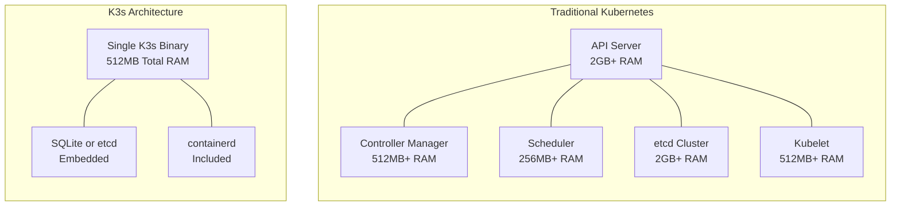
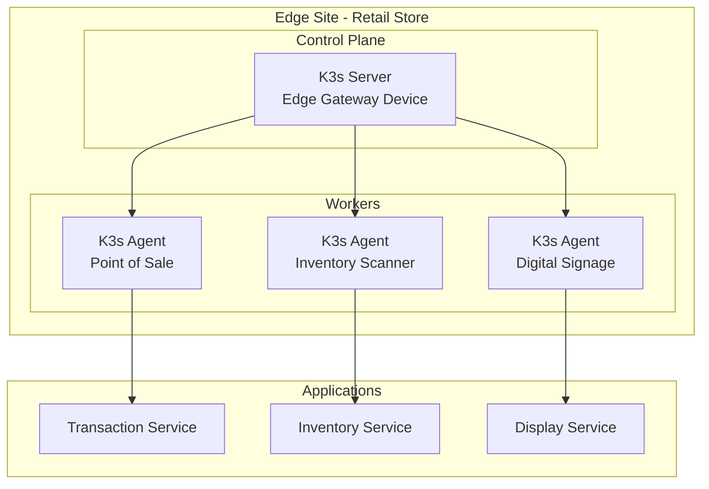
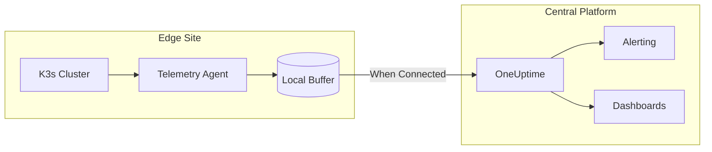
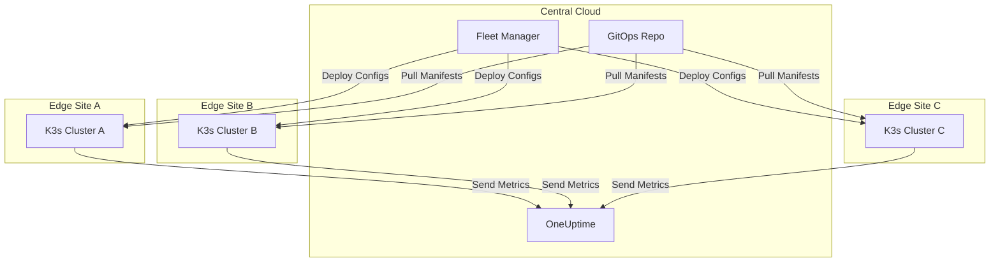

# How to Use K3s for Edge Computing

Author: [nawazdhandala](https://www.github.com/nawazdhandala)

Tags: K3s, Edge Computing, Kubernetes, IoT, DevOps, ARM, Lightweight Kubernetes

Description: A practical guide to leveraging K3s for edge computing scenarios. Learn how to deploy, configure, and manage lightweight Kubernetes clusters on resource-constrained devices, handle offline operations, and build resilient edge architectures.

---

Edge computing pushes processing power closer to where data originates. Instead of sending every sensor reading or video frame to a distant data center, edge nodes handle time-sensitive computation locally. Kubernetes has become the standard for container orchestration, but traditional Kubernetes clusters demand substantial resources that edge devices simply cannot provide. K3s solves this problem by packaging a fully compliant Kubernetes distribution into a binary under 100MB that runs on devices with as little as 512MB of RAM.

Rancher Labs (now part of SUSE) created K3s specifically for environments where resources are scarce but reliability remains critical. Factory floors, retail stores, agricultural facilities, and telecommunications towers all benefit from local compute that continues operating even when connectivity to the central cloud fails.

## Why K3s Fits Edge Computing

Standard Kubernetes requires etcd clusters, separate control plane components, and significant memory overhead. A minimal production cluster typically needs at least 4GB of RAM per control plane node. K3s strips away unnecessary complexity while maintaining API compatibility with upstream Kubernetes.



### Key Advantages for Edge

K3s achieves its lightweight footprint through several architectural decisions:

**Single Binary Distribution**: Everything ships in one executable. No separate installations for kubelet, kube-proxy, or container runtime.

**SQLite as Default Datastore**: Single-node clusters use SQLite instead of etcd, eliminating the memory and complexity overhead of a distributed key-value store.

**Embedded Components**: containerd, Flannel networking, CoreDNS, and the Traefik ingress controller come pre-configured and ready to use.

**ARM Support**: Native binaries for ARM64 and ARMv7 architectures enable deployment on Raspberry Pi, NVIDIA Jetson, and other ARM-based edge hardware.

## Setting Up Your First Edge Node

Before installing K3s, ensure your edge device meets the minimum requirements. The installation process works identically across x86_64, ARM64, and ARMv7 architectures.

### Hardware Requirements

| Resource | Minimum | Recommended |
|----------|---------|-------------|
| CPU | 1 core | 2 cores |
| RAM | 512MB | 1GB |
| Storage | 200MB | 2GB |
| Network | 1 interface | 1 interface |

### Installation Script

The following script prepares an edge device and installs K3s with configurations optimized for constrained environments. Run each command to understand what happens at each step.

```bash
#!/bin/bash
# k3s-edge-install.sh
# Prepares and installs K3s on an edge device with optimized settings

# Disable swap - Kubernetes performs better without swap enabled
# and memory limits become more predictable
sudo swapoff -a
sudo sed -i '/swap/d' /etc/fstab

# Load kernel modules required for container networking
# br_netfilter enables iptables to see bridged traffic
# overlay provides the storage driver for containerd
cat <<EOF | sudo tee /etc/modules-load.d/k3s.conf
br_netfilter
overlay
EOF

sudo modprobe br_netfilter
sudo modprobe overlay

# Configure kernel networking parameters
# These settings enable proper packet forwarding for containers
cat <<EOF | sudo tee /etc/sysctl.d/99-k3s.conf
net.bridge.bridge-nf-call-iptables = 1
net.bridge.bridge-nf-call-ip6tables = 1
net.ipv4.ip_forward = 1
EOF

sudo sysctl --system
```

After preparing the system, install K3s with edge-optimized flags.

```bash
# Install K3s with settings optimized for edge devices
# --write-kubeconfig-mode 644 allows non-root kubectl access
# --disable traefik removes the ingress controller if you do not need it
# --disable servicelb removes the built-in load balancer
# --kubelet-arg flags tune resource management for constrained devices
curl -sfL https://get.k3s.io | INSTALL_K3S_EXEC="server \
  --write-kubeconfig-mode 644 \
  --disable traefik \
  --disable servicelb \
  --kubelet-arg=max-pods=30 \
  --kubelet-arg=eviction-hard=memory.available<100Mi \
  --kubelet-arg=system-reserved=cpu=100m,memory=100Mi" sh -
```

Verify the installation completed successfully.

```bash
# Check K3s service status
sudo systemctl status k3s

# Verify the node is ready
sudo kubectl get nodes

# Expected output shows one node with Ready status
# NAME          STATUS   ROLES                  AGE   VERSION
# edge-node-1   Ready    control-plane,master   45s   v1.28.4+k3s1
```

## Configuring K3s for Resource Constraints

Edge devices operate with tight resource budgets. Proper configuration prevents memory exhaustion and ensures critical workloads receive the resources they need.

### Server Configuration File

Create a configuration file that K3s reads on startup. Managing settings through a file proves easier than passing numerous command-line flags.

```yaml
# /etc/rancher/k3s/config.yaml
# K3s server configuration optimized for edge computing

# Disable components not needed at the edge to save resources
disable:
  - traefik        # Disable if using direct NodePort access
  - servicelb      # Disable if not using LoadBalancer services
  - metrics-server # Disable if not using Horizontal Pod Autoscaler

# Kubelet configuration for resource-constrained devices
kubelet-arg:
  # Limit maximum pods to prevent resource exhaustion
  - "max-pods=30"

  # Aggressive eviction thresholds protect the node
  - "eviction-hard=memory.available<100Mi,nodefs.available<10%"
  - "eviction-soft=memory.available<200Mi,nodefs.available<15%"
  - "eviction-soft-grace-period=memory.available=1m,nodefs.available=1m"

  # Reserve resources for system processes
  - "system-reserved=cpu=100m,memory=100Mi"
  - "kube-reserved=cpu=100m,memory=100Mi"

  # Garbage collection thresholds for container images
  - "image-gc-high-threshold=70"
  - "image-gc-low-threshold=50"

# Controller manager tuning for intermittent connectivity
kube-controller-manager-arg:
  # Longer grace periods tolerate network delays
  - "node-monitor-period=30s"
  - "node-monitor-grace-period=60s"
  - "pod-eviction-timeout=300s"

# API server configuration
kube-apiserver-arg:
  # Reduce request limits for single-node clusters
  - "max-requests-inflight=100"
  - "max-mutating-requests-inflight=50"

# Labels identify edge nodes for scheduling
node-label:
  - "node.kubernetes.io/edge=true"
  - "topology.kubernetes.io/zone=edge-site-01"

# Write kubeconfig with permissions for non-root users
write-kubeconfig-mode: "0644"
```

Apply the configuration by restarting K3s.

```bash
# Create the configuration directory if it does not exist
sudo mkdir -p /etc/rancher/k3s

# Copy your configuration file
sudo cp config.yaml /etc/rancher/k3s/config.yaml

# Restart K3s to apply the new configuration
sudo systemctl restart k3s

# Verify settings took effect
sudo kubectl describe node | grep -A 10 "Allocatable:"
```

## Building Multi-Node Edge Clusters

Single-node deployments work for many edge scenarios, but some applications benefit from multiple nodes at each edge site. K3s supports multi-node clusters with minimal overhead.



### Setting Up the Server Node

The server node hosts the control plane and can optionally run workloads.

```bash
# On the server node, install K3s in server mode
# The --token flag sets the shared secret for node authentication
curl -sfL https://get.k3s.io | INSTALL_K3S_EXEC="server \
  --write-kubeconfig-mode 644 \
  --token my-edge-cluster-token \
  --node-name edge-server" sh -

# Retrieve the node token for agent registration
# Agents use this token to authenticate with the server
sudo cat /var/lib/rancher/k3s/server/node-token
```

### Adding Agent Nodes

Agent nodes join the cluster and run workloads without control plane responsibilities.

```bash
# On each agent node, install K3s in agent mode
# K3S_URL points to the server's API endpoint
# K3S_TOKEN contains the token from the server
export K3S_URL="https://192.168.1.10:6443"
export K3S_TOKEN="K10xxxxxxxxxxxxxxxxxxxxxxxxxxxxxx"

curl -sfL https://get.k3s.io | INSTALL_K3S_EXEC="agent \
  --node-name edge-worker-01 \
  --kubelet-arg=max-pods=20 \
  --kubelet-arg=eviction-hard=memory.available<50Mi" sh -
```

Verify all nodes joined the cluster.

```bash
# On the server node, list cluster members
sudo kubectl get nodes -o wide

# Expected output shows server and agents
# NAME             STATUS   ROLES                  AGE   VERSION
# edge-server      Ready    control-plane,master   5m    v1.28.4+k3s1
# edge-worker-01   Ready    <none>                 2m    v1.28.4+k3s1
# edge-worker-02   Ready    <none>                 1m    v1.28.4+k3s1
```

## Deploying Workloads on Edge

Edge deployments require careful resource management. Applications must specify resource requests and limits to prevent one workload from starving others.

### Edge-Optimized Deployment

The following deployment demonstrates best practices for edge workloads.

```yaml
# edge-sensor-deployment.yaml
# Deployment configured for edge device constraints

apiVersion: apps/v1
kind: Deployment
metadata:
  name: sensor-collector
  namespace: edge-apps
  labels:
    app: sensor-collector
    environment: edge
spec:
  # Single replica typical for edge - adjust based on your requirements
  replicas: 1

  # Recreate strategy is faster on single-node edge clusters
  # RollingUpdate provides zero downtime on multi-node clusters
  strategy:
    type: Recreate

  selector:
    matchLabels:
      app: sensor-collector

  template:
    metadata:
      labels:
        app: sensor-collector
        environment: edge
    spec:
      # Schedule only on nodes labeled as edge devices
      nodeSelector:
        node.kubernetes.io/edge: "true"

      # Tolerate node pressure to keep collecting data
      tolerations:
        - key: "node.kubernetes.io/memory-pressure"
          operator: "Exists"
          effect: "NoSchedule"
        - key: "node.kubernetes.io/disk-pressure"
          operator: "Exists"
          effect: "NoSchedule"

      containers:
        - name: collector
          # Use a lightweight base image
          image: alpine:3.19
          command: ["/bin/sh", "-c"]
          args:
            - |
              while true; do
                echo "Collecting sensor data at $(date)"
                # Your sensor collection logic here
                sleep 30
              done

          # Always specify resource limits on edge devices
          resources:
            requests:
              cpu: 25m
              memory: 32Mi
            limits:
              cpu: 100m
              memory: 64Mi

          # Mount local storage for data buffering
          volumeMounts:
            - name: data-buffer
              mountPath: /data

          # Environment variables for edge-specific configuration
          env:
            - name: COLLECTION_INTERVAL
              value: "30"
            - name: BUFFER_SIZE_MB
              value: "10"
            - name: NODE_NAME
              valueFrom:
                fieldRef:
                  fieldPath: spec.nodeName

      volumes:
        - name: data-buffer
          # Use hostPath for persistent local storage
          hostPath:
            path: /var/edge-data/sensor
            type: DirectoryOrCreate
```

Apply the deployment.

```bash
# Create the namespace for edge applications
sudo kubectl create namespace edge-apps

# Apply the deployment
sudo kubectl apply -f edge-sensor-deployment.yaml

# Verify the pod is running
sudo kubectl get pods -n edge-apps -o wide

# Check resource usage
sudo kubectl top pods -n edge-apps
```

### ResourceQuota for Edge Namespaces

Prevent resource exhaustion by limiting total namespace consumption.

```yaml
# edge-resource-quota.yaml
# Limits total resources available to edge applications

apiVersion: v1
kind: ResourceQuota
metadata:
  name: edge-quota
  namespace: edge-apps
spec:
  hard:
    # Limit total CPU and memory
    requests.cpu: "500m"
    requests.memory: "256Mi"
    limits.cpu: "1"
    limits.memory: "512Mi"

    # Limit object counts
    pods: "15"
    services: "5"
    configmaps: "10"
    secrets: "10"
    persistentvolumeclaims: "3"
```

## Handling Offline Operations

Edge locations frequently experience network outages. K3s clusters continue operating during disconnections, but workloads need preparation for offline scenarios.

### Pre-Pulling Container Images

Download images before deploying to edge sites with limited connectivity.

```bash
#!/bin/bash
# pre-pull-images.sh
# Downloads container images to the local containerd cache

# List of images your edge workloads need
IMAGES=(
  "alpine:3.19"
  "nginx:alpine"
  "redis:7-alpine"
  "myregistry.com/sensor-collector:v1.2"
)

# Pull each image using K3s crictl
for IMAGE in "${IMAGES[@]}"; do
  echo "Pulling $IMAGE..."
  sudo k3s crictl pull "$IMAGE"
done

# Verify images are cached locally
sudo k3s crictl images
```

### Air-Gapped Installation Package

Create a complete installation package for sites without internet access.

```bash
#!/bin/bash
# create-airgap-package.sh
# Builds an air-gapped installation package for K3s

K3S_VERSION="v1.28.4+k3s1"
ARCH="amd64"  # Change to arm64 for ARM devices
OUTPUT_DIR="k3s-airgap"

mkdir -p "$OUTPUT_DIR"/{bin,images}

# Download K3s binary
echo "Downloading K3s binary..."
curl -Lo "$OUTPUT_DIR/bin/k3s" \
  "https://github.com/k3s-io/k3s/releases/download/${K3S_VERSION}/k3s"
chmod +x "$OUTPUT_DIR/bin/k3s"

# Download the install script
curl -Lo "$OUTPUT_DIR/bin/install.sh" https://get.k3s.io
chmod +x "$OUTPUT_DIR/bin/install.sh"

# Download system images tarball
echo "Downloading K3s system images..."
curl -Lo "$OUTPUT_DIR/images/k3s-airgap-images-${ARCH}.tar.gz" \
  "https://github.com/k3s-io/k3s/releases/download/${K3S_VERSION}/k3s-airgap-images-${ARCH}.tar.gz"

# Save application images (run this on a machine with docker)
echo "Saving application images..."
docker pull alpine:3.19
docker pull nginx:alpine
docker save alpine:3.19 nginx:alpine -o "$OUTPUT_DIR/images/app-images.tar"

# Create installation script
cat > "$OUTPUT_DIR/install-offline.sh" << 'SCRIPT'
#!/bin/bash
# Air-gapped K3s installation

sudo cp bin/k3s /usr/local/bin/
sudo chmod +x /usr/local/bin/k3s

sudo mkdir -p /var/lib/rancher/k3s/agent/images/
sudo cp images/k3s-airgap-images-*.tar.gz /var/lib/rancher/k3s/agent/images/
sudo gunzip /var/lib/rancher/k3s/agent/images/*.gz

INSTALL_K3S_SKIP_DOWNLOAD=true ./bin/install.sh

sudo k3s ctr images import images/app-images.tar
SCRIPT

chmod +x "$OUTPUT_DIR/install-offline.sh"

# Package everything
tar -czf "k3s-airgap-${K3S_VERSION}.tar.gz" "$OUTPUT_DIR"
echo "Package created: k3s-airgap-${K3S_VERSION}.tar.gz"
```

### Local Registry for Disconnected Sites

Run a local registry at each edge site for image distribution.

```yaml
# local-registry.yaml
# Deploys a container registry for air-gapped edge sites

apiVersion: v1
kind: Namespace
metadata:
  name: registry

---
apiVersion: apps/v1
kind: Deployment
metadata:
  name: registry
  namespace: registry
spec:
  replicas: 1
  selector:
    matchLabels:
      app: registry
  template:
    metadata:
      labels:
        app: registry
    spec:
      containers:
        - name: registry
          image: registry:2
          ports:
            - containerPort: 5000
          resources:
            requests:
              cpu: 50m
              memory: 64Mi
            limits:
              cpu: 200m
              memory: 256Mi
          volumeMounts:
            - name: registry-data
              mountPath: /var/lib/registry
          env:
            - name: REGISTRY_STORAGE_DELETE_ENABLED
              value: "true"
      volumes:
        - name: registry-data
          hostPath:
            path: /var/edge-data/registry
            type: DirectoryOrCreate

---
apiVersion: v1
kind: Service
metadata:
  name: registry
  namespace: registry
spec:
  type: NodePort
  ports:
    - port: 5000
      targetPort: 5000
      nodePort: 30500
  selector:
    app: registry
```

Configure K3s to use the local registry.

```yaml
# /etc/rancher/k3s/registries.yaml
# Configures K3s to pull images from the local registry

mirrors:
  "docker.io":
    endpoint:
      - "http://localhost:30500"
  "myregistry.com":
    endpoint:
      - "http://localhost:30500"

configs:
  "localhost:30500":
    tls:
      insecure_skip_verify: true
```

## Monitoring Edge Clusters

Visibility into edge cluster health helps identify issues before they cause outages. Lightweight monitoring solutions fit edge resource constraints.



### Lightweight Metrics Collection

Deploy a minimal metrics stack that buffers data during network outages.

```yaml
# edge-monitoring.yaml
# Lightweight monitoring for edge K3s clusters

apiVersion: v1
kind: ConfigMap
metadata:
  name: otel-config
  namespace: monitoring
data:
  config.yaml: |
    # OpenTelemetry Collector configuration for edge devices
    # Optimized for low resource usage and offline buffering

    receivers:
      # Collect host metrics with reduced frequency
      hostmetrics:
        collection_interval: 120s
        scrapers:
          cpu:
          memory:
          disk:
          filesystem:
          network:

      # Receive application telemetry
      otlp:
        protocols:
          grpc:
            endpoint: 0.0.0.0:4317

    processors:
      # Batch data to reduce network calls
      batch:
        timeout: 120s
        send_batch_size: 100

      # Add edge identification labels
      resource:
        attributes:
          - key: deployment.environment
            value: edge
            action: insert

    exporters:
      # Export to OneUptime when connected
      otlphttp:
        endpoint: https://oneuptime.com/otlp
        headers:
          x-oneuptime-token: ${ONEUPTIME_TOKEN}
        retry_on_failure:
          enabled: true
          initial_interval: 30s
          max_interval: 300s
        sending_queue:
          enabled: true
          queue_size: 500
          persistent_storage_enabled: true

    extensions:
      # File-based queue for offline buffering
      file_storage:
        directory: /var/lib/otel/buffer
        timeout: 10s

    service:
      extensions: [file_storage]
      pipelines:
        metrics:
          receivers: [hostmetrics, otlp]
          processors: [resource, batch]
          exporters: [otlphttp]

---
apiVersion: apps/v1
kind: DaemonSet
metadata:
  name: otel-collector
  namespace: monitoring
spec:
  selector:
    matchLabels:
      app: otel-collector
  template:
    metadata:
      labels:
        app: otel-collector
    spec:
      tolerations:
        - operator: Exists
      containers:
        - name: collector
          image: otel/opentelemetry-collector-contrib:0.91.0
          args: ["--config=/etc/otel/config.yaml"]
          resources:
            requests:
              cpu: 20m
              memory: 64Mi
            limits:
              cpu: 100m
              memory: 128Mi
          volumeMounts:
            - name: config
              mountPath: /etc/otel
            - name: buffer
              mountPath: /var/lib/otel/buffer
          env:
            - name: ONEUPTIME_TOKEN
              valueFrom:
                secretKeyRef:
                  name: monitoring-secrets
                  key: oneuptime-token
      volumes:
        - name: config
          configMap:
            name: otel-config
        - name: buffer
          hostPath:
            path: /var/edge-data/otel-buffer
            type: DirectoryOrCreate
```

## Upgrading Edge Clusters

Maintaining K3s clusters across distributed edge sites requires careful coordination. Automated upgrade strategies reduce manual intervention.

### Manual Upgrade Process

For individual edge sites or small deployments:

```bash
#!/bin/bash
# upgrade-k3s.sh
# Safely upgrades K3s on an edge node

NEW_VERSION="v1.29.0+k3s1"
ARCH="amd64"

echo "Current K3s version:"
k3s --version

# Download new binary
echo "Downloading K3s $NEW_VERSION..."
curl -Lo /tmp/k3s \
  "https://github.com/k3s-io/k3s/releases/download/${NEW_VERSION}/k3s-${ARCH}"

# Drain workloads from node (for multi-node clusters)
# sudo kubectl drain $(hostname) --ignore-daemonsets --delete-emptydir-data

# Stop K3s
echo "Stopping K3s..."
sudo systemctl stop k3s

# Replace binary
sudo mv /tmp/k3s /usr/local/bin/k3s
sudo chmod +x /usr/local/bin/k3s

# Start K3s
echo "Starting K3s..."
sudo systemctl start k3s

# Wait for node to be ready
sleep 30

# Verify upgrade
echo "New K3s version:"
k3s --version
sudo kubectl get nodes
```

### Automated Fleet Upgrades

For managing upgrades across many edge sites, use the K3s system-upgrade-controller.

```yaml
# system-upgrade-controller.yaml
# Automated upgrade management for K3s clusters

apiVersion: v1
kind: Namespace
metadata:
  name: system-upgrade

---
# Deploy the system-upgrade-controller
# kubectl apply -f https://github.com/rancher/system-upgrade-controller/releases/latest/download/system-upgrade-controller.yaml

---
# Upgrade plan for edge nodes
apiVersion: upgrade.cattle.io/v1
kind: Plan
metadata:
  name: edge-upgrade
  namespace: system-upgrade
spec:
  # Only upgrade one node at a time
  concurrency: 1

  # Use the stable channel for upgrades
  channel: https://update.k3s.io/v1-release/channels/stable

  # Target edge nodes
  nodeSelector:
    matchExpressions:
      - key: node.kubernetes.io/edge
        operator: Exists

  # Tolerate taints on edge nodes
  tolerations:
    - operator: Exists

  # Drain settings for multi-node clusters
  drain:
    force: true
    skipWaitForDeleteTimeout: 60
    deleteEmptyDirData: true

  # Service account for upgrade operations
  serviceAccountName: system-upgrade

  # Cordon nodes during upgrade
  cordon: true
```

## Troubleshooting Edge Deployments

Edge environments present unique debugging challenges due to limited access and intermittent connectivity. Build troubleshooting capabilities into your deployment from the start.

### Health Check Script

Run regular health checks to catch issues early.

```bash
#!/bin/bash
# edge-health-check.sh
# Comprehensive health check for K3s edge clusters

echo "=== K3s Edge Health Check ==="
echo "Timestamp: $(date)"
echo "Node: $(hostname)"
echo ""

# Check K3s service
echo "--- K3s Service Status ---"
if systemctl is-active --quiet k3s; then
    echo "K3s service: Running"
else
    echo "K3s service: NOT RUNNING"
    journalctl -u k3s -n 20 --no-pager
fi
echo ""

# Check node status
echo "--- Node Status ---"
sudo kubectl get nodes -o wide 2>/dev/null || echo "Cannot reach API server"
echo ""

# Check system pods
echo "--- System Pods ---"
sudo kubectl get pods -n kube-system --no-headers 2>/dev/null | while read line; do
    NAME=$(echo "$line" | awk '{print $1}')
    STATUS=$(echo "$line" | awk '{print $3}')
    if [ "$STATUS" != "Running" ] && [ "$STATUS" != "Completed" ]; then
        echo "WARNING: $NAME is $STATUS"
    fi
done
echo ""

# Check resource usage
echo "--- Resource Usage ---"
free -m | head -2
df -h / | tail -1
echo ""

# Check container runtime
echo "--- Container Runtime ---"
sudo k3s crictl info 2>/dev/null | head -5 || echo "Cannot reach containerd"
echo ""

# Check for evicted pods
echo "--- Evicted Pods ---"
EVICTED=$(sudo kubectl get pods -A --field-selector=status.phase=Failed 2>/dev/null | grep -c Evicted || echo 0)
echo "Evicted pods: $EVICTED"
echo ""

echo "=== Health Check Complete ==="
```

### Common Issues and Solutions

**Issue: Pods stuck in Pending state**

```bash
# Check if resource limits are blocking scheduling
sudo kubectl describe pod <pod-name> | grep -A 10 Events

# Verify node has sufficient resources
sudo kubectl describe node | grep -A 5 Allocated

# Check for taints preventing scheduling
sudo kubectl describe node | grep Taints
```

**Issue: Node shows NotReady status**

```bash
# Check kubelet logs for errors
sudo journalctl -u k3s -n 100 | grep -i error

# Verify network connectivity
ping -c 3 8.8.8.8

# Check container runtime
sudo k3s crictl ps
sudo k3s crictl info
```

**Issue: High memory usage causing OOM kills**

```bash
# Check which pods consume the most memory
sudo kubectl top pods -A --sort-by=memory

# Review pod memory limits
sudo kubectl get pods -A -o jsonpath='{range .items[*]}{.metadata.name}{"\t"}{.spec.containers[*].resources.limits.memory}{"\n"}{end}'

# Adjust eviction thresholds in K3s config
# kubelet-arg:
#   - "eviction-hard=memory.available<200Mi"
```

## Integrating with Central Management

Edge clusters often need coordination with central infrastructure for GitOps deployments, monitoring aggregation, and fleet management.



### Connecting to OneUptime for Observability

Integrate edge clusters with OneUptime for centralized monitoring and alerting.

```yaml
# oneuptime-integration.yaml
# Configures edge cluster to report to OneUptime

apiVersion: v1
kind: Secret
metadata:
  name: oneuptime-credentials
  namespace: monitoring
type: Opaque
stringData:
  # Replace with your actual OneUptime API token
  token: "your-oneuptime-api-token"
  endpoint: "https://oneuptime.com/api/telemetry"

---
apiVersion: v1
kind: ConfigMap
metadata:
  name: edge-identity
  namespace: monitoring
data:
  cluster-name: "edge-site-001"
  region: "west-coast"
  environment: "production"
```

## Summary

K3s brings Kubernetes capabilities to edge computing environments where traditional Kubernetes cannot operate. The lightweight architecture, ARM support, and offline capabilities make it ideal for distributed deployments across retail stores, factories, telecommunications sites, and IoT installations.

Key points for successful K3s edge deployments:

**Resource Configuration**: Always set resource requests and limits. Edge devices cannot afford runaway resource consumption.

**Offline Preparation**: Pre-pull images, set up local registries, and configure buffering for metrics and logs. Network outages are common at the edge.

**Monitoring Integration**: Connect edge clusters to central observability platforms like OneUptime. You cannot fix problems you cannot see.

**Upgrade Strategy**: Plan for automated upgrades using the system-upgrade-controller. Manual upgrades across hundreds of edge sites do not scale.

**Testing**: Simulate network partitions, node failures, and resource exhaustion before deploying to production edge sites.

Edge computing with K3s extends your infrastructure to locations traditional cloud services cannot reach while maintaining the orchestration capabilities that Kubernetes provides.

---

For comprehensive monitoring of your K3s edge clusters alongside your cloud infrastructure, OneUptime provides unified observability with support for intermittent connectivity scenarios common in edge deployments. Visit [OneUptime](https://oneuptime.com) to learn more about monitoring distributed edge architectures.
