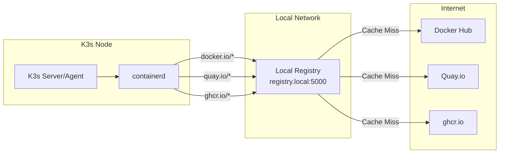
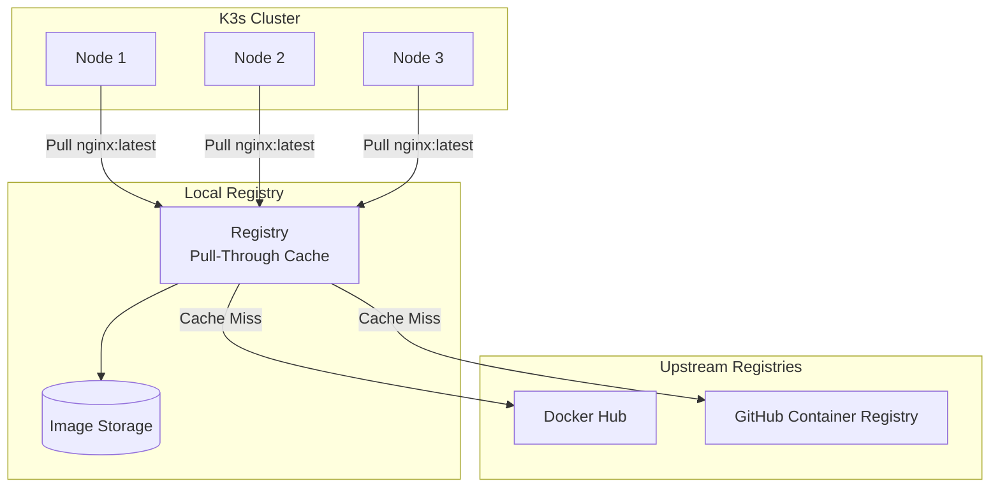
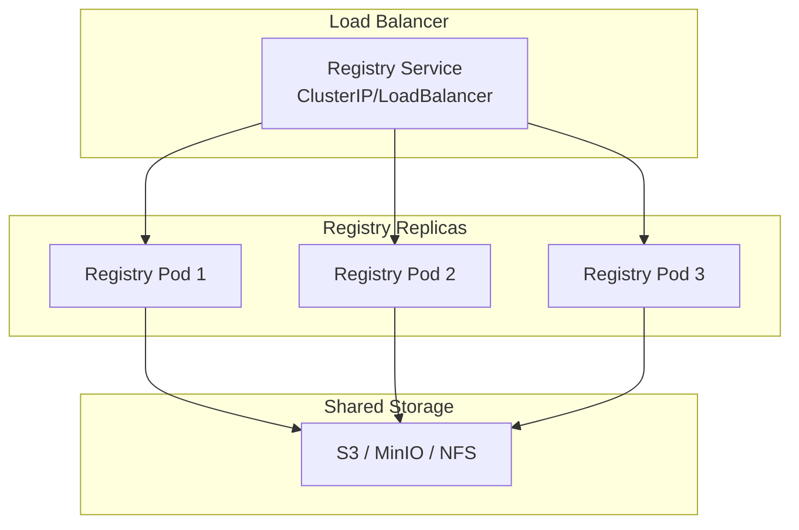

# How to Configure K3s Embedded Registry

Author: [nawazdhandala](https://github.com/nawazdhandala)

Tags: K3s, Kubernetes, Container Registry, DevOps, Docker, Private Registry, Edge Computing

Description: A practical guide to configuring the K3s embedded registry for local container image storage. Learn how to set up registry mirrors, configure authentication, optimize caching, and integrate with your CI/CD pipelines for faster deployments.

---

Running a private container registry alongside your K3s cluster eliminates external dependencies and dramatically speeds up image pulls. Rather than fetching images from Docker Hub or other remote registries, your nodes pull from a local source. For edge deployments, air-gapped environments, or simply faster development cycles, the K3s embedded registry becomes an essential component.

K3s supports configuring registry mirrors and private registries through a straightforward configuration file. While K3s does not include a built-in registry server, it provides seamless integration with any OCI-compliant registry you deploy. The approach covered in this guide uses the lightweight Docker Distribution registry deployed within your cluster.

## Table of Contents

1. [Understanding K3s Registry Configuration](#understanding-k3s-registry-configuration)
2. [Deploying a Local Registry in K3s](#deploying-a-local-registry-in-k3s)
3. [Configuring K3s to Use the Local Registry](#configuring-k3s-to-use-the-local-registry)
4. [Setting Up Registry Authentication](#setting-up-registry-authentication)
5. [Configuring TLS for the Registry](#configuring-tls-for-the-registry)
6. [Registry Mirroring and Caching](#registry-mirroring-and-caching)
7. [Integrating with CI/CD Pipelines](#integrating-with-cicd-pipelines)
8. [High Availability Registry Setup](#high-availability-registry-setup)
9. [Monitoring and Maintenance](#monitoring-and-maintenance)
10. [Troubleshooting Common Issues](#troubleshooting-common-issues)
11. [Conclusion](#conclusion)

## Understanding K3s Registry Configuration

K3s uses containerd as its container runtime, and containerd supports registry mirrors through configuration. When you configure a mirror, containerd redirects image pulls from the original registry to your specified mirror.



### How Registry Configuration Works

K3s reads registry configuration from `/etc/rancher/k3s/registries.yaml`. The configuration file specifies mirrors (alternative sources for images) and authentication credentials.

The following code block shows the basic structure of the registries.yaml file. Each mirror maps a registry hostname to one or more endpoint URLs.

```yaml
# /etc/rancher/k3s/registries.yaml
# K3s registry configuration file
# Defines mirrors and authentication for container registries

mirrors:
  # Registry hostname to mirror
  "docker.io":
    endpoint:
      # List of mirror endpoints in priority order
      - "http://registry.local:5000"

  # Another registry with mirror
  "quay.io":
    endpoint:
      - "http://registry.local:5000"

configs:
  # Authentication configuration for registries
  "registry.local:5000":
    auth:
      username: admin
      password: secure-password
    tls:
      # Skip TLS verification for internal registry
      insecure_skip_verify: true
```

### Key Concepts

**Mirrors**: Redirect image pulls to alternative endpoints. Useful for caching, air-gapped environments, or using private registries.

**Configs**: Define authentication credentials and TLS settings for specific registries.

**Endpoints**: Ordered list of URLs to try when pulling images. K3s tries each endpoint in sequence until one succeeds.

## Deploying a Local Registry in K3s

Before configuring K3s to use a local registry, you need to deploy one. The Docker Distribution registry is lightweight, well-tested, and easy to deploy.

### Basic Registry Deployment

Create the namespace and storage for the registry. Persistent storage ensures images survive pod restarts.

```yaml
# registry-namespace.yaml
# Creates dedicated namespace for registry components
apiVersion: v1
kind: Namespace
metadata:
  name: registry
  labels:
    app.kubernetes.io/name: registry
    app.kubernetes.io/component: infrastructure
```

Create a PersistentVolumeClaim for registry storage. The registry stores all pushed images in this volume.

```yaml
# registry-pvc.yaml
# Persistent storage for registry images
apiVersion: v1
kind: PersistentVolumeClaim
metadata:
  name: registry-data
  namespace: registry
spec:
  accessModes:
    # ReadWriteOnce is sufficient for single-node registry
    - ReadWriteOnce
  resources:
    requests:
      # Adjust size based on expected image storage needs
      storage: 50Gi
  # Use your cluster's default StorageClass
  # Or specify: storageClassName: local-path
```

Deploy the registry itself using a Deployment. The registry runs on port 5000 by default.

```yaml
# registry-deployment.yaml
# Deploys Docker Distribution registry
apiVersion: apps/v1
kind: Deployment
metadata:
  name: registry
  namespace: registry
  labels:
    app: registry
spec:
  replicas: 1
  selector:
    matchLabels:
      app: registry
  template:
    metadata:
      labels:
        app: registry
    spec:
      containers:
      - name: registry
        # Official Docker registry image
        image: registry:2.8
        ports:
        - containerPort: 5000
          name: registry
        env:
        # Enable deletion of images via API
        - name: REGISTRY_STORAGE_DELETE_ENABLED
          value: "true"
        # Set log level for debugging
        - name: REGISTRY_LOG_LEVEL
          value: "info"
        volumeMounts:
        - name: data
          mountPath: /var/lib/registry
        resources:
          requests:
            memory: "128Mi"
            cpu: "100m"
          limits:
            memory: "512Mi"
            cpu: "500m"
        # Health check ensures the registry is responding
        livenessProbe:
          httpGet:
            path: /v2/
            port: 5000
          initialDelaySeconds: 5
          periodSeconds: 10
        readinessProbe:
          httpGet:
            path: /v2/
            port: 5000
          initialDelaySeconds: 5
          periodSeconds: 10
      volumes:
      - name: data
        persistentVolumeClaim:
          claimName: registry-data
```

Create a Service to expose the registry within the cluster. Use a NodePort to also expose it on each node.

```yaml
# registry-service.yaml
# Exposes registry within cluster and on nodes
apiVersion: v1
kind: Service
metadata:
  name: registry
  namespace: registry
spec:
  type: NodePort
  ports:
  - port: 5000
    targetPort: 5000
    # NodePort makes registry accessible on this port from all nodes
    nodePort: 30500
    name: registry
  selector:
    app: registry
```

Apply all the manifests to deploy the registry.

```bash
# Apply registry manifests to K3s cluster
kubectl apply -f registry-namespace.yaml
kubectl apply -f registry-pvc.yaml
kubectl apply -f registry-deployment.yaml
kubectl apply -f registry-service.yaml

# Wait for the registry pod to be ready
kubectl wait --for=condition=ready pod -l app=registry -n registry --timeout=120s

# Verify the registry is running
kubectl get pods -n registry

# Test the registry API endpoint
curl -s http://localhost:30500/v2/_catalog
```

## Configuring K3s to Use the Local Registry

With the registry deployed, configure K3s nodes to use it as a mirror. Each node needs the same configuration.

### Creating the Registry Configuration

Create the registries.yaml file on each K3s node. The following configuration mirrors Docker Hub through your local registry.

```yaml
# /etc/rancher/k3s/registries.yaml
# Configure K3s to use local registry as mirror for Docker Hub

mirrors:
  # Mirror Docker Hub
  "docker.io":
    endpoint:
      # Use NodePort to access registry from any node
      - "http://127.0.0.1:30500"

  # Also mirror common registries
  "gcr.io":
    endpoint:
      - "http://127.0.0.1:30500"

  "ghcr.io":
    endpoint:
      - "http://127.0.0.1:30500"

  "quay.io":
    endpoint:
      - "http://127.0.0.1:30500"

configs:
  # Configuration for the local registry endpoint
  "127.0.0.1:30500":
    tls:
      # Allow insecure connections for local registry
      insecure_skip_verify: true
```

### Applying Configuration to All Nodes

Create a script to deploy the configuration across all nodes. Run from a machine with SSH access to all nodes.

```bash
#!/bin/bash
# deploy-registry-config.sh
# Deploys registries.yaml to all K3s nodes

# List of all K3s nodes (servers and agents)
NODES=(
    "k3s-server-1"
    "k3s-server-2"
    "k3s-server-3"
    "k3s-agent-1"
    "k3s-agent-2"
)

# Registry configuration content
REGISTRY_CONFIG='mirrors:
  "docker.io":
    endpoint:
      - "http://127.0.0.1:30500"
  "gcr.io":
    endpoint:
      - "http://127.0.0.1:30500"
  "ghcr.io":
    endpoint:
      - "http://127.0.0.1:30500"
  "quay.io":
    endpoint:
      - "http://127.0.0.1:30500"

configs:
  "127.0.0.1:30500":
    tls:
      insecure_skip_verify: true'

for NODE in "${NODES[@]}"; do
    echo "Configuring registry on $NODE..."

    # Create directory if it does not exist
    ssh "$NODE" "sudo mkdir -p /etc/rancher/k3s"

    # Write configuration file
    echo "$REGISTRY_CONFIG" | ssh "$NODE" "sudo tee /etc/rancher/k3s/registries.yaml > /dev/null"

    # Restart K3s to apply configuration
    # For server nodes
    ssh "$NODE" "sudo systemctl restart k3s 2>/dev/null || true"
    # For agent nodes
    ssh "$NODE" "sudo systemctl restart k3s-agent 2>/dev/null || true"

    echo "Completed $NODE"
done

echo "Registry configuration deployed to all nodes"
```

### Verifying the Configuration

After restarting K3s, verify the configuration was applied correctly.

```bash
# Check that K3s loaded the registry configuration
sudo k3s crictl info | grep -A 20 "registry"

# Pull an image to test the mirror works
sudo k3s crictl pull nginx:alpine

# Check the registry catalog to see if the image was cached
curl -s http://localhost:30500/v2/_catalog

# List tags for a specific image
curl -s http://localhost:30500/v2/library/nginx/tags/list
```

## Setting Up Registry Authentication

For production environments, protect your registry with authentication. K3s supports basic authentication and token-based authentication.

### Creating Authentication Credentials

Generate an htpasswd file with credentials for the registry. The registry uses HTTP Basic authentication.

```bash
# Install htpasswd utility if not present
sudo apt-get install -y apache2-utils

# Create htpasswd file with initial user
# Using bcrypt encryption (-B) for security
htpasswd -Bc registry.htpasswd admin

# Add additional users
htpasswd -B registry.htpasswd developer
htpasswd -B registry.htpasswd cicd

# Create a Kubernetes secret from the htpasswd file
kubectl create secret generic registry-auth \
    --from-file=htpasswd=registry.htpasswd \
    -n registry
```

### Configuring Registry with Authentication

Update the registry deployment to use the authentication secret.

```yaml
# registry-deployment-auth.yaml
# Registry deployment with basic authentication enabled
apiVersion: apps/v1
kind: Deployment
metadata:
  name: registry
  namespace: registry
spec:
  replicas: 1
  selector:
    matchLabels:
      app: registry
  template:
    metadata:
      labels:
        app: registry
    spec:
      containers:
      - name: registry
        image: registry:2.8
        ports:
        - containerPort: 5000
        env:
        # Enable authentication
        - name: REGISTRY_AUTH
          value: "htpasswd"
        - name: REGISTRY_AUTH_HTPASSWD_REALM
          value: "Registry Realm"
        - name: REGISTRY_AUTH_HTPASSWD_PATH
          value: "/auth/htpasswd"
        - name: REGISTRY_STORAGE_DELETE_ENABLED
          value: "true"
        volumeMounts:
        - name: data
          mountPath: /var/lib/registry
        # Mount authentication file
        - name: auth
          mountPath: /auth
          readOnly: true
        resources:
          requests:
            memory: "128Mi"
            cpu: "100m"
          limits:
            memory: "512Mi"
            cpu: "500m"
      volumes:
      - name: data
        persistentVolumeClaim:
          claimName: registry-data
      # Authentication secret volume
      - name: auth
        secret:
          secretName: registry-auth
```

### Updating K3s Registry Configuration with Credentials

Update registries.yaml to include authentication credentials.

```yaml
# /etc/rancher/k3s/registries.yaml
# Registry configuration with authentication

mirrors:
  "docker.io":
    endpoint:
      - "http://127.0.0.1:30500"

configs:
  "127.0.0.1:30500":
    auth:
      # Credentials for the local registry
      username: admin
      password: your-secure-password
    tls:
      insecure_skip_verify: true
```

### Testing Authentication

Verify authentication works correctly by pushing and pulling images.

```bash
# Login to the registry
docker login localhost:30500
# Enter username and password when prompted

# Tag and push an image
docker pull alpine:latest
docker tag alpine:latest localhost:30500/myteam/alpine:latest
docker push localhost:30500/myteam/alpine:latest

# Verify the image appears in the catalog
curl -u admin:your-secure-password http://localhost:30500/v2/_catalog
```

## Configuring TLS for the Registry

Production registries should use TLS encryption. You can use cert-manager to automatically provision certificates or create them manually.

### Creating TLS Certificates with cert-manager

If cert-manager is installed in your cluster, create a Certificate resource.

```yaml
# registry-certificate.yaml
# TLS certificate for registry using cert-manager
apiVersion: cert-manager.io/v1
kind: Certificate
metadata:
  name: registry-tls
  namespace: registry
spec:
  secretName: registry-tls-secret
  issuerRef:
    # Use your cluster issuer
    name: letsencrypt-prod
    kind: ClusterIssuer
  dnsNames:
  - registry.example.com
  - registry.local
```

### Manual TLS Certificate Creation

For environments without cert-manager, create a self-signed certificate.

```bash
#!/bin/bash
# create-registry-certs.sh
# Generate self-signed certificates for the registry

REGISTRY_HOST="registry.local"
CERT_DIR="./registry-certs"
mkdir -p "$CERT_DIR"

# Generate CA private key
openssl genrsa -out "$CERT_DIR/ca.key" 4096

# Generate CA certificate
openssl req -x509 -new -nodes \
    -key "$CERT_DIR/ca.key" \
    -sha256 -days 3650 \
    -out "$CERT_DIR/ca.crt" \
    -subj "/CN=Registry CA"

# Generate registry private key
openssl genrsa -out "$CERT_DIR/registry.key" 2048

# Create certificate signing request
openssl req -new \
    -key "$CERT_DIR/registry.key" \
    -out "$CERT_DIR/registry.csr" \
    -subj "/CN=$REGISTRY_HOST"

# Create extensions file for SAN
cat > "$CERT_DIR/extensions.cnf" <<EOF
authorityKeyIdentifier=keyid,issuer
basicConstraints=CA:FALSE
keyUsage = digitalSignature, nonRepudiation, keyEncipherment, dataEncipherment
subjectAltName = @alt_names

[alt_names]
DNS.1 = $REGISTRY_HOST
DNS.2 = registry
DNS.3 = registry.registry.svc.cluster.local
DNS.4 = localhost
IP.1 = 127.0.0.1
EOF

# Sign the certificate
openssl x509 -req \
    -in "$CERT_DIR/registry.csr" \
    -CA "$CERT_DIR/ca.crt" \
    -CAkey "$CERT_DIR/ca.key" \
    -CAcreateserial \
    -out "$CERT_DIR/registry.crt" \
    -days 365 \
    -sha256 \
    -extfile "$CERT_DIR/extensions.cnf"

# Create Kubernetes secret with certificates
kubectl create secret tls registry-tls-secret \
    --cert="$CERT_DIR/registry.crt" \
    --key="$CERT_DIR/registry.key" \
    -n registry

# Create configmap with CA certificate (for clients)
kubectl create configmap registry-ca \
    --from-file=ca.crt="$CERT_DIR/ca.crt" \
    -n registry

echo "Certificates created in $CERT_DIR"
echo "Kubernetes secret 'registry-tls-secret' created"
```

### Registry Deployment with TLS

Update the registry deployment to use TLS certificates.

```yaml
# registry-deployment-tls.yaml
# Registry with TLS and authentication
apiVersion: apps/v1
kind: Deployment
metadata:
  name: registry
  namespace: registry
spec:
  replicas: 1
  selector:
    matchLabels:
      app: registry
  template:
    metadata:
      labels:
        app: registry
    spec:
      containers:
      - name: registry
        image: registry:2.8
        ports:
        - containerPort: 5000
        env:
        # TLS configuration
        - name: REGISTRY_HTTP_TLS_CERTIFICATE
          value: "/certs/tls.crt"
        - name: REGISTRY_HTTP_TLS_KEY
          value: "/certs/tls.key"
        # Authentication
        - name: REGISTRY_AUTH
          value: "htpasswd"
        - name: REGISTRY_AUTH_HTPASSWD_REALM
          value: "Registry Realm"
        - name: REGISTRY_AUTH_HTPASSWD_PATH
          value: "/auth/htpasswd"
        - name: REGISTRY_STORAGE_DELETE_ENABLED
          value: "true"
        volumeMounts:
        - name: data
          mountPath: /var/lib/registry
        - name: auth
          mountPath: /auth
          readOnly: true
        # TLS certificates
        - name: certs
          mountPath: /certs
          readOnly: true
      volumes:
      - name: data
        persistentVolumeClaim:
          claimName: registry-data
      - name: auth
        secret:
          secretName: registry-auth
      - name: certs
        secret:
          secretName: registry-tls-secret
```

### Updating K3s Configuration for TLS

When using TLS, update the registries.yaml to use HTTPS and trust the CA.

```yaml
# /etc/rancher/k3s/registries.yaml
# Configuration for TLS-enabled registry

mirrors:
  "docker.io":
    endpoint:
      - "https://registry.local:30500"

configs:
  "registry.local:30500":
    auth:
      username: admin
      password: your-secure-password
    tls:
      # Path to CA certificate for verification
      ca_file: "/etc/rancher/k3s/registry-ca.crt"
```

Copy the CA certificate to each node for verification.

```bash
# Copy CA certificate to each K3s node
for NODE in k3s-server-1 k3s-server-2 k3s-agent-1 k3s-agent-2; do
    scp registry-certs/ca.crt "$NODE:/tmp/"
    ssh "$NODE" "sudo mv /tmp/ca.crt /etc/rancher/k3s/registry-ca.crt"
done
```

## Registry Mirroring and Caching

A registry mirror caches images from upstream registries, reducing bandwidth usage and improving pull times. Configure your registry as a pull-through cache for Docker Hub and other registries.



### Configuring Pull-Through Cache

Create a ConfigMap with the registry configuration for pull-through caching.

```yaml
# registry-config.yaml
# ConfigMap for registry pull-through cache configuration
apiVersion: v1
kind: ConfigMap
metadata:
  name: registry-config
  namespace: registry
data:
  config.yml: |
    version: 0.1
    log:
      level: info
      fields:
        service: registry
    storage:
      filesystem:
        rootdirectory: /var/lib/registry
      delete:
        enabled: true
      cache:
        blobdescriptor: inmemory
    http:
      addr: :5000
      headers:
        X-Content-Type-Options: [nosniff]
    proxy:
      # Enable pull-through cache for Docker Hub
      remoteurl: https://registry-1.docker.io
      # Cache credentials if pulling from authenticated upstream
      # username: your-dockerhub-username
      # password: your-dockerhub-token
```

### Multiple Upstream Registries

For mirroring multiple registries, deploy separate registry instances or use a registry proxy like Harbor.

```yaml
# registry-dockerhub.yaml
# Dedicated pull-through cache for Docker Hub
apiVersion: apps/v1
kind: Deployment
metadata:
  name: registry-dockerhub
  namespace: registry
spec:
  replicas: 1
  selector:
    matchLabels:
      app: registry-dockerhub
  template:
    metadata:
      labels:
        app: registry-dockerhub
    spec:
      containers:
      - name: registry
        image: registry:2.8
        ports:
        - containerPort: 5000
        env:
        - name: REGISTRY_PROXY_REMOTEURL
          value: "https://registry-1.docker.io"
        volumeMounts:
        - name: data
          mountPath: /var/lib/registry
      volumes:
      - name: data
        persistentVolumeClaim:
          claimName: registry-dockerhub-data
---
apiVersion: v1
kind: Service
metadata:
  name: registry-dockerhub
  namespace: registry
spec:
  type: ClusterIP
  ports:
  - port: 5000
    targetPort: 5000
  selector:
    app: registry-dockerhub
```

### K3s Configuration for Multiple Mirrors

Configure K3s to use specific mirrors for different upstream registries.

```yaml
# /etc/rancher/k3s/registries.yaml
# Multiple registry mirrors configuration

mirrors:
  # Docker Hub mirror
  "docker.io":
    endpoint:
      - "http://registry-dockerhub.registry.svc.cluster.local:5000"

  # GitHub Container Registry mirror
  "ghcr.io":
    endpoint:
      - "http://registry-ghcr.registry.svc.cluster.local:5000"

  # Google Container Registry mirror
  "gcr.io":
    endpoint:
      - "http://registry-gcr.registry.svc.cluster.local:5000"

  # Private registry - direct access
  "registry.company.com":
    endpoint:
      - "https://registry.company.com"

configs:
  "registry.company.com":
    auth:
      username: service-account
      password: service-token
```

## Integrating with CI/CD Pipelines

Your CI/CD pipeline should push images directly to the local registry. Configure your pipeline to build, tag, and push images to the K3s registry.

### GitHub Actions Integration

Configure GitHub Actions to push images to your K3s registry.

```yaml
# .github/workflows/build-push.yaml
# Build and push images to K3s registry
name: Build and Push

on:
  push:
    branches: [main]

env:
  REGISTRY: registry.example.com:30500
  IMAGE_NAME: ${{ github.repository }}

jobs:
  build:
    runs-on: self-hosted  # Use self-hosted runner with registry access
    steps:
    - name: Checkout code
      uses: actions/checkout@v4

    - name: Login to K3s Registry
      uses: docker/login-action@v3
      with:
        registry: ${{ env.REGISTRY }}
        username: ${{ secrets.REGISTRY_USERNAME }}
        password: ${{ secrets.REGISTRY_PASSWORD }}

    - name: Extract metadata
      id: meta
      uses: docker/metadata-action@v5
      with:
        images: ${{ env.REGISTRY }}/${{ env.IMAGE_NAME }}
        tags: |
          type=sha,prefix=
          type=ref,event=branch
          type=semver,pattern={{version}}

    - name: Build and push
      uses: docker/build-push-action@v5
      with:
        context: .
        push: true
        tags: ${{ steps.meta.outputs.tags }}
        labels: ${{ steps.meta.outputs.labels }}
```

### GitLab CI Integration

Configure GitLab CI to push images to your K3s registry.

```yaml
# .gitlab-ci.yml
# Build and push images to K3s registry
stages:
  - build
  - deploy

variables:
  REGISTRY: registry.example.com:30500
  IMAGE_NAME: ${CI_PROJECT_PATH}

build:
  stage: build
  image: docker:24
  services:
    - docker:24-dind
  variables:
    DOCKER_TLS_CERTDIR: ""
  before_script:
    # Login to the K3s registry
    - echo "$REGISTRY_PASSWORD" | docker login -u "$REGISTRY_USERNAME" --password-stdin "$REGISTRY"
  script:
    # Build the image
    - docker build -t "$REGISTRY/$IMAGE_NAME:$CI_COMMIT_SHA" .
    - docker tag "$REGISTRY/$IMAGE_NAME:$CI_COMMIT_SHA" "$REGISTRY/$IMAGE_NAME:latest"
    # Push both tags
    - docker push "$REGISTRY/$IMAGE_NAME:$CI_COMMIT_SHA"
    - docker push "$REGISTRY/$IMAGE_NAME:latest"

deploy:
  stage: deploy
  image: bitnami/kubectl:latest
  script:
    # Update the deployment with the new image
    - kubectl set image deployment/myapp myapp="$REGISTRY/$IMAGE_NAME:$CI_COMMIT_SHA"
    - kubectl rollout status deployment/myapp
  only:
    - main
```

### ArgoCD Integration

Configure ArgoCD to pull images from the local registry without additional authentication if using image pull secrets.

```yaml
# argocd-application.yaml
# ArgoCD application using images from local registry
apiVersion: argoproj.io/v1alpha1
kind: Application
metadata:
  name: myapp
  namespace: argocd
spec:
  project: default
  source:
    repoURL: https://github.com/myorg/myapp-deploy
    targetRevision: HEAD
    path: kubernetes
  destination:
    server: https://kubernetes.default.svc
    namespace: myapp
  syncPolicy:
    automated:
      prune: true
      selfHeal: true
```

Ensure your application manifests reference the local registry.

```yaml
# kubernetes/deployment.yaml
# Application deployment using local registry
apiVersion: apps/v1
kind: Deployment
metadata:
  name: myapp
spec:
  replicas: 3
  selector:
    matchLabels:
      app: myapp
  template:
    metadata:
      labels:
        app: myapp
    spec:
      containers:
      - name: myapp
        # Reference image from local registry
        image: registry.local:30500/myorg/myapp:latest
        ports:
        - containerPort: 8080
```

## High Availability Registry Setup

For production environments, run multiple registry replicas with shared storage.



### Using S3-Compatible Storage

Configure the registry to use S3 or MinIO for shared storage across replicas.

```yaml
# registry-ha-deployment.yaml
# High availability registry with S3 storage
apiVersion: apps/v1
kind: Deployment
metadata:
  name: registry
  namespace: registry
spec:
  # Multiple replicas for high availability
  replicas: 3
  selector:
    matchLabels:
      app: registry
  template:
    metadata:
      labels:
        app: registry
    spec:
      containers:
      - name: registry
        image: registry:2.8
        ports:
        - containerPort: 5000
        env:
        # S3 storage configuration
        - name: REGISTRY_STORAGE
          value: "s3"
        - name: REGISTRY_STORAGE_S3_REGION
          value: "us-east-1"
        - name: REGISTRY_STORAGE_S3_BUCKET
          value: "registry-images"
        - name: REGISTRY_STORAGE_S3_REGIONENDPOINT
          value: "http://minio.minio.svc.cluster.local:9000"
        - name: REGISTRY_STORAGE_S3_ACCESSKEY
          valueFrom:
            secretKeyRef:
              name: registry-s3
              key: access-key
        - name: REGISTRY_STORAGE_S3_SECRETKEY
          valueFrom:
            secretKeyRef:
              name: registry-s3
              key: secret-key
        - name: REGISTRY_STORAGE_S3_SECURE
          value: "false"
        # Enable caching for better performance
        - name: REGISTRY_STORAGE_CACHE_BLOBDESCRIPTOR
          value: "redis"
        - name: REGISTRY_STORAGE_CACHE_BLOBDESCRIPTOR_ADDR
          value: "redis.registry.svc.cluster.local:6379"
        resources:
          requests:
            memory: "256Mi"
            cpu: "200m"
          limits:
            memory: "1Gi"
            cpu: "1000m"
        livenessProbe:
          httpGet:
            path: /v2/
            port: 5000
          initialDelaySeconds: 10
          periodSeconds: 10
        readinessProbe:
          httpGet:
            path: /v2/
            port: 5000
          initialDelaySeconds: 5
          periodSeconds: 5
```

### Redis Cache for Registry

Deploy Redis to cache registry metadata, improving performance for high-traffic environments.

```yaml
# registry-redis.yaml
# Redis cache for registry metadata
apiVersion: apps/v1
kind: Deployment
metadata:
  name: redis
  namespace: registry
spec:
  replicas: 1
  selector:
    matchLabels:
      app: redis
  template:
    metadata:
      labels:
        app: redis
    spec:
      containers:
      - name: redis
        image: redis:7-alpine
        ports:
        - containerPort: 6379
        resources:
          requests:
            memory: "64Mi"
            cpu: "50m"
          limits:
            memory: "256Mi"
            cpu: "200m"
---
apiVersion: v1
kind: Service
metadata:
  name: redis
  namespace: registry
spec:
  ports:
  - port: 6379
    targetPort: 6379
  selector:
    app: redis
```

## Monitoring and Maintenance

Monitor your registry to catch issues before they affect deployments.

### Registry Metrics

The Docker registry exposes Prometheus metrics. Scrape them for monitoring.

```yaml
# registry-servicemonitor.yaml
# Prometheus ServiceMonitor for registry metrics
apiVersion: monitoring.coreos.com/v1
kind: ServiceMonitor
metadata:
  name: registry
  namespace: registry
spec:
  selector:
    matchLabels:
      app: registry
  endpoints:
  - port: registry
    path: /metrics
    interval: 30s
```

### Storage Monitoring

Create alerts for registry storage usage.

```yaml
# registry-alerts.yaml
# Prometheus alerting rules for registry
apiVersion: monitoring.coreos.com/v1
kind: PrometheusRule
metadata:
  name: registry-alerts
  namespace: registry
spec:
  groups:
  - name: registry
    rules:
    # Alert when registry storage is running low
    - alert: RegistryStorageLow
      expr: |
        (kubelet_volume_stats_available_bytes{persistentvolumeclaim="registry-data"}
        / kubelet_volume_stats_capacity_bytes{persistentvolumeclaim="registry-data"}) < 0.2
      for: 5m
      labels:
        severity: warning
      annotations:
        summary: "Registry storage below 20%"
        description: "Registry PVC has less than 20% space remaining"

    # Alert when registry is down
    - alert: RegistryDown
      expr: up{job="registry"} == 0
      for: 5m
      labels:
        severity: critical
      annotations:
        summary: "Registry is down"
        description: "The container registry is not responding"
```

### Garbage Collection

Periodically clean up unused image layers to reclaim storage.

```yaml
# registry-gc-cronjob.yaml
# CronJob for registry garbage collection
apiVersion: batch/v1
kind: CronJob
metadata:
  name: registry-gc
  namespace: registry
spec:
  # Run garbage collection weekly
  schedule: "0 2 * * 0"
  jobTemplate:
    spec:
      template:
        spec:
          containers:
          - name: gc
            image: registry:2.8
            command:
            - /bin/sh
            - -c
            - |
              # Run garbage collection in dry-run first
              echo "Starting garbage collection dry-run..."
              registry garbage-collect /etc/docker/registry/config.yml --dry-run

              # Run actual garbage collection
              echo "Running garbage collection..."
              registry garbage-collect /etc/docker/registry/config.yml

              echo "Garbage collection complete"
            volumeMounts:
            - name: config
              mountPath: /etc/docker/registry
            - name: data
              mountPath: /var/lib/registry
          restartPolicy: OnFailure
          volumes:
          - name: config
            configMap:
              name: registry-config
          - name: data
            persistentVolumeClaim:
              claimName: registry-data
```

## Troubleshooting Common Issues

### Issue: Image Pull Errors

When pods fail to pull images from the local registry, check these common causes.

```bash
# Check pod events for pull errors
kubectl describe pod <pod-name> | grep -A 10 "Events"

# Verify registry is accessible from a node
curl -v http://localhost:30500/v2/

# Check containerd can reach the registry
sudo k3s crictl info | grep -A 30 "registry"

# Verify the registries.yaml syntax
sudo cat /etc/rancher/k3s/registries.yaml

# Check K3s logs for registry errors
sudo journalctl -u k3s -f | grep -i registry
```

### Issue: Authentication Failures

When authentication fails, verify credentials are correctly configured.

```bash
# Test authentication with curl
curl -u admin:password https://registry.local:30500/v2/

# Check if credentials are in the correct format in registries.yaml
# The password should not have special characters that need escaping

# Verify the htpasswd file is mounted correctly
kubectl exec -n registry deployment/registry -- cat /auth/htpasswd

# Check registry logs for auth errors
kubectl logs -n registry deployment/registry | grep -i auth
```

### Issue: TLS Certificate Errors

TLS errors often stem from certificate misconfiguration or missing CA certificates.

```bash
# Verify certificate is valid
openssl s_client -connect registry.local:30500 -showcerts

# Check certificate expiration
openssl x509 -in /etc/rancher/k3s/registry-ca.crt -noout -enddate

# Verify CA is trusted by containerd
sudo k3s crictl pull registry.local:30500/test/image:latest

# Check if insecure_skip_verify is set when needed
grep -A 5 "tls:" /etc/rancher/k3s/registries.yaml
```

### Issue: Storage Full

When the registry storage fills up, pushes fail and the registry becomes unusable.

```bash
# Check storage usage
kubectl exec -n registry deployment/registry -- df -h /var/lib/registry

# List largest repositories
kubectl exec -n registry deployment/registry -- du -sh /var/lib/registry/docker/registry/v2/repositories/* | sort -h

# Run garbage collection manually
kubectl exec -n registry deployment/registry -- \
    registry garbage-collect /etc/docker/registry/config.yml

# Check PVC usage
kubectl get pvc -n registry
kubectl describe pvc registry-data -n registry
```

## Conclusion

Running a local container registry alongside K3s provides significant benefits for deployment speed, reliability, and air-gapped environments. The configuration covered in this guide gives you a production-ready setup with authentication, TLS, and high availability options.

Key points to remember:

**Start simple**: Begin with a basic registry deployment and add features like authentication and TLS as needed.

**Mirror strategically**: Configure mirrors for registries you use frequently. Pull-through caching reduces bandwidth and speeds up deployments.

**Monitor storage**: Registry storage grows continuously. Implement garbage collection and monitoring to prevent outages.

**Secure appropriately**: Use TLS and authentication for any registry accessible outside your cluster. For internal-only registries, the trade-off between security and simplicity depends on your environment.

**Plan for high availability**: If the registry becomes a critical component, deploy multiple replicas with shared storage to prevent it from becoming a single point of failure.

The registry configuration in K3s through registries.yaml provides a flexible way to integrate any OCI-compliant registry. Whether you deploy the Docker Distribution registry shown in this guide, use Harbor for enterprise features, or connect to cloud-hosted registries, K3s handles the image pulling transparently.

For monitoring your K3s clusters and registries, tools like OneUptime provide visibility into cluster health, pod status, and infrastructure metrics. Catching registry issues early prevents deployment failures and keeps your applications running smoothly.

## Additional Resources

- [K3s Private Registry Configuration](https://docs.k3s.io/installation/private-registry)
- [Docker Registry Documentation](https://docs.docker.com/registry/)
- [containerd Registry Configuration](https://github.com/containerd/containerd/blob/main/docs/cri/registry.md)
- [Harbor Registry](https://goharbor.io/docs/)
