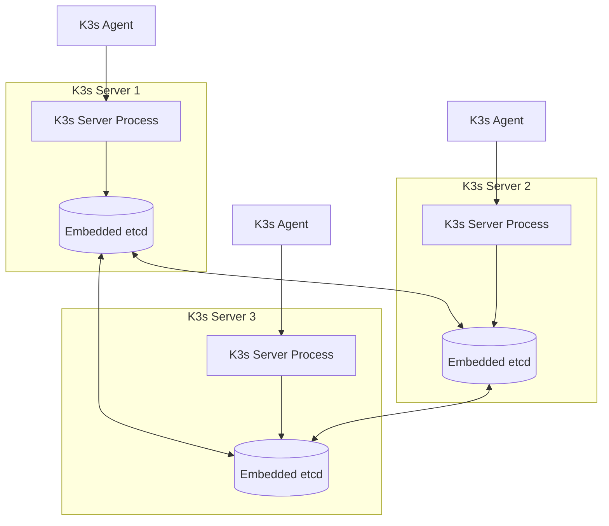
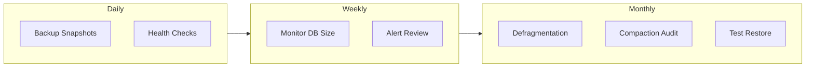
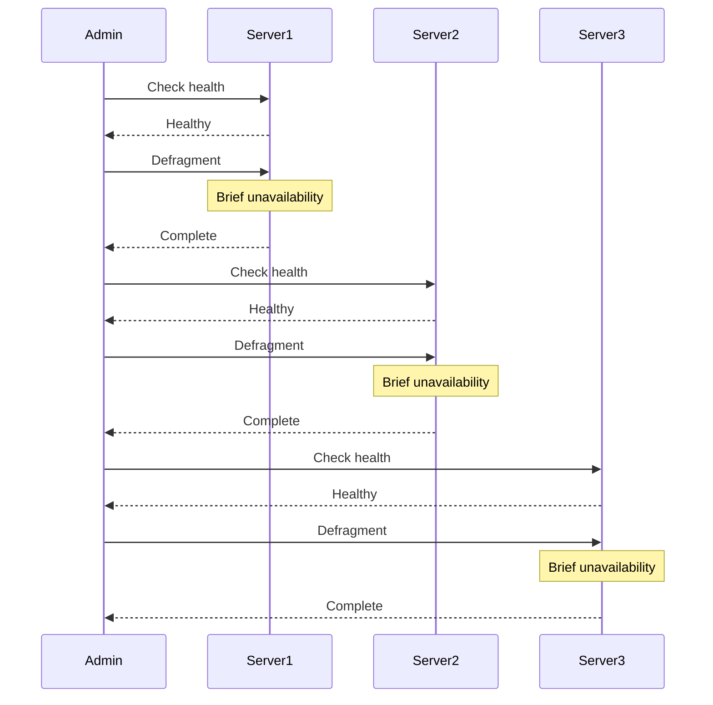
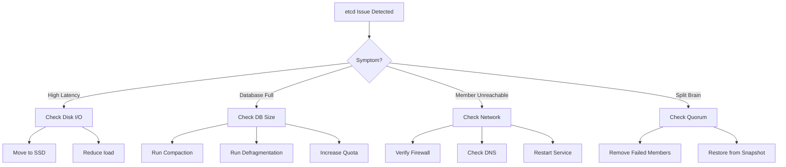

# How to Handle K3s etcd Maintenance

Author: [nawazdhandala](https://www.github.com/nawazdhandala)

Tags: K3s, etcd, Kubernetes, Maintenance, DevOps, High Availability, Backup

Description: A practical guide to maintaining etcd in K3s clusters, covering health checks, backups, compaction, defragmentation, member management, and disaster recovery procedures.

---

K3s simplifies Kubernetes, but running a highly available K3s cluster with embedded etcd requires careful maintenance. Unlike single-node K3s installations that use SQLite, multi-server setups rely on etcd for cluster state storage. Neglecting etcd maintenance can lead to degraded performance, storage bloat, and even cluster failures.

## K3s etcd Architecture Overview

K3s embeds etcd directly into the server binary when running in HA mode. Understanding how components interact helps you maintain the cluster effectively.



## Checking etcd Health in K3s

K3s bundles etcdctl within its binary. You can access it using the k3s etcd-snapshot command or extract etcdctl for direct access.

The following command checks if all etcd members are healthy and reachable:

```bash
# Check etcd member health using K3s built-in command
sudo k3s etcd-snapshot info

# For more detailed health information, use kubectl
kubectl get --raw=/healthz/etcd
```

For direct etcdctl access, K3s stores certificates in a specific location:

```bash
# Set up environment for etcdctl
export ETCDCTL_API=3
export ETCDCTL_ENDPOINTS="https://127.0.0.1:2379"
export ETCDCTL_CACERT="/var/lib/rancher/k3s/server/tls/etcd/server-ca.crt"
export ETCDCTL_CERT="/var/lib/rancher/k3s/server/tls/etcd/server-client.crt"
export ETCDCTL_KEY="/var/lib/rancher/k3s/server/tls/etcd/server-client.key"

# Check endpoint health
etcdctl endpoint health

# View member list
etcdctl member list --write-out=table

# Get detailed endpoint status
etcdctl endpoint status --write-out=table
```

## Regular Maintenance Tasks

Maintaining etcd in K3s involves several recurring tasks that prevent performance degradation.



## Creating etcd Snapshots in K3s

K3s provides a built-in mechanism for etcd snapshots. Manual snapshots can be triggered at any time, while automatic snapshots run on a schedule.

Creating a manual snapshot stores the current etcd state in the snapshots directory:

```bash
# Create a manual snapshot with default name
sudo k3s etcd-snapshot save

# Create a snapshot with a custom name
sudo k3s etcd-snapshot save --name pre-upgrade-$(date +%Y%m%d)

# List all available snapshots
sudo k3s etcd-snapshot ls
```

Configuring automatic snapshots requires modifying K3s server arguments. Add these options to your K3s server configuration:

```bash
# /etc/rancher/k3s/config.yaml
etcd-snapshot-schedule-cron: "0 */6 * * *"  # Every 6 hours
etcd-snapshot-retention: 10                   # Keep 10 snapshots
etcd-snapshot-dir: "/var/lib/rancher/k3s/server/db/snapshots"
```

For production environments, store snapshots externally using S3-compatible storage:

```bash
# Configure S3 backup destination
# /etc/rancher/k3s/config.yaml
etcd-snapshot-schedule-cron: "0 */4 * * *"
etcd-snapshot-retention: 20
etcd-s3: true
etcd-s3-endpoint: "s3.amazonaws.com"
etcd-s3-bucket: "k3s-etcd-backups"
etcd-s3-region: "us-east-1"
etcd-s3-folder: "cluster-prod"
etcd-s3-access-key: "${AWS_ACCESS_KEY}"
etcd-s3-secret-key: "${AWS_SECRET_KEY}"
```

## Monitoring etcd Database Size

etcd performance degrades as the database grows. Monitor the size and take action when it approaches the default 2GB quota.

The following script checks database size and alerts when thresholds are exceeded:

```bash
#!/bin/bash
# check-etcd-size.sh

# Configuration
WARN_THRESHOLD_MB=500
CRIT_THRESHOLD_MB=1500
ETCD_ENDPOINT="https://127.0.0.1:2379"
CERTS_DIR="/var/lib/rancher/k3s/server/tls/etcd"

# Get database size in bytes
DB_SIZE=$(ETCDCTL_API=3 etcdctl endpoint status \
    --endpoints="${ETCD_ENDPOINT}" \
    --cacert="${CERTS_DIR}/server-ca.crt" \
    --cert="${CERTS_DIR}/server-client.crt" \
    --key="${CERTS_DIR}/server-client.key" \
    --write-out=json | jq -r '.[0].Status.dbSize')

# Convert to MB
DB_SIZE_MB=$((DB_SIZE / 1024 / 1024))

echo "etcd database size: ${DB_SIZE_MB}MB"

# Alert logic
if [ "$DB_SIZE_MB" -gt "$CRIT_THRESHOLD_MB" ]; then
    echo "CRITICAL: etcd database size exceeds ${CRIT_THRESHOLD_MB}MB"
    exit 2
elif [ "$DB_SIZE_MB" -gt "$WARN_THRESHOLD_MB" ]; then
    echo "WARNING: etcd database size exceeds ${WARN_THRESHOLD_MB}MB"
    exit 1
else
    echo "OK: etcd database size is within limits"
    exit 0
fi
```

## Compacting etcd History

etcd maintains a history of all key revisions. Compaction removes old revisions to free up space while keeping the current state intact.

K3s automatically compacts etcd every 5 minutes, but you can trigger manual compaction when needed:

```bash
# Get the current revision number
CURRENT_REV=$(ETCDCTL_API=3 etcdctl endpoint status \
    --endpoints="https://127.0.0.1:2379" \
    --cacert="/var/lib/rancher/k3s/server/tls/etcd/server-ca.crt" \
    --cert="/var/lib/rancher/k3s/server/tls/etcd/server-client.crt" \
    --key="/var/lib/rancher/k3s/server/tls/etcd/server-client.key" \
    --write-out=json | jq -r '.[0].Status.header.revision')

echo "Current revision: $CURRENT_REV"

# Compact all revisions before the current one
ETCDCTL_API=3 etcdctl compact $CURRENT_REV \
    --endpoints="https://127.0.0.1:2379" \
    --cacert="/var/lib/rancher/k3s/server/tls/etcd/server-ca.crt" \
    --cert="/var/lib/rancher/k3s/server/tls/etcd/server-client.crt" \
    --key="/var/lib/rancher/k3s/server/tls/etcd/server-client.key"
```

## Defragmenting etcd Storage

Compaction marks space as free but does not return it to the filesystem. Defragmentation reclaims that space.

Running defragmentation on a K3s cluster requires care because the operation blocks the member during execution:

```bash
#!/bin/bash
# defrag-etcd.sh - Run on each K3s server node

CERTS_DIR="/var/lib/rancher/k3s/server/tls/etcd"
ETCD_ENDPOINT="https://127.0.0.1:2379"

# Check size before defrag
echo "=== Size before defragmentation ==="
ETCDCTL_API=3 etcdctl endpoint status \
    --endpoints="${ETCD_ENDPOINT}" \
    --cacert="${CERTS_DIR}/server-ca.crt" \
    --cert="${CERTS_DIR}/server-client.crt" \
    --key="${CERTS_DIR}/server-client.key" \
    --write-out=table

# Create a snapshot before defrag as a safety measure
echo "=== Creating pre-defrag snapshot ==="
sudo k3s etcd-snapshot save --name pre-defrag-$(date +%Y%m%d-%H%M%S)

# Run defragmentation
echo "=== Running defragmentation ==="
ETCDCTL_API=3 etcdctl defrag \
    --endpoints="${ETCD_ENDPOINT}" \
    --cacert="${CERTS_DIR}/server-ca.crt" \
    --cert="${CERTS_DIR}/server-client.crt" \
    --key="${CERTS_DIR}/server-client.key"

# Check size after defrag
echo "=== Size after defragmentation ==="
ETCDCTL_API=3 etcdctl endpoint status \
    --endpoints="${ETCD_ENDPOINT}" \
    --cacert="${CERTS_DIR}/server-ca.crt" \
    --cert="${CERTS_DIR}/server-client.crt" \
    --key="${CERTS_DIR}/server-client.key" \
    --write-out=table
```

For multi-node clusters, defragment one node at a time to maintain availability:



## Managing etcd Cluster Members

Adding or removing etcd members in K3s requires careful orchestration to maintain quorum.

Viewing current cluster membership shows all participating nodes:

```bash
# List all etcd members
ETCDCTL_API=3 etcdctl member list \
    --endpoints="https://127.0.0.1:2379" \
    --cacert="/var/lib/rancher/k3s/server/tls/etcd/server-ca.crt" \
    --cert="/var/lib/rancher/k3s/server/tls/etcd/server-client.crt" \
    --key="/var/lib/rancher/k3s/server/tls/etcd/server-client.key" \
    --write-out=table
```

Removing a failed member requires first identifying its ID, then removing it from the cluster:

```bash
# Get member ID from the member list output
MEMBER_ID="abc123def456"

# Remove the failed member
ETCDCTL_API=3 etcdctl member remove ${MEMBER_ID} \
    --endpoints="https://127.0.0.1:2379" \
    --cacert="/var/lib/rancher/k3s/server/tls/etcd/server-ca.crt" \
    --cert="/var/lib/rancher/k3s/server/tls/etcd/server-client.crt" \
    --key="/var/lib/rancher/k3s/server/tls/etcd/server-client.key"
```

Adding a new server node to an existing K3s HA cluster uses the standard join process:

```bash
# On the new server node
curl -sfL https://get.k3s.io | sh -s - server \
    --server https://existing-server:6443 \
    --token <node-token>
```

## Restoring from etcd Snapshot

Disaster recovery in K3s leverages the built-in snapshot restoration capability.

Restoring from a local snapshot brings the cluster back to a previous state:

```bash
# Stop K3s on all server nodes first
sudo systemctl stop k3s

# On the primary server, restore from snapshot
sudo k3s server \
    --cluster-reset \
    --cluster-reset-restore-path=/var/lib/rancher/k3s/server/db/snapshots/snapshot-name

# After restoration completes, start K3s normally
sudo systemctl start k3s
```

Restoring from S3 requires specifying the remote location:

```bash
# Stop K3s on all server nodes
sudo systemctl stop k3s

# Restore from S3
sudo k3s server \
    --cluster-reset \
    --etcd-s3 \
    --etcd-s3-bucket=k3s-etcd-backups \
    --etcd-s3-endpoint=s3.amazonaws.com \
    --etcd-s3-region=us-east-1 \
    --etcd-s3-folder=cluster-prod \
    --etcd-s3-access-key="${AWS_ACCESS_KEY}" \
    --etcd-s3-secret-key="${AWS_SECRET_KEY}" \
    --cluster-reset-restore-path=snapshot-name

# Start K3s after restoration
sudo systemctl start k3s
```

After restoring the primary server, rejoin other server nodes:

```bash
# On secondary server nodes, remove old etcd data
sudo rm -rf /var/lib/rancher/k3s/server/db/etcd

# Start K3s to rejoin the cluster
sudo systemctl start k3s
```

## Automated Maintenance Script

Combining all maintenance tasks into a single automated script simplifies operations:

```bash
#!/bin/bash
# k3s-etcd-maintenance.sh

set -e

LOG_FILE="/var/log/k3s-etcd-maintenance.log"
CERTS_DIR="/var/lib/rancher/k3s/server/tls/etcd"
ETCD_ENDPOINT="https://127.0.0.1:2379"
SNAPSHOT_RETENTION=10
SIZE_WARN_MB=500

log() {
    echo "[$(date '+%Y-%m-%d %H:%M:%S')] $1" | tee -a "$LOG_FILE"
}

check_health() {
    log "Checking etcd health..."
    if ! ETCDCTL_API=3 etcdctl endpoint health \
        --endpoints="${ETCD_ENDPOINT}" \
        --cacert="${CERTS_DIR}/server-ca.crt" \
        --cert="${CERTS_DIR}/server-client.crt" \
        --key="${CERTS_DIR}/server-client.key" 2>&1 | tee -a "$LOG_FILE"; then
        log "ERROR: etcd health check failed"
        return 1
    fi
    log "etcd is healthy"
}

check_size() {
    log "Checking database size..."
    local size_bytes
    size_bytes=$(ETCDCTL_API=3 etcdctl endpoint status \
        --endpoints="${ETCD_ENDPOINT}" \
        --cacert="${CERTS_DIR}/server-ca.crt" \
        --cert="${CERTS_DIR}/server-client.crt" \
        --key="${CERTS_DIR}/server-client.key" \
        --write-out=json | jq -r '.[0].Status.dbSize')

    local size_mb=$((size_bytes / 1024 / 1024))
    log "Database size: ${size_mb}MB"

    if [ "$size_mb" -gt "$SIZE_WARN_MB" ]; then
        log "WARNING: Database size exceeds ${SIZE_WARN_MB}MB threshold"
        return 1
    fi
}

create_snapshot() {
    log "Creating etcd snapshot..."
    if sudo k3s etcd-snapshot save --name "maintenance-$(date +%Y%m%d-%H%M%S)" 2>&1 | tee -a "$LOG_FILE"; then
        log "Snapshot created successfully"
    else
        log "ERROR: Failed to create snapshot"
        return 1
    fi
}

cleanup_snapshots() {
    log "Cleaning up old snapshots..."
    local snapshot_dir="/var/lib/rancher/k3s/server/db/snapshots"
    local count
    count=$(ls -1 "$snapshot_dir"/*.db 2>/dev/null | wc -l)

    if [ "$count" -gt "$SNAPSHOT_RETENTION" ]; then
        local to_delete=$((count - SNAPSHOT_RETENTION))
        log "Removing $to_delete old snapshots"
        ls -1t "$snapshot_dir"/*.db | tail -n "$to_delete" | xargs rm -f
    fi
}

run_compaction() {
    log "Running compaction..."
    local rev
    rev=$(ETCDCTL_API=3 etcdctl endpoint status \
        --endpoints="${ETCD_ENDPOINT}" \
        --cacert="${CERTS_DIR}/server-ca.crt" \
        --cert="${CERTS_DIR}/server-client.crt" \
        --key="${CERTS_DIR}/server-client.key" \
        --write-out=json | jq -r '.[0].Status.header.revision')

    ETCDCTL_API=3 etcdctl compact "$rev" \
        --endpoints="${ETCD_ENDPOINT}" \
        --cacert="${CERTS_DIR}/server-ca.crt" \
        --cert="${CERTS_DIR}/server-client.crt" \
        --key="${CERTS_DIR}/server-client.key" 2>&1 | tee -a "$LOG_FILE"

    log "Compaction complete at revision $rev"
}

# Main execution
log "=== Starting K3s etcd maintenance ==="

check_health || exit 1
check_size
create_snapshot
cleanup_snapshots
run_compaction

log "=== K3s etcd maintenance complete ==="
```

Schedule the maintenance script using cron:

```bash
# Add to crontab
# Run maintenance daily at 3 AM
0 3 * * * /usr/local/bin/k3s-etcd-maintenance.sh
```

## Monitoring and Alerting

Integrating etcd metrics with your monitoring stack provides visibility into cluster health.

K3s exposes etcd metrics on the metrics endpoint. Configure Prometheus to scrape them:

```yaml
# prometheus-config.yaml
scrape_configs:
  - job_name: 'k3s-etcd'
    scheme: https
    tls_config:
      ca_file: /etc/prometheus/etcd-ca.crt
      cert_file: /etc/prometheus/etcd-client.crt
      key_file: /etc/prometheus/etcd-client.key
    static_configs:
      - targets:
        - 'k3s-server-1:2379'
        - 'k3s-server-2:2379'
        - 'k3s-server-3:2379'
```

Set up alerts for critical conditions:

```yaml
# etcd-alerts.yaml
groups:
  - name: k3s-etcd
    rules:
      - alert: EtcdHighDatabaseSize
        expr: etcd_mvcc_db_total_size_in_bytes > 500000000
        for: 10m
        labels:
          severity: warning
        annotations:
          summary: "etcd database size is high"
          description: "etcd database size exceeds 500MB"

      - alert: EtcdMemberDown
        expr: up{job="k3s-etcd"} == 0
        for: 5m
        labels:
          severity: critical
        annotations:
          summary: "etcd member is down"
          description: "An etcd cluster member has been unreachable for 5 minutes"

      - alert: EtcdHighLatency
        expr: histogram_quantile(0.99, rate(etcd_disk_wal_fsync_duration_seconds_bucket[5m])) > 0.5
        for: 10m
        labels:
          severity: warning
        annotations:
          summary: "etcd write latency is high"
          description: "etcd fsync latency p99 exceeds 500ms"
```

## Troubleshooting Common Issues

When etcd problems arise, systematic diagnosis helps identify root causes.

### Symptoms and Solutions



### Debugging Commands

When investigating issues, these commands provide essential information:

```bash
# Check K3s server logs for etcd errors
sudo journalctl -u k3s -f | grep -i etcd

# Verify etcd data directory permissions
ls -la /var/lib/rancher/k3s/server/db/etcd/

# Check disk space on etcd partition
df -h /var/lib/rancher/k3s/server/db/

# Test network connectivity between etcd members
nc -zv k3s-server-2 2379
nc -zv k3s-server-3 2379

# View etcd configuration in K3s
sudo cat /var/lib/rancher/k3s/server/db/etcd/config
```

## Best Practices Summary

Following these guidelines ensures reliable etcd operation in K3s clusters:

1. **Backup frequently**: Configure automatic snapshots every 4-6 hours
2. **Store backups externally**: Use S3 or equivalent object storage
3. **Monitor database size**: Alert before reaching the 2GB default quota
4. **Test restores quarterly**: Verify backups work in a staging environment
5. **Use SSDs**: etcd performance depends heavily on disk I/O
6. **Maintain odd member counts**: Run 3 or 5 server nodes for proper quorum
7. **Defragment during low traffic**: Schedule maintenance windows appropriately
8. **Keep K3s updated**: Security patches and bug fixes improve stability

---

etcd maintenance in K3s requires consistent attention but the embedded architecture simplifies many operations compared to standalone etcd clusters. Regular backups, proactive monitoring, and scheduled maintenance prevent most issues before they impact your workloads. Build these practices into your operational routine to keep your K3s clusters running smoothly.
