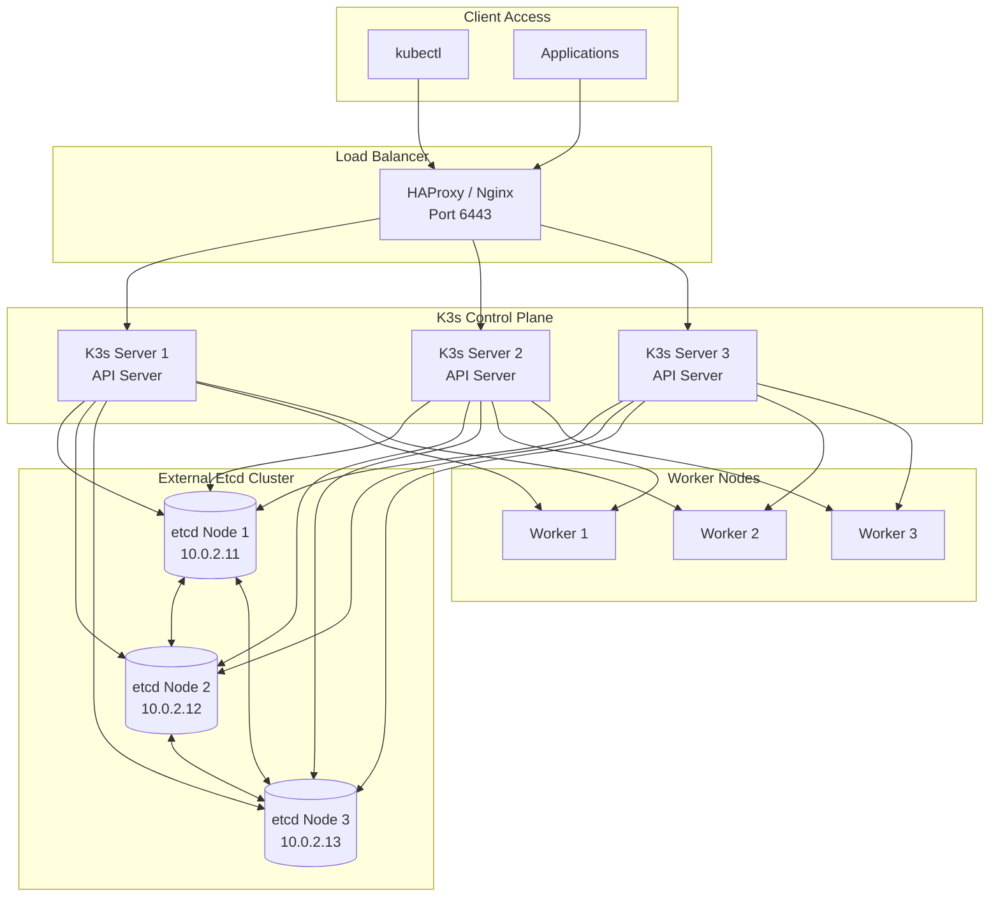
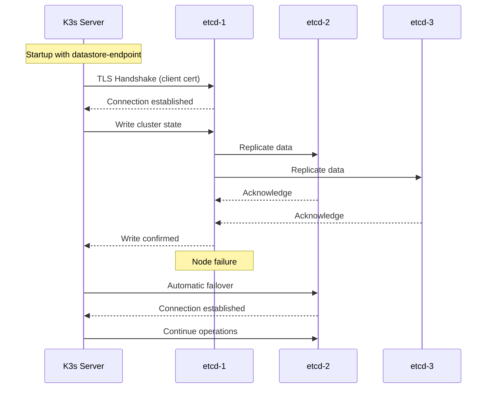

# How to Configure K3s with External Etcd Cluster

Author: [nawazdhandala](https://github.com/nawazdhandala)

Tags: K3s, Kubernetes, etcd, External Cluster, High Availability, DevOps, Infrastructure

Description: A comprehensive guide to configuring K3s with an external etcd cluster for production deployments, covering etcd cluster setup, TLS configuration, K3s integration, failover testing, and operational best practices.

---

Running K3s with an external etcd cluster separates your control plane from your datastore, giving you independent scaling, better resource isolation, and the flexibility to use existing etcd infrastructure. While K3s supports embedded etcd and external databases like PostgreSQL, connecting to an external etcd cluster offers the lowest latency and maintains full compatibility with standard Kubernetes tooling.

Production environments often benefit from dedicated etcd nodes that can be tuned specifically for the write-heavy workload etcd handles. By offloading etcd to separate machines, your K3s server nodes focus entirely on API server responsibilities, and you gain the ability to scale each layer independently based on actual resource demands.

## Table of Contents

1. [Why Use External Etcd with K3s](#why-use-external-etcd-with-k3s)
2. [Architecture Overview](#architecture-overview)
3. [Prerequisites and Planning](#prerequisites-and-planning)
4. [Setting Up the External Etcd Cluster](#setting-up-the-external-etcd-cluster)
5. [Generating TLS Certificates](#generating-tls-certificates)
6. [Configuring Etcd Nodes](#configuring-etcd-nodes)
7. [Connecting K3s to External Etcd](#connecting-k3s-to-external-etcd)
8. [Adding Additional K3s Server Nodes](#adding-additional-k3s-server-nodes)
9. [Testing the Configuration](#testing-the-configuration)
10. [Monitoring Etcd Health](#monitoring-etcd-health)
11. [Backup and Recovery](#backup-and-recovery)
12. [Troubleshooting Common Issues](#troubleshooting-common-issues)
13. [Conclusion](#conclusion)

## Why Use External Etcd with K3s

K3s offers three datastore options: SQLite (single node), embedded etcd (HA), and external datastore. An external etcd cluster provides specific advantages over the alternatives.

**Resource Isolation**: Etcd has strict performance requirements. Dedicated etcd nodes ensure the database never competes with API server workloads for CPU, memory, or disk I/O.

**Independent Scaling**: Scale your etcd cluster and K3s control plane separately. Add etcd nodes for more write capacity or K3s servers for more API throughput without affecting the other layer.

**Existing Infrastructure**: Organizations already running etcd for other services can extend that infrastructure to K3s rather than managing multiple etcd deployments.

**Specialized Hardware**: Etcd benefits enormously from fast storage. Dedicating nodes with NVMe drives to etcd while using standard SSDs for K3s servers optimizes your hardware investment.

**Operational Flexibility**: Separate clusters allow independent maintenance windows. Upgrade etcd without touching K3s, or vice versa.

## Architecture Overview

An external etcd deployment separates the data layer from the control plane layer. K3s servers connect to the etcd cluster over the network using TLS for security.



### Communication Flow

K3s servers communicate with etcd using client TLS certificates. All etcd nodes accept connections from any K3s server, providing automatic failover when individual etcd nodes become unavailable.

The etcd peer communication uses separate certificates for cluster-internal traffic. Keeping client and peer certificates separate improves security by limiting what each certificate can access.

## Prerequisites and Planning

Before deploying, gather information about your environment and prepare the necessary resources.

### Hardware Requirements

The following table outlines minimum specifications. Production environments should use the recommended values or higher.

| Component | Minimum | Recommended | Notes |
|-----------|---------|-------------|-------|
| Etcd CPU | 2 cores | 4 cores | Etcd benefits from fast single-thread performance |
| Etcd RAM | 2GB | 8GB | Memory impacts read performance significantly |
| Etcd Disk | 20GB SSD | 80GB NVMe | Fast fsync is critical for etcd |
| K3s Server CPU | 2 cores | 4 cores | Scales with cluster size |
| K3s Server RAM | 4GB | 8GB | API server caches objects in memory |
| K3s Server Disk | 30GB SSD | 50GB SSD | Stores container images and logs |

### Network Configuration

Plan your IP addresses before installation. Changing IPs after deployment requires cluster reconfiguration.

The script below documents a sample network layout. Adjust these values for your environment.

```bash
#!/bin/bash
# network-plan.sh
# Document your network configuration before deployment

# Etcd cluster nodes - dedicated machines for the datastore
ETCD_NODE_1="10.0.2.11"
ETCD_NODE_2="10.0.2.12"
ETCD_NODE_3="10.0.2.13"

# K3s server nodes - run the Kubernetes API server
K3S_SERVER_1="10.0.1.21"
K3S_SERVER_2="10.0.1.22"
K3S_SERVER_3="10.0.1.23"

# Load balancer virtual IP - workers and kubectl connect here
VIP_ADDRESS="10.0.1.100"

# Etcd cluster name - used in peer URLs and identification
ETCD_CLUSTER_NAME="k3s-etcd"

# DNS names for TLS certificates (optional but recommended)
ETCD_DNS="etcd.internal.example.com"
K3S_DNS="k3s.example.com"
```

### Port Requirements

Ensure these ports are accessible between the appropriate nodes.

| Port | Protocol | Source | Destination | Purpose |
|------|----------|--------|-------------|---------|
| 2379 | TCP | K3s Servers | Etcd Nodes | Etcd client connections |
| 2380 | TCP | Etcd Nodes | Etcd Nodes | Etcd peer communication |
| 6443 | TCP | Workers, kubectl | K3s Servers | Kubernetes API |
| 10250 | TCP | K3s Servers | All Nodes | Kubelet API |

## Setting Up the External Etcd Cluster

An etcd cluster requires careful setup to ensure reliability. Follow these steps on each etcd node.

### Step 1: Prepare Etcd Nodes

Run the following preparation script on all three etcd nodes. The script installs etcd and creates the necessary directories.

```bash
#!/bin/bash
# prepare-etcd-node.sh
# Run on each etcd node before cluster initialization

set -e

# Etcd version to install - check https://github.com/etcd-io/etcd/releases for latest
ETCD_VERSION="v3.5.11"

echo "Preparing etcd node..."

# Create etcd user and group for security
sudo useradd --system --home /var/lib/etcd --shell /bin/false etcd || true

# Create required directories with appropriate ownership
sudo mkdir -p /var/lib/etcd
sudo mkdir -p /etc/etcd/ssl
sudo chown -R etcd:etcd /var/lib/etcd
sudo chmod 700 /var/lib/etcd

# Download and install etcd binaries
DOWNLOAD_URL="https://github.com/etcd-io/etcd/releases/download"
curl -L "${DOWNLOAD_URL}/${ETCD_VERSION}/etcd-${ETCD_VERSION}-linux-amd64.tar.gz" -o /tmp/etcd.tar.gz

# Extract binaries to /usr/local/bin
tar xzf /tmp/etcd.tar.gz -C /tmp
sudo mv /tmp/etcd-${ETCD_VERSION}-linux-amd64/etcd /usr/local/bin/
sudo mv /tmp/etcd-${ETCD_VERSION}-linux-amd64/etcdctl /usr/local/bin/
sudo mv /tmp/etcd-${ETCD_VERSION}-linux-amd64/etcdutl /usr/local/bin/

# Verify installation
etcd --version
etcdctl version

# Clean up downloaded files
rm -rf /tmp/etcd*

echo "Etcd installation complete on $(hostname)"
```

### Step 2: Configure System for Etcd

Etcd requires specific system settings for optimal performance. Apply these configurations on all etcd nodes.

```bash
#!/bin/bash
# configure-etcd-system.sh
# System optimizations for etcd performance

set -e

echo "Configuring system for etcd..."

# Increase file descriptor limits - etcd opens many connections
cat <<EOF | sudo tee /etc/security/limits.d/etcd.conf
etcd soft nofile 65536
etcd hard nofile 65536
etcd soft nproc 65536
etcd hard nproc 65536
EOF

# Configure kernel parameters for networking
cat <<EOF | sudo tee /etc/sysctl.d/99-etcd.conf
# Allow more network connections
net.core.somaxconn = 32768
net.ipv4.tcp_max_syn_backlog = 32768

# Reduce TCP timeout for faster failover detection
net.ipv4.tcp_fin_timeout = 15

# Enable TCP keepalives
net.ipv4.tcp_keepalive_time = 600
net.ipv4.tcp_keepalive_intvl = 30
net.ipv4.tcp_keepalive_probes = 10
EOF

sudo sysctl --system

# Disable swap - etcd performs poorly with swap
sudo swapoff -a
sudo sed -i '/swap/d' /etc/fstab

echo "System configuration complete"
```

## Generating TLS Certificates

Etcd requires TLS certificates for both client and peer communication. Generate these certificates before starting the cluster.

### Create Certificate Authority

The Certificate Authority (CA) signs all other certificates. Keep the CA private key secure.

```bash
#!/bin/bash
# create-ca.sh
# Generate the Certificate Authority for etcd TLS

set -e

CERT_DIR="./etcd-certs"
mkdir -p "$CERT_DIR"
cd "$CERT_DIR"

echo "Creating Certificate Authority..."

# Generate CA private key with strong encryption
openssl genrsa -out ca.key 4096

# Create CA certificate valid for 10 years
# Adjust the subject for your organization
openssl req -x509 -new -nodes \
    -key ca.key \
    -sha256 \
    -days 3650 \
    -out ca.crt \
    -subj "/CN=etcd-ca/O=Kubernetes/C=US"

echo "CA certificate created: $CERT_DIR/ca.crt"
echo "CA private key created: $CERT_DIR/ca.key"
echo ""
echo "Keep ca.key secure - it can sign any certificate for your cluster"
```

### Generate Etcd Server Certificates

Each etcd node needs its own server certificate with the correct IP addresses and hostnames.

```bash
#!/bin/bash
# create-etcd-certs.sh
# Generate server certificates for each etcd node

set -e

CERT_DIR="./etcd-certs"
cd "$CERT_DIR"

# Define your etcd nodes - adjust these IP addresses
ETCD_NODES=(
    "etcd-1:10.0.2.11"
    "etcd-2:10.0.2.12"
    "etcd-3:10.0.2.13"
)

for NODE_INFO in "${ETCD_NODES[@]}"; do
    # Parse node name and IP from the array
    NODE_NAME="${NODE_INFO%%:*}"
    NODE_IP="${NODE_INFO##*:}"

    echo "Creating certificates for $NODE_NAME ($NODE_IP)..."

    # Generate private key for the node
    openssl genrsa -out "${NODE_NAME}.key" 2048

    # Create certificate signing request configuration
    # Includes both IP and DNS SANs for flexibility
    cat > "${NODE_NAME}.cnf" <<EOF
[req]
req_extensions = v3_req
distinguished_name = req_distinguished_name
prompt = no

[req_distinguished_name]
CN = ${NODE_NAME}

[v3_req]
keyUsage = critical, digitalSignature, keyEncipherment
extendedKeyUsage = serverAuth, clientAuth
subjectAltName = @alt_names

[alt_names]
DNS.1 = ${NODE_NAME}
DNS.2 = ${NODE_NAME}.local
DNS.3 = localhost
IP.1 = ${NODE_IP}
IP.2 = 127.0.0.1
EOF

    # Generate CSR using the configuration
    openssl req -new \
        -key "${NODE_NAME}.key" \
        -out "${NODE_NAME}.csr" \
        -config "${NODE_NAME}.cnf"

    # Sign the certificate with the CA
    # Valid for 2 years - plan certificate rotation
    openssl x509 -req \
        -in "${NODE_NAME}.csr" \
        -CA ca.crt \
        -CAkey ca.key \
        -CAcreateserial \
        -out "${NODE_NAME}.crt" \
        -days 730 \
        -sha256 \
        -extensions v3_req \
        -extfile "${NODE_NAME}.cnf"

    # Verify the certificate
    openssl verify -CAfile ca.crt "${NODE_NAME}.crt"

    echo "Certificate for $NODE_NAME created successfully"
    echo ""
done

echo "All etcd server certificates generated"
```

### Generate Client Certificate for K3s

K3s servers connect to etcd using a client certificate. Create a single client certificate that all K3s servers share.

```bash
#!/bin/bash
# create-client-cert.sh
# Generate client certificate for K3s to connect to etcd

set -e

CERT_DIR="./etcd-certs"
cd "$CERT_DIR"

echo "Creating K3s client certificate..."

# Generate private key
openssl genrsa -out k3s-client.key 2048

# Create certificate configuration
cat > k3s-client.cnf <<EOF
[req]
req_extensions = v3_req
distinguished_name = req_distinguished_name
prompt = no

[req_distinguished_name]
CN = k3s-client
O = k3s

[v3_req]
keyUsage = critical, digitalSignature, keyEncipherment
extendedKeyUsage = clientAuth
EOF

# Generate CSR
openssl req -new \
    -key k3s-client.key \
    -out k3s-client.csr \
    -config k3s-client.cnf

# Sign with CA
openssl x509 -req \
    -in k3s-client.csr \
    -CA ca.crt \
    -CAkey ca.key \
    -CAcreateserial \
    -out k3s-client.crt \
    -days 730 \
    -sha256 \
    -extensions v3_req \
    -extfile k3s-client.cnf

# Verify the certificate
openssl verify -CAfile ca.crt k3s-client.crt

echo "Client certificate created: k3s-client.crt"
echo "Client key created: k3s-client.key"
```

### Distribute Certificates

Copy the appropriate certificates to each node.

```bash
#!/bin/bash
# distribute-certs.sh
# Copy certificates to etcd and K3s nodes

set -e

CERT_DIR="./etcd-certs"

# Etcd nodes receive CA, server cert, and server key
ETCD_HOSTS=("10.0.2.11" "10.0.2.12" "10.0.2.13")
ETCD_NAMES=("etcd-1" "etcd-2" "etcd-3")

for i in "${!ETCD_HOSTS[@]}"; do
    HOST="${ETCD_HOSTS[$i]}"
    NAME="${ETCD_NAMES[$i]}"

    echo "Copying certificates to $NAME ($HOST)..."

    # Create SSL directory on the remote node
    ssh "root@${HOST}" "mkdir -p /etc/etcd/ssl && chmod 700 /etc/etcd/ssl"

    # Copy CA certificate
    scp "${CERT_DIR}/ca.crt" "root@${HOST}:/etc/etcd/ssl/"

    # Copy node-specific certificate and key
    scp "${CERT_DIR}/${NAME}.crt" "root@${HOST}:/etc/etcd/ssl/server.crt"
    scp "${CERT_DIR}/${NAME}.key" "root@${HOST}:/etc/etcd/ssl/server.key"

    # Set correct ownership and permissions
    ssh "root@${HOST}" "chown -R etcd:etcd /etc/etcd/ssl && chmod 600 /etc/etcd/ssl/*.key"

    echo "Certificates installed on $NAME"
done

# K3s servers receive CA and client certificates
K3S_HOSTS=("10.0.1.21" "10.0.1.22" "10.0.1.23")

for HOST in "${K3S_HOSTS[@]}"; do
    echo "Copying client certificates to K3s server $HOST..."

    ssh "root@${HOST}" "mkdir -p /etc/rancher/k3s/etcd-certs && chmod 700 /etc/rancher/k3s/etcd-certs"

    scp "${CERT_DIR}/ca.crt" "root@${HOST}:/etc/rancher/k3s/etcd-certs/"
    scp "${CERT_DIR}/k3s-client.crt" "root@${HOST}:/etc/rancher/k3s/etcd-certs/"
    scp "${CERT_DIR}/k3s-client.key" "root@${HOST}:/etc/rancher/k3s/etcd-certs/"

    ssh "root@${HOST}" "chmod 600 /etc/rancher/k3s/etcd-certs/*.key"

    echo "Certificates installed on K3s server $HOST"
done

echo "Certificate distribution complete"
```

## Configuring Etcd Nodes

Each etcd node runs with a configuration file that defines cluster membership and TLS settings.

### Etcd Node 1 Configuration

Create the systemd service file and configuration for the first etcd node. Other nodes use similar configurations with adjusted names and IPs.

```bash
# /etc/etcd/etcd.conf
# Configuration for etcd-1 (10.0.2.11)
# Adjust ETCD_NAME and IP addresses for other nodes

# Member configuration
ETCD_NAME="etcd-1"
ETCD_DATA_DIR="/var/lib/etcd"
ETCD_LISTEN_PEER_URLS="https://10.0.2.11:2380"
ETCD_LISTEN_CLIENT_URLS="https://10.0.2.11:2379,https://127.0.0.1:2379"

# Clustering configuration
ETCD_INITIAL_ADVERTISE_PEER_URLS="https://10.0.2.11:2380"
ETCD_ADVERTISE_CLIENT_URLS="https://10.0.2.11:2379"
ETCD_INITIAL_CLUSTER="etcd-1=https://10.0.2.11:2380,etcd-2=https://10.0.2.12:2380,etcd-3=https://10.0.2.13:2380"
ETCD_INITIAL_CLUSTER_STATE="new"
ETCD_INITIAL_CLUSTER_TOKEN="k3s-etcd-cluster"

# TLS configuration for client connections
ETCD_CERT_FILE="/etc/etcd/ssl/server.crt"
ETCD_KEY_FILE="/etc/etcd/ssl/server.key"
ETCD_CLIENT_CERT_AUTH="true"
ETCD_TRUSTED_CA_FILE="/etc/etcd/ssl/ca.crt"

# TLS configuration for peer connections
ETCD_PEER_CERT_FILE="/etc/etcd/ssl/server.crt"
ETCD_PEER_KEY_FILE="/etc/etcd/ssl/server.key"
ETCD_PEER_CLIENT_CERT_AUTH="true"
ETCD_PEER_TRUSTED_CA_FILE="/etc/etcd/ssl/ca.crt"

# Performance tuning
ETCD_HEARTBEAT_INTERVAL="250"
ETCD_ELECTION_TIMEOUT="1500"
ETCD_SNAPSHOT_COUNT="10000"
ETCD_MAX_SNAPSHOTS="5"
ETCD_MAX_WALS="5"
```

Create the systemd service file. The service loads configuration from the etcd.conf file.

```bash
# /etc/systemd/system/etcd.service
# Systemd service file for etcd

[Unit]
Description=etcd distributed key-value store
Documentation=https://etcd.io/docs/
After=network.target
Wants=network-online.target

[Service]
Type=notify
User=etcd
Group=etcd
EnvironmentFile=/etc/etcd/etcd.conf
ExecStart=/usr/local/bin/etcd

# Restart configuration
Restart=always
RestartSec=10s

# Resource limits
LimitNOFILE=65536

# Security hardening
NoNewPrivileges=true
ProtectSystem=full
ProtectHome=true

[Install]
WantedBy=multi-user.target
```

### Start Etcd Cluster

Start etcd on all nodes simultaneously or in quick succession. The cluster forms once a quorum of nodes joins.

```bash
#!/bin/bash
# start-etcd-cluster.sh
# Start etcd on all nodes

ETCD_HOSTS=("10.0.2.11" "10.0.2.12" "10.0.2.13")

echo "Starting etcd cluster..."

# Start etcd on all nodes in parallel
for HOST in "${ETCD_HOSTS[@]}"; do
    echo "Starting etcd on $HOST..."
    ssh "root@${HOST}" "systemctl daemon-reload && systemctl enable etcd && systemctl start etcd" &
done

# Wait for all SSH commands to complete
wait

echo "Waiting for cluster to form..."
sleep 10

# Check cluster health from the first node
ssh "root@${ETCD_HOSTS[0]}" "ETCDCTL_API=3 etcdctl \
    --endpoints=https://127.0.0.1:2379 \
    --cacert=/etc/etcd/ssl/ca.crt \
    --cert=/etc/etcd/ssl/server.crt \
    --key=/etc/etcd/ssl/server.key \
    member list"

echo ""
echo "Checking endpoint health..."
ssh "root@${ETCD_HOSTS[0]}" "ETCDCTL_API=3 etcdctl \
    --endpoints=https://10.0.2.11:2379,https://10.0.2.12:2379,https://10.0.2.13:2379 \
    --cacert=/etc/etcd/ssl/ca.crt \
    --cert=/etc/etcd/ssl/server.crt \
    --key=/etc/etcd/ssl/server.key \
    endpoint health"
```

## Connecting K3s to External Etcd

With the etcd cluster running, configure K3s to use it as the datastore.

### K3s Server Configuration

The `--datastore-endpoint` flag tells K3s to connect to external etcd. The endpoint string includes all etcd nodes for failover.

Install K3s on the first server node with the external etcd configuration.

```bash
#!/bin/bash
# install-k3s-server.sh
# Install first K3s server with external etcd

set -e

# Configuration variables - adjust for your environment
export K3S_TOKEN=$(openssl rand -hex 32)
export NODE_IP="10.0.1.21"
export VIP_ADDRESS="10.0.1.100"

# Etcd endpoint configuration
# List all etcd nodes for automatic failover
ETCD_ENDPOINTS="https://10.0.2.11:2379,https://10.0.2.12:2379,https://10.0.2.13:2379"

# TLS certificate paths
ETCD_CA="/etc/rancher/k3s/etcd-certs/ca.crt"
ETCD_CERT="/etc/rancher/k3s/etcd-certs/k3s-client.crt"
ETCD_KEY="/etc/rancher/k3s/etcd-certs/k3s-client.key"

echo "Installing K3s with external etcd..."
echo "K3S_TOKEN: $K3S_TOKEN"
echo "Save the token - you will need it for additional servers and workers"

# Install K3s server
curl -sfL https://get.k3s.io | sh -s - server \
    --token="$K3S_TOKEN" \
    --node-ip="$NODE_IP" \
    --tls-san="$VIP_ADDRESS" \
    --tls-san="k3s.example.com" \
    --datastore-endpoint="$ETCD_ENDPOINTS" \
    --datastore-cafile="$ETCD_CA" \
    --datastore-certfile="$ETCD_CERT" \
    --datastore-keyfile="$ETCD_KEY" \
    --disable=traefik \
    --disable=servicelb \
    --write-kubeconfig-mode=644

echo "Waiting for K3s to start..."
sleep 30

# Verify K3s is running
sudo systemctl status k3s
sudo kubectl get nodes

echo ""
echo "K3s installed successfully"
echo "Token for additional nodes: $K3S_TOKEN"
```

### Understanding the Datastore Flags

The following diagram shows how K3s connects to the external etcd cluster.



K3s attempts connections to endpoints in order and maintains connections to all available nodes. When an etcd node fails, K3s automatically routes requests to healthy nodes without intervention.

## Adding Additional K3s Server Nodes

Additional K3s servers join using the same etcd configuration and the cluster token from the first server.

```bash
#!/bin/bash
# join-k3s-server.sh
# Join additional K3s server to the cluster

set -e

# Get the token from the first server
export K3S_TOKEN="your-token-from-first-server"
export NODE_IP="10.0.1.22"  # Adjust for each additional server
export VIP_ADDRESS="10.0.1.100"
export FIRST_SERVER="10.0.1.21"

# Etcd configuration - same for all K3s servers
ETCD_ENDPOINTS="https://10.0.2.11:2379,https://10.0.2.12:2379,https://10.0.2.13:2379"
ETCD_CA="/etc/rancher/k3s/etcd-certs/ca.crt"
ETCD_CERT="/etc/rancher/k3s/etcd-certs/k3s-client.crt"
ETCD_KEY="/etc/rancher/k3s/etcd-certs/k3s-client.key"

echo "Joining K3s cluster..."

# Join the cluster
# The --server flag tells K3s where to find the existing cluster
curl -sfL https://get.k3s.io | sh -s - server \
    --token="$K3S_TOKEN" \
    --server="https://${FIRST_SERVER}:6443" \
    --node-ip="$NODE_IP" \
    --tls-san="$VIP_ADDRESS" \
    --tls-san="k3s.example.com" \
    --datastore-endpoint="$ETCD_ENDPOINTS" \
    --datastore-cafile="$ETCD_CA" \
    --datastore-certfile="$ETCD_CERT" \
    --datastore-keyfile="$ETCD_KEY" \
    --disable=traefik \
    --disable=servicelb \
    --write-kubeconfig-mode=644

sleep 30

# Verify the node joined
sudo kubectl get nodes
```

## Testing the Configuration

Verify the external etcd integration works correctly before deploying workloads.

### Verify Etcd Connectivity

Test that K3s can read and write to etcd.

```bash
#!/bin/bash
# test-etcd-connectivity.sh
# Verify K3s can communicate with external etcd

set -e

echo "=== Etcd Connectivity Test ==="

# Check K3s datastore configuration
echo "1. Checking K3s service status..."
sudo systemctl status k3s | head -20

# Verify etcd cluster health from K3s server
echo ""
echo "2. Testing etcd endpoint connectivity..."
ETCDCTL_API=3 etcdctl \
    --endpoints=https://10.0.2.11:2379,https://10.0.2.12:2379,https://10.0.2.13:2379 \
    --cacert=/etc/rancher/k3s/etcd-certs/ca.crt \
    --cert=/etc/rancher/k3s/etcd-certs/k3s-client.crt \
    --key=/etc/rancher/k3s/etcd-certs/k3s-client.key \
    endpoint health

# List etcd cluster members
echo ""
echo "3. Etcd cluster members..."
ETCDCTL_API=3 etcdctl \
    --endpoints=https://10.0.2.11:2379 \
    --cacert=/etc/rancher/k3s/etcd-certs/ca.crt \
    --cert=/etc/rancher/k3s/etcd-certs/k3s-client.crt \
    --key=/etc/rancher/k3s/etcd-certs/k3s-client.key \
    member list -w table

# Check etcd leader
echo ""
echo "4. Current etcd leader..."
ETCDCTL_API=3 etcdctl \
    --endpoints=https://10.0.2.11:2379,https://10.0.2.12:2379,https://10.0.2.13:2379 \
    --cacert=/etc/rancher/k3s/etcd-certs/ca.crt \
    --cert=/etc/rancher/k3s/etcd-certs/k3s-client.crt \
    --key=/etc/rancher/k3s/etcd-certs/k3s-client.key \
    endpoint status -w table

echo ""
echo "=== Connectivity test complete ==="
```

### Test Failover

Simulate an etcd node failure to verify automatic failover.

```bash
#!/bin/bash
# test-etcd-failover.sh
# Test K3s resilience to etcd node failure

set -e

echo "=== Etcd Failover Test ==="
echo "WARNING: Running in a test environment only"
echo ""

# Record initial state
echo "1. Initial cluster state..."
kubectl get nodes
kubectl get pods -n kube-system | head -10

# Stop one etcd node
echo ""
echo "2. Stopping etcd-1..."
ssh root@10.0.2.11 "systemctl stop etcd"

# Wait for detection
sleep 5

# Verify cluster still works
echo ""
echo "3. Testing cluster operations with etcd-1 down..."
kubectl get nodes
kubectl create deployment failover-test --image=nginx --replicas=2
kubectl get deployment failover-test

# Clean up test deployment
kubectl delete deployment failover-test

# Restart the stopped node
echo ""
echo "4. Restarting etcd-1..."
ssh root@10.0.2.11 "systemctl start etcd"
sleep 10

# Verify cluster is healthy again
echo ""
echo "5. Final cluster state..."
ETCDCTL_API=3 etcdctl \
    --endpoints=https://10.0.2.11:2379,https://10.0.2.12:2379,https://10.0.2.13:2379 \
    --cacert=/etc/rancher/k3s/etcd-certs/ca.crt \
    --cert=/etc/rancher/k3s/etcd-certs/k3s-client.crt \
    --key=/etc/rancher/k3s/etcd-certs/k3s-client.key \
    endpoint health

echo ""
echo "=== Failover test complete ==="
```

## Monitoring Etcd Health

Continuous monitoring prevents small issues from becoming outages. Set up dashboards and alerts for your etcd cluster.

### Key Metrics to Monitor

The following script collects essential etcd metrics.

```bash
#!/bin/bash
# etcd-metrics.sh
# Collect key etcd metrics for monitoring

ENDPOINTS="https://10.0.2.11:2379,https://10.0.2.12:2379,https://10.0.2.13:2379"
CA="/etc/rancher/k3s/etcd-certs/ca.crt"
CERT="/etc/rancher/k3s/etcd-certs/k3s-client.crt"
KEY="/etc/rancher/k3s/etcd-certs/k3s-client.key"

echo "=== Etcd Health Metrics ==="
echo "Timestamp: $(date)"
echo ""

# Endpoint status shows leader and db size
echo "Endpoint Status:"
ETCDCTL_API=3 etcdctl \
    --endpoints="$ENDPOINTS" \
    --cacert="$CA" --cert="$CERT" --key="$KEY" \
    endpoint status -w table

echo ""

# Check for alarms (indicates problems)
echo "Active Alarms:"
ALARMS=$(ETCDCTL_API=3 etcdctl \
    --endpoints="$ENDPOINTS" \
    --cacert="$CA" --cert="$CERT" --key="$KEY" \
    alarm list)

if [ -z "$ALARMS" ]; then
    echo "No active alarms"
else
    echo "$ALARMS"
fi

echo ""

# Database size monitoring
echo "Database Size:"
for EP in 10.0.2.11 10.0.2.12 10.0.2.13; do
    SIZE=$(ETCDCTL_API=3 etcdctl \
        --endpoints="https://${EP}:2379" \
        --cacert="$CA" --cert="$CERT" --key="$KEY" \
        endpoint status -w json | jq '.[0].Status.dbSize')
    SIZE_MB=$((SIZE / 1024 / 1024))
    echo "  $EP: ${SIZE_MB}MB"
done
```

### Prometheus Metrics Endpoint

Etcd exposes Prometheus metrics on port 2379 at the /metrics endpoint. Add a scrape configuration for your Prometheus server.

```yaml
# prometheus-etcd-scrape.yaml
# Prometheus scrape configuration for etcd metrics

scrape_configs:
  - job_name: 'etcd'
    scheme: https
    tls_config:
      ca_file: /etc/prometheus/etcd-certs/ca.crt
      cert_file: /etc/prometheus/etcd-certs/client.crt
      key_file: /etc/prometheus/etcd-certs/client.key
    static_configs:
      - targets:
        - '10.0.2.11:2379'
        - '10.0.2.12:2379'
        - '10.0.2.13:2379'
```

### Critical Alerting Rules

Configure alerts for conditions that require immediate attention.

```yaml
# etcd-alerts.yaml
# Prometheus alerting rules for external etcd cluster

groups:
  - name: etcd-external
    rules:
      # Alert when etcd has no leader
      - alert: EtcdNoLeader
        expr: etcd_server_has_leader == 0
        for: 1m
        labels:
          severity: critical
        annotations:
          summary: "Etcd member has no leader"
          description: "Etcd member {{ $labels.instance }} has no leader. Cluster writes will fail."

      # Alert on high fsync latency indicating slow disk
      - alert: EtcdHighFsyncDuration
        expr: histogram_quantile(0.99, rate(etcd_disk_wal_fsync_duration_seconds_bucket[5m])) > 0.5
        for: 5m
        labels:
          severity: warning
        annotations:
          summary: "Etcd fsync duration is high"
          description: "Etcd {{ $labels.instance }} fsync 99th percentile is {{ $value }}s."

      # Alert when database size exceeds threshold
      - alert: EtcdDatabaseSizeHigh
        expr: etcd_mvcc_db_total_size_in_bytes > 6442450944
        for: 10m
        labels:
          severity: warning
        annotations:
          summary: "Etcd database size is large"
          description: "Etcd {{ $labels.instance }} database size is {{ $value | humanize1024 }}."

      # Alert on insufficient cluster members
      - alert: EtcdInsufficientMembers
        expr: count(etcd_server_has_leader == 1) < 2
        for: 3m
        labels:
          severity: critical
        annotations:
          summary: "Etcd cluster has insufficient members"
          description: "Etcd cluster has fewer than 2 healthy members. Quorum may be lost."

      # Alert on high number of failed proposals
      - alert: EtcdHighNumberOfFailedProposals
        expr: increase(etcd_server_proposals_failed_total[1h]) > 10
        labels:
          severity: warning
        annotations:
          summary: "Etcd has high number of failed proposals"
          description: "Etcd {{ $labels.instance }} has {{ $value }} failed proposals in the last hour."
```

## Backup and Recovery

Regular backups protect against data loss. Automate backup procedures and test recovery regularly.

### Automated Backup Script

Run backups from any machine with etcd client access. Store backups in multiple locations.

```bash
#!/bin/bash
# backup-etcd.sh
# Automated backup script for external etcd cluster

set -e

BACKUP_DIR="/backup/etcd"
RETENTION_DAYS=30
DATE=$(date +%Y%m%d-%H%M%S)
BACKUP_FILE="${BACKUP_DIR}/etcd-snapshot-${DATE}.db"

# Etcd connection settings
ENDPOINTS="https://10.0.2.11:2379"
CA="/etc/rancher/k3s/etcd-certs/ca.crt"
CERT="/etc/rancher/k3s/etcd-certs/k3s-client.crt"
KEY="/etc/rancher/k3s/etcd-certs/k3s-client.key"

echo "=== Etcd Backup ==="
echo "Timestamp: $(date)"
echo "Backup file: $BACKUP_FILE"

# Ensure backup directory exists
mkdir -p "$BACKUP_DIR"

# Create snapshot
echo "Creating snapshot..."
ETCDCTL_API=3 etcdctl \
    --endpoints="$ENDPOINTS" \
    --cacert="$CA" --cert="$CERT" --key="$KEY" \
    snapshot save "$BACKUP_FILE"

# Verify snapshot
echo "Verifying snapshot..."
ETCDCTL_API=3 etcdctl snapshot status "$BACKUP_FILE" -w table

# Compress backup
echo "Compressing backup..."
gzip "$BACKUP_FILE"

# Calculate checksum
sha256sum "${BACKUP_FILE}.gz" > "${BACKUP_FILE}.gz.sha256"

# Remove old backups
echo "Removing backups older than $RETENTION_DAYS days..."
find "$BACKUP_DIR" -name "etcd-snapshot-*.db.gz" -mtime +$RETENTION_DAYS -delete
find "$BACKUP_DIR" -name "etcd-snapshot-*.db.gz.sha256" -mtime +$RETENTION_DAYS -delete

# List current backups
echo ""
echo "Current backups:"
ls -lh "${BACKUP_DIR}"/etcd-snapshot-*.db.gz | tail -5

echo ""
echo "=== Backup complete ==="
```

### Disaster Recovery Procedure

Restore from backup when the etcd cluster experiences data corruption or complete failure.

```bash
#!/bin/bash
# restore-etcd.sh
# Restore etcd cluster from backup snapshot
# WARNING: Running destroys existing cluster data

set -e

SNAPSHOT_FILE="$1"

if [ -z "$SNAPSHOT_FILE" ]; then
    echo "Usage: $0 <snapshot-file>"
    echo "Example: $0 /backup/etcd/etcd-snapshot-20240115-120000.db.gz"
    exit 1
fi

echo "=== Etcd Disaster Recovery ==="
echo "Restoring from: $SNAPSHOT_FILE"
echo ""
echo "WARNING: Running will destroy all existing etcd data!"
read -p "Type 'yes' to continue: " CONFIRM

if [ "$CONFIRM" != "yes" ]; then
    echo "Aborted."
    exit 1
fi

# Decompress if necessary
if [[ "$SNAPSHOT_FILE" == *.gz ]]; then
    echo "Decompressing snapshot..."
    gunzip -k "$SNAPSHOT_FILE"
    SNAPSHOT_FILE="${SNAPSHOT_FILE%.gz}"
fi

# Define cluster members
ETCD_NODES=(
    "etcd-1:10.0.2.11"
    "etcd-2:10.0.2.12"
    "etcd-3:10.0.2.13"
)

INITIAL_CLUSTER=""
for NODE_INFO in "${ETCD_NODES[@]}"; do
    NODE_NAME="${NODE_INFO%%:*}"
    NODE_IP="${NODE_INFO##*:}"
    if [ -n "$INITIAL_CLUSTER" ]; then
        INITIAL_CLUSTER="${INITIAL_CLUSTER},"
    fi
    INITIAL_CLUSTER="${INITIAL_CLUSTER}${NODE_NAME}=https://${NODE_IP}:2380"
done

echo "Initial cluster: $INITIAL_CLUSTER"

# Stop etcd on all nodes
echo ""
echo "Stopping etcd on all nodes..."
for NODE_INFO in "${ETCD_NODES[@]}"; do
    NODE_IP="${NODE_INFO##*:}"
    ssh "root@${NODE_IP}" "systemctl stop etcd || true"
done

# Restore on each node
for NODE_INFO in "${ETCD_NODES[@]}"; do
    NODE_NAME="${NODE_INFO%%:*}"
    NODE_IP="${NODE_INFO##*:}"

    echo ""
    echo "Restoring on $NODE_NAME ($NODE_IP)..."

    # Copy snapshot to node
    scp "$SNAPSHOT_FILE" "root@${NODE_IP}:/tmp/restore.db"

    # Remove old data and restore
    ssh "root@${NODE_IP}" <<EOF
rm -rf /var/lib/etcd/*

ETCDCTL_API=3 etcdutl snapshot restore /tmp/restore.db \
    --name="${NODE_NAME}" \
    --initial-cluster="${INITIAL_CLUSTER}" \
    --initial-cluster-token="k3s-etcd-cluster" \
    --initial-advertise-peer-urls="https://${NODE_IP}:2380" \
    --data-dir=/var/lib/etcd

chown -R etcd:etcd /var/lib/etcd
rm /tmp/restore.db
EOF

    echo "Restore complete on $NODE_NAME"
done

# Start etcd on all nodes
echo ""
echo "Starting etcd cluster..."
for NODE_INFO in "${ETCD_NODES[@]}"; do
    NODE_IP="${NODE_INFO##*:}"
    ssh "root@${NODE_IP}" "systemctl start etcd" &
done
wait

sleep 10

# Verify cluster health
echo ""
echo "Verifying cluster health..."
ETCDCTL_API=3 etcdctl \
    --endpoints=https://10.0.2.11:2379,https://10.0.2.12:2379,https://10.0.2.13:2379 \
    --cacert=/etc/rancher/k3s/etcd-certs/ca.crt \
    --cert=/etc/rancher/k3s/etcd-certs/k3s-client.crt \
    --key=/etc/rancher/k3s/etcd-certs/k3s-client.key \
    endpoint health

echo ""
echo "=== Recovery complete ==="
echo ""
echo "Next steps:"
echo "1. Restart K3s servers: sudo systemctl restart k3s"
echo "2. Verify cluster state: kubectl get nodes"
echo "3. Check for any missing resources"
```

## Troubleshooting Common Issues

When problems occur, these diagnostic steps help identify the root cause.

### Connection Refused Errors

K3s cannot connect to etcd. Check these items in order.

```bash
#!/bin/bash
# troubleshoot-connection.sh
# Diagnose etcd connection issues

echo "=== Connection Troubleshooting ==="

# Check if etcd is running
echo "1. Checking etcd service status..."
for HOST in 10.0.2.11 10.0.2.12 10.0.2.13; do
    STATUS=$(ssh "root@${HOST}" "systemctl is-active etcd" 2>/dev/null || echo "unreachable")
    echo "   $HOST: $STATUS"
done

# Test network connectivity
echo ""
echo "2. Testing port 2379 connectivity..."
for HOST in 10.0.2.11 10.0.2.12 10.0.2.13; do
    if nc -z -w 5 "$HOST" 2379 2>/dev/null; then
        echo "   $HOST:2379 - OK"
    else
        echo "   $HOST:2379 - FAILED"
    fi
done

# Verify certificate validity
echo ""
echo "3. Checking certificate expiration..."
openssl x509 -in /etc/rancher/k3s/etcd-certs/k3s-client.crt -noout -enddate

# Test TLS connection
echo ""
echo "4. Testing TLS handshake..."
openssl s_client -connect 10.0.2.11:2379 \
    -CAfile /etc/rancher/k3s/etcd-certs/ca.crt \
    -cert /etc/rancher/k3s/etcd-certs/k3s-client.crt \
    -key /etc/rancher/k3s/etcd-certs/k3s-client.key \
    </dev/null 2>&1 | grep -E "(Verify|SSL)"

echo ""
echo "=== Troubleshooting complete ==="
```

### Certificate Errors

TLS errors indicate certificate problems. Verify the certificate chain.

```bash
#!/bin/bash
# verify-certificates.sh
# Verify etcd TLS certificate configuration

echo "=== Certificate Verification ==="

CA="/etc/rancher/k3s/etcd-certs/ca.crt"
CERT="/etc/rancher/k3s/etcd-certs/k3s-client.crt"
KEY="/etc/rancher/k3s/etcd-certs/k3s-client.key"

# Verify CA certificate
echo "1. CA Certificate:"
openssl x509 -in "$CA" -noout -subject -issuer -dates

# Verify client certificate
echo ""
echo "2. Client Certificate:"
openssl x509 -in "$CERT" -noout -subject -issuer -dates

# Verify certificate chain
echo ""
echo "3. Certificate Chain Verification:"
openssl verify -CAfile "$CA" "$CERT"

# Check key matches certificate
echo ""
echo "4. Key-Certificate Match:"
CERT_MOD=$(openssl x509 -noout -modulus -in "$CERT" | md5sum)
KEY_MOD=$(openssl rsa -noout -modulus -in "$KEY" 2>/dev/null | md5sum)

if [ "$CERT_MOD" == "$KEY_MOD" ]; then
    echo "   Key matches certificate - OK"
else
    echo "   Key does NOT match certificate - ERROR"
fi

# Check certificate permissions
echo ""
echo "5. File Permissions:"
ls -la "$CA" "$CERT" "$KEY"
```

### Slow Etcd Performance

High latency impacts cluster operations. Identify performance bottlenecks.

```bash
#!/bin/bash
# diagnose-etcd-performance.sh
# Identify etcd performance issues

echo "=== Etcd Performance Diagnosis ==="

ENDPOINTS="https://10.0.2.11:2379,https://10.0.2.12:2379,https://10.0.2.13:2379"
CA="/etc/rancher/k3s/etcd-certs/ca.crt"
CERT="/etc/rancher/k3s/etcd-certs/k3s-client.crt"
KEY="/etc/rancher/k3s/etcd-certs/k3s-client.key"

# Check endpoint latency
echo "1. Endpoint Latency:"
ETCDCTL_API=3 etcdctl \
    --endpoints="$ENDPOINTS" \
    --cacert="$CA" --cert="$CERT" --key="$KEY" \
    endpoint status -w table

# Check for slow operations in logs
echo ""
echo "2. Recent Slow Operations (checking etcd-1):"
ssh root@10.0.2.11 "journalctl -u etcd --since '10 minutes ago' | grep -i 'slow\|took too long' | tail -10" || echo "No slow operations found"

# Check disk I/O on etcd nodes
echo ""
echo "3. Disk I/O Statistics:"
for HOST in 10.0.2.11 10.0.2.12 10.0.2.13; do
    echo "   $HOST:"
    ssh "root@${HOST}" "iostat -x 1 2 | tail -5" 2>/dev/null || echo "   Unable to get iostat"
done

# Check memory usage
echo ""
echo "4. Memory Usage on Etcd Nodes:"
for HOST in 10.0.2.11 10.0.2.12 10.0.2.13; do
    MEM=$(ssh "root@${HOST}" "free -h | grep Mem" 2>/dev/null || echo "unavailable")
    echo "   $HOST: $MEM"
done

echo ""
echo "=== Diagnosis complete ==="
```

## Conclusion

Configuring K3s with an external etcd cluster requires more setup than the embedded option but provides significant benefits for production deployments. Dedicated etcd nodes allow independent scaling, better resource isolation, and the ability to leverage existing etcd expertise and infrastructure.

Key points to remember:

**Plan your certificate strategy carefully.** TLS certificates protect all etcd communication. Generate them correctly, distribute them securely, and implement certificate rotation before expiration.

**Monitor etcd health continuously.** Set up alerting for leader elections, fsync latency, and database size. Small problems become outages if left unaddressed.

**Test failover regularly.** Verify that K3s handles etcd node failures gracefully. Document recovery procedures and practice them before incidents occur.

**Automate backups and test restores.** Backups protect against data corruption that high availability cannot prevent. An untested backup is not a backup.

**Size your etcd cluster appropriately.** Three nodes provide fault tolerance for one failure. Five nodes tolerate two failures but require more resources. Odd numbers avoid split-brain scenarios.

Running a production Kubernetes cluster requires visibility into every component. Tools like OneUptime provide unified monitoring across your K3s control plane, external etcd cluster, and application workloads. When you can see the health of your entire infrastructure in one place, problems become much easier to diagnose and resolve before they impact users.

## Additional Resources

- [K3s Datastore Configuration](https://docs.k3s.io/installation/datastore)
- [Etcd Operations Guide](https://etcd.io/docs/latest/op-guide/)
- [Etcd Security Guide](https://etcd.io/docs/latest/op-guide/security/)
- [Kubernetes Etcd Best Practices](https://kubernetes.io/docs/tasks/administer-cluster/configure-upgrade-etcd/)
