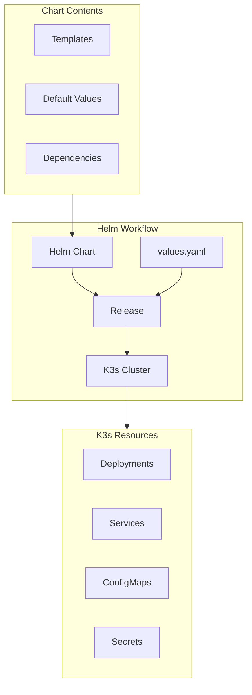
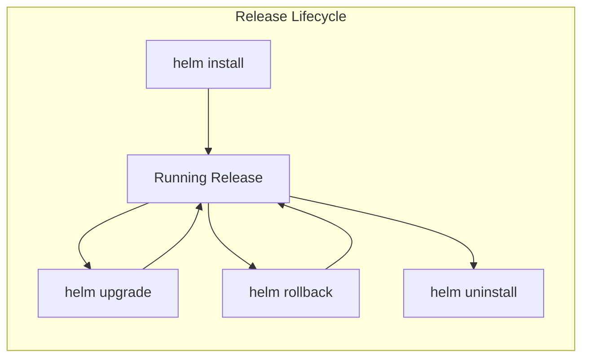
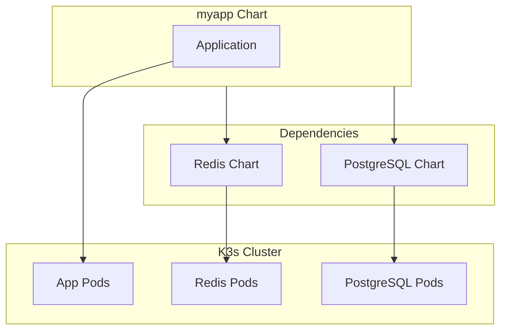
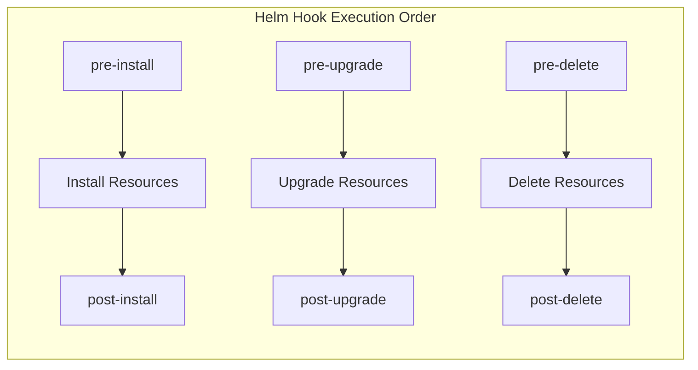
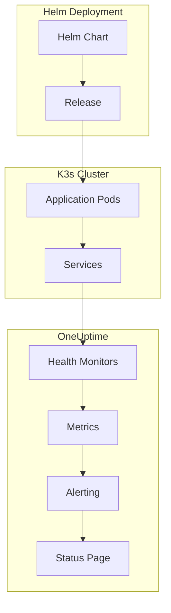

# How to Use K3s with Helm

Author: [nawazdhandala](https://www.github.com/nawazdhandala)

Tags: K3s, Helm, Kubernetes, Charts, DevOps, Package Management, Deployment, Lightweight Kubernetes

Description: A practical guide to deploying applications on K3s using Helm charts, covering installation, repository management, chart customization, and production deployment patterns.

---

> "The best tools are those that feel invisible while making complex tasks simple." - Anonymous

K3s and Helm form a powerful combination for deploying applications on lightweight Kubernetes clusters. K3s delivers a certified Kubernetes distribution in under 100MB, while Helm acts as the package manager that simplifies application deployment and management. Together, they provide an efficient workflow for developers who want Kubernetes without the overhead.

## Understanding the K3s and Helm Stack

K3s strips away unnecessary components from standard Kubernetes while maintaining full API compatibility. Helm operates as a layer on top, managing application definitions through versioned packages called charts.



### Prerequisites

Before getting started, ensure you have a K3s cluster running. Install K3s with a single command:

```bash
# Install K3s on a Linux server
curl -sfL https://get.k3s.io | sh -

# Verify the installation by checking node status
sudo k3s kubectl get nodes

# Expected output:
# NAME         STATUS   ROLES                  AGE   VERSION
# k3s-server   Ready    control-plane,master   30s   v1.28.4+k3s1
```

### Installing Helm

Helm needs to be installed on your local machine or the server where you manage the cluster:

```bash
# Download and install Helm using the official script
curl https://raw.githubusercontent.com/helm/helm/main/scripts/get-helm-3 | bash

# Verify Helm installation
helm version

# Expected output:
# version.BuildInfo{Version:"v3.14.0", GitCommit:"...", GitTreeState:"clean", GoVersion:"go1.21.5"}
```

### Configuring Helm with K3s

K3s stores its kubeconfig at a different location than standard Kubernetes. Configure Helm to use it:

```bash
# Set the KUBECONFIG environment variable for K3s
export KUBECONFIG=/etc/rancher/k3s/k3s.yaml

# Alternatively, copy the kubeconfig to the default location
mkdir -p ~/.kube
sudo cp /etc/rancher/k3s/k3s.yaml ~/.kube/config
sudo chown $(id -u):$(id -g) ~/.kube/config

# Test Helm connectivity to the cluster
helm list -A

# Expected output (empty if no releases installed):
# NAME    NAMESPACE    REVISION    UPDATED    STATUS    CHART    APP VERSION
```

## Working with Helm Repositories

Helm charts are distributed through repositories. Adding and managing repositories allows you to install applications from various sources.

### Adding Popular Repositories

```bash
# Add the official Bitnami repository for production-ready charts
helm repo add bitnami https://charts.bitnami.com/bitnami

# Add the Prometheus community repository for monitoring tools
helm repo add prometheus-community https://prometheus-community.github.io/helm-charts

# Add the Grafana repository for visualization tools
helm repo add grafana https://grafana.github.io/helm-charts

# Update all repositories to fetch the latest chart versions
helm repo update

# List all configured repositories
helm repo list
```

### Searching for Charts

```bash
# Search for nginx charts across all repositories
helm search repo nginx

# Search for a specific chart with version information
helm search repo bitnami/nginx --versions

# Search the Artifact Hub for charts (requires internet connection)
helm search hub postgresql
```

## Deploying Your First Application

Deploy a simple nginx application to understand the basic Helm workflow:

```bash
# Install nginx from the Bitnami repository
helm install my-nginx bitnami/nginx \
  --namespace web \
  --create-namespace

# Check the release status
helm status my-nginx -n web

# List all releases in the cluster
helm list -A
```

### Understanding Release Management



Each Helm release maintains a revision history, enabling rollbacks when deployments fail:

```bash
# View release history showing all revisions
helm history my-nginx -n web

# Rollback to a previous revision (revision 1 in this example)
helm rollback my-nginx 1 -n web

# Uninstall a release when no longer needed
helm uninstall my-nginx -n web
```

## Customizing Charts with Values

Charts accept configuration through values files, allowing you to customize deployments without modifying the chart itself.

### Inspecting Default Values

```bash
# View all configurable values for a chart
helm show values bitnami/nginx > nginx-defaults.yaml

# View only the README documentation
helm show readme bitnami/nginx

# View the complete chart including templates
helm show chart bitnami/nginx
```

### Creating Custom Values Files

Create a custom values file to configure your deployment:

```yaml
# nginx-values.yaml
# Custom configuration for nginx deployment on K3s

# Set the number of replicas for high availability
replicaCount: 3

# Configure resource limits appropriate for K3s lightweight clusters
resources:
  requests:
    cpu: 50m
    memory: 64Mi
  limits:
    cpu: 200m
    memory: 128Mi

# Enable the service with NodePort for K3s without LoadBalancer
service:
  type: NodePort
  nodePorts:
    http: 30080

# Configure pod anti-affinity to spread replicas across nodes
affinity:
  podAntiAffinity:
    preferredDuringSchedulingIgnoredDuringExecution:
      - weight: 100
        podAffinityTerm:
          labelSelector:
            matchLabels:
              app.kubernetes.io/name: nginx
          topologyKey: kubernetes.io/hostname

# Add custom server block configuration
serverBlock: |-
  server {
    listen 8080;
    location /health {
      return 200 'healthy';
      add_header Content-Type text/plain;
    }
  }
```

### Installing with Custom Values

```bash
# Install using the custom values file
helm install my-nginx bitnami/nginx \
  -f nginx-values.yaml \
  --namespace web \
  --create-namespace

# Override specific values from the command line
helm install my-nginx bitnami/nginx \
  -f nginx-values.yaml \
  --set replicaCount=5 \
  --set service.type=ClusterIP \
  --namespace web \
  --create-namespace
```

## Deploying a Complete Application Stack

Deploy a WordPress application with MariaDB to demonstrate multi-component deployments:

```yaml
# wordpress-values.yaml
# Production-ready WordPress configuration for K3s

# WordPress configuration
wordpressUsername: admin
wordpressPassword: ""  # Will be auto-generated and stored in a Secret
wordpressBlogName: "My K3s Blog"

# Resource allocation for the WordPress container
resources:
  requests:
    cpu: 100m
    memory: 256Mi
  limits:
    cpu: 500m
    memory: 512Mi

# Persistence configuration using K3s local-path provisioner
persistence:
  enabled: true
  storageClass: local-path
  size: 10Gi

# MariaDB configuration
mariadb:
  enabled: true
  auth:
    rootPassword: ""  # Auto-generated
    database: wordpress
    username: wordpress
    password: ""  # Auto-generated

  # Database resource limits
  primary:
    resources:
      requests:
        cpu: 100m
        memory: 256Mi
      limits:
        cpu: 500m
        memory: 512Mi

    # Database persistence
    persistence:
      enabled: true
      storageClass: local-path
      size: 8Gi

# Ingress configuration for K3s Traefik
ingress:
  enabled: true
  ingressClassName: traefik
  hostname: blog.example.com
  tls: true
  annotations:
    cert-manager.io/cluster-issuer: letsencrypt-prod
```

Deploy the WordPress stack:

```bash
# Install WordPress with all dependencies
helm install my-wordpress bitnami/wordpress \
  -f wordpress-values.yaml \
  --namespace wordpress \
  --create-namespace \
  --wait

# The --wait flag ensures the command completes only after all pods are ready
# Retrieve the auto-generated admin password
kubectl get secret my-wordpress -n wordpress \
  -o jsonpath='{.data.wordpress-password}' | base64 -d
```

## Creating Custom Helm Charts

Building custom charts allows you to package your own applications for deployment on K3s.

### Chart Structure

```bash
# Create a new chart scaffold
helm create myapp

# Directory structure created:
# myapp/
# ├── Chart.yaml          # Chart metadata
# ├── values.yaml         # Default configuration values
# ├── charts/             # Chart dependencies
# ├── templates/          # Kubernetes manifest templates
# │   ├── deployment.yaml
# │   ├── service.yaml
# │   ├── ingress.yaml
# │   ├── serviceaccount.yaml
# │   ├── hpa.yaml
# │   ├── _helpers.tpl    # Template helpers
# │   ├── NOTES.txt       # Post-install notes
# │   └── tests/
# │       └── test-connection.yaml
# └── .helmignore         # Files to ignore when packaging
```

### Defining Chart Metadata

```yaml
# myapp/Chart.yaml
# Metadata defining the chart and its dependencies

apiVersion: v2
name: myapp
description: A custom application chart for K3s deployment
type: application
version: 0.1.0
appVersion: "1.0.0"

# Chart dependencies (other charts this chart requires)
dependencies:
  - name: redis
    version: "18.x.x"
    repository: https://charts.bitnami.com/bitnami
    condition: redis.enabled

# Maintainer information
maintainers:
  - name: Your Name
    email: you@example.com

# Keywords for search
keywords:
  - myapp
  - k3s
  - custom
```

### Writing Templates

Create a deployment template that uses Helm's templating features:

```yaml
# myapp/templates/deployment.yaml
# Deployment manifest template with Helm variables

apiVersion: apps/v1
kind: Deployment
metadata:
  name: {{ include "myapp.fullname" . }}
  labels:
    {{- include "myapp.labels" . | nindent 4 }}
spec:
  {{- if not .Values.autoscaling.enabled }}
  replicas: {{ .Values.replicaCount }}
  {{- end }}
  selector:
    matchLabels:
      {{- include "myapp.selectorLabels" . | nindent 6 }}
  template:
    metadata:
      annotations:
        # Force pod restart when configmap changes
        checksum/config: {{ include (print $.Template.BasePath "/configmap.yaml") . | sha256sum }}
      labels:
        {{- include "myapp.selectorLabels" . | nindent 8 }}
    spec:
      serviceAccountName: {{ include "myapp.serviceAccountName" . }}
      securityContext:
        {{- toYaml .Values.podSecurityContext | nindent 8 }}
      containers:
        - name: {{ .Chart.Name }}
          securityContext:
            {{- toYaml .Values.securityContext | nindent 12 }}
          image: "{{ .Values.image.repository }}:{{ .Values.image.tag | default .Chart.AppVersion }}"
          imagePullPolicy: {{ .Values.image.pullPolicy }}
          ports:
            - name: http
              containerPort: {{ .Values.containerPort }}
              protocol: TCP
          # Environment variables from ConfigMap and Secrets
          envFrom:
            - configMapRef:
                name: {{ include "myapp.fullname" . }}-config
            {{- if .Values.existingSecret }}
            - secretRef:
                name: {{ .Values.existingSecret }}
            {{- end }}
          livenessProbe:
            httpGet:
              path: {{ .Values.probes.liveness.path }}
              port: http
            initialDelaySeconds: {{ .Values.probes.liveness.initialDelaySeconds }}
            periodSeconds: {{ .Values.probes.liveness.periodSeconds }}
          readinessProbe:
            httpGet:
              path: {{ .Values.probes.readiness.path }}
              port: http
            initialDelaySeconds: {{ .Values.probes.readiness.initialDelaySeconds }}
            periodSeconds: {{ .Values.probes.readiness.periodSeconds }}
          resources:
            {{- toYaml .Values.resources | nindent 12 }}
      {{- with .Values.nodeSelector }}
      nodeSelector:
        {{- toYaml . | nindent 8 }}
      {{- end }}
```

### Configuring Default Values

```yaml
# myapp/values.yaml
# Default values for myapp chart

# Number of pod replicas
replicaCount: 2

# Container image configuration
image:
  repository: myregistry/myapp
  pullPolicy: IfNotPresent
  tag: ""  # Defaults to Chart.appVersion

# Port the container listens on
containerPort: 8080

# Kubernetes Service configuration
service:
  type: ClusterIP
  port: 80

# Ingress configuration for external access
ingress:
  enabled: true
  className: traefik
  annotations: {}
  hosts:
    - host: myapp.local
      paths:
        - path: /
          pathType: Prefix
  tls: []

# Resource limits and requests
resources:
  requests:
    cpu: 100m
    memory: 128Mi
  limits:
    cpu: 500m
    memory: 256Mi

# Autoscaling configuration
autoscaling:
  enabled: false
  minReplicas: 2
  maxReplicas: 10
  targetCPUUtilizationPercentage: 80

# Health check probes
probes:
  liveness:
    path: /health
    initialDelaySeconds: 10
    periodSeconds: 10
  readiness:
    path: /ready
    initialDelaySeconds: 5
    periodSeconds: 5

# Pod security context
podSecurityContext:
  fsGroup: 1000

# Container security context
securityContext:
  runAsNonRoot: true
  runAsUser: 1000
  readOnlyRootFilesystem: true

# Environment-specific configuration
config:
  LOG_LEVEL: info
  CACHE_TTL: "300"

# Redis dependency toggle
redis:
  enabled: false
```

### Testing and Packaging Charts

```bash
# Lint the chart for common errors
helm lint myapp/

# Render templates locally to verify output
helm template myapp myapp/ -f custom-values.yaml

# Package the chart for distribution
helm package myapp/

# Output: myapp-0.1.0.tgz

# Install from the local package
helm install myapp ./myapp-0.1.0.tgz -n myapp --create-namespace
```

## Managing Dependencies

Charts can depend on other charts, enabling modular application composition:

```bash
# Update chart dependencies (downloads them to charts/ directory)
helm dependency update myapp/

# List current dependencies
helm dependency list myapp/
```



### Conditional Dependencies

Enable or disable dependencies based on values:

```yaml
# values.yaml
# Toggle dependencies based on environment

# Enable Redis for production environments
redis:
  enabled: true
  auth:
    enabled: true
    password: ""  # Auto-generated

# PostgreSQL configuration
postgresql:
  enabled: true
  auth:
    database: myapp
    username: myapp
```

## Helm Hooks for Lifecycle Management

Hooks execute jobs at specific points during a release lifecycle:

```yaml
# myapp/templates/job-db-migrate.yaml
# Database migration job that runs before upgrade

apiVersion: batch/v1
kind: Job
metadata:
  name: {{ include "myapp.fullname" . }}-db-migrate
  labels:
    {{- include "myapp.labels" . | nindent 4 }}
  annotations:
    # Run before upgrade begins
    "helm.sh/hook": pre-upgrade
    # Run before initial install
    "helm.sh/hook": pre-install
    # Set hook weight for ordering (lower runs first)
    "helm.sh/hook-weight": "-5"
    # Delete job after successful completion
    "helm.sh/hook-delete-policy": hook-succeeded
spec:
  template:
    spec:
      restartPolicy: Never
      containers:
        - name: migrate
          image: "{{ .Values.image.repository }}:{{ .Values.image.tag | default .Chart.AppVersion }}"
          command: ["./migrate.sh"]
          env:
            - name: DATABASE_URL
              valueFrom:
                secretKeyRef:
                  name: {{ include "myapp.fullname" . }}-db
                  key: url
  backoffLimit: 3
```



## Helm in K3s CI/CD Pipelines

Automate deployments using Helm in your CI/CD pipeline:

```yaml
# .github/workflows/deploy.yaml
# GitHub Actions workflow for K3s deployment

name: Deploy to K3s

on:
  push:
    branches: [main]
    paths:
      - 'helm/**'
      - 'src/**'

jobs:
  deploy:
    runs-on: ubuntu-latest
    steps:
      - uses: actions/checkout@v4

      - name: Install Helm
        uses: azure/setup-helm@v3
        with:
          version: 'v3.14.0'

      - name: Configure kubeconfig
        run: |
          mkdir -p ~/.kube
          echo "${{ secrets.KUBECONFIG }}" | base64 -d > ~/.kube/config

      - name: Update Helm dependencies
        run: helm dependency update ./helm/myapp

      - name: Deploy to K3s
        run: |
          helm upgrade --install myapp ./helm/myapp \
            --namespace production \
            --create-namespace \
            --values ./helm/myapp/values-production.yaml \
            --set image.tag=${{ github.sha }} \
            --wait \
            --timeout 5m
```

### GitOps with Helm and K3s

For production environments, consider using GitOps tools that work with Helm:

```yaml
# argocd-application.yaml
# ArgoCD Application for GitOps-driven Helm deployments

apiVersion: argoproj.io/v1alpha1
kind: Application
metadata:
  name: myapp
  namespace: argocd
spec:
  project: default
  source:
    repoURL: https://github.com/org/myapp
    targetRevision: HEAD
    path: helm/myapp
    helm:
      valueFiles:
        - values.yaml
        - values-production.yaml
  destination:
    server: https://kubernetes.default.svc
    namespace: production
  syncPolicy:
    automated:
      prune: true
      selfHeal: true
```

## Troubleshooting Helm on K3s

Common issues and their solutions when running Helm with K3s:

### Permission Denied Errors

```bash
# Issue: Cannot access K3s kubeconfig
# Error: permission denied reading /etc/rancher/k3s/k3s.yaml

# Solution: Copy kubeconfig with proper permissions
sudo cp /etc/rancher/k3s/k3s.yaml ~/.kube/config
sudo chown $(id -u):$(id -g) ~/.kube/config
chmod 600 ~/.kube/config
```

### Storage Class Issues

```bash
# Issue: PVC stuck in Pending state
# K3s uses local-path as the default storage class

# Check available storage classes
kubectl get storageclass

# Verify local-path-provisioner is running
kubectl get pods -n kube-system | grep local-path

# Use the correct storage class in values
# storageClass: local-path
```

### Debug Failed Releases

```bash
# View detailed release information
helm status myapp -n production

# Get all resources created by a release
helm get all myapp -n production

# View the computed values for a release
helm get values myapp -n production

# Check Kubernetes events for issues
kubectl get events -n production --sort-by='.lastTimestamp'

# View rendered templates for debugging
helm template myapp ./myapp --debug
```

### Fixing Stuck Releases

```bash
# Issue: Release stuck in pending-install or pending-upgrade state

# Force uninstall a stuck release
helm uninstall myapp -n production --no-hooks

# If resources remain, clean them manually
kubectl delete all -l app.kubernetes.io/instance=myapp -n production
```

## Best Practices for K3s and Helm

### Organize Values by Environment

```
helm/myapp/
├── values.yaml           # Default values
├── values-dev.yaml       # Development overrides
├── values-staging.yaml   # Staging overrides
└── values-production.yaml # Production overrides
```

### Use Semantic Versioning

```bash
# Tag releases with semantic versions
helm package myapp --version 1.2.3 --app-version 2.0.0

# Reference specific versions in deployments
helm install myapp myrepo/myapp --version 1.2.3
```

### Implement Resource Limits

K3s clusters often run on limited hardware. Always set appropriate resource constraints:

```yaml
# values-production.yaml
# Resource-conscious configuration for K3s

resources:
  requests:
    cpu: 50m
    memory: 64Mi
  limits:
    cpu: 200m
    memory: 256Mi
```

## Monitoring Helm Releases with OneUptime

Deploying applications is only half the battle. Monitoring their health ensures reliability and quick incident response.

[OneUptime](https://oneuptime.com) integrates seamlessly with K3s and Helm-deployed applications:

- **Application Health Monitoring**: Track the availability of services deployed via Helm
- **Resource Utilization**: Monitor CPU and memory usage across your Helm releases
- **Deployment Tracking**: Get notified when Helm releases succeed or fail
- **Incident Management**: Respond to issues with integrated on-call scheduling
- **Status Pages**: Communicate service status to your users during incidents



## Summary

K3s and Helm together provide a streamlined approach to Kubernetes deployments. Key points covered:

1. **Installation**: Set up Helm with K3s by configuring the correct kubeconfig path
2. **Repository Management**: Add, update, and search chart repositories
3. **Deployments**: Install, upgrade, and rollback releases with version control
4. **Customization**: Override chart defaults using values files and command-line flags
5. **Custom Charts**: Build your own charts with templates, dependencies, and hooks
6. **CI/CD Integration**: Automate deployments in pipelines and GitOps workflows
7. **Troubleshooting**: Debug common issues with K3s-specific considerations

The lightweight nature of K3s combined with Helm's package management creates an efficient workflow for teams deploying applications at any scale, from edge devices to production clusters.
