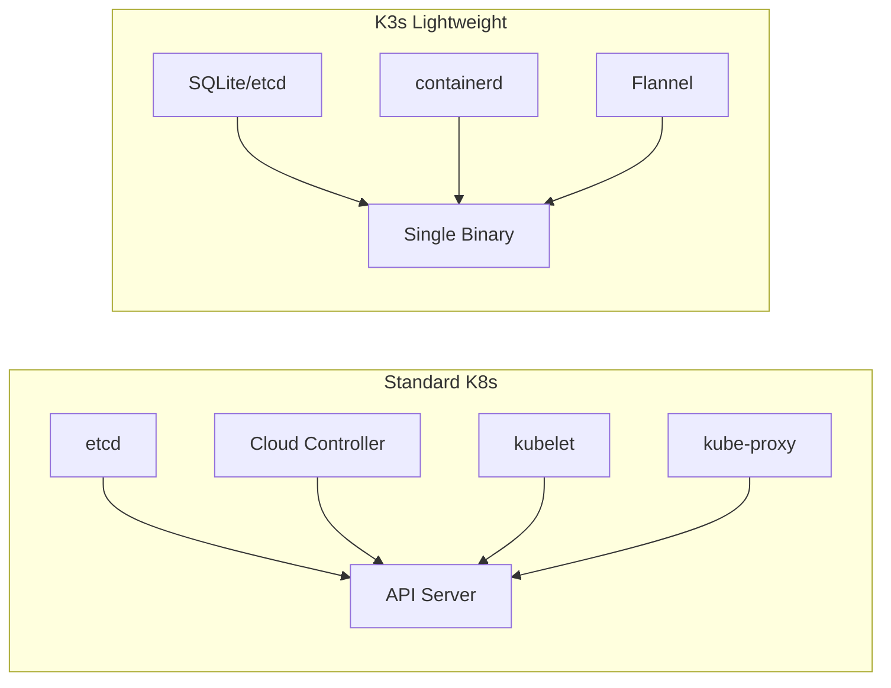
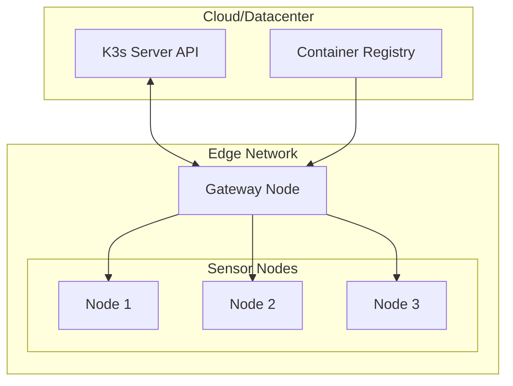
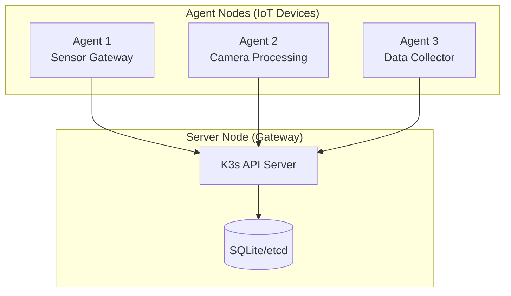

# How to Configure K3s for IoT Devices

Author: [nawazdhandala](https://www.github.com/nawazdhandala)

Tags: K3s, Kubernetes, IoT, Edge Computing, Raspberry Pi, ARM64, DevOps, Containers

Description: A practical guide to deploying and configuring K3s on IoT devices and edge hardware, covering installation, resource optimization, networking, and production best practices for resource-constrained environments.

---

Running Kubernetes on IoT devices sounds crazy until you realize K3s exists. Rancher built K3s specifically for edge computing and resource-constrained environments. A single K3s binary weighing under 100MB can transform a Raspberry Pi into a fully functional Kubernetes node.

## Why K3s for IoT?

Standard Kubernetes requires significant resources. K3s strips away unnecessary components and replaces heavy dependencies with lightweight alternatives.



### K3s vs Standard Kubernetes Resource Usage

| Component | Standard K8s | K3s |
|-----------|-------------|-----|
| Binary Size | ~1GB | ~100MB |
| RAM (Idle) | 2GB+ | 512MB |
| CPU Cores | 2+ | 1 |
| Storage | 20GB+ | 1GB |

## Hardware Requirements

K3s runs on surprisingly modest hardware. Here are the minimum specifications for different IoT use cases.

The following table outlines recommended hardware configurations based on workload type:

| Use Case | RAM | CPU | Storage | Example Device |
|----------|-----|-----|---------|----------------|
| Sensor Gateway | 512MB | 1 core | 8GB | Raspberry Pi Zero 2 W |
| Edge Processing | 1GB | 2 cores | 16GB | Raspberry Pi 4 (2GB) |
| Local Analytics | 2GB | 4 cores | 32GB | Raspberry Pi 4 (4GB) |
| ML Inference | 4GB | 4 cores | 64GB | NVIDIA Jetson Nano |

## Installing K3s on IoT Devices

### Single Node Installation

The installer script detects your architecture and downloads the appropriate binary. Run the following command on your IoT device:

```bash
# Install K3s with default settings on a single node
# The INSTALL_K3S_EXEC flag sets server-specific options
curl -sfL https://get.k3s.io | INSTALL_K3S_EXEC="--write-kubeconfig-mode 644" sh -
```

### Verify Installation

After installation completes, check that K3s is running properly:

```bash
# Check if K3s service is active
sudo systemctl status k3s

# Verify node is ready (may take 30-60 seconds)
sudo k3s kubectl get nodes

# Check system pods are running
sudo k3s kubectl get pods -n kube-system
```

### Custom Installation for Resource-Constrained Devices

For devices with limited RAM, disable unnecessary components during installation:

```bash
# Install K3s with minimal resource footprint
# Disables Traefik ingress, ServiceLB, and metrics server
curl -sfL https://get.k3s.io | INSTALL_K3S_EXEC="server \
  --disable traefik \
  --disable servicelb \
  --disable metrics-server \
  --write-kubeconfig-mode 644" sh -
```

## Optimizing K3s for IoT Workloads

### Memory Optimization

K3s defaults work well for general use, but IoT devices need tighter resource controls. Create a configuration file to tune memory usage.

Create the K3s config directory and configuration file:

```bash
# Create config directory
sudo mkdir -p /etc/rancher/k3s
```

The following configuration reduces memory pressure on resource-limited devices:

```yaml
# /etc/rancher/k3s/config.yaml
# K3s server configuration optimized for IoT devices

# Use SQLite instead of etcd for single-node deployments
# Reduces memory usage by approximately 200MB
datastore-endpoint: ""

# Limit kubelet memory usage
kubelet-arg:
  - "max-pods=30"
  - "eviction-hard=memory.available<100Mi"
  - "eviction-soft=memory.available<200Mi"
  - "eviction-soft-grace-period=memory.available=1m"
  - "system-reserved=memory=200Mi"
  - "kube-reserved=memory=150Mi"

# Disable cloud controller (not needed for edge)
disable-cloud-controller: true

# Reduce API server memory
kube-apiserver-arg:
  - "max-requests-inflight=100"
  - "max-mutating-requests-inflight=50"
```

### CPU Optimization

Limit the CPU shares allocated to system components to preserve resources for your applications:

```yaml
# Additional kubelet arguments for CPU optimization
kubelet-arg:
  - "cpu-manager-policy=static"
  - "system-reserved=cpu=100m"
  - "kube-reserved=cpu=100m"
```

## Networking for IoT Deployments

IoT devices often operate on unreliable networks. K3s networking needs special consideration for edge scenarios.



### Configuring Flannel for IoT Networks

Flannel is the default CNI in K3s. Configure it for low-bandwidth scenarios:

```yaml
# /etc/rancher/k3s/config.yaml
# Flannel backend configuration for IoT networks

flannel-backend: wireguard-native
flannel-iface: eth0

# Use host-gw mode for single L2 networks (faster, no encapsulation)
# flannel-backend: host-gw
```

### Handling Intermittent Connectivity

Edge devices may lose network connectivity. Configure K3s to handle disconnections gracefully:

```yaml
# Agent configuration for unreliable networks
# /etc/rancher/k3s/config.yaml

# Increase node lease duration for flaky connections
kubelet-arg:
  - "node-status-update-frequency=1m"

# Controller manager settings (server only)
kube-controller-manager-arg:
  - "node-monitor-period=10s"
  - "node-monitor-grace-period=5m"
  - "pod-eviction-timeout=5m"
```

## Setting Up a K3s Cluster for IoT

### Architecture Overview

A typical IoT K3s cluster has a central server and multiple lightweight agent nodes.



### Installing the Server Node

Set up the primary server node that will coordinate the cluster:

```bash
# Install K3s server with a static token for agent authentication
# The token allows agents to join the cluster securely
curl -sfL https://get.k3s.io | K3S_TOKEN=your-secure-token-here \
  INSTALL_K3S_EXEC="server \
    --node-name gateway \
    --tls-san gateway.local \
    --disable traefik \
    --write-kubeconfig-mode 644" sh -

# Retrieve the server URL for agent configuration
echo "Server URL: https://$(hostname -I | awk '{print $1}'):6443"
```

### Installing Agent Nodes

Join IoT devices to the cluster as agent nodes. Run the following on each device:

```bash
# Replace SERVER_IP with your server node IP address
# Replace TOKEN with the K3S_TOKEN from server installation
curl -sfL https://get.k3s.io | K3S_URL=https://SERVER_IP:6443 \
  K3S_TOKEN=your-secure-token-here \
  INSTALL_K3S_EXEC="agent \
    --node-name sensor-node-01 \
    --node-label role=sensor \
    --node-label location=warehouse-a" sh -
```

### Verify Cluster Status

Confirm all nodes have joined successfully:

```bash
# On the server node, list all cluster nodes
sudo k3s kubectl get nodes -o wide

# Check node labels
sudo k3s kubectl get nodes --show-labels
```

## Deploying Applications to IoT Nodes

### Using Node Selectors

Deploy workloads to specific IoT devices based on their capabilities:

```yaml
# sensor-collector.yaml
# Deploys a sensor data collector to nodes with the sensor role
apiVersion: apps/v1
kind: DaemonSet
metadata:
  name: sensor-collector
  namespace: iot-workloads
spec:
  selector:
    matchLabels:
      app: sensor-collector
  template:
    metadata:
      labels:
        app: sensor-collector
    spec:
      # Target only nodes labeled as sensors
      nodeSelector:
        role: sensor
      containers:
        - name: collector
          image: yourregistry/sensor-collector:v1.2.0
          resources:
            # Strict resource limits for IoT devices
            limits:
              memory: "128Mi"
              cpu: "100m"
            requests:
              memory: "64Mi"
              cpu: "50m"
          # Mount host device for sensor access
          volumeMounts:
            - name: i2c-device
              mountPath: /dev/i2c-1
      volumes:
        - name: i2c-device
          hostPath:
            path: /dev/i2c-1
            type: CharDevice
```

### Resource Quotas for IoT Namespaces

Prevent runaway workloads from consuming all device resources:

```yaml
# resource-quota.yaml
# Enforces resource limits across the entire namespace
apiVersion: v1
kind: ResourceQuota
metadata:
  name: iot-workload-quota
  namespace: iot-workloads
spec:
  hard:
    # Limit total memory across all pods
    requests.memory: "256Mi"
    limits.memory: "512Mi"
    # Limit total CPU
    requests.cpu: "200m"
    limits.cpu: "500m"
    # Limit number of pods
    pods: "10"
```

### Limit Ranges for Containers

Set default and maximum resource constraints for containers:

```yaml
# limit-range.yaml
# Applies default limits to containers without explicit resource specs
apiVersion: v1
kind: LimitRange
metadata:
  name: iot-container-limits
  namespace: iot-workloads
spec:
  limits:
    - type: Container
      # Default limits if not specified
      default:
        memory: "64Mi"
        cpu: "50m"
      # Default requests if not specified
      defaultRequest:
        memory: "32Mi"
        cpu: "25m"
      # Maximum allowed limits
      max:
        memory: "256Mi"
        cpu: "200m"
      # Minimum allowed requests
      min:
        memory: "16Mi"
        cpu: "10m"
```

## Storage Configuration for IoT

### Local Path Provisioner

K3s includes a local path provisioner for simple persistent storage:

```yaml
# pvc-sensor-data.yaml
# Persistent volume claim for sensor data storage
apiVersion: v1
kind: PersistentVolumeClaim
metadata:
  name: sensor-data
  namespace: iot-workloads
spec:
  accessModes:
    - ReadWriteOnce
  storageClassName: local-path
  resources:
    requests:
      storage: 1Gi
```

### Custom Storage Path

Change the default storage location to a dedicated partition or external storage:

```yaml
# /var/lib/rancher/k3s/server/manifests/local-storage.yaml
# Custom local path provisioner configuration
apiVersion: v1
kind: ConfigMap
metadata:
  name: local-path-config
  namespace: kube-system
data:
  config.json: |-
    {
      "nodePathMap": [
        {
          "node": "DEFAULT_PATH_FOR_NON_LISTED_NODES",
          "paths": ["/mnt/data/k3s-storage"]
        },
        {
          "node": "sensor-node-01",
          "paths": ["/mnt/usb-storage"]
        }
      ]
    }
```

## Security Hardening for IoT

### Restrict API Access

Limit API server access to specific networks:

```yaml
# /etc/rancher/k3s/config.yaml
# Security configuration for K3s server

# Bind API to specific interface
bind-address: "192.168.1.10"

# Enable TLS verification
tls-san:
  - "gateway.local"
  - "192.168.1.10"

# Disable anonymous authentication
kube-apiserver-arg:
  - "anonymous-auth=false"
```

### Network Policies for IoT Pods

Restrict pod communication to reduce the attack surface:

```yaml
# network-policy.yaml
# Restricts sensor pods to communicate only with the data aggregator
apiVersion: networking.k8s.io/v1
kind: NetworkPolicy
metadata:
  name: sensor-isolation
  namespace: iot-workloads
spec:
  podSelector:
    matchLabels:
      role: sensor
  policyTypes:
    - Ingress
    - Egress
  ingress:
    # Allow metrics scraping from monitoring
    - from:
        - namespaceSelector:
            matchLabels:
              kubernetes.io/metadata.name: monitoring
      ports:
        - protocol: TCP
          port: 9090
  egress:
    # Allow communication with data aggregator
    - to:
        - podSelector:
            matchLabels:
              app: data-aggregator
      ports:
        - protocol: TCP
          port: 8080
    # Allow DNS
    - to:
        - namespaceSelector:
            matchLabels:
              kubernetes.io/metadata.name: kube-system
        - podSelector:
            matchLabels:
              k8s-app: kube-dns
      ports:
        - protocol: UDP
          port: 53
```

### Pod Security Standards

Enforce security constraints on IoT workloads:

```yaml
# namespace-security.yaml
# Applies restricted security standards to the IoT namespace
apiVersion: v1
kind: Namespace
metadata:
  name: iot-workloads
  labels:
    pod-security.kubernetes.io/enforce: restricted
    pod-security.kubernetes.io/audit: restricted
    pod-security.kubernetes.io/warn: restricted
```

## Monitoring K3s on IoT Devices

### Lightweight Metrics Collection

Deploy a minimal Prometheus setup for resource-constrained environments:

```yaml
# prometheus-iot.yaml
# Minimal Prometheus deployment for IoT monitoring
apiVersion: apps/v1
kind: Deployment
metadata:
  name: prometheus
  namespace: monitoring
spec:
  replicas: 1
  selector:
    matchLabels:
      app: prometheus
  template:
    metadata:
      labels:
        app: prometheus
    spec:
      nodeSelector:
        # Run on gateway node with more resources
        node-role.kubernetes.io/master: "true"
      containers:
        - name: prometheus
          image: prom/prometheus:v2.45.0
          args:
            # Reduce memory usage
            - "--storage.tsdb.retention.time=24h"
            - "--storage.tsdb.retention.size=500MB"
            - "--config.file=/etc/prometheus/prometheus.yml"
          resources:
            limits:
              memory: "256Mi"
              cpu: "200m"
            requests:
              memory: "128Mi"
              cpu: "100m"
          volumeMounts:
            - name: config
              mountPath: /etc/prometheus
            - name: data
              mountPath: /prometheus
      volumes:
        - name: config
          configMap:
            name: prometheus-config
        - name: data
          emptyDir:
            sizeLimit: 500Mi
```

### Node Exporter DaemonSet

Collect system metrics from all IoT nodes:

```yaml
# node-exporter.yaml
# Deploys node exporter to every node in the cluster
apiVersion: apps/v1
kind: DaemonSet
metadata:
  name: node-exporter
  namespace: monitoring
spec:
  selector:
    matchLabels:
      app: node-exporter
  template:
    metadata:
      labels:
        app: node-exporter
    spec:
      hostNetwork: true
      hostPID: true
      containers:
        - name: node-exporter
          image: prom/node-exporter:v1.6.0
          args:
            # Disable collectors that are not relevant for IoT
            - "--no-collector.arp"
            - "--no-collector.bcache"
            - "--no-collector.bonding"
            - "--no-collector.infiniband"
            - "--no-collector.nfs"
            - "--no-collector.nfsd"
            - "--no-collector.zfs"
          resources:
            limits:
              memory: "32Mi"
              cpu: "50m"
            requests:
              memory: "16Mi"
              cpu: "25m"
          ports:
            - containerPort: 9100
              hostPort: 9100
```

## Automated Updates and Maintenance

### System Upgrade Controller

K3s provides automated upgrade capabilities:

```yaml
# upgrade-plan.yaml
# Automates K3s version upgrades across the cluster
apiVersion: upgrade.cattle.io/v1
kind: Plan
metadata:
  name: k3s-server-upgrade
  namespace: system-upgrade
spec:
  concurrency: 1
  version: v1.28.5+k3s1
  nodeSelector:
    matchExpressions:
      - key: node-role.kubernetes.io/master
        operator: Exists
  serviceAccountName: system-upgrade
  cordon: true
  upgrade:
    image: rancher/k3s-upgrade
---
apiVersion: upgrade.cattle.io/v1
kind: Plan
metadata:
  name: k3s-agent-upgrade
  namespace: system-upgrade
spec:
  concurrency: 2
  version: v1.28.5+k3s1
  nodeSelector:
    matchExpressions:
      - key: node-role.kubernetes.io/master
        operator: DoesNotExist
  serviceAccountName: system-upgrade
  prepare:
    # Wait for server upgrade to complete
    args:
      - prepare
      - k3s-server-upgrade
    image: rancher/k3s-upgrade
  cordon: true
  upgrade:
    image: rancher/k3s-upgrade
```

### Maintenance Windows

Schedule maintenance during low-activity periods:

```bash
# Drain a node for maintenance (on server node)
sudo k3s kubectl drain sensor-node-01 --ignore-daemonsets --delete-emptydir-data

# Perform maintenance on the device...

# Return node to service
sudo k3s kubectl uncordon sensor-node-01
```

## Troubleshooting Common Issues

### Node Not Joining Cluster

Check agent logs for connection issues:

```bash
# View K3s agent logs
sudo journalctl -u k3s-agent -f

# Verify network connectivity to server
curl -k https://SERVER_IP:6443/healthz

# Check firewall rules
sudo iptables -L INPUT -n | grep 6443
```

### High Memory Usage

Identify memory-hungry pods and components:

```bash
# Check node memory pressure
sudo k3s kubectl describe node sensor-node-01 | grep -A5 "Conditions:"

# List pods by memory usage
sudo k3s kubectl top pods -A --sort-by=memory

# Check K3s process memory
ps aux | grep k3s | grep -v grep
```

### Storage Issues

Debug local path provisioner problems:

```bash
# Check provisioner logs
sudo k3s kubectl logs -n kube-system -l app=local-path-provisioner

# Verify storage path exists
ls -la /var/lib/rancher/k3s/storage/

# Check PVC status
sudo k3s kubectl get pvc -A
```

## Production Checklist

Before deploying K3s to production IoT environments, verify these items:

- [ ] Configure resource limits for all containers
- [ ] Set up node labels for workload scheduling
- [ ] Enable network policies to restrict pod communication
- [ ] Configure persistent storage for stateful applications
- [ ] Set up monitoring and alerting
- [ ] Configure automated backups for etcd/SQLite
- [ ] Test failover scenarios
- [ ] Document recovery procedures
- [ ] Enable TLS for all API communication
- [ ] Set up log aggregation for troubleshooting

---

K3s brings Kubernetes to places where traditional orchestration was never possible. From factory floors to agricultural sensors to retail kiosks, containerized workloads can now run anywhere with minimal overhead. Start with a single node, prove your architecture works, then scale out to hundreds of edge devices with confidence.
